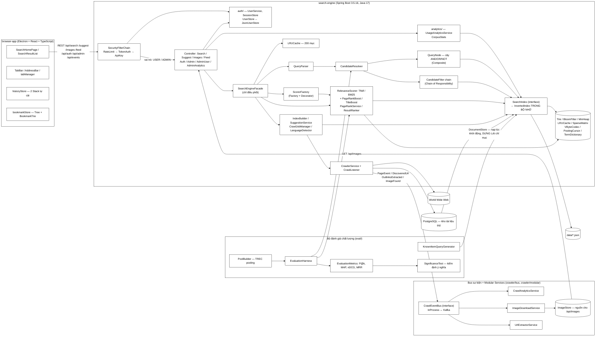
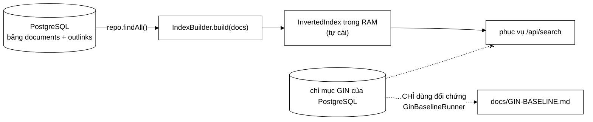
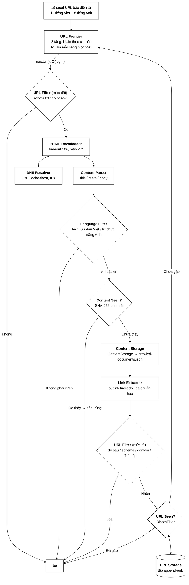
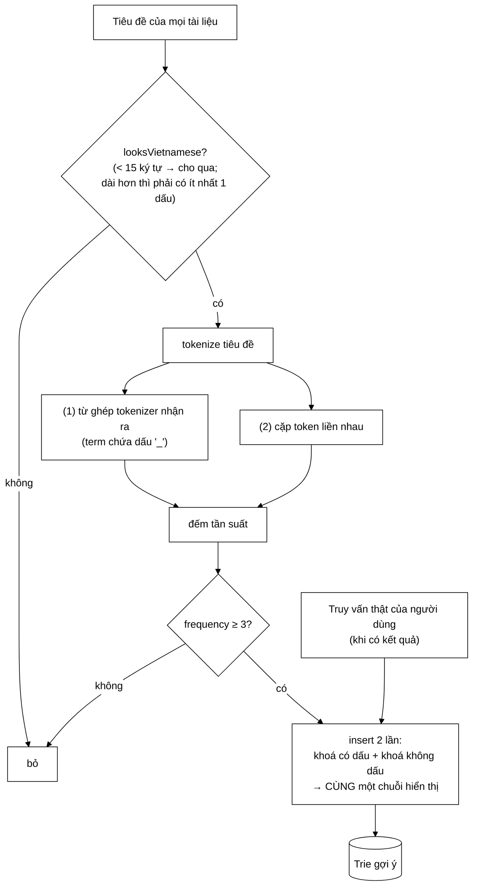
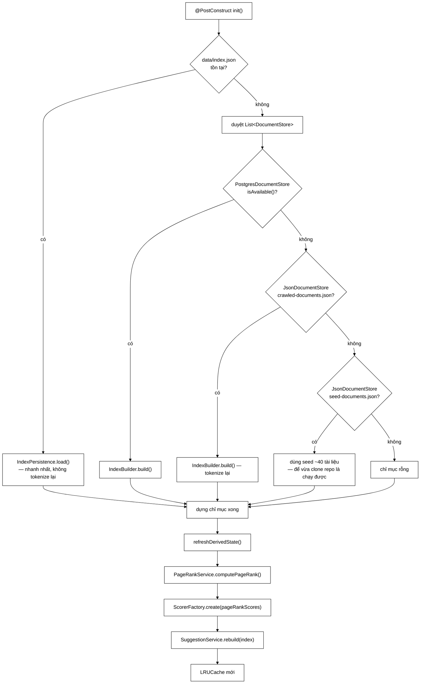

# Kiến trúc hệ thống VnSearch

> **Tài liệu này dành cho ai?** Người đã đọc `docs/Math/` (hiểu
> *tại sao* cần chỉ mục đảo, TF-IDF, PageRank) và giờ muốn biết *các mảnh
> đó được ghép lại thành một sản phẩm chạy được như thế nào*.
>
> Cách đọc: mục 1–2 cho bức tranh tổng thể, mục 3 đi theo đúng đường đi của
> một request tìm kiếm, mục 4 giải thích từng quyết định thiết kế và **lý do
> phản biện** cho nó, mục 5 là những giới hạn đã biết.

## Mục lục

1. [Ba tầng của hệ thống](#1-ba-tầng-của-hệ-thống)
2. [Sơ đồ thành phần](#2-sơ-đồ-thành-phần)
3. [Bốn luồng xử lý chính](#3-bốn-luồng-xử-lý-chính)
4. [Các quyết định thiết kế và lý do](#4-các-quyết-định-thiết-kế-và-lý-do)
5. [Bản đồ mã nguồn](#5-bản-đồ-mã-nguồn)
6. [Hạn chế kiến trúc đã biết](#6-hạn-chế-kiến-trúc-đã-biết)

---

## 1. Ba tầng của hệ thống

Đọc từ dưới lên, vì tầng dưới không biết gì về tầng trên — đó chính là điều
làm kiến trúc này kiểm thử được:

| Tầng | Ở đâu | Biết gì | KHÔNG biết gì |
|---|---|---|---|
| **Tầng cấu trúc dữ liệu** | `datastructure/`, `index/`, `query/`, `ranking/` | Thuật toán thuần: Trie, MinHeap, BM25, PageRank… | Không biết HTTP, không biết Spring, không biết có trình duyệt |
| **Tầng điều phối** | `service/SearchEngineFacade.java` | Thứ tự gọi các phase, cache, vòng đời chỉ mục | Không biết mã trạng thái HTTP, không biết React |
| **Tầng vỏ ngoài** | `controller/`, `browser-app/` | HTTP, JSON, UI | Không biết bên trong posting list là gì |

Nguyên tắc kèm theo: **mọi lớp ở tầng cấu trúc dữ liệu đều có một hàm
`main()` demo nhỏ, chạy độc lập được** mà không cần khởi động Spring, không
cần mạng, không cần cơ sở dữ liệu. Ví dụ:

```bash
cd search-engine
./mvnw.cmd -q compile exec:java -Dexec.mainClass=com.vnsearch.datastructure.MinHeap
./mvnw.cmd -q compile exec:java -Dexec.mainClass=com.vnsearch.index.VietnameseTokenizer
./mvnw.cmd -q compile exec:java -Dexec.mainClass=com.vnsearch.ranking.PageRankService
```

Đây không phải chi tiết vụn vặt: nếu một cấu trúc dữ liệu chỉ chạy được khi
cả hệ thống đã lên, thì nó đã bị trộn lẫn với hạ tầng và không còn là một
cấu trúc dữ liệu độc lập nữa.

---

## 2. Sơ đồ thành phần



> **Bus sự kiện là điểm cắt duy nhất giữa crawler và ba Modular Service.**
> `CrawlEventBus` có hai cài đặt thay thế nhau được: `InProcessCrawlEventBus`
> (mặc định — cùng tiến trình, không cần broker) và `KafkaCrawlEventBus` (ba
> service chạy ở tiến trình riêng, co giãn độc lập). Đổi giữa hai chế độ chỉ là
> một khoá cấu hình `app.crawler.bus`. Vì sao Kafka mà không phải hàng đợi công
> việc, và vì sao URL Frontier **không** bị thay:
> [`Math/09-kafka/`](Math/09-kafka/00-SO-DO-TU-DUY.md).

### Mười ba interface là "khớp nối" của sơ đồ trên

Mỗi mũi tên đi qua một trong mười ba interface tự định nghĩa, chứ không đi
thẳng tới lớp cụ thể. Đây là thứ làm sơ đồ này **thay được từng mảnh**:

| Interface | Tách *cái gì* khỏi *làm thế nào* | Cài đặt hiện có |
|---|---|---|
| `SearchIndex` | "tra posting list" | `InvertedIndex` |
| `Tokenizer` | "tách từ" | `VietnameseTokenizer` |
| `RelevanceScorer` | "chấm điểm liên quan" | `TfIdfScorer`, `BM25Scorer`, 2 Decorator |
| `DocumentStore` | "nạp corpus" | `PostgresDocumentStore`, `JsonDocumentStore` |
| `UserStore` | "lưu tài khoản ở đâu" | `JsonUserStore` |
| `CandidateFilter` | "thu hẹp ứng viên" | `DomainFilter`, `MaxCandidatesFilter` |
| `QueryNode` (`sealed`) | "đánh giá một mệnh đề" | `TermNode`, `PhraseNode`, `AndNode`, `OrNode`, `NotNode` |
| `PostingCursor` | "duyệt posting list" | `ArrayPostingCursor` |
| `CrawlListener` | "phản ứng với sự kiện crawl" | `ConsoleCrawlListener`, `ProgressBarCrawlListener`, `CheckpointCrawlListener` |
| `CrawlEventBus` | "phát tán sự kiện đi đâu" | `InProcessCrawlEventBus`, `KafkaCrawlEventBus` |
| `PageEventHandler` | "làm gì với một trang đã crawl" | 3 Modular Service |
| `Prioritizer` | "URL này ưu tiên mức mấy" | `DefaultPrioritizer` |
| `FrontQueueSelector` | "chọn hàng đợi ưu tiên nào" | `WeightedRandomSelector`, `StrictPrioritySelector` |

**Bốn interface cuối** ra đời cùng lúc với URL Frontier hai tầng và bus sự kiện
Kafka — chúng là phần mà các bản tài liệu trước bỏ sót.

Phân tích từng mẫu thiết kế:
[`Math/08-design-patterns/`](Math/08-design-patterns/README.md).
Chi tiết lắp ráp Spring: [`BACKEND.md`](BACKEND.md).

### Hai lưu ý kiến trúc quan trọng nhất

**Thứ nhất: bộ đánh giá dùng lại đúng code path của sản phẩm.**

`EvaluationHarness` gọi **chính** `QueryParser`, `CandidateResolver` và
`ResultRanker` mà tầng REST đang dùng — không có bản sao nào. Mỗi thí nghiệm
chỉ thay **đúng một** biến số: object `RelevanceScorer` được truyền vào.
Trích từ `eval/EvaluationHarness.java`:

```java
public record RankingConfig(String label, RelevanceScorer scorer) { }

public List<String> search(String queryText, RankingConfig config, int topN) {
    QueryParser.ParsedQuery parsed = queryParser.parse(queryText);
    CandidateResolver.ResolvedQuery resolved = CandidateResolver.resolve(index, parsed);
    if (resolved.candidateDocIds().isEmpty()) {
        return List.of();
    }

    List<ResultRanker.RankedResult> ranked = ranker.rank(
            resolved.candidateDocIds(), resolved.queryTermFrequency(),
            index, config.scorer(), pageRankScores, topN);   // ← biến số DUY NHẤT
    ...
}
```

Chi tiết đáng chú ý: từ khi kết hợp tín hiệu chuyển sang **Decorator**,
`RankingConfig` chỉ còn **hai** trường (`label` + `scorer`) thay vì kèm cả
bộ `alpha`/`beta`/`gamma`. Cấu hình *"BM25 + PageRank + tiêu đề"* nay là một
**object được lắp ghép**, không phải ba con số truyền rời — nên nhãn trong
bảng kết quả tự sinh ra từ chính cấu trúc object:

```java
scorer.name();   // "BM25(k1=1.2,b=0.75) + PR x0.30 + title x0.10"
```

Vì sao điều này quan trọng đến mức phải viết ra: **nếu bộ đánh giá có đường
đi riêng thì mọi con số trong báo cáo chỉ nói về đường đi đó, chứ không nói
gì về sản phẩm thật.** Đây cũng chính là lý do `CandidateResolver` tồn tại
như một lớp riêng — trước đây logic này là một phương thức `private` bên
trong `SearchEngineFacade`, nên bộ đánh giá không gọi lại được và buộc phải
viết một bản sao. Hai bản sao chắc chắn sẽ trôi lệch theo thời gian.

**Thứ hai: PostgreSQL chỉ là kho lưu trữ, không phải máy tìm kiếm.**



Khi khởi động, hệ thống **đọc tài liệu thô** từ PostgreSQL rồi **dựng lại**
chỉ mục đảo trong bộ nhớ. Chỉ mục GIN của PostgreSQL có tồn tại trong lược
đồ (`db/schema.sql`) nhưng **không tham gia phục vụ người dùng** — nó chỉ
được `GinBaselineRunner` dùng làm mốc so sánh. Lý do nêu thẳng trong
`db/schema.sql`:

> Nếu đẩy việc tìm kiếm sang full-text search của PostgreSQL thì toàn bộ
> phần cấu trúc dữ liệu tự cài, vốn là nội dung chính của đồ án, sẽ trở nên
> vô nghĩa.

Vậy vì sao vẫn cần cơ sở dữ liệu? Vì corpus 5.011 tài liệu đã tạo ra file
JSON **62 MB**. Nạp cả file đó bằng Jackson đòi hỏi giữ đồng thời **cả chuỗi
JSON lẫn cây đối tượng** trong RAM. Ở quy mô hàng chục nghìn trang thì cách
này không còn khả thi, trong khi cơ sở dữ liệu cho phép đọc theo lô.

---

## 3. Bốn luồng xử lý chính

### 3.1. Luồng CRAWL — từ web về `WebDocument`

Luồng crawl được cài đúng theo sơ đồ kiến trúc crawler kinh điển, **mỗi khối
là một lớp**:



**Thứ tự các khối không tuỳ tiện.** Ba chỗ đáng chú ý:

- `Content Seen?` đứng **trước** `Link Extractor`, nên trang trùng nội dung bị
  vứt mà không phải bóc liên kết — liên kết đó đã lấy từ bản gốc rồi.
- `Language Filter` đứng ngay sau `Content Parser` và **trước** `Content Seen?`:
  nó chỉ cần văn bản đã bóc (không cần vân tay), và trang ngoại ngữ bị vứt tại đó
  thì **không bóc liên kết**. Nếu vẫn bóc, crawler tiếp tục đi sâu vào vùng ngoại
  ngữ — một bài tiếng Trung hầu như chỉ trỏ sang bài tiếng Trung khác — để rồi
  tải hàng nghìn trang chỉ để vứt.
- `URL Filter` đứng **trước** `URL Seen?`, nên các luật rẻ chạy trước phép tra
  bộ lọc Bloom.

**Chính sách ngôn ngữ: chỉ tiếng Việt và tiếng Anh**, thi hành ở hai tuyến. Tuyến
rẻ là `UrlFilter.NON_VI_EN_HOST_PREFIXES` (`cn.`, `ru.`, `fr.`, `ko.`…), loại URL
**trước khi tải**, chỉ bằng phép so chuỗi. Tuyến chắc là `LanguageFilter`, nhận
diện theo **nội dung** sau khi tải, nên bắt được cả bài ngoại ngữ nằm lẫn trong
đường dẫn tiếng Việt. Chi tiết ba tầng bằng chứng ở `DSA-REPORT.md` mục 3.5.1.

Bản thân `URL Filter` cũng tách làm hai mức theo chi phí. Mức rẻ
(`UrlFilter.accept`) chỉ so sánh số nguyên và phân tích chuỗi, chạy cho **mọi**
liên kết bóc được — khoảng 90 lần cho mỗi trang tải về. Mức đắt
(`UrlFilter.isAllowedByRobots`) có thể phải tải `robots.txt` qua mạng, nên chỉ
chạy ngay trước khi thật sự tải một trang. Trích `crawler/CrawlerService.java`:

```java
// Chặng URL Filter -> URL Seen? -> URL Frontier, cho một liên kết vừa bóc được
private boolean enqueue(String url, int depth) {
    if (!urlFilter.accept(url, depth)) {        // URL Filter (mức rẻ)
        return false;
    }
    if (!urlSeenFilter.markSeenIfNew(url)) {    // URL Seen? -> URL Storage
        return false;
    }
    frontier.addUrl(url, depth, 1);             // URL Frontier
    return true;
}
```

Ghi nhận "đã gặp" xảy ra lúc **xếp hàng**, không phải lúc lấy ra khỏi hàng đợi:
ghi nhận muộn thì suốt khoảng thời gian URL nằm chờ, nó vẫn bị coi là chưa gặp.

**Chỗ này *không* gọi `UrlCanonicalizer.canonicalize`, và đó là có chủ đích.**
Bản đầu có gọi. Nhưng mọi đường vào `enqueue` đều đã chuẩn hoá từ trước — liên
kết đi ra từ `LinkExtractor`, hạt giống đi qua `seed()` — nên lần gọi thứ hai
chỉ lặp lại đúng kết quả cũ. Phép chuẩn hoá là *idempotent* nên không sai, chỉ
thừa; và nó thừa ở đúng chỗ chạy khoảng 90 lần cho mỗi trang tải về. Lý do đầy
đủ nằm trong Javadoc của phương thức (`CrawlerService.java:696`).

**Điểm tinh tế về điều kiện dừng.** Frontier rỗng **không** đồng nghĩa với
hết việc: một worker khác có thể đang fetch một trang và sắp thêm hàng trăm
outlink mới. Nếu thoát ngay khi thấy frontier rỗng, các worker sẽ chết dần
trong những khoảng trống tạm thời và phiên crawl dừng sớm hơn `maxPages` rất
nhiều. Cách xử lý trong `workerLoop`:

```java
int idleChecks = 0;
...
if (task == null) {
    if (activeWorkers.get() == 0 && ++idleChecks >= idleConfirmations) {
        break; // thật sự hết việc
    }
    Thread.sleep(200);
    continue;
}
idleChecks = 0; // chỉ tích luỹ khi LIÊN TỤC rỗng
```

Tức là phải thoả **đồng thời** hai điều kiện — frontier rỗng **và** không
worker nào đang xử lý — và điều đó phải đúng **3 lần liên tiếp**.

**Ba lớp khử trùng lặp, không phải một.** Nhiều người đọc code nhầm rằng chỉ
có Bloom Filter. Thực tế có ba lớp với ba vai trò khác nhau:

| Lớp | Ở đâu | Trả lời câu hỏi | Có thể sai không |
|---|---|---|---|
| `enqueued` (`HashSet<String>`) | `UrlFrontier` | "URL này đã **xếp hàng** chưa?" | Không bao giờ sai |
| `BloomFilter` | `UrlSeenFilter` | "URL này đã **gặp** chưa?" | Có thể false positive (1%) |
| Tập vân tay SHA-256 | `ContentSeenFilter` | "**Nội dung** này đã lưu chưa?" | Không sai, nhưng chỉ bắt trùng *chính xác* |

Bloom Filter được dùng ở chỗ gọi **rất nhiều lần** (394.940 outlink đều phải
hỏi) nên tiết kiệm bộ nhớ là ưu tiên; `enqueued` cần chính xác tuyệt đối để
frontier không phình vì cùng một URL vào nhiều lần.

`ContentSeenFilter` **không** dùng Bloom Filter, dù cùng là bài toán "đã thấy
chưa". Lý do nằm ở cái giá của false positive: với URL, báo nhầm "đã gặp" chỉ
làm bỏ lỡ một trang; với nội dung, báo nhầm nghĩa là **vứt hẳn một trang có
nội dung riêng** khỏi corpus. Số trang trong một phiên crawl (hàng nghìn) nhỏ
hơn nhiều số URL đã gặp (hàng trăm nghìn), nên lưu vân tay chính xác 64 ký tự
mỗi trang là chi phí chấp nhận được.

**Một lỗi tương tranh đã sửa cùng đợt này.** `BloomFilter.add` thực hiện
`bits[i] |= mask` — phép đọc-sửa-ghi không nguyên tử. Khi nhiều worker cùng gọi
`add`, hai bit khác nhau nằm trong *cùng một phần tử* `long[]` có thể làm mất
một phép ghi. Bit bị mất nghĩa là bộ lọc sinh **false negative**: báo "chưa
gặp" cho một URL đã gặp — đúng thứ mà Javadoc của `BloomFilter` khẳng định
không bao giờ xảy ra *khi dùng một luồng*. `UrlSeenFilter` bọc mọi truy cập
trong khối `synchronized` nên tính chất đó được khôi phục, đồng thời biến
"hỏi rồi ghi nhận" thành một thao tác nguyên tử.

### 3.2. Luồng INDEX — từ `WebDocument` về posting list

```mermaid
%%{init:{'theme':'base','themeVariables':{'background':'#ffffff','primaryColor':'#ffffff','primaryTextColor':'#000000','primaryBorderColor':'#000000','secondaryColor':'#ffffff','secondaryTextColor':'#000000','secondaryBorderColor':'#000000','tertiaryColor':'#ffffff','tertiaryTextColor':'#000000','tertiaryBorderColor':'#000000','lineColor':'#000000','textColor':'#000000','mainBkg':'#ffffff','nodeBorder':'#000000','clusterBkg':'#ffffff','clusterBorder':'#000000','edgeLabelBackground':'#ffffff','actorBkg':'#ffffff','actorBorder':'#000000','actorTextColor':'#000000','actorLineColor':'#000000','signalColor':'#000000','signalTextColor':'#000000','labelBoxBkgColor':'#ffffff','labelBoxBorderColor':'#000000','labelTextColor':'#000000','loopTextColor':'#000000','noteBkgColor':'#ffffff','noteBorderColor':'#000000','noteTextColor':'#000000','sequenceNumberColor':'#ffffff','fontFamily':'ui-monospace, SFMono-Regular, Consolas, monospace'}}}%%
flowchart LR
    Doc[WebDocument] --> Join["ghép title + metaDescription + bodyText"]
    Join --> Tok["VietnameseTokenizer.tokenize()"]
    Tok -->|"ghép từ bằng QHĐ, ≤ 4 tiếng<br/>+ bỏ stopword<br/>+ sinh bản không dấu"| Tokens["List&lt;Token(term, noDiacriticTerm, position)&gt;"]
    Tokens --> Group["gom vị trí theo term"]
    Group --> Append["APPEND Posting vào cuối posting list"]
    Append --> Idx["LinkedHashMap&lt;String, List&lt;Posting&gt;&gt;"]
    Idx -.->|"IndexPersistence"| Json["data/index.json"]
```



**Chi tiết hay bị bỏ sót:** cả **ba** trường văn bản được ghép lại rồi mới
tokenize — nghĩa là một từ trong tiêu đề và một từ trong thân bài vào cùng
một posting list, không phân biệt. Trích `index/InvertedIndex.java`:

```java
String combinedText = String.join(" ",
        doc.getTitle() != null ? doc.getTitle() : "",
        doc.getMetaDescription() != null ? doc.getMetaDescription() : "",
        doc.getBodyText() != null ? doc.getBodyText() : "");
```

Hệ quả: chỉ mục **không** biết term nằm ở tiêu đề hay thân bài. Việc "ưu
tiên khớp tiêu đề" được xử lý muộn hơn, ở khâu xếp hạng, bằng
`titleMatchBonus` — chứ không phải bằng trường riêng trong chỉ mục (kỹ thuật
*fielded index* mà Lucene dùng). Đây là một đơn giản hoá có ý thức.

**Bất biến quyết định toàn bộ hiệu năng phía sau:** posting list luôn sắp
xếp tăng dần theo `docId`. Nó được đảm bảo *miễn phí* vì `addDocument()`
luôn được gọi theo thứ tự `docId` tăng dần và chỉ **append** vào cuối.

Tiền đề đó nay được ép ở **hai lớp độc lập**. Lớp thứ nhất — `IndexBuilder`
gom việc sort về một chỗ duy nhất (trước đây nó bị lặp ở ba nơi):

```java
public InvertedIndex build(List<WebDocument> documents) {
    InvertedIndex index = new InvertedIndex(tokenizer);
    List<WebDocument> sorted = new ArrayList<>(documents);
    sorted.sort(Comparator.comparingInt(WebDocument::getDocId));   // ← bảo đảm bất biến
    for (WebDocument doc : sorted) {
        index.addDocument(doc);
    }
    return index;
}
```

Lớp thứ hai — `InvertedIndex` **tự ép**, ném ngoại lệ nếu bị gọi sai thứ tự:

```java
if (docId <= lastDocId) {
    throw new IllegalArgumentException(
            "addDocument phải được gọi theo docId TĂNG DẦN ...");
}
```

Không tốn một phép `sort` nào trên posting list, mà đổi lại được **ba** thứ:
giao posting list bằng two-pointer $O(m+n)$, binary search $O(\log n)$ để
tra tần suất của một tài liệu cụ thể, và **delta encoding** cho việc nén
(`VByteCodec` — hiệu giữa hai `docId` liên tiếp luôn dương và nhỏ).

### 3.3. Luồng QUERY + RANK — sơ đồ tuần tự đầy đủ

```mermaid
%%{init:{'theme':'base','themeVariables':{'background':'#ffffff','primaryColor':'#ffffff','primaryTextColor':'#000000','primaryBorderColor':'#000000','secondaryColor':'#ffffff','secondaryTextColor':'#000000','secondaryBorderColor':'#000000','tertiaryColor':'#ffffff','tertiaryTextColor':'#000000','tertiaryBorderColor':'#000000','lineColor':'#000000','textColor':'#000000','mainBkg':'#ffffff','nodeBorder':'#000000','clusterBkg':'#ffffff','clusterBorder':'#000000','edgeLabelBackground':'#ffffff','actorBkg':'#ffffff','actorBorder':'#000000','actorTextColor':'#000000','actorLineColor':'#000000','signalColor':'#000000','signalTextColor':'#000000','labelBoxBkgColor':'#ffffff','labelBoxBorderColor':'#000000','labelTextColor':'#000000','loopTextColor':'#000000','noteBkgColor':'#ffffff','noteBorderColor':'#000000','noteTextColor':'#000000','sequenceNumberColor':'#ffffff','fontFamily':'ui-monospace, SFMono-Regular, Consolas, monospace'}}}%%
sequenceDiagram
    participant User as Người dùng
    participant Home as SearchHomePage (React)
    participant API as SearchController
    participant Facade as SearchEngineFacade
    participant Cache as LRUCache
    participant QP as QueryParser
    participant CR as CandidateResolver
    participant Idx as InvertedIndex
    participant Merger as PostingListMerger
    participant Rank as ResultRanker
    participant Scorer as TfIdfScorer

    User->>Home: gõ "công nghệ" + Enter
    Home->>API: GET /api/search?q=công+nghệ&page=1&size=10
    API->>API: chuẩn hoá tham số (page ≥ 1, 1 ≤ size ≤ 100)
    API->>Facade: search(q, page, size)
    Facade->>Cache: get("công nghệ|p1|s10")

    alt cache hit
        Cache-->>Facade: SearchResponse có sẵn
        Note over Facade: trả về ngay, KHÔNG chạm chỉ mục
    else cache miss
        Facade->>QP: parse(q)
        QP-->>Facade: mustTerms / phrases / excludedTerms
        Facade->>CR: resolve(index, parsed)
        CR->>Idx: getPostings(term) cho từng term
        Idx-->>CR: posting list (đã sắp theo docId)
        Note over CR: term nào df = 0 → trả rỗng ngay<br/>(AND ngầm định)
        CR->>Merger: intersectAll(postingLists)
        Merger-->>CR: candidate docIds
        CR->>Merger: matchesPhrase (nếu có "cụm từ")
        CR->>CR: loại tài liệu chứa excludedTerms
        CR-->>Facade: ResolvedQuery(candidates, queryTermFrequency)
        Facade->>Rank: rank(candidates, ..., topN = max(page*size, size))

        loop BƯỚC 1 — mỗi candidate
            Rank->>Scorer: score(queryTermFrequency, docId, index)
            Scorer-->>Rank: score (binary search posting list)
            Note over Rank: finalScore = α·tfidf + β·pageRank + γ·titleBonus<br/>CHƯA sinh snippet
        end

        Rank->>Rank: BƯỚC 2 — MinHeap.topK(scored, topN)
        Rank->>Rank: BƯỚC 3 — buildSnippet CHỈ cho topN sống sót
        Rank-->>Facade: List&lt;RankedResult&gt;
        Facade->>Facade: cắt trang [fromIndex, toIndex)
        Facade->>Cache: put(cacheKey, response)
        Facade->>Facade: ghi truy vấn vào Trie gợi ý
    end

    Facade-->>API: SearchResponse
    API-->>Home: JSON (title/url/snippet/score/pageRankScore)
    Home->>Home: render SearchResultList, highlight <mark>
```

**Vì sao ba bước trong `ResultRanker.rank()` phải tách rời?** Đây là một lỗi
hiệu năng thật đã từng tồn tại trong dự án. Ban đầu `buildSnippet()` được gọi
**bên trong** vòng lặp chấm điểm, tức cho **mọi** ứng viên. Mỗi snippet phải
tách toàn bộ `bodyText` (trung bình **1.043 token**) rồi trượt cửa sổ qua
từng từ. Với 500 ứng viên thì **490 snippet bị tạo ra rồi vứt đi ngay**.
Tách thành ba bước hạ độ phức tạp phần snippet từ $O(c\cdot\lvert d\rvert)$ xuống
$O(\text{topN}\cdot\lvert d\rvert)$.

**Chi tiết về phân trang.** `topN = max(page * size, size)` — muốn lấy trang
3 với 10 kết quả/trang thì phải xếp hạng đủ 30 kết quả rồi mới cắt lấy 10
cuối. Đây là mô hình phân trang không trạng thái, đơn giản nhưng có nhược
điểm: trang càng sâu thì càng tốn công (vấn đề *deep paging* kinh điển).

### 3.4. Luồng SUGGEST — Trie gợi ý được xây từ đâu

Đây là phần thường bị làm sai và đáng học nhất, vì bản đầu tiên trong dự án
đã sai theo **hai** cách cùng lúc.



Hai lỗi của bản đầu, cả hai đều được ghi lại trong Javadoc của
`SuggestionService.rebuild(index)`:

1. **Chèn nguyên tiêu đề** → gợi ý ra những chuỗi dài loằng ngoằng mà không
   ai gõ hết.
2. **Chèn từng tiếng lẻ** → gợi ý ra `cong`, `the`, `kinh`. Trong tiếng
   Việt, **tiếng lẻ phần lớn không phải từ** — đây chính là vấn đề ngôn ngữ
   học đã nói ở mục 3 của `docs/Math/`, quay lại lần thứ hai ở một
   chỗ hoàn toàn khác.

Còn một lỗi thứ ba, dạng khác: `SuggestionService.rebuild()` ban đầu chỉ `insert`
thêm mà không xoá, nên tiêu đề của corpus **cũ** vẫn nằm trong Trie sau mỗi
lần crawl lại. Sửa bằng một dòng, nhưng phải hiểu vòng đời mới thấy:

```java
public void rebuild(SearchIndex index) {          // SuggestionService
    // Phải xoá sạch trước khi dựng lại: nếu chỉ insert thêm, các tiêu đề
    // của corpus CŨ vẫn còn nằm trong trie sau mỗi lần crawl/reindex.
    suggestTrie.clear();
    ...
}
```

Và `Trie.clear()` là $O(1)$ chứ không phải $O(n)$ — chỉ cần bỏ tham chiếu
tới gốc cũ là toàn bộ cây con trở thành rác cho bộ gom rác thu hồi:

```java
public void clear() {
    root = new TrieNode();
}
```

---

## 4. Các quyết định thiết kế và lý do

Mỗi mục dưới đây theo cùng một khuôn: **quyết định → phương án thay thế →
vì sao chọn thế này**. Đây là dạng câu hỏi hay bị hỏi khi bảo vệ đồ án.

### 4.1. Vì sao có `SearchEngineFacade` thay vì viết logic thẳng trong controller

| | |
|---|---|
| **Phương án thay thế** | Đặt luôn logic parse → giao posting list → rank → cache vào `SearchController` |
| **Vì sao không** | Muốn kiểm thử logic đó thì phải dựng cả tầng web (MockMvc, ApplicationContext). Test sẽ chậm và mỗi lần lỗi thì không biết lỗi ở logic hay ở tầng HTTP |
| **Kết quả** | Controller làm đúng một việc: chuẩn hoá tham số và trả mã trạng thái. `SuggestController` còn **29 dòng**, `SearchController` **51** — phần dài hơn ở `AuthController` (216) là Javadoc giải thích lựa chọn, không phải logic. Xem `SearchEngineFacadeApiTest` (8 test) gọi thẳng facade |

**Nhưng Facade rất dễ thoái hoá thành God Object** — và bản đầu của dự án
này đúng là như vậy: **420 dòng, bảy trách nhiệm**. Sáu trong số đó đã được
tách ra:

| Trách nhiệm cũ trong Facade | Nay ở | Mẫu |
|---|---|---|
| Nạp dữ liệu từ 4 nguồn (chuỗi `else if`) | `DocumentStore` + `JsonDocumentStore` / `PostgresDocumentStore`, ghép thành `List<DocumentStore>` theo thứ tự ưu tiên | Strategy |
| Dựng chỉ mục (tiền đề sort lặp ở 3 nơi) | `IndexBuilder` | — |
| Quản lý job crawl (`String status`) | `CrawlJobManager` + `CrawlStatus` | State |
| Dựng Trie gợi ý | `SuggestionService` | — |
| Đoán ngôn ngữ (`looksVietnamese`) | `LanguageDetector` | — |
| Chọn scorer (chôn cứng `new TfIdfScorer()`) | `ScorerFactory` | Factory + Decorator |

Javadoc hiện tại nói thẳng: *"Lớp này **KHÔNG chứa thuật toán DSA nào** —
mọi logic lõi nằm trong các lớp chuyên trách."* Đó là bài kiểm tra nhanh
nhất để biết một Facade còn đúng vai trò hay đã phình ra.

Phụ thuộc nay **tiêm qua constructor**, không phải `@Autowired` lên trường:

```java
public SearchEngineFacade(Tokenizer tokenizer,
                          IndexBuilder indexBuilder,
                          SuggestionService suggestionService,
                          CrawlJobManager crawlJobManager,
                          ScorerFactory scorerFactory,
                          PageRankService pageRankService) {
    // BẤT BIẾN: query parser phải dùng CHÍNH tokenizer đã dùng lúc index.
    this.queryParser = new QueryParser(tokenizer);
    this.index = new InvertedIndex(tokenizer);
    ...
}
```

Constructor injection có bốn lợi ích, nhưng lợi ích sâu nhất là lợi ích thứ
tư: **một constructor dài là tín hiệu báo động *thấy được* rằng lớp đang
gánh quá nhiều.** Field injection giấu mất tín hiệu đó.

### 4.2. Vì sao chỉ mục kép có dấu / không dấu, cùng trong **một** HashMap

| | |
|---|---|
| **Phương án thay thế** | Hai cấu trúc riêng: một chỉ mục có dấu, một chỉ mục không dấu |
| **Vì sao không** | Hai cấu trúc thì phải đồng bộ ở mọi thao tác thêm/xoá/nạp lại. Mỗi chỗ quên đồng bộ là một lỗi âm thầm |
| **Kết quả** | Cùng một `LinkedHashMap`, hai khoá trỏ tới cùng danh sách `Posting`. Truy vấn không dấu tự động hoạt động mà không có thêm một dòng code nào ở tầng truy vấn |

```java
String term = termDictionary.intern(token.term());          // <- Flyweight
positionsByTerm.computeIfAbsent(term, k -> new ArrayList<>()).add(token.position());
if (!token.noDiacriticTerm().equals(token.term())) {
    String noDiacritic = termDictionary.intern(token.noDiacriticTerm());
    positionsByTerm.computeIfAbsent(noDiacritic, k -> new ArrayList<>()).add(token.position());
}
```

Lưu ý điều kiện `if`: chỉ chèn khoá thứ hai khi bản không dấu **thật sự
khác** bản có dấu. Từ như `web` hay `robot` không có dấu nên chỉ vào chỉ mục
một lần.

**Cái giá phải trả, nói cho công bằng:** số khoá trong chỉ mục tăng lên (một
phần trong 136.768 term là bản không dấu), và `getDocumentFrequency` của một
khoá không dấu có thể lớn hơn thực tế nếu hai từ có dấu khác nhau cùng rút
về một dạng không dấu (`ngân` và `ngàn` đều thành `ngan`). Đây chính là gốc
rễ của lỗi bôi sáng snippet ở mục 4.4.

### 4.3. Vì sao `LinkedHashMap` chứ không phải `HashMap` cho chỉ mục

Chi tiết nhỏ nhưng có lý do: `IndexPersistence` ghi toàn bộ chỉ mục ra JSON.
Với `HashMap`, thứ tự khoá khi ghi ra phụ thuộc vào hàm băm nên có thể khác
nhau giữa các lần chạy, làm file JSON `diff` ra khác nhau dù nội dung logic
y hệt. `LinkedHashMap` giữ thứ tự chèn nên file ghi ra ổn định và so sánh
được giữa các lần dựng lại. Chi phí: mỗi mục thêm hai con trỏ. Độ phức tạp
tra cứu vẫn $O(1)$.

### 4.4. Vì sao khâu bôi sáng snippet **không** được bỏ dấu

Đây là ví dụ đẹp nhất trong dự án cho luận điểm "một kỹ thuật đúng ở tầng
này lại sai ở tầng khác".

Bản đầu tiên bỏ dấu mọi từ trước khi so khớp. Kết quả:
```
Truy vấn: "ngân hàng"
Snippet:  Nhiều <mark>ngân</mark> <mark>hàng</mark> cắt giảm cả <mark>ngàn</mark> nhân sự
                                                              ↑ SAI
```

`ngân` và `ngàn` bỏ dấu đều thành `ngan` nên đụng nhau. Nhưng **không thể
đơn giản bỏ hẳn việc bỏ dấu** — vì như vậy người gõ `may tinh` sẽ không
được bôi sáng `máy tính` nữa.

Quy tắc đúng, cài trong `ranking/QuerySyllables.java`: **giữ hai tập, và để
chính truy vấn quyết định dùng tập nào.**

```java
public record QuerySyllables(Set<String> exact, Set<String> loose) {

    /** Tách tập term truy vấn (có thể là từ ghép nối bằng "_") thành các tiếng. */
    public static QuerySyllables from(Set<String> terms) {
        Set<String> exact = new HashSet<>();
        Set<String> loose = new HashSet<>();
        for (String term : terms) {
            for (String syllable : term.split("_")) {
                String lower = syllable.toLowerCase(Locale.ROOT);
                if (lower.isEmpty()) {
                    continue;
                }
                exact.add(lower);
                // Chỉ mở khớp lỏng khi CHÍNH tiếng trong truy vấn không có dấu.
                if (VietnameseTokenizer.stripDiacritics(lower).equalsIgnoreCase(lower)) {
                    loose.add(lower);
                }
            }
        }
        return new QuerySyllables(exact, loose);
    }
    ...
}
```

> **`QuerySyllables` là một `record` cấp cao nhất, không phải lớp lồng trong
> `ResultRanker`.** Nó được tách ra vì có **ba** nơi dùng chung: `ResultRanker`
> (`:115`), `TitleBoostScorer` (`:73`) và `SnippetBuilder.build(...)`. Để nguyên
> làm phương thức `private` bên trong `ResultRanker` thì hai chỗ còn lại phải
> chép lại logic — đúng cái bẫy "hai bản sao chắc chắn trôi lệch" đã nói ở §2.

Diễn giải: nếu người dùng gõ `ngân` (**có** dấu) thì tiếng đó chỉ vào tập
`exact`, nên `ngàn` không khớp. Nếu người dùng gõ `ngan` (**không** dấu) thì
nó vào cả hai tập, nên khớp lỏng được bật và cả `ngân` lẫn `ngàn` đều sáng —
đúng như mong đợi, vì lúc đó chính người dùng cũng chưa phân biệt.

Nguyên tắc tổng quát: **bỏ dấu là cần ở khâu tra cứu chỉ mục, nhưng thừa và
gây sai ở khâu trình bày** — vì tới lúc đó ta đã biết chính xác người dùng
gõ gì.

### 4.5. Vì sao `LRUCache.get()` dùng **write lock**

Bẫy đồng thời kinh điển, và là câu hỏi hay để kiểm tra người viết có hiểu
cấu trúc của mình hay không.

`get()` trông như một thao tác đọc. Nhưng LRU cache phải **cập nhật thứ tự
sử dụng**, tức là di chuyển node lên đầu danh sách liên kết — đó là một
thao tác **ghi**. Nếu dùng read lock, nhiều thread cùng "đọc" sẽ cùng sửa
danh sách liên kết và làm hỏng cấu trúc.

```java
public V get(K key) {
    lock.writeLock().lock();   // ← KHÔNG phải readLock
    try {
        Node<K, V> node = map.get(key);
        if (node == null) {
            return null;
        }
        moveToFront(node);     // ← đây là lý do
        return node.value;
    } finally {
        lock.writeLock().unlock();
    }
}
```

### 4.6. Vì sao tách "chrome view" khỏi "tab view" ở Electron

`TabBar` và `AddressBar` phải **luôn** hiển thị, dù tab đang ở trang chủ tìm
kiếm hay đang tải một URL bên ngoài. Nếu để chúng nằm trong cùng một
`WebContentsView` với nội dung trang, mỗi lần chuyển tab phải vẽ lại toàn bộ
thanh công cụ. Giải pháp: một "chrome view" cố định ở trên, các "tab view"
chồng lên phía dưới và chỉ đổi view nào đang hiển thị.

### 4.7. Vì sao `historyStore` tự cài Stack thay vì dùng lịch sử native của Electron

Electron có sẵn `webContents.canGoBack()` / `goBack()`. Dự án vẫn tự cài hai
`Stack<string>` cho **mỗi tab**, hoàn toàn ở phía renderer.

Lý do là **yêu cầu của đồ án DSA**: chứng minh hiểu rõ cơ chế LIFO chứ không
chỉ biết gọi API. Nói thẳng đây là đánh đổi có chủ ý — bản native xử lý được
nhiều tình huống hơn (chuyển hướng phía server, thao tác `history.pushState`
của trang). Chi tiết đáng chú ý trong cài đặt: cần một cờ `suppressNextRecord`
để `recordNavigation` không push lại vào stack khi việc điều hướng do chính
`goBack`/`goForward` gây ra.

### 4.8. Vì sao JDBC thuần chứ không phải JPA/Hibernate

| Lý do | Giải thích |
|---|---|
| Câu SQL hiện nguyên văn | Đưa thẳng vào báo cáo được; JPA sinh SQL ngầm |
| Ghi hàng loạt | Thao tác chính là nạp ~5.000 tài liệu + ~395.000 liên kết. JDBC batch (`BATCH_SIZE = 500`) nhanh hơn hẳn việc ORM quản lý vòng đời từng entity |
| **Không kéo theo auto-config DataSource của Spring Boot** | Nhờ vậy ứng dụng vẫn chạy bình thường **khi không có** cơ sở dữ liệu — điều kiện cần để bộ test và bản demo nhanh không phụ thuộc hạ tầng |

Lý do thứ ba là quan trọng nhất về mặt kiến trúc: `app.storage.postgres.enabled`
mặc định là `false`, và `loadFromPostgres()` trả về `false` khi không kết nối
được để hệ thống **tự động lui về** dùng file JSON:

```java
} catch (Exception e) {
    System.err.println("Khong nap duoc tu PostgreSQL (" + e.getMessage() + "), dung file JSON thay the");
    return false;
}
```

### 4.9. Thứ tự ưu tiên nguồn dữ liệu khi khởi động

`SearchEngineFacade.init()` thử các nguồn theo thứ tự, dừng ở nguồn đầu tiên
thành công:



**Điểm kiến trúc đáng nói: chuỗi dự phòng nay là *dữ liệu*, không phải *cấu
trúc điều khiển*.** Trước đây đây là bốn nhánh `else if` chôn cứng trong
`init()`; nay là một `List<DocumentStore>` dựng ở một chỗ:

```java
private List<DocumentStore> buildStoreChain() {
    List<DocumentStore> chain = new ArrayList<>();
    if (postgresEnabled) {
        chain.add(new PostgresDocumentStore(postgresUrl, postgresUser, postgresPassword));
    }
    chain.add(new JsonDocumentStore(crawledDataPath, "corpus đã crawl"));
    chain.add(new JsonDocumentStore(seedDataPath, "seed mẫu"));
    return chain;
}

for (DocumentStore store : buildStoreChain()) {
    if (!store.isAvailable()) continue;
    lastCrawledDocuments = store.loadAll();
    index = indexBuilder.build(lastCrawledDocuments);
    log.info("Đã nạp corpus từ {} ({} tài liệu)", store.describe(), lastCrawledDocuments.size());
    return;
}
```

Thêm nguồn thứ tư (S3, MongoDB, Redis) = **thêm một lớp**, không sửa
`loadCorpus()`. Đó là nguyên tắc Open/Closed áp dụng đúng chỗ.

Nhánh cuối cùng (`seed-documents.json`, ~40 tài liệu thật đã crawl sẵn) là một
quyết định nhỏ nhưng có giá trị thực tế: người vừa clone repo về **có dữ liệu
tìm kiếm được ngay**, không phải chờ crawl mạng thật.

---

## 5. Bản đồ mã nguồn

Bảng này để tra khi đọc code: gói nào chịu trách nhiệm gì, và **phụ thuộc
vào** gói nào.

| Gói | Trách nhiệm | Phụ thuộc vào |
|---|---|---|
| `datastructure/` | Trie, BloomFilter, LRUCache, MinHeap, SparseMatrix | Chỉ Java Collections. **Không** phụ thuộc gói nào khác trong dự án |
| `index/` | `Tokenizer` + `VietnameseTokenizer`, `SearchIndex` + `InvertedIndex`, `Posting`, `IndexPersistence`, **`VByteCodec`**, **`PostingCursor`** + `ArrayPostingCursor`, **`TermDictionary`** | `model/` |
| `crawler/frontier/` | **URL Frontier hai tầng**: `UrlFrontier` (Facade), `Prioritizer` + `DefaultPrioritizer`, `FrontQueues`, `FrontQueueSelector` + `WeightedRandomSelector` / `StrictPrioritySelector`, `BackQueues`, `CrawlTask` | `datastructure/` (MinHeap), `crawler/` (UrlCanonicalizer) |
| `crawler/` | `CrawlerService` (điều phối), **một lớp cho mỗi khối trong sơ đồ**: `DnsResolver`, `HtmlDownloader`, `ContentParser`, `ContentSeenFilter`, `ContentStorage`, `LinkExtractor`, `UrlFilter`, `UrlSeenFilter`, `UrlStorage`; cùng **`CrawlConfig`** (Builder), **`CrawlListener`** + `ConsoleCrawlListener`, `RobotsTxtParser`, `UrlCanonicalizer`, `MultiDomainCrawlRunner` | `datastructure/`, `model/`, Jsoup |
| `query/` | `QueryParser`, `PostingListMerger`, `CandidateResolver` | `index/`, `query/ast/`, `query/filter/` |
| `query/ast/` | **`QueryNode`** (`sealed`) + `TermNode`, `PhraseNode`, `AndNode`, `OrNode`, `NotNode` | `index/`, `query/` |
| `query/filter/` | **`CandidateFilter`** + `DomainFilter`, `MaxCandidatesFilter` | `index/`, `query/`, `model/` |
| `ranking/` | `RelevanceScorer` (giao diện), `TfIdfScorer`, `BM25Scorer`, **`ScorerFactory`**, `PageRankService`, `ResultRanker`, **`SnippetBuilder`**, **`QuerySyllables`** | `index/`, `datastructure/`, `model/` |
| `ranking/decorator/` | **`PageRankBoostScorer`**, **`TitleBoostScorer`** | `ranking/`, `index/`, `model/` |
| `crawler/bus/` | **`CrawlEventBus`** + `InProcessCrawlEventBus` / `KafkaCrawlEventBus`; bốn thông điệp `PageEvent`, `DiscoveredUrl`, `OutlinksExtracted`, `ImageFound`; **`PageEventHandler`** | `model/` |
| `crawler/modular/` | Ba Modular Service: `CrawlAnalyticsService`, `ImageDownloadService`, `UrlExtractorService`; kho ảnh `ImageStore` + `ImageStorage`, `ImageQuality` | `crawler/bus/` |
| `eval/` | `EvaluationMetrics`, `KnownItemQueryGenerator`, `EvaluationHarness`, `PoolBuilder`, **`SignificanceTest`**, bốn runner CLI | `query/`, `ranking/`, `index/` |
| `storage/` | **`DocumentStore`** (giao diện) + `JsonDocumentStore`, `PostgresDocumentStore`; `DocumentRepository` (JDBC), hai runner | `model/`, JDBC |
| `service/` | `SearchEngineFacade` (chỉ điều phối) + **`IndexBuilder`**, **`SuggestionService`**, **`CrawlJobManager`** + **`CrawlStatus`**, **`LanguageDetector`** | Gần như tất cả gói trên |
| `auth/` | **Tài khoản và phiên**: **`UserStore`** (giao diện) + `JsonUserStore`, `UserService` (BCrypt cost 12, khoá tạm theo tài khoản), `SessionStore` (token mờ 256 bit, hết hạn 12 giờ), `TokenAuthFilter`, `User`, `Role` | `model/`, Spring Security |
| `analytics/` | **Số liệu quản trị**: `UsageAnalyticsService` (trong bộ nhớ, cửa sổ 24 giờ, **mọi bảng có trần**), `CorpusStats`, `UsageSnapshot`, `AdminDashboard` | `datastructure/` (BloomFilter), `index/` |
| `config/` | **12 lớp** — `SecurityConfig`, `ApiKeyAuthFilter`, `RateLimitFilter`, **`AuthConfig`**, `CorsConfig`, `GlobalExceptionHandler`, `SearchConfig`, `MetricsConfig`, `KafkaCrawlConfig`, `CrawlKafkaListeners`, `ImageStoreListener`, `ImageStorePreloader` | tất cả |
| `controller/` | **Mười** REST controller: `SearchController`, `SuggestController`, `ImageSearchController`, `FeedController`, `HealthController`, `EventController`, `AuthController`, `AdminController`, `AdminUserController`, `AdminAnalyticsController` | Chỉ `service/`, `auth/`, `analytics/` và `model/` |

> Bảng đầy đủ hơn — kèm số lớp mỗi gói và mô tả từng lớp cấu hình — nằm ở
> [`BACKEND.md` §2](BACKEND.md) và [`BACKEND.md` §4](BACKEND.md).

Điểm đáng chú ý: **`datastructure/` không phụ thuộc gì cả**. Đó là lý do
`MinHeapTest`, `TrieTest`, `BloomFilterTest`… chạy trong vài chục
milli-giây, không cần Spring.

Điểm thứ hai: hai gói con `query/ast/` và `query/filter/` tách rạch ròi theo
một **nguyên tắc phân công** viết thẳng trong Javadoc — *ràng buộc **có
posting list** thuộc về cây; ràng buộc trên **siêu dữ liệu** thuộc về đường
ống lọc*. Nhờ nguyên tắc đó, người thứ hai vào sửa biết ngay nên đặt tính
năng mới ở gói nào. Chi tiết:
[`Math/08-design-patterns/05-CHAIN-OF-RESPONSIBILITY.md`](Math/08-design-patterns/05-CHAIN-OF-RESPONSIBILITY.md).

### Hợp đồng REST — 23 endpoint

Cột **Quyền** có ba giá trị, và chúng đến từ **một** bảng duy nhất trong
`SecurityConfig` chứ không phải từ kiểm tra rải rác trong controller:
*công khai* → ai cũng gọi được; *đã đăng nhập* → cần `Authorization: Bearer`;
*ADMIN* → cần vai trò ADMIN, cấp bởi **một trong hai** filter (`TokenAuthFilter`
cho người, `ApiKeyAuthFilter` cho công cụ). Chi tiết phân quyền và lý do từng
lựa chọn: [`ACCOUNTS-AND-DASHBOARD.md`](ACCOUNTS-AND-DASHBOARD.md).

| Endpoint | Quyền | Tham số | Ghi chú |
|---|:---:|---|---|
| `GET /api/search` | công khai | `q`, `page` (mặc định 1, **trần 1.000**), `size` (mặc định 20, chặn trong [1, 100]) | Trả `SearchResponse` gồm `totalResults`, `timeTakenMs`, `droppedTerms` (các term hệ thống đã tự bỏ để tìm được kết quả), và danh sách kết quả kèm `score` / `pageRankScore` để bật chế độ debug trên UI |
| `GET /api/suggest` | công khai | `prefix` (**bắt buộc** — không phải `q`), `limit` (mặc định 10) | Trả `{"suggestions": [...]}` |
| `GET /api/images` | công khai | `q`, `page` (mặc định 1, trần 100), `size` (mặc định 30, trần 100) | Trả `results[]`, `hasMore`, `pagesScanned` — nguồn là `ImageStore` |
| `GET /api/feed` | công khai | `seed` (mặc định 0), `page` (mặc định 1, trần 100), `size` (mặc định 12, trần 50) | **Duyệt** chỉ mục theo `docId`, không qua truy vấn |
| `GET /api/health` | công khai | — | `200` khi chỉ mục có tài liệu, **`503` khi rỗng** |
| `POST /api/events` | công khai | body `{type, sessionId, query?, url?, position?, …}` | `204`. Chiều **GHI** của số liệu sử dụng — mở có chủ ý, vì cú bấm vào kết quả không đi qua máy chủ. Danh tính lấy từ ngữ cảnh bảo mật, **không** từ thân request |
| `POST /api/auth/register` | công khai | body `{username, password}` | `201`. **Luôn** tạo vai trò `USER` — `register()` không nhận tham số vai trò |
| `POST /api/auth/login` | công khai | body `{username, password}` | `{token, expiresAt, user}`. `401` khi sai, **không phân biệt** sai tên hay sai mật khẩu |
| `GET /api/auth/me` | đã đăng nhập | — | Nguồn sự thật về "tôi là ai" |
| `POST /api/auth/password` | đã đăng nhập | body `{currentPassword, newPassword}` | Vẫn phải nhập mật khẩu **hiện tại** — chặn kịch bản token bị đánh cắp. Đóng mọi phiên **khác** |
| `POST /api/auth/logout` | công khai¹ | — | `204`. Huỷ phiên tại đây, hiệu lực **ngay** |
| `POST /api/auth/logout-all` | đã đăng nhập | — | Đóng **mọi** phiên, kể cả phiên đang gọi |
| `POST /api/admin/crawl` | ADMIN | body `{seedUrls, maxDepth, maxPages}` | Trả `jobId` ngay, crawl chạy nền. **Endpoint rủi ro nhất** (SSRF) |
| `GET /api/admin/crawl/{jobId}/status` | ADMIN | — | `status`, `pagesCrawled`, `queueSize` |
| `POST /api/admin/reindex` | ADMIN | — | Dựng lại chỉ mục + PageRank + Trie + xoá cache |
| `GET /api/admin/stats` | ADMIN | — | `totalDocuments`, `totalTerms`, `indexSizeBytes`, `cacheHitRate`, `bloomFilterBits`, `scorer` |
| `GET /api/admin/analytics` | ADMIN | `top` (mặc định 10) | **Một** JSON gộp bốn khối: `traffic`, `crawl`, `index`, `accounts` — một lời gọi chứ không phải bốn, để bốn khối cùng một thời điểm |
| `POST /api/admin/analytics/reset` | ADMIN | — | `204`. Xoá số liệu lưu lượng, **không** đụng chỉ mục |
| `GET /api/admin/users` | ADMIN | — | **Không** kèm hash mật khẩu — `User.toPublic()` là ranh giới ra ngoài |
| `POST /api/admin/users/{tên}/role` | ADMIN | body `{role}` | Đóng mọi phiên của người bị đổi. Không tự hạ quyền chính mình |
| `POST /api/admin/users/{tên}/disable` | ADMIN | — | Giữ dữ liệu, chỉ chặn đăng nhập |
| `POST /api/admin/users/{tên}/enable` | ADMIN | — | |
| `DELETE /api/admin/users/{tên}` | ADMIN | — | `404` nếu không có, `400` nếu tự xoá chính mình |

¹ `/api/auth/logout` cố ý để **công khai**: trước đó nó nằm trong nhóm
`.authenticated()`, nên một token đã hết hạn thì không đăng xuất nổi — người
dùng kẹt ở trạng thái "không vào được mà cũng không thoát được".

**Hai chỗ dễ gõ sai, nói trước cho đỡ mất thời gian:**

- `/api/suggest` nhận **`prefix`**, không phải `q`. Đây là endpoint duy nhất
  lệch khỏi quy ước `q` của các endpoint còn lại, vì nó không chạy truy vấn mà
  tra tiền tố trên Trie — tham số được đặt tên theo đúng việc nó làm. Gõ `?q=`
  sẽ nhận `400 Thieu tham so bat buoc: prefix`.
- `/api/feed` có tham số **`seed`** không hiển nhiên. Bảng tin trả về các tài
  liệu theo một **hoán vị ngẫu nhiên** của `docId`; `seed` chính là hạt giống
  của hoán vị đó. Cùng `seed` thì cùng thứ tự, nên lô `page=2` nối đúng vào
  đuôi `page=1`. Đổi `seed` (hoặc bỏ trống, mặc định `0`) là xáo lại từ đầu.
  Nhờ vậy máy chủ **không phải nhớ gì** giữa các lần gọi — xem
  `FeedController.java:107`.

Ví dụ gọi thật: xem [`api-examples.http`](api-examples.http). Phân quyền và lý
do từng lựa chọn: [`SECURITY.md` §5](SECURITY.md).

---

## 6. Hạn chế kiến trúc đã biết

Nêu ra để người đọc không phải tự phát hiện, và để biết chỗ nào đáng làm
tiếp:

1. **Chỉ mục nằm hoàn toàn trong bộ nhớ một tiến trình.** Không có sharding,
   không có replica. Muốn scale thì phải chia chỉ mục theo term hoặc theo
   tài liệu và thêm một tầng gộp kết quả.
2. **Reindex là thao tác "tất cả hoặc không gì".** `reindex()` dựng lại toàn
   bộ chỉ mục rồi thay thế bằng một phép gán `volatile`. Không có cập nhật
   tăng dần: thêm một tài liệu cũng phải dựng lại tất cả.
3. **Cache bị xoá trắng sau mỗi lần crawl/reindex** (`searchCache = new LRUCache<>(cacheSize)`).
   Đúng về tính nhất quán nhưng gây một đợt cache miss dồn dập ngay sau đó.
4. **Chỉ mục không có trường (không *fielded*).** Tiêu đề, meta description
   và thân bài bị ghép làm một trước khi tokenize (xem mục 3.2), nên không
   thể tính điểm khác nhau cho từng vùng văn bản.
5. **Phân trang sâu tốn công tuyến tính.** `topN = page * size` nghĩa là
   trang 100 phải xếp hạng 1.000 kết quả.
6. **`Content Seen?` chỉ bắt trùng *chính xác*.** `ContentSeenFilter` so vân
   tay SHA-256 của thân bài đã chuẩn hoá, nên gom được cùng một bài nằm ở
   nhiều URL khác nhau. Nhưng chỉ cần khác một ký tự — một dòng "cập nhật lúc
   14:05", một banner lọt vào phần thân — là hai vân tay khác nhau và bản
   trùng lọt lưới. Bắt trùng **gần đúng** cần SimHash + khoảng cách Hamming
   hoặc MinHash trên tập shingle, chưa cài.
7. **`nextUrl()` quét tuyến tính qua các host** — $O(D)$. Với 52 host thì
   không sao; web thật có khoảng 200 triệu host thì cần hàng đợi ưu tiên
   theo *thời điểm khả dụng tiếp theo*.
8. **Toán tử `-` chỉ loại trừ một tiếng**, không loại trừ cả cụm từ ghép.
9. **`MaxCandidatesFilter` không bảo toàn top-K chính xác.** Nó cắt 10.000
   ứng viên đầu tiên **theo `docId`**, không theo điểm — là một chặn trên an
   toàn để bảo vệ hệ thống khỏi truy vấn bất thường, **không phải** một tối
   ưu xếp hạng. Cách chuẩn của ngành là **WAND** hoặc **MaxScore**. Javadoc
   của lớp nói rõ điều này.
10. **Chưa có migration cho lược đồ CSDL.** `schema.sql` được áp bằng tay và có
    hai bản (`src/main/resources/db/` và `deploy/k8s/base/`) mà CI phải canh cho
    khỏi lệch. Flyway hoặc Liquibase là bước hợp lý tiếp theo.

### Những hạn chế đã được khắc phục

Ghi lại để đối chiếu với các bản tài liệu cũ:

| Hạn chế cũ | Cách khắc phục |
|---|---|
| Chỉ mục là lớp cụ thể, không thay được | Interface `SearchIndex` — 4 lớp dùng nó nay phụ thuộc trừu tượng |
| Bất biến sắp xếp phụ thuộc người gọi nhớ | `InvertedIndex` **tự ép**, `IndexBuilder` gom tiền đề về một chỗ |
| Không nén chỉ mục | `VByteCodec` — delta + variable-byte, tiết kiệm > 66 % |
| Không có skip pointer | `PostingCursor.skipTo` — galloping search, 4005 → 48 bước |
| Chuỗi nguồn dữ liệu là 4 nhánh `else if` | `List<DocumentStore>` — thêm nguồn = thêm một lớp |
| Trạng thái job crawl là `String` | `enum CrawlStatus` có máy trạng thái |
| `Trie` không thread-safe | `ReentrantReadWriteLock` |
| Snippet có lỗ hổng XSS | `SnippetBuilder.escapeHtml` |
| Kết hợp tín hiệu sai thang đo 1000× | Decorator, nhân + log thay vì cộng |
| **Tách từ tham lam (Longest Matching)** | **`MaxWeightSegmenter` — quy hoạch động cực đại trọng số trên DAG** |
| **Từ điển từ ghép chỉ 154 mục** | **`vietnamese-words.txt` — 49.793 mục, trong đó 40.390 từ ghép** |
| Crawler chốt cứng vào ba service | `CrawlEventBus` — đổi in-process ↔ Kafka bằng một khoá cấu hình |
| `navigate()` của Electron nhận mọi scheme | `urlPolicy.ts` — danh sách cho phép `http`/`https` |
| Frontend không có test nào | 128 bài Vitest, chạy trong CI |

Phân tích đầy đủ hơn về những điểm vỡ ở quy mô lớn: mục 13 của
`docs/Math/`. Số liệu đo và Big-O: `DSA-REPORT.md`. Từng mẫu thiết
kế và lỗi mà nó sửa: [`Math/08-design-patterns/`](Math/08-design-patterns/README.md).

---

## Tài liệu liên quan

Tài liệu được chia theo **câu hỏi cần trả lời**, không theo thư mục mã nguồn:

| Câu hỏi | Tài liệu |
|---|---|
| *Thuật toán bên trong hoạt động ra sao?* | [`Math/`](Math/README.md) — **một trang cho mỗi lớp**, kèm ví dụ tính tay |
| *Mẫu thiết kế nào, sửa lỗi gì?* | [`Math/08-design-patterns/`](Math/08-design-patterns/README.md) — 12 trang, mỗi mẫu một trang |
| *Big-O và số đo thực nghiệm?* | [`DSA-REPORT.md`](DSA-REPORT.md) |
| **Ứng dụng Spring được lắp ra sao?** | [`BACKEND.md`](BACKEND.md) |
| **Chạy ở đâu, ai canh nó?** | [`INFRASTRUCTURE.md`](INFRASTRUCTURE.md) |
| **Mã đi từ máy tới cụm bằng cách nào?** | [`DEVOPS.md`](DEVOPS.md) |
| **Chống lại cái gì, bằng cách nào?** | [`SECURITY.md`](SECURITY.md) |
| *Giao diện Electron?* | [`FRONTEND.md`](FRONTEND.md) |
| *Chất lượng tìm kiếm đo bằng gì?* | [`EVALUATION.md`](EVALUATION.md) |
| *So với PostgreSQL GIN thì sao?* | [`GIN-BASELINE.md`](GIN-BASELINE.md) |
| *Phương án nào đã bị bác bỏ, vì sao?* | [`SO-SANH-PHUONG-AN.md`](SO-SANH-PHUONG-AN.md) |
| *Gọi API thật thế nào?* | [`api-examples.http`](api-examples.http) |
