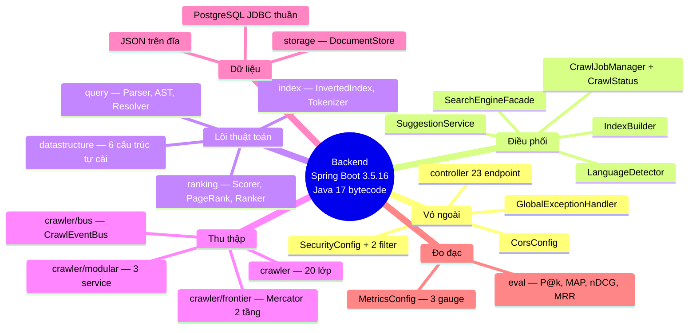
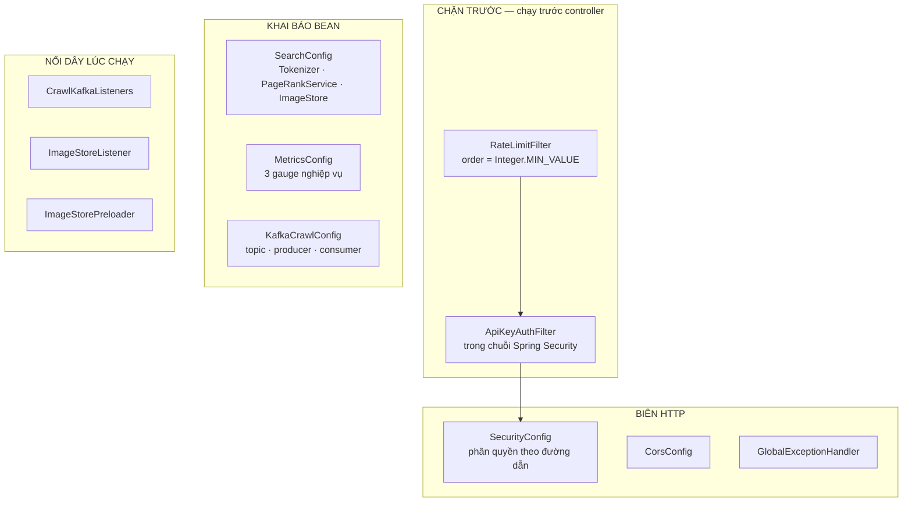
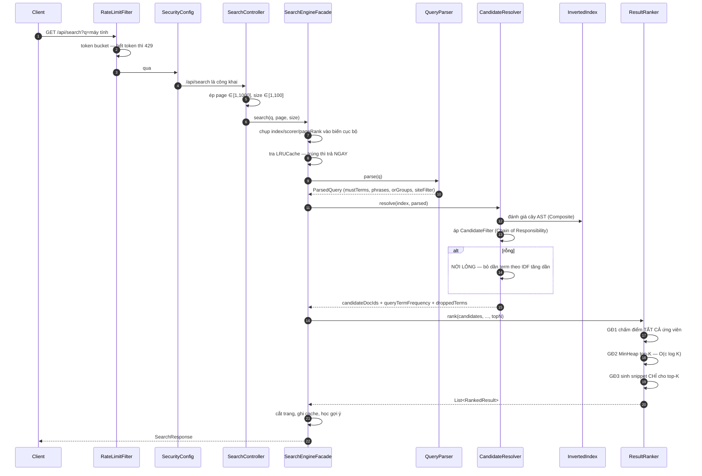

# Backend — ứng dụng Spring Boot

> **Tài liệu này trả lời:** ứng dụng Spring Boot được lắp ráp như thế nào — bean
> nào tồn tại, cấu hình đến từ đâu, một request đi qua những tầng nào, và trạng
> thái sống ở chỗ nào.
>
> **Phân công với các tài liệu khác** — đây là ranh giới cố ý, đọc trước để khỏi
> đi nhầm chỗ:
>
> | Câu hỏi | Đọc |
> |---|---|
> | *Thuật toán bên trong hoạt động ra sao?* | [`Math/`](Math/README.md), [`DSA-REPORT.md`](DSA-REPORT.md) |
> | *Các mảnh ghép lại thành hệ thống thế nào?* | [`ARCHITECTURE.md`](ARCHITECTURE.md) |
> | **Ứng dụng Spring được lắp ra sao?** | **trang này** |
> | *Chạy ở đâu, ai canh nó?* | [`INFRASTRUCTURE.md`](INFRASTRUCTURE.md) |
> | *Mã đi từ máy tới cụm bằng cách nào?* | [`DEVOPS.md`](DEVOPS.md) |
> | *Chống lại cái gì, bằng cách nào?* | [`SECURITY.md`](SECURITY.md) |
> | *Giao diện Electron?* | [`FRONTEND.md`](FRONTEND.md) |

**Số liệu đo trên cây mã hiện tại:** 21.162 dòng Java (main), 7.928 dòng test,
145 lớp, 12 interface, 32 record, 6 REST controller, 11 lớp cấu hình.
`./mvnw -B clean verify` → **528 test xanh**, SpotBugs **0 bug**, ~43 giây.

---

## Mục lục

1. [Bản đồ tư duy toàn tầng backend](#1-bản-đồ-tư-duy-toàn-tầng-backend)
2. [Mười ba gói và trách nhiệm](#2-mười-ba-gói-và-trách-nhiệm)
3. [Mười hai interface — các mối nối](#3-mười-hai-interface--các-mối-nối)
4. [Tầng cấu hình: 11 lớp trong `config/`](#4-tầng-cấu-hình-11-lớp-trong-config)
5. [Tầng controller: 23 endpoint](#5-tầng-controller-23-endpoint)
6. [Tầng service: điều phối](#6-tầng-service-điều-phối)
7. [Tầng storage: ba nguồn dữ liệu](#7-tầng-storage-ba-nguồn-dữ-liệu)
8. [Vòng đời một request tìm kiếm](#8-vòng-đời-một-request-tìm-kiếm)
9. [Trạng thái sống ở đâu](#9-trạng-thái-sống-ở-đâu)
10. [Cấu hình — toàn bộ khoá](#10-cấu-hình--toàn-bộ-khoá)
11. [Giới hạn đã biết](#11-giới-hạn-đã-biết)

---

## 1. Bản đồ tư duy toàn tầng backend



Sơ đồ dạng chữ, cho nơi không dựng được Mermaid:
```
                        ┌──────────────────────────────┐
   HTTP ───────────────▶│  controller/  (23 endpoint)  │
                        │  + GlobalExceptionHandler    │
                        └──────────────┬───────────────┘
   ┌────────────────────────────────────┼──────────────────────┐
   │ config/  (11 lớp — CHẶN TRƯỚC)     │                      │
   │   RateLimitFilter  ─┐              │                      │
   │   ApiKeyAuthFilter ─┴─▶ chạy TRƯỚC controller             │
   │   SecurityConfig, CorsConfig, MetricsConfig, SearchConfig │
   │   KafkaCrawlConfig, CrawlKafkaListeners, ImageStore*2     │
   └────────────────────────────────────┼──────────────────────┘
                        ┌──────────────▼───────────────┐
                        │  service/SearchEngineFacade  │
                        │  CHỈ điều phối — 0 thuật toán│
                        └──────┬─────────────────┬─────┘
              ┌────────────────┘                 └──────────────┐
   ┌──────────▼──────────┐                        ┌─────────────▼────────┐
   │ query/              │                        │ ranking/             │
   │  QueryParser        │                        │  ScorerFactory       │
   │  CandidateResolver  │                        │  RelevanceScorer     │
   │  ast/   (Composite) │                        │  decorator/ ×2       │
   │  filter/ (CoR)      │                        │  ResultRanker        │
   └──────────┬──────────┘                        └─────────────┬────────┘
              └───────────────┬────────────────────────────────┘
                   ┌──────────▼──────────┐
                   │ index/SearchIndex   │◀── storage/DocumentStore
                   │   InvertedIndex     │        ├─ PostgresDocumentStore
                   └──────────┬──────────┘        └─ JsonDocumentStore ×2
                   ┌──────────▼──────────┐
                   │ datastructure/      │  Trie · BloomFilter · MinHeap
                   │ KHÔNG phụ thuộc gì  │  LRUCache · SparseMatrix · SyllableTrie
                   └─────────────────────┘
```

**Đọc sơ đồ theo chiều nào.** Từ dưới lên. Tầng dưới không biết gì về tầng
trên — `datastructure/` không biết Spring tồn tại, `index/` không biết HTTP là
gì. Đó chính là thứ làm mỗi tầng kiểm thử được độc lập, và là lý do
`MinHeapTest` chạy trong vài chục mili-giây thay vì phải dựng cả một
`ApplicationContext`.

---

## 2. Mười ba gói và trách nhiệm

| Gói | Lớp | Trách nhiệm | Phụ thuộc |
|---|---:|---|---|
| `datastructure/` | 6 | `Trie`, `BloomFilter`, `LRUCache`, `MinHeap`, `SparseMatrix`, `SyllableTrie` | **Không gì cả** — chỉ Java Collections |
| `model/` | 3 | `WebDocument`, `SearchResult`, `SearchResponse` | — |
| `index/` | 14 | `SearchIndex`+`InvertedIndex`, `Tokenizer`+`VietnameseTokenizer`, `MaxWeightSegmenter`, `VietnameseWordDictionary`, `VByteCodec`, `CompressedPostings`, `CompressedText`, `TermDictionary`, `PostingCursor`+`ArrayPostingCursor`, `Posting`, `IndexPersistence` | `model/`, `datastructure/` |
| `query/` | 3 | `QueryParser`, `PostingListMerger`, `CandidateResolver` | `index/` |
| `query/ast/` | 6 | `QueryNode` (`sealed`) + `TermNode`, `PhraseNode`, `AndNode`, `OrNode`, `NotNode` — **Composite** | `index/` |
| `query/filter/` | 3 | `CandidateFilter` + `DomainFilter`, `MaxCandidatesFilter` — **Chain of Responsibility** | `index/`, `model/` |
| `ranking/` | 8 | `RelevanceScorer`, `TfIdfScorer`, `BM25Scorer`, `ScorerFactory`, `PageRankService`, `ResultRanker`, `SnippetBuilder`, `QuerySyllables` | `index/`, `datastructure/` |
| `ranking/decorator/` | 2 | `PageRankBoostScorer`, `TitleBoostScorer` — **Decorator** | `ranking/` |
| `crawler/` | 20 | `CrawlerService` + một lớp cho mỗi khối trong sơ đồ crawler: `DnsResolver`, `HtmlDownloader`, `ContentParser`, `LinkExtractor`, `UrlFilter`, `UrlSeenFilter`, `ContentSeenFilter`, `RobotsTxtParser`, `UrlCanonicalizer`, `LanguageFilter`, `SeedUrlValidator`, `CrawlConfig` (**Builder**), `CrawlListener` + 3 cài đặt | `datastructure/`, `model/`, Jsoup |
| `crawler/frontier/` | 9 | URL Frontier hai tầng kiểu Mercator: `UrlFrontier`, `FrontQueues`, `BackQueues`, `Prioritizer`+`DefaultPrioritizer`, `FrontQueueSelector`+`WeightedRandomSelector`/`StrictPrioritySelector`, `CrawlTask` | `datastructure/` (MinHeap) |
| `crawler/bus/` | 8 | `CrawlEventBus` + `InProcessCrawlEventBus` / `KafkaCrawlEventBus`; 4 thông điệp `PageEvent`, `DiscoveredUrl`, `OutlinksExtracted`, `ImageFound`; `PageEventHandler` | `model/` |
| `crawler/modular/` | 6 | Ba Modular Service — `CrawlAnalyticsService`, `ImageDownloadService`, `UrlExtractorService`; kho ảnh `ImageStore` + `ImageStorage`, `ImageQuality` | `crawler/bus/` |
| `eval/` | 9 | `EvaluationMetrics`, `EvaluationHarness`, `KnownItemQueryGenerator`, `PoolBuilder`, `SignificanceTest`, 4 runner CLI | `query/`, `ranking/`, `index/` |
| `storage/` | 6 | `DocumentStore` + `JsonDocumentStore`, `PostgresDocumentStore`; `DocumentRepository` (JDBC thuần), 2 runner | `model/`, JDBC |
| `service/` | 6 | `SearchEngineFacade` (**Facade**), `IndexBuilder`, `SuggestionService`, `CrawlJobManager` + `CrawlStatus` (**State**), `LanguageDetector` | gần như tất cả |
| `config/` | 11 | Xem [§4](#4-tầng-cấu-hình-11-lớp-trong-config) | tất cả |
| `controller/` | 6 | Xem [§5](#5-tầng-controller-6-endpoint) | chỉ `service/`, `model/` |

> **Điểm đáng chú ý nhất của bảng này:** `datastructure/` phụ thuộc **không gì
> cả**. Nếu một cấu trúc dữ liệu chỉ chạy được khi cả hệ thống đã lên, thì nó đã
> bị trộn với hạ tầng và không còn là một cấu trúc dữ liệu độc lập nữa.

Kiểm chứng được: mọi lớp trong `datastructure/`, `index/`, `ranking/` đều có một
hàm `main()` demo chạy độc lập, không cần Spring, không cần mạng, không cần CSDL.

```bash
cd search-engine
./mvnw -q compile exec:java -Dexec.mainClass=com.vnsearch.datastructure.MinHeap
./mvnw -q compile exec:java -Dexec.mainClass=com.vnsearch.index.VietnameseTokenizer
./mvnw -q compile exec:java -Dexec.mainClass=com.vnsearch.ranking.PageRankService
```

---

## 3. Mười hai interface — các mối nối

Mỗi mũi tên trong sơ đồ §1 đi qua một interface tự định nghĩa, chứ không đi
thẳng tới lớp cụ thể. Đây là thứ làm từng mảnh **thay được**.

| Interface | Tách *cái gì* khỏi *làm thế nào* | Cài đặt hiện có | Mẫu |
|---|---|---|---|
| `SearchIndex` | "tra posting list" | `InvertedIndex` | — |
| `Tokenizer` | "tách từ" | `VietnameseTokenizer` | Strategy |
| `RelevanceScorer` | "chấm điểm liên quan" | `TfIdfScorer`, `BM25Scorer` + 2 Decorator | Strategy |
| `DocumentStore` | "nạp corpus" | `PostgresDocumentStore`, `JsonDocumentStore` ×2 | Strategy |
| `PostingCursor` | "duyệt posting list" | `ArrayPostingCursor` | Iterator |
| `QueryNode` (`sealed`) | "đánh giá một mệnh đề" | `TermNode`, `PhraseNode`, `AndNode`, `OrNode`, `NotNode` | Composite |
| `CandidateFilter` | "thu hẹp ứng viên" | `DomainFilter`, `MaxCandidatesFilter` | Chain of Responsibility |
| `CrawlListener` | "phản ứng với sự kiện crawl" | `ConsoleCrawlListener`, `ProgressBarCrawlListener`, `CheckpointCrawlListener` | Observer |
| `CrawlEventBus` | "phát tán sự kiện đi đâu" | `InProcessCrawlEventBus`, `KafkaCrawlEventBus` | Strategy |
| `PageEventHandler` | "làm gì với một trang đã crawl" | 3 Modular Service | Observer |
| `Prioritizer` | "URL này ưu tiên mức mấy" | `DefaultPrioritizer` | Strategy |
| `FrontQueueSelector` | "chọn hàng đợi ưu tiên nào" | `WeightedRandomSelector`, `StrictPrioritySelector` | Strategy |

**Bốn interface cuối là phần mà các bản tài liệu trước bỏ sót** — chúng ra đời
cùng lúc với URL Frontier hai tầng và bus sự kiện Kafka.

Phân tích từng mẫu: [`Math/09-design-patterns/`](Math/09-design-patterns/README.md).

---

## 4. Tầng cấu hình: 11 lớp trong `config/`

Đây là tầng **ít được tài liệu hoá nhất trước đây** dù nó quyết định gần như
mọi hành vi vận hành. Bảng đầy đủ:



| Lớp | Việc | Chi tiết đáng nhớ |
|---|---|---|
| `SecurityConfig` | Phân quyền theo đường dẫn, `STATELESS`, tắt CSRF | **Thiếu `ADMIN_API_KEY` thì ứng dụng KHÔNG khởi động.** Hỏng to hơn hỏng âm thầm |
| `ApiKeyAuthFilter` | Xác thực `X-API-Key` | So sánh bằng `MessageDigest.isEqual` — **thời gian hằng số** |
| `RateLimitFilter` | Token bucket 120 req/phút | Đăng ký qua `FilterRegistrationBean` (không phải `@Component`) để Spring không gắn **hai lần** |
| `CorsConfig` | CORS cho renderer Electron | Origin `null` phải giữ — bản đóng gói nạp qua `file://` |
| `GlobalExceptionHandler` | JSON thay Whitelabel HTML | Lỗi hệ thống trả **mã tham chiếu**, chi tiết vào log |
| `SearchConfig` | Bean `Tokenizer`, `PageRankService`, `ImageStore` | Tokenizer phải là **một** bean dùng chung — xem cảnh báo dưới |
| `MetricsConfig` | 3 gauge nghiệp vụ | Dùng `Gauge` (hàm lấy giá trị) chứ không phải số ghi sẵn |
| `KafkaCrawlConfig` | Topic, producer, consumer factory | 512 dòng — phần lớn là Javadoc giải thích lựa chọn |
| `CrawlKafkaListeners` | Nối topic → Modular Service | Chỉ bật khi `app.crawler.bus=kafka` |
| `ImageStoreListener` | Đổ ảnh vào `ImageStore` | **Consumer group RIÊNG** — dùng chung nhóm với analytics thì hai bên *chia nhau* luồng thay vì mỗi bên nhận đủ |
| `ImageStorePreloader` | Nạp ảnh từ đĩa lúc khởi động | 30.823 ảnh / 237 ms trên corpus hiện tại |

> **Bất biến sống còn — `Tokenizer` phải là MỘT bean.**
> Nếu lúc index sinh ra `máy_tính` mà lúc truy vấn sinh ra `máy` + `tính` thì
> **không bao giờ khớp** — và lỗi này hoàn toàn **im lặng**: không ngoại lệ,
> không log, chỉ là kết quả rỗng khó hiểu. Trước đây mỗi lớp tự gọi
> `new VietnameseTokenizer()`; ở quy mô hiện tại chúng tình cờ vẫn đúng vì cùng
> nạp một file, nhưng đó là một cánh cửa mở. `IndexPersistence` còn ghi **dấu
> vân tay tokenizer** vào file chỉ mục và từ chối nạp nếu lệch.

---

## 5. Tầng controller: 23 endpoint

| Endpoint | Quyền | Tham số | Trả về |
|---|:---:|---|---|
| `GET /api/search` | công khai | `q`, `page` (mặc định 1, trần **1.000**), `size` (mặc định 20, trong [1,100]) | `SearchResponse`: `totalResults`, `page`, `pageSize`, `timeTakenMs`, `results[]`, `droppedTerms[]` |
| `GET /api/suggest` | công khai | `prefix` (**bắt buộc** — không phải `q`), `limit` (mặc định 10) | `{"suggestions": [...]}` |
| `GET /api/images` | công khai | `q`, `page` (mặc định 1, trần 100), `size` (mặc định 30, trần 100) | `ImageResponse`: `results[]`, `hasMore`, `pagesScanned`, `totalResults` |
| `GET /api/feed` | công khai | `seed` (mặc định 0 — hạt giống hoán vị), `page` (mặc định 1, trần 100), `size` (mặc định 12, trần 50) | Duyệt chỉ mục theo `docId` — **không** qua truy vấn |
| `GET /api/health` | công khai | — | `200` khi chỉ mục có tài liệu, **`503` khi rỗng** |
| `POST /api/events` | công khai | `{type, sessionId, query?, url?, position?, resultCount?, tookMs?}` | `204`. Chiều **GHI** của số liệu sử dụng — mở có chủ ý, xem §5.3 |
| `POST /api/auth/register` | công khai | `{username, password}` | `201` + tài khoản. **Luôn** tạo vai trò `USER` |
| `POST /api/auth/login` | công khai | `{username, password}` | `{token, expiresAt, user}`. `401` khi sai, không phân biệt sai tên hay sai mật khẩu |
| `POST /api/auth/logout` | đã đăng nhập | — | `204`. Huỷ phiên **ngay**, không đợi hết hạn |
| `GET /api/auth/me` | đã đăng nhập | — | `{authenticated, via, user}`. `via` = `session` hoặc `api-key` |
| `POST /api/auth/password` | đã đăng nhập | `{currentPassword, newPassword}` | Đổi mật khẩu + đóng mọi phiên **khác**. Trả `closedOtherSessions` |
| `POST /api/auth/logout-all` | đã đăng nhập | — | Đóng **mọi** phiên, kể cả phiên đang gọi |
| `GET /api/admin/users` | ADMIN | — | Danh sách tài khoản, **không** kèm hash mật khẩu |
| `POST /api/admin/users/{tên}/role` | ADMIN | `{role}` | Đổi vai trò + đóng mọi phiên của người đó |
| `POST /api/admin/users/{tên}/disable` · `/enable` | ADMIN | — | Khoá/mở tài khoản mà không xoá dữ liệu |
| `DELETE /api/admin/users/{tên}` | ADMIN | — | Xoá hẳn + đóng phiên. `404` nếu không có, `400` nếu tự xoá mình |
| `POST /api/admin/crawl` | `X-API-Key` | `{seedUrls, maxDepth, maxPages}` | `jobId`, crawl chạy nền |
| `GET /api/admin/crawl/{jobId}/status` | `X-API-Key` | — | `status`, `pagesCrawled`, `queueSize` |
| `POST /api/admin/reindex` | `X-API-Key` | — | Dựng lại chỉ mục + PageRank + Trie + xoá cache |
| `GET /api/admin/stats` | `X-API-Key` | — | `totalDocuments`, `totalTerms`, `indexSizeBytes`, `cacheHitRate`, `bloomFilterBits`, `scorer` |
| `GET /api/admin/analytics` | `X-API-Key` | `top` (mặc định 10, trong [1,50]) | Ba khối `traffic` / `crawl` / `index` trong **một** phản hồi |
| `POST /api/admin/analytics/reset` | `X-API-Key` | — | `204`. Xoá số liệu lưu lượng, KHÔNG đụng chỉ mục |

**Ba endpoint mà tài liệu cũ bỏ sót:** `/api/health`, `/api/images`, `/api/feed`.

### 5.1. Vì sao `/api/health` phải tách khỏi `/api/admin/stats`

Hai thứ phục vụ hai đối tượng khác nhau:
```
/api/health        "hệ thống có phục vụ được không"   → CÔNG KHAI
/api/admin/stats   chi tiết vận hành                   → CẦN XÁC THỰC
```

Đây không phải chuyện thẩm mỹ. Healthcheck của `docker-compose.yml` từng gọi
`/api/admin/stats`; khi đường dẫn admin bị khoá lại, container bị đánh dấu
*unhealthy* ngay lập tức, rồi `restart: unless-stopped` khởi động lại **vô hạn**.
Một phép sửa bảo mật rất dễ kéo theo lỗi này.

### 5.2. Vì sao `page` có trần

`SearchEngineFacade` tính `topN = page * size`. Với `page=30000000` và
`size=100`, phép nhân **tràn `int`** và `topN` nhận giá trị vô nghĩa (có thể âm).

Hiện tại hậu quả bằng không, vì `MinHeap.topK` không bao giờ giữ nhiều hơn số
ứng viên thật. Nhưng đó là một bất biến do lớp **khác** giữ hộ — đúng loại phụ
thuộc ngầm mà phần còn lại của dự án cẩn thận tránh. Chặn ngay tại chỗ người
dùng nhập vào.

### 5.3. Hai đường xác thực, một bảng phân quyền

```
   CON NGƯỜI                        CÔNG CỤ
   Authorization: Bearer <token>    X-API-Key: <khoá tĩnh>
   ─────────────────────────────    ────────────────────────────
   TokenAuthFilter                  ApiKeyAuthFilter
   vai trò USER hoặc ADMIN          luôn ADMIN
   hết hạn 12 giờ, thu hồi được     không hết hạn, không thu hồi
   ghi được "ai đã làm gì"          không có danh tính
                    │                        │
                    └────────┬───────────────┘
                             ▼
            SecurityConfig — phân quyền theo VAI TRÒ
            (không quan tâm vai trò đến từ filter nào)
```

Điểm của thiết kế này: bảng phân quyền nói về **vai trò**, không nói về **cơ
chế đăng nhập**. Thêm một cách xác thực nữa sau này (OAuth, LDAP) không phải
sửa một dòng nào trong bảng — chỉ thêm một filter cấp đúng vai trò.

`TokenAuthFilter` chạy **trước**, nên một request mang cả hai header thì phiên
có danh tính thắng — lựa chọn đúng, vì nó ghi lại được *ai* đã gọi.

Chi tiết về băm mật khẩu, chống dò, và vì sao không dùng JWT: `docs/SECURITY.md`
§3b.

**Vì sao đổi mật khẩu vẫn phải nhập mật khẩu hiện tại** dù người gọi đã có
token hợp lệ: đó chính là kịch bản cần chặn — một chiếc **token bị đánh cắp**.
Không hỏi mật khẩu cũ thì kẻ cầm token đổi được mật khẩu và *khoá chính chủ
nhân ra ngoài*, biến một phiên bị lộ tạm thời thành mất tài khoản vĩnh viễn.
Mật khẩu là thứ token không chứa, nên hỏi nó biến bước này thành một lần xác
thực lại thật sự.

**Hai nút đăng xuất khác nhau**, và khác biệt là có chủ ý:

| | `/logout` | `/logout-all` |
|---|---|---|
| Đóng | phiên tại đây | mọi phiên, mọi thiết bị |
| Dành cho | rời máy | nghi phiên bị lộ ở nơi khác |

Còn `/password` thì ở giữa: đóng mọi phiên **trừ** phiên đang gọi — người vừa
đổi mật khẩu không nên bị đá khỏi chính thiết bị họ đang ngồi, nhưng mọi phiên
khác phải chết, vì lý do phổ biến nhất để đổi mật khẩu là nghi có người khác
đang dùng tài khoản của mình.

### 5.4. Vì sao `/api/events` công khai còn `/api/admin/analytics` thì không

Cùng một tài nguyên — số liệu sử dụng — nhưng hai **chiều** có hai mức quyền:

```
   GHI  POST /api/events           ĐỌC  GET /api/admin/analytics
   ─ ai cũng gọi được              ─ cần vai trò ADMIN
   vì mọi người dùng đều phải      vì số liệu tổng hợp phơi bày
   báo được hành vi; đóng lại      TOÀN BỘ truy vấn mà mọi người
   thì không còn số liệu nào       dùng khác đã gõ
```

Cú bấm vào một kết quả **không đi qua máy chủ** — nó mở thẳng một thẻ mới tới
trang đích. Nên nếu không có endpoint ghi này thì không có cách nào biết người
dùng bấm vào liên kết nào, ở thứ hạng bao nhiêu — tức là mất luôn phép đo chất
lượng xếp hạng.

Ba thứ giữ cho một endpoint ghi công khai không thành cửa tấn công: giới hạn
tần suất đã bọc sẵn `/api/*`, chặn độ dài mọi chuỗi ở cả controller lẫn service,
và **trần bộ nhớ** cho mọi bảng thống kê. Chi tiết: `docs/SECURITY.md` §5.

Hệ quả phải chấp nhận: số liệu này không đáng tin để ra quyết định pháp lý —
ai cũng gửi được sự kiện giả. Nó đủ tin cho việc nó phục vụ.

### 5.5. Số liệu corpus được tính lúc DỰNG chỉ mục, không lúc hỏi

`CorpusStats` (tên miền phân biệt, tổng liên kết, phân bố ngôn ngữ, trung vị độ
dài tài liệu) đòi một lượt duyệt toàn bộ corpus. Bảng điều khiển làm mới 10 giây
một lần, nên tính lại mỗi lần hỏi sẽ đặt khối lượng công việc tỉ lệ với kích
thước chỉ mục lên một endpoint chỉ để hiển thị.

Corpus chỉ đổi ở đúng một thời điểm: khi chỉ mục được dựng lại. Nên số liệu được
tính **ngay tại đó**, trong `SearchEngineFacade.refreshDerivedState()` — cùng
khuôn với PageRank và Trie gợi ý: *trạng thái dẫn xuất được làm mới cùng nguồn
của nó, không phải khi có người hỏi.*

> **Cái bẫy thứ hai: một `HashSet` làm hết bộ nhớ.** Bản đầu đếm số đích liên
> kết phân biệt bằng `HashSet<String>`. Trên corpus thật — 31.030 trang × 69
> liên kết — đó là **2,1 triệu chuỗi URL** trong heap chỉ để hiện một con số, và
> nó đã làm **cả bộ test chết vì `OutOfMemoryError`** khi ba `ApplicationContext`
> cùng sống trong một JVM. Nay đếm bằng **Bloom Filter** (chính cấu trúc crawler
> dùng cho bài toán "URL này gặp chưa"): bộ nhớ hằng số vài MB, đổi lại con số
> là xấp xỉ. Sai số đi về **một phía** — Bloom chỉ có dương tính giả, nên nó chỉ
> có thể đếm *thiếu*, không bao giờ đếm *thừa*.

> **Một cái bẫy đã gặp thật.** Bản đầu đo độ dài tài liệu bằng
> `document.getBodyText().length()`. `WebDocument` lấy từ chỉ mục **không mang
> theo thân bài** (thân bài nằm ở dạng nén, chỉ giải nén khi sinh đoạn trích),
> nên con số trả về là **0 cho mọi tài liệu** — một giá trị trông như thật mà
> sai hoàn toàn. Nay độ dài lấy từ `SearchIndex.getDocLength()` (số token, O(1)),
> cũng chính là đơn vị BM25 dùng để chuẩn hoá. Trên corpus 31.030 trang: trung
> bình 888 token, trung vị 781.

---

## 6. Tầng service: điều phối
```
SearchEngineFacade  ─ chỉ ĐIỀU PHỐI, không chứa một thuật toán nào
   ├── IndexBuilder        dựng chỉ mục (tách từ SONG SONG, nạp tuần tự)
   ├── SuggestionService   dựng Trie gợi ý, học từ truy vấn có kết quả
   ├── CrawlJobManager     vòng đời job crawl
   │      └── CrawlStatus  enum có máy trạng thái  (State)
   ├── LanguageDetector    đoán ngôn ngữ tài liệu
   └── ScorerFactory       chọn + bọc scorer        (Factory + Decorator)
```

### 6.1. `SearchEngineFacade` từng gánh bảy trách nhiệm

Bảng này là lịch sử tái cấu trúc, và nó giải thích vì sao các lớp trên tồn tại:

| Trước đây nằm trong Facade | Nay ở |
|---|---|
| Nạp dữ liệu từ 4 nguồn (chuỗi `else if`) | `DocumentStore` — Strategy, thành **dữ liệu** thay vì cấu trúc điều khiển |
| Dựng chỉ mục (lặp tiền đề sort ở 3 nơi) | `IndexBuilder` |
| Quản lý job crawl (`String status`) | `CrawlJobManager` + `CrawlStatus` — State |
| Dựng Trie gợi ý | `SuggestionService` |
| Đoán ngôn ngữ | `LanguageDetector` |
| Chọn scorer (`new TfIdfScorer()` chốt cứng) | `ScorerFactory` — Factory + Decorator |
| Giữ `lastCrawledDocuments` **nguyên corpus trong RAM** | Bỏ hẳn — đọc lại từ đĩa khi reindex |

Dòng cuối đáng nhấn: trường đó giữ nguyên văn `bodyText` của mọi trang chỉ để
phục vụ `reindex()`. Trên corpus 2.518 trang, riêng phần đó là **34 MB** thường
trú suốt vòng đời ứng dụng — và nó **vô hiệu hoá** chính phép tối ưu mà chỉ mục
vừa áp dụng (lưu thân bài ở dạng nén). Đổi lại là một lần đọc đĩa khi gọi
`/api/admin/reindex`, thao tác không nằm trên đường chạy của truy vấn.

### 6.2. Chuỗi nguồn dữ liệu lúc khởi động
```
1. data/index.json          chỉ mục dựng sẵn  ─── đường nhanh nhất
      │ hỏng / sai phiên bản / RỖNG → bỏ qua, không làm sập ứng dụng
      ▼
2. PostgreSQL               nếu app.storage.postgres.enabled=true
      ▼
3. data/crawled-documents.json     corpus đã crawl
      ▼
4. data/seed-documents.json        mẫu đi kèm repo — clone về chạy được NGAY
```

**Hai cái bẫy đã gặp thật, và cách chặn:**

1. *Tệp rỗng vẫn được coi là nguồn hợp lệ.* Một phiên crawl hỏng để lại
   `index.json` 159 byte. Đường nhanh chỉ hỏi "tệp có tồn tại không", nên ứng
   dụng nạp tệp rỗng rồi `return` — che mất cả corpus mẫu. Hệ quả: mọi truy vấn
   trả 0, `/api/health` báo 503, và trong Docker thì container vào **vòng lặp
   khởi động lại vô hạn**. Nay mỗi tầng đều kiểm `docs.isEmpty()`.
2. *Chỉ mục dựng sẵn là cache dẫn xuất, không phải nguồn sự thật.* Tệp hỏng
   hoặc thuộc định dạng đời cũ **không được phép** làm sập ứng dụng — bắt hết
   ngoại lệ, ghi cảnh báo, dựng lại từ corpus gốc.

### 6.3. Ghi chỉ mục ra đĩa — đoạn từng thiếu, và nó tốn bao nhiêu

**Triệu chứng.** `loadCorpus()` có một đường nhanh: tệp chỉ mục tồn tại thì nạp
thẳng. Nhưng khi đó **không có chỗ nào ghi tệp ấy ra** — chỉ `reindex()` và
`startCrawl()` mới ghi. Với một hệ thống chỉ crawl bằng dòng lệnh (đúng cách
đang dùng), tệp chỉ mục **không bao giờ tồn tại**, và đường nhanh không bao giờ
chạy.

Đo trên corpus 30.017 trang: khởi động mất **58,5 giây**, lặp lại y hệt ở mọi
lần khởi động sau. Bằng chứng gián tiếp nằm ngay trong `getStats()`:
`indexSizeBytes` luôn bằng 0 — tức tệp chỉ mục không tồn tại.

**Cách chữa.** Thêm `persistIndex()` và gọi nó ở **cả ba** đường vào của chỉ
mục, không chỉ hai: `loadCorpus()` (dòng 189), `startCrawl()` (dòng 329) và
`reindex()` (dòng 377). Từ lần khởi động thứ hai trở đi, đường nhanh mới thật
sự có tác dụng.

**Kết quả đo lại**, corpus 31.030 trang — lớn hơn lần đo trên:

| | Trước | Sau |
|---|---:|---:|
| Khởi động (đã có `index.json`) | 58,5 giây | **3,2 giây** |
| `indexSizeBytes` | luôn 0 | 402 MB |

**Một hệ quả phải biết, nếu không sẽ mất buổi đi tìm.** Tệp chỉ mục bây giờ
tồn tại thật, và `loadCorpus()` **ưu tiên** nó hơn corpus. Sau một phiên crawl
bằng dòng lệnh, `crawled-documents.json` mới hơn `index.json`, nhưng backend
vẫn nạp chỉ mục **cũ** — không một dòng lỗi nào, chỉ là các trang vừa crawl
không tìm ra. Triệu chứng nghe rất khó tin: *"crawl xong 30.000 trang mà tìm gì
cũng không thấy"*.

Hai chỗ đã chặn sẵn: `run-backend.bat` so ngày sửa hai tệp và in `[CANH BAO]`,
còn cách chữa là gọi reindex một lần:

```bash
curl -X POST -H "X-API-Key: $ADMIN_API_KEY" http://localhost:8080/api/admin/reindex
```

> **Vì sao lỗi ghi không được phép làm hỏng khởi động.** Chỉ mục dựng sẵn là
> *cache dẫn xuất*, không phải nguồn sự thật — corpus mới là. Đĩa đầy hay không
> có quyền ghi thì ứng dụng vẫn phải phục vụ được, chỉ là lần sau khởi động
> chậm. Vì vậy `persistIndex()` bắt hết ngoại lệ tại chỗ thay vì để nó nổi lên.

---

## 7. Tầng storage: ba nguồn dữ liệu

| Cài đặt | Nguồn | `isAvailable()` hỏi gì |
|---|---|---|
| `PostgresDocumentStore` | Bảng `documents` qua JDBC thuần | Kết nối được không |
| `JsonDocumentStore` ("corpus đã crawl") | `data/crawled-documents.json` | Tệp tồn tại không |
| `JsonDocumentStore` ("seed mẫu") | `data/seed-documents.json` | Tệp tồn tại không |

### Vì sao JDBC thuần chứ không phải JPA/Hibernate

Ba lý do, xếp theo mức quan trọng:

1. **Ứng dụng phải khởi động được khi KHÔNG có CSDL.** `spring-boot-starter-jpa`
   dựng `DataSource` lúc khởi động và fail nếu không kết nối được. Quan trọng
   cho test và cho demo nhanh.
2. **Câu SQL hiện rõ trong mã nguồn** — đưa thẳng vào báo cáo được. Với JPA thì
   câu lệnh thật do Hibernate sinh ra lúc chạy.
3. Kho tài liệu chỉ có **hai** thao tác: ghi hàng loạt và đọc tất cả. Một ORM
   đầy đủ cho hai thao tác đó là chi phí không thu lại được.

Đối chứng hiệu năng với PostgreSQL GIN index:
[`GIN-BASELINE.md`](GIN-BASELINE.md).

---

## 8. Vòng đời một request tìm kiếm



### 8.1. Ba chi tiết đúng-đắn dễ bị bỏ qua

**Chụp tham chiếu vào biến cục bộ.** `index`, `scorer`, `pageRankScores`,
`searchCache` đều là `volatile` và có thể bị thay giữa chừng bởi một lần
reindex. Đọc mỗi thứ **đúng một lần** vào biến cục bộ ở đầu hàm; không làm vậy
thì kết quả trả về có thể ghép chỉ mục **cũ** với điểm PageRank **mới**.

**Xếp hạng hai giai đoạn.** Sinh snippet phải tách toàn bộ `bodyText` (trung
bình hơn 1.000 token). Làm cho mọi ứng viên rồi mới cắt top-N thì với 500 ứng
viên có 490 snippet bị vứt đi ngay sau khi tạo:
```
Trước: O(c × |d|) = 500 × 1043 = 521.500
Sau  : O(K × |d|) =  10 × 1043 =  10.430      ← nhanh 50 lần
```

**Chỉ học gợi ý từ truy vấn CÓ kết quả.** Truy vấn thật của người dùng là nguồn
gợi ý tốt nhất, nhưng học cả truy vấn không ra gì là học luôn lỗi chính tả.

---

## 9. Trạng thái sống ở đâu

Đây là câu hỏi quyết định khả năng nhân bản, nên nó xứng đáng một mục riêng.
```
   TRONG BỘ NHỚ TIẾN TRÌNH (mất khi khởi động lại)
   ├── InvertedIndex        posting list + tài liệu + thân bài đã nén
   ├── LRUCache             200 phản hồi tìm kiếm gần nhất
   ├── Trie gợi ý           dựng lại từ chỉ mục mỗi lần reindex
   ├── pageRankScores       Map<docId, double>
   ├── ImageStore           siêu dữ liệu ảnh
   ├── RateLimitFilter      gáo token theo IP, trần 100.000
   └── CrawlJobManager      trạng thái job đang chạy

   TRÊN ĐĨA
   ├── data/index.json                  chỉ mục dựng sẵn (CACHE dẫn xuất)
   ├── data/crawled-documents.json      corpus — NGUỒN SỰ THẬT
   └── data/crawled-documents.images.json

   TRONG POSTGRESQL (tuỳ chọn)
   └── bảng documents                   corpus, khi bật postgres.enabled
```

> **Hệ quả trực tiếp:** hai bản sao backend **không chia sẻ gì cả**. Mỗi bản
> dựng chỉ mục riêng, có cache riêng, và một lần `POST /api/admin/crawl` chỉ ảnh
> hưởng đúng bản sao đã nhận lệnh. Chi tiết và ba hướng sửa:
> [`INFRASTRUCTURE.md` §mở rộng](INFRASTRUCTURE.md).

---

## 10. Cấu hình — toàn bộ khoá

Mọi khoá đều đọc được từ biến môi trường. Không có giá trị bí mật nào nằm trong
`application.properties`.

| Khoá | Mặc định | Việc |
|---|---|---|
| `app.security.admin-api-key` | *(trống)* | **Trống = không khởi động.** Đặt qua `ADMIN_API_KEY` |
| `app.security.rate-limit.enabled` | `true` | Bật/tắt token bucket |
| `app.security.rate-limit.requests-per-minute` | `120` | Sức chứa gáo |
| `app.security.trust-proxy` | `false` | Chỉ bật khi **có** proxy tin cậy đứng trước |
| `app.cors.allowed-origins` | `http://localhost:5173` | Dev server Vite |
| `app.ranking.scorer` | `tfidf` | `tfidf` \| `bm25` |
| `app.ranking.bm25.k1` / `.b` | `1.2` / `0.75` | Tham số BM25 |
| `app.ranking.beta` | `0.30` | Trọng số PageRank — **0 để tắt hẳn lớp bọc** |
| `app.ranking.gamma` | `0.10` | Trọng số title bonus |
| `app.index.data-path` | `data/index.json` | Chỉ mục dựng sẵn |
| `app.crawler.data-path` | `data/crawled-documents.json` | Corpus |
| `app.seed.data-path` | `data/seed-documents.json` | Mẫu |
| `app.search.cache-size` | `200` | Sức chứa LRU |
| `app.storage.postgres.enabled` | `false` | Bật PostgreSQL làm nguồn ưu tiên |
| `app.crawler.bus` | `memory` | `memory` \| `kafka` |
| `app.crawler.kafka.partitions` | `12` | **Trần** số tiến trình song song |
| `app.crawler.role` | `api` | `api` (phục vụ truy vấn) \| `worker` |
| `app.crawler.images.download` | `false` | Mặc định **chỉ** ghi siêu dữ liệu |
| `management.endpoints.web.exposure.include` | `health,metrics,prometheus` | **Không** dùng `*` — xem dưới |

> **Vì sao không phơi `*` cho Actuator.** Nhóm mặc định còn chứa
> `/actuator/env` (phơi bày **mọi** biến môi trường, kể cả `ADMIN_API_KEY` và
> mật khẩu CSDL) và `/actuator/heapdump` (tải về toàn bộ bộ nhớ tiến trình).
> Ba endpoint là toàn bộ những gì cần.

### Vì sao mặc định `app.crawler.bus=memory`

Một hệ thống không khởi động được khi thiếu broker là một hệ thống **không demo
được, không test được, không ai chạy thử được**. Kafka phải là thứ *bật thêm khi
cần quy mô*, không phải điều kiện để chạy dòng đầu tiên.

---

## 11. Giới hạn đã biết

Nêu ra để người đọc không phải tự phát hiện:

1. **Chỉ mục nằm hoàn toàn trong bộ nhớ một tiến trình.** Không sharding, không
   replica. Đây là giới hạn kiến trúc lớn nhất — xem
   [`INFRASTRUCTURE.md`](INFRASTRUCTURE.md).
2. **Reindex là "tất cả hoặc không gì".** Dựng lại toàn bộ rồi thay bằng một
   phép gán `volatile`. Thêm một tài liệu cũng phải dựng lại tất cả.
3. **Cache bị xoá trắng sau mỗi lần crawl/reindex.** Đúng về tính nhất quán,
   nhưng gây một đợt cache miss dồn dập ngay sau đó.
4. **Chỉ mục không có trường (không *fielded*).** Tiêu đề, meta description và
   thân bài bị ghép làm một trước khi tách từ, nên không thể chấm điểm khác nhau
   cho từng vùng văn bản. `TitleBoostScorer` chỉ là một xấp xỉ ngoài chỉ mục.
5. **Phân trang sâu tốn công tuyến tính.** `topN = page × size`, nên trang 100
   phải xếp hạng 1.000 kết quả.
6. **`MaxCandidatesFilter` không bảo toàn top-K chính xác.** Nó cắt 10.000 ứng
   viên đầu **theo `docId`**, không theo điểm — một chặn trên an toàn, **không
   phải** một tối ưu xếp hạng. Cách chuẩn của ngành là **WAND** hoặc
   **MaxScore**, chưa cài.
7. **`ContentSeenFilter` chỉ bắt trùng CHÍNH XÁC.** So vân tay SHA-256 của thân
   bài đã chuẩn hoá. Chỉ cần khác một ký tự — một dòng "cập nhật lúc 14:05" —
   là hai vân tay khác nhau và bản trùng lọt lưới. Bắt trùng gần đúng cần
   SimHash + khoảng cách Hamming hoặc MinHash trên tập shingle.
8. **`nextUrl()` quét tuyến tính qua các host** — $O(D)$. Với 52 host thì không
   sao; web thật cần hàng đợi ưu tiên theo *thời điểm khả dụng tiếp theo*.
9. **Toán tử `-` chỉ loại trừ một tiếng**, không loại trừ cả cụm từ ghép.
10. **Chưa có migration cho lược đồ CSDL.** `schema.sql` được áp bằng tay và có
    hai bản (`src/main/resources/db/` và `deploy/k8s/base/`) được CI canh cho
    khỏi lệch. Flyway hoặc Liquibase là bước hợp lý tiếp theo.

---

## Đọc tiếp

| Tài liệu | Nội dung |
|---|---|
| [`ARCHITECTURE.md`](ARCHITECTURE.md) | Bức tranh toàn hệ thống, bốn luồng xử lý |
| [`INFRASTRUCTURE.md`](INFRASTRUCTURE.md) | Docker, Kubernetes, giám sát |
| [`DEVOPS.md`](DEVOPS.md) | CI/CD, các cổng chặn |
| [`SECURITY.md`](SECURITY.md) | Mặt bảo mật, từ SSRF tới container |
| [`DSA-REPORT.md`](DSA-REPORT.md) | Big-O và số liệu đo |
| [`Math/`](Math/README.md) | Một trang cho mỗi lớp — công thức, ví dụ tính tay |
| [`api-examples.http`](api-examples.http) | Ví dụ gọi REST thật |
