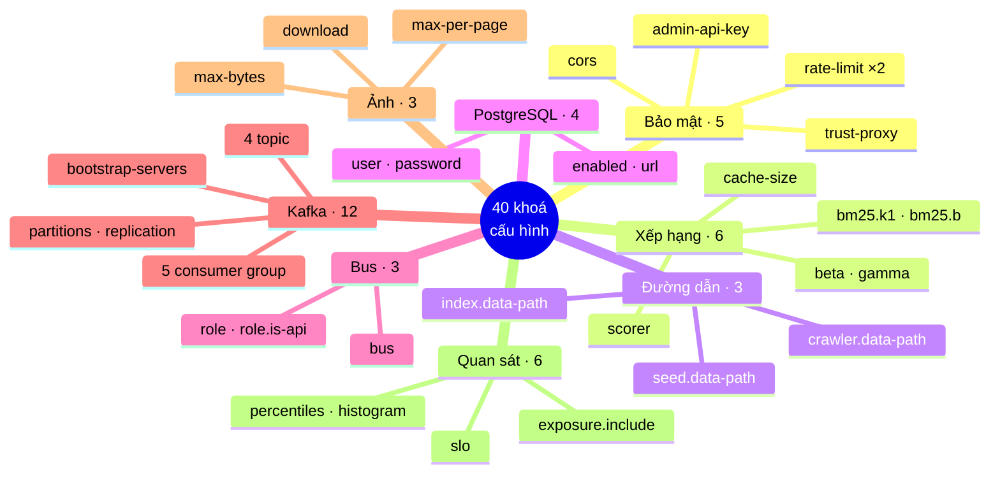

# Cấu hình — toàn bộ khoá, và đổi được gì mà không phải sửa mã

> **Tài liệu này trả lời:** hệ thống đọc cấu hình từ đâu, khoá nào tồn tại,
> mặc định là gì, và **đổi khoá nào thì hỏng chuyện gì**.
>
> Nguồn sự thật là
> [`search-engine/src/main/resources/application.properties`](../search-engine/src/main/resources/application.properties)
> — tệp đó có chú thích rất dày, trang này là bản tra cứu có tổ chức của nó
> cộng với những khoá **chỉ tồn tại trong mã**.
>
> | Câu hỏi | Đọc |
> |---|---|
> | *Đổi được gì mà không biên dịch lại?* | **trang này** |
> | *Cấu hình đó ảnh hưởng thuật toán ra sao?* | [`Math/`](Math/README.md) |
> | *Chạy trong Docker/K8s thì đặt ở đâu?* | [`INFRASTRUCTURE.md`](INFRASTRUCTURE.md) |
> | *Khoá bảo mật vì sao bắt buộc?* | [`SECURITY.md`](SECURITY.md) |

---

## 1. Cấu hình đến từ đâu — thứ tự ưu tiên

Spring Boot đọc nhiều nguồn, nguồn sau **đè** nguồn trước:

```
   thấp  ┌──────────────────────────────────────────────┐
     │   │ 1. application.properties (trong tệp jar)    │  mặc định của dự án
     │   ├──────────────────────────────────────────────┤
     │   │ 2. biến môi trường  APP_RANKING_SCORER=...   │  Docker, K8s, .env
     │   ├──────────────────────────────────────────────┤
     │   │ 3. tham số JVM  -Dapp.ranking.scorer=bm25    │  chạy tay
     ▼   ├──────────────────────────────────────────────┤
   cao   │ 4. tham số dòng lệnh  --app.ranking.scorer=… │  ưu tiên cao nhất
         └──────────────────────────────────────────────┘
```

**Quy tắc đổi tên khoá thành biến môi trường:** viết HOA, thay `.` và `-` bằng
`_`.

```
app.ranking.scorer              →  APP_RANKING_SCORER
app.security.rate-limit.enabled →  APP_SECURITY_RATE_LIMIT_ENABLED
```

Nhưng **nhiều khoá trong dự án này đã tự khai tên biến riêng** bằng cú pháp
`${TÊN_BIẾN:mặc định}` — khi đó tên biến là cái ghi trong ngoặc, không phải quy
tắc trên. Cột "Biến môi trường" trong các bảng dưới ghi đúng tên phải dùng.

> ⚠️ **`.env` là tệp của Docker Compose, không phải của ứng dụng chạy trên máy
> thật.** `run-backend.bat` cố ý **chỉ** lấy ba khoá từ `.env`
> (`ADMIN_API_KEY`, `POSTGRES_PASSWORD`, `APP_CORS_ALLOWED_ORIGINS`) chứ không
> nạp cả tệp. Lý do: `.env` thường chứa `APP_CRAWLER_BUS=kafka` và địa chỉ
> `postgres` — hai giá trị đúng *trong container* nhưng làm ứng dụng trên máy
> thật từ chối khởi động.

---

## 1b. Bản đồ: 40 khoá chia thành 8 nhóm



```
   40 khoá — nhóm nào bạn sẽ đụng tới, và bao lâu một lần

   HAY ĐỔI     ├─ Xếp hạng (6)      scorer, beta, gamma…
               ├─ Bus (3)           memory ⇄ kafka
               │
   THỈNH THOẢNG├─ Bảo mật (5)       khoá, rate-limit
               ├─ PostgreSQL (4)
               ├─ Ảnh (3)
               │
   ÍT KHI      ├─ Đường dẫn (3)
               ├─ Kafka (12)        đổi là phải cẩn thận — xem §8
               └─ Quan sát (6)      đổi sai là hở /actuator/env
```

---

## 2. Bảng tra nhanh: 5 khoá đụng tới nhiều nhất

| Khoá | Mặc định | Đổi để làm gì |
|---|---|---|
| `app.ranking.scorer` | `tfidf` | Chuyển sang `bm25` — đổi hẳn mô hình xếp hạng, **không cần sửa mã** |
| `app.crawler.bus` | `memory` | `kafka` để chạy crawl phân tán |
| `app.storage.postgres.enabled` | `false` | `true` để lấy PostgreSQL làm nguồn corpus ưu tiên |
| `app.crawler.images.download` | `false` | `true` để tải nội dung ảnh chứ không chỉ siêu dữ liệu |
| `app.security.rate-limit.requests-per-minute` | `120` | Nới/siết giới hạn tần suất |

---

## 3. Bảo mật

| Khoá | Mặc định | Biến môi trường | Ý nghĩa |
|---|---|---|---|
| `app.security.admin-api-key` | **rỗng** | `ADMIN_API_KEY` | Khoá cho `/api/admin/**`. Tối thiểu **16 ký tự** |
| `app.security.rate-limit.enabled` | `true` | — | Bật/tắt giới hạn tần suất trên `/api/*` |
| `app.security.rate-limit.requests-per-minute` | `120` | — | Số request mỗi phút cho mỗi địa chỉ |
| `app.security.trust-proxy` | `false` | — | Có tin `X-Forwarded-For` hay không |
| `app.cors.allowed-origins` | `http://localhost:5173` | `APP_CORS_ALLOWED_ORIGINS` | Origin được phép gọi API |

**Ba điều phải biết:**

1. **Thiếu `ADMIN_API_KEY` thì ứng dụng KHÔNG khởi động.** Cố ý.
   `/api/admin/crawl` khiến máy chủ tải một URL tuỳ ý rồi đưa nội dung vào chỉ
   mục công khai — chạy không khoá là một lỗ hổng SSRF hoàn chỉnh, chứ không
   chỉ là "API chưa có xác thực". Sinh khoá:

   ```bash
   openssl rand -hex 32                                          # Linux/macOS
   -join ((1..64) | % { '{0:x}' -f (Get-Random -Max 16) })       # PowerShell
   ```

2. **`trust-proxy=true` khi KHÔNG có proxy thật là tự vô hiệu hoá giới hạn tần
   suất.** Không có proxy thì `X-Forwarded-For` do chính client đặt — ai cũng
   tự khai một địa chỉ mới cho mỗi request. Chỉ bật khi thật sự có nginx hoặc
   load balancer đứng trước.

3. **Đừng đặt giá trị thật vào `application.properties`** — tệp đó được commit
   lên Git.

---

## 4. Xếp hạng

| Khoá | Mặc định | Ý nghĩa |
|---|---|---|
| `app.ranking.scorer` | `tfidf` | `tfidf` hoặc `bm25` — xem `ScorerFactory` |
| `app.ranking.bm25.k1` | `1.2` | Độ bão hoà tần suất term. Chỉ có tác dụng khi `scorer=bm25` |
| `app.ranking.bm25.b` | `0.75` | Mức chuẩn hoá theo độ dài tài liệu. `0` = bỏ qua độ dài, `1` = chuẩn hoá hoàn toàn |
| `app.ranking.beta` | `0.30` | Trọng số PageRank, áp bằng Decorator |
| `app.ranking.gamma` | `0.10` | Trọng số khớp tiêu đề, áp bằng Decorator |
| `app.search.cache-size` | `200` | Số truy vấn giữ trong `LRUCache` |

**Đặt `beta` hoặc `gamma` bằng `0` là tắt hẳn một tín hiệu** — lớp Decorator
tương ứng sẽ không được tạo, không tốn chi phí. Đây là cách sạch nhất để đo
xem một tín hiệu đóng góp bao nhiêu:

```bash
# So chất lượng khi có và không có PageRank
./mvnw spring-boot:run -Dspring-boot.run.arguments=--app.ranking.beta=0
```

Dòng log lúc khởi động in ra công thức đang dùng, dùng nó để xác nhận:

```
Scorer dang dung: TF-IDF cosine + PR x0.30 + title x0.10
```

> **Khoá `app.ranking.alpha` đã bị xoá.** Nó thuộc về công thức cộng tuyến tính
> mà Decorator đã thay thế. Nếu bạn thấy nó trong tài liệu cũ hoặc một bản
> `.env` cũ, bỏ đi — không còn mã nào đọc nó, đặt vào cũng không có tác dụng.

---

## 5. Đường dẫn dữ liệu

| Khoá | Mặc định | Ý nghĩa |
|---|---|---|
| `app.index.data-path` | `data/index.json` | Chỉ mục dựng sẵn — **cache dẫn xuất** |
| `app.crawler.data-path` | `data/crawled-documents.json` | Corpus đã crawl — **nguồn sự thật** |
| `app.seed.data-path` | `data/seed-documents.json` | Corpus mẫu đi kèm repo |

⚠️ **Bẫy quan trọng nhất của cả trang này.** Chuỗi nguồn lúc khởi động ưu tiên
`index.json`. Sau một phiên crawl bằng dòng lệnh, corpus mới hơn chỉ mục, nhưng
backend vẫn nạp chỉ mục **cũ** — không một dòng lỗi nào, chỉ là các trang vừa
crawl không tìm ra:

```
data/crawled-documents.json   sửa lúc 12:08   ← mới
data/index.json               sửa lúc 10:46   ← nhưng cái này được nạp
```

Chữa bằng một lần gọi:

```bash
curl -X POST -H "X-API-Key: $ADMIN_API_KEY" http://localhost:8080/api/admin/reindex
```

`run-backend.bat` có so ngày sửa hai tệp và in `[CANH BAO]` — chi tiết ở
[`BACKEND.md`](BACKEND.md) §6.3.

---

## 6. Kho tài liệu — PostgreSQL

| Khoá | Mặc định | Biến môi trường |
|---|---|---|
| `app.storage.postgres.enabled` | `false` | `APP_STORAGE_POSTGRES_ENABLED` |
| `app.storage.postgres.url` | `jdbc:postgresql://localhost:5432/vnsearch` | `APP_STORAGE_POSTGRES_URL` |
| `app.storage.postgres.user` | `vnsearch` | `APP_STORAGE_POSTGRES_USER` |
| `app.storage.postgres.password` | `vnsearch` | **`POSTGRES_PASSWORD`** |

Chú ý khoá cuối: tên biến là `POSTGRES_PASSWORD`, **không** theo quy tắc suy ra
từ tên khoá. Mặc định `vnsearch` chỉ để chạy demo cục bộ — môi trường thật bắt
buộc phải đặt.

Tắt PostgreSQL không làm hỏng gì: chuỗi dự phòng tự lui về corpus JSON.

---

## 7. Bus sự kiện crawler

| Khoá | Mặc định | Biến môi trường |
|---|---|---|
| `app.crawler.bus` | `memory` | `APP_CRAWLER_BUS` |
| `app.crawler.role` | `api` | `APP_CRAWLER_ROLE` |
| `app.crawler.role.is-api` | `true` | `APP_CRAWLER_ROLE_IS_API` |

- **`memory`** — ba Modular Service chạy trong **cùng** tiến trình, gọi trực
  tiếp. Không cần broker. Đây là chế độ mà `run-crawl.bat`,
  `MultiDomainCrawlRunner` và **toàn bộ test** dùng.
- **`kafka`** — ba service chạy ở tiến trình riêng, co giãn độc lập. Cần một
  broker sống.

> **Vì sao mặc định là `memory`.** Một hệ thống không khởi động được khi thiếu
> broker là hệ thống không demo được, không test được. Kafka phải là thứ **bật
> thêm** khi cần quy mô, không phải điều kiện để chạy được dòng đầu tiên.

**`role.is-api`** quyết định tiến trình nào nạp `ImageStore` vào bộ nhớ. Kho
ảnh nằm trong bộ nhớ tiến trình nên chỉ được nạp ở **đúng một** nơi — và nơi đó
phải là tiến trình phục vụ API. Đặt `true` ở hai tiến trình là tốn gấp đôi RAM
mà tiến trình worker chẳng dùng đến.

---

## 8. Kafka

| Khoá | Mặc định | Biến môi trường |
|---|---|---|
| `app.crawler.kafka.bootstrap-servers` | `localhost:9092` | `APP_CRAWLER_KAFKA_BOOTSTRAP` |
| `app.crawler.kafka.partitions` | `12` | — |
| `app.crawler.kafka.replication-factor` | `1` | `APP_CRAWLER_KAFKA_REPLICATION` |
| `app.crawler.kafka.topic.pages` | `vnsearch.pages` | — |
| `app.crawler.kafka.topic.urls` | `vnsearch.urls.discovered` | — |
| `app.crawler.kafka.topic.outlinks` | `vnsearch.outlinks` | — |
| `app.crawler.kafka.topic.images` | `vnsearch.images` | — |
| `app.crawler.kafka.group.url-extractor` | `vnsearch-url-extractor` | — |
| `app.crawler.kafka.group.image-download` | `vnsearch-image-download` | — |
| `app.crawler.kafka.group.analytics` | `vnsearch-analytics` | — |
| `app.crawler.kafka.group.frontier` | `vnsearch-frontier-feeder` | — |
| `app.crawler.kafka.group.image-store` | `vnsearch-image-store` | — |

**Cổng 29092 chứ không phải 9092, khi chạy trên máy thật.** Kafka trả về địa
chỉ *advertised* cho client rồi client kết nối lại bằng địa chỉ đó.
`docker-compose.yml` khai hai listener — `kafka:9092` cho container và
`localhost:29092` cho tiến trình ngoài. Dùng 9092 từ máy thật thì bắt tay đầu
tiên thành công, sau đó client đổi sang tên `kafka` và **treo**.

⚠️ **Đừng đổi `partitions` của một topic đang chạy.** Số phân hoạch là mẫu số
của phép băm khoá; đổi nó nghĩa là **cùng một host rơi sang phân hoạch khác**,
và bộ lọc Bloom theo host mất tính đúng. Đặt đủ rộng ngay từ đầu — 12 là bội số
của 1, 2, 3, 4, 6 nên chia đều được cho nhiều cấu hình số bản sao.

**Mỗi Modular Service một consumer group riêng.** Đó là cơ chế phát tán
một-tới-nhiều: các nhóm cùng đọc một topic, mỗi nhóm giữ offset riêng, nên tất
cả đều nhận **toàn bộ** luồng trang. Dùng chung nhóm thì hai bên **chia nhau**
luồng thay vì mỗi bên nhận đủ.

### 8.1. Ba khoá chỉ tồn tại trong mã

Ba khoá sau **không** có trong `application.properties` — chúng chỉ sống bằng
giá trị mặc định khai trong `@Value` ở `KafkaCrawlConfig.java`. Chúng chỉ có
tác dụng với tiến trình **worker**:

| Khoá | Mặc định | Khai ở | Ý nghĩa |
|---|---|---|---|
| `app.crawler.kafka.worker.max-depth` | `3` | `KafkaCrawlConfig.java:435` | Độ sâu tối đa của `UrlFilter` phía worker |
| `app.crawler.kafka.worker.allowed-domains` | *(rỗng = không giới hạn)* | `KafkaCrawlConfig.java:436` | Danh sách domain cho phép, ngăn cách bằng dấu phẩy |
| `app.crawler.kafka.worker.max-pages` | `100000` | `KafkaCrawlConfig.java:459` | Sức chứa `UrlSeenFilter` — quyết định kích thước Bloom filter |

Muốn đổi thì đặt qua biến môi trường hoặc thêm vào
`application.properties`; không cần sửa mã.

---

## 9. Tải ảnh

| Khoá | Mặc định | Biến môi trường | Ý nghĩa |
|---|---|---|---|
| `app.crawler.images.download` | `false` | `APP_CRAWLER_IMAGES_DOWNLOAD` | `false` = chỉ ghi siêu dữ liệu |
| `app.crawler.images.max-per-page` | `50` | — | Số ảnh tối đa lấy từ một trang |
| `app.crawler.images.max-bytes` | `5242880` (5 MB) | — | Bỏ qua ảnh lớn hơn ngưỡng |

**Vì sao mặc định không tải ảnh** — ba lý do, ghi trong Javadoc của
`ImageFound`: chi phí băng thông, bề mặt SSRF rộng thêm, và bản quyền. Tab Hình
ảnh vẫn chạy được ở chế độ mặc định vì nó trỏ thẳng tới URL gốc.

Chi tiết thuật toán chấm chất lượng ảnh:
[`Math/11-images/`](Math/11-images/00-SO-DO-TU-DUY.md).

---

## 10. Quan sát được

| Khoá | Mặc định |
|---|---|
| `management.endpoints.web.exposure.include` | `health,metrics,prometheus` |
| `management.endpoint.health.show-details` | `never` |
| `management.metrics.tags.application` | `vnsearch` |
| `management.metrics.distribution.percentiles-histogram.http.server.requests` | `true` |
| `management.metrics.distribution.percentiles.http.server.requests` | `0.5,0.95,0.99` |
| `management.metrics.distribution.slo.http.server.requests` | `50ms,100ms,200ms,500ms,1s` |

⚠️ **Đừng đổi `exposure.include` thành `*`.** Nhóm mặc định còn chứa
`/actuator/env` (phơi bày **mọi** biến môi trường, kể cả `ADMIN_API_KEY` và mật
khẩu CSDL) và `/actuator/heapdump` (tải về toàn bộ bộ nhớ tiến trình).

**Vì sao đẩy cả histogram chứ không chỉ phân vị đã tính.** Phân vị tính sẵn thì
**không cộng dồn được**: trung bình của hai p99 không phải là p99 của tổng. Đẩy
histogram cho phép Prometheus gộp phân vị từ nhiều bản sao.

---

## 11. Khoá của Spring, không phải của dự án

| Khoá | Giá trị | Vì sao đặt |
|---|---|---|
| `server.port` | `8080` | — |
| `spring.application.name` | `search-engine` | — |
| `spring.autoconfigure.exclude` | `…UserDetailsServiceAutoConfiguration` | Tắt dòng log `Using generated security password: …` |

Dòng log bị tắt kia vừa là rác vừa **gây hiểu nhầm**: nó gợi ý có một tài khoản
đăng nhập dùng được, trong khi hệ thống xác thực bằng header `X-API-Key` và
không có người dùng nào cả.

---

## 12. Ba công thức đặt cấu hình hay dùng

```bash
# 1. Chạy tay, đổi một khoá cho lần chạy này thôi
cd search-engine
./mvnw spring-boot:run -Dspring-boot.run.arguments=--app.ranking.scorer=bm25

# 2. Docker Compose — đặt trong .env ở gốc repo
echo "APP_RANKING_SCORER=bm25" >> .env
docker compose up -d --build

# 3. Windows, dùng cờ có sẵn của run-backend.bat
run-backend.bat --bm25          # đổi scorer
run-backend.bat --postgres      # bật PostgreSQL
run-backend.bat --kafka         # bật bus Kafka
```

Kiểm tra cấu hình đang chạy có đúng như mong đợi không:

```bash
curl -H "X-API-Key: $ADMIN_API_KEY" http://localhost:8080/api/admin/stats
```

Trường `scorer` trong phản hồi cho biết mô hình chấm điểm thật sự đang dùng.
