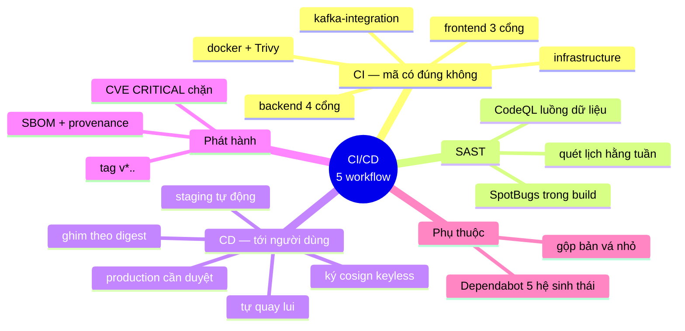
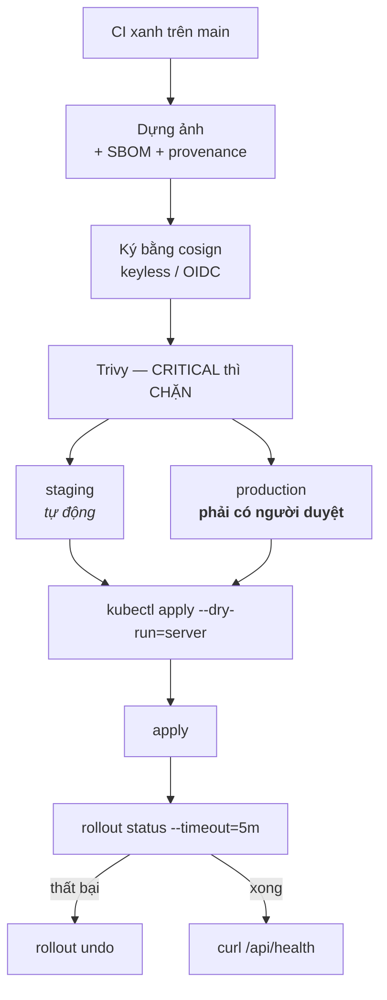

# DevOps — mã đi từ máy lập trình viên tới người dùng bằng cách nào

> **Tài liệu này trả lời đúng một câu hỏi:** một dòng mã vừa viết ra phải đi qua
> những cổng nào trước khi chạm vào một cụm thật.
>
> **Không** nói hệ thống chạy ở đâu — đó là
> [`INFRASTRUCTURE.md`](INFRASTRUCTURE.md). **Không** nói ứng dụng được lắp ra
> sao — đó là [`BACKEND.md`](BACKEND.md).

**Hai chữ cái trong "CI/CD" là hai việc hoàn toàn khác nhau:**
```
   CI  —  mã có ĐÚNG không?          →  ci.yml, codeql.yml
   CD  —  mã có TỚI ĐƯỢC người dùng? →  cd.yml, release.yml
```

Không có CD thì triển khai là một chuỗi lệnh gõ tay, khác nhau mỗi lần, và chỉ
một người trong nhóm biết cách làm. Đó không phải là một quy trình — đó là **một
điểm hỏng đơn lẻ có hình dạng con người**.

---

## Mục lục

1. [Bản đồ tư duy](#1-bản-đồ-tư-duy)
2. [Năm workflow](#2-năm-workflow)
3. [CI — bảy cổng chặn](#3-ci--bảy-cổng-chặn)
4. [Cổng thứ tư: chất lượng xếp hạng](#4-cổng-thứ-tư-chất-lượng-xếp-hạng)
5. [Vì sao test tích hợp Kafka là job riêng](#5-vì-sao-test-tích-hợp-kafka-là-job-riêng)
6. [Bốn thứ job tích hợp đã bắt được](#6-bốn-thứ-job-tích-hợp-đã-bắt-được)
7. [Job `infrastructure` — bắt lỗi YAML trước khi nó chạm cụm](#7-job-infrastructure--bắt-lỗi-yaml-trước-khi-nó-chạm-cụm)
8. [CD — luồng triển khai](#8-cd--luồng-triển-khai)
9. [Quản lý phụ thuộc](#9-quản-lý-phụ-thuộc)
10. [Chạy tại chỗ trước khi đẩy](#10-chạy-tại-chỗ-trước-khi-đẩy)
11. [Còn thiếu](#11-còn-thiếu)
12. [Branch protection](#12-branch-protection--thứ-biến-bảy-cổng-chặn-thành-ràng-buộc)

---

## 1. Bản đồ tư duy


```
   git push / pull request
            │
            ▼
   ┌────────────────────── ci.yml — 5 job SONG SONG ──────────────────────┐
   │                                                                       │
   │  backend          frontend        image        kafka-it   infra       │
   │  ├ 528 test       ├ typecheck     ├ build      ├ broker   ├ kubeconform│
   │  ├ JaCoCo         ├ lint          └ Trivy      │  THẬT    ├ promtool  │
   │  ├ SpotBugs       └ 53 Vitest        (SARIF)   └ 1 phút   ├ amtool    │
   │  └ ranking                                                └ chống lệch│
   └───────────────────────────────┬───────────────────────────────────────┘
                                   │ tất cả xanh, trên nhánh main
                                   ▼
   ┌────────────────────── cd.yml — workflow_run ─────────────────────────┐
   │  dựng ảnh → SBOM+provenance → ký cosign → Trivy CHẶN CRITICAL        │
   │       │                                                              │
   │       ├──▶ staging      TỰ ĐỘNG                                      │
   │       └──▶ production   PHẢI CÓ NGƯỜI DUYỆT                          │
   │              │                                                       │
   │              └─▶ dry-run → apply → rollout status → CURL /api/health │
   │                                          │ hỏng                      │
   │                                          └─▶ rollout undo            │
   └──────────────────────────────────────────────────────────────────────┘
```

---

## 2. Năm workflow

| Tệp | Kích hoạt | Việc |
|---|---|---|
| `ci.yml` | push `main`, mọi PR | 5 job — xem [§3](#3-ci--bảy-cổng-chặn) |
| `cd.yml` | sau khi CI xanh trên `main`; chạy tay | Dựng + ký ảnh, triển khai staging tự động / production sau duyệt |
| `codeql.yml` | push, PR, **lịch hằng tuần** | SAST theo luồng dữ liệu cho Java và TypeScript |
| `release.yml` | tag `v*.*.*` | Ảnh đa kiến trúc lên GHCR + SBOM + provenance + cosign + CVE chặn, tạo GitHub Release |
| `dependabot.yml` | lịch | 5 hệ sinh thái — xem [§9](#9-quản-lý-phụ-thuộc) |
| `pr-title.yml` | PR mở/sửa | Bắt buộc Conventional Commits trong tiêu đề PR |

**Hai thiết lập chung đáng nói:**

```yaml
permissions:
  contents: read          # quyền TỐI THIỂU ở cấp workflow, nới thêm ở từng job

concurrency:
  group: ${{ github.workflow }}-${{ github.ref }}
  cancel-in-progress: true    # CI: huỷ bản cũ
```

`cancel-in-progress` đúng cho CI (không ai quan tâm kết quả của mã đã bị thay
thế) nhưng **sai cho CD** — nên `cd.yml` cố ý **không** đặt nó: huỷ một lần
triển khai đang chạy có thể để lại cụm ở trạng thái nửa vời, vài Pod bản mới,
vài Pod bản cũ. Ở đó, **xếp hàng chờ** mới là hành vi đúng.

---

## 3. CI — bảy cổng chặn

| # | Cổng | Bắt được gì | Job | Hỏng thì |
|---|---|---|---|---|
| 1 | **528 test Java** | Logic từng khối sai | `backend` | Build đỏ |
| 2 | **Độ phủ (JaCoCo)** | Mã mới không có test — line ≥ 68 %, branch ≥ 65 % | `backend` | Build đỏ |
| 3 | **SpotBugs** | Lỗi mà test không chạy tới — hiện **0 bug** | `backend` | Build đỏ |
| 4 | **Chất lượng xếp hạng** | Tìm kiếm tệ đi mà test vẫn xanh | `backend` | Build đỏ |
| 5 | **53 test Vitest** | Hành vi frontend, gồm **ranh giới bảo mật** `urlPolicy` | `frontend` | Build đỏ |
| 6 | **Tích hợp Kafka** | Serialize hỏng, phân hoạch sai, thông điệp quá lớn | `kafka-integration` | Build đỏ |
| 7 | **Kiểm định hạ tầng** | YAML sai, PromQL sai, hai bản quy tắc lệch nhau | `infrastructure` | Build đỏ |

Thêm hai cổng **không chặn** nhưng đẩy kết quả lên tab Security: CodeQL và
Trivy (quét ảnh).

### 3.1. `verify` chứ không phải `test`

```bash
./mvnw -B clean verify     # ĐÚNG
./mvnw -B test             # bỏ qua HAI trong bảy cổng
```

Pha `verify` mới chạy `jacoco:check` và `spotbugs:check`. Chạy `test` là bỏ qua
cổng 2 và 3 — và một cổng chặn không được chạy thì không tồn tại.

### 3.2. Ba cổng của frontend
```
typecheck   →  kiểu dữ liệu có khớp nhau không
lint        →  phong cách có nhất quán không
Vitest      →  HÀNH VI có đúng không     ← cổng duy nhất kiểm cái này
```

Hai cổng đầu đều **xanh** trên một hàm trả về kết quả sai. Trước khi có Vitest,
hơn 6.500 dòng TypeScript — trong đó có chính sách điều hướng, tức một **ranh
giới bảo mật** — không có gì canh cả.

---

## 4. Cổng thứ tư: chất lượng xếp hạng

Đây là cổng **đặc thù của một hệ thống tìm kiếm**, và là cổng đáng nói nhất.

> Ba cổng đầu đều có thể **xanh** trong khi kết quả trả về cho người dùng **đã
> tệ đi**. Không có bài test đơn vị nào phát hiện được việc một thay đổi công
> thức làm nDCG tụt 15 % — mọi hàm vẫn trả về đúng kiểu, vẫn không ném ngoại lệ.

`RankingQualityTest` chạy một bộ truy vấn known-item trên corpus mẫu và khẳng
định các độ đo IR không tụt dưới ngưỡng. Chi tiết độ đo:
[`EVALUATION.md`](EVALUATION.md).

---

## 5. Vì sao test tích hợp Kafka là job riêng

Hai lý do, và lý do thứ hai quan trọng hơn:

1. Nó **chậm** (~15 giây chỉ để dựng broker), còn job chính phải nhanh — nó là
   thứ lập trình viên chờ để biết mã có xanh không.
2. Nó **hỏng vì những lý do KHÁC**: Docker không có, kéo ảnh thất bại, mạng
   chậm. Trộn vào job chính thì một sự cố hạ tầng CI trông **y hệt** một lỗi mã
   nguồn.

Cơ chế tách: các bài gắn `@Tag("kafka-it")` bị loại khỏi lần chạy thường ngày
bằng `excludedGroups`, và hồ sơ `kafka-it` đảo ngược bộ lọc đó.

```bash
./mvnw -B clean verify        # 521 bài, KHÔNG cần Docker
./mvnw verify -Pkafka-it      # chỉ nhóm kafka-it, CẦN Docker
```

Ba thứ chỉ job này bắt được — bộ test in-process **về nguyên tắc không thể**:
thông điệp có serialize được không, phân hoạch theo host có ổn định không, và
thông điệp lớn có qua nổi trần không.

---

## 6. Bốn thứ job tích hợp đã bắt được

Bộ test tích hợp này **không phải đồ trang trí**. Lần chạy đầu tiên lộ ra bốn
vấn đề, mỗi cái đáng ghi lại.

### ① Một lỗi sản phẩm thật

`ImageFound.isDownloaded()` — Jackson coi mọi phương thức `isXxx()` là thuộc
tính, nên nó ghi thêm trường `"downloaded"` vào JSON. Trường đó không ứng với
component nào của record, nên consumer đọc lại thì ném:
```
UnrecognizedPropertyException: Unrecognized field "downloaded"
```

Ở môi trường thật: **mọi** thông điệp ảnh chết ở consumer rồi rơi vào dead-letter
topic. Bộ test in-process không thể thấy — đối tượng đi thẳng từ tay này sang
tay kia, **không ai serialize cả**.

Đã sửa bằng `@JsonIgnore` trên mọi accessor dẫn xuất, và **kéo phép kiểm về bộ
test nhanh** (`CrawlEventTest.JsonRoundTrip`) để lần sau nó bị bắt trong vài
mili-giây thay vì phải chờ một job có Docker. Bài `noDerivedFieldLeaksIntoTheJson`
liệt kê **chính xác** tập trường được phép xuất hiện trong mỗi thông điệp.

### ② Một cổng chặn luôn xanh vì không kiểm gì cả

Hồ sơ `kafka-it` in ra:
```
Tests run: 0, Failures: 0, Errors: 0
BUILD SUCCESS
```

Hai nguyên nhân chồng lên nhau:

1. Surefire chỉ nhặt `*Test.java` — hậu tố `IT` thuộc về **failsafe**, một plugin
   khác.
2. Tinh vi hơn: cấu hình plugin trong `<profile>` **hợp nhất** với cấu hình ở
   `<build>` chứ không thay thế, nên thẻ rỗng `<excludedGroups></excludedGroups>`
   không xoá được giá trị lớp dưới. Kết quả là profile có đồng thời
   `<groups>kafka-it</groups>` **và** `<excludedGroups>kafka-it</excludedGroups>`
   — loại trừ thắng.

> **Một cổng chặn luôn xanh vì không kiểm gì cả nguy hiểm hơn một bản build đỏ:
> nó trông y hệt một cổng chặn đang hoạt động tốt.**

Sửa bằng cách đưa giá trị ra một property (`test.excluded.groups`) để profile ghi
đè được, cộng `<includes>**/*IT.java</includes>`.

### ③ Lệch phiên bản Docker API

Testcontainers 1.19.8 (bản Spring Boot 3.3.4 khi đó quản lý) đi kèm docker-java 3.3.6,
và client đó nói một phiên bản API mà Docker Engine 29.x không còn nhận. Triệu
chứng dẫn sai đường hoàn toàn:
```
$ docker version
29.6.1                                    ← hoàn toàn bình thường

Testcontainers: Could not find a valid Docker environment
```

Daemon **có** trả lời, nhưng trả HTTP 400 kèm khối `Info` rỗng, và Testcontainers
dịch điều đó thành "không tìm thấy Docker". Đọc thông báo theo nghĩa đen sẽ đi
tìm biến môi trường, tên named pipe, quyền truy cập — trong khi nguyên nhân nằm ở
chỗ khác hẳn. Sửa: ghim `testcontainers.version` lên 1.21.4.

> **Bài học chung của ③:** thông báo lỗi của một thư viện mô tả *triệu chứng nó
> quan sát được*, không phải *nguyên nhân*. Đọc theo nghĩa đen là cách nhanh
> nhất để đi sai đường.

### ④ Test không cô lập nhau

Mọi consumer đặt `auto.offset.reset=earliest` — bắt buộc, vì đó là hành vi thật
của hệ thống. Hệ quả là mỗi bài test đọc luôn thông điệp các bài trước để lại
rồi khẳng định sai về chúng. Sửa: cấp một bộ topic **riêng** cho từng bài.

---

## 7. Job `infrastructure` — bắt lỗi YAML trước khi nó chạm cụm

YAML hạ tầng có một tính chất khó chịu: **nó hỏng ở nơi xa nhất so với nơi viết
ra**. Một `replicas: "2"` (chuỗi thay vì số) hay một `apiVersion` gõ sai chỉ lộ
ra lúc `kubectl apply` — tức lúc đang triển khai, và nếu đó là production thì đã
quá muộn.

Job này bắt chúng trong khoảng 30 giây, **không cần cụm nào**.

| Bước | Bắt được gì |
|---|---|
| `kustomize build` ×4 lớp | Cú pháp, patch trỏ vào tài nguyên không tồn tại |
| `kubeconform -strict` | Sai kiểu dữ liệu, thiếu trường bắt buộc, `apiVersion` đã bị gỡ, **và tên trường gõ sai** |
| `promtool check config` | PromQL sai cú pháp |
| `amtool check-config` | Alertmanager sai cấu hình |
| `docker compose config` ×3 profile | Volume chưa khai báo, biến thiếu |
| `diff` `schema.sql` | Hai bản lược đồ lệch nhau |
| `diff` tên cảnh báo | Hai bản quy tắc lệch nhau |

**Vì sao `-strict` quan trọng:** nó từ chối cả trường thừa. Không có nó,
`replicaz: 3` được chấp nhận **im lặng** và Deployment chạy với số bản sao mặc
định.

**Vì sao `promtool` đáng giá:** một biểu thức PromQL sai làm Prometheus **từ
chối nạp cả tệp** quy tắc — mất **toàn bộ** cảnh báo, không chỉ cái viết sai. Và
nó thất bại im lặng: Prometheus vẫn chạy, vẫn thu thập, chỉ là không cảnh báo gì
nữa.

> **Một chi tiết đã sai thật khi viết job này.** `promtool check config` đọc
> `rule_files:` bên trong `prometheus.yml` và đi theo đường dẫn ghi ở đó — vốn là
> đường dẫn **tuyệt đối trong container thật** (`/etc/prometheus/alerts.yml`).
> Mount vào `/work` thì đường dẫn ấy không tồn tại và bước này báo đỏ vì một lý
> do hoàn toàn giả.
>
> Bài học: **công cụ kiểm định chỉ có ích khi nó chạy trong đúng bối cảnh mà thứ
> nó kiểm sẽ chạy.**

**Vì sao có hai bước `diff`:** `deploy/monitoring/alerts.yml` và
`deploy/k8s/monitoring/prometheusrule.yaml` mô tả cùng một bộ cảnh báo cho hai
đường triển khai; `schema.sql` cũng có hai bản. Chúng không dùng chung tệp được
(khác định dạng, và kustomize không tham chiếu tệp ngoài thư mục gốc), nên phải
có một bước canh cho chúng không lệch.

---

## 8. CD — luồng triển khai



### Sáu quyết định đáng giải thích

**① `workflow_run` chứ không phải `push`.** Với `push`, CD chạy *song song* với
CI và có thể triển khai xong một bản mã mà bộ test còn chưa chạy tới. Kèm điều
kiện `github.event.workflow_run.conclusion == 'success'` — thiếu nó thì
`workflow_run` vẫn kích hoạt kể cả khi CI **đỏ**.

**② Production phải có người duyệt.** Kiểm thử tự động bắt được lỗi hồi quy,
nhưng **không** bắt được *"tính năng này đúng nhưng chưa nên phát hành"*. Một
người bấm nút là chỗ để phán đoán đó xảy ra. Cấu hình ở
Settings → Environments → production → Required reviewers.

**③ Ghim theo digest, không theo thẻ.** Thẻ là một con trỏ **di động**: hai node
kéo ảnh ở hai thời điểm khác nhau có thể chạy hai bản mã khác nhau dưới cùng một
tên. Digest là mã băm của chính nội dung ảnh — ghim nó là ghim **đúng** thứ vừa
được kiểm thử và vừa được ký.

**④ Ký cosign chế độ keyless.** Danh tính đến từ OIDC của GitHub Actions, không
có khoá riêng nào phải lưu và phải xoay vòng. Nó biến câu hỏi *"ảnh đang chạy ở
production có phải thứ ta đã dựng không"* từ một **niềm tin** thành một **phép
kiểm chứng được**.

**⑤ Trivy CHẶN ở CD nhưng KHÔNG chặn ở CI.** Trong CI, một cổng đỏ thường trực
(ảnh nền `eclipse-temurin` gần như luôn có vài CVE chưa vá) sẽ bị vô hiệu hoá
trong vòng một tuần. Ở CD thì chặn là đúng — đây là **ranh giới cuối** trước một
cụm thật.

**⑥ `rollout status` rồi mới báo xanh.** Không có bước này, workflow báo thành
công ngay sau `apply`, trong khi Pod mới có thể đang trong vòng lặp khởi động
lại. *"Đã triển khai"* phải nghĩa là *"đang chạy được"*, không phải *"đã gửi
lệnh đi"*. Thất bại thì `rollout undo` tự chạy.

Bước cuối cùng — `curl /api/health` từ trong cụm — hỏi ứng dụng qua **đúng đường
mà người dùng đi**. `rollout status` chỉ nói Pod đã sẵn sàng theo probe; bước này
nói hệ thống **thật sự trả lời được**.

---

## 9. Quản lý phụ thuộc

Dự án khoá phiên bản rất chặt (`npm ci`, phiên bản cố định trong `pom.xml`).
Điều đó tốt cho tính lặp lại được, nhưng nó cũng có nghĩa là các thư viện **sẽ
đứng yên mãi mãi** — một lỗ hổng công bố trong jsoup hay Spring Boot sẽ không tự
đến tai ai.

| Hệ sinh thái | Thư mục | Nhịp |
|---|---|---|
| `maven` | `/search-engine` | tuần |
| `npm` | `/browser-app` | tuần |
| `github-actions` | `/` | tháng |
| `docker` | `/search-engine` | tuần |
| `docker-compose` | `/` | tuần |

**Ba chi tiết đáng nói:**

- **Gộp bản vá nhỏ vào MỘT pull request.** Không gộp thì mỗi tuần có năm bảy PR
  vá phiên bản vặt, và hệ quả thực tế là **không ai đọc PR nào cả**.
- **Electron bản chính bị loại khỏi tự động.** Lên bản major của Electron là một
  lần nâng cấp có rủi ro thật (đổi API, đổi hành vi sandbox), không phải việc gộp
  vào một PR tự động.
- **Có mục `docker` riêng.** Đây là tầng mà Maven và npm **không nhìn thấy**: một
  CVE trong glibc hay openssl của ảnh `eclipse-temurin` không xuất hiện trong
  `pom.xml`. Trivy trong CI vẫn quét ảnh, nhưng quét chỉ nói *"có lỗ hổng"*, còn
  Dependabot **mở sẵn PR nâng phiên bản**.

Và `actions/checkout@v4` cũng là một phụ thuộc, cũng có lỗ hổng — nên chính các
workflow cũng được theo dõi.

---

## 10. Chạy tại chỗ trước khi đẩy

Bảy cổng chặn đều chạy được trên máy. Chạy trước thì vòng phản hồi tính bằng
giây thay vì bằng phút:

```bash
# --- Backend: cổng 1–4 ---
cd search-engine
./mvnw -B clean verify            # 528 test + JaCoCo + SpotBugs + ranking
./mvnw verify -Pkafka-it          # cổng 6 — cần Docker

# --- Frontend: cổng 5 ---
cd browser-app
npm run typecheck && npm run lint && npm test     # 53 test

# --- Cổng 7: hạ tầng ---
kubectl kustomize deploy/k8s/base          > /dev/null
kubectl kustomize deploy/k8s/overlays/dev  > /dev/null
kubectl kustomize deploy/k8s/overlays/prod > /dev/null
kubectl kustomize deploy/k8s/monitoring    > /dev/null
docker compose config --quiet
docker compose --profile kafka --profile monitoring config --quiet
diff -u search-engine/src/main/resources/db/schema.sql deploy/k8s/base/schema.sql
```

Kết quả mong đợi trên cây mã hiện tại:
```
Tests run: 528, Failures: 0, Errors: 0
All coverage checks have been met.
BugInstance size is 0
BUILD SUCCESS — khoảng 43 giây

Test Files  5 passed (5)
     Tests  53 passed (53)
```

---

## 11. Còn thiếu

1. **Chưa có kiểm thử tải trong CI** (k6 hoặc tương đương), nên chưa có cổng nào
   bắt được hồi quy về **thông lượng**.
2. **Chưa có môi trường preview cho từng PR.** Mọi thay đổi giao diện phải chạy
   tay mới xem được.
3. **`release.yml` chưa sinh changelog tự động** từ Conventional Commits, dù
   `pr-title.yml` đã ép đúng định dạng để làm được việc đó.
4. **CD chưa chạy hết đường.** Nó dừng ở bước nạp `KUBE_CONFIG` vì chưa có cụm
   thật — mọi bước trước đó (dựng, đẩy GHCR, ký cosign, quét CVE) đã kiểm chứng
   xong.

---

## 12. Branch protection — thứ biến bảy cổng chặn thành ràng buộc

Bảy cổng chặn ở §3 **chỉ là thông tin** nếu vẫn đẩy thẳng lên `main` được. Đây
không phải giả thuyết: CI của dự án này từng **đỏ năm lần liên tiếp trong hai
ngày** mà không ai biết, vì không có gì chặn.

Cấu hình đang áp trên `main`:

| Quy tắc | Giá trị | Vì sao |
|---|---|---|
| Bắt buộc pull request | ✅ | Không còn đường đẩy thẳng |
| Số review cần duyệt | **0** | Kho một người. GitHub **không cho tự duyệt PR của mình**, nên đặt 1 sẽ khoá cứng chính chủ |
| Status check bắt buộc | **7** | 5 job CI + 2 job CodeQL. **Không** gồm job CD — chúng chạy *sau* khi trộn |
| Nhánh phải cập nhật (`strict`) | ✅ | Chặn ca hai PR xanh riêng lẻ nhưng hỏng khi ghép |
| Áp cho cả admin | ✅ | Chủ kho cũng không bỏ qua được |
| Lịch sử tuyến tính | ✅ | `git log` đọc được, hợp với một kho sẽ đem đi bảo vệ |
| Cấm force-push / xoá nhánh | ✅ | `main` không bị viết lại lịch sử |

Kiểm chứng bằng cách thử đẩy thẳng:
```
remote: error: GH006: Protected branch update failed for refs/heads/main.
remote: - Changes must be made through a pull request.
remote: - 7 of 7 required status checks are expected.
```

### Quy trình làm việc từ nay

```bash
git checkout -b feat/viec-gi-do
# ... sửa mã ...
git commit -m "feat: ..."
git push -u origin feat/viec-gi-do
gh pr create --fill
gh pr checks --watch      # chờ 7 cổng xanh
gh pr merge --squash --delete-branch
```

> **Lối thoát khi kẹt.** `enforce_admins` bật nghĩa là kể cả chủ kho cũng không
> đẩy thẳng được. Nếu có lúc cần gấp: Settings → Branches → sửa quy tắc, tắt
> tạm, đẩy, rồi **bật lại**. Mất khoảng 30 giây — đủ nhanh để không phải nới
> lỏng quy tắc vĩnh viễn, đủ chậm để không làm theo thói quen.
>
> Một lưu ý về `required_status_checks`: nó ghim theo **TÊN job**. Đổi tên một
> job trong `ci.yml` mà quên cập nhật danh sách này thì mọi PR sẽ treo mãi ở
> *"Expected — Waiting for status to be reported"*. Đây chính là lý do việc đổi
> tên job từ `Backend (Java 17)` sang `Backend (Java 21)` phải làm **trước** khi
> bật branch protection.

---

## Đọc tiếp

| Tài liệu | Nội dung |
|---|---|
| [`INFRASTRUCTURE.md`](INFRASTRUCTURE.md) | Hệ thống chạy ở đâu, ai canh nó |
| [`BACKEND.md`](BACKEND.md) | Ứng dụng Spring được lắp ra sao |
| [`SECURITY.md`](SECURITY.md) | CodeQL, Trivy, ký ảnh nằm trong bức tranh bảo mật nào |
| [`EVALUATION.md`](EVALUATION.md) | Cổng chặn chất lượng xếp hạng đo bằng gì |
