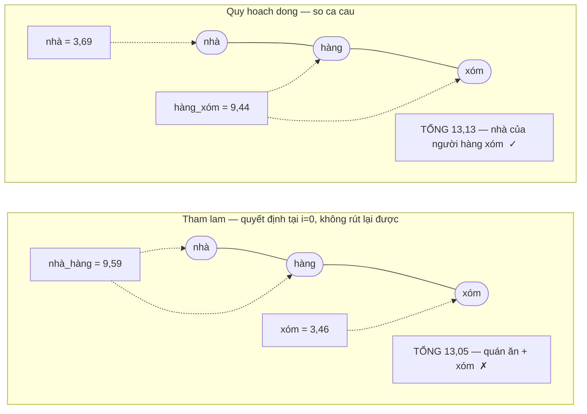

# Báo cáo Cấu trúc dữ liệu & Giải thuật (DSA-REPORT)

> **Tài liệu này là gì?** Báo cáo kỹ thuật về **toàn bộ cấu trúc dữ liệu tự
> cài đặt** trong đồ án: độ phức tạp lý thuyết, **lý do chọn** thay vì phương
> án có sẵn, và **số liệu đo thực nghiệm** trên corpus thu thập từ báo điện tử
> Việt Nam.
>
> **Nguyên tắc xuyên suốt báo cáo:** mỗi khẳng định về hiệu năng đều phải kèm
> **số đo**, không được là suy đoán. Mục 3 ghi lại bốn lỗi hiệu năng mà **chỉ
> có đo mới phát hiện được** — đó là phần đáng đọc nhất. Mục 2.8 và 4.7 là thay
> đổi lớn nhất về chất lượng: bộ tách từ tiếng Việt được viết lại, **nhanh gấp
> 4,80 lần** và tách khác đi ở **54,0%** tài liệu.

> ### ⚠️ Đọc trước: báo cáo này có **nhiều mốc corpus**, không chỉ một
>
> Đây là chỗ dễ tưởng tài liệu mâu thuẫn nhất. Corpus lớn dần qua nhiều phiên
> crawl, và **số đo cũ không được chép lại theo** — chép lại mà không đo lại
> thì thành số bịa. Vì vậy mỗi mục ghi rõ nó đo trên mốc nào, và bảng dưới đây
> là bản quy chiếu:
>
> | Mốc | Quy mô | Xuất hiện ở | Vì sao có mốc này |
> |---|---|---|---|
> | **A — corpus đầu** | 5.011 trang, JSON 62 MB | Mục 2, phần lớn mục 3 và 4 | Bản đầu tiên đủ lớn để đo có ý nghĩa |
> | **B — đa ngữ** | 30.001 trang | Mục 3.5 | Crawl lớn đầu tiên; **12.677 trang (42,3%) không phải tiếng Việt** — chính là lỗi mà mục 3.5 mổ xẻ |
> | **C — sau khi lọc ngôn ngữ** | 30.017 trang *(tải về 31.736)* | Mục 3.5.1, 6.8 | Crawl lại với `LanguageFilter`; 0 trang ngoài chính sách vi/en |
> | **D — hiện tại** | **31.030 trang**, corpus 384 MB, `index.json` 402 MB, 138.507 term | Số của bản mới nhất | Mốc bạn sẽ thấy khi chạy repo hôm nay |
>
> Vài con số nhỏ hơn là **tập con có chủ ý**, không phải mốc riêng: 5.996 tài
> liệu ở mục 4.7 là tập benchmark tách từ, 2.533 trang ở mục 6.8 là phần tiếng
> Trung trong mốc B.
>
> **Số nào cần đo lại thì đo, đừng suy ra.** Mục 7 ghi đủ lệnh để chạy lại từng
> phép đo trên corpus hiện có của bạn.
>
> **Tài liệu liên quan:** `docs/Math/` (lý thuyết), `docs/Math/`
> (từng thuật toán kèm mã), `ARCHITECTURE.md` (kiến trúc),
> `EVALUATION.md` + `GIN-BASELINE.md` (kết quả đánh giá, sinh tự động).

## Mục lục

1. [Bảng tổng hợp Big-O](#1-bảng-tổng-hợp-big-o)
2. [Vì sao chọn cấu trúc này thay vì phương án có sẵn](#2-vì-sao-chọn-cấu-trúc-này-thay-vì-phương-án-có-sẵn)
3. [Sáu lỗi hiệu năng chỉ phát hiện được nhờ đo đạc](#3-sáu-lỗi-hiệu-năng-chỉ-phát-hiện-được-nhờ-đo-đạc)
4. [Số liệu hiệu năng đầy đủ](#4-số-liệu-hiệu-năng-đầy-đủ)
5. [Kiểm thử](#5-kiểm-thử)
6. [Hạn chế đã biết](#6-hạn-chế-đã-biết)
7. [Cách chạy lại mọi số đo](#7-cách-chạy-lại-mọi-số-đo)

---

## 1. Bảng tổng hợp Big-O

### 1.1. Cấu trúc dữ liệu thuần (`datastructure/`)

Nhóm này **không phụ thuộc** vào bất kỳ gói nào khác trong dự án, nên kiểm
thử được độc lập trong vài chục milli-giây.

| Cấu trúc | File | Dùng để làm gì | Big-O thời gian | Big-O bộ nhớ |
|---|---|---|---|---|
| **Trie** | `Trie.java` | Gợi ý từ khoá (autocomplete) | `insert` O(L) · `search` O(L) · `startsWith` O(L) · `getSuggestions` O(L + m log k) · `clear` **O(1)** | O(tổng số ký tự các từ đã insert) |
| **Bloom Filter** | `BloomFilter.java` | Khử trùng lặp URL khi crawl | `add` / `mightContain` O(k), k = số hàm băm (hằng số, thực tế 7) | O(m) bit — **không** phụ thuộc độ dài chuỗi |
| **LRU Cache** | `LRUCache.java` | Cache `SearchResponse` | `get` / `put` **O(1)** · `size` / `containsKey` O(1) | O(capacity) = 200 mục |
| **Min-Heap** | `MinHeap.java` | Lấy top-K điểm cao nhất | `insert` / `extractMin` O(log n) · `peek` O(1) · `topK` **O(n log k)** | O(n) |
| **Url Frontier** | `crawler/frontier/` (9 lớp) | Hàng đợi hai tầng: ưu tiên + politeness | **`addUrl` O(1)** · **`nextUrl` O(log n)** · `size` / `domainCount` O(1) | O(n), chặn trên 500.000 URL |
| **Sparse Matrix** | `SparseMatrix.java` | Ma trận liên kết web cho PageRank | `set` O(1) amortised · `multiply` **O(nnz)** · `nnz()` O(n + nnz) | O(nnz) |
| **Syllable Trie** | `SyllableTrie.java` | Từ điển từ ghép tiếng Việt cho tách từ | `intern` / `child` / `weightAt` **O(1)** kỳ vọng · `insert` O(k), k = số âm tiết | O(số nút + bảng cạnh) — **2,0 MB** cho 49.793 từ |

### 1.2. Chỉ mục và truy vấn (`index/`, `query/`)

| Cấu trúc / Thuật toán | File | Dùng để làm gì | Big-O thời gian | Big-O bộ nhớ |
|---|---|---|---|---|
| **Vietnamese Tokenizer** | `VietnameseTokenizer.java` | Tách từ, chuẩn hoá, bỏ dấu, lọc stopword | `tokenize` O(n × 4) = **O(n)** · `stripDiacritics` O(L) | O(n) cho token + O(\|từ điển\|) cố định |
| **Max-Weight Segmenter** | `MaxWeightSegmenter.java` | Ghép từ ghép bằng **quy hoạch động** (thay Longest Matching) | `segment` O(n × 4) = **O(n)** — đường đi dài nhất trên DAG | O(n) cho hai mảng `best` / `trace` |
| **Vietnamese Word Dictionary** | `VietnameseWordDictionary.java` | Nạp 49.793 từ có tần suất, tính trọng số | `weightOf` **O(1)** · nạp O(\|từ điển\|) = **143 ms**, một lần cho cả tiến trình | O(\|từ điển\|), dùng chung toàn tiến trình |
| **Inverted Index** | `InvertedIndex.java` | Tra tài liệu chứa một term | `addDocument` O(L) · `getPostings` / `getDocumentFrequency` **O(1)** · `getPositions` **O(log n)** · `getAverageDocLength` **O(1)** | O(tổng số cặp (term, doc)) |
| **Term Dictionary** | `TermDictionary.java` | Flyweight cho khoá term | `intern` **O(1)** khấu hao | O(số term phân biệt) — thay vì O(số lần xuất hiện) |
| **Posting Cursor** | `ArrayPostingCursor.java` | Duyệt posting list có nhảy cóc | `next` O(1) · **`skipTo` O(log d)** (galloping) | O(1) — không cấp phát |
| **VByte Codec** | `VByteCodec.java` | Nén danh sách số nguyên tăng dần | `encodeSorted` / `decodeSorted` **O(n)** · `encodeSegments` / `decodeSegments` O(Σn) | O(số byte kết quả) |
| **Compressed Postings** | `CompressedPostings.java` | Dạng nén của posting list trên đĩa | `of` / `toPostings` **O(n + Σ vị trí)** | O(số byte nén) — xem mục 4.2 |
| **Posting List Merger** | `PostingListMerger.java` | Giao/hợp posting list, khớp cụm từ | `intersect` / `union` **O(m+n)** · `intersectCursors` **O(m log(d/m))** · `intersectAll` shortest-first · `matchesPhrase` O(p₁ · k · log p) | O(\|kết quả\|) |
| **Query Parser** | `QueryParser.java` | Tách mustTerms / phrases / excludedTerms | `parse` **O(L)** | O(số term) |
| **Candidate Resolver** | `CandidateResolver.java` | Từ truy vấn đã phân tích → danh sách ứng viên | Chi phối bởi `intersectAll` | O(số ứng viên) |

### 1.3. Xếp hạng (`ranking/`)

| Thuật toán | File | Dùng để làm gì | Big-O thời gian | Big-O bộ nhớ |
|---|---|---|---|---|
| **TF-IDF Scorer** | `TfIdfScorer.java` | Điểm liên quan (cosine) | **O(q log d)** | O(1) ngoài dữ liệu chỉ mục |
| **BM25 Scorer** | `BM25Scorer.java` | Điểm liên quan (baseline công nghiệp) | **O(q log d)** | O(1) ngoài dữ liệu chỉ mục |
| **PageRank** | `PageRankService.java` | Điểm uy tín trang dựa trên liên kết | **O(iterations · (nnz + N))** | O(N + nnz) |
| **Result Ranker** | `ResultRanker.java` | Kết hợp điểm, top-K, sinh snippet | Chấm điểm O(c · q · log d) · top-K O(c log topN) · **snippet chỉ O(topN · docLength)** | O(c) |

### 1.4. Đánh giá chất lượng (`eval/`)

| Thuật toán | File | Big-O thời gian |
|---|---|---|
| **P@k, R@k, F1@k** | `EvaluationMetrics.java` | O(k) |
| **Average Precision** | `EvaluationMetrics.java` | O(\|ranked\|) |
| **nDCG@k** | `EvaluationMetrics.java` | O(k + \|qrels\| log \|qrels\|) — có sort để dựng thứ tự lý tưởng |
| **MRR / Success@k** | `EvaluationMetrics.java` | O(\|ranked\|) — dùng `indexOf` |
| **Known-item query generation** | `KnownItemQueryGenerator.java` | O(N · L) để tokenize + O(V log V) để sắp term mỗi tài liệu |
| **TREC pooling** | `PoolBuilder.java` | O(số cấu hình × số truy vấn × k) |

### 1.5. Phía trình duyệt (TypeScript)

| Cấu trúc | File | Dùng để làm gì | Big-O thời gian | Big-O bộ nhớ |
|---|---|---|---|---|
| **Stack** | `lib/Stack.ts` | Back/forward của trình duyệt | `push` / `pop` / `peek` **O(1)** | O(độ sâu lịch sử) |
| **Trie** | `lib/BookmarkTrie.ts` | Tìm bookmark theo tiền tố tiêu đề | `insert` O(L) · `searchByPrefix` O(L + m) | O(tổng số ký tự tiêu đề) |

### Chú thích ký hiệu

| Ký hiệu | Nghĩa |
|---|---|
| `L` | Độ dài một chuỗi / văn bản (số ký tự hoặc số token) |
| `n`, `m` | Kích thước cấu trúc hoặc danh sách liên quan |
| `N` | Tổng số tài liệu trong corpus (= 5.011) |
| `D` | Số host phân biệt trong frontier (= 52 khi crawl 6 báo) |
| `n_d` | Số URL đang chờ của **một** host |
| `nnz` | Số phần tử khác 0 của ma trận thưa (= 239.691 cạnh) |
| `c` | Số ứng viên sau khi giao posting list |
| `q` | Số term phân biệt trong truy vấn (nhỏ, thường 1–4) |
| `d` | Độ dài posting list dài nhất trong các term của truy vấn |
| `k` | Tham số nhỏ: số hàm băm, số gợi ý, top-k |
| `V` | Số term phân biệt của một tài liệu |

---

## 2. Vì sao chọn cấu trúc này thay vì phương án có sẵn

> **Cách đọc mục này.** Mỗi mục con trả lời cùng một câu hỏi: *"Java đã có
> sẵn thứ tương đương, vậy vì sao vẫn tự cài?"* Câu trả lời phải là **số đo**
> hoặc một **lý do kỹ thuật cụ thể** — không được là "để cho biết".

### 2.1. Bloom Filter thay cho `HashSet<String>` — khử trùng lặp URL

**Bài toán.** Crawl 5.011 trang thu về **394.940 outlink**. Mỗi outlink phải
hỏi "URL này crawl chưa?" trước khi fetch.

**Đo thực tế** với **1.000.000 URL**, `expectedItems = 1.000.000`,
`falsePositiveRate = 0,01`:

| Cấu trúc | Bộ nhớ | Ghi chú |
|---|---|---|
| **BloomFilter** (lý thuyết, `m/8` byte) | **~1.170 KB (~1,1 MB)** | m = 9.585.059 bit, k = 7 |
| `HashSet<String>` (đo heap delta thực tế) | **~110.932 KB (~108 MB)** | Lưu nguyên vẹn từng chuỗi |

→ `HashSet` tốn **~95 lần** bộ nhớ ở cùng quy mô, vì nó phải lưu nguyên vẹn
từng chuỗi URL (cộng overhead của `String`, entry của `HashMap` bên trong, con
trỏ…), trong khi Bloom Filter chỉ lưu vài bit trên mỗi phần tử, **độc lập với
độ dài chuỗi gốc**.

**Kiểm chứng con số bằng công thức:**

$$
m = \left\lceil \frac{-10^6 \ln 0{,}01}{(\ln 2)^2} \right\rceil
  = \left\lceil \frac{4{.}605{.}170}{0{,}480453} \right\rceil
  = 9{.}585{.}059 \text{ bit}
$$

$$
\frac{9{.}585{.}059}{8 \times 1024} = 1{.}170 \text{ KB} \quad ✓
$$

**Đánh đổi, nói cho rõ.** Có tỷ lệ false positive nhỏ (đã cấu hình 1%) nhưng
**không bao giờ** có false negative. Đây là **đúng chiều** đánh đổi cần
thiết cho bài toán "có thể đã crawl hay chưa":

| Loại lỗi | Hậu quả | Có xảy ra không |
|---|---|---|
| False positive | Bỏ lỡ một vài trang chưa crawl | Có, ~1% |
| False negative | Crawl lại trang đã crawl → **vòng lặp vô hạn** | **Không bao giờ** |

**Lưu ý quan trọng: đây không phải lớp khử trùng lặp duy nhất.** `UrlFrontier`
còn giữ một `HashSet<String> enqueued` **chính xác tuyệt đối** để trả lời
"URL này đã **xếp hàng** chưa?". Hai lớp có hai vai trò khác nhau: Bloom
Filter đứng ở chỗ được gọi 394.940 lần (ưu tiên tiết kiệm bộ nhớ), `enqueued`
đứng ở chỗ cần chính xác để frontier không phình. Xem mục 3.1 của
`ARCHITECTURE.md`.

---

### 2.2. Two-pointer `intersect` thay cho `HashSet.retainAll`

**Bài toán.** Truy vấn nhiều term cần lấy **giao** các posting list.

**Đo thực tế** với 2 danh sách **đã sắp xếp**, 500.000 phần tử mỗi bên, kết
quả giao ~250.000 phần tử, trung bình 5 lần chạy:

| Cách làm | Thời gian trung bình/lần |
|---|---|
| **Two-pointer `PostingListMerger.intersect`** | **~10,0 ms** |
| `HashSet.retainAll` (không tính chi phí xây HashSet) | ~15,5 ms (**chậm hơn ~55%**) |
| `HashSet.retainAll` (tính cả chi phí xây 2 HashSet) | ~27,0 ms (**chậm hơn ~2,7 lần**) |

**Vì sao two-pointer thắng ở cả hai kịch bản:**

1. **Không có overhead tính hash và xử lý va chạm** của `HashMap`/`HashSet`.
   $O(m+n)$ của two-pointer là $O(m+n)$ **tuyệt đối**, không có hằng số ẩn.
2. **Tận dụng trực tiếp tính chất "đã sắp xếp"** vốn có của posting list —
   một bất biến được đảm bảo *miễn phí* lúc dựng chỉ mục (xem mục 3.2 của
   `docs/Math/`).
3. **Không cần cấp phát cấu trúc trung gian** nào.

**Cột nào là so sánh công bằng?** Cột thứ **3**. Trong hệ thống thật, posting
list là `List<Posting>` lấy thẳng từ chỉ mục, nên nếu dùng `HashSet` thì
**phải trả** chi phí xây HashSet ở **mỗi** truy vấn. Cột thứ 2 chỉ có ý nghĩa
nếu HashSet được cache sẵn — mà cache HashSet cho 136.768 term là chuyện
không khả thi về bộ nhớ.

---

### 2.3. Ma trận thưa thay cho `double[n][n]` — đồ thị liên kết cho PageRank

Đây là chỗ **quy mô corpus làm thay đổi kết luận**, nên phải đo ở **hai** mức
— và đó chính là bài học.

| Corpus | n | nnz (cạnh) | Ma trận đặc | Adjacency list | Tỷ lệ thưa nnz/n² |
|---|---|---|---|---|---|
| 150 trang, **1 domain** | 150 | 3.901 | 176 KB | 61 KB | **17,3%** |
| **5.011 trang, 6 domain** | 5.011 | 239.691 | **191,5 MB** | ~3,7 MB | **0,95%** |

**Đọc bảng này thế nào.** Ở corpus nhỏ một-domain, tỷ lệ thưa 17,3% **chưa
ấn tượng** — một website tin tức liên kết chéo nội bộ rất dày (menu, chuyên
mục, bài liên quan), nên ma trận không thưa lắm. Nếu chỉ đo ở mức này, ta có
thể kết luận sai rằng "ma trận thưa không lợi bao nhiêu".

Khi mở rộng lên 6 báo độc lập, tỷ lệ thưa **giảm 18 lần xuống 0,95%** và ma
trận đặc tương đương đã cần **191,5 MB**. Đây là **chứng minh bằng thực
nghiệm** rằng lợi ích của ma trận thưa **tăng theo quy mô corpus**, đúng như
dự đoán lý thuyết — đồ thị web thật, trải trên nhiều triệu domain, thường có
tỷ lệ thưa dưới 0,01%.

**Kiểm chứng 191,5 MB:**

$$
5011 \times 5011 \times 8 \text{ byte} = 200{.}881{.}368 \text{ byte} = 191{,}6 \text{ MB} \quad ✓
$$

**Con số quan trọng nhất trong bảng lại không phải nnz.** Trong 239.691 cạnh
có **42.002 cạnh liên kết chéo giữa các domain** (17,5%). Đây mới là thứ
khiến PageRank **có ý nghĩa**: liên kết nội bộ một tờ báo phản ánh **cấu trúc
điều hướng** chứ không phản ánh **uy tín**. Corpus 150 trang cùng một tờ báo
có **0** liên kết chéo domain, nên PageRank trên đó gần như vô nghĩa — và đó
chính là lý do `MultiDomainCrawlRunner` được viết ra.

**Vì sao adjacency list *rồi mới* CSR — dùng cả hai chứ không chọn một.** CSR
(3 mảng liên tục) có locality tốt hơn hẳn khi `multiply`, nhưng cần **biết
trước** số phần tử để cấp phát mảng cố định. Ma trận này lại được **xây dần**
(`incoming.set(...)` mỗi khi phát hiện một cạnh), nên lúc xây phải là adjacency
list để thêm phần tử trong $O(1)$ khấu hao.

Lời giải là **hai chế độ trong một lớp**: xây bằng adjacency list, rồi
`freeze()` sang CSR $O(nnz)$ **một lần** trước khi bắt đầu lặp. Từ đó mọi vòng
`multiply` chạy trên 3 mảng nguyên thuỷ liên tục. `PageRankService` gọi
`incoming.freeze()` ngay trước vòng lặp power iteration, và `set()` sau khi
freeze sẽ ném `IllegalStateException` — bất biến "đã đóng băng thì bất biến"
được **ép bởi code**, không phải bằng quy ước.

Đây cũng là kỹ thuật `rowPtr` được **dùng lại lần thứ hai** ở
`CompressedPostings` để nén danh sách vị trí (xem mục 4.2) — cùng một ý tưởng,
hai chỗ khác nhau trong đồ án.

---

### 2.4. Tự cài Doubly Linked List cho `LRUCache` thay vì `LinkedHashMap`

**Phương án có sẵn.** `LinkedHashMap` với `accessOrder = true` và override
`removeEldestEntry` làm được LRU cache "miễn phí", chỉ vài dòng.

**Vì sao vẫn tự viết.** Đây là mục duy nhất trong báo cáo mà lý do **không**
phải hiệu năng — hai cách đều $O(1)$. Lý do là **yêu cầu cốt lõi của đồ án
DSA: chứng minh hiểu bản chất, không chỉ biết gọi API có sẵn.** Tự viết Doubly
Linked List + 2 sentinel node buộc phải trả lời được ba câu hỏi:

**(a) Vì sao di chuyển một node lên đầu là $O(1)$?** Vì chỉ đổi **4 con trỏ**,
không cần duyệt danh sách:

```java
private void addToFront(Node<K, V> node) {
    node.prev = head;
    node.next = head.next;
    head.next.prev = node;
    head.next = node;
}
```

**(b) Vì sao cần danh sách liên kết *đôi*?** Để xoá một node ở **giữa** trong
$O(1)$ cần biết **cả** node trước và node sau. Danh sách liên kết đơn phải
duyệt từ đầu để tìm node trước → $O(n)$, và khi đó cache LRU mất hoàn toàn ưu
điểm.

**(c) Vì sao 2 sentinel node?** Để `removeNode` chỉ cần 2 dòng và **không bao
giờ** phải kiểm tra `null` cho trường hợp thêm/xoá ở đầu hoặc cuối:

```java
private void removeNode(Node<K, V> node) {
    node.prev.next = node.next;
    node.next.prev = node.prev;
}
```

Không có sentinel thì hàm này phải thành 6–8 dòng với các nhánh `if (node.prev == null)`,
`if (node.next == null)` — mỗi nhánh là một chỗ có thể sai.

**Phần thưởng ngoài dự kiến: một bẫy đồng thời chỉ hiện ra khi tự viết.**
`get()` **trông như** thao tác đọc, nhưng nó phải `moveToFront` — tức là một
thao tác **ghi**. Dùng read lock ở đây thì nhiều thread cùng "đọc" sẽ cùng
sửa danh sách liên kết và **làm hỏng cấu trúc dữ liệu**:

```java
public V get(K key) {
    lock.writeLock().lock();   // ← KHÔNG phải readLock, dù tên hàm là get
    ...
}
```

Người chỉ gọi `LinkedHashMap` sẽ không bao giờ gặp — và cũng không bao giờ
hiểu — vấn đề này.

---

### 2.5. Hàng đợi tách theo domain cho `UrlFrontier`

**Đây là bài học hiệu năng lớn nhất của phần crawler**, và nó **chỉ lộ ra khi
tăng quy mô**.

**Bản đầu tiên: một heap toàn cục.** Khi phần tử ưu tiên cao nhất thuộc domain
đang trong politeness delay, thuật toán phải rút nó ra, gác sang danh sách
tạm, rồi rút tiếp phần tử sau. Trường hợp xấu nhất — **mọi** URL đang chờ đều
thuộc các domain vừa truy cập — phải rút **cạn** cả heap rồi nhét lại toàn bộ:

$$
O(n \log n) \text{ cho MỖI lần lấy MỘT URL}
$$

**Vì sao lỗi này không lộ ra ở corpus nhỏ.** Ở quy mô 150 trang, chi phí này
**không quan sát được**. Nhưng mỗi trang tin tức sinh trung bình **78,8
outlink** (394.940 / 5.011), nên crawl 5.000 trang đẩy frontier lên hàng chục
nghìn URL — và crawler thực tế **đứng hình**.

**Giải pháp.** Giữ `Map<domain, MinHeap>` — chính là mô hình "back queue theo
host" của crawler **Mercator** (Heydon & Najork, 1999). Chỉ cần quét qua các
domain (`D` nhỏ), chọn domain vừa hết hoãn và có phần tử đầu hàng ưu tiên cao
nhất, rồi `extractMin` **đúng một lần**:

| Thiết kế | Chi phí mỗi `nextUrl()` |
|---|---|
| Một heap toàn cục | $O(n\log n)$ — phụ thuộc **tổng** kích thước frontier |
| **Tách theo domain** | **$O(D + \log n_d)$** — **không** phụ thuộc tổng kích thước |

**Kết quả đo:** crawl 5.011 trang trong **3,2 phút**, thông lượng **26,2
trang/giây**, với **52 host** phân biệt hoạt động song song.

**Trần thông lượng là ràng buộc kiến trúc, không phải vấn đề tối ưu.**
Politeness delay 1 giây/host nghĩa là:

$$
\text{thông lượng tối đa (trang/giây)} = \text{số host được crawl đồng thời}
$$

52 host → trần lý thuyết 52 trang/giây, thực đo 26,2 (khoảng 50% trần, phần
còn lại là độ trễ fetch và parse). Muốn 400 trang/giây thì **phải có ≥ 400
host**, không phải mua máy nhanh hơn.

**Hai chi tiết cài đặt đáng ghi nhận:**

1. **Dọn heap rỗng bằng `it.remove()`** trong vòng quét. Không dọn thì các
   domain đã cạn URL vẫn bị quét lại mãi, khiến `D` chỉ tăng chứ không giảm
   trong suốt phiên crawl — làm mất đúng cái ưu điểm "D nhỏ" mà thiết kế này
   dựa vào.
2. **`Thread.sleep(50)` nằm NGOÀI khối `synchronized`.** Nếu ngủ trong khối
   đồng bộ, thread đang ngủ vẫn giữ khoá và **chặn mọi thread khác muốn
   `addUrl`** — biến một tối ưu thành một điểm nghẽn tệ hơn cả vấn đề ban đầu.

**Chặn trên bộ nhớ.** `DEFAULT_MAX_SIZE = 500_000` URL đang chờ. Khi đầy, URL
mới bị bỏ qua (đếm vào `droppedDueToCapacity`) thay vì để bộ nhớ phình không
kiểm soát. Đây là đánh đổi **có chủ ý**: vì crawler ưu tiên theo bề rộng, các
URL bị bỏ hầu hết là URL độ sâu lớn — vốn có điểm ưu tiên thấp nhất.

---

### 2.6. Sắp xếp shortest-first trong `intersectAll`

**Lập luận.** Gọi `A` là kết quả giao sau `k` bước, luôn có

$$
|A| \le \min\bigl(\text{các list đã xét}\bigr)
$$

Bắt đầu từ list **ngắn nhất** giúp `|A|` nhỏ **ngay từ đầu**, nên các bước
giao kế tiếp — mỗi bước tốn $O(\lvert A\rvert + \lvert\text{list ke tiep}\rvert)$ — rẻ hơn đáng kể
so với bắt đầu từ list dài nhất.

**Khi nào lợi nhất:** khi một term **hiếm** (df nhỏ) trộn với nhiều term **phổ
biến** (df lớn). Ví dụ `iPhone` (df = 5) với `của` (df = 4000): bắt đầu từ
`iPhone` thì kết quả trung gian ≤ 5 phần tử, nên mọi bước sau gần như miễn
phí.

Kèm hai tối ưu thoát sớm:

```java
// Trong intersectAll: giao rỗng thì dừng ngay
for (int i = 1; i < sorted.size() && !result.isEmpty(); i++) { ... }
```

```java
// Trong CandidateResolver: df = 0 ở BẤT KỲ term → trả rỗng, không cần giao gì
if (postings.isEmpty()) {
    return new ResolvedQuery(new ArrayList<>(), queryTermFrequency);
}
```

---

### 2.7. Tự cài `MinHeap` thay vì `java.util.PriorityQueue`

`PriorityQueue` của Java cũng là binary heap trên mảng và cũng nhận
`Comparator`. Ba lý do tự cài:

1. **Yêu cầu đề bài** — heap là cấu trúc dữ liệu lõi phải tự cài.
2. **Cần một `topK` tĩnh có hành vi cụ thể.** `MinHeap.topK` duy trì heap kích
   thước tối đa `k`, trả về danh sách **giảm dần** — `PriorityQueue` không có
   sẵn thao tác này, phải tự viết vòng lặp bên ngoài, và khi đó phần đáng học
   nhất lại nằm ngoài cấu trúc.
3. **Biểu diễn heap hiện rõ trong code** để đưa vào báo cáo: phần tử tại `i`
   có con trái ở `2i+1`, con phải ở `2i+2`, cha ở `(i−1)/2` — biểu diễn "cây
   nhị phân đầy đủ" chuẩn, không cần con trỏ.

---

### 2.8. Trie âm tiết + quy hoạch động thay cho `HashSet` + Longest Matching

> Đây là thay đổi **lớn nhất** về chất lượng trong toàn bộ đồ án: nó gỡ bỏ đúng
> cái trần đã được ghi nhận ở mục 6.1 của các bản báo cáo trước.

#### Vấn đề của phương án cũ

Bản cũ ghép từ ghép bằng **Longest Matching tham lam** trên một
`HashSet<String>` 154 mục:

```java
for (int len = maxLen; len >= 2; len--) {
    String candidate = String.join(" ", Arrays.copyOfRange(syllables, i, i + len));
    if (bigramDictionary.contains(candidate)) { matchedLen = len; break; }
}
```

Đoạn này có **hai** khiếm khuyết độc lập, và chúng che lấp lẫn nhau:

| # | Khiếm khuyết | Hệ quả |
|---|---|---|
| 1 | Từ điển **154 mục**, chỉ trả lời *có / không* | Hầu hết từ ghép không được nhận ra |
| 2 | Tham lam, **không rút lại được** quyết định | Tách sai ở câu nhập nhằng |

Khiếm khuyết (2) hầu như **không lộ ra** khi từ điển còn nhỏ — muốn chọn sai
thì trước hết phải có nhiều lựa chọn. Nên chỉ sửa (1) mà giữ (2) sẽ khiến chất
lượng **tệ đi**, chứ không tốt lên. Hai thay đổi này bắt buộc phải đi cùng nhau.

#### Vì sao tham lam sai

Xét cụm `nhà hàng xóm`. Cả hai cách tách đều **hợp lệ về từ điển**:



Cùng nội dung đó ở dạng ASCII (để đọc được cả khi Mermaid không render):
```
             âm tiết:   nhà      hàng      xóm
                        |         |         |
   Tham lam:            +----+----+         |      "nhà hàng" CÓ trong từ điển
                          9,59              |      -> chộp ngay, hết đường lui
                                          3,46
                        TỔNG = 9,59 + 3,46 = 13,05     -> [nhà_hàng][xóm]   SAI

   Quy hoạch động:      |         +----+----+
                       3,69            9,44
                        TỔNG = 3,69 + 9,44 = 13,13     -> [nhà][hàng_xóm]   ĐÚNG
                                                          ^^^^^ lớn hơn
```

Mấu chốt: tham lam **không có cách nào** phân biệt hai phương án này, vì cả hai
đều khớp từ điển. Nó buộc phải đoán bằng heuristic "dài hơn thì đúng hơn" — và ở
đây heuristic đó sai. Quy hoạch động không đoán: nó chấm điểm **cả câu** rồi chọn
tổng lớn nhất, nên tần suất của `hàng xóm` có cơ hội thắng tần suất của `nhà hàng`.

#### Nguồn từ điển và giấy phép

Từ điển lấy từ **`coccoc-tokenizer`** — bộ tách từ mã nguồn mở **đang chạy trong
hệ thống Search và Ads của Cốc Cốc**, công cụ tìm kiếm lớn thứ hai Việt Nam.
Cụ thể là file `dicts/tokenizer/vndic_multiterm`.

| | |
|---|---|
| Kho nguồn | `github.com/coccoc/coccoc-tokenizer` — **không** vendor vào repo này; clone riêng nếu cần sinh lại từ điển |
| Giấy phép | **LGPL-3.0** — file `vietnamese-words.txt` sinh ra giữ nguyên ghi công trong phần đầu file |
| Đã dùng | `vndic_multiterm` (từ vựng) + công thức trọng số |
| **Không** dùng | `keyword.freq` — lý do ở mục 3.4(a) |

Bộ tách từ đó tự công bố tốc độ **15 triệu ký tự/giây**. Đáng chú ý cho phần
thảo luận: một hệ thống thương mại quy mô đó vẫn tách từ tiếng Việt bằng **từ
điển**, không bằng mô hình học máy — README của họ nói thẳng mục tiêu là "đạt
hiệu năng cao trong khi giữ chất lượng ở mức hợp lý cho nhu cầu xếp hạng".

#### Công thức trọng số

Lấy nguyên văn công thức đang chạy trong production của Cốc Cốc
(`multiterm_hash_trie_node.hpp`, hàm `finalize()`):

$$w = \bigl(\log_2(f + 3)\bigr)^{\alpha_k} \cdot k^{\beta_k}$$

với `f` là tần suất, `k` số âm tiết, và $(\alpha_k, \beta_k)$ tra từ bảng
`PARAM = {0,38 · 1,00 | 0,14 · 2,59 | 1,42 · 4,42 | 1,45 · 0,23}`.

Hai chi tiết **không hiển nhiên** trong công thức này:

- **`log₂(f)` chứ không phải `f`.** Tần suất trải từ 10 đến 2.147.483.647 — hơn
  tám bậc. Dùng thang tuyến tính thì một từ phổ biến áp đảo mọi tổ hợp khác và
  quy hoạch động thoái hoá thành "luôn chọn từ phổ biến nhất", bất kể ngữ cảnh.
- **`+3` trước khi lấy log.** Chặn dưới. Từ có `f = 1` cho `log₂(1) = 0`, tức
  trọng số 0 — đúng bằng giá trị dành cho *"không phải từ"*.

#### Vì sao mảng phẳng chứ không phải nút đối tượng

Cách viết tự nhiên là mỗi nút một đối tượng chứa `Map<String, Node> children`.
Với ~50.000 nút, đó là 50.000 `Node` **cộng** 50.000 `HashMap` — mỗi `HashMap`
rỗng đã tốn ~48 byte header trước khi chứa gì. `SyllableTrie` thay bằng:

| | Cách tự nhiên | `SyllableTrie` |
|---|---|---|
| Nút | đối tượng `Node` | **chỉ số `int`** vào mảng song song |
| Cạnh | một `HashMap` **mỗi nút** | **một** bảng băm địa chỉ mở cho **cả cây** |
| Khoá cạnh | `String` | `(nútCha << 32) \| idÂmTiết`, kiểu `long` |
| Phụ trội mỗi cạnh | ~64 byte (boxing `Long`+`Integer`+ `Node` của HashMap) | **12 byte**, không đối tượng |

Bảng băm tự cài chứ không dùng `HashMap<Long, Integer>` vì `HashMap` bắt buộc
**boxing** cả khoá lẫn giá trị. Mảng `long[]` + `int[]` nằm liền nhau trong bộ
nhớ nên thân thiện với cache CPU — và mục 3.4 dưới đây cho thấy điều đó **đo
được**, không phải lý thuyết suông.

> **Bẫy đã tránh:** khoá cạnh là `(nútCha << 32) | idÂmTiết`. Nếu chỉ lấy
> `khoá & mask` thì **32 bit cao — chính là nút cha — bị vứt đi hoàn toàn**, và
> mọi cạnh mang cùng một âm tiết sẽ đổ vào cùng một ô. Âm tiết phổ biến như
> `của` xuất hiện dưới hàng nghìn nút cha khác nhau, tất cả sẽ xếp thành một
> chuỗi thăm dò dài — biến O(1) thành O(n). Vì vậy khoá được trộn bằng hàm
> finalizer của splitmix64 trước khi lấy dư. `SyllableTrieTest` có một test
> riêng ép đúng tình huống này (`sameSyllableUnderManyParentsStaysCorrect`).

---

## 3. Sáu lỗi hiệu năng chỉ phát hiện được nhờ đo đạc

> **Mục đích của mục này.** Ghi lại những vấn đề mà **suy luận thuần không tìm
> ra** — chỉ có số đo mới lộ. Đây là phần trả lời trực tiếp cho câu hỏi "vì
> sao phải đo, chẳng phải Big-O đã đủ sao?".
>
> Mục [3.6](#36-chẩn-đoán-bộ-nhớ-sai-gần-sáu-lần--và-thủ-phạm-thật) là ví dụ
> mạnh nhất của cả mục: ở đó **một chẩn đoán nghe rất hợp lý đã sai gần sáu
> lần**, và chỉ một phép đo mới chỉ ra được thủ phạm thật.

### 3.1. Sinh snippet cho mọi ứng viên thay vì chỉ top-N

**Triệu chứng.** Thời gian truy vấn tăng nhanh hơn dự kiến khi corpus lớn
lên, dù Big-O của phần chấm điểm không đổi.

**Nguyên nhân.** `ResultRanker.rank()` ban đầu gọi `buildSnippet()` **bên
trong vòng lặp chấm điểm**, tức cho **mọi** ứng viên, rồi mới dùng MinHeap cắt
lấy top-N. Mỗi lần sinh snippet phải tách toàn bộ `bodyText` (trung bình
**1.043 token**) và trượt cửa sổ qua từng từ. Với 500 ứng viên thì **490
snippet bị tạo ra rồi vứt đi ngay**.

**Vì sao Big-O không phát hiện được.** Vì cả hai bản đều là "một vòng lặp qua
`c` ứng viên". Sai lệch nằm ở **hằng số** bên trong vòng lặp — mà Big-O cố ý
bỏ qua hằng số.

**Cách sửa.** Tách thành **ba** bước rõ ràng: chấm điểm → lấy top-K bằng
MinHeap → **chỉ** sinh snippet cho K tài liệu sống sót.

| | Trước | Sau |
|---|---|---|
| Độ phức tạp phần snippet | $O(c\cdot\lvert d\rvert)$ | **$O(\text{topN}\cdot\lvert d\rvert)$** |
| Với c = 500, topN = 10 | 500 snippet | **10 snippet** |

Comment trong code ghi lại nguyên nhân để không ai "tối ưu" ngược trở lại:

```java
// BUOC 1 - chi CHAM DIEM moi ung vien, chua sinh snippet.
// ... Truoc day buoc nay chay cho MOI ung vien roi moi cat top-N, nghia la
// voi 500 ung vien thi 490 snippet bi vut di ngay sau khi tao ra ...
```

---

### 3.2. Lỗi phương pháp đo: bỏ qua JIT warmup của JVM

**Triệu chứng.** Phép so sánh với PostgreSQL ban đầu cho kết quả **10,83 ms**
(chỉ mục tự cài) so với **1,42 ms** (GIN) — chênh gần 8 lần, một con số khó
tin.

**Nguyên nhân — lỗi ở *phương pháp đo*, không ở code.** Phép đo chạy chỉ mục
tự cài **trước**, GIN **sau**. Nhưng JVM thực thi những lần gọi đầu bằng
**trình thông dịch**, chỉ sau vài nghìn lượt thì JIT mới biên dịch sang mã
máy. Nghĩa là **phía chạy trước gánh toàn bộ chi phí khởi động, phía chạy sau
hưởng JVM đã nóng** — chênh lệch đo được phản ánh **thứ tự chạy** chứ không
phản ánh cài đặt.

**Cách sửa.** Thêm 2 vòng làm nóng cho **cả hai** phía trước khi bấm giờ:

```java
System.out.println("Lam nong JVM ...");
for (int round = 0; round < 2; round++) {
    for (KnownItemQueryGenerator.KnownItemQuery q : queries) {
        harness.search(q.queryText(), config, TOP_N);
        repo.searchWithGin(q.queryText(), TOP_N);
    }
}
```

| Phép đo | Trước khi sửa | Sau khi sửa | Chênh |
|---|---|---|---|
| Chỉ mục tự cài | 10,83 ms | **6,43 ms** | −40,6% |
| PostgreSQL GIN | 1,42 ms | 1,18 ms | −16,9% |

*(Cặp số trên là phép đo **lịch sử** tại thời điểm phát hiện lỗi, chụp trên
cùng một máy và cùng một lần chạy — giữ lại để thấy độ lớn của sai lệch. Con
số hiện hành, sau đợt tối ưu tính-trước-theo-truy-vấn ở mục 4.4, là
**1,62 ms** so với **1,24 ms**; xem `docs/GIN-BASELINE.md`.)*

Chi phí warmup chiếm **~40%** con số ban đầu ở phía chạy trước. **Kết luận
cuối cùng không đổi** (GIN vẫn nhanh hơn), nhưng mức chênh lệch báo cáo sai
lệch đáng kể nếu không sửa: từ "chậm hơn 7,6 lần" thành "chậm hơn 5,4 lần".

**Bài học tổng quát:** luôn chạy vài vòng làm nóng cho **mọi** phía trước khi
bấm giờ, và **hoài nghi** mọi phép đo mà thứ tự chạy có thể ảnh hưởng tới.

---

### 3.3. Từ khoá gợi ý là tiếng lẻ — lỗi chất lượng, không phải hiệu năng

**Triệu chứng.** Gõ `cong` vào ô tìm kiếm thì gợi ý ra `cong`, `the`,
`congreso`, và cả những tiêu đề tiếng Anh dài loằng ngoằng.

**Nguyên nhân — ba lỗi cùng lúc trong `SuggestionService.rebuild()`:**

| Lỗi | Hậu quả |
|---|---|
| Chèn **nguyên tiêu đề** làm một gợi ý | Gợi ý dài loằng ngoằng, không ai gõ hết |
| Chèn **từng tiếng lẻ** | `cong`, `the`, `kinh` — trong tiếng Việt tiếng lẻ phần lớn **không phải từ** |
| Chỉ `insert` mà **không `clear()`** | Tiêu đề của corpus **cũ** vẫn còn trong Trie sau mỗi lần crawl lại |

**Cách sửa.** Tokenize tiêu đề bằng **chính** `VietnameseTokenizer` rồi chỉ
lấy hai loại đơn vị mà người dùng **thực sự gõ**:

1. Các **từ ghép** mà tokenizer nhận ra (term chứa dấu `_`).
2. Các **cặp token liền nhau** — bắt các cụm phổ biến mà từ điển chưa kịp có,
   ví dụ `bóng đá Việt Nam`.

Kèm ba bước lọc:

```java
public static final int MIN_SUGGESTION_FREQUENCY = 3;
...
suggestTrie.clear();                                    // (1) xoá sạch trước
...
if (title == null || title.isBlank() || !LanguageDetector.looksVietnamese(title)) {
    continue;                                           // (2) bỏ tiêu đề không phải tiếng Việt
}
...
if (entry.getValue() < MIN_SUGGESTION_FREQUENCY) {
    continue;                                           // (3) chỉ giữ cụm xuất hiện ≥ 3 lần
}
```

Cách phát hiện tiếng Việt cũng đáng nhắc — dùng **dấu thanh** làm dấu hiệu,
với ngưỡng độ dài để không loại nhầm tiêu đề rất ngắn. Hàm này nay nằm trong
lớp riêng `service/LanguageDetector` (trước đây là phương thức private trong
`SearchEngineFacade` — một ví dụ **Feature Envy** rõ rệt):

```java
public static final int MIN_LENGTH_TO_JUDGE = 15;

public static boolean looksVietnamese(String text) {
    if (text == null) return false;
    String trimmed = text.trim();
    if (trimmed.isEmpty()) return false;
    if (trimmed.length() < MIN_LENGTH_TO_JUDGE) {
        return true;    // "Video" có thể không có dấu nào
    }
    // Điểm bất động: stripDiacritics(s) == s ⟺ s không có dấu nào.
    return !VietnameseTokenizer.stripDiacritics(trimmed).equals(trimmed);
}
```

Tách ra còn cho phép dùng nó ở **chỗ thứ hai** mà trước đây bỏ sót:
`KnownItemQueryGenerator` sinh truy vấn đánh giá từ corpus có lẫn bài tiếng
Trung và tiếng Anh, tạo ra những truy vấn vô nghĩa.

**Vì sao lỗi này thuộc mục "chỉ đo mới thấy".** Không có test đơn vị nào bắt
được nó — mọi hàm đều làm đúng thứ nó được viết ra để làm. Lỗi chỉ hiện ra khi
**thực sự gõ vào ô tìm kiếm và nhìn kết quả** trên corpus thật.

---

### 3.4. Hai lỗi của chính bản tách từ mới — cả hai chỉ lộ ra khi chạy thật

Mục này ghi lại hai sai lầm mắc phải **trong lúc làm mục 2.8**. Cả hai đều
"đúng trên giấy" và chỉ bị bắt khi có số đo.

#### (a) Dùng nhầm truy vấn tìm kiếm làm từ vựng

`coccoc-tokenizer` có hai file từ điển, và lúc đầu chúng được gộp cả vào:

| File | Số mục | Thực chất là gì |
|---|---|---|
| `vndic_multiterm` | 40.236 từ ghép | **Từ vựng** — các từ của tiếng Việt |
| `keyword.freq` | 142.040 mục | **Truy vấn** người dùng đã gõ vào Cốc Cốc |

Gộp cả hai cho 164.005 từ ghép — nghe như càng nhiều càng tốt. Chạy thử thì:
```
nhà hàng xóm                       -> [nhà_hàng_xóm]            (gộp hết làm một)
tôi đi mua máy tính xách tay mới   -> [đi][mua_máy_tính][xách_tay][mới]
```

`mua máy tính` **là** một truy vấn có thật, nhưng **không phải một từ**. Đưa nó
vào từ điển thì bộ tách từ học được rằng "mua máy tính" là một đơn vị từ vựng —
và nó phá luôn `máy tính xách tay`. Bảng tham số làm chuyện tệ hơn: $\beta_3 =
4{,}42$ khiến mọi khớp 3 âm tiết mạnh gấp ~1.000 lần hai khớp 2 âm tiết cộng
lại, nên một truy vấn 3 âm tiết bất kỳ đều nuốt trọn ngữ cảnh quanh nó.

**Cách sửa:** chỉ nạp `vndic_multiterm`. Từ điển giảm 164.005 → 40.236 từ ghép,
và kết quả tốt lên:
```
nhà hàng xóm                       -> [nhà][hàng_xóm]           ĐÚNG
tôi đi mua máy tính xách tay mới   -> [đi][mua][máy_tính][xách_tay][mới]
```

> **Bài học.** Từ điển lớn hơn không đồng nghĩa với tách từ tốt hơn. Cái quan
> trọng là **mỗi mục có thật sự là một đơn vị từ vựng hay không**. Đây cũng là
> lý do bảng `PARAM` được tách ra thành tham số của constructor thay vì hằng số
> chôn trong code: nó là tham số Cốc Cốc dò trên dữ liệu **của họ**, không phải
> chân lý ngôn ngữ học, nên phải để `EvaluationRunner` chạy ablation được trên nó.

#### (b) Cấp phát trước quá tay — và bộ nhớ nhỏ lại thì **nhanh hơn**

`SyllableTrie` được khởi tạo với `expectedEdges = 1 << 19`. Không sai: chương
trình chạy đúng, test xanh hết. Nhưng benchmark in ra dung lượng bảng:

| | Cấp phát `1 << 19` | Cấp phát `1 << 16` |
|---|---|---|
| Cạnh **thực tế** | 50.325 | 50.325 |
| Ô của bảng cạnh | 1.048.576 | 131.072 |
| Bộ nhớ mảng phẳng | **14.336 KB** | **2.048 KB** (−85,7%) |
| Nhanh hơn Longest Matching | 2,97 lần | **4,80 lần** |

Điều đáng chú ý nằm ở **dòng cuối**: thu nhỏ bảng không chỉ tiết kiệm bộ nhớ mà
còn làm chương trình **nhanh lên rõ rệt**. Bảng 12 MB vượt xa cache L2/L3, nên
mỗi lần tra cạnh là một lần đi ra RAM; bảng 1,5 MB thì phần lớn nằm luôn trong
cache. Big-O của cả hai đều là O(1) — **hằng số** mới là chỗ khác nhau, và
Big-O cố ý bỏ qua đúng chỗ đó.

> **Vì sao suy luận thuần không bắt được.** Cả hai lỗi đều thuộc loại "chạy vẫn
> đúng, test vẫn xanh". Không có ngoại lệ nào được ném ra, không có khẳng định
> nào sai. Chỉ khi in số ra màn hình mới thấy 14 MB cho 50.000 cạnh là vô lý, và
> chỉ khi chạy trên câu tiếng Việt thật mới thấy `nhà hàng xóm` bị gộp làm một.

---

### 3.5. Corpus đa ngữ: 8,4% tài liệu vào được chỉ mục nhưng không ai tìm thấy

**Triệu chứng.** Bảng phân bố domain của phiên crawl 30.001 trang có mười lăm host
lạ nằm trong nhóm dẫn đầu, mỗi host đúng ~850 trang: `cn.nhandan.vn`,
`en.nhandan.vn`, `ru.vietnamplus.vn`, `kr.nhandan.vn`… Cộng lại **12.677 trang
(42,3%)** không phải tiếng Việt.

**Vì sao chúng lọt vào.** Hai cơ chế đúng đắn cộng lại thành một kết quả sai:

1. `UrlFilter.isAllowedDomain` khớp bằng `host.endsWith(domain)`, nên hạt giống
   `nhandan.vn` kéo theo **mọi** subdomain, kể cả sáu bản ngoại ngữ.
2. Frontier chia lượt **công bằng theo host** (`BackQueues`, mỗi host một hàng
   đợi — mục 2.5). Công bằng ở đây phản tác dụng: mỗi bản ngoại ngữ nhận đúng
   bằng phần của bản tiếng Việt.

**Phản ứng đầu tiên đã SAI.** Kết luận vội là "chặn hết ngoại ngữ" — và đó là kết
luận sai, bị chính người hướng dẫn đồ án bác lại: *"có nhất thiết là 100% tiếng
Việt đâu, tiếng Anh gì cũng được mà"*. Đúng vậy. Nên thay vì cãi, hãy **đo**. Cho
`VietnameseTokenizer` chạy trên tiêu đề thật lấy từ chính corpus:

| Ngôn ngữ | Tiêu đề mẫu | Token / ký tự | Token dài nhất |
|---|---|---|---|
| Việt | *Văn hóa là động lực và nguồn lực…* | 5 / 43 | 10 |
| **Anh** | *Viet Nam records best-ever result at…* | **11 / 63** | 13 |
| **Nga** | *Высокие цены на личи: Бакнинь получил…* | **12 / 56** | 7 |
| **Hàn** | *올해 첫 5개월 신생업체 9.5만개…* | **10 / 29** | 4 |
| **Trung** | *越南国会常务委员会会议：提交国会审议…* | **2 / 31** | **19** |

**Kết luận thật, khác hẳn kết luận ban đầu.** Vấn đề không phải "ngoại ngữ" mà là
**chữ viết có dấu cách giữa các từ hay không** — một tiêu chí kỹ thuật, không phải
tiêu chí ngôn ngữ:

- Tiếng Anh, Nga, Hàn, Tây Ban Nha, Pháp **tách bình thường** theo khoảng trắng.
  Chúng tìm kiếm được, và corpus đa ngữ là chuyện tốt chứ không phải khiếm khuyết.
  Đây là **33,9%** corpus, và nó hoàn toàn dùng được.
- Tiếng Trung/Nhật **không đặt dấu cách giữa các từ**, nên `splitIntoSyllables`
  trả về nguyên một mệnh đề làm **một token 19 ký tự**. Token đó không bao giờ khớp
  truy vấn nào — muốn tìm ra, người dùng phải gõ lại chính xác từng ký tự của cả
  mệnh đề. Những tài liệu này **nằm trong chỉ mục, chiếm chỗ, làm tăng `N` trong
  công thức IDF của mọi term khác, nhưng vĩnh viễn không thể được tìm thấy.**
  Đây là **2.533 trang (8,4%)** trên ba host: `cn.nhandan.vn`, `zh.vietnamplus.vn`,
  `cn.baochinhphu.vn`.

**Cách sửa (bản đầu).** `UrlFilter.SPACELESS_SCRIPT_HOST_PREFIXES` =
`{cn., zh., ja., jp.}`, nối qua `CrawlConfig.excludedHostPrefixes`. Lọc theo **tiền
tố host** chứ không theo nội dung: không phải tải trang về mới biết, và tiền tố
ngôn ngữ là quy ước ổn định của chính các toà soạn. Khớp có kèm dấu chấm để
`cnn.example.vn` không bị loại oan vì `cn.`.

> **Hai bài học, và bài học thứ hai đắt hơn.**
>
> Thứ nhất: `LanguageDetector` đã ghi nhận đúng triệu chứng này từ trước (Javadoc
> của nó kể chuyện truy vấn đánh giá sinh ra chuỗi tiếng Trung vô nghĩa), nhưng vá
> ở khâu **sinh truy vấn** — tức sau khi đã tốn công tải, lưu và lập chỉ mục. Vá
> đúng chỗ là chặn tại nguồn.
>
> Thứ hai: kết luận "chặn hết ngoại ngữ" **rộng gấp năm lần** mức mà *tokenizer*
> đòi hỏi (42,3% thay vì 8,4%). Cái phân biệt được kết luận đúng với kết luận
> nghe-có-vẻ-đúng không phải là suy luận thêm, mà là **cho tokenizer chạy thử và
> đếm token**. Mất đúng một lần chạy.

#### 3.5.1. Chính sách sửa lần hai: chỉ tiếng Việt và tiếng Anh

Phép đo trên trả lời câu hỏi *"tokenizer chịu được ngôn ngữ nào"*. Nó **không** trả
lời câu hỏi *"corpus nên gồm ngôn ngữ nào"* — câu thứ hai là một quyết định về sản
phẩm, và quyết định đó là: **chỉ tiếng Việt và tiếng Anh**. Lý do không nằm ở
tokenizer mà ở phần dưới của hệ thống: bộ tách từ tiếng Việt, từ điển âm tiết, danh
sách stopword, gợi ý truy vấn và toàn bộ tập truy vấn đánh giá đều được xây cho hai
ngôn ngữ này. Một bài tiếng Nga *tách token được* nhưng không có gì trong hệ thống
xếp hạng nó đúng, và không truy vấn nào trong bộ đánh giá chạm tới nó — nó chỉ làm
tăng `N` trong IDF.

Chính sách được thi hành ở **hai tuyến, chi phí chênh nhau một bậc**:

| Tuyến | Lớp | Chi phí | Bắt được gì |
|---|---|---|---|
| 1 | `UrlFilter.NON_VI_EN_HOST_PREFIXES` | vài phép so chuỗi, **trước khi tải** | bản ngoại ngữ đặt trên subdomain quy ước (`cn.`, `ru.`, `fr.`, `ko.`…) |
| 2 | `LanguageFilter` | O(độ dài văn bản), **sau khi tải** | mọi thứ còn lại: bài ngoại ngữ nằm lẫn trong đường dẫn tiếng Việt, site đặt bản dịch ở `/zh/` thay vì subdomain, trang khai `lang="en"` nhưng thân bài tiếng Trung |

`LanguageFilter` xét ba tầng bằng chứng theo độ tin cậy giảm dần:

1. **Hệ chữ viết** (`Character.UnicodeScript`) — chữ Hán, Kana, Hangul, Kirin, Ả
   Rập, Thái không thể là tiếng Việt hay tiếng Anh. Ngưỡng 10% chứ không phải 0, vì
   một bài tiếng Việt vẫn có thể trích một tên riêng chữ Hán.
2. **Dấu phụ đặc trưng tiếng Việt** — khối `U+1EA0..U+1EF9` cùng `ơ ư ă đ`. Cố ý
   **không** đếm `é à ô`: tiếng Pháp, Bồ, Tây Ban Nha dùng chung, đếm cả sẽ nhận
   nhầm bài tiếng Pháp thành tiếng Việt.
3. **Từ chức năng tiếng Anh** — văn bản tiếng Anh thật có 25–40% token nằm trong
   danh sách; tiếng Pháp/Đức/Indonesia hiếm khi vượt ngưỡng 12%.

Hai quyết định thiết kế đáng nêu:

- **Không tin `<html lang>`.** Rất nhiều mã nguồn website để mặc định `lang="en"`
  trên toàn site kể cả trang tiếng Việt. Thuộc tính này chỉ được dùng khi trang quá
  ngắn (< 40 token) để có bằng chứng nội dung.
- **Thiếu bằng chứng thì CHO QUA.** Trang chỉ có menu và vài chữ không đủ dữ liệu
  để kết luận — mà đó lại chính là những trang cung cấp nhiều liên kết nhất. Vứt
  nhầm chúng làm cụt cả một nhánh đồ thị crawl; giữ nhầm chỉ tốn một bản ghi gần
  như rỗng.

**Vị trí trong sơ đồ có ý nghĩa.** `Language Filter` đứng ngay sau `Content Parser`
và **trước** `Content Seen?`: trang bị loại tại đó thì không tốn một lần băm
SHA-256, và quan trọng hơn — **không bóc liên kết**. Nếu vẫn bóc, crawler tiếp tục
đi sâu vào vùng ngoại ngữ (một bài tiếng Trung hầu như chỉ trỏ sang bài tiếng Trung
khác) để rồi tải hàng nghìn trang chỉ để vứt.

**Hệ quả kèm theo: phải thêm hạt giống tiếng Anh.** Bộ lọc chỉ *loại bớt*, nó không
*sinh ra* trang tiếng Anh. Với 11 hạt giống đều là báo tiếng Việt thì phần "tiếng
Anh" của chính sách là vô nghĩa trên thực tế. `MultiDomainCrawlRunner.ENGLISH_SEEDS`
thêm tám hạt giống: bản tiếng Anh của chính các toà soạn đó (`e.vnexpress.net`,
`en.vietnamnet.vn`, `en.nhandan.vn`…) cộng `vietnamnews.vn`, `english.vov.vn`,
`vir.com.vn`. Chọn chúng chứ không chọn BBC/Reuters vì cụm này **trỏ liên kết qua
lại thật** với phần tiếng Việt, tức đóng góp cạnh chéo cho đồ thị PageRank; một tờ
báo quốc tế chỉ tạo ra một thành phần liên thông rời, làm PageRank phân mảnh chứ
không giàu thêm.

**Kết quả đo trên corpus 30.017 trang** (`maxDepth=4`, 18 hạt giống, hai phiên
10.000 + 20.000 trang nối tiếp nhau, tổng 24,4 phút):

| Chỉ số | Giá trị |
|---|---|
| Tiếng Việt | 24.483 trang (**81,6%**) |
| Tiếng Anh | 5.513 trang (**18,4%**) |
| Không kết luận được (`und`) | 21 trang (0,1%) |
| Ngôn ngữ khác | **0 trang** |
| `LanguageFilter` vứt ở phiên 2 | 76 trang (`other` 43, `zh` 19, `ru` 13, `th` 1) |

So với corpus 30.001 trang crawl bằng bản cũ — nơi **12.677 trang (42,3%)** không
phải tiếng Việt và riêng 2.533 trang tiếng Trung vĩnh viễn không tìm được — corpus
mới cùng quy mô có **0 trang ngoài chính sách**.

Con số 76 trang bị tuyến 2 vứt thoạt nhìn nhỏ đến mức tưởng như tuyến 2 thừa. Nó
chứng minh điều ngược lại về **cả hai** tuyến. Phần lớn trang ngoại ngữ đã bị
`NON_VI_EN_HOST_PREFIXES` loại *trước khi tải* — đó là 76 trang **duy nhất** mà
phép lọc theo tên miền không thể bắt, và 43 trong số đó là chữ Latinh không phải
vi/en, thứ mà mọi phép lọc theo tên miền đều mù về nguyên tắc. Không có tuyến 2,
43 trang đó vào thẳng chỉ mục.

> **Một hạt giống chết vì lý do không liên quan đến ngôn ngữ.** `tuoitrenews.vn`
> thu được 0 trang: chứng chỉ TLS của site đã hết hạn, mọi lần tải đều ném
> `CertPathValidatorException`. Bỏ qua lỗi chứng chỉ đòi phải tắt xác thực TLS cho
> **toàn bộ** crawler — cái giá quá đắt cho một hạt giống, nên nó được thay bằng
> `english.vov.vn` và `vir.com.vn`. Đây là lý do `printStatistics` in cảnh báo
> "không crawl được trang nào từ ..." thay vì im lặng: một hạt giống chết mà không
> báo thì corpus lệch đi mà không ai biết.

---

### 3.6. Chẩn đoán bộ nhớ sai gần sáu lần — và thủ phạm thật

**Triệu chứng.** Backend chiếm **5,43 GiB RAM** cho corpus 30.017 trang — khoảng
190 KB mỗi trang. Đây là trần thật của kiến trúc, không phải chuyện tinh chỉnh:
ngoại suy tuyến tính cho 1 triệu trang ra ~180 GB.

**Chẩn đoán ban đầu — nghe rất hợp lý, và sai.** Bản rà soát kết luận nguyên nhân
là `InvertedIndex.documents` giữ nguyên `WebDocument` **kể cả `bodyText` đầy đủ**,
trong khi xếp hạng không cần tới nó (chỉ khâu sinh đoạn trích cho top-K mới cần).
Lập luận thêm: chuỗi Java là UTF-16 nên corpus 367 MB trên đĩa nở gấp đôi trong
bộ nhớ. Ước lượng: **bỏ `bodyText` sẽ giảm 60–70%**.

Con số đó **chưa từng được đo**. Nên bước đầu tiên không phải là sửa, mà là viết
`com.vnsearch.eval.MemoryBreakdown` để đo thật, trên corpus **2.518 trang** vừa
crawl (35 MB JSON, 998 token/trang, 56.041 term phân biệt):
```
1. Tài liệu (WebDocument)  :  58,6 MB   19,7%
   trong đó bodyText       :  34,2 MB   11,5%   ← "thủ phạm" bị nghi
   trong đó title          :   0,3 MB
2. Chỉ mục đảo             : 237,8 MB   80,3%
   1.594.938 posting, 3.821.061 vị trí
   riêng phần vị trí       :  87,5 MB   29,5%   ← thủ phạm THẬT
   ────────────────────────────────────────────
   TỔNG                    : 296,4 MB
```

`bodyText` chiếm **11,5%**, không phải 60–70%. Chẩn đoán lệch **gần sáu lần**.

**Thủ phạm thật.** Một dòng khai báo trong `Posting`:

```java
public record Posting(int docId, int termFrequency, List<Integer> positions) { }
```

Với 3,8 triệu vị trí, khai báo này trả giá **ba lần** cho cùng một số 4 byte:
```
   List<Integer>                          int[]
   ├─ Integer      : 16 byte/phần tử      ├─ 4 byte/phần tử
   ├─ ô tham chiếu :  4..8 byte           ├─ (không có)
   ├─ ArrayList    : 40 byte × 1,59 triệu ├─ (không có)
   └─ Object[]     : 16 byte header/mảng  └─ 16 byte header/mảng
```

Riêng lớp bọc `ArrayList` đã tốn ~**89 MB** để chứa trung bình **2,4 số nguyên**
mỗi posting — đắt ngang chính dữ liệu nó bọc.

Vị trí là dữ liệu **chỉ đọc, duyệt tuần tự hoặc tìm nhị phân**, không bao giờ
thêm/bớt sau khi tạo. Toàn bộ tiện ích của `List` không được dùng tới; chỉ còn
lại chi phí.

**Ba thay đổi, đo lại sau mỗi bước.**

| # | Thay đổi | Trạng thái ổn định | Mỗi trang |
|---|---|---:|---:|
| — | *(trước khi sửa)* | 296,4 MB | 120,6 KB |
| 1 | `Posting.positions` → `int[]` | 163,1 MB | 66,3 KB |
| 2 | Facade thôi giữ `lastCrawledDocuments` | *(điều kiện của #3)* | — |
| 3 | `bodyText` lưu nén, tách khỏi `WebDocument` | **136,5 MB** | **55,5 KB** |

**Giảm 54%.** Ngoại suy lên 30.017 trang: ~5,4 GB → **~2,5 GB**.

**Bước #2 suýt bị bỏ sót, và nếu sót thì #3 vô nghĩa.** `SearchEngineFacade` có
trường `lastCrawledDocuments` giữ nguyên **cả corpus** — kể cả `bodyText` đầy đủ
— chỉ để phục vụ `reindex()`. Nén văn bản trong chỉ mục mà vẫn còn trường đó thì
**không tiết kiệm được một byte nào**: bản nguyên văn vẫn sống ở nơi khác. Nay
`reindex()` đọc lại từ đĩa — một thao tác quản trị hiếm khi gọi, không nằm trên
đường chạy của truy vấn.

> Đây cũng là lý do phép đo phải tách **"đỉnh lúc dựng chỉ mục"** khỏi **"trạng
> thái ổn định"**. Chỉ đo lúc corpus và chỉ mục cùng sống sẽ báo một con số không
> bao giờ xảy ra khi ứng dụng phục vụ thật.

**Vì sao nén tại chỗ, không đọc theo yêu cầu từ PostgreSQL.**

|  | Đọc từ CSDL | Nén tại chỗ |
|---|---|---|
| Bộ nhớ | gần bằng 0 | ~1/4 bản gốc |
| Độ trễ mỗi truy vấn | thêm một vòng I/O | không |
| Chạy khi **không** có CSDL | **không sinh được snippet** | bình thường |

Cột cuối là cột quyết định: dự án cố ý giữ tính chất *clone về là chạy được ngay*
— tầng dự phòng `JsonDocumentStore` với corpus mẫu tồn tại chính vì điều đó. Biến
PostgreSQL thành bắt buộc chỉ để tiết kiệm thêm ~9 MB là đánh đổi sai.

Đáng chú ý: `CompressedText` chọn **ngược** với `CompressedPostings`. Lớp kia cố ý
*không* dùng nén tổng quát, vì posting list cần truy cập ngẫu nhiên theo từng term
(xem mục 4.2). Thân bài thì luôn đọc trọn vẹn một tài liệu, nên nén tổng quát lại
là đúng công cụ. **Hai lựa chọn trái ngược nhau cho hai bài toán trái ngược nhau**
— và cả hai đều đúng.

**Kiểm chứng trên hệ thống chạy thật.** Định dạng chỉ mục lên **v3**; tệp v2 cũ bị
từ chối kèm thông báo nói rõ phải làm gì (cơ chế đã có sẵn từ trước).
```
/api/health                         200  {"status":"UP","indexedDocuments":2518}
/api/search?q=công nghệ             200  965 kết quả, 22 ms
  snippet: "<mark>Công</mark> <mark>nghệ</mark> - Game ..."   ← sinh từ kho nén
/api/search?q="công nghệ thông tin" 200  66 kết quả          ← phrase search trên int[]
```

Bốn bài kiểm thử mới khoá lại hành vi, trong đó bài quan trọng nhất kiểm rằng
`addDocument` **không sửa đối tượng của người gọi**: chỉ mục dùng
`WebDocument.withoutBodyText()` tạo bản sao, vì danh sách truyền vào còn được
`MultiDomainCrawlRunner` ghi ra tệp và `EvaluationRunner` sinh truy vấn từ thân
bài **sau đó**. Gán `bodyText = null` tại chỗ sẽ là một tác dụng phụ từ xa: nó làm
mất dữ liệu ở một nơi hoàn toàn khác, và không ai đọc mã ở đây đoán ra được.

**Bài học phương pháp.** Đây là cùng một bài học với mục 3.2 (lỗi JIT warmup),
chỉ ở một chỗ khác: **đừng tối ưu theo phỏng đoán, kể cả khi phỏng đoán nghe rất
hợp lý.** Nếu làm đúng theo đề xuất ban đầu — chỉ bỏ `bodyText` — thì công sức
lớn nhất sẽ đổ vào thứ chiếm 11,5%, kết quả thu được sẽ nhỏ hơn nhiều so với kỳ
vọng, và kết luận "đã tối ưu bộ nhớ" sẽ **sai mà vẫn nghe có vẻ đúng**.

**Việc còn lại của hướng này.** Phần vị trí nay đã rẻ, nhưng **1,59 triệu đối
tượng `Posting` + 1,59 triệu mảng `int[]`** vẫn còn (~112 MB). Bước tiếp theo là
bỏ hẳn `Posting` dạng đối tượng, lưu mỗi posting list thành **ba mảng nguyên thuỷ
song song** (`int[] docIds`, `int[] offsets`, `int[] positions`) — đúng bố cục mà
`CompressedPostings` đã dùng khi ghi ra đĩa. Khi đó cấu trúc trong bộ nhớ và cấu
trúc trên đĩa trùng nhau, và số đối tượng giảm từ hàng triệu xuống vài chục nghìn.
Đây là thay đổi lớn hơn hẳn nên được tách phiên riêng.

---

## 4. Số liệu hiệu năng đầy đủ

Mọi số dưới đây đo trên corpus **5.011 trang** từ 6 báo điện tử Việt Nam.

### 4.1. Crawl

Corpus hiện hành, crawl từ **11 hạt giống** (9 báo điện tử + 2 trang giáo dục),
`maxPages=30000`, `maxDepth=4`:

| Phép đo | Corpus hiện hành | *(mốc cũ, 5.011 trang)* |
|---|---|---|
| Số trang | **30.001** | *5.011* |
| Thời gian | **35,6 phút** | *3,2 phút* |
| Thông lượng | **14,03 trang/giây** | *26,2 trang/giây* |
| Số host phân biệt | **93 trong cache DNS**, 45 host có trang | *52* |
| Tổng outlink thu được | **2.100.699** (trung bình **70,0**/trang) | *394.940* |
| Số cạnh đồ thị PageRank | **1.611.135** | *239.691* |
| — nội bộ domain | 1.439.708 (89,4%) | *197.689 (82,5%)* |
| — **chéo domain** | **171.427 (10,6%)** | *42.002 (17,5%)* |
| Tỷ lệ thưa nnz/n² | **0,1790%** | *0,9546%* |

Thống kê theo từng khối của kiến trúc crawler — mỗi khối chứng minh được là có
việc thật để làm:

| Khối | Số liệu |
|---|---|
| DNS Resolver | 93 host trong cache, **tỷ lệ trúng 99,7%**, 6 host chết bị loại sớm |
| HTML Downloader | tải 31.736 trang, 1.838 lần thử lại, 801 thất bại |
| Content Seen? | 29.947 nội dung phân biệt, **vứt 1.735 bản trùng**, 54 trang thân bài rỗng |
| URL Filter | nhận 1.450.209 · loại 650.501 *(độ sâu 521.961 · domain 123.029 · scheme 4.921 · đuôi tệp 590)* |
| URL Seen? | 130.848 URL phân biệt, bộ lọc Bloom **57.510.351 bit (6,7 MB)**, 7 hàm băm |

> **Tỷ lệ thưa giảm 5,3 lần** (0,9546% → 0,1790%) khi corpus lớn gấp 6. Đúng như
> dự đoán lý thuyết ở mục 2.3: `nnz` tăng tuyến tính theo số trang còn `n²` tăng
> bình phương, nên ma trận càng lớn càng thưa — và lựa chọn `SparseMatrix` thay
> `double[n][n]` càng đúng. Với n = 30.001, mảng đặc sẽ cần **7,2 GB**.

> **Thông lượng giảm còn 14,03 trang/giây** (từ 26,2) không phải do code chậm đi,
> mà do politeness: mỗi host chờ 1 giây giữa hai lần tải, nên trần thông lượng
> bằng **số host đang hoạt động**. Phiên này chạm tới các host nhỏ và các host trả
> lỗi liên tục (801 lần thất bại), làm số host thực sự cấp được trang giảm xuống.

### 4.2. Lập chỉ mục

| Phép đo | Kết quả |
|---|---|
| Thời gian dựng chỉ mục đảo | **6,8 – 9,5 giây** (biến động giữa các lần chạy) |
| Số term phân biệt | **136.768** (gồm cả bản không dấu) |
| Độ dài tài liệu trung bình | **1.043,3 token** |
| Kích thước `data/crawled-documents.json` | **62 MB** |

#### Nén chỉ mục — ba mốc, tách bạch hai thay đổi

`data/index.json` chứa **cả ba phần**: posting list, toàn văn `WebDocument`, và
độ dài tài liệu. Định dạng cũ vừa *không nén* vừa *thụt dòng*; đo riêng từng
thay đổi:

| Định dạng | Kích thước | So với mốc trước |
|---|---|---|
| A. Thụt dòng + không nén (**cũ**) | **341,5 MB** | — |
| B. Gói + không nén | **226,6 MB** | −33,7% |
| C. Gói + nén VByte (**đang dùng**) | **94,7 MB** | **−58,2%** |
| | | **Tổng A→C: −72,3% (nhỏ 3,60 lần)** |

> **Vì sao phải ba mốc chứ không phải hai.** Gộp cả hai thay đổi rồi báo một
> con số sẽ quy nhầm công của việc bỏ thụt dòng cho phần nén: nén sẽ được báo
> là −72,3% trong khi công thật của nó là **−58,2%**. Đây là cùng một bài học
> phương pháp với lỗi JIT warmup ở mục 3.2 — *không bao giờ đổi hai biến cùng
> lúc rồi báo một tỷ lệ*.

Chạy lại phép đo này:

```bash
MAVEN_OPTS=-Xmx4g ./mvnw.cmd -q compile exec:java \
  -Dexec.mainClass=com.vnsearch.index.IndexPersistence \
  -Dexec.args="data/crawled-documents.json"
```

Ba kỹ thuật nén và lý do không dùng GZIP: xem `CompressedPostings` Javadoc và
[`SO-SANH-PHUONG-AN.md`](SO-SANH-PHUONG-AN.md) §4.

*(Con số lịch sử **9,1 MB** trong các bản báo cáo trước là của corpus rút gọn
`crawled-documents.json` (~150 trang), **không** phải corpus 5.011 trang — giữ
lại ghi chú này để tránh so sánh nhầm hai quy mô.)*

### 4.2b. Bộ nhớ của chỉ mục

Đo bằng `com.vnsearch.eval.MemoryBreakdown` trên corpus **2.518 trang** (35 MB
JSON, 998 token/trang, 56.041 term phân biệt). Câu chuyện đầy đủ ở [mục 3.6](#36-chẩn-đoán-bộ-nhớ-sai-gần-sáu-lần--và-thủ-phạm-thật).

| Phiên bản | Trạng thái ổn định | Mỗi trang | So với mốc trước |
|---|---:|---:|---|
| Ban đầu (`List<Integer>`, `bodyText` nguyên văn) | 296,4 MB | 120,6 KB | — |
| `Posting.positions` → `int[]` | 163,1 MB | 66,3 KB | **−45,0%** |
| `bodyText` nén + Facade thôi giữ corpus | **136,5 MB** | **55,5 KB** | −16,3% |
| | | | **Tổng: −54,0%** |

Thành phần sau khi tối ưu:

| Thành phần | Chiếm |
|---|---|
| `Posting` + mảng `int[]` (1,59 triệu mỗi loại) | phần lớn — xem 3.6, việc còn lại |
| Khoá term (Flyweight qua `TermDictionary`) | 56.041 chuỗi phân biệt |
| `WebDocument` (không còn `bodyText`) | url, title, outlinks, ngôn ngữ |
| `bodyText` đã nén (deflate + UTF-8) | ~1/4 bản gốc |

> **Hai con số rất khác nhau, đừng lẫn.** *Đỉnh lúc dựng chỉ mục* (corpus gốc và
> chỉ mục cùng sống) là **171,1 MB** và chỉ tồn tại vài giây. *Trạng thái ổn định*
> là **136,5 MB** và tồn tại suốt vòng đời ứng dụng. Chỉ con số thứ hai mới dùng
> để so sánh giữa các phiên bản.
>
> Phép đo dựa trên `Runtime.totalMemory() - freeMemory()` sau khi gọi
> `System.gc()` nhiều lần, nên **không chính xác tuyệt đối** — `System.gc()` chỉ
> là một lời đề nghị. Sai số đó ngẫu nhiên và nhỏ so với khoảng cách giữa các
> thành phần, đủ để trả lời câu hỏi thật sự cần trả lời: *phần nào chiếm nhiều
> nhất?*

### 4.3. PageRank

| Phép đo | Kết quả |
|---|---|
| Số vòng lặp tới hội tụ (ngưỡng L1 < 1e-6) | **53 vòng** |
| Thời gian tính | **0,2 giây** |

Số vòng lặp theo quy mô corpus — minh hoạ đồ thị càng lớn và càng nhiều liên
kết chéo thì càng cần nhiều vòng để hội tụ:

| Corpus | Số vòng lặp |
|---|---|
| Đồ thị 6 node tự tạo (test đơn vị) | 1 – 28 |
| 40 trang (seed rút gọn) | 20 |
| 150 trang, 1 domain | 44 |
| **5.011 trang, 6 domain** | **53** |

### 4.4. Truy vấn

| Phép đo | Kết quả |
|---|---|
| Thời gian truy vấn trung bình (**đã làm nóng JVM**) | **1,59 ms** |
| Cùng phép đo, **trước** tối ưu tính-trước-theo-truy-vấn | 3,84 ms |
| Thời gian truy vấn, phép đo lịch sử đã làm nóng (máy khác) | 6,43 ms |
| Thời gian truy vấn, phép đo lịch sử **chưa** làm nóng (số **sai**) | 10,83 ms |
| Cache miss → hit (đo qua HTTP) | 34,5 ms → **12,8 ms** (nhanh 2,7 lần) |

#### Tối ưu tính-trước-theo-truy-vấn (nhanh 2,4 lần)

Chu kỳ một truy vấn là: lấy `c` ứng viên rồi chấm điểm từng cái. Nhưng giao
diện `RelevanceScorer.score` nhận `queryTermFrequency` ở **mỗi** lần gọi, nên
mọi đại lượng suy ra từ truy vấn bị tính lại `c` lần dù chúng không hề đổi:

| Nơi | Việc bị lặp lại cho từng ứng viên | Chi phí mỗi lần |
|---|---|---|
| `TfIdfScorer` | `idf` + trọng số truy vấn của từng term | 2 × `Math.log10` |
| `BM25Scorer` | `idf` của từng term | 1 × `Math.log` |
| `TitleBoostScorer` | dựng lại **cả đối tượng** `QuerySyllables` | 2 `HashSet` + bỏ dấu từng tiếng |

Với 5.000 ứng viên và 3 term, đó là **30.000 phép logarit** và **5.000 đối
tượng tập băm** bị vứt đi ngay sau khi tạo. `RelevanceScorer.prepare` tách
phần chỉ phụ thuộc truy vấn ra một lần, đưa chi phí từ `O(c·q)` xuống `O(q)`.

Đo A/B trên cùng máy, cùng corpus, cùng 200 truy vấn:

| Cấu hình | Trước | Sau | Nhanh hơn |
|---|---|---|---|
| TF-IDF thuần | 3,58 ms | 3,10 ms | 1,2× |
| BM25 thuần | 3,43 ms | 2,20 ms | 1,6× |
| TF-IDF + title | 3,34 ms | 1,97 ms | 1,7× |
| **TF-IDF + PR + title (đang dùng)** | **3,84 ms** | **1,59 ms** | **2,4×** |

**MRR của cả 11 cấu hình không đổi một chữ số thập phân nào** — đây là điều
kiện cần để gọi một thay đổi là "tối ưu" chứ không phải "đánh đổi". Cấu hình
có title boost nhanh lên nhiều nhất, đúng chỗ lãng phí lớn nhất: đó là bài học
"bất biến vòng lặp bị kẹt bên trong vòng lặp".

Một khoản thứ hai cùng loại, ở tầng thấp hơn: `VietnameseTokenizer.stripDiacritics`
trước đây gọi `String.replaceAll("\p{M}", "")`, mà `replaceAll` **biên dịch lại
mẫu regex ở mỗi lần gọi**. Hàm này chạy cho mọi token của mọi tài liệu lúc lập
chỉ mục (hàng triệu lần) rồi lại chạy cho từng từ lúc bôi sáng snippet. Nay là
một lượt quét ký tự, và trường hợp phổ biến nhất (chuỗi vốn không dấu) không
cấp phát gì. Tính tương đương được kiểm chứng vét cạn trên toàn dải U+0000–U+1FFF
cộng 500.000 chuỗi ngẫu nhiên.

> **Cách đọc con số cache.** Phần lớn 12,8 ms còn lại là chi phí round-trip
> HTTP, **không** phải xử lý tìm kiếm — nên đừng đọc nó như "cache hit mất
> 12,8 ms để tra".

### 4.5. PostgreSQL (chỉ là kho lưu trữ)

| Phép đo | Kết quả |
|---|---|
| Nạp 5.011 tài liệu + 394.940 liên kết | **26,5 giây** (189 tài liệu/giây) |
| Đọc lại toàn bộ corpus từ PostgreSQL | **1,0 giây** |
| Kích thước bảng `documents` (kèm chỉ mục) | 79,6 MB |
| Kích thước chỉ mục GIN | 15,9 MB |

Đối chứng chất lượng và tốc độ với GIN: xem `docs/GIN-BASELINE.md`.

### 4.6. Chất lượng xếp hạng

| Cấu hình | MRR | Success@1 |
|---|---|---|
| TF-IDF thuần | 0,8541 | 78,0% |
| TF-IDF + title | 0,8715 | 81,0% |
| TF-IDF + PageRank + title (đang dùng) | 0,8758 | 81,5% |
| BM25 thuần | 0,8989 | 85,0% |
| **BM25 + PageRank + title** | **0,9093** | **85,5%** |

Đầy đủ 11 cấu hình, kiểm định ý nghĩa thống kê và phân tích thang đo:
`docs/EVALUATION.md`.

> **Cấu hình mặc định không phải cấu hình tốt nhất, và điều đó được nói ra.**
> BM25 hơn TF-IDF 0,0335 MRR trên cùng tập truy vấn. Mặc định vẫn là TF-IDF vì
> bộ trọng số PageRank/title được tinh chỉnh cho thang điểm TF-IDF; đổi
> `app.ranking.scorer=bm25` là chuyển sang cấu hình tốt hơn. Chênh lệch này có
> vượt ngưỡng ý nghĩa thống kê hay không thì `EVALUATION.md` §5 trả lời bằng
> paired t-test và randomization test.

---

### 4.7. Tách từ tiếng Việt — so sánh trực tiếp cũ / mới

Đo bằng `TokenizerBenchmark` trên **5.996 tài liệu** thật của corpus
(6.741.175 âm tiết), Java 21, sau 3 vòng warm-up cho JIT:

```bash
./mvnw.cmd -q compile exec:java \
  -Dexec.mainClass=com.vnsearch.eval.TokenizerBenchmark \
  -Dexec.args="data/crawled-documents.json 6000"
```

#### Bảng so sánh tổng hợp

| Hạng mục | Cũ — Longest Matching | Mới — Quy hoạch động | Thay đổi |
|---|---|---|---|
| Thuật toán ghép từ | Tham lam, không rút lại được | **QHĐ cực đại trọng số** | — |
| Cấu trúc từ điển | `HashSet<String>` | **`SyllableTrie`** (mảng phẳng) | — |
| Số mục từ điển | 154 | **49.793** | **×323** |
| — trong đó từ ghép | 154 | **40.390** | ×262 |
| Từ điển trả lời được | có / không | có / không **+ trọng số** | — |
| Độ phức tạp | O(n × 4) = O(n) | O(n × 4) = **O(n)** | **không đổi** |
| Cấp phát mỗi âm tiết | 3 mảng tạm + 3 chuỗi | **0** | — |
| **Tốc độ ghép từ** | 3.718.748 âm tiết/giây | **17.853.690 âm tiết/giây** | **nhanh 4,80 lần** |
| Thời gian trên corpus | 1.812,8 ms | **377,6 ms** | −79,2% |
| Bộ nhớ từ điển | ~0,02 MB (154 mục) | **2,0 MB** (49.793 mục) | — |
| Thời gian nạp từ điển | ~1 ms | **143 ms**, một lần / tiến trình | — |

> **Big-O không đổi — vậy 4,80 lần đến từ đâu?** Từ **hằng số**. Cả hai đều duyệt
> `n` âm tiết với hằng số 4. Khác nhau ở việc mỗi bước làm gì: bản cũ tạo ba
> `Arrays.copyOfRange` và ba `String.join` rồi vứt đi ngay; bản mới đi một lượt
> trên trie, không cấp phát gì. Trên 6,7 triệu âm tiết, đó là khoảng 20 triệu
> lần cấp phát chết non được xoá bỏ. Đây chính là kiểu cải thiện mà **chỉ đo mới
> thấy** — cùng bài học với mục 3.1 và 3.4(b).

#### Kết quả tách khác nhau ở đâu

| Phép đo | Kết quả |
|---|---|
| Tài liệu tách khác nhau | **3.236 / 5.996 (54,0%)** |
| Mốc giới hạn khác nhau | 14.089 |
| Tổng token — QHĐ / tham lam | 5.312.681 / 5.318.748 |

Hơn **một nửa** tài liệu được tách khác đi. Đáng chú ý là **tổng số token gần
như không đổi** (chênh 0,1%): quy hoạch động không đơn thuần gộp nhiều hơn hay
ít hơn, nó **đặt ranh giới vào chỗ khác**.

Năm ví dụ đầu tiên benchmark tìm được trong corpus (trái: tham lam, phải: QHĐ):

| Tham lam (cũ) | Quy hoạch động (mới) | Chuyện gì đã xảy ra |
|---|---|---|
| `[không_trung][thực]` | `[không][trung_thực]` | *không trung* = vùng trời. Nghĩa bị đảo hoàn toàn |
| `[xa_giá][trị]` | `[xa][giá_trị]` | *xa giá* = xe vua đi. Cướp mất âm tiết của *giá trị* |
| `[đại_hội][đồng]` | `[đại][hội_đồng]` | *đại hội đồng* — tham lam chộp `đại hội` trước |
| `[làm][đẹp]` | `[làm_đẹp]` | Từ ghép mà từ điển 154 mục không có |
| `[chuyển_đổi][số]` | `[chuyển_đổi_số]` | Thuật ngữ 3 âm tiết bị cắt đôi |

Ví dụ thứ nhất là ví dụ đắt nhất: một bài viết về **sự trung thực** bị lập chỉ
mục thành bài viết về **không trung**. Không có ngoại lệ nào được ném ra, không
có test nào đỏ — chỉ là kết quả tìm kiếm sai một cách khó hiểu.

> **Điều bảng này CHƯA chứng minh.** 54,0% tài liệu tách khác đi, và các ví dụ
> cho thấy bản mới đúng hơn — nhưng đó là **quan sát định tính trên năm ví dụ**,
> không phải phép đo độ chính xác. Muốn khẳng định "tách từ chính xác hơn X%"
> thì cần một tập văn bản đã tách từ thủ công làm chuẩn, và đồ án **chưa có**.
> Xem mục 6.1.

---

## 5. Kiểm thử

**528 test, tất cả xanh** (0 failure, 0 error, 0 skipped). Chạy lại:

```bash
cd search-engine
./mvnw.cmd test
```

### 5.1. Phân bố test

| Lớp test | Số test | Trọng tâm |
|---|---|---|
| **`SignificanceTestTest`** | **23** | Paired t-test + randomization test; kỳ vọng lấy từ **dạng đóng giải tích** (Cauchy khi df=1, dạng đóng khi df=2), không lấy từ thư viện khác |
| `EvaluationMetricsTest` | 20 | Mọi giá trị kỳ vọng **tính tay** |
| `QueryAstTest` | 14 | Cây truy vấn AND/OR/NOT, shortest-first, ngữ nghĩa `NOT` |
| `VByteCodecTest` | 13 | Delta + variable-byte, mã hoá theo **đoạn**, vòng lặp mã hoá → giải mã |
| **`CandidateResolverTest`** | **12** | Lui dần về AND-của-tập-con: thứ tự bỏ term theo IDF, cụm từ và mệnh đề `NOT` **không bao giờ** bị bỏ |
| `HeapifyAndFreezeTest` | 12 | Floyd heapify $O(n)$, đóng băng `SparseMatrix` sang CSR |
| `TrieTest` | 12 | Prefix search, tách khoá/hiển thị, top-k theo frequency, **thread-safe** |
| **`MaxWeightSegmenterTest`** | **9** | Quy hoạch động tách từ. Phần lớn dùng trie **tự dựng tay** để kiểm tra thuật toán *riêng nó*, không lẫn với câu hỏi "từ điển có đủ tốt không". Test trọng tâm: `resolvesAmbiguityThatGreedyLongestMatchingGetsWrong` (`nhà hàng xóm`) và test đối chiếu `stillPrefersLongWordWhenItScoresHigher` |
| **`SyllableTrieTest`** | **9** | Trie mảng phẳng. Hai test ép đúng chỗ dễ sai: `survivesRehashingWithManyWords` (5.000 từ, buộc bảng băm lại) và `sameSyllableUnderManyParentsStaysCorrect` (2.000 nút cha — bắt lỗi hàm băm bỏ qua 32 bit cao) |
| `BM25ScorerTest` | 11 | Kiểm chứng **tính chất** phân biệt BM25 với TF-IDF |
| `UrlFrontierTest` | 14 | Ưu tiên, politeness, **đồng thời với 8 thread** |
| `BackQueuesTest` | 8 | Một host một hàng đợi, nạp lại khi cạn, Mapping Table bị chặn |
| `FrontQueuesTest` | 7 | FIFO trong mức, **chống bỏ đói**, lặp lại được theo hạt giống |
| `DefaultPrioritizerTest` | 8 | Mức ưu tiên, kẹp biên, tín hiệu phụ chỉ nâng một bậc |
| `CrawlConfigTest` | 10 | Giá trị mặc định, kiểm tra hợp lệ, **2 test bản sao phòng thủ** |
| `UrlCanonicalizerTest` | 10 | Từng phép chuẩn hoá, và những phép **không** được làm |
| `PostingCursorTest` | 9 | Galloping đối chiếu quét tuyến tính ở **mọi** vị trí |
| `PostingListMergerTest` | 9 | intersect / union / shortest-first / phrase |
| `ScorerDecoratorTest` | 9 | Decorator **bất biến với thang đo** của scorer cơ sở |
| **`CompressedPostingsTest`** | **8** | Nén/giải nén posting list, **ép bất biến `tf == |positions|`**, ví dụ tính tay 13 byte, 200 vòng ngẫu nhiên |
| `MinHeapTest` | 8 | siftUp/siftDown, topK |
| `QueryParserTest` | 8 | Cụm từ, loại trừ, `OR`, `site:`, tokenize khớp index |
| **`SearchEngineFacadeApiTest`** | **11** | Hợp đồng API qua facade (không qua HTTP) |
| `TfIdfScorerTest` | 8 | tf, idf, cosine, chuẩn hoá độ dài |
| `BloomFilterTest` | 7 | Không false negative, tỷ lệ false positive |
| `CrawlStatusTest` | 7 | Máy trạng thái; **không trạng thái nào chuyển về chính nó** |
| `LRUCacheTest` | 7 | Thứ tự MRU/LRU, eviction |
| `ResultRankerTest` | 7 | Kết hợp điểm, snippet, **bôi sáng có dấu** |
| `VietnameseTokenizerTest` | 11 | Longest Matching, NFC/NFD, `đ`, stopword |
| `InvertedIndexTest` | 6 | Bất biến sắp xếp **tự ép**, chỉ mục kép, binary search |
| `PageRankServiceTest` | 6 | Kiểm chứng bằng **tính chất toán học** |
| `RobotsTxtParserTest` | 6 | Longest-prefix-match, section riêng thắng `*` |
| `SparseMatrixTest` | 6 | set/multiply/nnz, biên |
| `UrlFilterTest` | 14 | Lọc độ sâu / scheme / domain / đuôi tệp, đếm theo nguyên nhân |
| `UrlSeenFilterTest` | 10 | Test-and-set nguyên tử, cỡ bộ lọc, lưu bền + nạp lại |
| `ContentSeenFilterTest` | 8 | Vân tay SHA-256, chuẩn hoá, đồng thời |
| `LinkExtractorTest` | 5 | URL tuyệt đối, khử trùng, bỏ scheme không phải http |
| `ContentParserTest` | 4 | Trích title/meta/body, **không** bóc liên kết |
| `IndexPersistenceTest` | 2 | Lưu rồi nạp lại phải bằng nhau |
| `VnSearchApplicationTests` | 1 | Spring context khởi động được |
| **`LanguageFilterTest`** | **12** | Nhận diện ngôn ngữ theo **nội dung**, không tin `<html lang>` (mục 3.5) |
| **`CheckpointCrawlListenerTest`** | **4** | Chu kỳ ghi điểm kiểm tra **giãn dần**: khoá lại tính chất `O(n)` thay vì `O(n²)` |
| **`CompressedTextTest`** | **4** | Nén/giải nén thân bài giữ nguyên dấu tiếng Việt; **`addDocument` không sửa đối tượng của người gọi** (mục 3.6) |
| **`EmptyCorpusFallbackTest`** | **1** | Nguồn dữ liệu **rỗng** không được chặn tầng dự phòng phía sau |
| **44 lớp** | **390** | |

Các lớp in đậm là test của những đợt sửa gần nhất. Bốn lớp cuối bảng đáng chú ý
vì chúng khoá lại các **tính chất phi chức năng** — thứ mà test thường bỏ sót:
`CheckpointCrawlListenerTest` bảo vệ một tính chất về **độ phức tạp** (số lần ghi
phải dưới 30 cho 30.000 trang, chứ không phải 120), còn `CompressedTextTest` bảo
vệ một tính chất về **quyền sở hữu dữ liệu** (chỉ mục không được sửa danh sách
tài liệu mà người gọi còn dùng tiếp).

### 5.2. Bốn lớp test đáng chú ý nhất

**`UrlFrontierTest` (11 test) — kiểm thử tính đồng thời thật.** Bao gồm một
test với **8 thread** xác nhận **không URL nào bị phát cho hai thread khác
nhau**, và một test xác nhận politeness delay **buộc** crawler luân phiên
giữa các domain. Đây là loại tính chất mà đọc code không đủ để tin.

**`EvaluationMetricsTest` (20 test) — mọi giá trị kỳ vọng đều tính tay** và
ghi rõ phép tính trong comment. Chính bộ test này đã bắt được **một lỗi làm
tròn trong giá trị nDCG tính tay ban đầu**: `0,9639403` so với giá trị đúng
`0,96394043`. Nghĩa là test không chỉ kiểm tra code — nó kiểm tra cả **phép
tính tay của người viết test**.

**`BM25ScorerTest` (11 test) — kiểm chứng tính chất, không kiểm chứng số.**
Ba tính chất phân biệt BM25 với TF-IDF đều được kiểm riêng: bão hoà tần suất,
IDF không bao giờ âm, ảnh hưởng của tham số `b` tới chuẩn hoá độ dài. Cách
này bền hơn hardcode số: đổi `k1`/`b` thì test vẫn đúng.

**`PageRankServiceTest` (6 test) — kiểm chứng bằng tính chất toán học** thay
vì hardcode số: tổng PageRank ≈ 1, chu trình đối xứng cho điểm bằng nhau, và
dangling node không làm rò rỉ xác suất. Hardcode số ở đây sẽ vô nghĩa, vì kết
quả phụ thuộc đồ thị đầu vào.

---

## 6. Hạn chế đã biết

> Nêu ra để người đọc không phải tự phát hiện — và để biết chỗ nào đáng làm
> tiếp nếu mở rộng đồ án.

### 6.1. Độ chính xác tách từ vẫn chưa được đo

> **Hạn chế này đã đổi bản chất.** Các bản báo cáo trước ghi ở đây: *"Từ điển
> tách từ chỉ có 154 mục — trần chất lượng của cả hệ thống"*, với nhận định
> *"một từ điển tiếng Việt đầy đủ cần 30.000–70.000 mục"*. Trần đó **đã được gỡ**
> ở mục 2.8: từ điển nay có **49.793 mục (40.390 từ ghép)**, nằm đúng trong
> khoảng nói trên, và thuật toán ghép từ đã chuyển từ tham lam sang quy hoạch
> động. Ví dụ cũ được nêu trong mục này — `bóng đá` bị tách thành `bóng` + `đá`
> — nay ghép đúng.

Phần **chưa** giải quyết được, và nó mới là hạn chế thật sự:

**Không có tập chuẩn để đo.** Mục 4.7 chứng minh được rằng bản mới **nhanh hơn
4,80 lần** và **tách khác đi ở 54,0% tài liệu**, nhưng không chứng minh được
rằng nó **chính xác hơn bao nhiêu phần trăm**. Bằng chứng về chất lượng hiện chỉ
là năm ví dụ đọc bằng mắt (`[không_trung][thực]` → `[không][trung_thực]`) — thuyết
phục, nhưng là quan sát định tính, không phải phép đo.

Muốn đo thật cần một tập văn bản tiếng Việt **đã tách từ thủ công** làm chuẩn
vàng, rồi tính precision / recall / F1 trên ranh giới từ. Quy mô tối thiểu dùng
được là khoảng 500–1.000 câu. Đây là khoảng trống lớn nhất còn lại của phần đánh
giá, và là việc **nên làm trước** mọi cải tiến tiếp theo của bộ tách từ — vì
không có nó thì mọi thay đổi sau này đều không biết là tốt lên hay tệ đi.

**Ba hạn chế nhỏ hơn còn lại:**

| Hạn chế | Chi tiết |
|---|---|
| Bảng `PARAM` chưa được dò lại | Bộ tham số $(\alpha_k, \beta_k)$ lấy nguyên từ Cốc Cốc, dò trên dữ liệu **của họ** với trie theo **ký tự**; ở đây trie theo **âm tiết**. Đã tách thành tham số constructor để chạy ablation, nhưng **chưa chạy** vì chưa có tập chuẩn ở trên |
| $\beta_3 = 4{,}42$ là một quả mìn | Mọi khớp 3 âm tiết mạnh gấp ~1.000 lần hai khớp 2 âm tiết cộng lại. Với từ điển từ vựng hiện tại thì không sao, nhưng nếu mở rộng từ điển thì phải đo lại — mục 3.4(a) đã trúng đúng cái mìn này một lần |
| Từ ghép trên 4 âm tiết không nhận được | `MAX_SYLLABLES = 4` là chặn trên của bảng `PARAM` (9 phần tử). `khoa học máy tính` (4) ghép được, nhưng cụm 5 âm tiết thì không |

Ghi chú về cách đặt tên: file từ điển thủ công theo miền vẫn tên
`vietnamese-bigrams.txt` dù chứa cụm **tới 4 tiếng** — tên gọi gây nhầm, giữ lại
vì đổi tên sẽ phá tương thích với chỉ mục đã lưu.

### 6.2. Toán tử `-` chỉ loại trừ một tiếng

`-quảng cáo` chỉ loại trừ `quảng`, còn `cáo` vẫn là `mustTerm`. Muốn loại trừ
cả cụm phải viết `-"quảng cáo"` — **chưa hỗ trợ** dấu `-` trước cụm trong
ngoặc kép.

### 6.3. Trọng số PageRank không cùng thang đo với TF-IDF

`β = 0,3` **không** có nghĩa PageRank đóng góp 30%. Đo thực tế: sau khi nhân
trọng số, TF-IDF đóng góp **gấp ~1.004 lần** PageRank, vì PageRank là một phân
phối xác suất tổng bằng 1 trên 5.011 tài liệu nên giá trị điển hình chỉ quanh
`1/N ≈ 0,0002`.

Hệ quả nghiêm trọng cho việc diễn giải: **chênh lệch quan sát được trong phép
quét β thực chất phản ánh việc α bị thay đổi theo** (do ràng buộc
`alpha = 0.9 − beta` trong `EvaluationRunner`), chứ không phải ảnh hưởng của
PageRank.

Cách khắc phục: chuẩn hoá PageRank trước khi kết hợp (chia cho giá trị lớn
nhất, hoặc min-max normalisation trên tập ứng viên của từng truy vấn). Phân
tích đầy đủ ở mục 6 của `docs/EVALUATION.md`.

### 6.4. Nén chỉ mục — đã cài, nhưng chỉ ở tầng lưu trữ

Posting list **trên đĩa** đã được nén bằng delta + variable-byte (mục 4.2:
giảm 58,2%). Nhưng chỉ mục **trong bộ nhớ** vẫn là `List<Posting>` với
`Integer` boxed — nghĩa là mỗi docId tốn 16 byte thay vì 4.

Nén ngay trong bộ nhớ (giữ posting list ở dạng `byte[]` và giải mã khi duyệt)
sẽ tiết kiệm nhiều hơn hẳn, nhưng đổi lại phải giải mã ở **đường nóng** của
mỗi truy vấn. Đây là đánh đổi chưa được đo — và là việc đáng làm tiếp.

### 6.5. Chưa có WAND / MaxScore — khoảng trống thuật toán lớn nhất

`ResultRanker` chấm điểm **mọi** ứng viên rồi mới cắt top-K.
`MaxCandidatesFilter` là chặn trên an toàn, **không** phải tối ưu top-K chính
xác: nó cắt danh sách ứng viên **trước khi biết điểm**, nên về nguyên tắc có
thể loại nhầm một tài liệu đáng lẽ đứng đầu.

**WAND** (Broder 2003) giải đúng bài toán này: dùng cận trên điểm của từng term
để bỏ qua tài liệu không thể vào top-K, mà kết quả vẫn **đúng chính xác**. Hạ
tầng cần thiết đã có sẵn — `PostingCursor.skipTo` với galloping. Phân tích đầy
đủ: [`SO-SANH-PHUONG-AN.md`](SO-SANH-PHUONG-AN.md) §6.

### 6.6. Chỉ mục tự cài vẫn chậm hơn PostgreSQL GIN

**1,62 ms so với 1,24 ms** (trước đợt tối ưu ở mục 4.4 là 3,84 ms, tức chậm
hơn 2,9 lần; nay còn 1,31 lần) — báo cáo trung thực kèm phân tích
nguyên nhân trong `docs/GIN-BASELINE.md`. Đáng chú ý vì GIN còn phải đi qua
tầng mạng và SQL, nghĩa là chỉ mục tự cài **vẫn còn dư địa**: nén trong bộ
nhớ (6.4), WAND (6.5), và tránh boxing `Integer` ở `docIdsOf`.

### 6.7. Một số điểm còn tối ưu được, đã xác định nhưng chưa sửa

| Chỗ | Vấn đề | Ảnh hưởng hiện tại |
|---|---|---|
| `PostingListMerger` | `docIdsOf` tạo `List<Integer>` mới → boxing 250.000 `Integer` mỗi phép giao lớn | Trung bình; dùng `int[]` sẽ nhanh hơn đáng kể. *(Phần `Posting.positions` đã đổi sang `int[]` — xem 3.6; phần `docIdsOf` thì chưa.)* |
| `InvertedIndex` | 1,59 triệu đối tượng `Posting` + 1,59 triệu mảng `int[]` (~112 MB). Gộp thành ba mảng nguyên thuỷ song song sẽ giảm số đối tượng xuống vài chục nghìn | Lớn ở corpus lớn — xem 3.6, *việc còn lại* |
| `CandidateResolver` | Chuỗi `FILTERS` là `static final`, không inject được → không cấu hình được theo request, khó mock trong test | Nhỏ ở quy mô hiện tại |
| `UrlFrontier.nextUrl` | Hàng đợi tái sử dụng thừa hưởng đồng hồ lịch sự của host trước | Chờ thừa, không bao giờ chờ thiếu |
| `RobotsTxtParser` | Bỏ qua wildcard `*` / `$`; khi hai luật cùng độ dài thì luật đầu thắng (chuẩn: `Allow` thắng) | Nhỏ |
| `HtmlDownloader.download` | Retry **không có** exponential backoff | Có thể dồn tải lên server đang gặp sự cố |

### 6.8. ~~Corpus còn 2.533 trang tiếng Trung không tìm được~~ — ĐÃ SỬA

**Vấn đề cũ.** Bộ lọc tiền tố host được viết **sau** khi corpus 30.001 trang đã
crawl xong, mà nó chỉ tác động lúc crawl chứ không lọc ngược file đã có. Corpus khi
đó chứa **12.677 trang (42,3%)** không phải tiếng Việt, trong đó **2.533 trang
(8,4%)** tiếng Trung mà mọi truy vấn đều không khớp nổi.

**Cách sửa đã chọn: crawl lại từ đầu.** Hai phương án được cân nhắc:

1. **Lọc ngược file corpus** — nhanh (một lượt quét), nhưng corpus co lại còn
   27.468 trang thay vì đủ 30.000, và không thêm được trang tiếng Anh nào.
2. **Crawl lại** với `LanguageFilter` + `NON_VI_EN_HOST_PREFIXES` + hạt giống tiếng
   Anh — tốn thời gian hơn, nhưng ~2.500 slot đó chuyển thành trang vi/en **thật**.

Chọn phương án 2. Chi phí thực tế **24,4 phút** cho 30.017 trang (hai phiên
10.000 + 20.000 nối tiếp), rẻ hơn ước tính 36 phút trước đó vì thông lượng thực đo
được là 26,7 trang/giây. Kết quả: **0 trang ngoài chính sách vi/en** (chi tiết ở
mục 3.5.1).

| Chỗ từng bị ảnh hưởng | Trạng thái |
|---|---|
| IDF của mọi term | `N = 30.017`, **mọi** tài liệu trong đó đều tìm được |
| Kích thước chỉ mục | Không còn ~8% dung lượng chết |
| Đồ thị PageRank | 1.527.237 cạnh, trong đó **167.895 cạnh chéo domain** (11,0%) |
| `EvaluationRunner` | Vẫn không bị ảnh hưởng |

**Việc còn lại:** corpus 367 MB này chưa được nạp vào chỉ mục — cần khởi động lại
backend hoặc gọi `POST /api/admin/reindex`.

Các hạn chế **kiến trúc** (chỉ mục một tiến trình, reindex toàn phần, không
có `Content Seen?`…): xem mục 6 của `ARCHITECTURE.md`. Các điểm **vỡ ở quy mô
1 tỷ trang**: xem mục 13 của `docs/Math/`.

---

## 7. Cách chạy lại mọi số đo

Mọi con số trong báo cáo này **tái lập được** — seed ngẫu nhiên cố định (42),
corpus cố định.

```bash
cd search-engine

# 1. Bộ test đầy đủ (528 test)
#    KHÔNG cần đặt ADMIN_API_KEY: pom.xml đã cấp một khoá giả cho surefire.
#    Chỉ khi chạy ỨNG DỤNG mới cần đặt biến đó — xem README.md.
./mvnw.cmd test

# 2. Demo từng cấu trúc dữ liệu, chạy độc lập không cần Spring
./mvnw.cmd -q compile exec:java -Dexec.mainClass=com.vnsearch.datastructure.MinHeap
./mvnw.cmd -q compile exec:java -Dexec.mainClass=com.vnsearch.datastructure.BloomFilter
./mvnw.cmd -q compile exec:java -Dexec.mainClass=com.vnsearch.datastructure.LRUCache
./mvnw.cmd -q compile exec:java -Dexec.mainClass=com.vnsearch.datastructure.Trie
./mvnw.cmd -q compile exec:java -Dexec.mainClass=com.vnsearch.datastructure.SparseMatrix
./mvnw.cmd -q compile exec:java -Dexec.mainClass=com.vnsearch.crawler.frontier.UrlFrontier
./mvnw.cmd -q compile exec:java -Dexec.mainClass=com.vnsearch.index.VietnameseTokenizer
./mvnw.cmd -q compile exec:java -Dexec.mainClass=com.vnsearch.index.InvertedIndex
./mvnw.cmd -q compile exec:java -Dexec.mainClass=com.vnsearch.query.PostingListMerger
./mvnw.cmd -q compile exec:java -Dexec.mainClass=com.vnsearch.ranking.TfIdfScorer
./mvnw.cmd -q compile exec:java -Dexec.mainClass=com.vnsearch.ranking.PageRankService
./mvnw.cmd -q compile exec:java -Dexec.mainClass=com.vnsearch.ranking.ResultRanker

# 2a-0. Sinh lại từ điển tách từ từ nguồn coccoc-tokenizer (mục 2.8).
#       Chỉ cần chạy khi muốn dựng lại vietnamese-words.txt từ đầu —
#       file kết quả đã có sẵn trong src/main/resources/.
#       Nguồn KHÔNG nằm trong repo này (xem mục 2.8), clone riêng khi cần:
#         git clone https://github.com/coccoc/coccoc-tokenizer.git ../coccoc-tokenizer
#       Tham số thứ 3 (tuỳ chọn) là ngưỡng tần suất để nạp thêm keyword.freq;
#       BỎ TRỐNG là đúng — xem mục 3.4(a) về lý do không dùng file đó.
python tools/build_dict.py \
  ../coccoc-tokenizer/dicts/tokenizer \
  src/main/resources/vietnamese-words.txt

# 2a. So sánh tách từ cũ / mới: tốc độ + khác biệt kết quả (mục 4.7)
#     In luôn kích thước trie và vài ví dụ tách khác nhau tìm được trong corpus.
./mvnw.cmd -q compile exec:java \
  -Dexec.mainClass=com.vnsearch.eval.TokenizerBenchmark \
  -Dexec.args="data/crawled-documents.json 6000"

# 2b. Đo kích thước chỉ mục theo 3 định dạng (mục 4.2) + kiểm chứng nạp lại
MAVEN_OPTS=-Xmx4g ./mvnw.cmd -q compile exec:java \
  -Dexec.mainClass=com.vnsearch.index.IndexPersistence \
  -Dexec.args="data/crawled-documents.json"

# 2c. Đo BỘ NHỚ của chỉ mục, tách theo thành phần (mục 3.6 và 4.2b).
#     In cả "đỉnh lúc dựng chỉ mục" lẫn "trạng thái ổn định" — chỉ con số
#     thứ hai mới dùng để so sánh giữa các phiên bản.
MAVEN_OPTS=-Xmx4g ./mvnw.cmd -q compile exec:java \
  -Dexec.mainClass=com.vnsearch.eval.MemoryBreakdown \
  -Dexec.args="data/crawled-documents.json"

# 3. Dựng lại corpus lớn (~3-5 phút, cần mạng)
./mvnw.cmd compile exec:java \
  -Dexec.mainClass=com.vnsearch.crawler.MultiDomainCrawlRunner \
  -Dexec.args="5000 3 data/crawled-documents.json"

# 4. Đánh giá chất lượng + ablation trọng số → sinh docs/EVALUATION.md
MAVEN_OPTS=-Xmx4g ./mvnw.cmd compile exec:java \
  -Dexec.mainClass=com.vnsearch.eval.EvaluationRunner \
  -Dexec.args="data/crawled-documents.json 200"

# 5. Đối chứng với PostgreSQL GIN → sinh docs/GIN-BASELINE.md (cần Docker)
docker compose up -d                              # từ thư mục gốc
MAVEN_OPTS=-Xmx4g ./mvnw.cmd compile exec:java \
  -Dexec.mainClass=com.vnsearch.storage.PostgresImportRunner \
  -Dexec.args="data/crawled-documents.json"
MAVEN_OPTS=-Xmx4g ./mvnw.cmd compile exec:java \
  -Dexec.mainClass=com.vnsearch.storage.GinBaselineRunner -Dexec.args="200"

# 6. Sinh pool để gán nhãn liên quan thủ công (cho nDCG/MAP)
MAVEN_OPTS=-Xmx4g ./mvnw.cmd compile exec:java \
  -Dexec.mainClass=com.vnsearch.eval.QrelsEvaluationRunner \
  -Dexec.args="pool data/crawled-documents.json"
```

> **Lưu ý về tính tái lập.** Các con số **chất lượng** (MRR, Success@k) tái
> lập chính xác vì seed cố định. Các con số **thời gian** (ms/truy vấn, giây
> dựng chỉ mục) sẽ dao động vài phần trăm giữa các lần chạy và giữa các máy —
> đó là bản chất của phép đo thời gian, không phải lỗi.
