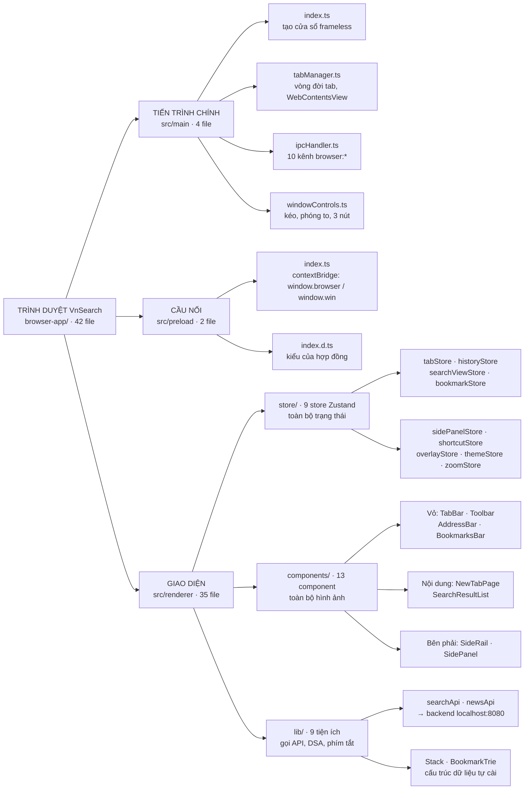
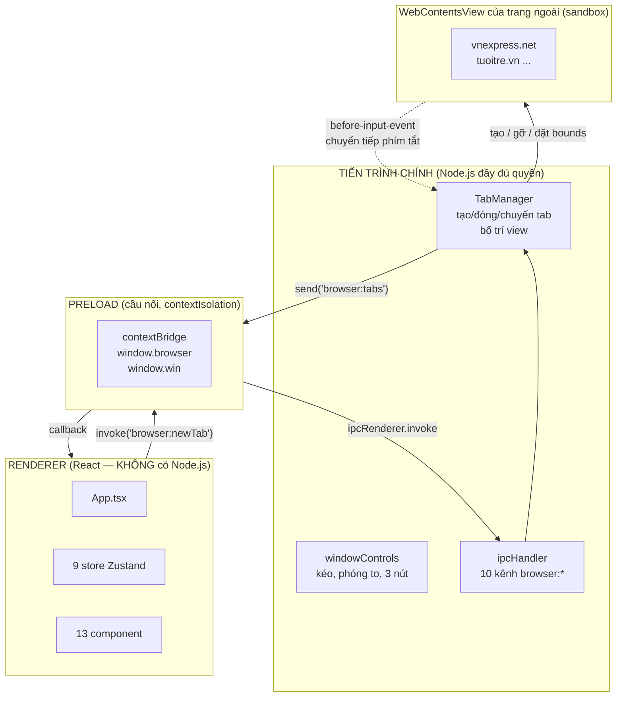
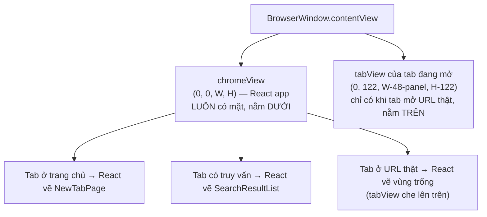
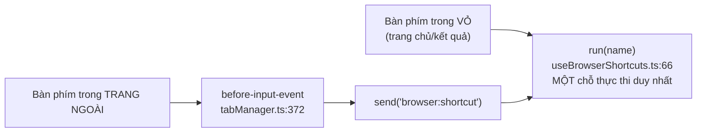
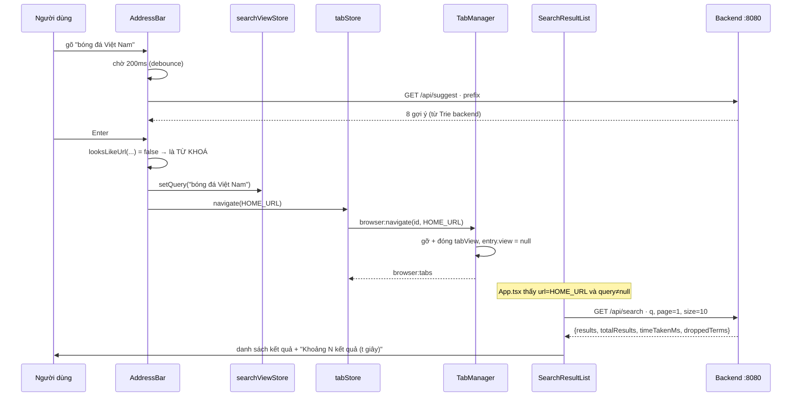
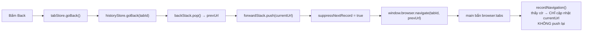
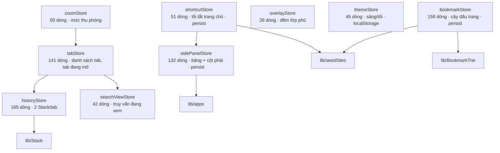

# Frontend — Trình duyệt VnSearch (Electron + React + TypeScript)

**Thư mục nguồn:** `browser-app/`
**Quy mô:** 42 file, 5.688 dòng TypeScript/TSX
**Việc nó làm:** Một trình duyệt desktop tối giản, lấy chính máy tìm kiếm VnSearch làm trang chủ.

> ### Cách đọc trang này
>
> - **Chỉ có 15 phút?** Đọc §1 (sơ đồ tư duy) → §2 (nhìn 60 giây) → §5 (ý tưởng trung tâm). Ba mục đó đủ để hiểu vì sao ứng dụng được xếp như vậy.
> - **Sắp sửa code?** Nhảy thẳng xuống **§13 — Hướng dẫn thực hành**: 12 công thức "muốn làm X thì sửa file nào", có mã mẫu dán được ngay.
> - **Chuẩn bị bảo vệ / review?** Đọc **§15 — Đánh giá kiến trúc theo chuẩn doanh nghiệp**. Mục đó nói thẳng chỗ nào đạt, chỗ nào chưa, và sửa thế nào.
> - Sơ đồ vẽ bằng **Mermaid**. Trình xem nào không hiện hình thì bấm khối *"Xem bản chữ (ASCII)"* ngay dưới mỗi sơ đồ.
>
> 📖 **Liên quan:** [Kiến trúc backend](ARCHITECTURE.md) · [Stack — hai ngăn xếp back/forward](Math/08-frontend/Stack.md) · [BookmarkTrie](Math/08-frontend/BookmarkTrie.md) · [Sơ đồ tư duy tầng frontend](Math/08-frontend/00-SO-DO-TU-DUY.md)

---

## Mục lục

| § | Nội dung |
|---|---|
| [1](#1-sơ-đồ-tư-duy--toàn-cảnh-frontend) | Sơ đồ tư duy — toàn cảnh frontend |
| [2](#2-nhìn-60-giây--cái-gì-chạy-ở-đâu) | Nhìn 60 giây — cái gì chạy ở đâu |
| [3](#3-ngăn-xếp-công-nghệ-và-lý-do-chọn) | Ngăn xếp công nghệ và lý do chọn |
| [4](#4-ba-tiến-trình-của-electron) | Ba tiến trình của Electron |
| [5](#5-ý-tưởng-trung-tâm--vỏ-nằm-dưới-trang-nằm-trên) | **Ý tưởng trung tâm** — vỏ nằm dưới, trang nằm trên |
| [6](#6-bản-đồ-thư-mục--42-file) | Bản đồ thư mục — 42 file |
| [7](#7-hợp-đồng-ipc--16-kênh) | Hợp đồng IPC — 16 kênh |
| [8](#8-năm-luồng-xử-lý-chính) | Năm luồng xử lý chính |
| [9](#9-tầng-store--9-store-zustand) | Tầng store — 9 store Zustand |
| [10](#10-tầng-component--13-component) | Tầng component — 13 component |
| [11](#11-tầng-lib--9-file-tiện-ích) | Tầng lib — 9 file tiện ích |
| [12](#12-hệ-thống-giao-diện) | Hệ thống giao diện |
| [13](#13-hướng-dẫn-thực-hành--12-công-thức) | **Hướng dẫn thực hành — 12 công thức** |
| [14](#14-chạy-gỡ-lỗi-đóng-gói) | Chạy, gỡ lỗi, đóng gói |
| [15](#15-đánh-giá-kiến-trúc-theo-chuẩn-doanh-nghiệp) | **Đánh giá kiến trúc theo chuẩn doanh nghiệp** |
| [16](#16-lộ-trình-nâng-cấp-theo-thứ-tự-ưu-tiên) | Lộ trình nâng cấp theo thứ tự ưu tiên |
| [17](#17-tra-cứu-nhanh) | Tra cứu nhanh |

---

## 1. Sơ đồ tư duy — toàn cảnh frontend



<details>
<summary><b>Xem bản chữ (ASCII)</b></summary>
```
TRÌNH DUYỆT VnSearch (browser-app/, 42 file)
│
├── src/main/ — TIẾN TRÌNH CHÍNH (Node.js, có toàn quyền hệ thống)
│     ├── index.ts ............. tạo BrowserWindow 1280x800, frameless
│     ├── tabManager.ts ........ TRÁI TIM: vòng đời tab, bố trí WebContentsView
│     ├── ipcHandler.ts ....... đăng ký 10 kênh browser:*
│     └── windowControls.ts .... kéo cửa sổ, phóng to thủ công, 3 nút
│
├── src/preload/ — CẦU NỐI (chạy trước renderer, bị cô lập ngữ cảnh)
│     ├── index.ts ............. contextBridge → window.browser, window.win
│     └── index.d.ts ........... kiểu TypeScript của hợp đồng
│
└── src/renderer/ — GIAO DIỆN (React, KHÔNG có quyền Node.js)
      ├── App.tsx ............... xếp 3 thanh trên + vùng nội dung + cột phải
      ├── store/ (9 file) ....... TOÀN BỘ trạng thái, Zustand
      ├── components/ (13 file) . TOÀN BỘ hình ảnh
      └── lib/ (9 file) ......... gọi API, Stack, BookmarkTrie, phím tắt
```

</details>

### Bảng tra nhanh — 42 file, dòng, việc

| Nhóm | Số file | Số dòng | Vai trò |
|---|---:|---:|---|
| `src/main/` | 4 | 641 | Cửa sổ, tab, IPC — chạy Node.js |
| `src/preload/` | 2 | 104 | Hợp đồng giữa hai thế giới |
| `src/renderer/store/` | 9 | 786 | Trạng thái |
| `src/renderer/components/` | 13 | 3.348 | Giao diện |
| `src/renderer/lib/` | 9 | 722 | Tiện ích + cấu trúc dữ liệu |
| Cấu hình | 5 | ~200 | Vite, Tailwind, 3 tsconfig |

---

## 2. Nhìn 60 giây — cái gì chạy ở đâu

Một trình duyệt có **hai loại nội dung hoàn toàn khác nhau** cùng hiện trên một cửa sổ:

1. **Vỏ trình duyệt** (chrome) — thanh tab, ô địa chỉ, thanh dấu trang, cột bên phải. Đây là *ứng dụng của mình*, do mình viết, mình tin tưởng.
2. **Trang web người dùng mở** — `vnexpress.net`, `tuoitre.vn`… Đây là *mã của người lạ*, không được tin.

Electron tách hai thứ đó thành **hai `WebContentsView` khác nhau**, chồng lên nhau trong một cửa sổ:
```
┌──────────────────────────────────────────────────────────┐
│  chromeView  (React app — vỏ trình duyệt, phủ KÍN cửa sổ) │
│  ┌────────────────────────────────────────────────────┐  │
│  │ TabBar         40px                                │  │
│  │ Toolbar        48px      ← luôn nhìn thấy          │  │
│  │ BookmarksBar   34px                                │  │
│  ├────────────────────────────────────────────────────┤  │
│  │ ╔══════════════════════════════════════╗ ░░ │      │  │
│  │ ║  tabView (WebContentsView của trang) ║ ░░ │      │  │
│  │ ║  CHỒNG LÊN TRÊN chromeView           ║ ░░ │ Side │  │
│  │ ║  vnexpress.net chạy ở đây            ║ ░░ │ Rail │  │
│  │ ╚══════════════════════════════════════╝ ░░ │ 48px │  │
│  │        SidePanel 340px (khi mở) ────────┘          │  │
│  └────────────────────────────────────────────────────┘  │
└──────────────────────────────────────────────────────────┘
```

Ba con số **122 / 48 / 340** là toàn bộ "vật lý" của ứng dụng này. Hiểu chúng là hiểu 80% mã trong `tabManager.ts`. Chi tiết ở **§5**.

---

## 3. Ngăn xếp công nghệ và lý do chọn

| Thư viện | Phiên bản | Vì sao chọn | Phương án đã cân nhắc |
|---|---|---|---|
| **Electron** | 31.3 | Cần một trình duyệt *thật*: phải nhúng được engine Chromium, phải có cửa sổ hệ điều hành. Web app không làm được. | Tauri (nhẹ hơn nhưng WebView hệ thống khác nhau giữa các máy → khó tái lập khi chấm bài) |
| **electron-vite** | 2.3 | Gói sẵn 3 cấu hình build (main/preload/renderer) + hot reload. Tự dựng bằng Vite thuần mất một buổi. | Electron Forge (nặng, nhiều quy ước thừa) |
| **React** | 18.3 | Giao diện có nhiều trạng thái đan xen (tab đang mở, bảng bên, popover…). Mô hình khai báo hợp hơn thao tác DOM tay. | Vanilla TS (rẻ hơn nhưng 3.300 dòng giao diện sẽ thành mớ `querySelector`) |
| **Zustand** | 4.5 | Nhu cầu thật: chia sẻ trạng thái giữa các nhánh cây component xa nhau, **không** cần Redux DevTools/time-travel. Một store = một file 30–160 dòng, không boilerplate. | Redux Toolkit (thừa cho quy mô này), Context API (mỗi lần đổi giá trị vẽ lại cả cây) |
| **Tailwind CSS** | 3.4 | Giao diện dày đặc trạng thái (`hover`, `disabled`, `group-hover`, `dark`). Viết CSS thường sẽ đẻ ra hàng trăm class tên khó đặt. | CSS Modules, styled-components |
| **TypeScript** | 5.5 | Ranh giới IPC là chỗ dễ sai nhất; kiểu tĩnh bắt lỗi ngay lúc viết. | — |

**Không dùng:** React Router (ứng dụng không có URL riêng), thư viện UI dựng sẵn (MUI/shadcn — vỏ trình duyệt cần hình dạng rất riêng, dùng thư viện còn tốn công gỡ hơn), Axios (`fetch` có sẵn là đủ).

---

## 4. Ba tiến trình của Electron



<details>
<summary><b>Xem bản chữ (ASCII)</b></summary>
```
RENDERER (React)                PRELOAD              MAIN (Node.js)
─────────────────               ────────             ──────────────
useTabStore.newTab()
   └─► window.browser.newTab(url)
              └─► ipcRenderer.invoke('browser:newTab')
                            └─► ipcMain.handle ──► TabManager.createTab()
                                                        │
                                                        ├─► tạo WebContentsView
                                                        └─► send('browser:tabs')
                                          ◄─────────────┘
              ◄─── callback ───┘
   ◄─── applyTabUpdate() cập nhật store ───┘
```

</details>

### Ranh giới bảo mật

| Thiết lập | Giá trị | Ở đâu | Ý nghĩa |
|---|---|---|---|
| `contextIsolation` | `true` | `tabManager.ts:97`, `:326` | Renderer và preload chạy ở hai ngữ cảnh JS tách biệt. Trang không thể vá đè hàm của preload. |
| `nodeIntegration` | `false` | `tabManager.ts:98`, `:327` | Renderer **không** có `require`, `fs`, `process`. Kể cả bị XSS cũng không đọc được ổ đĩa. |
| `sandbox` (trang ngoài) | `true` | `tabManager.ts:328` | Trang của người lạ chạy trong sandbox của Chromium. |
| `sandbox` (vỏ) | `false` | `tabManager.ts:98` | ⚠️ Xem §15.1 — chỗ này **nên** bật lên `true`. |
| CSP | `default-src 'self'` | `renderer/index.html:5-8` | Renderer chỉ được tải tài nguyên của chính nó và gọi `http://localhost:8080`. Không tải được ảnh/script từ bên ngoài. |

> **Hệ quả dây chuyền của CSP** — vì không tải được ảnh từ máy chủ ngoài, **mọi thứ trông như ảnh trong ứng dụng đều được vẽ tại chỗ**: favicon là ô màu sinh từ hàm băm tên miền (`lib/site.ts`), ảnh nền trang chủ là SVG hoàng hôn vẽ tay (`NewTabPage.tsx:67`), logo ứng dụng ở cột bên là SVG nội tuyến (`lib/apps.tsx`). Đây không phải sự lười — đây là hệ quả trực tiếp của một quyết định bảo mật.

---

## 5. Ý tưởng trung tâm — vỏ nằm dưới, trang nằm trên

**Đây là mục quan trọng nhất tài liệu.** Nếu chỉ đọc một mục, đọc mục này.

### 5.1. Vấn đề

Một trình duyệt phải hiện *đồng thời*: vỏ (thanh tab, ô địa chỉ) và trang web. Electron cho ba cách:

| Cách | Vấn đề |
|---|---|
| Thẻ `<webview>` | Đã **deprecated**, Electron khuyến cáo không dùng |
| `BrowserView` | Đang bị **loại bỏ dần**, thay bằng `WebContentsView` |
| **`WebContentsView`** ✅ | Cách hiện đại (Electron 30+). Được chọn. |

### 5.2. Cách xếp

`TabManager` (`main/tabManager.ts`) giữ:

- **Một** `chromeView` — chính là React app, phủ **kín** cửa sổ, **luôn** hiển thị.
- **Nhiều** `tabView` — mỗi tab đang mở một URL thật có một cái, **chồng lên trên** `chromeView`, chỉ phủ vùng nội dung.



<details>
<summary><b>Xem bản chữ (ASCII)</b></summary>
```
                Trục Z (cái nào che cái nào)
   TRÊN  ┌─────────────────────────────────┐
         │  tabView — trang ngoài          │  chỉ tồn tại khi url ≠ HOME_URL
         │  y=122, cao H-122, rộng W-48-panel │
         └─────────────────────────────────┘
   DƯỚI  ┌─────────────────────────────────┐
         │  chromeView — React app         │  LUÔN tồn tại, phủ kín
         │  (0, 0, W, H)                   │
         └─────────────────────────────────┘
```

</details>

### 5.3. Bốn hệ quả — và bốn cơ chế sinh ra từ chúng

Cách xếp này rất gọn, nhưng đẻ ra bốn vấn đề. Mỗi vấn đề tương ứng một đoạn mã trong repo. **Hiểu bốn cặp này là hiểu toàn bộ `tabManager.ts`.**

#### Hệ quả 1 — vỏ phải chừa chỗ, chính xác đến từng pixel

`tabView` đặt tại `y = CHROME_HEIGHT`. Nếu React vẽ ba thanh cao tổng cộng khác 122px, sẽ có khe hở hoặc trang che mất thanh dấu trang.

$$\text{CHROME\_HEIGHT} = \underbrace{40}_{\text{TabBar}} + \underbrace{48}_{\text{Toolbar}} + \underbrace{34}_{\text{BookmarksBar}} = 122$$

| Hằng số | Bên main | Bên renderer | Ràng buộc |
|---|---|---|---|
| `CHROME_HEIGHT` | `tabManager.ts:11` = 122 | `App.tsx` — `h-10` + `h-12` + `h-[34px]` | Phải bằng nhau |
| `SIDE_RAIL_WIDTH` | `tabManager.ts:19` = 48 | `sidePanelStore.ts:19` = 48, `SideRail.tsx` `w-12` | Phải bằng nhau |
| `PANEL_WIDTH` | truyền động qua IPC | `sidePanelStore.ts:16` = 340 | main nhận qua `setPanelWidth` |

> ⚠️ **Đây là ràng buộc thủ công, không có gì kiểm tra hộ.** Sửa chiều cao một thanh mà quên sửa `CHROME_HEIGHT` là bug kinh điển của dự án này. Cách sửa triệt để ở §15.3.

#### Hệ quả 2 — bảng bên phải **neo**, không được **phủ**

`tabView` nằm **trên** `chromeView`. Nên nếu `SidePanel` chỉ dùng CSS `position: absolute` phủ lên, nó sẽ bị trang ngoài che **hoàn toàn**.

Giải pháp: bảng **đẩy trang co lại**.
```
App.tsx:46  useEffect → window.browser.setPanelWidth(open ? 340 : 0)
                            │
tabManager.ts:144           ▼  setPanelWidth(px)
                        rightInset = 48 + 340 = 388
                        tabView.setBounds({ width: W - 388, ... })
```

Đây cũng chính là cách thanh bên của Edge và Cốc Cốc hoạt động.

#### Hệ quả 3 — menu đổ dài phải **tạm gỡ trang xuống**

Menu trình duyệt đổ dài xuống quá 122px. Phần vượt ra sẽ bị `tabView` che.

Giải pháp: trong lúc còn lớp phủ nào mở, **gỡ tạm** `tabView` khỏi cây view (`removeChildView`) — `webContents` vẫn sống, trang **không tải lại**, chỉ tạm ẩn — rồi gắn lại khi đóng.

Vì có thể mở **chồng nhiều lớp phủ**, `overlayStore` dùng **số đếm** chứ không phải cờ đúng/sai:
```
Popover mount   → acquire()  count 0→1 → setOverlay(true)  → gỡ tabView
Popover con     → acquire()  count 1→2 → (không đổi)
đóng con        → release()  count 2→1 → (không đổi)  ← nếu dùng cờ, trang lộ ra ở đây!
đóng ngoài      → release()  count 1→0 → setOverlay(false) → gắn lại
```

#### Hệ quả 4 — phím tắt phải được **chuyển tiếp** ngược về vỏ

Khi con trỏ ở trong trang ngoài, phím bấm đi thẳng vào `tabView`. Vỏ không hề hay biết → `Ctrl+T` chết.

Giải pháp: `tabManager.forwardShortcuts()` bắt `before-input-event` trên mỗi `tabView`, nhận ra tổ hợp trình duyệt, `preventDefault()`, rồi `send('browser:shortcut', name)` về vỏ. Vỏ là **nơi duy nhất** thực thi lệnh.



> ⚠️ Bảng phím tắt bị **chép hai lần**: `shortcutName()` ở `tabManager.ts:30` và `shortcutFromEvent()` ở `useBrowserShortcuts.ts:18`. Hai tiến trình không dùng chung mã được (theo cách tổ chức hiện tại). Sửa chỗ nào phải sửa cả hai. Xem §15.3.

---

## 6. Bản đồ thư mục — 42 file
```
browser-app/
├── electron.vite.config.ts     3 cấu hình build: main / preload / renderer
│                               (preload đặt externalizeDeps:false — xem §6.1)
├── tsconfig.json               gốc, chỉ tham chiếu 2 file dưới
├── tsconfig.node.json          cho main + preload (môi trường Node)
├── tsconfig.web.json           cho renderer (môi trường trình duyệt)
└── src/
    ├── main/
    │   ├── index.ts            46  tạo cửa sổ 1280x800 frameless
    │   ├── tabManager.ts      333  ★ trái tim: tab, view, bố cục, phím tắt
    │   ├── ipcHandler.ts       38  đăng ký 10 kênh browser:*
    │   ├── urlPolicy.ts       130  danh sách CHO PHÉP scheme, chặn file://
    │   └── windowControls.ts   81  kéo cửa sổ, phóng to thủ công
    ├── preload/
    │   ├── index.ts            63  contextBridge → window.browser, window.win
    │   └── index.d.ts          12  kiểu của hợp đồng
    └── renderer/
        ├── index.html          41  CSP nằm ở đây
        └── src/
            ├── main.tsx        15  ReactDOM.createRoot
            ├── App.tsx         57  ★ bố cục tổng + 2 useEffect đồng bộ xuống main
            ├── index.css      170  biến màu, .icon-btn, .menu-row, .skeleton
            ├── store/          669  ── 9 store, xem §9
            ├── components/   4.340  ── 15 component, xem §10
            └── lib/            749  ── 9 tiện ích, xem §11
```

> **Không có `tailwind.config.js` và `postcss.config.js`.** Dự án dùng
> **Tailwind v4**, cấu hình bằng plugin `@tailwindcss/vite` khai trong
> `electron.vite.config.ts` cộng với directive `@theme` ngay trong
> `index.css` — hai tệp cấu hình đời v3 không còn tồn tại. Đi tìm chúng để
> sửa màu là đi nhầm chỗ; màu nằm ở `index.css`.

---

## 7. Hợp đồng IPC — 20 kênh

Toàn bộ giao tiếp giữa hai thế giới đi qua đúng **20 kênh**, khai báo ở ba nơi phải khớp nhau:
```
preload/index.ts (gọi)  ←→  preload/index.d.ts (kiểu)  ←→  main/*.ts (xử lý)
```

**Hai tiền tố, hai tệp đăng ký, đừng nhầm:**
```
browser:*   →  đăng ký ở  main/ipcHandler.ts       (10 kênh)  việc của TAB
win:*       →  đăng ký ở  main/windowControls.ts   ( 7 kênh)  việc của CỬA SỔ
                          + 3 kênh main → renderer            = 20
```

Tiền tố là `win:`, **không phải** `window:` — gõ `window:minimize` thì không ai
`handle`, và lời gọi treo im lặng chứ không báo lỗi.

### 7.1. Renderer → Main · `invoke` (có giá trị trả về)

| Kênh | Tham số | Trả về | Xử lý ở | Việc |
|---|---|---|---|---|
| `browser:listTabs` | — | `TabsSnapshot` | `tabManager.snapshot()` | Kéo danh sách tab hiện tại |
| `browser:newTab` | `url?` | `string` (id) | `createTab` | Mở tab mới |
| `browser:closeTab` | `id` | — | `closeTab` | Đóng tab |
| `browser:switchTab` | `id` | — | `switchTab` | Chuyển tab |
| `browser:navigate` | `id, url` | — | `navigate` | Đi tới URL (hoặc về `HOME_URL`) |
| `browser:reload` | `id` | — | `reload` | Tải lại |
| `browser:print` | `id` | — | `print` | Mở hộp thoại in |
| `browser:setZoom` | `id, factor` | — | `setZoom` | Thu phóng trang ngoài |
| `win:isMaximized` | — | `boolean` | `windowControls` | Trạng thái ban đầu của nút |
| `win:toggleMaximize` | — | `boolean` | `windowControls` | Phóng to/khôi phục |

### 7.2. Renderer → Main · `send` (một chiều, không chờ)

| Kênh | Tham số | Việc |
|---|---|---|
| `browser:setPanelWidth` | `px` | Bảng bên mở/đóng → trang co lại |
| `browser:setOverlay` | `active` | Lớp phủ mở → tạm gỡ trang xuống |
| `win:minimize` | — | Thu nhỏ |
| `win:close` | — | Đóng cửa sổ |
| `win:toggleFullScreen` | — | F11 |
| `win:dragStart` / `win:dragEnd` | — | Kéo cửa sổ bằng tay, nhịp 16 ms (`DRAG_TICK_MS`) |

### 7.3. Main → Renderer (thông báo)

| Kênh | Payload | Bắn khi | Nghe ở |
|---|---|---|---|
| `browser:tabs` | `TabsSnapshot` (**cả danh sách**, không phải một tab) | Tab tạo/đóng/chuyển/điều hướng/đổi tiêu đề/bắt đầu-kết thúc tải | `tabStore.init` qua `onTabsChanged` |
| `browser:shortcut` | `string` (tên lệnh) | Phím tắt bấm **trong trang ngoài** | `useBrowserShortcuts` |
| `win:maximizeChanged` | `boolean` | Cửa sổ phóng to/khôi phục (kể cả bằng Win+↑) | `TabBar.WindowControls` |

> **Vì sao `browser:tabs` gửi cả danh sách chứ không gửi một tab.** Gửi từng
> `TabState` lẻ buộc renderer phải tự gộp vào mảng đang có — và ngay lập tức
> sinh câu hỏi "tab bị xoá thì báo bằng gì". `TabManager.emit()` chọn cách
> đơn giản hơn: mỗi lần có bất kỳ thay đổi nào, gửi **ảnh chụp toàn bộ**
> (`tabManager.ts:327`). Renderer chỉ việc thay thế trạng thái, không có phép
> gộp nào để làm sai.

### 7.4. Một chi tiết tinh tế: vì sao cần cả `listTabs` (kéo) lẫn `browser:tabs` (đẩy)

Tab đầu tiên được `TabManager` tạo **trong constructor** — tức là **trước khi** React kịp mount và đăng ký `onTabsChanged`. Mà `webContents.send()` là *gửi-và-quên*, không có hàng đợi.

→ Sự kiện đẩy đầu tiên **bị mất**. Nếu chỉ dựa vào đẩy, ứng dụng khởi động với thanh tab trống trơn.

Vì vậy `tabStore.init()` làm **cả hai**: đăng ký nghe đẩy, rồi **chủ động kéo** `listTabs()` một lần.

### 7.5. Không có `browser:goBack` / `browser:goForward`

Lịch sử **không** đi qua IPC, và đó là lựa chọn có chủ ý. Lịch sử do renderer
tự giữ bằng **hai ngăn xếp** trong `historyStore.ts` thay vì gọi
`webContents.goBack()` của Electron — hai lý do, ghi ở §9.2: để trạng thái hai
bên không lệch nhau, và để phần cấu trúc dữ liệu tự cài được thể hiện. Xem
[`Math/08-frontend/Stack.md`](Math/08-frontend/Stack.md).

Hệ quả thực tế: lùi/tiến chỉ là một lời gọi `browser:navigate` bình thường,
nên nếu bạn đi tìm kênh `goBack` để sửa nút Lùi thì không có kênh nào cả.

---

## 8. Năm luồng xử lý chính

### 8.1. Gõ từ khoá → thấy kết quả



**Điểm quyết định** nằm ở `AddressBar.looksLikeUrl()` (`AddressBar.tsx:10`):

| Chuỗi gõ vào | `looksLikeUrl` | Hành động |
|---|---|---|
| `https://vnexpress.net` | ✅ có `https://` | Điều hướng thật |
| `vnexpress.net` | ✅ không khoảng trắng + có TLD | Thêm `https://` rồi điều hướng |
| `bóng đá Việt Nam` | ❌ có khoảng trắng | `setQuery` → trang kết quả |
| `site:vnexpress.net kinh tế` | ❌ có khoảng trắng | `setQuery` → backend hiểu cú pháp `site:` |

### 8.2. Mở một URL thật
```
navigate(id, "https://vnexpress.net")
  │
  ├── entry.view == null?  → createExternalView(id)
  │      ├── new WebContentsView({ sandbox: true })
  │      ├── gắn 5 listener: did-start-loading, did-stop-loading,
  │      │                   page-title-updated, did-navigate, did-navigate-in-page
  │      │      → mỗi cái gọi pushUpdate() → emit('browser:tabs')
  │      ├── forwardShortcuts(wc)
  │      └── setWindowOpenHandler → target=_blank thành TAB MỚI, không phải cửa sổ mới
  │
  ├── addChildView(view)  (nếu là tab đang mở và không có lớp phủ)
  ├── layoutTabView(view) (0, 122, W-48-panel, H-122)
  └── wc.loadURL(url)
```

Ngược lại, `navigate(id, HOME_URL)` **huỷ hẳn** `tabView` (`removeChildView` + `webContents.close()`, đặt `entry.view = null`) để `chromeView` lộ ra.

### 8.3. Bấm Back — dùng Stack tự cài, **không** dùng lịch sử của Electron

Đây là quyết định thiết kế có chủ đích, phục vụ mục tiêu học thuật của đồ án.



Cờ `suppressNextRecord` là chỗ tinh tế nhất: nếu không có nó, chính lượt điều hướng do `goBack` gây ra sẽ quay lại push vào `backStack` → nút Back thành vòng lặp vô tận giữa hai trang. Phân tích đầy đủ ở [Math/08-frontend/Stack.md](Math/08-frontend/Stack.md).

### 8.4. Mở bảng bên phải
```
SideRail bấm ô  →  sidePanelStore.openApp(id)  →  open ≠ null
                                                      │
      App.tsx:46 useEffect ◄──────────────────────────┘
          window.browser.setPanelWidth(340)
                    │
      tabManager.setPanelWidth(340) → layoutAll() → trang ngoài co còn W-388
                    │
      SidePanel render (width: 340) trong chromeView, hiện ra ở khoảng vừa chừa
```

### 8.5. Kéo cửa sổ frameless

Cửa sổ chạy `frame: false` để thanh tab ngang hàng với ba nút — đúng cách Chrome/Edge/Cốc Cốc bố trí. Đổi lại phải tự làm phần việc của khung hệ điều hành.

**Vì sao không dùng `-webkit-app-region: drag`?** Vùng kéo bằng CSS chỉ được hệ thống hiểu ở `webContents` **gốc** của `BrowserWindow`. Mà vỏ ở đây nằm trong một `WebContentsView` **con**. Nên phần kéo làm thủ công:
```
mousedown  →  chờ con trỏ đi quá 4px  →  win.dragStart()
                     │                          │
       (ngưỡng 4px để cú nhấn đầu     main: setInterval 8ms
        của nháy đúp không bị tính     lấy vị trí con trỏ, dời cửa sổ
        là kéo)                        theo offset đã ghi
mouseup / blur  →  win.dragEnd()  →  clearInterval
```

Dùng `setInterval` bám con trỏ chứ không nghe `mousemove` ở renderer, vì khi kéo nhanh con trỏ vượt ra ngoài cửa sổ và chuỗi `mousemove` sẽ đứt.

Tương tự, lớp `Maximizer` **tự đặt bounds** bằng `screen.getDisplayMatching(bounds).workArea` thay vì gọi `window.maximize()`: trên Windows, cửa sổ frameless khi phóng to bị hệ điều hành cho tràn ra ngoài mép màn hình đúng bằng bề dày viền kéo giãn vô hình (~7px mỗi bên), xén mất phần trên của thanh tab.

---

## 9. Tầng store — 9 store Zustand

### 9.1. Bản đồ phụ thuộc



<details>
<summary><b>Xem bản chữ (ASCII)</b></summary>
```
tabStore ──► historyStore ──► lib/Stack (DSA tự cài)
    │              
    └──► searchViewStore

zoomStore ──► tabStore (để biết tab nào đang mở)

bookmarkStore ──► lib/BookmarkTrie (DSA tự cài)
              └─► lib/seedSites
shortcutStore ──► lib/seedSites + normalizeUrl (mượn của sidePanelStore)
sidePanelStore ─► lib/apps

overlayStore, themeStore: độc lập, không phụ thuộc store nào
```

</details>

### 9.2. Bảng chi tiết

| Store | Lưu gì | Bền vững | Ghi chú quan trọng |
|---|---|---|---|
| **tabStore** | `tabs[]`, `activeTabId` | ❌ | Cổng duy nhất ra `window.browser.*`. Component **không bao giờ** gọi IPC trực tiếp (trừ 3 ngoại lệ ở §15.6) |
| **historyStore** | `{backStack, forwardStack, currentUrl, suppressNextRecord}` **cho mỗi tab** | ❌ | Dùng `Stack` tự cài. **Cố ý không dùng** `wc.goBack()` của Electron — để hai bên không lệch nhau, và để thể hiện DSA |
| **searchViewStore** | `query: string \| null` | ❌ | 42 dòng. Cầu nối giữa `AddressBar` và `SearchResultList` |
| **bookmarkStore** | cây `BookmarkNode` (thư mục lồng nhau) | ✅ `vnsearch-bookmarks` | Trie **dựng lại mỗi lần tìm** — không serialize được JSON để persist. Chấp nhận vì số bookmark rất nhỏ |
| **sidePanelStore** | `open`, `activeItemId`, `pinned`, `items[]` | ✅ `vnsearch-side-panel` (chỉ `items` + `pinned`, nhờ `partialize`) | Bảng đang mở là chuyện của phiên, không nên nhớ qua lần sau |
| **shortcutStore** | `shortcuts[]` trang chủ | ✅ `vnsearch-shortcuts` | Khởi tạo bằng 6 trang seed của crawler |
| **overlayStore** | `count: number` | ❌ | **Số đếm** chứ không phải cờ — xem §5.3 hệ quả 3 |
| **themeStore** | `theme: 'light' \| 'dark'` | ✅ `vnsearch.theme` (localStorage thô) | Mặc định **tối**, cố ý không theo cài đặt hệ điều hành |
| **zoomStore** | `factor` | ❌ | 15 nấc lấy đúng bộ của Chrome. Chỉ tác dụng với trang ngoài |

### 9.3. Quy ước dùng store

```ts
// ✅ Trong component: chọn từng mảnh nhỏ nhất cần dùng
const tabs = useTabStore((s) => s.tabs)
const newTab = useTabStore((s) => s.newTab)

// ❌ Lấy cả store — mọi thay đổi bất kỳ đều vẽ lại component
const store = useTabStore()

// ✅ Ngoài component (trong hàm thường, callback): dùng getState()
const tabStore = useTabStore.getState()
tabStore.newTab()
```

---

## 10. Tầng component — 13 component

### 10.1. Cây
```
App.tsx
├── TabBar                    40px — tab + 3 nút cửa sổ + vùng kéo
│   ├── Tab (×n)                    favicon giả, mờ dần, nút đóng, chuột giữa
│   └── WindowControls              46×40 theo chuẩn Windows 11
├── Toolbar                   48px
│   ├── NavigationButtons           back/forward/reload/home
│   ├── AddressBar                  omnibox: URL hay từ khoá?
│   │   └── AutocompleteDropdown    gợi ý từ /api/suggest
│   ├── Popover ×3                  tiện ích, chia đôi màn hình, tài khoản
│   └── BrowserMenu                 menu chính
│       ├── ZoomRow
│       └── HistoryItem             panel con mở bên TRÁI
├── BookmarksBar              34px — đo bề ngang thật để biết cắt ở đâu
│   ├── BookmarkChip (×n)
│   └── Popover                     phần tràn ">>"
├── <main>                    linh hoạt
│   ├── SearchResultList            khi có query
│   └── NewTabPage                  khi không
│       ├── HeroBackdrop            SVG hoàng hôn
│       ├── WeatherOverlay
│       ├── ShortcutRow → AddShortcutDialog
│       ├── HeroSearchBox → AutocompleteDropdown
│       └── HotNews
├── SidePanel                 340px khi mở
│   └── AddSiteBody / AppBody / BookmarksBody / DownloadsBody / AskAiBody
└── SideRail                  48px — luôn hiện
```

### 10.2. Bảng chi tiết

**15 component, 4.340 dòng.** Sắp theo kích thước để thấy ngay trọng tâm nằm ở đâu:

| Component | Dòng | Điểm đáng chú ý về kỹ thuật |
|---|---:|---|
| `ImageResultGrid` | **959** | ★ **Component lớn nhất ứng dụng.** Bố cục hàng-cân-tỉ-lệ tự cài thay cho `columns-4` của CSS (multi-column rót đầy cột 1 rồi mới sang cột 2 → **thứ tự đọc sai**). Cuộn vô hạn bằng `IntersectionObserver` trên một ô canh vô hình, **không** nghe sự kiện `scroll`. `onError` hạ ô ảnh xuống khi máy chủ gốc trả 403 chống hotlink |
| `NewTabPage` | 674 | Toàn bộ "ảnh" là SVG/gradient vẽ tại chỗ (hệ quả CSP) |
| `icons.tsx` | 473 | 48 icon SVG nội tuyến, `currentColor` |
| `SearchResultList` | 374 | Skeleton, phân trang kiểu Google, **chế độ debug hiện điểm BM25/PageRank** — rất hữu ích khi demo |
| `BrowserMenu` | 334 | Mục chưa làm được để **tắt kèm chú thích** thay vì bấm vào không có gì xảy ra |
| `SidePanel` | 321 | 5 thân nội dung; `BookmarksBody` lọc bằng **BookmarkTrie** chứ không `Array.filter` |
| `BookmarksBar` | 245 | **Hàng bản sao vô hình để đo**: đo trên bản sao chứ không đo hàng đang hiện, vì cắt bớt mục sẽ làm phép đo lần sau sai và hai bên giằng nhau vô tận |
| `TabBar` | 235 | `useWindowDrag` với ngưỡng 4px; nút đóng chỉ hiện khi hover; **mờ dần** thay cho `…` |
| `AddressBar` | 202 | `looksLikeUrl`, debounce 200ms, điều hướng dropdown bằng mũi tên, ★ đổi màu tức thì |
| `Toolbar` | 156 | Chỉ xếp chỗ; mỗi popover là một `useState` cục bộ |
| `SideRail` | 150 | Ô lạ trong `localStorage` (danh mục đã đổi) bị bỏ qua thay vì làm vỡ giao diện |
| `Popover` | 68 | `acquire`/`release` overlay; lớp trong suốt bắt cú bấm ra ngoài; Escape đóng |
| `AutocompleteDropdown` | 65 | **`onMouseDown` chứ không `onClick`** — để chạy *trước* `blur` của input; phần gõ rồi để nhạt, phần gợi ý thêm in đậm |
| `NavigationButtons` | 58 | Nút Lùi/Tiến. Trạng thái mờ lấy từ `canGoBack()`/`canGoForward()` của `tabStore` — **không** hỏi Electron, vì lịch sử do renderer tự giữ (§7.5) |
| `AppTile` | 26 | Ô logo trong lưới ứng dụng; nhận `size` để dùng lại ở cả trang chủ lẫn bảng bên |

*(`App.tsx` 57 dòng nằm ở §6 chứ không phải bảng này — nó là bố cục gốc, không phải component lá.)*

### 10.3. Ba mẹo giao diện đáng học trong repo

**1. Đo bằng bản sao vô hình** (`BookmarksBar.tsx:36-72`) — bài toán "hiển thị được bao nhiêu mục thì hiển thị":

```tsx
// Hàng NHÌN THẤY chỉ vẽ những mục lọt vào
{visible.map((node) => <BookmarkChip key={node.id} node={node} />)}

// Hàng ĐO nằm ngoài luồng bố cục (absolute + opacity-0), giữ ĐỦ mọi mục
<div ref={measureRef} className="pointer-events-none absolute left-0 top-0 flex opacity-0">
  {nodes.map((node) => <BookmarkChip key={node.id} node={node} measuring />)}
</div>
```

Nếu đo trực tiếp hàng đang hiện: cắt bớt → hàng ngắn lại → phép đo sau nói "vừa rồi" → thêm vào → lại tràn → **vòng lặp vô tận**.

**2. Đóng trễ 180ms cho menu con** (`BrowserMenu.tsx:282`) — giữa hàng menu và panel con có một khoảng hở vài pixel; không có độ trễ thì panel chớp tắt mỗi lần đưa chuột sang.

**3. `onMouseDown` cho mục chọn trong dropdown** (`AutocompleteDropdown.tsx:50`) — `onClick` bắn *sau* `blur`, mà `blur` đã xoá dropdown, nên cú bấm rơi vào hư không.

---

## 11. Tầng lib — 9 file tiện ích

| File | Dòng | Việc |
|---|---:|---|
| `searchApi.ts` | 175 | Cổng ra backend. **4 export**: `getJson<T>()` (bọc `fetch`, có `AbortSignal.timeout`), `search()`, `searchImages()`, `suggest()`. Kèm 4 DTO: `SearchResultDto`, `SearchResponseDto`, `ImageResultDto`, `ImageResponseDto` — khớp `SearchResponse.java` và `ImageSearchController` |
| `apps.tsx` | 245 | 10 ứng dụng cột bên phải, logo SVG nội tuyến (phỏng theo, không phải logo chính thức) |
| `newsApi.ts` | 90 | Khu "Tin nóng". Gọi **`/api/feed`** — một vòng mạng mỗi lô, chỉ lấy bài có ảnh, phân trang được. Truyền `seed` để lô sau nối đúng vào lô trước |
| `useBrowserShortcuts.ts` | 96 | Hook gộp hai nguồn sự kiện phím thành **một** chỗ thực thi |
| **`BookmarkTrie.ts`** | 55 | **DSA tự cài** — cây tiền tố tìm dấu trang. Bản TypeScript song song với `Trie.java`. Xem [BookmarkTrie.md](Math/08-frontend/BookmarkTrie.md) |
| `site.ts` | 38 | `hostOf`, `prettyUrl`, và **favicon giả**: băm FNV-1a 32 bit tên miền → hue → gradient ổn định |
| **`Stack.ts`** | 31 | **DSA tự cài** — LIFO cho back/forward. Xem [Stack.md](Math/08-frontend/Stack.md) |
| `seedSites.ts` | 13 | 6 báo seed của crawler. **Một nguồn cho ba chỗ dùng**: dấu trang, lối tắt, thanh dấu trang |
| `account.ts` | 6 | Tài khoản tượng trưng — tách một chỗ để avatar và menu không hiện hai tên khác nhau |

> **`newsApi.ts` từng không gọi `/api/feed`.** Bản đầu chạy 6 truy vấn
> `/api/search` theo chuyên mục rồi xen kẽ kết quả, vì backend chưa có endpoint
> bảng tin. Cách đó tốn 6 vòng mạng, không đảm bảo bài nào có ảnh, và không
> phân trang được. `FeedController` ra đời để giải cả ba — nếu bạn đọc mã và
> thấy `Promise.allSettled` thì đó là dấu vết đã bị gỡ, không còn nữa.

### Vì sao "favicon giả" mà vẫn nhận ra được nguồn tin

```ts
function hash32(text: string): number {      // FNV-1a 32 bit
  let h = 0x811c9dc5
  for (let i = 0; i < text.length; i++) {
    h ^= text.charCodeAt(i)
    h = Math.imul(h, 0x01000193)
  }
  return h >>> 0
}
const hue = hash32(hostOf(url)) % 360        // cùng host → cùng màu, LUÔN LUÔN
```

Hàm băm **tất định** → `vnexpress.net` luôn ra đúng một màu, ở thanh tab, ở thẻ tin, ở thanh dấu trang, ở kết quả tìm kiếm. Mắt học được "màu này là báo này" sau vài phút dùng.

---

## 12. Hệ thống giao diện

### 12.1. Ba lớp màu
```
index.css (:root và .dark)          tailwind.config.js              component
─────────────────────────           ──────────────────              ─────────
--c-surface: 255 255 255       →    surface: rgb(var(--c-surface)   →   bg-surface
--c-surface: 27 30 36 (.dark)                / <alpha-value>)           bg-surface/85
```

**Lợi ích:** đổi chế độ tối = gắn **một** class `dark` lên `<html>`. Không phải rải `dark:` khắp mọi component. Không phải sửa 13 file khi đổi bảng màu.

| Biến | Vai trò | Sáng | Tối |
|---|---|---|---|
| `--c-chrome` | Nền thanh tab (chìm nhất) | `223 227 235` | `17 19 24` |
| `--c-surface` | Nền nội dung, tab đang mở | `255 255 255` | `27 30 36` |
| `--c-raised` | Nền nổi nhẹ: nút hover | `241 243 248` | `39 43 51` |
| `--c-omni` | Nền ô địa chỉ (tách riêng — phải chìm hơn thanh công cụ) | `241 243 248` | `42 42 42` |
| `--c-bookmarks` | Nền thanh dấu trang | `232 236 243` | `20 22 27` |
| `--c-brand` | Màu nhấn | `79 70 229` | `129 140 248` |

### 12.2. Bốn class dùng chung (`@layer components`)

| Class | Dùng ở | Thay cho |
|---|---|---|
| `.icon-btn` | 20+ nút tròn trên thanh công cụ | 8 utility class lặp lại |
| `.menu-row` | Mọi hàng trong menu/popover | icon trái · nhãn · phím tắt phải |
| `.menu-sep` | Chia nhóm trong menu | `h-px bg-line` |
| `.rail-btn` | Nút trên cột dọc | |
| `.skeleton` | Ô xám chạy sóng khi chờ dữ liệu | shimmer bằng `::after` |

### 12.3. Chi tiết dễ bỏ sót

```css
body { user-select: none; }              /* vỏ trình duyệt: không cho bôi đen lung tung */
input, textarea, .selectable {
  user-select: text;                     /* nhưng nội dung đọc được thì vẫn chọn bình thường */
}
```

Class `.selectable` được gắn đúng ba chỗ: truy vấn ở đầu trang kết quả, đoạn trích của mỗi kết quả, và các ô nhập.

---

## 13. Hướng dẫn thực hành — 12 công thức

### 13.1. Thêm một hành động mới xuống main process

Bốn file, đúng thứ tự này:

```ts
// ── 1. main/tabManager.ts — viết logic
findInPage(id: string, text: string): void {
  this.tabs.get(id)?.view?.webContents.findInPage(text)
}

// ── 2. main/ipcHandler.ts — mở kênh
ipcMain.handle('browser:findInPage', (_e, id: string, text: string) =>
  tabManager.findInPage(id, text)
)

// ── 3. preload/index.ts — phơi ra cho renderer
findInPage: (id: string, text: string): Promise<void> =>
  ipcRenderer.invoke('browser:findInPage', id, text),

// ── 4. preload/index.d.ts — khai kiểu (nếu thiếu, renderer sẽ không biên dịch)
findInPage: (id: string, text: string) => Promise<void>
```

> **Bẫy thường gặp:** tên kênh ở bước 2 và bước 3 phải khớp **từng ký tự**. Sai chính tả không có lỗi biên dịch — chỉ là lời gọi treo mãi mãi vì không ai `handle`.

### 13.2. Thêm một store mới

```ts
// store/findStore.ts
import { create } from 'zustand'
import { useTabStore } from './tabStore'

interface FindState {
  text: string
  setText: (text: string) => void
  run: () => void
}

export const useFindStore = create<FindState>((set, get) => ({
  text: '',
  setText: (text) => set({ text }),
  run: () => {
    const { activeTabId } = useTabStore.getState()   // ← đọc store khác bằng getState()
    if (activeTabId) {
      window.browser.findInPage(activeTabId, get().text)
    }
  }
}))
```

Muốn **nhớ qua lần mở sau**, bọc `persist`:

```ts
import { persist } from 'zustand/middleware'

export const useFindStore = create<FindState>()(
  persist(
    (set, get) => ({ /* ... như trên ... */ }),
    {
      name: 'vnsearch-find',
      partialize: (s) => ({ text: s.text })   // chỉ lưu phần cần nhớ
    }
  )
)
```

### 13.3. Thêm một mục vào menu trình duyệt

Trong `components/BrowserMenu.tsx`, thêm giữa hai `<div className="menu-sep" />`:

```tsx
<MenuItem
  icon={<SearchIcon className="h-[17px] w-[17px]" />}
  label="Tìm kiếm trong trang…"
  shortcut="Ctrl+F"
  disabled={!onExternalPage}
  title={onExternalPage ? undefined : 'Chỉ tìm được trong trang web đang mở.'}
  onClick={() => run(() => useFindStore.getState().run())}
/>
```

Quy ước của repo: mục chưa làm được thì để `disabled` **kèm `title` nói rõ vì sao**, chứ không để bấm vào rồi không có gì xảy ra.

### 13.4. Thêm một bảng bên mới

```ts
// ── store/sidePanelStore.ts — thêm vào union
export type PanelKind = 'add-site' | 'ai' | 'downloads' | 'bookmarks' | 'app' | 'history'
```

```tsx
// ── components/SidePanel.tsx — thêm tiêu đề (TypeScript sẽ BÁO LỖI nếu quên bước này)
const TITLES: Record<PanelKind, string> = {
  /* ... */
  history: 'Nhật ký duyệt web'
}

// và thêm nhánh render
{open === 'history' && <HistoryBody />}
```

```tsx
// ── components/SideRail.tsx — thêm nút mở
<button
  onClick={() => togglePanel('history')}
  className={'rail-btn ' + (open === 'history' ? 'bg-raised text-ink' : '')}
  aria-label="Nhật ký"
  title="Nhật ký duyệt web"
>
  <ClockIcon className="h-[18px] w-[18px]" />
</button>
```

> `Record<PanelKind, string>` là một **rào chắn cố ý**: thêm loại bảng mà quên đặt tiêu đề thì `npm run typecheck` báo lỗi ngay, không phải chờ chạy mới phát hiện.

### 13.5. Thêm một phím tắt

Phải sửa **hai** chỗ (xem §5.3 hệ quả 4):

```ts
// ── 1. main/tabManager.ts — hàm shortcutName()
if (input.control && !input.alt && !input.shift) {
  if (key === 'f') return 'findInPage'      // ← thêm
}

// ── 2. renderer/lib/useBrowserShortcuts.ts — hàm shortcutFromEvent()
if (e.ctrlKey && !e.altKey && !e.shiftKey) {
  if (key === 'f') return 'findInPage'      // ← thêm, phải KHỚP
}

// ── 3. cùng file, thêm vào union và switch
export type ShortcutName = /* ... */ | 'findInPage'

case 'findInPage':
  useFindStore.getState().run()
  break
```

### 13.6. Thêm một ứng dụng vào cột bên phải

```tsx
// lib/apps.tsx
const SPOTIFY: SideApp = {
  id: 'spotify',
  name: 'Spotify',
  url: 'https://open.spotify.com/',
  color: '#1DB954',
  glyph: (
    <path d="M12 2a10 10 0 100 20 10 10 0 000-20zm4.6 14.4a.6.6 0 01-.9.2c-2.4-1.5-5.5-1.8-9.1-1a.6.6 0 11-.3-1.2c3.9-.9 7.4-.5 10.1 1.1.3.2.4.6.2.9z"
          fill="currentColor" />
  )
}

// Hiện sẵn trên cột:
export const RAIL_APPS: SideApp[] = [MESSENGER, ZALO, GAME, YOUTUBE, FACEBOOK, GOOGLE_TRANSLATE, SPOTIFY]

// Hoặc chỉ hiện trong bảng "Thêm trang web vào thanh bên":
export const APP_GROUPS = [
  { label: 'Trò chuyện', apps: [ZALO, MESSENGER, TELEGRAM, WHATSAPP] },
  { label: 'Giải trí', apps: [CHATGPT, GEMINI, DISCORD, SNAPCHAT, SPOTIFY] }
]
```

Glyph vẽ trong khung `24×24`, tô bằng `currentColor`. Nền sáng thì thêm `ink: '#000'`.

### 13.7. Đổi chiều cao một thanh

**Phải sửa hai nơi, nếu không giao diện vỡ.**

```tsx
// ── 1. App.tsx (hoặc chính component thanh đó)
<div className="flex h-12 shrink-0 ...">   // BookmarksBar: 34px → 48px
```

```ts
// ── 2. main/tabManager.ts
const CHROME_HEIGHT = 136   // 40 + 48 + 48, cập nhật luôn comment ở trên
```

Quên bước 2 → trang ngoài che mất 14px cuối của thanh dấu trang. Cách sửa triệt để ở §15.3.

### 13.8. Trỏ sang backend ở địa chỉ khác

```ts
// lib/searchApi.ts
const BASE_URL = 'http://localhost:8080'   // ← sửa ở đây
```

**Nhưng phải sửa cả CSP**, nếu không trình duyệt chặn:

```html
<!-- renderer/index.html -->
<meta http-equiv="Content-Security-Policy"
      content="default-src 'self'; script-src 'self'; style-src 'self' 'unsafe-inline';
               connect-src 'self' http://192.168.1.50:8080" />
```

Cách làm đúng chuẩn (biến môi trường) ở §15.7.

### 13.9. Đổi bảng màu

Chỉ sửa `renderer/src/index.css`, khối `:root` (sáng) và `.dark` (tối). Định dạng là **ba số RGB, không có `rgb()`** — bắt buộc, để Tailwind ghép được với `<alpha-value>`:

```css
:root  { --c-brand: 220 38 38; }    /* đỏ */
.dark  { --c-brand: 248 113 113; }  /* đỏ nhạt hơn cho nền tối */
```

Toàn bộ `bg-brand`, `text-brand`, `border-brand/40`, `ring-brand/60` trong 13 component đổi theo ngay, không phải đụng vào file nào khác.

### 13.10. Thêm một chuyên mục vào khu "Tin nóng"

```ts
// lib/newsApi.ts
const TOPICS = [
  { label: 'Thời sự', query: 'thời sự' },
  /* ... */
  { label: 'Du lịch', query: 'du lịch' }    // ← thêm
] as const
```

Không cần đụng gì thêm: `fetchHotNews` tự chạy thêm một truy vấn và xen kẽ vào lưới.

### 13.11. Thêm một icon

```tsx
// components/icons.tsx — theo đúng nếp của 48 icon còn lại
export function SpotifyIcon({ className }: { className?: string }): JSX.Element {
  return (
    <svg viewBox="0 0 24 24" fill="none" className={className} aria-hidden="true">
      <path d="..." stroke="currentColor" strokeWidth="1.6" strokeLinecap="round" />
    </svg>
  )
}
```

Quy ước: `viewBox="0 0 24 24"`, tô/kẻ bằng `currentColor` (để `text-muted`, `text-brand`… điều khiển được), `aria-hidden="true"` vì icon luôn đi kèm nhãn văn bản hoặc `aria-label`.

### 13.12. Kiểm tra trước khi commit

```powershell
cd browser-app
npm run typecheck    # kiểm tra kiểu cả 2 phía (node + web)
npm run build        # dựng thật, bắt lỗi bundling
```

Hiện **chưa có** lint và test — xem §15.8 và §15.9.

---

## 14. Chạy, gỡ lỗi, đóng gói

### 14.1. Chạy

```powershell
# Cửa sổ 1 — backend
docker compose up -d --build          # lần đầu lập chỉ mục 5.011 trang mất ~15 giây

# Cửa sổ 2 — frontend
.\run-frontend.bat                    # hoặc: cd browser-app; npm install; npm run dev
```

`run-frontend.bat` làm hộ bốn việc: kiểm tra thư mục, kiểm tra Node.js, chỉ chạy `npm install` khi **chưa có** `node_modules`, và **cảnh báo** (không chặn) nếu backend chưa phản hồi.

> Script cố ý **không tin `errorlevel`** của `npm install`: `npm` trên Windows là một shim `.cmd` có trường hợp trả về 0 dù đã báo lỗi. Nó kiểm tra **kết quả thật** (`node_modules` có tồn tại không).

### 14.2. Gỡ lỗi

| Muốn xem | Cách |
|---|---|
| Console của **vỏ** (React) | Ứng dụng đang chạy → `Ctrl+Shift+I` |
| Console của **main process** | Xem thẳng ở terminal chạy `npm run dev` |
| Vì sao trang ngoài không hiện | Log `entry.view` trong `tabManager.navigate` — có thể `activeTabId` đã đổi |
| Vì sao bố cục lệch | In `window.getContentBounds()` trong `layoutTabView`, so với `CHROME_HEIGHT` |
| Trạng thái một store bất kỳ | Trong console: `useTabStore.getState()` (Zustand phơi ra `getState` toàn cục qua module) |
| Xoá dữ liệu đã lưu | Console: `localStorage.clear()` rồi tải lại (`Ctrl+R`) |

### 14.3. Lỗi thường gặp

| Hiện tượng | Nguyên nhân | Sửa |
|---|---|---|
| Trang chủ hiện nhưng "Tin nóng" trống, kết quả báo lỗi kết nối | Backend chưa chạy | `docker compose up -d --build` |
| Thanh tab trống khi khởi động | `listTabs()` bị bỏ trong `tabStore.init` | Xem §7.3 |
| Menu bị trang web che mất | `setOverlay` không được gọi, hoặc `overlayStore` lệch đếm | Kiểm tra `Popover` có `acquire`/`release` cân nhau |
| Bảng bên mở nhưng không thấy đâu | `setPanelWidth` không được gọi | Kiểm tra `useEffect` ở `App.tsx:46` |
| Trang che mất thanh dấu trang | `CHROME_HEIGHT` không khớp tổng ba thanh | §13.7 |
| `Ctrl+T` không ăn khi đang xem trang ngoài | Thiếu tổ hợp trong `shortcutName()` bên main | §13.5 |
| Cửa sổ phóng to bị xén mép trên | Gọi `window.maximize()` thay vì `Maximizer.maximize()` | §8.5 |

### 14.4. Đóng gói

```powershell
cd browser-app
npm run build:win        # electron-vite build && electron-builder --win
```

> ⚠️ `package.json` hiện **chưa có khối cấu hình `build`** của electron-builder → không có `appId`, không có icon, không đặt tên sản phẩm. Xem §15.10.

---

## 15. Giới hạn đã biết và hướng cải thiện

Phần này liệt kê thẳng những chỗ chưa đạt chuẩn một sản phẩm có đội nhiều người, có CI, có bàn giao. Mỗi mục ghi rõ **trạng thái hiện tại** và, nếu chưa đóng, **cách đóng**.

### 15.0. Trạng thái tổng hợp
```
   ĐÃ ĐÓNG                              CÒN LẠI
   ─────────────────────────────        ──────────────────────────────
   ✅ Kiểm thử — 53 bài Vitest          ⚠️ Kiểu ở ranh giới IPC không
   ✅ ESLint + Prettier + CI                kiểm tra lúc chạy      (15.2)
   ✅ sandbox: true                     ⚠️ Hằng số chép hai chỗ    (15.3)
   ✅ Chặn điều hướng vỏ giao diện      ⚠️ API_BASE viết cứng      (15.7)
   ✅ Danh sách CHO PHÉP scheme         ⚠️ Chưa có Error Boundary  (15.13)
   ✅ Ép hệ số phóng to                 ⚠️ persist chưa có version (15.11)
                                        ⚠️ Chưa có bộ xử lý quyền  (15.10c)
```

**Hình dạng của dự án đã đổi.** Bản rà soát trước mô tả *"cái nhìn thấy được thì đẹp, cái không nhìn thấy thì trống"* — phần thiết kế tốt, phần kỹ thuật công trình (test, lint, CI) gần như bằng không. Sáu mục bên trái đã đóng khoảng trống đó. Những gì còn lại đều là **cải thiện dần**, không còn mục nào ở mức *thiếu hoàn toàn*.

Ba việc đáng làm tiếp, theo thứ tự: **(1) `src/shared/` cho hằng số và kiểu dùng chung · (2) Error Boundary · (3) kiểm tra kiểu lúc chạy ở ranh giới IPC.**

---

### 15.1. ✅ Điểm mạnh — cần giữ

**a. Phân tách tiến trình đúng chuẩn Electron.** `contextIsolation: true`, `nodeIntegration: false`, `sandbox: true` cho trang ngoài, CSP trong `index.html`. Rất nhiều ứng dụng Electron thương mại làm sai chính chỗ này.

**b. Preload là hợp đồng thật sự.** Renderer không có `ipcRenderer`. Muốn thêm khả năng gì phải khai báo tường minh ở preload — đúng nguyên tắc đặc quyền tối thiểu.

**c. Store chia theo miền, kích thước hợp lý.** 9 store, 18–165 dòng mỗi cái, phụ thuộc một chiều, không có vòng. Không có "god store".

**d. Hệ màu ngữ nghĩa ba lớp.** Đây là thứ mà nhiều dự án doanh nghiệp làm sai và phải trả giá. Ở đây làm đúng từ đầu.

**e. Chú thích trả lời "vì sao".** Ví dụ tiêu biểu:

> *"Đo trên bản sao chứ không đo trực tiếp hàng đang hiện, vì cắt bớt mục sẽ làm phép đo lần sau sai đi và hai bên giằng nhau vô tận."*

Đây là loại tri thức mất một buổi debug mới có được, và đã được ghi lại tại chỗ. Chuẩn cao hơn mức trung bình của mã sản xuất.

**f. Nói thật về giới hạn.** Mục menu chưa làm được thì tắt kèm chú thích; nhiệt độ ghi rõ là số tượng trưng; khu Hỏi AI nói thẳng "chưa nối với mô hình nào". Không có nút giả vờ.

---

### 15.2. ⚠️ Ranh giới IPC không được kiểm tra lúc chạy — **ưu tiên cao**

**Vấn đề.** Ranh giới giữa hai tiến trình là chỗ *duy nhất* mà TypeScript không bảo vệ được, vì dữ liệu đi qua tuần tự hoá. Mà đúng chỗ đó thì kiểu bị xoá:

```ts
// preload/index.ts:11 — kiểu bị vứt bỏ
listTabs: (): Promise<unknown[]> => ipcRenderer.invoke('browser:listTabs'),
onTabsChanged: (callback: (payload: unknown) => void): void => { /* ... */ }

// store/tabStore.ts:70 — rồi ép kiểu lại bằng niềm tin
window.browser.onTabsChanged((payload) => applyTabUpdate(payload as TabUpdatePayload))
```

`as` ở đây là một lời hứa với trình biên dịch mà **không ai kiểm chứng**. Main đổi hình dạng `TabState` mà renderer không đổi theo → biên dịch vẫn xanh, chạy mới vỡ, và vỡ ở chỗ khó lần ra.

Tệ hơn: kiểu bị **định nghĩa ba lần**, không nơi nào là nguồn chân lý:

| Nơi | Tên | File |
|---|---|---|
| Main | `TabState` | `main/tabManager.ts:52` |
| Renderer | `TabUpdatePayload` | `store/tabStore.ts:22` |
| Renderer | `TabInfo` (tập con) | `store/tabStore.ts:15` |

**Cách sửa.**

```ts
// ── src/shared/types.ts  (MỚI — cả hai phía cùng import)
export interface TabState {
  id: string
  url: string
  title: string
  loading: boolean
  canGoBack: boolean
  canGoForward: boolean
}

// ── src/shared/guards.ts  (MỚI — kiểm tra lúc chạy, không cần thư viện ngoài)
export function isTabState(v: unknown): v is TabState {
  if (typeof v !== 'object' || v === null) return false
  const t = v as Record<string, unknown>
  return typeof t.id === 'string'
      && typeof t.url === 'string'
      && typeof t.title === 'string'
      && typeof t.loading === 'boolean'
}

// ── preload/index.ts — kiểu thật thay cho unknown
listTabs: (): Promise<TabState[]> => ipcRenderer.invoke('browser:listTabs'),

// ── store/tabStore.ts — chặn dữ liệu hỏng ngay tại cửa
window.browser.onTabsChanged((payload) => {
  if (!isTabState(payload)) {
    console.error('[tabStore] payload browser:tabs sai hình dạng:', payload)
    return
  }
  applyTabUpdate(payload)
})
```

Quy mô lớn hơn thì dùng **Zod** — vừa sinh kiểu vừa kiểm tra, một nguồn duy nhất:

```ts
import { z } from 'zod'
export const TabStateSchema = z.object({
  id: z.string(), url: z.string(), title: z.string(),
  loading: z.boolean(), canGoBack: z.boolean(), canGoForward: z.boolean()
})
export type TabState = z.infer<typeof TabStateSchema>   // kiểu suy ra từ schema
```

---

### 15.3. ⚠️ Hằng số và bảng phím tắt bị chép hai lần — **ưu tiên cao**

**Vấn đề.** Bốn thứ phải khớp giữa hai tiến trình, mà không có gì bắt buộc chúng khớp:

| Thứ | Bản 1 | Bản 2 | Hậu quả khi lệch |
|---|---|---|---|
| `CHROME_HEIGHT` = 122 | `tabManager.ts:11` | tổng `h-10`+`h-12`+`h-[34px]` trong `App.tsx` | Trang che thanh, hoặc khe hở |
| `SIDE_RAIL_WIDTH` = 48 | `tabManager.ts:19` | `sidePanelStore.ts:19` + `w-12` | Cột bị trang đè lên |
| `HOME_URL` | `tabManager.ts:23` | `tabStore.ts:5` | Trang chủ không nhận ra chính nó |
| Bảng phím tắt | `shortcutName()` `tabManager.ts:30` | `shortcutFromEvent()` `useBrowserShortcuts.ts:18` | Phím ăn ở vỏ nhưng chết ở trang ngoài |

Comment trong mã có ghi *"chỗ nào sửa thì sửa cả hai"* — tốt, nhưng **chú thích không phải là cơ chế**. Trong đội nhiều người, chú thích sẽ bị bỏ qua.

**Cách sửa.** Một thư mục `src/shared/` mà cả hai phía cùng biên dịch:

```ts
// ── src/shared/layout.ts
export const TAB_BAR_HEIGHT = 40
export const TOOLBAR_HEIGHT = 48
export const BOOKMARKS_BAR_HEIGHT = 34
export const CHROME_HEIGHT = TAB_BAR_HEIGHT + TOOLBAR_HEIGHT + BOOKMARKS_BAR_HEIGHT
export const SIDE_RAIL_WIDTH = 48
export const PANEL_WIDTH = 340
export const HOME_URL = 'vnsearch://home'

// ── src/shared/shortcuts.ts — MỘT bảng, hai phía cùng dùng
export type ShortcutName =
  | 'newTab' | 'closeTab' | 'focusOmnibox' | 'reload'
  | 'back' | 'forward' | 'bookmark' | 'home'

interface KeyEventLike { key: string; control: boolean; alt: boolean; shift: boolean }

export function resolveShortcut(e: KeyEventLike): ShortcutName | null {
  const key = e.key.toLowerCase()
  if (e.control && !e.alt && !e.shift) {
    if (key === 't') return 'newTab'
    if (key === 'w') return 'closeTab'
    if (key === 'l') return 'focusOmnibox'
    if (key === 'd') return 'bookmark'
    if (key === 'r') return 'reload'
  }
  if (e.alt && !e.control) {
    if (key === 'd') return 'focusOmnibox'
    if (key === 'arrowleft') return 'back'
    if (key === 'arrowright') return 'forward'
    if (key === 'home') return 'home'
  }
  if (key === 'f5' && !e.control && !e.alt) return 'reload'
  return null
}
```

Hai phía chỉ còn việc chuyển đổi hình dạng sự kiện:

```ts
// main/tabManager.ts
import { resolveShortcut } from '../shared/shortcuts'
const name = resolveShortcut({
  key: input.key, control: input.control, alt: input.alt, shift: input.shift
})

// renderer/lib/useBrowserShortcuts.ts
import { resolveShortcut } from '../../../shared/shortcuts'
const name = resolveShortcut({
  key: e.key, control: e.ctrlKey, alt: e.altKey, shift: e.shiftKey
})
```

Còn `CHROME_HEIGHT` thì cho Tailwind đọc luôn hằng số, để không thể lệch:

```js
// tailwind.config.js
const { TAB_BAR_HEIGHT, TOOLBAR_HEIGHT, BOOKMARKS_BAR_HEIGHT } = require('./src/shared/layout')
module.exports = {
  theme: { extend: { height: {
    tabbar: `${TAB_BAR_HEIGHT}px`,
    toolbar: `${TOOLBAR_HEIGHT}px`,
    bookmarks: `${BOOKMARKS_BAR_HEIGHT}px`
  } } }
}
// dùng: <div className="h-tabbar">
```

Cần thêm `src/shared/**` vào `include` của cả `tsconfig.node.json` lẫn `tsconfig.web.json`.

---

### 15.4. ⚠️ Không huỷ đăng ký được listener

**Vấn đề.** Ba hàm ở preload đăng ký listener mà **không trả về hàm huỷ**:

```ts
// preload/index.ts:27, 32, 51
onTabsChanged: (callback) => { ipcRenderer.on('browser:tabs', ...) },
onShortcut:  (callback) => { ipcRenderer.on('browser:shortcut', ...) },
onMaximizeChanged: (callback) => { ipcRenderer.on('win:maximizeChanged', ...) }
```

Hiện tại **chưa rò rỉ**, vì `tabStore.init()` có cờ `initialized` chặn gọi lại. Nhưng đây là an toàn *nhờ may*, không phải *nhờ thiết kế*: hôm nào có ai gọi `onTabsChanged` từ một `useEffect` không có mảng phụ thuộc, listener chồng lên nhau mỗi lần render và không cách nào gỡ ra.

Ngoài ra `useBrowserShortcuts` gỡ `window.removeEventListener` nhưng **không** gỡ được `onShortcut` — hàm dọn dẹp chỉ đúng một nửa.

**Cách sửa** — theo đúng quy ước của React:

```ts
// preload/index.ts
onTabsChanged: (callback: (payload: TabState) => void): (() => void) => {
  const listener = (_e: IpcRendererEvent, payload: TabState): void => callback(payload)
  ipcRenderer.on('browser:tabs', listener)
  return () => ipcRenderer.removeListener('browser:tabs', listener)   // ← trả hàm huỷ
}
```

```ts
// lib/useBrowserShortcuts.ts — giờ dọn được cả hai nguồn
useEffect(() => {
  window.addEventListener('keydown', onKeyDown)
  const off = window.browser.onShortcut((name) => run(name as ShortcutName))
  return () => {
    window.removeEventListener('keydown', onKeyDown)
    off()
  }
}, [])
```

---

### 15.5. ⚠️ Store bị đột biến tại chỗ, và một đăng ký ngầm

**a. `Stack` bị sửa tại chỗ bên trong state Zustand** (`historyStore.ts:88`):

```ts
h.backStack.push(h.currentUrl)      // ← sửa THẲNG vào đối tượng trong state
h.forwardStack.clear()
set((state) => ({ histories: { ...state.histories, [tabId]: { ...h, currentUrl: newUrl } } }))
```

`{...h}` tạo vỏ mới nên Zustand vẫn báo có thay đổi. Nhưng bản thân `Stack` thì **cùng một đối tượng** — component nào chọn `s.histories[id].backStack` và so sánh bằng tham chiếu sẽ **không** vẽ lại. Hiện chưa có component nào làm vậy, nên chưa lộ. Nó là một quả mìn chờ.

**b. Đăng ký ngầm ở `NavigationButtons.tsx:16`:**

```tsx
const canGoBack = useTabStore((s) => s.canGoBack())
```

Hàm `canGoBack` bên trong đọc `useHistoryStore.getState()` — tức là **đọc lén** store khác mà không đăng ký nghe nó. Component chỉ vẽ lại khi `tabStore` đổi. May là mỗi lần điều hướng đều bắn `browser:tabs` → `tabStore` đổi → vẽ lại đúng lúc. Nhưng nếu mai có ai thêm nút "xoá lịch sử" chỉ đụng vào `historyStore`, hai nút back/forward sẽ **không mờ đi**.

**Cách sửa** — đăng ký đúng store mình phụ thuộc:

```tsx
const activeTabId = useTabStore((s) => s.activeTabId)
const canGoBack = useHistoryStore((s) =>
  activeTabId ? !s.histories[activeTabId]?.backStack.isEmpty() : false
)
```

Và cho `Stack` một phương thức tạo bản sao, để `historyStore` thao tác theo lối bất biến:

```ts
// lib/Stack.ts
withPushed(item: T): Stack<T> {
  const next = new Stack<T>()
  next.items = [...this.items, item]
  return next
}
```

---

### 15.6. ⚠️ Rò rỉ trừu tượng: component gọi thẳng IPC

Quy ước ngầm của dự án là *"component → store → IPC"*. Có **ba chỗ phá vỡ** quy ước đó:

| Chỗ | Mã | Nên là |
|---|---|---|
| `BrowserMenu.tsx:123` | `window.browser.print(activeTabId)` | `usePrintStore` hoặc `tabStore.print()` |
| `BrowserMenu.tsx:156`, `:242` | `window.win.close()`, `window.win.toggleFullScreen()` | `useWindowStore` |
| `TabBar.tsx:152-153` | `window.win.isMaximized()`, `onMaximizeChanged` | `useWindowStore` |

Hậu quả: muốn viết test cho `BrowserMenu` phải giả lập `window.browser` toàn cục; muốn ghi log mọi thao tác cửa sổ thì phải sửa nhiều chỗ. Thêm một `store/windowStore.ts` gom hết `window.win.*` là đủ:

```ts
// store/windowStore.ts
interface WindowState {
  maximized: boolean
  init: () => () => void
  toggleMaximize: () => Promise<void>
  close: () => void
  toggleFullScreen: () => Promise<void>
}

export const useWindowStore = create<WindowState>((set) => ({
  maximized: false,
  init: () => {
    window.win.isMaximized().then((m) => set({ maximized: m }))
    return window.win.onMaximizeChanged((m) => set({ maximized: m }))
  },
  toggleMaximize: async () => set({ maximized: await window.win.toggleMaximize() }),
  close: () => window.win.close(),
  toggleFullScreen: async () => { await window.win.toggleFullScreen() }
}))
```

---

### 15.7. ⚠️ Cấu hình bị viết cứng trong mã

```ts
// lib/searchApi.ts:6
const BASE_URL = 'http://localhost:8080'
```

Không thể trỏ sang máy chủ staging/production mà không sửa mã và build lại. Chuẩn doanh nghiệp là biến môi trường lúc build:

```ts
// lib/config.ts  (MỚI)
export const API_BASE_URL = import.meta.env.VITE_API_BASE_URL ?? 'http://localhost:8080'
```

```bash
# .env.development
VITE_API_BASE_URL=http://localhost:8080
# .env.production
VITE_API_BASE_URL=https://api.vnsearch.vn
```

CSP cũng phải sinh động theo, thay vì viết cứng trong `index.html` — dùng plugin thay chuỗi lúc build, hoặc chuyển sang đặt CSP qua `session.defaultSession.webRequest.onHeadersReceived` bên main.

**Điểm liên quan — phần timeout thì ✅ đã làm.** Trước đây `searchApi` không đặt
timeout, nên backend treo là `fetch` chờ vô hạn và ô tìm kiếm quay mãi không
dừng. Nay mọi lời gọi đều đi qua `getJson()`, và hàm đó đặt hạn chờ:

```ts
// lib/searchApi.ts
const REQUEST_TIMEOUT_MS = 8000
// ...
signal: AbortSignal.timeout(REQUEST_TIMEOUT_MS)
```

Còn lại đúng **một nửa** của mục này chưa làm: địa chỉ backend vẫn viết cứng
`const API_BASE = 'http://localhost:8080'` ở `searchApi.ts:1`. Đổi máy chủ vẫn
phải sửa mã và biên dịch lại.

---

### 15.8. ✅ Kiểm thử — **đã đóng**

> **Trạng thái: xong.** Bản trước ghi *"Backend có 280 test. Frontend có 0"* và
> xếp đây là thiếu sót lớn nhất. Nay:
>
> ```
> Backend  : 528 test / 21.162 dòng Java
> Frontend :  53 test /  7.025 dòng TypeScript   (5 tệp, chạy trong CI)
> ```
>
> | Tệp test | Phủ gì | Số bài |
> |---|---|---:|
> | `src/main/urlPolicy.test.ts` | **Ranh giới bảo mật của tiến trình chính** — `file://`, `javascript:`, `data:`, `chrome://` phải bị từ chối | 25 |
> | `src/renderer/src/lib/BookmarkTrie.test.ts` | `insert`/`searchByPrefix`, tiếng Việt có dấu, tiền tố chung | 8 |
> | `src/renderer/src/lib/searchApi.test.ts` | Nhánh chịu lỗi khi máy chủ trả thiếu trường, `fetch` được thay bằng bản giả | 12 |
> | `src/renderer/src/lib/Stack.test.ts` | Bất biến LIFO, `toArray` trả bản sao | 6 |
> | `src/renderer/src/lib/site.test.ts` | Bốn hàm chạy trên **mọi** kết quả tìm kiếm — không được phép ném lỗi | 12 |
>
> Bài đáng giá nhất **không** nằm trong danh sách dự đoán của bản trước:
> `urlPolicy` là ranh giới bảo mật, quan trọng hơn cả hai cấu trúc dữ liệu cộng
> lại. Xem [`SECURITY.md` §9](SECURITY.md).
>
> **Còn thiếu:** `historyStore` — chỗ tinh vi nhất dự án (cờ `suppressNextRecord`,
> xoá `forwardStack`) — vẫn chưa có test, vì nó cần môi trường `jsdom` chứ không
> chạy được trong môi trường `node` hiện tại.

Phần phân tích nguyên bản giữ lại bên dưới — nó vẫn là danh sách đúng cho những gì còn thiếu.

Frontend có sẵn những phần **rất dễ test và rất đáng test** — logic thuần, không đụng DOM:

| Đối tượng | Vì sao đáng test |
|---|---|
| `Stack` | Bất biến LIFO — 10 dòng test là đủ phủ |
| `BookmarkTrie` | `insert`/`searchByPrefix` — thuần hàm |
| `historyStore` | **Chỗ tinh vi nhất dự án**: cờ `suppressNextRecord`, xoá `forwardStack`. Sai một chỗ là nút Back thành vòng lặp vô tận |
| `looksLikeUrl` | Bảng phân loại URL vs từ khoá — kinh điển cho test tham số hoá |
| `normalizeUrl` | Bao nhiêu trường hợp biên: `abc` (không TLD), `http://`, có/không `www.` |
| `resolveShortcut` | Bảng ánh xạ phím |
| `fetchHotNews` | Xen kẽ chuyên mục, loại trùng, `allSettled` chịu lỗi |

**Thiết lập tối thiểu:**

```bash
npm i -D vitest @testing-library/react @testing-library/jest-dom jsdom
```

```ts
// vitest.config.ts
import { defineConfig } from 'vitest/config'
export default defineConfig({
  test: { environment: 'jsdom', globals: true, include: ['src/**/*.test.{ts,tsx}'] }
})
```

```ts
// src/renderer/src/store/historyStore.test.ts
import { describe, it, expect, beforeEach } from 'vitest'
import { useHistoryStore } from './historyStore'

describe('historyStore', () => {
  beforeEach(() => useHistoryStore.setState({ histories: {} }))

  it('back rồi forward quay về đúng trang cũ', () => {
    const h = useHistoryStore.getState()
    h.ensureTab('tab-1', 'A')
    h.recordNavigation('tab-1', 'B')
    h.recordNavigation('tab-1', 'C')

    expect(h.goBack('tab-1')).toBe('B')
    expect(h.goForward('tab-1')).toBe('C')
  })

  it('đi tới trang mới thì XOÁ SẠCH forwardStack', () => {
    const h = useHistoryStore.getState()
    h.ensureTab('tab-1', 'A')
    h.recordNavigation('tab-1', 'B')
    h.goBack('tab-1')                     // giờ forwardStack = [B]
    h.recordNavigation('tab-1', 'A')      // main xác nhận đã về A
    h.recordNavigation('tab-1', 'C')      // rẽ nhánh mới

    expect(h.canGoForward('tab-1')).toBe(false)   // ← bất biến then chốt
  })
})
```

Ba mươi test cho tầng `store` và `lib` là đã bịt gần hết rủi ro hồi quy thực tế.

---

### 15.9. ✅ Lint, format, CI — **đã đóng**

> **Trạng thái: xong.** Bản trước ghi *"`package.json` chỉ có `dev`, `build`,
> `typecheck`, `build:win`. Không ESLint, không Prettier, không
> `.github/workflows/`"* — kèm một quan sát sắc: hai chỗ trong mã viết
> `// eslint-disable-next-line` cho một ESLint **không tồn tại**.
>
> Hiện tại:
>
> | Công cụ | Script | Chạy ở đâu |
> |---|---|---|
> | ESLint 9 (flat config) + plugin React/Hooks/Refresh | `npm run lint` | CI job `frontend` |
> | Prettier | `npm run format` | tay |
> | TypeScript | `npm run typecheck` (node + web) | CI job `frontend` |
> | **Vitest** | `npm test` | CI job `frontend` |
>
> `eslint-plugin-react-hooks` đúng như dự đoán của mục này là thứ đáng giá nhất:
> nó bắt loại lỗi mà `useEffect` với mảng phụ thuộc thiếu gây ra.
>
> Ba cổng chặn frontend chạy trong **cùng** job `frontend` của `ci.yml`, không
> phải một workflow riêng — xem [`DEVOPS.md` §3.2](DEVOPS.md).

Cấu hình gốc được đề xuất ở đây, giữ lại để đối chiếu:

```bash
npm i -D eslint @typescript-eslint/parser @typescript-eslint/eslint-plugin \
         eslint-plugin-react eslint-plugin-react-hooks prettier eslint-config-prettier
```

```jsonc
// package.json — thêm script
"lint": "eslint src --ext .ts,.tsx",
"format": "prettier --write \"src/**/*.{ts,tsx,css}\""
```

```yaml
# .github/workflows/frontend.yml
name: frontend
on: [push, pull_request]
jobs:
  check:
    runs-on: ubuntu-latest
    defaults: { run: { working-directory: browser-app } }
    steps:
      - uses: actions/checkout@v4
      - uses: actions/setup-node@v4
        with: { node-version: 20, cache: npm, cache-dependency-path: browser-app/package-lock.json }
      - run: npm ci
      - run: npm run lint
      - run: npm run typecheck
      - run: npm test
      - run: npm run build
```

`eslint-plugin-react-hooks` đặc biệt đáng giá ở dự án này: nó bắt đúng loại lỗi mà `useEffect` với mảng phụ thuộc thiếu gây ra — mà repo đang có vài chỗ tắt cảnh báo bằng tay.

---

### 15.10. Bảo mật — ba mục đã đóng, một còn lại

> **Toàn bộ mặt bảo mật của dự án nay có một tài liệu riêng:**
> [`SECURITY.md`](SECURITY.md) — mục §9 dành cho Electron, và §13 liệt kê những
> gì còn hở trên toàn hệ thống.

**a. ✅ `sandbox: false` → `true`** — **đã sửa**. Đúng như mục này dự đoán, preload chỉ dùng các module của Electron nên hoàn toàn chạy được dưới sandbox; bật lên là một dòng và không phải đánh đổi gì. Đã kiểm cả `@electron-toolkit/preload`.

**b. ✅ Không chặn điều hướng của `chromeView`** — **đã sửa** bằng `will-navigate` + `setWindowOpenHandler`, cả hai định tuyến URL sang một tab mới thay vì chặn cứng. Nhận định của mục này là đúng và nó là lỗ hổng nghiêm trọng nhất trong nhóm: vỏ giao diện mà điều hướng ra ngoài thì trang lạ **thừa hưởng luôn preload** (`window.browser`, `window.win`).

**b′. ✅ `navigate()` nhận mọi scheme** — lỗ hổng mà bản trước **chưa phát hiện**, nghiêm trọng hơn cả (a) và (b): `/^[a-z]+:\/\//i` cho qua `file://`, nên `window.open('file:///C:/Users/…/.ssh/id_rsa')` từ một trang bất kỳ là đủ để đọc tệp cục bộ. Đã vá bằng `urlPolicy.ts` — danh sách **CHO PHÉP** `http`/`https`, có 25 bài test canh.

Cấu hình gốc được đề xuất cho (a) và (b), giữ lại để đối chiếu:

```ts
// main/tabManager.ts — trong constructor
this.chromeView.webContents.on('will-navigate', (event, url) => {
  const allowed = is.dev && process.env['ELECTRON_RENDERER_URL']
  if (!url.startsWith(allowed ? process.env['ELECTRON_RENDERER_URL']! : 'file://')) {
    event.preventDefault()
  }
})
this.chromeView.webContents.setWindowOpenHandler(() => ({ action: 'deny' }))
```

**c. Không có bộ xử lý quyền cho trang ngoài.** Trang web mở trong tab có thể xin quyền micrô, vị trí, thông báo. Ứng dụng không xử lý → hành vi phụ thuộc mặc định của Chromium. Nên từ chối hết cho một trình duyệt tối giản:

```ts
// main/index.ts — sau app.whenReady()
session.defaultSession.setPermissionRequestHandler((_wc, _permission, callback) => callback(false))
```

**d. `dangerouslySetInnerHTML` cho đoạn trích** (`SearchResultList.tsx:172`). Ở đây **chấp nhận được** — HTML do backend sinh, chỉ chứa thẻ `<mark>`. Chú thích trong mã cũng nói rõ điều đó. Nhưng đây là ràng buộc mà không gì bảo vệ: chỉ cần backend đổi cách sinh snippet là frontend thành cửa cho XSS. Chuẩn doanh nghiệp là làm sạch tại cửa vào:

```ts
import DOMPurify from 'dompurify'
const safe = DOMPurify.sanitize(result.snippet, { ALLOWED_TAGS: ['mark'], ALLOWED_ATTR: [] })
```

---

### 15.11. ⚠️ Dữ liệu đã lưu không có phiên bản

Ba store dùng `persist` mà **không** khai `version`/`migrate`:

```ts
{ name: 'vnsearch-bookmarks' }      // bookmarkStore
{ name: 'vnsearch-shortcuts' }      // shortcutStore
{ name: 'vnsearch-side-panel', partialize: ... }   // sidePanelStore
```

Hôm nào đổi hình dạng `BookmarkNode`, người dùng cũ sẽ nạp lại dữ liệu cũ vào mã mới → giao diện vỡ, và họ **không có cách nào sửa** ngoài xoá sạch `localStorage`.

```ts
persist(
  (set, get) => ({ /* ... */ }),
  {
    name: 'vnsearch-bookmarks',
    version: 2,
    migrate: (persisted: unknown, from: number) => {
      if (from < 2) {
        // ví dụ: v1 lưu mảng phẳng, v2 lưu cây
        return { root: { id: 'root', title: 'Bookmarks', children: persisted as BookmarkNode[] } }
      }
      return persisted as { root: BookmarkNode }
    }
  }
)
```

Đáng khen là `sidePanelStore` **đã** dùng `partialize` đúng cách, và `SideRail` **đã** bỏ qua id lạ còn sót trong `localStorage` (`SideRail.tsx:111`) — hai chi tiết cho thấy tác giả có nghĩ đến vấn đề này, chỉ chưa làm nốt.

---

### 15.12. ⚠️ Thư mục phẳng sẽ nghẽn khi lớn lên

Hiện tại: `components/` có 13 file, `store/` có 9. **Ở quy mô này, phẳng là đúng** — chia thư mục sớm chỉ tổ phiền.

Nhưng ứng dụng này rõ ràng còn nhiều tính năng chưa làm (tìm trong trang, tải xuống thật, cài đặt, chia đôi màn hình, ẩn danh). Mỗi tính năng thêm 3–6 file. Đến ~40 component thì `components/` thành bãi rác: nhìn tên file không biết cái nào thuộc về cái nào.

**Ngưỡng nên chuyển:** khoảng **25 component**. Cấu trúc theo tính năng:
```
src/renderer/src/
├── app/                    App.tsx, providers, ErrorBoundary
├── shared/                 dùng chung ≥ 2 tính năng
│   ├── ui/                 Popover, EmptyState, AppTile, icons
│   ├── lib/                site, apps, Stack, BookmarkTrie
│   └── hooks/              useBrowserShortcuts, useWindowDrag
└── features/
    ├── tabs/               TabBar, WindowControls, tabStore
    ├── navigation/         AddressBar, NavigationButtons, historyStore, searchViewStore
    ├── search/             SearchResultList, AutocompleteDropdown, searchApi
    ├── new-tab/            NewTabPage, HeroBackdrop, WeatherOverlay, HotNews, newsApi
    ├── bookmarks/          BookmarksBar, bookmarkStore, BookmarkTrie
    └── side-panel/         SideRail, SidePanel, sidePanelStore
```

Nguyên tắc: **một tính năng sở hữu component + store + lời gọi API của chính nó**. Cái gì ≥ 2 tính năng dùng thì đẩy lên `shared/`. Sửa một tính năng chỉ đụng vào một thư mục.

Cũng nên tách hai file quá lớn ngay bây giờ: `NewTabPage.tsx` (587 dòng, 6 component con) và `SidePanel.tsx` (354 dòng, 5 thân nội dung).

---

### 15.13. ⚠️ Không có Error Boundary, không có log tập trung

Một lỗi JavaScript chưa bắt trong bất kỳ component nào sẽ làm React tháo bỏ **toàn bộ** cây → cửa sổ trắng trơn, không thông báo, và trang web trong tab vẫn hiện (vì nó thuộc view khác) → người dùng thấy một trình duyệt mất hết thanh công cụ.

```tsx
// app/ErrorBoundary.tsx
class ErrorBoundary extends React.Component<{ children: React.ReactNode }, { error: Error | null }> {
  state = { error: null as Error | null }
  static getDerivedStateFromError(error: Error) { return { error } }
  componentDidCatch(error: Error, info: React.ErrorInfo) {
    console.error('[vỏ trình duyệt] lỗi chưa bắt:', error, info.componentStack)
  }
  render() {
    if (this.state.error) {
      return (
        <div className="flex h-screen flex-col items-center justify-center gap-3 bg-chrome text-ink">
          <p className="text-[15px]">Giao diện gặp lỗi.</p>
          <button onClick={() => location.reload()} className="rounded-full bg-brand px-4 py-2 text-white">
            Tải lại vỏ trình duyệt
          </button>
        </div>
      )
    }
    return this.props.children
  }
}
```

```tsx
// main.tsx
<React.StrictMode><ErrorBoundary><App /></ErrorBoundary></React.StrictMode>
```

Và bên main, ghi lại thay vì để im lặng:

```ts
process.on('uncaughtException', (err) => console.error('[main] uncaught:', err))
process.on('unhandledRejection', (r) => console.error('[main] unhandled rejection:', r))
```

---

### 15.14. ⚠️ Thiếu cấu hình đóng gói

`npm run build:win` chạy `electron-builder --win` nhưng `package.json` **không có** khối `build`. Kết quả: `appId` mặc định, không icon, tên sản phẩm lấy từ trường `name` (`browser-app`).

```jsonc
// package.json
"build": {
  "appId": "com.vnsearch.browser",
  "productName": "VnSearch",
  "directories": { "output": "release" },
  "files": ["out/**/*", "resources/**/*"],
  "win": { "target": ["nsis"], "icon": "resources/icon.ico" },
  "nsis": { "oneClick": false, "allowToChangeInstallationDirectory": true }
}
```

Lưu ý `appId` phải khớp với `electronApp.setAppUserModelId('com.vnsearch.browser')` ở `main/index.ts:37` — nếu không, thông báo và biểu tượng trên thanh tác vụ Windows sẽ gộp sai nhóm.

---

### 15.15. Những chỗ nhỏ hơn

| Chỗ | Vấn đề | Sửa |
|---|---|---|
| `SearchResultList.tsx:91` | Dùng cờ `cancelled` thay vì huỷ thật → gõ nhanh thì yêu cầu cũ vẫn chạy đến cùng, tốn băng thông. *(Không phải `searchApi.ts` — nơi đó đã có `AbortSignal.timeout`, nhưng timeout khác với huỷ theo lượt gõ.)* | `AbortController` riêng cho mỗi lượt, `abort()` ở hàm dọn dẹp của `useEffect` |
| `Popover.tsx` | Không **bẫy tiêu điểm**, không trả tiêu điểm về nút khi đóng | Vòng `Tab` trong bảng, `ref` lưu phần tử vừa mở, `focus()` lại khi đóng |
| `Popover.tsx` | Thiếu `aria-modal="true"` trên `role="dialog"` | Thêm thuộc tính |
| `AddShortcutDialog` *(hàm lồng trong `NewTabPage.tsx:235`)* | Đóng bằng `onMouseDown` trên nền — người dùng bôi đen trong ô nhập rồi nhả tay ra ngoài sẽ **vô tình đóng** hộp thoại | Đóng bằng `onClick` và kiểm tra `e.target === e.currentTarget` |
| `windowControls.ts:34` | `setInterval(DRAG_TICK_MS)` với `DRAG_TICK_MS = 16` ⇒ ~62 lần/giây trong suốt lúc kéo cửa sổ | Chấp nhận được (xấp xỉ 60 fps), nhưng `requestAnimationFrame` bên renderer + `setBounds` theo lô sẽ mượt hơn |
| `bookmarkStore.searchByPrefix` | Dựng lại Trie **mỗi lần gõ một ký tự** | Đúng ở quy mô hàng chục bookmark (chú thích đã nói rõ). Trên ~1.000 thì nhớ lại bằng `useMemo` theo `root` |
| Toàn bộ chuỗi | Viết cứng tiếng Việt trong JSX | Ngoài phạm vi đồ án. Nếu cần đa ngữ: `react-i18next` |
| `AddressBar.tsx:34` | `useBookmarkStore((s) => s.root)` gọi chỉ để kích hoạt vẽ lại, giá trị không dùng | Hoạt động đúng, nhưng nên viết `useBookmarkStore((s) => s.isBookmarked(url))` cho rõ ý |

---

## 16. Lộ trình nâng cấp theo thứ tự ưu tiên

### ✅ Đã xong

| Việc | Được gì | § |
|---|---|---|
| Vitest + 53 test cho `lib/` và `main/` | Chặn hồi quy, và canh **ranh giới bảo mật** | 15.8 |
| ESLint + Prettier + Vitest trong CI | Bắt lỗi tự động, kể cả `useEffect` thiếu phụ thuộc | 15.9 |
| `sandbox: true` | Thu hẹp bề mặt tấn công nếu React app bị XSS | 15.10a |
| `will-navigate` + `setWindowOpenHandler` | Vỏ giao diện không rời được trang của nó | 15.10b |
| `urlPolicy.ts` — danh sách CHO PHỀP scheme | Bịt đường đọc tệp cục bộ qua `file://` | 15.10b′ |
| `clampZoomFactor` | `setZoomFactor(0)` không làm nội dung biến mất vĩnh viễn | — |

### ⬜ Còn lại, theo thứ tự ưu tiên

| Thứ tự | Việc | Công sức | Được gì | § |
|:---:|---|---|---|---|
| 1 | `src/shared/` cho hằng số, kiểu, bảng phím tắt | 3 giờ | Xoá 4 chỗ chép đôi giữa hai tiến trình | 15.3 |
| 2 | `ErrorBoundary` + log ở main | 1 giờ | Không còn màn hình trắng câm lặng | 15.13 |
| 3 | Kiểm tra kiểu lúc chạy ở ranh giới IPC | 3 giờ | Lỗi nổ ngay tại cửa, không nổ ở nơi khó lần | 15.2 |
| 4 | `version`/`migrate` cho 3 store `persist` | 2 giờ | Nâng cấp không làm hỏng dữ liệu người dùng | 15.11 |
| 5 | Biến môi trường cho `searchApi` *(phần timeout ✅ đã xong)* | 30 phút | Triển khai được nhiều môi trường | 15.7 |
| 6 | Bộ xử lý quyền cho trang ngoài | 15 phút | Từ chối micrô / vị trí / thông báo | 15.10c |
| 7 | Test cho `historyStore` (cần `jsdom`) | 2 giờ | Phủ **chỗ tinh vi nhất dự án** | 15.8 |
| 8 | `windowStore` — gom `window.win.*` | 1 giờ | Bịt rò rỉ trừu tượng, dễ test | 15.6 |
| 9 | Khối `build` cho electron-builder | 30 phút | Bản cài đặt tử tế | 15.14 |
| 10 | Chuyển sang cấu trúc theo tính năng | 1 ngày | **Chỉ làm khi vượt ~25 component** | 15.12 |

**Năm việc đầu gộp lại khoảng một ngày rưỡi công.**

---

## 17. Tra cứu nhanh

### 17.1. Hằng số phải khớp giữa hai tiến trình

| Hằng | Giá trị | Định nghĩa ở | Phải khớp với |
|---|---:|---|---|
| `CHROME_HEIGHT` | 122 | `main/tabManager.ts:11` | `App.tsx`: 40 + 48 + 34 |
| `SIDE_RAIL_WIDTH` | 48 | `main/tabManager.ts:19` | `store/sidePanelStore.ts:19`, `SideRail` `w-12` |
| `PANEL_WIDTH` | 340 | `store/sidePanelStore.ts:16` | truyền động qua `setPanelWidth` |
| `HOME_URL` | `vnsearch://home` | `main/tabManager.ts:23` | `store/tabStore.ts:5` |

### 17.2. Phím tắt

| Phím | Lệnh | Chạy được khi ở trang ngoài? |
|---|---|:---:|
| `Ctrl+T` | Tab mới | ✅ (chuyển tiếp) |
| `Ctrl+W` | Đóng tab | ✅ |
| `Ctrl+L` / `Alt+D` | Nhảy vào ô địa chỉ | ✅ |
| `Ctrl+D` | Đánh dấu trang | ✅ |
| `Ctrl+R` / `F5` | Tải lại | ✅ |
| `Alt+←` / `Alt+→` | Lùi / tiến | ✅ |
| `Alt+Home` | Trang chủ | ✅ |
| `F11` | Toàn màn hình | ❌ (chỉ trong menu) |
| `Esc` | Đóng popover/hộp thoại | — |
| Chuột giữa vào tab | Đóng tab | — |
| Nháy đúp thanh tab | Phóng to / khôi phục | — |

### 17.3. Khoá `localStorage`

| Khoá | Store | Nội dung |
|---|---|---|
| `vnsearch-bookmarks` | `bookmarkStore` | Cây dấu trang |
| `vnsearch-shortcuts` | `shortcutStore` | Lối tắt trang chủ |
| `vnsearch-side-panel` | `sidePanelStore` | Ô đã ghim + trạng thái ghim bảng |
| `vnsearch.theme` | `themeStore` | `light` \| `dark` |

Xoá hết: mở DevTools (`Ctrl+Shift+I`) → `localStorage.clear()` → `Ctrl+R`.

### 17.4. Điểm vào của backend

| Endpoint | Dùng ở | Tham số |
|---|---|---|
| `GET /api/search` | `SearchResultList`, `newsApi` | `q`, `page`, `size` |
| `GET /api/suggest` | `AddressBar`, `HeroSearchBox` | `prefix`, `limit` |
| `GET /api/admin/stats` | `run-frontend.bat` (kiểm tra sống) | — |

Hợp đồng đầy đủ: [docs/api-examples.http](api-examples.http).

### 17.5. Sửa gì thì mở file nào

| Muốn đổi | Mở file |
|---|---|
| Màu sắc, chế độ tối | `renderer/src/index.css` |
| Chiều cao thanh, bố cục tổng | `App.tsx` **và** `main/tabManager.ts` |
| Cách phân biệt URL vs từ khoá | `components/AddressBar.tsx` → `looksLikeUrl` |
| Quy tắc back/forward | `store/historyStore.ts` |
| Cách hiện kết quả tìm kiếm | `components/SearchResultList.tsx` |
| Trang chủ (ảnh nền, lối tắt, tin nóng) | `components/NewTabPage.tsx` |
| Ứng dụng ở cột bên phải | `lib/apps.tsx` |
| Địa chỉ backend | `lib/searchApi.ts` **và** `renderer/index.html` (CSP) |
| Menu trình duyệt | `components/BrowserMenu.tsx` |
| Phím tắt | `lib/useBrowserShortcuts.ts` **và** `main/tabManager.ts` |
| Hành vi cửa sổ (kéo, phóng to) | `main/windowControls.ts` |
