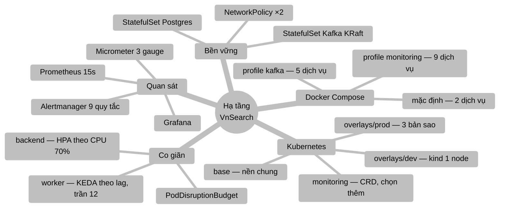
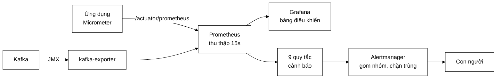

# Hạ tầng — hệ thống chạy ở đâu, ai canh nó

> **Tài liệu này trả lời:** ứng dụng chạy trên nền gì, dựng lên bằng lệnh nào,
> và khi nó hỏng thì ai biết.
>
> **Không** nói về việc mã đi từ máy lập trình viên tới đây bằng cách nào — đó
> là [`DEVOPS.md`](DEVOPS.md). **Không** nói về việc ứng dụng được lắp ráp ra
> sao — đó là [`BACKEND.md`](BACKEND.md).

---

## Mục lục

1. [Bản đồ tư duy hạ tầng](#1-bản-đồ-tư-duy-hạ-tầng)
2. [Ba mức triển khai bằng Docker Compose](#2-ba-mức-triển-khai-bằng-docker-compose)
3. [Ảnh Docker — hai giai đoạn](#3-ảnh-docker--hai-giai-đoạn)
4. [Kubernetes — bốn lớp Kustomize](#4-kubernetes--bốn-lớp-kustomize)
5. [Ba loại probe](#5-ba-loại-probe)
6. [Co giãn: CPU cho backend, độ dài hàng đợi cho worker](#6-co-giãn-cpu-cho-backend-độ-dài-hàng-đợi-cho-worker)
7. [Chuỗi quan sát](#7-chuỗi-quan-sát)
8. [Chín quy tắc cảnh báo](#8-chín-quy-tắc-cảnh-báo)
9. [Cardinality — cái bẫy giết máy chủ Prometheus](#9-cardinality--cái-bẫy-giết-máy-chủ-prometheus)
10. [GIỚI HẠN LỚN NHẤT: chỉ mục không chia sẻ được](#10-giới-hạn-lớn-nhất-chỉ-mục-không-chia-sẻ-được)
11. [Tra nhanh](#11-tra-nhanh)

---

## 1. Bản đồ tư duy hạ tầng


```
    ┌──────────────────────── BA ĐƯỜNG CHẠY ────────────────────────┐
    │                                                                │
    │  1. MÁY CÁ NHÂN         2. DOCKER COMPOSE      3. KUBERNETES  │
    │     ./mvnw spring-boot     docker compose up      kubectl -k   │
    │     + npm run dev                                              │
    │     ────────────────       ─────────────────      ───────────  │
    │     nhanh nhất             gần production nhất    thật         │
    │     không cần Docker       mà vẫn 1 lệnh          co giãn được │
    └────────────────────────────────────────────────────────────────┘
```

**Nguyên tắc xuyên suốt:** *mặc định phải là thứ nhẹ nhất mà vẫn chạy được.*
Bắt người ta trả giá 4 GB RAM chỉ để xem thử kết quả tìm kiếm là cách chắc chắn
nhất khiến họ không chạy lần thứ hai.

---

## 2. Ba mức triển khai bằng Docker Compose

| Lệnh | Dịch vụ | RAM | Dùng khi |
|---|---:|---:|---|
| `docker compose up -d --build` | 2 | ~1,5 GB | Demo tìm kiếm |
| `docker compose --profile kafka up -d --build` | 5 | ~3 GB | Xem crawl phân tán |
| `docker compose --profile kafka --profile monitoring up -d --build` | 9 | ~4 GB | Xem trọn chuỗi quan sát |
```
mặc định                profile kafka              profile monitoring
─────────────────       ────────────────────       ─────────────────────
postgres:17-alpine      + apache/kafka:3.8.1       + prom/prometheus:v2.55.1
backend                 + kafka-ui                 + grafana:11.3.0
                        + crawler-worker           + alertmanager:v0.27.0
                                                   + kafka-exporter:v1.7.0
```

Mọi ảnh đều **ghim phiên bản cụ thể**, không dùng `latest` (trừ `kafka-ui`, chỉ
là công cụ xem). Ghim chặt thì lặp lại được — và Dependabot có mục
`docker-compose` riêng để chúng không đứng yên mãi mãi.

Năm volume có tên: `postgres-data`, `kafka-data`, `prometheus-data`,
`grafana-data`, `alertmanager-data`.

---

## 3. Ảnh Docker — hai giai đoạn
```
┌─ GIAI ĐOẠN 1: BIÊN DỊCH ────────────────────────────────────┐
│  FROM maven:3.9-eclipse-temurin-17                          │
│    COPY pom.xml            ← chép RIÊNG, trước mã nguồn     │
│    RUN  dependency:go-offline || true                       │
│    COPY src                                                 │
│    RUN  mvn package -DskipTests                             │
└─────────────────────────────────────────────────────────────┘
                          │  chỉ mang theo file .jar
                          ▼
┌─ GIAI ĐOẠN 2: CHẠY ─────────────────────────────────────────┐
│  FROM eclipse-temurin:17-jre    ← JRE, không phải JDK       │
│    useradd vnsearch             ← KHÔNG chạy bằng root      │
│    COPY --from=build *.jar                                  │
│    COPY data/seed-documents.json    ← chạy được NGAY        │
│    USER vnsearch                                            │
│    ENTRYPOINT java -XX:MaxRAMPercentage=75 -jar app.jar     │
└─────────────────────────────────────────────────────────────┘
                  ảnh cuối nhỏ hơn ~600 MB
```

**Ba quyết định đáng giải thích:**

| Quyết định | Vì sao |
|---|---|
| Chép `pom.xml` **riêng** trước `src` | Tận dụng cache tầng: pom không đổi thì tầng tải thư viện được dùng lại, dù mã đổi bao nhiêu lần. Chép cả thư mục cùng lúc làm tầng này mất hiệu lực mỗi khi sửa một dòng Java |
| `dependency:go-offline \|\| true` | Đây thuần tuý là bước **tối ưu cache**. Hỏng ở đây không được phép làm hỏng cả bản build — `mvn package` bên dưới vẫn tải lại bình thường |
| `-XX:MaxRAMPercentage=75` thay `-Xmx` cố định | Heap tự co giãn theo giới hạn bộ nhớ mà Docker cấp, nên không phải sửa Dockerfile khi đổi máy |

---

## 4. Kubernetes — bốn lớp Kustomize
```
deploy/k8s/base            nền chung — chỉ thứ Kubernetes TỰ HIỂU
deploy/k8s/overlays/dev    cụm kind một node
deploy/k8s/overlays/prod   cụm thật
deploy/k8s/monitoring      lớp CHỌN THÊM — cần Prometheus Operator
```

### 4.1. Tài nguyên trong lớp `base`

| Tệp | Tài nguyên |
|---|---|
| `namespace.yaml` | `Namespace` — có nhãn Pod Security **`restricted`** |
| `configmap.yaml` | `ConfigMap vnsearch-config` |
| `secret.yaml` | `Secret vnsearch-secret` — **prod xoá đi**, xem §4.3 |
| `backend.yaml` | `Deployment` (2 bản sao) + `Service` + `HorizontalPodAutoscaler` + `PodDisruptionBudget` |
| `crawler-worker.yaml` | `Deployment` + `ScaledObject` (KEDA) + `PodDisruptionBudget` |
| `postgres.yaml` | `StatefulSet` + `Service` + `NetworkPolicy` |
| `kafka.yaml` | `StatefulSet` (KRaft) + `Service` + `NetworkPolicy` |
| `ingress.yaml` | `Ingress` |
| `schema.sql` | Bản sao lược đồ — CI canh cho khỏi lệch với `src/main/resources/db/` |

### 4.2. Vì sao `monitoring` tách khỏi `base`

`ServiceMonitor` và `PrometheusRule` là **CRD** — chúng không có sẵn trong
Kubernetes. Đưa vào lớp nền thì mọi cụm chưa cài Prometheus Operator sẽ nhận:
```
error: unable to recognize "...": no matches for kind "ServiceMonitor"
```

và `kubectl apply -k` **thất bại toàn bộ**, kể cả những tài nguyên hợp lệ đứng
trước nó. Nghĩa là: thêm giám sát vào lớp nền sẽ làm hỏng việc triển khai *ứng
dụng* trên mọi cụm chưa cài thêm gì.

> **Nguyên tắc:** lớp nền chỉ chứa thứ Kubernetes tự hiểu. Mọi thứ phụ thuộc một
> operator phải là lớp chọn thêm.

Cùng lý do, overlay `dev` **xoá** `ScaledObject` (cụm kind không có KEDA) và
**xoá** `HorizontalPodAutoscaler` (kind không có metrics-server — để lại thì nó
báo `unable to fetch metrics` mãi mãi, một dòng đỏ giả làm người ta quen với
việc bỏ qua dòng đỏ).

### 4.3. Khác biệt giữa hai overlay

| | `dev` | `prod` |
|---|---|---|
| Bản sao backend | **1** | **3** |
| HPA | xoá | giữ |
| KEDA `ScaledObject` | xoá | giữ |
| `Secret` | dùng bản trong `base` | **XOÁ** — bí mật thật đến từ nơi khác |
| `topologySpreadConstraints` | không | **có** |
| Ảnh | `vnsearch-backend:dev` (cục bộ) | ghim theo **digest** từ CD |

**Vì sao prod là 3 bản sao chứ không phải 2.** Với `PodDisruptionBudget`
`minAvailable: 1`, ba bản cho phép mất **một node** vì bảo trì **và** một Pod vì
sự cố mà vẫn còn phục vụ.

**Vì sao cần `topologySpreadConstraints`.** Không có ràng buộc này, bộ lập lịch
hoàn toàn có thể xếp cả ba Pod lên cùng một node — và lúc đó ba bản sao chỉ là
ba lần cùng **một** điểm hỏng.

**Vì sao prod xoá `Secret` của lớp nền.** Bí mật trong Git là bí mật đã lộ. Lớp
nền có một `Secret` chỉ để `kubectl apply -k base` chạy được ngay; ở prod nó bị
xoá và giá trị thật phải đến từ External Secrets, Sealed Secrets hoặc một lệnh
`kubectl create secret` ngoài luồng.

---

## 5. Ba loại probe

Đây là chỗ hay bị làm sai nhất trong Kubernetes, vì ba probe trả lời **ba câu
hỏi khác nhau**:
```
   startupProbe    "đã khởi động xong chưa?"   →  HOÃN hai probe kia
   readinessProbe  "nhận request được chưa?"   →  GỠ khỏi Service nếu không
   livenessProbe   "còn sống không?"           →  GIẾT Pod nếu không
```

| Probe | Đường dẫn | Vì sao đúng chỗ đó |
|---|---|---|
| `startup` | `/actuator/health/liveness` | Lập chỉ mục lần đầu trên corpus lớn mất vài chục giây. Không có nó, `liveness` kết luận Pod chết trong khi nó đang khởi động bình thường → giết → Pod mới lại chậm y hệt → **vòng lặp khởi động lại vô hạn** |
| `readiness` | `/api/health` | Endpoint này trả **503 khi chỉ mục rỗng** — đúng nghĩa "chưa phục vụ được" |
| `liveness` | `/actuator/health/liveness` | **KHÔNG** dùng `/api/health`: chỉ mục rỗng là vấn đề **dữ liệu**, khởi động lại Pod không sửa được gì, chỉ tạo thêm một vòng restart |

> Phân biệt readiness/liveness ở trên là nguyên tắc quan trọng nhất của mục này:
> **readiness được phép nghiêm khắc, liveness thì không.** Một liveness quá
> nghiêm khắc biến một sự cố dữ liệu thành một vòng lặp giết Pod.

---

## 6. Co giãn: CPU cho backend, độ dài hàng đợi cho worker

Đây là khác biệt **bản chất** giữa hai Deployment.
```
                CPU thấp  +  hàng đợi dài   →  CẦN thêm worker
   HPA theo CPU:                               ❌ bỏ lỡ
   KEDA theo lag:                              ✅ nhân bản

                CPU cao   +  hàng đợi rỗng  →  KHÔNG cần thêm
   HPA theo CPU:                               ❌ nhân bản thừa
   KEDA theo lag:                              ✅ giữ nguyên
```

`crawler-worker` dành phần lớn thời gian **chờ mạng** — CPU gần bằng 0 ngay cả
khi nó đang tụt lại rất xa. HPA theo CPU sẽ thấy "tải thấp" và không bao giờ
nhân bản, trong khi độ trễ tiêu thụ dài ra vô hạn.

| | `backend` | `crawler-worker` |
|---|---|---|
| Cơ chế | `HorizontalPodAutoscaler` | KEDA `ScaledObject` |
| Tín hiệu | CPU **70 %** | **Kafka consumer lag** |
| Trần | theo cấu hình cụm | **12** |

**Ngưỡng 70 % chứ không phải 90 %:** co giãn không tức thời — Pod mới phải được
lập lịch, kéo ảnh, khởi động, **lập chỉ mục**. Chờ tới 90 % là tới lúc Pod mới
sẵn sàng thì đã quá tải từ lâu.

**Trần 12 không tuỳ tiện.** Kafka giao mỗi phân hoạch cho đúng một consumer
trong một group, nên bản sao thứ 13 **nằm không**. `maxReplicaCount: 12` chính
là `app.crawler.kafka.partitions`. Và số phân hoạch không tăng được sau khi chạy
mà không phá phép băm theo host — nên nó là một trần thật.

---

## 7. Chuỗi quan sát

Một thang đo không được thu thập chỉ là một con số hiện ra khi có người gõ
`curl` — và không ai gõ `curl` lúc 3 giờ sáng.



```
   PHƠI          →  THU THẬP     →  VẼ        →  CẢNH BÁO   →  NGƯỜI
   Micrometer       Prometheus      Grafana      Alertmanager
   3 gauge          15 giây/lần                  9 quy tắc
   + HTTP metrics
```

### 7.1. Ba gauge nghiệp vụ

Actuator có sẵn rất nhiều thang đo **kỹ thuật**, nhưng không cái nào trả lời
được câu hỏi mà người vận hành một máy tìm kiếm thực sự cần hỏi:

| Actuator tự có | Chỉ `MetricsConfig` biết |
|---|---|
| Heap đang dùng bao nhiêu? | Chỉ mục đang có bao nhiêu tài liệu? |
| Request/giây là bao nhiêu? | Tỷ lệ trúng cache là bao nhiêu? |
| GC chạy bao lâu? | Chỉ mục có **rỗng** không? |

Cột phải mới phân biệt được *"hệ thống còn sống"* với *"hệ thống còn phục vụ
được"*. Một bản sao có heap khoẻ mạnh nhưng chỉ mục rỗng thì trả về 0 kết quả
cho **mọi** truy vấn — và mọi thang đo kỹ thuật đều xanh.

`vnsearch.index.documents` · `vnsearch.index.terms` · `vnsearch.cache.hit.rate`

### 7.2. Độ trễ theo phân vị, không chỉ trung bình

```properties
management.metrics.distribution.percentiles-histogram.http.server.requests=true
management.metrics.distribution.percentiles.http.server.requests=0.5,0.95,0.99
management.metrics.distribution.slo.http.server.requests=50ms,100ms,200ms,500ms,1s
```

Trung bình **giấu đi đúng phần đuôi**: một hệ thống có trung bình 20 ms vẫn có
thể có p99 là 3 giây — và p99 mới là con số quyết định người ta có quay lại hay
không.

`percentiles-histogram=true` khiến Micrometer đẩy cả histogram sang Prometheus,
nhờ vậy phân vị tính được **gộp lại** từ nhiều bản sao. Đẩy giá trị percentile
đã tính sẵn thì không cộng dồn được: *trung bình của hai p99 không phải là p99
của tổng.*

---

## 8. Chín quy tắc cảnh báo

Nguyên tắc chọn: **chỉ cảnh báo những thứ mà một con người phải làm gì đó.** Một
cảnh báo không dẫn tới hành động sẽ bị bỏ qua, và một danh sách toàn cảnh báo bị
bỏ qua thì làm hỏng cả những cảnh báo thật.

| Cảnh báo | Mức | Bắt được gì | Compose | K8s |
|---|---|---|:---:|:---:|
| `VnSearchBackendDown` | critical | Tiến trình chết | ✅ | ✅ |
| `VnSearchEmptyIndex` | warning | **Mọi thang đo xanh, mọi truy vấn trả rỗng** | ✅ | ✅ |
| `VnSearchSearchLatencyHigh` | warning | p99 vượt SLO 500 ms | ✅ | ✅ |
| `VnSearchHighErrorRate` | critical | >5 % request trả 5xx | ✅ | ✅ |
| `VnSearchCrawlBusFailing` | critical | **Crawler chạy bình thường nhưng không gì tới Modular Service** | ✅ | ✅ |
| `VnSearchKafkaConsumerLagHigh` | warning | Consumer không theo kịp | ✅ | ✅ |
| `VnSearchDeadLetterGrowing` | warning | Thông điệp hỏng lặp lại | ✅ | ✅ |
| `VnSearchPodCrashLooping` | warning | Pod khởi động lại liên tục | — | ✅ |
| `VnSearchKafkaDiskFilling` | warning | Ổ đĩa Kafka sắp đầy | — | ✅ |

**Hai dòng in đậm là lý do tồn tại của cả bộ này.** Chúng bắt những ca hỏng mà
mọi thang đo kỹ thuật đều xanh — loại sự cố mà không có cảnh báo thì chỉ phát
hiện ra khi người dùng phàn nàn.

Mỗi quy tắc có trường `runbook`: người nhận cảnh báo lúc 3 giờ sáng cần **các
bước cụ thể**, không phải một câu mô tả vấn đề.

> Hai tệp quy tắc (`deploy/monitoring/alerts.yml` cho Compose và
> `deploy/k8s/monitoring/prometheusrule.yaml` cho Kubernetes) mô tả **cùng một
> bộ**. Chúng không dùng chung tệp được — khác định dạng, và kustomize không
> tham chiếu tệp ngoài thư mục gốc. CI vì vậy có một bước **so theo tên cảnh
> báo** để chặn hai bản lệch nhau.

---

## 9. Cardinality — cái bẫy giết máy chủ Prometheus

`CrawlAnalyticsService` **cố ý không** gắn nhãn `host` vào Prometheus.

```java
Counter.builder("crawl.pages").tag("host", host)     // ← cái bẫy
```

Prometheus tạo một chuỗi thời gian cho **mỗi tổ hợp nhãn**, mỗi chuỗi tốn 1–3 KB
thường trú. Một phiên crawl chạm 30.000 host tạo 30.000 chuỗi từ *một* thang đo.
Và `host` là dữ liệu **do bên ngoài quyết định** — lực lượng không chặn trên
được.

| Chiều | Lực lượng | Đi đâu |
|---|---|---|
| ngôn ngữ | 3 (`vi`, `en`, `und`) | **Nhãn Prometheus** |
| host | không chặn trên | Bảng trong bộ nhớ, trần 10.000, phơi qua API quản trị |

Có một bài test canh việc này: `hostIsNeverUsedAsAPrometheusLabel` sẽ đỏ nếu ai
đó "tiện tay" thêm `tag("host", ...)` sau này.

---

## 10. GIỚI HẠN LỚN NHẤT: chỉ mục không chia sẻ được

Đây là giới hạn kiến trúc quan trọng nhất của toàn hệ thống, và nó **không đọc
ra được** từ con số `replicas: 3` ở overlay prod.

```yaml
# deploy/k8s/base/backend.yaml
replicas: 2          # + HPA, prod nâng lên 3
volumes:
  - name: data
    emptyDir: {}     # ← ổ đĩa RỖNG, RIÊNG từng Pod, MẤT khi Pod chết
```

Kết hợp với việc chỉ mục đảo nằm **hoàn toàn trong RAM** của từng tiến trình
(xem [`BACKEND.md` §9](BACKEND.md)), nó dẫn tới ba hệ quả:
```
   1.  Mỗi Pod dựng chỉ mục RIÊNG trong bộ nhớ của mình.
       Hai bản sao không chia sẻ gì cả.

   2.  Pod mới khởi động với thư mục data RỖNG
       → không thấy corpus đã crawl
       → lùi về seed-documents.json nướng trong ảnh (vài chục trang).

   3.  Kết quả POST /api/admin/crawl chỉ nằm trên ĐÚNG Pod đã nhận lệnh,
       và mất hẳn khi Pod đó khởi động lại.
```

> **Nói thẳng:** ở dạng hiện tại, `replicas: 3` + HPA cho khả năng **chịu tải**
> trên corpus mẫu, chứ chưa phải một **cụm tìm kiếm nhiều bản sao** thật sự.

### Ba hướng sửa, theo công sức tăng dần

| | Hướng | Được | Mất |
|---|---|---|---|
| **a** | PVC `ReadWriteMany` (NFS, CephFS, Azure Files) mount vào mọi Pod | Ít sửa mã nhất | Cần StorageClass hỗ trợ RWX — `kind` cục bộ **không có** |
| **b** | Tải chỉ mục từ object storage (S3/MinIO) bằng `initContainer` | Chạy được trên mọi cụm, corpus vẫn là một tệp | Thêm một phụ thuộc ngoài |
| **c** | Tách hẳn tầng chỉ mục thành service riêng, backend thành lớp không trạng thái | **Hướng mở rộng thật sự** — và là nơi bài toán phân mảnh (sharding) bắt đầu có nghĩa | Việc lớn nhất |

Chọn (a) hay (b) là quyết định **phụ thuộc cụm**, nên nó không được chốt sẵn ở
lớp `base`; đúng chỗ của nó là một patch ở overlay. Giới hạn này được ghi thẳng
trong manifest để người triển khai buộc phải đọc.

### Các giới hạn hạ tầng khác

1. **Kafka và PostgreSQL đều một node, không sao lưu tự động.** Đủ cho đồ án.
   Cụm thật cần ba node Kafka hoặc dịch vụ quản trị sẵn, và CloudNativePG hoặc
   RDS cho CSDL.
2. **Alertmanager không gửi đi đâu.** Cố ý — không có khoá Slack nào được phép
   nằm trong repo công khai. Chuỗi vẫn chạy thật và kiểm chứng được ở
   <http://localhost:9093>.
3. **Chưa có kiểm thử tải.** Nghĩa là **chưa biết trần thông lượng thật**.
4. **Chưa có tracing phân tán.** Với ba service nối bằng Kafka, một request đi
   qua nhiều tiến trình mà không có `traceId` xuyên suốt. Bước hợp lý tiếp theo
   là OpenTelemetry.

### Một lỗi mạng đã suýt xảy ra

NetworkPolicy của PostgreSQL ban đầu chỉ cho `component: backend` vào. Khi
`crawler-worker` được tách ra, nó mang nhãn `component: crawler-worker` —
**không khớp nữa, nên bị chặn khỏi CSDL**.

Kiểu hỏng này đặc biệt khó truy: Pod khởi động bình thường, log không có gì bất
thường trong nhiều giây, rồi kết nối JDBC hết thời gian chờ. Không có thông báo
"bị NetworkPolicy chặn" ở đâu cả — gói tin chỉ đơn giản **biến mất**.

> **Bài học:** quy tắc mạng phải được cập nhật **cùng lúc** với việc thêm thành
> phần mới, không phải sau khi có người báo lỗi.

Cùng lý do, NetworkPolicy của Kafka cho phép cả `component: kafka` — các node
KRaft phải nói chuyện với nhau để bầu cử. Với một node thì thiếu mục đó chưa lộ
ra, nên nó sẽ là một lỗi chỉ xuất hiện **đúng lúc mở rộng quy mô**.

---

## 11. Tra nhanh

```bash
# --- Chạy ---
docker compose up -d --build                                # nhẹ, 2 dịch vụ
docker compose --profile kafka up -d --build                # + Kafka
docker compose --profile kafka --profile monitoring up -d   # + giám sát

# --- Kubernetes ---
bash deploy/kind/up.sh                                      # dựng cụm kind
kubectl apply -k deploy/k8s/overlays/dev
kubectl -n vnsearch rollout status deployment/vnsearch-backend
kubectl kustomize deploy/k8s/overlays/prod                  # xem manifest cuối

# --- Kiểm định trước khi commit ---
kubectl kustomize deploy/k8s/base       > /dev/null
kubectl kustomize deploy/k8s/overlays/dev  > /dev/null
kubectl kustomize deploy/k8s/overlays/prod > /dev/null
kubectl kustomize deploy/k8s/monitoring    > /dev/null
```

| Địa chỉ | Xem gì |
|---|---|
| <http://localhost:8080/api/health> | Hệ thống có phục vụ được không |
| <http://localhost:8080/actuator/prometheus> | Số liệu thô |
| <http://localhost:8081> | kafka-ui — topic, lag, dead-letter |
| <http://localhost:9090/alerts> | Prometheus — trạng thái cảnh báo |
| <http://localhost:3000> | Grafana (`admin`/`admin`) |
| <http://localhost:9093> | Alertmanager |

---

## Đọc tiếp

| Tài liệu | Nội dung |
|---|---|
| [`DEVOPS.md`](DEVOPS.md) | CI/CD — mã đi từ máy tới đây bằng cách nào |
| [`BACKEND.md`](BACKEND.md) | Ứng dụng Spring được lắp ra sao |
| [`SECURITY.md`](SECURITY.md) | Bảo mật, gồm cả phần cứng hoá container |
| [`Math/09-kafka/`](Math/09-kafka/00-SO-DO-TU-DUY.md) | Vì sao Kafka, và vì sao **không** thay URL Frontier |
