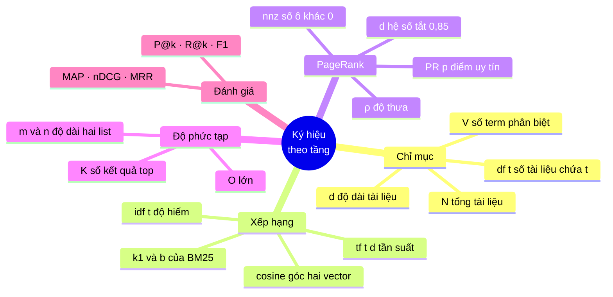

# 00 — Từ điển ký hiệu toán

> **Đọc trang này trước tiên.** Mọi ký hiệu lạ xuất hiện trong các tài liệu còn lại đều được giải thích ở đây, bằng tiếng Việt thường, kèm ví dụ số lấy từ chính corpus của dự án. Khi gặp ký hiệu không hiểu ở tài liệu nào, quay lại đây tra.
>
> *(Ví dụ số trong trang này lấy từ mốc corpus 5.011 trang — xem bảng quy chiếu
> các mốc ở đầu [`DSA-REPORT.md`](../DSA-REPORT.md).)*

### Ký hiệu nào dùng ở tầng nào



```
   TẦNG            KÝ HIỆU HAY GẶP
   ─────           ───────────────
   chỉ mục      :  N, V, df(t), |d|
   xếp hạng     :  tf(t,d), idf(t), k₁, b, cos θ
   PageRank     :  PR(p), d = 0,85, nnz, ρ
   độ phức tạp  :  O(·), m, n, K, L
   đánh giá     :  P@k, R@k, F1, MAP, nDCG, MRR

   ⚠ Chữ `d` mang HAI nghĩa tuỳ ngữ cảnh:
       d  trong tf(t,d)     = một tài liệu
       d  trong PageRank    = hệ số tắt 0,85
     Đây là quy ước chuẩn của ngành, tài liệu giữ nguyên để khớp sách vở.
```

---

## 1. Cách đọc một công thức

Công thức toán chỉ là **một câu tiếng Việt viết tắt**. Ví dụ:

$$\text{idf}(t) = \log_{10} \frac{N}{\text{df}(t)}$$

đọc thành lời: *"Độ hiếm của từ `t` bằng logarit cơ số 10 của tỉ số giữa tổng số tài liệu và số tài liệu có chứa từ `t`."*

Ba phần luôn có:

| Phần | Trong ví dụ | Nghĩa |
|---|---|---|
| Cái cần tính | $\text{idf}(t)$ | kết quả (inverse document frequency — độ hiếm) |
| Dấu bằng | $=$ | "được tính bằng" |
| Cách tính | $\log_{10}(N/\text{df})$ | công thức, $N$ và $\text{df}$ là dữ liệu đầu vào |

**Quy tắc vàng:** chữ cái chỉ là **cái hộp đựng số**. $N$ không "là" gì cả — nó chỉ là tên gọi ngắn cho "tổng số tài liệu", và trong dự án này $N = 5011$. Khi đọc, hãy thay ngay chữ cái bằng nghĩa tiếng Việt của nó.

---

## 2. Bảng ký hiệu dùng xuyên suốt dự án

Đây là bảng quan trọng nhất của trang này. Mọi tài liệu đều dùng đúng bộ ký hiệu sau:

| Ký hiệu | Đọc là | Nghĩa trong dự án | Giá trị thật |
|---|---|---|---|
| $N$ | en lớn | Tổng số tài liệu trong corpus | **5 011** |
| $V$ | vê | Số term phân biệt trong chỉ mục (kích thước từ vựng) | **136 768** |
| $t$ | tê | Một **term** (từ khoá đã tách) | `máy_tính` |
| $d$ | dê | Một **tài liệu** | doc #3500 |
| $q$ | qu | Một **truy vấn** | `"trình duyệt web" máy tính` |
| $f(t,d)$ | ép của tê, dê | **Term frequency** — số lần $t$ xuất hiện trong $d$ | 7 |
| $\text{df}(t)$ | đê-ép của tê | **Document frequency** — số tài liệu chứa $t$ | 1 639 |
| $\lvert d \rvert$ | độ dài dê | Độ dài tài liệu, tính bằng số token | 1 043 |
| $\text{avgdl}$ | a-vơ-gờ-đê-eo | Độ dài tài liệu **trung bình** toàn corpus | **1 043,3** |
| $n$, $m$ | en, em | Kích thước của hai danh sách đang xét | 1 639 và 20 |
| $D$ | đê lớn | Số **host** phân biệt trong frontier | **52** |
| $n_d$ | en chỉ số dê | Số URL đang chờ của **một** host | vài nghìn |
| $\text{nnz}$ | en-en-dét | Số phần tử **khác 0** của ma trận thưa (= số cạnh) | **239 691** |
| $c$ | xê | Số **ứng viên** còn lại sau khi giao posting list | 20 – 500 |
| $k$ | ca | Tham số nhỏ: số hàm băm, top-$k$, số gợi ý | 7, 10 |
| $L$ | eo | Độ dài một chuỗi (số ký tự hoặc số token) | — |

> ⚠️ **Bẫy ký hiệu thường gặp.** Chữ $d$ có **hai** nghĩa tuỳ ngữ cảnh: trong công thức xếp hạng nó là "một tài liệu"; trong công thức PageRank nó là **damping factor** $d = 0{,}85$. Tài liệu nào dùng nghĩa nào đều nói rõ ở đầu. Tương tự $k$ trong BM25 viết là $k_1$ để phân biệt với $k$ của top-$k$.

---

## 3. Chữ Hy Lạp — chỉ là tên biến

Người ta dùng chữ Hy Lạp thay vì `a`, `b`, `c` **chỉ vì đã hết chữ Latin**, không có ý nghĩa huyền bí nào.

| Ký hiệu | Đọc là | Trong dự án này thường chỉ |
|---|---|---|
| $\alpha$ | alpha | **Trọng số điểm liên quan** trong công thức kết hợp ($0{,}6$) |
| $\beta$ | beta | **Trọng số PageRank** ($0{,}3$) |
| $\gamma$ | gamma | **Trọng số khớp tiêu đề** ($0{,}1$) |
| $\varepsilon$ | epsilon | Ngưỡng hội tụ rất nhỏ ($10^{-6}$) |
| $\Sigma$ (hoa) | sigma | **Phép cộng dồn** — xem §5 |
| $\Delta$ (hoa) | delta | **Lượng chênh lệch** giữa hai lần lặp |
| $\lambda$ | lambda | Trị riêng của ma trận (dùng khi chứng minh PageRank hội tụ) |
| $\pi$ | pi | Vector phân phối dừng (chính là vector PageRank) |
| $\mathbb{1}[\cdot]$ | hàm chỉ thị | Bằng $1$ nếu điều kiện đúng, $0$ nếu sai |

Ví dụ hàm chỉ thị trong công thức ưu tiên crawl:

$$5 \cdot \mathbb{1}\bigl[u \in \texttt{.vn}\bigr] \quad=\quad \begin{cases} 5 & \text{nếu } u \text{ là domain .vn} \\ 0 & \text{nếu không} \end{cases}$$

Trong code đúng là một câu `if`:

```java
if (isVnDomain(url)) {
    score += 5.0;
}
```

---

## 4. Chỉ số dưới và chỉ số trên

### Chỉ số dưới — đánh số thứ tự

$$\text{PR}_0, \; \text{PR}_1, \; \text{PR}_2$$

đọc "PR không, PR một, PR hai" = **giá trị PageRank sau vòng lặp thứ 0, 1, 2**. Giống mảng `pr[0]`, `pr[1]` trong code.

$$k_1, \; b$$

= hai **tham số** của BM25. Chỉ số dưới ở đây chỉ là **ghi chú tên**, không phải phép tính. Viết $k_1$ chứ không phải $k$ để không lẫn với $k$ của top-$k$.

### Chỉ số trên — luỹ thừa (mũ)

$$2^{\text{rel}} - 1$$

là **độ lợi hàm mũ** của nDCG. Với thang liên quan 0/1/2:

| $\text{rel}$ | $2^{\text{rel}} - 1$ | Nghĩa |
|---|---|---|
| 0 | $2^0 - 1 = 0$ | Không liên quan → không được điểm |
| 1 | $2^1 - 1 = 1$ | Liên quan → 1 điểm |
| 2 | $2^2 - 1 = 3$ | Rất liên quan → **3 điểm** (gấp ba, không phải gấp đôi) |

**Cảnh báo:** $x^2$ (mũ 2) khác hoàn toàn $x_2$ (biến số 2). Vị trí cao/thấp đổi hẳn nghĩa.

Mũ đặc biệt:

| Ký hiệu | Nghĩa | Ví dụ trong dự án |
|---|---|---|
| $x^{-1}$ | nghịch đảo, $= 1/x$ | $\text{rank}^{-1}$ trong MRR |
| $x^{1/2}$ | căn bậc hai, $= \sqrt{x}$ | $\sqrt{\lvert d \rvert}$ chuẩn hoá độ dài |
| $x^0$ | luôn bằng $1$ | $2^0 = 1$ |
| $M^{\mathsf{T}}$ | **chuyển vị** ma trận | $M^{\mathsf{T}}\text{PR}$ của PageRank |

---

## 5. $\Sigma$ — phép cộng dồn (chính là vòng `for`)

Đây là ký hiệu làm người đọc sợ nhất, nhưng nó **đúng bằng một vòng `for` cộng dồn**.

$$\sum_{i=1}^{4} \frac{1}{i}$$

Đọc: *"cộng $1/i$ lại, với $i$ chạy từ 1 đến 4."*

$$= \frac{1}{1} + \frac{1}{2} + \frac{1}{3} + \frac{1}{4} = 1 + 0{,}5 + 0{,}333 + 0{,}25 = 2{,}083$$

Code tương đương:

```java
double sum = 0;
for (int i = 1; i <= 4; i++) sum += 1.0 / i;   // sum = 2.083
```

**Bản đồ dịch 1–1:**

| Phần của $\Sigma$ | Phần của `for` |
|---|---|
| $i$ ở dưới | tên biến đếm |
| $i=1$ | `int i = 1` |
| số ở trên ($4$) | `i <= 4` |
| biểu thức sau $\Sigma$ | thân vòng lặp, `sum +=` |

Ví dụ thật trong dự án — công thức BM25 (tài liệu [BM25Scorer](05-ranking/BM25Scorer.md)):

$$\text{score}(d, q) = \sum_{t \in q} \text{IDF}(t) \cdot \frac{f(t,d)\,(k_1+1)}{f(t,d) + k_1\bigl(1 - b + b\frac{\lvert d\rvert}{\text{avgdl}}\bigr)}$$

Ký hiệu $\sum_{t \in q}$ đọc là *"cộng dồn qua **mọi term $t$ thuộc truy vấn $q$**"* — tức là một vòng `for` chạy qua danh sách term, đúng như code:

```java
for (Map.Entry<String, Integer> entry : queryTermFrequency.entrySet()) {
    ...
    total += idf(totalDocs, df) * saturated;
}
```

$\Pi$ (pi hoa) cũng vậy nhưng **nhân dồn** thay vì cộng dồn — dùng khi tính xác suất false positive của Bloom Filter.

---

## 6. Làm tròn: $\lfloor\;\rfloor$ và $\lceil\;\rceil$

| Ký hiệu | Tên | Nghĩa | Ví dụ |
|---|---|---|---|
| $\lfloor x \rfloor$ | floor, sàn | làm tròn **xuống** | $\lfloor 3{,}7 \rfloor = 3$, $\lfloor -3{,}2 \rfloor = -4$ |
| $\lceil x \rceil$ | ceil, trần | làm tròn **lên** | $\lceil 3{,}2 \rceil = 4$ |
| $\operatorname{round}(x)$ | round | làm tròn **gần nhất** | $\operatorname{round}(6{,}64) = 7$ |

Cả ba đều xuất hiện trong công thức chọn tham số Bloom Filter:

$$m = \left\lceil \frac{-n \ln p}{(\ln 2)^2} \right\rceil, \qquad k = \operatorname{round}\!\left(\frac{m}{n}\ln 2\right)$$

Dùng $\lceil\cdot\rceil$ cho $m$ vì thà **thừa** bit còn hơn thiếu (thiếu thì tỉ lệ sai vượt mục tiêu). Dùng $\operatorname{round}$ cho $k$ vì $k$ nằm ở đáy một đường cong lồi — lệch một đơn vị lên hay xuống đều tương đương.

Trong Java: `Math.ceil`, `Math.floor`, `Math.round`.

---

## 7. Logarit — "cần bao nhiêu lần nhân đôi"

Logarit là ký hiệu bị hiểu sai nhiều nhất. Cách đọc đúng và duy nhất cần nhớ:

> $\log_2 n$ = **số lần phải chia đôi $n$ để về 1**.

| $n$ | $\log_2 n$ | Ý nghĩa cụ thể |
|---|---|---|
| 8 | 3 | chia đôi 3 lần: 8 → 4 → 2 → 1 |
| 1 024 | 10 | 10 lần |
| **1 639** | ≈ **10,7** → **11** | Binary search trên posting list `công_nghệ` chỉ mất **11 phép so sánh** thay vì 1 639 |
| 1 000 000 | ≈ 20 | Một triệu phần tử, 20 bước |

Đó chính là lý do mọi thuật toán $O(\log n)$ trong dự án đều "gần như miễn phí".

**Ba cơ số dùng trong dự án, và vì sao:**

| Ký hiệu | Cơ số | Dùng ở đâu | Vì sao cơ số đó |
|---|---|---|---|
| $\log_2$ | 2 | nDCG (chiết khấu vị trí), độ phức tạp | Gắn với chia đôi / bit |
| $\log_{10}$ | 10 | TF-IDF | Quy ước kinh điển của Salton, cho ra số dễ đọc |
| $\ln$ | $e \approx 2{,}718$ | BM25, Bloom Filter | Xuất phát từ giải tích (đạo hàm, xác suất) |

**Điểm quan trọng cần hiểu:** đổi cơ số chỉ nhân với một hằng số:

$$\log_{10} x = \frac{\ln x}{\ln 10} = 0{,}434 \cdot \ln x$$

Nên với **xếp hạng**, chọn cơ số nào **không đổi thứ tự kết quả** — chỉ đổi thang điểm. Đó là lý do TF-IDF dùng $\log_{10}$ còn BM25 dùng $\ln$ mà không ai thấy vấn đề gì. Nhưng khi **cộng hai điểm khác thang** thì chuyện lại hoàn toàn khác — xem [ResultRanker §6](05-ranking/ResultRanker.md).

Java không có `log2`, nên code viết đổi cơ số thủ công:

```java
private static double discount(int zeroBasedIndex) {
    return Math.log(zeroBasedIndex + 2) / Math.log(2);   // ln(x)/ln(2) = log2(x)
}
```

---

## 8. Big-O — "chi phí tăng theo cỡ nào"

$O(f(n))$ trả lời đúng một câu hỏi: **khi dữ liệu to gấp đôi, thời gian chạy to gấp mấy?**

| Ký hiệu | Tên | Gấp đôi $n$ thì thời gian… | Ví dụ trong dự án |
|---|---|---|---|
| $O(1)$ | hằng số | **không đổi** | `getPostings`, `LRUCache.get` |
| $O(\log n)$ | logarit | **+1 bước** | Binary search posting list, `MinHeap.insert` |
| $O(n)$ | tuyến tính | gấp đôi | Tokenize một văn bản, `SparseMatrix.multiply` |
| $O(n \log n)$ | tuyến-log | hơn gấp đôi một chút | Sort toàn bộ ứng viên |
| $O(n^2)$ | bậc hai | **gấp bốn** | Ma trận đặc — chính thứ dự án phải tránh |

**Quy tắc bỏ hằng số.** $O(3n + 100)$ viết thành $O(n)$: Big-O quan tâm **dáng điệu tăng trưởng**, không quan tâm hằng số. Nhưng trong thực tế hằng số vẫn quan trọng — đó là lý do dự án đo thời gian thật chứ không chỉ tính Big-O (xem `DSA-REPORT.md`).

**Vì sao $O(n^2)$ là thảm hoạ, bằng số thật:** ma trận liên kết web của dự án có $n = 5011$.

$$n^2 = 5011^2 = 25\,110\,121 \text{ ô} \times 8 \text{ byte} = \mathbf{191{,}5\ MB}$$

$$\text{nnz} = 239\,691 \text{ phần tử khác 0} \Rightarrow \approx \mathbf{3{,}7\ MB}$$

Chênh **52 lần**, và tỉ lệ này còn **xấu đi** khi corpus lớn hơn. Xem [SparseMatrix](06-datastructures/SparseMatrix.md).

---

## 9. Ký hiệu tập hợp

| Ký hiệu | Đọc là | Nghĩa | Ví dụ trong dự án |
|---|---|---|---|
| $t \in q$ | thuộc | $t$ là một phần tử của $q$ | "term $t$ có trong truy vấn" |
| $A \cap B$ | giao | Phần tử có ở **cả hai** | Giao posting list (AND) |
| $A \cup B$ | hợp | Phần tử có ở **ít nhất một** | Hợp posting list (OR) |
| $\lvert A \rvert$ | lực lượng | **Số phần tử** của $A$ | $\lvert Q \rvert = 200$ truy vấn |
| $\emptyset$ | rỗng | Tập không có phần tử nào | Giao rỗng → dừng sớm |
| $\le$, $\ge$ | nhỏ/lớn hơn hoặc bằng | | |

Bất đẳng thức quan trọng nhất của module truy vấn (xem [PostingListMerger](04-query/PostingListMerger.md)):

$$\lvert A \cap B \rvert \;\le\; \min\bigl(\lvert A \rvert, \lvert B \rvert\bigr)$$

**Đọc thành lời:** *"Giao của hai tập không bao giờ lớn hơn tập nhỏ hơn."* Hiển nhiên, nhưng chính nó là cơ sở của tối ưu **shortest-first**: bắt đầu từ posting list ngắn nhất thì kết quả trung gian nhỏ ngay từ đầu.

---

## 10. Vector và chuẩn (norm)

Mô hình không gian vector coi mỗi tài liệu là **một mũi tên trong không gian $V$ chiều** ($V = 136\,768$ chiều — không hình dung nổi, nhưng toán học vẫn chạy đúng như trong 2 chiều).

| Ký hiệu | Tên | Công thức | Nghĩa |
|---|---|---|---|
| $\vec{d} \cdot \vec{q}$ | tích vô hướng | $\sum_i d_i q_i$ | "Hai vector cùng hướng bao nhiêu" |
| $\lVert \vec{d} \rVert$ | chuẩn $L_2$ | $\sqrt{\sum_i d_i^2}$ | "Độ dài mũi tên" |
| $\lVert \vec{x} \rVert_1$ | chuẩn $L_1$ | $\sum_i \lvert x_i \rvert$ | Tổng trị tuyệt đối — dùng làm tiêu chí hội tụ PageRank |
| $\cos\theta$ | cosine | $\dfrac{\vec{d}\cdot\vec{q}}{\lVert\vec{d}\rVert\,\lVert\vec{q}\rVert}$ | **Góc** giữa hai vector, luôn trong $[0,1]$ với toạ độ không âm |

**Vì sao dùng cosine mà không dùng thẳng tích vô hướng:** tích vô hướng thiên vị tài liệu **dài**, vì tài liệu dài có nhiều term hơn nên tổng lớn hơn — kể cả khi nó không liên quan hơn. Chia cho chuẩn tức là **chuẩn hoá về mũi tên đơn vị**, chỉ còn so hướng chứ không so độ dài.

Ví dụ tính tay trong 2 chiều: $\vec{q} = (1, 0)$, $\vec{d_1} = (2, 0)$, $\vec{d_2} = (1, 1)$.

$$\cos(\vec{q}, \vec{d_1}) = \frac{2}{1 \cdot 2} = 1{,}0 \qquad \cos(\vec{q}, \vec{d_2}) = \frac{1}{1 \cdot \sqrt2} = 0{,}707$$

$\vec{d_1}$ dài gấp đôi nhưng **cùng hướng hoàn toàn** với truy vấn → điểm tuyệt đối. Đúng trực giác.

Xem [TfIdfScorer](05-ranking/TfIdfScorer.md).

---

## 11. Xác suất — chỉ cần ba quy tắc

Dùng cho Bloom Filter và cho mô hình xác suất của BM25.

| Quy tắc | Công thức | Ví dụ |
|---|---|---|
| Biến cố đối | $P(\text{không A}) = 1 - P(A)$ | Bit **không** bị bật: $1 - 1/m$ |
| Độc lập → nhân | $P(A \text{ và } B) = P(A)P(B)$ | $kn$ lần bật độc lập: $(1 - 1/m)^{kn}$ |
| Xấp xỉ mũ | $\left(1 - \frac{1}{m}\right)^{x} \approx e^{-x/m}$ khi $m$ lớn | $m \approx 9{,}6$ triệu → xấp xỉ rất chính xác |

Ba quy tắc này ghép lại cho ra đúng công thức tỉ lệ false positive của Bloom Filter:

$$p \;\approx\; \left(1 - e^{-kn/m}\right)^{k}$$

Suy dẫn đầy đủ ở [BloomFilter §3](01-crawler/BloomFilter.md).

---

## 12. Số $e$ và hằng số $\ln 2$

$e \approx 2{,}71828$ là cơ số "tự nhiên" — nó xuất hiện mỗi khi có **tăng/giảm theo tỉ lệ**.

Hai hằng số phải nhớ vì chúng xuất hiện thẳng trong code:

$$\ln 2 \approx 0{,}693147 \qquad (\ln 2)^2 \approx 0{,}480453$$

```java
double ln2 = Math.log(2);
int m = (int) Math.ceil(-expectedItems * Math.log(falsePositiveRate) / (ln2 * ln2));
int k = (int) Math.round((double) m / expectedItems * ln2);
```

Con số $0{,}693$ không phải phép màu: nó là **nghiệm tối ưu** của bài toán "chọn $k$ để tỉ lệ sai nhỏ nhất". Chứng minh ở [BloomFilter §4](01-crawler/BloomFilter.md).

---

## 13. Ma trận và phép nhân ma trận–vector

| Ký hiệu | Nghĩa |
|---|---|
| $M$ | Ma trận (bảng số 2 chiều) |
| $M_{ij}$ | Phần tử **hàng $i$, cột $j$** |
| $M \vec{x}$ | Nhân ma trận với vector, ra một vector mới |
| $M^{\mathsf{T}}$ | Chuyển vị: $M^{\mathsf{T}}_{ij} = M_{ji}$ (lật qua đường chéo) |

Phép nhân ma trận–vector, viết ra thành lời:

$$(M\vec{x})_i = \sum_{j} M_{ij}\, x_j$$

*"Phần tử thứ $i$ của kết quả = cộng dồn, qua mọi cột $j$, tích của ô $(i,j)$ với phần tử $j$ của vector."*

Đúng bằng hai vòng `for` lồng nhau — và trong dự án, vòng trong **chỉ chạy qua các ô khác 0**:

```java
for (int row = 0; row < rows; row++) {
    double sum = 0.0;
    for (Entry e : rowEntries.get(row)) {   // ← chỉ nnz phần tử, không phải n
        sum += e.value * vector[e.col];
    }
    result[row] = sum;
}
```

Đó là toàn bộ khác biệt giữa $O(n^2)$ và $O(\text{nnz})$. Xem [SparseMatrix](06-datastructures/SparseMatrix.md) và [PageRankService](05-ranking/PageRankService.md).

---

## 14. Ký hiệu bit

Dùng trong Bloom Filter.

| Ký hiệu | Java | Nghĩa | Ví dụ |
|---|---|---|---|
| `&` | AND bit | Cả hai bit đều 1 | `1011 & 0110 = 0010` |
| `\|` | OR bit | Ít nhất một bit là 1 | `1011 \| 0110 = 1111` |
| `^` | XOR bit | Đúng một bit là 1 | `1011 ^ 0110 = 1101` |
| `<<` | dịch trái | Nhân $2^k$ | `1 << 3 = 8` |
| `>>>` | dịch phải **không dấu** | Chia $2^k$, **luôn chèn 0** | Dùng trong binary search |

**Vì sao `>>>` chứ không phải `/2` trong binary search** — chi tiết dễ bỏ qua nhất của cả dự án:

```java
int mid = (low + high) >>> 1;   // KHÔNG phải (low + high) / 2
```

Với danh sách rất lớn, `low + high` có thể **tràn `int` thành số âm**, và `/2` giữ nguyên dấu âm → chỉ số âm → `ArrayIndexOutOfBoundsException`. Dịch bit không dấu `>>>` xử lý đúng cả khi tràn, vì nó coi 32 bit là số không dấu. Đây là lỗi kinh điển từng tồn tại **9 năm** trong `java.util.Arrays.binarySearch` của chính JDK, được Joshua Bloch công bố năm 2006.

Đóng gói bit trong `BloomFilter`:

```java
private void setBit(int index) {
    bits[index / 64] |= (1L << (index % 64));
}
```

Đọc: *"Ô thứ `index/64` của mảng `long[]`, bật bit thứ `index%64` của ô đó."* Mỗi `long` chứa 64 bit nên một mảng 149 767 phần tử `long` đủ chứa 9,58 triệu bit.

---

## 15. Ba công thức nên thuộc lòng

Nếu chỉ nhớ được ba thứ từ toàn bộ tài liệu này, hãy nhớ ba công thức sau — chúng là xương sống của một máy tìm kiếm.

**1. Trọng số một từ trong một tài liệu (TF-IDF):**

$$w(t,d) = \underbrace{\bigl(1 + \log_{10} f(t,d)\bigr)}_{\text{lặp nhiều} \to \text{quan trọng, nhưng bão hoà}} \times \underbrace{\log_{10}\frac{N}{\text{df}(t)}}_{\text{hiếm} \to \text{phân biệt tốt}}$$

**2. Uy tín một trang (PageRank):**

$$\text{PR}(j) = \underbrace{\frac{1-d}{N}}_{\text{nhảy ngẫu nhiên}} + \; d \sum_{i \to j} \frac{\text{PR}(i)}{\text{outDeg}(i)}$$

**3. Chất lượng một hệ thống xếp hạng (MRR):**

$$\text{MRR} = \frac{1}{\lvert Q \rvert}\sum_{q \in Q} \frac{1}{\text{rank}_q}$$

Ba công thức, ba câu hỏi: *"Từ này quan trọng thế nào?"*, *"Trang này uy tín thế nào?"*, *"Hệ thống của tôi tốt thế nào?"*

---

## 16. Bảng tra nhanh — ký hiệu ⇄ dòng code

| Công thức | Dòng code tương ứng | Tài liệu |
|---|---|---|
| $\sum_{t \in q}$ | `for (Map.Entry<String,Integer> e : queryTermFrequency.entrySet())` | [TfIdfScorer](05-ranking/TfIdfScorer.md) |
| $\log_{10}(N/\text{df})$ | `Math.log10((double) totalDocs / documentFrequency)` | [TfIdfScorer](05-ranking/TfIdfScorer.md) |
| $\ln\!\left(1 + \frac{N-\text{df}+0{,}5}{\text{df}+0{,}5}\right)$ | `Math.log(1 + (totalDocs - df + 0.5) / (df + 0.5))` | [BM25Scorer](05-ranking/BM25Scorer.md) |
| $\lVert \text{PR}_{k+1} - \text{PR}_k \rVert_1 < \varepsilon$ | `while (diff >= EPSILON && iteration < MAX_ITERATIONS)` | [PageRankService](05-ranking/PageRankService.md) |
| $\lceil -n\ln p/(\ln 2)^2 \rceil$ | `Math.ceil(-expectedItems * Math.log(fpRate) / (ln2*ln2))` | [BloomFilter](01-crawler/BloomFilter.md) |
| $h_i = (h_1 + i\,h_2) \bmod m$ | `Math.floorMod(h1 + (long) i * h2, (long) numBits)` | [BloomFilter](01-crawler/BloomFilter.md) |
| $\lfloor (i-1)/2 \rfloor$ | `int parent = (i - 1) / 2;` | [MinHeap](06-datastructures/MinHeap.md) |
| $(2^{\text{rel}}-1)/\log_2(i+2)$ | `gain(grade) / discount(i)` | [EvaluationMetrics](07-eval/EvaluationMetrics.md) |
| $\lvert A \cap B \rvert \le \min(\lvert A\rvert, \lvert B\rvert)$ | `sorted.sort(Comparator.comparingInt(List::size))` | [PostingListMerger](04-query/PostingListMerger.md) |
| $\alpha r + \beta p + \gamma t$ | `alpha * relevance + beta * pageRank + gamma * titleBonus` | [ResultRanker](05-ranking/ResultRanker.md) |

---

## 17. Liên kết

- Quay lại mục lục: [README.md](README.md)
- Ba tài liệu toán đặc nhất, đọc sau trang này: [PageRankService](05-ranking/PageRankService.md) · [BloomFilter](01-crawler/BloomFilter.md) · [EvaluationMetrics](07-eval/EvaluationMetrics.md)
