# Sơ đồ tư duy — Toàn bộ tầng Crawler

**Phạm vi:** **43 file** trong `com.vnsearch.crawler` — 20 file ở thư mục gốc, cộng ba thư mục con `frontier/` (9), `bus/` (8), `modular/` (6).

> **Tự kiểm chứng con số này:**
> ```bash
> find search-engine/src/main/java/com/vnsearch/crawler -name "*.java" | wc -l
> ```

**Trang này khác gì các trang kia trong thư mục?** Các trang kia đi sâu vào *toán* của từng lớp. Trang này trả lời câu hỏi khác: **các file liên hệ với nhau ra sao** — file nào gọi file nào, dữ liệu chảy theo đường nào, và nếu xoá một file đi thì hỏng chính xác cái gì.

> ### Cách đọc trang này
>
> - Mọi sơ đồ đều vẽ bằng **Mermaid**. GitHub hiển thị được thành hình; VS Code cần extension *Markdown Preview Mermaid Support*.
> - **Nếu trình xem của bạn không hiện hình:** mỗi sơ đồ đều có một khối *"Xem bản chữ (ASCII)"* bấm mở được ngay bên dưới, nội dung y hệt.
> - Đọc theo thứ tự §1 → §4 là đủ hiểu tổng thể. §5 trở đi là đi sâu từng nhóm.
> - **Mọi sơ đồ đều là trắng đen thuần** — nền trắng, viền và chữ đen, chữ đơn cách. Lý do thực dụng: tài liệu này còn để **in ra nộp**, mà máy in đen trắng biến các mảng màu pastel mặc định của Mermaid thành những vùng xám khó đọc. Khối `%%{init:...}%%` ở đầu mỗi sơ đồ chính là chỗ đặt bảng màu đó.
> - **Dòng mã được trích dưới dạng `File.java:123`** — bấm được trong hầu hết trình soạn thảo. Quy ước chung của repo, xem [`docs/README.md`](../../README.md) §6.
>
> 📖 **Các trang đi sâu:** [CrawlerService](CrawlerService.md) · [UrlFrontier](UrlFrontier.md) · [BloomFilter](BloomFilter.md) · [RobotsTxtParser](RobotsTxtParser.md) · [UrlCanonicalizer](UrlCanonicalizer.md) · [ContentParser & LinkExtractor](ContentParser-LinkExtractor.md) · [ContentSeenFilter](ContentSeenFilter.md)

---

## 1. Bản đồ toàn cảnh — 43 file chia thành 6 nhóm

Crawler nhìn thì rối, nhưng thật ra chỉ có **6 nhóm việc**. Nhớ được 6 nhóm này là nhớ được cả tầng crawler.

> **Về con số 43.** Package `crawler/` có 20 file ở thư mục gốc, cộng ba thư
> mục con: `frontier/` (9), `bus/` (8), `modular/` (6). Nhóm 1–5 là **lõi
> crawl tuần tự**, chạy trong mọi chế độ. Nhóm 6 là **tầng phân tán**, chỉ đổi
> cách các mảnh nói chuyện với nhau chứ không đổi thuật toán nào.

```mermaid
%%{init:{'theme':'base','themeVariables':{'background':'#ffffff','primaryColor':'#ffffff','primaryTextColor':'#000000','primaryBorderColor':'#000000','secondaryColor':'#ffffff','secondaryTextColor':'#000000','secondaryBorderColor':'#000000','tertiaryColor':'#ffffff','tertiaryTextColor':'#000000','tertiaryBorderColor':'#000000','lineColor':'#000000','textColor':'#000000','mainBkg':'#ffffff','nodeBorder':'#000000','clusterBkg':'#ffffff','clusterBorder':'#000000','edgeLabelBackground':'#ffffff','actorBkg':'#ffffff','actorBorder':'#000000','actorTextColor':'#000000','actorLineColor':'#000000','signalColor':'#000000','signalTextColor':'#000000','labelBoxBkgColor':'#ffffff','labelBoxBorderColor':'#000000','labelTextColor':'#000000','loopTextColor':'#000000','noteBkgColor':'#ffffff','noteBorderColor':'#000000','noteTextColor':'#000000','sequenceNumberColor':'#ffffff','fontFamily':'ui-monospace, SFMono-Regular, Consolas, monospace'}}}%%
flowchart LR
    ROOT["CRAWLER<br/>43 file"]

    ROOT --> G1["NHÓM 1<br/>Điều phối<br/>7 file"]
    ROOT --> G2["NHÓM 2<br/>Frontier - hàng đợi<br/>9 file"]
    ROOT --> G3["NHÓM 3<br/>Tải trang<br/>2 file"]
    ROOT --> G4["NHÓM 4<br/>Xử lý nội dung<br/>5 file"]
    ROOT --> G5["NHÓM 5<br/>Lọc và nhớ URL<br/>6 file"]
    ROOT --> G6["NHÓM 6<br/>Bus và Modular Services<br/>14 file"]

    G1 --> G1A["CrawlerService<br/>nhạc trưởng"]
    G1 --> G1B["CrawlConfig<br/>cấu hình bất biến"]
    G1 --> G1C["CrawlListener + 3 cài đặt<br/>Console, ProgressBar, Checkpoint"]
    G1 --> G1D["MultiDomainCrawlRunner<br/>hàm main chạy thật"]

    G6 --> G6A["bus/ - 8 file<br/>CrawlEventBus + 2 cài đặt<br/>4 thông điệp"]
    G6 --> G6B["modular/ - 6 file<br/>3 service + kho ảnh"]

    G2 --> G2A["UrlFrontier<br/>vỏ ngoài, giữ khoá"]
    G2 --> G2B["Tầng trước<br/>Prioritizer, FrontQueues<br/>2 bộ chọn"]
    G2 --> G2C["Tầng sau<br/>BackQueues<br/>một hàng đợi một host"]
    G2 --> G2D["CrawlTask<br/>url, host, depth"]

    G3 --> G3A["DnsResolver<br/>loại host chết sớm"]
    G3 --> G3B["HtmlDownloader<br/>Jsoup, thử lại"]

    G4 --> G4A["ContentParser<br/>lấy title và body"]
    G4 --> G4B["ContentSeenFilter<br/>vân tay SHA-256"]
    G4 --> G4C["ContentStorage<br/>kho tài liệu"]
    G4 --> G4D["LinkExtractor<br/>bóc thẻ a href"]
    G4 --> G4E["LanguageFilter<br/>giữ vi và en"]

    G5 --> G5A["UrlCanonicalizer<br/>dạng chuẩn tắc"]
    G5 --> G5B["UrlFilter<br/>4 luật rẻ"]
    G5 --> G5C["RobotsTxtParser<br/>luật đắt, chạm mạng"]
    G5 --> G5D["UrlSeenFilter<br/>bọc BloomFilter"]
    G5 --> G5E["UrlStorage<br/>file chỉ ghi thêm"]
    G5 --> G5F["SeedUrlValidator<br/>chống SSRF ở cửa vào"]
```

<details>
<summary><b>Xem bản chữ (ASCII)</b></summary>
```
                              CRAWLER — 43 file
                                     │
   ┌──────────────┬──────────────────┼──────────────────┬──────────────────┐
   │              │                  │                  │                  │
NHÓM 1         NHÓM 2             NHÓM 3            NHÓM 4             NHÓM 5
Điều phối      Frontier           Tải trang         Nội dung           Lọc URL
(7 file)       (9 file)           (2 file)          (5 file)           (6 file)
   │              │                  │                  │                  │
CrawlerService UrlFrontier        DnsResolver       ContentParser     UrlCanonicalizer
CrawlConfig    CrawlTask          HtmlDownloader    ContentSeenFilter UrlFilter
CrawlListener  Prioritizer                          ContentStorage    RobotsTxtParser
ConsoleCrawl…  DefaultPrioritizer                   LinkExtractor     UrlSeenFilter
ProgressBar…   FrontQueues                          LanguageFilter    UrlStorage
Checkpoint…    FrontQueueSelector                                     SeedUrlValidator
MultiDomain…   WeightedRandomSelector
               StrictPrioritySelector
               BackQueues

                                     │
                          ┌──────────┴──────────┐
                              NHÓM 6 — phân tán
                                  (14 file)
                          ┌──────────┴──────────┐
                          │                     │
                    bus/ (8 file)        modular/ (6 file)
                    ─────────────        ────────────────
                    CrawlEventBus        UrlExtractorService
                    InProcess…Bus        ImageDownloadService
                    KafkaCrawlEventBus   CrawlAnalyticsService
                    PageEventHandler     ImageStore
                    PageEvent            ImageStorage
                    DiscoveredUrl        ImageQuality
                    OutlinksExtracted
                    ImageFound
```

</details>

### Bảng tra nhanh — cả 43 file, mỗi file một câu

| # | File | Nhóm | Nó làm gì (một câu) |
|---|---|---|---|
| 1 | `CrawlerService` | 1 | Nhạc trưởng — nối 10 khối lại, tự nó không tải/lọc/lưu gì cả |
| 2 | `CrawlConfig` | 1 | Cấu hình một phiên crawl, **bất biến**, dựng bằng Builder |
| 3 | `CrawlListener` | 1 | Giao diện Observer để theo dõi tiến độ |
| 4 | `ConsoleCrawlListener` | 1 | Một cài đặt của Observer — in ra màn hình |
| 5 | `MultiDomainCrawlRunner` | 1 | Hàm `main()` chạy crawl thật trên 6 báo điện tử |
| 6 | `UrlFrontier` | 2 | **Facade** — bọc 8 file còn lại, chỉ lộ ra `addUrl` và `nextUrl` |
| 7 | `CrawlTask` | 2 | Một URL đang chờ: `url` + `host` (rút sẵn) + `depth` |
| 8 | `Prioritizer` | 2 | Giao diện: "URL này thuộc mức ưu tiên nào?" |
| 9 | `DefaultPrioritizer` | 2 | Cài đặt mặc định: mức = độ sâu, nâng bậc nếu `.vn` hoặc nhiều backlink |
| 10 | `FrontQueues` | 2 | n hàng đợi FIFO — **mỗi hàng đợi là một mức ưu tiên** |
| 11 | `FrontQueueSelector` | 2 | Giao diện: "lấy URL từ mức nào?" |
| 12 | `WeightedRandomSelector` | 2 | Bốc ngẫu nhiên có trọng số 16:8:4:2:1 — **chống bỏ đói** |
| 13 | `StrictPrioritySelector` | 2 | Luôn lấy mức cao nhất — tất định, dùng cho test |
| 14 | `BackQueues` | 2 | n hàng đợi — **mỗi hàng đợi đúng một host**, dùng MinHeap để chọn |
| 15 | `DnsResolver` | 3 | Phân giải tên miền, cache LRU, **loại host chết trước khi tốn 30 giây** |
| 16 | `HtmlDownloader` | 3 | Tải HTML bằng Jsoup, thử lại tối đa 3 lần, **tự đi từng chặng redirect** để kiểm tra đích mỗi chặng |
| 17 | `ContentParser` | 4 | Từ cây DOM lấy ra tiêu đề, mô tả meta, văn bản thân bài |
| 18 | `ContentSeenFilter` | 4 | Băm SHA-256 nội dung để phát hiện **hai URL khác nhau, cùng một bài** |
| 19 | `ContentStorage` | 4 | Kho `WebDocument` trong bộ nhớ, ghi JSON ở cuối phiên |
| 20 | `LinkExtractor` | 4 | Bóc mọi thẻ `a href`, đổi sang URL tuyệt đối, khử trùng |
| 21 | `UrlCanonicalizer` | 5 | Đưa URL về **một dạng biểu diễn duy nhất** |
| 22 | `UrlFilter` | 5 | **5 luật rẻ** (độ sâu, giao thức, domain, tiền tố host, đuôi tệp) + **1 luật đắt** (robots) — mỗi luật một bộ đếm riêng |
| 23 | `RobotsTxtParser` | 5 | Tự parse `robots.txt`, so khớp tiền tố đường dẫn dài nhất |
| 24 | `UrlSeenFilter` | 5 | Bọc `BloomFilter` — hỏi "URL này gặp chưa" một cách **nguyên tử** |
| 25 | `UrlStorage` | 5 | Ghi bền danh sách URL đã gặp, để phiên sau nạp lại đi tiếp |
| 26 | `ProgressBarCrawlListener` | 1 | Observer vẽ thanh tiến độ, tiết chế vẽ lại tối thiểu 100 ms |
| 27 | `CheckpointCrawlListener` | 1 | Observer ghi corpus định kỳ — mất điện giữa chừng không mất cả phiên |
| 28 | `LanguageFilter` | 4 | Giữ lại **vi** và **en**, loại phần còn lại — xem `DSA-REPORT` §3.5 |
| 29 | `SeedUrlValidator` | 5 | Chặn SSRF ngay cửa vào: URL seed từ `/api/admin/crawl` không được trỏ vào mạng nội bộ |
| **30** | **`bus/CrawlEventBus`** | **6** | Giao diện bus — **một đường mã, hai chế độ**. Cả `memory` lẫn `kafka` đều cài nó |
| 31 | `bus/InProcessCrawlEventBus` | 6 | Cài đặt mặc định: gọi thẳng trong cùng tiến trình, không cần broker |
| 32 | `bus/KafkaCrawlEventBus` | 6 | Cài đặt phân tán: đẩy lên topic, **khoá phân hoạch = host** |
| 33 | `bus/PageEventHandler` | 6 | Giao diện phía nhận — mỗi Modular Service cài một bản |
| 34 | `bus/PageEvent` | 6 | Thông điệp: một trang đã tải và phân tích xong |
| 35 | `bus/DiscoveredUrl` | 6 | Thông điệp: một URL mới, dành cho **vòng lặp crawl** |
| 36 | `bus/OutlinksExtracted` | 6 | Thông điệp: **tập đầy đủ** outlink của một trang, dành cho **PageRank** |
| 37 | `bus/ImageFound` | 6 | Thông điệp: một ảnh với siêu dữ liệu (`alt`, `declaredWidth/Height`) |
| 38 | `modular/UrlExtractorService` | 6 | Bóc liên kết → UrlFilter → UrlSeen → Frontier |
| 39 | `modular/ImageDownloadService` | 6 | Xử lý ảnh; **mặc định chỉ lấy siêu dữ liệu**, không tải nội dung |
| 40 | `modular/CrawlAnalyticsService` | 6 | Thang đo Prometheus. `host` **không** được làm nhãn — nổ cardinality |
| 41 | `modular/ImageStore` | 6 | `Map: pageUrl → đúng MỘT ảnh`, trần 50.000 trang |
| 42 | `modular/ImageStorage` | 6 | Ghi/đọc `data/crawled-documents.images.json` |
| 43 | `modular/ImageQuality` | 6 | Chọn tấm ảnh đại diện — **4 bậc**, xem [`10-images/`](../10-images/ImageQuality.md) |

### Vì sao `urls.discovered` và `outlinks` **không** gộp làm một

Hai thông điệp số 35 và 36 nhìn thì giống nhau — đều là "URL lấy từ trang này".
Gộp lại là sai, và đây là chỗ dễ nhầm nhất của nhóm 6:

| | `DiscoveredUrl` | `OutlinksExtracted` |
|---|---|---|
| Dùng cho | Vòng lặp crawl — *đi tiếp chỗ nào* | PageRank — *đồ thị liên kết* |
| Tập URL | Đã lọc: bỏ URL đã gặp, quá sâu, ngoài domain | **Đầy đủ**, không lọc gì |
| Bỏ một phần tử thì sao | Crawl thiếu một trang | **Đồ thị sai**, PageRank sai theo |

Lọc chung một tập là hỏng PageRank: một liên kết trỏ tới trang **đã crawl rồi**
vẫn là một cạnh thật của đồ thị, dù vòng lặp crawl không cần đi lại.

---

## 2. Kiến trúc gốc — mỗi khối trong sơ đồ là **đúng một lớp**

Đây là sơ đồ crawler kinh điển (kiến trúc Mercator). Điểm mạnh của dự án nằm ở chỗ: **không có khối nào bị chôn bên trong vòng lặp của lớp khác** — mỗi ô vuông dưới đây là một file `.java` riêng.

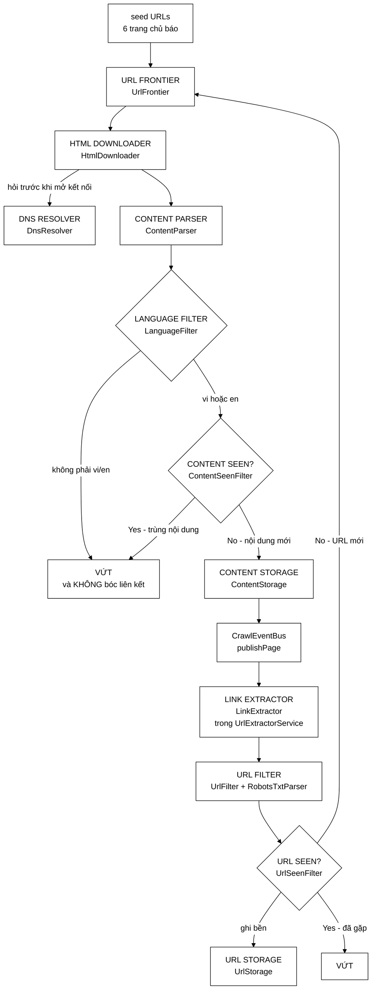

<details>
<summary><b>Xem bản chữ (ASCII)</b></summary>
```
  seed URLs
      │
      ▼
 URL Frontier ──► HTML Downloader ──► Content Parser ──► Language Filter ─(không vi/en)─► vứt
      ▲                  │                                      │
      │                  ▼                                      │ (vi hoặc en)
      │            DNS Resolver                                 ▼
      │                                              Content Seen? ──(Yes)──► vứt
      │                                                         │              KHÔNG bóc
      │                                                         │ (No)         liên kết
      │                                                         ▼
      │                                                  Content Storage
      │                                                         │
      │                                                         ▼
      │                                          CrawlEventBus.publishPage
      │                                                         │
      │                                                         ▼
      │                                                  Link Extractor
      │                                                         │
      │                                                         ▼
      │                                                     URL Filter
      │                                                         │
      │                                                         ▼
      └───────────────── (chưa gặp) ──────────────────── URL Seen? ◄──► URL Storage
                                                                │
                                                             (đã gặp) ──► vứt
```

</details>

> **Hai khối được thêm sau khi sơ đồ này được vẽ lần đầu**, và cả hai đều nằm ở
> chỗ có ý nghĩa chứ không phải nhét vào cho đủ:
>
> | Khối | Vì sao ở đúng chỗ đó | Dẫn chứng |
> |---|---|---|
> | `Language Filter` | Sau `Content Parser` vì nó cần văn bản đã bóc; **trước** `Content Seen?` vì trang ngoại ngữ không đáng tốn một lần băm SHA-256, và quan trọng hơn — nó **không bị bóc liên kết**, nên crawler không đi sâu thêm vào vùng ngoại ngữ | `CrawlerService.java:83-86`, `:617-623` |
> | `CrawlEventBus` | Ranh giới giữa crawler và cụm Modular Services. Phần **tải trang** cố ý ở lại phía crawler vì nó là thứ duy nhất phải tôn trọng politeness theo host | `CrawlerService.java:640-659` |

### Thứ tự các khối **không tuỳ tiện** — hai chỗ có lý do rất cụ thể

| Cặp khối | Vì sao khối này phải đứng trước khối kia | Dẫn chứng |
|---|---|---|
| `Content Seen?` **trước** `Link Extractor` | Trang trùng nội dung bị vứt mà **không** phải bóc liên kết — vì các liên kết đó đã lấy từ bản gốc rồi. Nếu gộp việc bóc liên kết vào `ContentParser` (như bản cũ), công đoạn này vẫn chạy cho cả những trang sắp bị vứt. | `CrawlerService.java:626-629`; `ContentParser.java:15-22` |
| `URL Filter` **trước** `URL Seen?` | Các luật rẻ (so sánh số nguyên, xét đuôi tệp) chạy trước phép tra bộ lọc Bloom. Mỗi trang sinh ~79 liên kết *(mốc A)*, **phần lớn bị loại ngay ở luật rẻ nhất**, nên không đáng để tra Bloom Filter cho chúng. | `CrawlerService.java:703-711`; `UrlFilter.java:29-32` |
| **`Language Filter` trước `Content Seen?`** | Hai lẽ: nó chỉ cần văn bản đã bóc (không cần vân tay), và trang ngoại ngữ bị vứt ở đó thì **không bóc liên kết** — nếu vẫn bóc, crawler tiếp tục đi sâu vào vùng ngoại ngữ để rồi vứt tiếp. | `CrawlerService.java:83-86` |
| **`Language Filter` trước cả pipeline: `UrlFilter` chặn theo tiền tố host** | Tuyến phòng thủ **thứ nhất**, rẻ hơn hẳn: loại URL **trước khi tải**, chỉ bằng vài phép so chuỗi. `LanguageFilter` là tuyến thứ hai, bắt được thứ tuyến một bỏ sót nhưng phải trả giá bằng một lượt tải trang. | `UrlFilter.java:62-66`, `:107-118` |

### Hai mức chống trùng — rất dễ nhầm là một

Đây là chỗ nhiều người hiểu sai nhất khi đọc sơ đồ crawler:
```
┌────────────────────┬──────────────────────────┬──────────────────────────┐
│                    │  UrlSeenFilter           │  ContentSeenFilter       │
├────────────────────┼──────────────────────────┼──────────────────────────┤
│ Chặn cái gì?       │  cùng một ĐỊA CHỈ        │  cùng một NỘI DUNG       │
│ Bảo vệ cái gì?     │  băng thông              │  chất lượng chỉ mục      │
│ Cấu trúc dùng      │  Bloom Filter (xấp xỉ)   │  Set vân tay (chính xác) │
│ Ví dụ nó bắt được  │  cùng link xuất hiện 2   │  1 bài báo nằm ở 2       │
│                    │  lần trong 1 trang       │  chuyên mục khác nhau    │
└────────────────────┴──────────────────────────┴──────────────────────────┘
```

Thiếu mức thứ hai thì các bản sao **cùng lọt vào chỉ mục, cùng hiện trong một trang kết quả**, và còn làm nhiễu PageRank (một bài bị đếm như nhiều trang độc lập).

### Ba tuyến chặn SSRF — một sơ đồ mà bản trước của trang này không có

Crawler là một cỗ máy **tải URL tuỳ ý do người ngoài đưa vào**. Đó đúng là định
nghĩa của một lỗ hổng SSRF nếu không có gì chặn. Ba tuyến phòng thủ nằm ở ba lớp
khác nhau, và **mỗi tuyến bịt một đường vào riêng**:

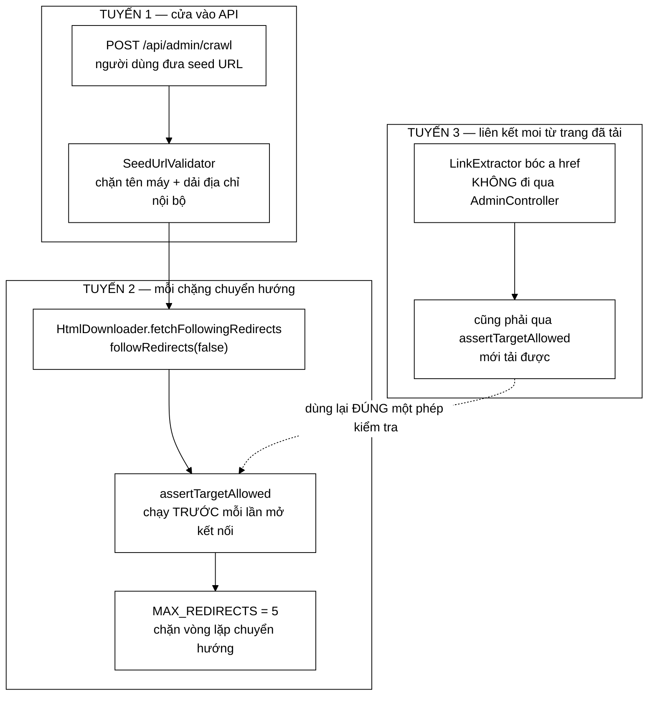

<details>
<summary><b>Xem bản chữ (ASCII)</b></summary>

```
 ĐƯỜNG VÀO 1: seed do người dùng đưa
   POST /api/admin/crawl
        │
        ▼
   SeedUrlValidator.isBlockedHostname / isBlockedAddress     ← TUYẾN 1
        │
        ▼
 ĐƯỜNG VÀO 2: chuyển hướng HTTP 3xx
   Jsoup followRedirects(false) — TỰ đi từng chặng
        │
        ├─► assertTargetAllowed  (chặng 1)                   ← TUYẾN 2
        ├─► assertTargetAllowed  (chặng 2)
        ├─► ...
        └─► MAX_REDIRECTS = 5 thì dừng hẳn

 ĐƯỜNG VÀO 3: liên kết moi ra từ trang đã tải
   LinkExtractor → KHÔNG đi qua AdminController
        │
        └─► vẫn phải qua assertTargetAllowed mới tải được    ← TUYẾN 3
             (dùng lại ĐÚNG phép kiểm tra của tuyến 1)
```

</details>

| Tuyến | Chặn đường vào nào | Dòng mã |
|---|---|---|
| 1 | Seed do người dùng đưa qua REST API | `SeedUrlValidator.isBlockedHostname` / `isBlockedAddress` |
| 2 | **Chuyển hướng HTTP** — trước đây Jsoup tự đi, không ai kiểm tra | `HtmlDownloader.java:161-167`, `:194-224` |
| 3 | **Liên kết moi từ trang đã tải** — không đi qua API nên chưa từng được kiểm tra | `HtmlDownloader.java:145-148` |

**Điểm thiết kế đáng học nhất ở đây** — `HtmlDownloader.java:188-192`:

> Dùng lại đúng phép kiểm tra của `SeedUrlValidator` thay vì viết bản thứ hai:
> **hai cài đặt song song của cùng một quy tắc bảo mật thì sớm muộn cũng lệch
> nhau, và bản bị quên cập nhật chính là lỗ hổng.**

Và một chi tiết tinh tế: `BlockedTargetException` là **kiểu riêng**, không phải
`IOException` chung (`:233-237`). Lý do ở `:104-106`: lỗi mạng thì đáng thử lại,
còn **địa chỉ nội bộ thì thử lại bao nhiêu lần cũng vẫn là địa chỉ nội bộ** — và
mỗi lần thử lại là thêm một lần chạm vào hạ tầng nội bộ.

---

## 3. Ai gọi ai — đồ thị phụ thuộc

Mũi tên `A → B` đọc là **"A dùng B"**. Tôi tách thành hai sơ đồ cho dễ nhìn.

### 3.1 Bức tranh tổng thể

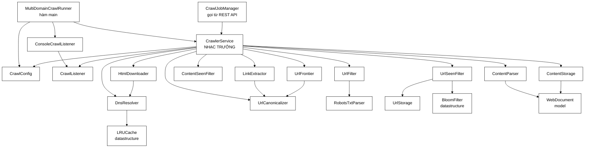

<details>
<summary><b>Xem bản chữ (ASCII)</b></summary>
```
MultiDomainCrawlRunner ─┐
                        ├──► CrawlerService ──┬──► UrlFrontier ──► UrlCanonicalizer
CrawlJobManager ────────┘         │           ├──► HtmlDownloader ──► DnsResolver ──► LRUCache
                                  │           ├──► ContentParser ──► WebDocument
                                  ├──► CrawlConfig
                                  │           ├──► ContentSeenFilter
                                  ├──► CrawlListener        (◄── ConsoleCrawlListener)
                                              ├──► ContentStorage ──► WebDocument
                                              ├──► LinkExtractor ──► UrlCanonicalizer
                                              ├──► UrlFilter ──► RobotsTxtParser
                                              └──► UrlSeenFilter ─┬─► BloomFilter
                                                                  └─► UrlStorage
```

</details>

**Ba điều đọc được từ sơ đồ này:**

1. **`CrawlerService` là trung tâm hình sao.** Nó nối 10 khối lại nhưng bản thân **không tự tải, không tự lọc, không tự lưu**. Cả lớp chỉ 408 dòng, mà phần lớn là Javadoc giải thích.
2. **Ba cấu trúc dữ liệu tự cài được tái sử dụng** — `BloomFilter`, `LRUCache`, `MinHeap` (ba ô ghi chú `datastructure` ở cuối sơ đồ). Đáng chú ý nhất là `LRUCache` — vốn viết cho cache kết quả tìm kiếm, nay dùng lại làm cache DNS. Đó là bằng chứng nó đủ tổng quát, chứ không phải viết riêng cho một chỗ.
3. **`UrlCanonicalizer` được gọi từ ba nơi** (`LinkExtractor`, `UrlFrontier`, `CrawlerService.seed`). Nó là `static` thuần — tức nó là một **hàm**, không phải một **đối tượng có trạng thái**. Gọi bao nhiêu lần cũng cho cùng kết quả (idempotent).

### 3.2 Riêng cụm Frontier — 9 file

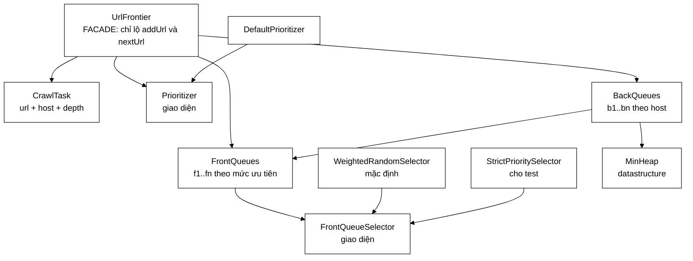

<details>
<summary><b>Xem bản chữ (ASCII)</b></summary>
```
UrlFrontier (Facade)
   ├──► CrawlTask
   ├──► Prioritizer  ◄── DefaultPrioritizer
   ├──► FrontQueues ──► FrontQueueSelector ◄─┬── WeightedRandomSelector (mặc định)
   │                                          └── StrictPrioritySelector (test)
   └──► BackQueues ──┬──► MinHeap
                     └──► FrontQueues   (kéo URL lên khi hàng đợi sau cạn)
```

</details>

Hai ô ghi *"giao diện"* — `Prioritizer` và `FrontQueueSelector` — chính là hai **Strategy**: hai trục có thể thay chính sách mà không đụng vào `UrlFrontier`. Đây là chỗ đồ án ghi điểm về thiết kế.

---

## 4. Vòng đời của một URL — nó phải qua bao nhiêu cửa?

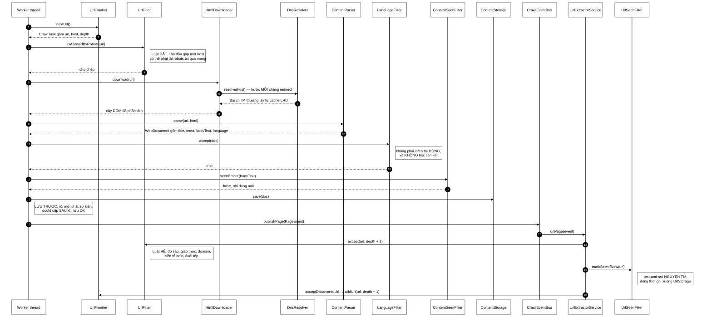

<details>
<summary><b>Xem bản chữ (ASCII)</b></summary>
```
Worker                                                          Kết quả
  │
  ├─1─► UrlFrontier.nextUrl()                        ──► CrawlTask{url, host, depth}
  ├─2─► UrlFilter.isAllowedByRobots(url)             ──► cho phép / cấm  [ĐẮT: chạm mạng]
  ├─3─► HtmlDownloader.download(url)
  │        └──► DnsResolver.resolve(host)            ──► IP, trước MỖI chặng redirect
  │                                                  ──► cây DOM
  ├─4─► ContentParser.parse(url, html)               ──► WebDocument{title, meta, body, lang}
  ├─5─► LanguageFilter.accept(doc)                   ──► không vi/en ⇒ DỪNG, KHÔNG bóc link
  ├─6─► ContentSeenFilter.seenBefore(body)           ──► trùng? nếu trùng thì DỪNG TẠI ĐÂY
  ├─7─► ContentStorage.save(doc)                     ──► docId cấp SAU khi lưu OK
  ├─8─► CrawlEventBus.publishPage(PageEvent)         ──► RANH GIỚI crawler / Modular Services
  │
  └─9─► UrlExtractorService nhận sự kiện, với MỖI outlink:
           UrlFilter.accept(url, depth+1)            [RẺ: không chạm mạng]
           UrlSeenFilter.markSeenIfNew(url)          [nguyên tử + ghi UrlStorage]
           acceptDiscoveredUrl ─► UrlFrontier.addUrl(url, depth+1)
```

</details>

> ⚠️ **Hai chỗ bản trước của sơ đồ này vẽ sai**, đều kiểm chứng được bằng thứ tự dòng mã:
>
> | Sai ở đâu | Bản trước vẽ | Code thật |
> |---|---|---|
> | Thứ tự bóc liên kết và lưu | `LinkExtractor.extract` **rồi mới** `ContentStorage.save` | `save` ở `:631`, phát sự kiện ở `:660`, bóc liên kết diễn ra **sau đó** — **lưu trước, bóc sau** |
> | Ai bóc liên kết | Worker gọi thẳng `LinkExtractor` | Worker chỉ `publishPage`; `UrlExtractorService` mới là bên bóc (`:302-303`) |
>
> Thứ tự "lưu trước, phát sau" **không tuỳ tiện**: `acceptOutlinks` (`:351-361`)
> phải tìm được tài liệu trong `ContentStorage` để ghi outlinks vào. Phát sự kiện
> trước khi lưu thì mọi outlink đều thành `orphanOutlinks` — và bộ đếm ở `:174`
> sinh ra chính là để bắt ca đó.

### Bảng 8 cửa — một liên kết phải qua hết mới được tải

| # | Cửa | Lớp | Chi phí | Nó loại bỏ điều gì |
|---|---|---|---|---|
| 1 | Bóc + chuẩn hoá | `LinkExtractor` → `UrlCanonicalizer` | O(1) | `mailto:`, `javascript:`, link neo trong trang, link trùng trong cùng một trang |
| 2 | Lọc rẻ | `UrlFilter.accept` | vài phép so sánh | quá sâu, sai giao thức, ngoài domain, đuôi `.jpg` `.pdf` `.zip`… |
| 3 | Đã gặp chưa | `UrlSeenFilter.markSeenIfNew` | O(k) phép băm | URL đã từng được xếp hàng |
| 4 | Xếp hàng | `UrlFrontier.addUrl` | **O(1)** | trùng chính xác, hoặc frontier đã đầy |
| 5 | Chờ tới lượt | `BackQueues.poll` | **O(log n)** | *(không loại — chỉ trì hoãn: 1 giây/host)* |
| 6 | Lọc đắt | `UrlFilter.isAllowedByRobots` | 1 lần tải mạng cho mỗi host | đường dẫn bị `robots.txt` cấm |
| 7 | DNS | `DnsResolver` | O(1) khi trúng cache | host không phân giải được |
| 8 | Trùng nội dung | `ContentSeenFilter` | O(độ dài văn bản) | trang khác URL nhưng cùng nội dung |

> **Vì sao cửa số 6 (robots) lại nằm sau cửa số 4 (xếp hàng)?** Vì nó là luật duy nhất **chạm mạng**. Mỗi trang sinh ~79 liên kết; nếu kiểm tra robots ngay lúc bóc link, ta sẽ tra robots cho cả những link bị loại ngay ở cửa số 2. Nên `UrlFilter` cố tình có **hai** phương thức công khai chứ không phải một.

### 4.1 Phóng to mũi tên `seed URLs → URL Frontier`

Trong sơ đồ kiến trúc gốc, `URL Frontier` có **hai** mũi tên đi vào, và chúng đi qua những file hoàn toàn khác nhau:

| Mũi tên | Chạy khi nào | Bao nhiêu lần | Luồng nào |
|---|---|---|---|
| `seed URLs → URL Frontier` | **một lần**, lúc mở phiên crawl | bằng số seed (6) | luồng gọi `crawl()`, chưa có worker nào |
| `URL Seen? → URL Frontier` | trong suốt phiên crawl | ~79 lần mỗi trang tải về | mọi worker thread |

Phần dưới đây phóng to **mũi tên thứ nhất** — mọi thứ xảy ra **trước** khi `UrlFrontier.addUrl` được gọi lần đầu tiên.

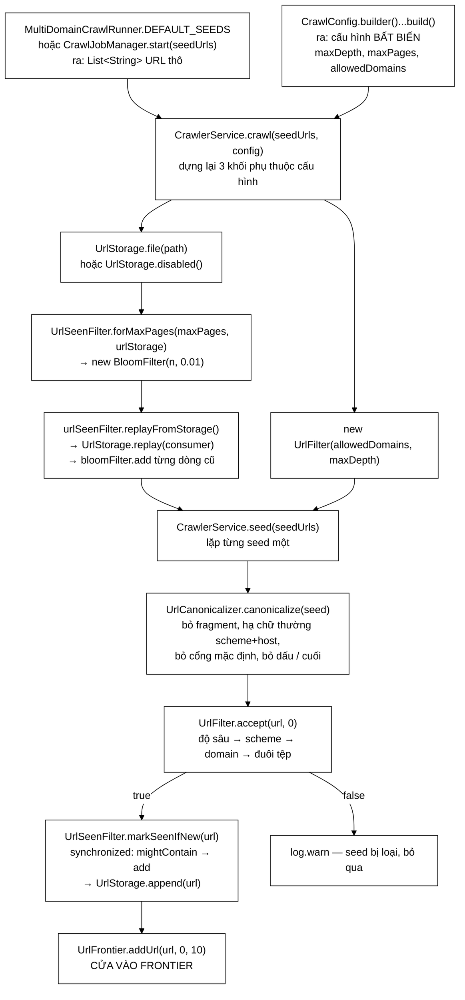

<details>
<summary><b>Xem bản chữ (ASCII)</b></summary>
```
MultiDomainCrawlRunner.DEFAULT_SEEDS ──┐
CrawlJobManager.start(seedUrls) ───────┤  List<String> URL thô
CrawlConfig.builder()...build() ───────┘  cấu hình bất biến
                    │
                    ▼
   CrawlerService.crawl(seedUrls, config)
                    │
                    ├─► UrlStorage.file(path) | disabled()
                    ├─► new UrlFilter(allowedDomains, maxDepth)
                    ├─► UrlSeenFilter.forMaxPages(maxPages, urlStorage) ─► new BloomFilter(n, 0.01)
                    ├─► urlSeenFilter.replayFromStorage() ─► UrlStorage.replay ─► bloomFilter.add
                    │
                    ▼
   CrawlerService.seed(seedUrls)          với MỖI seed:
                    │
                    ├─1─► UrlCanonicalizer.canonicalize(seed)  ──► String url chuẩn
                    ├─2─► UrlFilter.accept(url, 0)             ──► false ⇒ log.warn, BỎ QUA
                    ├─3─► UrlSeenFilter.markSeenIfNew(url)     ──► ghi Bloom + UrlStorage.append
                    │                                              (kết quả trả về bị CỐ Ý bỏ qua)
                    └─4─► UrlFrontier.addUrl(url, 0, 10)       ──► true nếu vào được hàng đợi
```

</details>

#### Bảng: hàm nào cho ra kết quả gì để hàm sau dùng

| # | Hàm | File | Nhận vào | Trả ra / để lại | Ai dùng kết quả đó |
|---|---|---|---|---|---|
| 0 | `DEFAULT_SEEDS` / `start(...)` | `MultiDomainCrawlRunner`, `CrawlJobManager` | — | `List<String>` URL thô | `CrawlerService.crawl` |
| 0 | `Builder.build()` | `CrawlConfig` | tham số dòng lệnh | cấu hình bất biến, đã kiểm tra | `crawl` dùng `maxDepth`, `maxPages`, `allowedDomains` |
| 1 | `crawl(seeds, config)` | `CrawlerService` | 2 cái trên | dựng `urlStorage`, `urlFilter`, `urlSeenFilter` | chính `seed()` ngay sau đó |
| 2 | `replayFromStorage()` | `UrlSeenFilter` → `UrlStorage.replay` | file `.txt` phiên trước | số URL đã nạp; **Bloom đã đầy lại** | `markSeenIfNew` của phiên này |
| 3 | `canonicalize(seed)` | `UrlCanonicalizer` | `"https://VNExpress.net/"` | `"https://vnexpress.net"` | cả ba bước 4-5-6 đều nhận **chuỗi này** |
| 4 | `accept(url, 0)` | `UrlFilter` | url chuẩn + `depth = 0` | `boolean` + tăng bộ đếm loại | `seed()` — `false` thì `continue` |
| 5 | `markSeenIfNew(url)` | `UrlSeenFilter` | url chuẩn | `boolean` (**bị bỏ qua**) + ghi Bloom + `UrlStorage.append` | các lần `enqueue` sau này, và phiên crawl sau |
| 6 | `addUrl(url, 0, 10)` | `UrlFrontier` | url chuẩn, `depth = 0`, `knownBacklinks = 10` | `boolean` — đã vào frontier | `nextUrl()` của worker |

#### Bốn chi tiết chỉ đúng ở chặng seed

1. **Seed cố ý bỏ qua kết quả của `markSeenIfNew`.** Ở `enqueue()` thì `false` nghĩa là dừng, nhưng ở `seed()` giá trị trả về không được xét — chỉ gọi để **ghi nhận**. Lý do: khi tiếp tục một phiên crawl cũ, `replayFromStorage()` vừa nạp lại chính các seed đó vào Bloom, nên nếu tôn trọng kết quả thì frontier rỗng ngay từ đầu và phiên crawl kết thúc mà không làm gì.
2. **`depth = 0` và `knownBacklinks = 10`.** Hằng `SEED_BACKLINK_SCORE = 10` trong `CrawlerService`, so với `1` mà mọi outlink nhận được. Hai con số này đi thẳng vào `DefaultPrioritizer.levelOf`, nên seed luôn nằm ở mức ưu tiên cao nhất — điều cần thiết vì frontier phải có việc để làm trước khi worker đầu tiên gọi `nextUrl()`.
3. **`canonicalize` chạy hai lần cho mỗi seed** — một lần trong `seed()`, một lần nữa bên trong `addUrl`. Không phải lỗi: phép chuẩn hoá là **idempotent**. `addUrl` cần nó vì đó là choke point duy nhất mà mọi URL (seed lẫn outlink) đều đi qua; còn `seed()` cũng cần nó vì `UrlFilter.accept` phải nhận chuỗi **đã chuẩn hoá** thì mới rút host đúng.
4. **`robots.txt` KHÔNG được hỏi ở đây.** `seed()` chỉ gọi `accept` (luật rẻ, không chạm mạng). `isAllowedByRobots` chờ tới `workerLoop`, sau khi URL đã ra khỏi frontier — nên một seed bị `robots.txt` cấm vẫn vào được hàng đợi rồi mới bị loại.

> **Không có mặt ở chặng này:** `HtmlDownloader`, `DnsResolver`, `ContentParser`, `ContentSeenFilter`, `ContentStorage`, `LinkExtractor`, `RobotsTxtParser`. Toàn bộ nửa phải của sơ đồ kiến trúc chỉ bắt đầu chạy sau khi worker đầu tiên lấy được một `CrawlTask` ra khỏi frontier.

---

## 5. Đi sâu nhóm 2 — Frontier hai tầng

Đây là phần phức tạp nhất (9 file), và cũng là phần thú vị nhất, vì nó hoà giải **hai yêu cầu xung đột nhau**.

### 5.1 Vấn đề: hai yêu cầu cãi nhau
```
┌───────────────────────────────────────────────────────────────────┐
│  ƯU TIÊN  muốn:  "lấy URL TỐT NHẤT trước, bất kể nó thuộc host nào" │
│  LỊCH SỰ  cấm :  "không chạm cùng một host 2 lần trong 1 giây,      │
│                   bất kể URL đó tốt tới đâu"                       │
└───────────────────────────────────────────────────────────────────┘
                                 ▼
              Nhét chung vào MỘT cấu trúc  →  một bên phải nhường
                                 ▼
              Tách làm HAI TẦNG:
                 • tầng trước  KHÔNG BIẾT GÌ về host
                 • tầng sau    KHÔNG BIẾT GÌ về ưu tiên
              → mỗi tầng làm đúng một việc, và làm trọn vẹn
```

### 5.2 Bên trong `UrlFrontier`

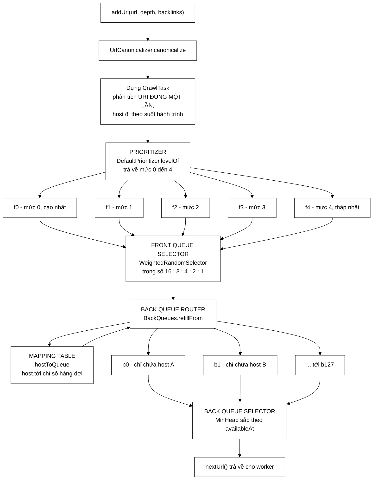

<details>
<summary><b>Xem bản chữ (ASCII)</b></summary>
```
   URL vào
      │
      ▼
  Prioritizer  ───►  f0  f1  f2  f3  f4      ← TẦNG TRƯỚC: xếp theo MỨC ƯU TIÊN
                     (không biết gì về host)
                              │
                              ▼
                     Front queue selector     ← bốc ngẫu nhiên có trọng số 16:8:4:2:1
                              │
                              ▼
                     Back queue router  ◄──►  Mapping Table (host → chỉ số hàng đợi)
                              │
                              ▼
                     b0  b1  b2 ... b127      ← TẦNG SAU: mỗi hàng đợi ĐÚNG MỘT HOST
                     (không biết gì về ưu tiên)
                              │
                              ▼
                     Back queue selector       ← MinHeap theo "khi nào được phép lấy tiếp"
                              │
                              ▼
                       worker threads
```

</details>

### 5.3 Bảng ánh xạ: khối trong sơ đồ → file nào cài

| Khối | File | Ghi chú quan trọng |
|---|---|---|
| Prioritizer | `Prioritizer.java` *(giao diện)* | mặc định là `DefaultPrioritizer.java` |
| `f1..fn` | `FrontQueues.java` | **một hàng đợi = một mức ưu tiên**, trong mức là FIFO thuần |
| Front queue selector | `FrontQueueSelector.java` *(giao diện)* | `WeightedRandomSelector` (chạy thật) / `StrictPrioritySelector` (test) |
| Back queue router | `BackQueues.refillFrom()` | nạp lại **khi cạn**, không định tuyến lúc thêm |
| Mapping Table | `BackQueues.hostToQueue` | tối đa 128 mục, **không bao giờ phình** |
| `b1..bn` | `BackQueues.queues` + `boundHost` | bất biến: mỗi hàng đợi **đúng một host** |
| Back queue selector | `BackQueues.poll()` + `MinHeap` | O(log n), thay cho quét O(D) của bản cũ |
| Vỏ ngoài, khoá, thống kê | `UrlFrontier.java` *(Facade)* | công khai đúng **hai** thao tác |

### 5.4 Ba quyết định thiết kế — mỗi cái sửa một lỗi cụ thể

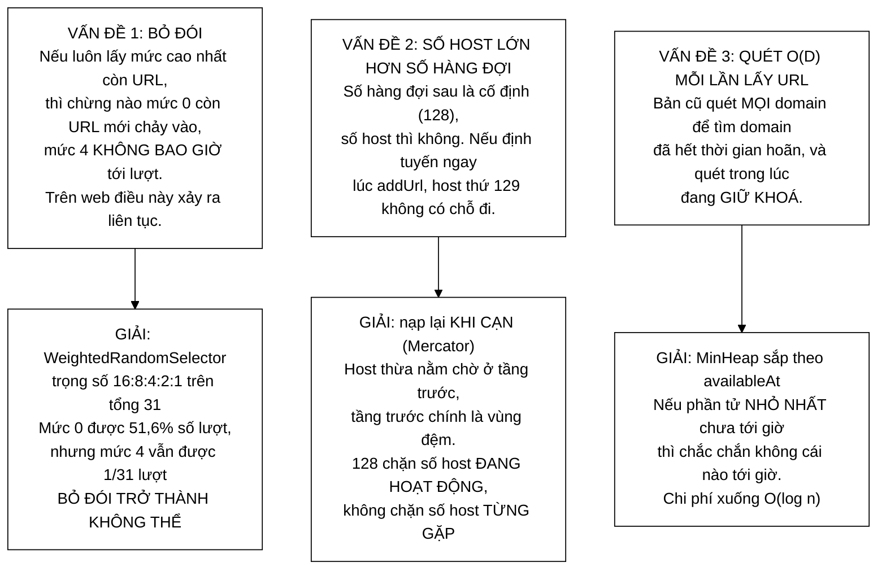

<details>
<summary><b>Xem bản chữ (ASCII)</b></summary>
```
VẤN ĐỀ 1  bỏ đói mức thấp          ──►  GIẢI  WeightedRandomSelector 16:8:4:2:1
VẤN ĐỀ 2  host nhiều hơn hàng đợi  ──►  GIẢI  nạp lại khi cạn (Mercator)
VẤN ĐỀ 3  quét O(D) trong lúc giữ khoá ──► GIẢI  MinHeap theo availableAt, O(log n)
```

</details>

#### Bảng xác suất của `WeightedRandomSelector`

Mức `i` có trọng số $2^{n-1-i}$. Với 5 mức: `16, 8, 4, 2, 1`, tổng `31`.

| Mức | 0 | 1 | 2 | 3 | 4 |
|---|---|---|---|---|---|
| Trọng số | 16 | 8 | 4 | 2 | 1 |
| Xác suất được chọn | **51,6 %** | 25,8 % | 12,9 % | 6,5 % | **3,2 %** |

Mức cao vẫn được ưu ái rõ rệt (một nửa số lượt), nhưng mức thấp nhất vẫn nhận được khoảng **1 trên 31 lượt** — đó chính là tính chất mà bộ chọn tất định không thể có.

*Chi tiết nhỏ nhưng quan trọng:* trọng số chỉ được tính trên các hàng đợi **không rỗng**. Nếu tính cả hàng đợi rỗng, phần trọng số của chúng biến thành "lượt trống" và bộ chọn phải bốc lại nhiều lần.

### 5.5 Chạy tay một ví dụ — hiểu là hiểu ở đây

Cho `BackQueues` có **3 hàng đợi**, politeness **1000 ms**, dùng `StrictPrioritySelector` cho dễ theo dõi. Thêm 4 URL:

| URL | depth | host | Mức, theo `DefaultPrioritizer` |
|---|---|---|---|
| `u1 = a.vn/1` | 1 | `a.vn` | `1 − 1` (vì đuôi `.vn`) = **0** |
| `u2 = a.vn/2` | 1 | `a.vn` | **0** |
| `u3 = b.com/1` | 1 | `b.com` | **1** |
| `u4 = c.com/1` | 2 | `c.com` | **2** |

**Trạng thái tầng trước sau khi thêm:**
```
f0 = [u1, u2]      f1 = [u3]      f2 = [u4]      f3 = []      f4 = []
```

**Gọi `nextUrl()` lần đầu — `refillFrom()` chạy trước:**
```
slot 0 đang rỗng → kéo u1 (host a.vn)
                   chưa host nào có chủ → GẮN slot 0 cho a.vn, đẩy u1 vào b0   ✓

slot 1 đang rỗng → kéo u2 (host a.vn)
                   a.vn ĐÃ có chủ là slot 0 → đẩy u2 vào b0, rồi KÉO TIẾP
                 → kéo u3 (host b.com)
                   chưa có chủ → GẮN slot 1 cho b.com, đẩy u3 vào b1           ✓

slot 2 đang rỗng → kéo u4 (host c.com)
                   chưa có chủ → GẮN slot 2 cho c.com, đẩy u4 vào b2           ✓

tầng trước đã cạn → dừng nạp

KẾT QUẢ:
   b0 = [u1, u2]   host = a.vn    availableAt = 0
   b1 = [u3]       host = b.com   availableAt = 0
   b2 = [u4]       host = c.com   availableAt = 0
   MinHeap "ready" = {0, 1, 2}    ← cùng availableAt, khoá phụ là chỉ số hàng đợi
```

> **Điểm mấu chốt ở slot 1:** URL bị kéo lên mà host của nó **đã có chủ** thì được đẩy thẳng vào hàng đợi của chủ đó rồi **kéo tiếp** — nó không bị trả ngược về tầng trước. Nhờ vậy không có URL nào bị lặp vòng vô tận.

**Bốn lần `poll()` tiếp theo** (gọi T là thời điểm hiện tại):

| Lần | Heap chọn slot nào | Trả về | `availableAt` sau đó | Hàng đợi ra sao |
|---|---|---|---|---|
| 1 — tại T | slot 0 | `u1` | `b0 → T+1000` | b0 còn `u2` → **chèn lại vào heap** |
| 2 — tại T+1ms | slot 1 *(vì 0 nhỏ hơn T+1000)* | `u3` | `b1 → T+1001` | b1 cạn → **đánh dấu rỗng**, ra khỏi heap |
| 3 — tại T+2ms | slot 2 | `u4` | `b2 → T+1002` | b2 cạn → đánh dấu rỗng |
| 4 — tại T+3ms | slot 0, nhưng `T+1000 > T+3` | **`null`** | — | ngủ `min(50, 997)` = **50 ms**, ngủ **ngoài** khối khoá |

**Hai chi tiết tinh tế trong bảng trên:**

1. **Vì sao lần 4 ngủ 50 ms chứ không ngủ đủ 997 ms?** Vì trong lúc ngủ, một worker khác có thể **thêm URL mới** vào frontier. Trần 50 ms bảo đảm luồng thức dậy đủ sớm để thấy URL mới đó. Và việc ngủ diễn ra **ngoài** khối `synchronized`, để không chặn các luồng đang muốn `addUrl`.

2. **Vì sao lần 2, khi `b1` cạn, ta KHÔNG huỷ liên kết `b1 ↔ b.com`?** Vì `availableAt` của hàng đợi đó chính là **đồng hồ lịch sự** của `b.com`. Huỷ liên kết là mất đồng hồ, và một URL mới của chính `b.com` có thể được tải **ngay tức thì** — vi phạm đúng cái thứ mà cả tầng này sinh ra để bảo vệ. Hàng đợi cạn chỉ **rời khỏi heap** và vào danh sách chờ nạp, chứ vẫn giữ nguyên host.

### 5.6 `DefaultPrioritizer` — vì sao đếm theo BẬC chứ không cộng ĐIỂM
```
   level = depth                                  ← gốc là độ sâu BFS
   level = level − 1   nếu host kết thúc bằng .vn  (yêu cầu đề bài)
   level = level − 1   nếu knownBacklinks >= 5     (trang được trỏ tới nhiều)
   level = kẹp vào khoảng [0, 4]
```

Bản trước cộng các trọng số `double` tuỳ chọn: `−2·depth + 0,5·backlinks + 5`. Cách đó có **hai vấn đề**:

- phải giải thích ba hằng số ma thuật (`−2`, `0,5`, `5`) mà không có cơ sở nào;
- tệ hơn: nó cho phép backlink **lấn át hoàn toàn** độ sâu. `50 backlink = 25 điểm`, đủ để một trang sâu 12 lớp vượt lên trên cả seed.

Đếm theo bậc thì **mỗi tín hiệu chỉ đáng đúng một bậc** — giới hạn ảnh hưởng của nó ngay trong định nghĩa. Một trang sâu 5 lớp, dù có đuôi `.vn` **và** nhiều backlink, vẫn xếp sau một trang sâu 1 lớp.

---

## 6. Đi sâu nhóm 5 — dây chuyền lọc URL

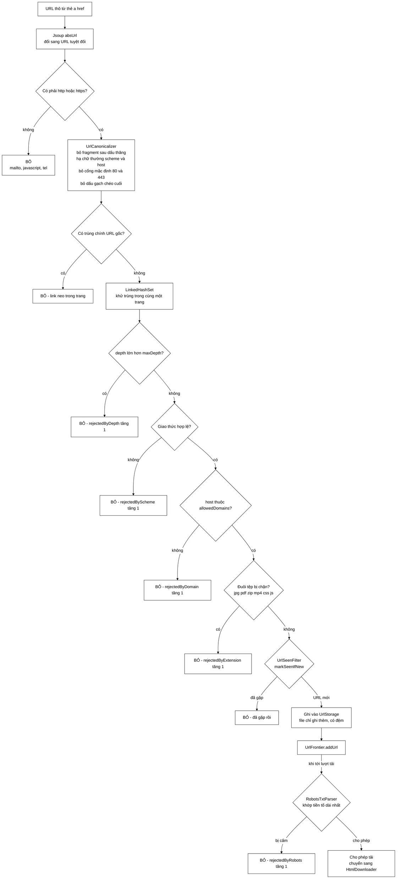

<details>
<summary><b>Xem bản chữ (ASCII)</b></summary>
```
URL thô  →  absUrl  →  http(s)?  ──không──►  BỎ (mailto:, javascript:)
                          │có
                          ▼
                    canonicalize  →  trùng URL gốc? ──có──► BỎ (link neo)
                          │không
                          ▼
                    LinkedHashSet (khử trùng trong trang)
                          │
    ┌─────────────────────┴─────────────── UrlFilter.accept (RẺ) ───────┐
    │  depth > maxDepth?      ──có──► BỎ, rejectedByDepth++             │
    │  giao thức hợp lệ?      ──ko──► BỎ, rejectedByScheme++            │
    │  host trong allowed?    ──ko──► BỎ, rejectedByDomain++            │
    │  đuôi tệp bị chặn?      ──có──► BỎ, rejectedByExtension++         │
    └─────────────────────┬─────────────────────────────────────────────┘
                          ▼
                UrlSeenFilter.markSeenIfNew ──đã gặp──► BỎ
                          │ URL mới
                          ▼
                    ghi UrlStorage  →  UrlFrontier.addUrl
                          │
                     (khi tới lượt tải)
                          ▼
              RobotsTxtParser (ĐẮT, chạm mạng) ──cấm──► BỎ, rejectedByRobots++
                          │ cho phép
                          ▼
                    HtmlDownloader
```

</details>

### 6.1 `UrlCanonicalizer` — vì sao chỉ làm 4 phép, không làm hơn

Bốn phép được áp dụng, tất cả đều **an toàn** theo RFC 3986, nghĩa là **không làm đổi trang được trỏ tới**:

| Phép | Ví dụ | Vì sao an toàn |
|---|---|---|
| Bỏ fragment `#...` | `a.com/x#muc2` → `a.com/x` | fragment chỉ có ý nghĩa phía trình duyệt, **không được gửi lên máy chủ** |
| Hạ chữ thường scheme + host | `HTTP://A.COM` → `http://a.com` | RFC quy định hai thành phần này **không phân biệt hoa thường** |
| Bỏ cổng mặc định | `a.com:443/x` → `a.com/x` | `:443` với https là mặc định, ghi hay không đều như nhau |
| Bỏ dấu `/` cuối | `a.com/x/` → `a.com/x` | và `a.com/` rút gọn hẳn thành `a.com` |

**Cố ý KHÔNG đụng tới query string.** Sắp xếp lại thứ tự tham số, hay bỏ tham số theo dõi `utm_*`, **có thể làm đổi trang trả về** — đó là phép chuẩn hoá *không an toàn*, nên không áp dụng.

> **Con số thật:** trong phiên crawl 5.011 trang đầu tiên, việc thiếu phép chuẩn hoá này tạo ra **23 cặp trang trùng nhau** chỉ khác đúng một dấu `/` ở cuối.

### 6.2 `UrlSeenFilter` + `UrlStorage` — cặp đôi làm nên tính bền
```
        ┌───────────────────── UrlSeenFilter.markSeenIfNew ─────────────────────┐
        │  synchronized {                                                        │
        │      if (bloom.mightContain(url)) return false;   ← HỎI "gặp chưa?"    │
        │      bloom.add(url);                              ← GHI NHẬN "đã gặp"  │
        │      urlStorage.append(url);                      ← GHI XUỐNG ĐĨA      │
        │  }                                                                     │
        └────────────────────────────────────────────────────────────────────────┘
                                        │
                                        ▼
                       data/seen-urls.txt   (mỗi dòng một URL)
                                        │
                     replayFromStorage() ở PHIÊN CRAWL SAU
                                        │
                                        ▼
                bộ lọc Bloom được dựng lại  →  không tải lại trang cũ
```

**Ba lý do khiến ba dòng lệnh trên phải nằm trong cùng một khối `synchronized`:**

1. **`BloomFilter` không thread-safe.** `add()` thực hiện `bits[i] |= mask` — một phép **đọc-sửa-ghi không nguyên tử** trên mảng `long[]`. Hai worker bật hai bit khác nhau nhưng nằm trong **cùng một phần tử mảng** có thể làm mất một trong hai phép ghi. Bit bị mất nghĩa là bộ lọc cho **false negative** — báo "chưa gặp" cho một URL đã gặp — và crawler tải lại trang cũ. Với Bloom Filter, false positive chỉ làm bỏ sót vài trang, nhưng false negative phá vỡ đúng tính chất mà Javadoc của nó khẳng định.

2. **Hỏi và ghi nhận phải nguyên tử.** Nếu tách rời, hai worker cùng bóc được một liên kết giống nhau đều thấy "chưa gặp" và **cùng** xếp URL đó vào hàng đợi.

3. **Ghi nhận phải xảy ra lúc XẾP HÀNG, không phải lúc lấy ra.** Ghi nhận muộn thì trong suốt khoảng thời gian URL nằm chờ trong frontier, nó vẫn bị coi là "chưa gặp".

**Vì sao lưu URL dạng văn bản, chứ không lưu thẳng mảng bit Bloom?** Vì kích thước bộ lọc được tính từ `maxPages` của phiên crawl. Phiên sau đổi `maxPages` là mảng bit cũ **không dùng lại được**. Lưu URL thì dựng lại được bộ lọc ở **bất kỳ** kích thước nào, lại còn đọc được bằng mắt khi cần gỡ lỗi.

**Đánh đổi đã biết:** file có đệm, **không** flush mỗi dòng. Mỗi trang sinh hơn 100 URL nên đây là đường đi nóng; flush từng dòng biến ghi đĩa thành nút thắt cổ chai. Cái giá là nếu tiến trình bị giết đột ngột thì phần đuôi trong bộ đệm mất — hậu quả chỉ là crawl lại vài trang ở phiên sau, hoàn toàn chấp nhận được.

---

## 7. Đa luồng — cái gì dùng chung, khoá đặt ở đâu

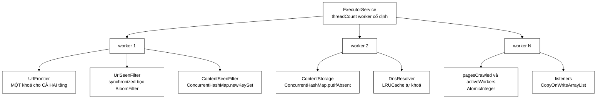

<details>
<summary><b>Xem bản chữ (ASCII)</b></summary>
```
ExecutorService (threadCount worker)
     ├── worker 1 ─┐
     ├── worker 2 ─┼──► TRẠNG THÁI DÙNG CHUNG:
     └── worker N ─┘        UrlFrontier          (một khoá cho cả hai tầng)
                            UrlSeenFilter        (synchronized bọc BloomFilter)
                            ContentSeenFilter    (ConcurrentHashMap.newKeySet)
                            ContentStorage       (putIfAbsent)
                            DnsResolver          (LRUCache tự khoá)
                            pagesCrawled/activeWorkers (AtomicInteger)
                            listeners            (CopyOnWriteArrayList)
```

</details>

| Lớp | Cách đồng bộ | Vì sao chọn đúng cách đó |
|---|---|---|
| `UrlFrontier` | **một** khối `synchronized` cho **cả hai** tầng | Hai tầng phải đổi trạng thái **cùng nhau** trong `nextUrl` (nạp lại tầng sau rồi mới lấy). Hai khoá riêng chỉ tạo thêm cơ hội đua mà **không** tăng thông lượng thật — vì bên trong khoá không có thao tác vào/ra nào. Riêng việc **ngủ** thì làm **ngoài** khoá. |
| `FrontQueues`, `BackQueues`, `MinHeap` | **không** tự đồng bộ | Cố ý. `UrlFrontier` đã bọc rồi; đồng bộ hai lần chỉ là chi phí thừa. Quy ước này được ghi rõ trong Javadoc của cả ba lớp. |
| `UrlSeenFilter` | `synchronized` | Bọc `BloomFilter` vốn không thread-safe, đồng thời làm test-and-set nguyên tử. |
| `ContentSeenFilter` | `ConcurrentHashMap.newKeySet()` | `Set.add` là nguyên tử và chỉ trả `true` cho **đúng một** luồng → hai bản sao cùng lúc thì chỉ một bản đi tiếp. |
| `ContentStorage` | `putIfAbsent` | Một URL chỉ có một bản ghi, kể cả khi `UrlSeenFilter` có sai sót. |
| `DnsResolver` | `LRUCache` tự khoá, nhưng cặp `get` → `put` **không** nguyên tử | **Đánh đổi có chủ ý.** Hậu quả xấu nhất là một truy vấn DNS thừa; còn khoá cả quá trình phân giải sẽ chặn **mọi** worker khác trong lúc chờ mạng. |
| `listeners` | `CopyOnWriteArrayList` | Được **đọc** từ nhiều worker nhưng **ghi** cực hiếm (chỉ lúc đăng ký) — đúng ca sử dụng mà cấu trúc này được thiết kế cho. |

### 7.1 Điều kiện dừng — phần tinh tế nhất của cả tầng crawler

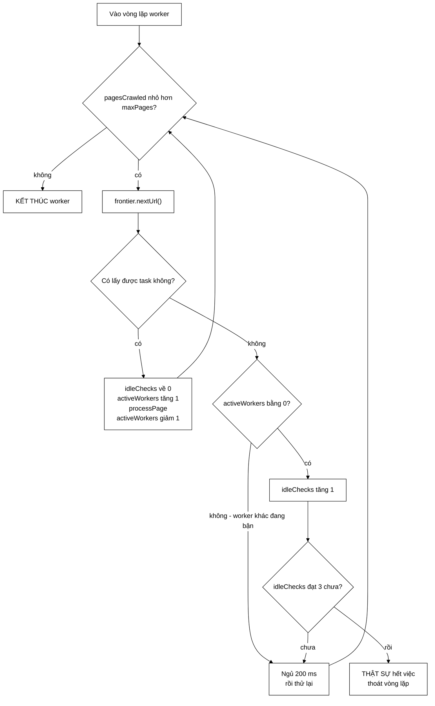

<details>
<summary><b>Xem bản chữ (ASCII)</b></summary>
```
while (pagesCrawled < maxPages) {
    task = frontier.nextUrl()

    nếu CÓ task:
        idleChecks = 0
        activeWorkers++ ; processPage(task) ; activeWorkers--   ← luôn trong finally
        tiếp tục vòng lặp

    nếu KHÔNG có task:
        nếu activeWorkers == 0:
            idleChecks++
            nếu idleChecks >= 3  →  THOÁT: thật sự hết việc
        ngủ 200 ms rồi thử lại
}
```

</details>

**Vì sao không đơn giản là "frontier rỗng thì dừng"?**

> Frontier rỗng **KHÔNG** đồng nghĩa với hết việc. Một worker khác có thể đang tải một trang và sắp thêm hàng trăm liên kết mới vào frontier ngay giây tới. Nếu thoát ngay khi thấy frontier rỗng, các worker sẽ **chết dần** trong những khoảng trống tạm thời, và phiên crawl dừng sớm hơn `maxPages` rất nhiều.

Điều kiện dừng đúng là `F = 0 VÀ A = 0` (frontier rỗng **và** không worker nào đang bận). Nhưng hai phép đọc đó **không nguyên tử với nhau**, nên tồn tại một cửa sổ đua: worker A thấy frontier rỗng đúng lúc worker B đã lấy được task nhưng **chưa kịp** tăng `activeWorkers`.

Cách xử lý: yêu cầu điều kiện dừng đúng **3 lần liên tiếp**, cách nhau 200 ms. Xác suất nhầm khi đó khoảng:

$$P(\text{nhầm}) \approx \left(\frac{\text{vài } \mu s}{200\,000\ \mu s}\right)^3 \approx 10^{-15}$$

> ⚠️ **Nói thẳng:** đây là một **heuristic**, không phải thuật toán đúng đắn có chứng minh. Bài toán "phát hiện kết thúc phân tán" có lời giải chính xác (Dijkstra–Scholten, Safra) nhưng phức tạp hơn nhiều. Xem [CrawlerService.md](CrawlerService.md) §3.

### 7.2 Ba chỗ `finally` bắt buộc — thiếu một là hỏng cả phiên

| Ở đâu | Nếu thiếu thì sao |
|---|---|
| `latch.countDown()` trong `runWorkers` | `await()` chờ đủ 60 phút một cách vô ích |
| `activeWorkers.decrementAndGet()` trong `workerLoop` | **Nặng nhất.** Nếu thân vòng lặp ném ngoại lệ mà không giảm, `activeWorkers` **không bao giờ về 0** → điều kiện dừng không bao giờ đúng → **mọi worker kẹt vĩnh viễn** trong vòng ngủ-thử-lại |
| `urlStorage.close()` trong `crawl` | Phần đuôi trong bộ đệm không bao giờ được ghi xuống đĩa khi phiên crawl kết thúc bất thường |

---

## 8. Design pattern dùng ở đâu, và giải quyết vấn đề gì

```mermaid
%%{init:{'theme':'base','themeVariables':{'background':'#ffffff','primaryColor':'#ffffff','primaryTextColor':'#000000','primaryBorderColor':'#000000','secondaryColor':'#ffffff','secondaryTextColor':'#000000','secondaryBorderColor':'#000000','tertiaryColor':'#ffffff','tertiaryTextColor':'#000000','tertiaryBorderColor':'#000000','lineColor':'#000000','textColor':'#000000','mainBkg':'#ffffff','nodeBorder':'#000000','clusterBkg':'#ffffff','clusterBorder':'#000000','edgeLabelBackground':'#ffffff','actorBkg':'#ffffff','actorBorder':'#000000','actorTextColor':'#000000','actorLineColor':'#000000','signalColor':'#000000','signalTextColor':'#000000','labelBoxBkgColor':'#ffffff','labelBoxBorderColor':'#000000','labelTextColor':'#000000','loopTextColor':'#000000','noteBkgColor':'#ffffff','noteBorderColor':'#000000','noteTextColor':'#000000','sequenceNumberColor':'#ffffff','fontFamily':'ui-monospace, SFMono-Regular, Consolas, monospace'}}}%%

flowchart TD
    ROOT["DESIGN PATTERN<br/>trong tầng crawler"]

    P1["STRATEGY - 3 chỗ"]
    P2["FACADE"]
    P3["OBSERVER"]
    P4["BUILDER"]
    P5["NULL OBJECT"]

    P1A["Prioritizer<br/>đổi chính sách ưu tiên"]
    P1B["FrontQueueSelector<br/>đổi chính sách chống bỏ đói"]
    P1C["CrawlListener<br/>đổi cách theo dõi tiến độ"]

    P2A["UrlFrontier bọc 8 lớp,<br/>chỉ lộ ra addUrl và nextUrl"]
    P3A["CrawlerService phát sự kiện,<br/>ai quan tâm thì tự đăng ký"]
    P4A["CrawlConfig bất biến,<br/>mọi kiểm tra nằm trong build()"]
    P5A["UrlStorage.disabled()<br/>mọi thao tác thành lệnh rỗng"]

    ROOT --> P1
    ROOT --> P2
    ROOT --> P3
    ROOT --> P4
    ROOT --> P5
    P1 --> P1A
    P1 --> P1B
    P1 --> P1C
    P2 --> P2A
    P3 --> P3A
    P4 --> P4A
    P5 --> P5A
```

<details>
<summary><b>Xem bản chữ (ASCII)</b></summary>
```
STRATEGY     ├─ Prioritizer          → đổi chính sách ưu tiên
             ├─ FrontQueueSelector   → đổi chính sách chống bỏ đói
             └─ CrawlListener        → đổi cách theo dõi tiến độ
FACADE       └─ UrlFrontier          → bọc 8 lớp, lộ ra 2 thao tác
OBSERVER     └─ CrawlListener        → phát sự kiện, ai quan tâm tự đăng ký
BUILDER      └─ CrawlConfig          → bất biến, kiểm tra tập trung trong build()
NULL OBJECT  └─ UrlStorage.disabled()→ mọi thao tác ghi thành lệnh rỗng
```

</details>

### `CrawlConfig` — vì sao Builder chứ không phải setter

```java
// ===== BẢN CŨ: hỏng ở chỗ cách xa nguyên nhân =====
CrawlConfig cfg = new CrawlConfig().maxPages(5000);
crawler.crawl(seeds, cfg);
cfg.maxPages = -1;                    // sửa GIỮA phiên crawl, không ai chặn

new CrawlConfig().threadCount(0);     // hợp lệ! rồi newFixedThreadPool(0) ném
                                      // ngoại lệ khó hiểu ở GIỮA phiên crawl,
                                      // cách xa chỗ đặt sai cấu hình

// ===== BẢN NÀY: bất biến, mọi kiểm tra nằm trong build() =====
CrawlConfig config = CrawlConfig.builder()
        .maxDepth(3)
        .maxPages(5000)
        .threadCount(12)
        .allowedDomains(domains)
        .maxDurationMinutes(90)
        .build();                     // ← cấu hình sai bị bắt NGAY TẠI ĐÂY
```

Bất biến còn cho một lợi ích nữa về đồng thời: **12 worker cùng đọc cấu hình này mà không cần `volatile` hay đồng bộ gì cả.**

### `CrawlListener` — vì sao Observer chứ không `System.out.printf`

Bản cũ chôn thẳng dòng in vào vòng lặp worker. Hậu quả: **không tắt được khi chạy test** (spam output), **không đẩy được lên WebSocket** cho UI theo dõi thời gian thực, **không ghi ra file** để phân tích sau, và **không đo được** (chỉ có chuỗi, không có số liệu có cấu trúc).

Bản này phát ra `CrawlEvent` — một `record` có **7 trường số liệu** (`pageNumber`, `maxPages`, `url`, `depth`, `outlinks`, `frontierSize`, `domainCount`). Một phiên crawl có thể có nhiều listener cùng lúc: một in console, một cập nhật trạng thái job, một thu thập số liệu.

Chi tiết nhỏ nhưng quan trọng: **một listener hỏng không được làm chết cả phiên crawl** — nên mỗi lời gọi listener đều được bọc `try/catch` và chỉ ghi log cảnh báo.

---

## 9. Bảng độ phức tạp

| Thao tác | Lớp | Độ phức tạp | Ghi chú |
|---|---|---|---|
| `addUrl` | `UrlFrontier` | **O(1)** | bản cũ (heap theo host) là $O(\log n_d)$ |
| `nextUrl` | `UrlFrontier` → `BackQueues` | **O(log n)** | n = **số hàng đợi sau** (128, một hằng số cấu hình) — **không** phụ thuộc số host đã gặp. Bản cũ: $O(D + \log n_d)$, phải quét mọi host |
| `FrontQueues.add` | | **O(1)** | thêm vào cuối deque của mức |
| `FrontQueues.poll` | | **O(số mức)** = O(5) | bộ chọn quét đúng 5 phần tử |
| `markSeenIfNew` | `UrlSeenFilter` | **O(k)** | k = số hàm băm của Bloom Filter |
| `canonicalize` | `UrlCanonicalizer` | **O(độ dài url)** | hàm thuần, idempotent |
| `accept` | `UrlFilter` | **O(độ dài url)** | ngắn mạch theo thứ tự chi phí tăng dần |
| `isAllowed` | `RobotsTxtParser` | **O(số luật)** ≈ O(1) | sau lần tải đầu tiên; cache theo domain |
| `resolve` | `DnsResolver` | **O(1)** khi trúng cache | khi trượt thì chi phí do mạng quyết định |
| `seenBefore` | `ContentSeenFilter` | **O(độ dài văn bản)** | băm SHA-256, rồi tra O(1) |
| `extract` | `LinkExtractor` | **O(L)** | L = số thẻ `a href` của trang |

### Trần thông lượng — con số cần nhớ

$$\text{trần} = \frac{\min(H,\ \text{số hàng đợi sau})}{\text{politeness delay}}$$

với $H$ = số **host** đang hoạt động — **không phải** số domain hạt giống.

> ⚠️ **Chỗ rất dễ nhầm, và bản trước của trang này đã nhầm.** Nó viết *"chỉ crawl
> 6 domain nên trần thực tế ~6 trang/giây"* — mâu thuẫn thẳng với con số **26,2
> trang/giây** đo được ở cùng phiên đó. Sai lầm nằm ở chỗ lẫn **domain** với
> **host**: `UrlFilter.isAllowedDomain` khớp bằng `host.endsWith(domain)`
> (`UrlFilter.java:232`), nên 6 domain hạt giống kéo theo **52 host** phân biệt
> qua các subdomain. Politeness áp theo **host**, không theo domain — xem
> `BackQueues.java:17-20`, bất biến "mỗi hàng đợi sau đúng một host".

| Mốc | Số hàng đợi sau | $H$ (host thật) | Trần có hiệu lực | Thực đo |
|---|---|---|---|---|
| **A** — 6 hạt giống | 128 | **52** | 52 trang/giây | **26,2** (~50 % trần) |
| **D** — 11 hạt giống, `maxDepth=4` | 128 | **93** trong cache DNS, 45 có trang | ~45 trang/giây | **14,03** (~31 % trần) |

Ở cả hai mốc, $H \ll 128$ — nên **số hàng đợi sau chưa từng là nút thắt**. Thực
đo thấp hơn trần vì politeness chỉ là một trong ba ràng buộc; hai cái kia là độ
trễ mạng và số worker. Đó chính là lý do số thread được đặt bằng **gấp đôi số
domain**: đủ để thread không thành nút thắt, phần còn lại đã bị politeness khống chế.

---

## 10. Xoá một file thì hỏng chính xác cái gì?

Bảng này để trả lời câu hỏi *"file này có thật sự cần không"* khi bảo vệ đồ án.

| File | Nếu không có | Hậu quả cụ thể |
|---|---|---|
| `UrlFrontier` + 8 file frontier | dùng một `Queue` thường | Mất politeness → **bị chặn IP**. Mất ưu tiên → crawl toàn trang rác sâu 5 lớp |
| `DnsResolver` | gọi thẳng Jsoup | Một tên miền chết tốn **30 giây** (3 lần thử × timeout 10 s) thay vì vài mili giây |
| `UrlSeenFilter` | không có | Crawler đi **vòng vô hạn** trên đồ thị web vốn có chu trình |
| `UrlStorage` | không có | Phiên crawl bị ngắt giữa chừng phải **làm lại từ đầu** toàn bộ |
| `ContentSeenFilter` | không có | Cùng một bài báo lọt vào chỉ mục nhiều lần → hiện trùng trong kết quả, và **làm nhiễu PageRank** |
| `UrlCanonicalizer` | không có | Đo thực tế trên phiên 5.011 trang: **23 cặp trang trùng nhau** chỉ khác dấu `/` cuối |
| `UrlFilter` (luật đuôi tệp) | không có | Tải ảnh/video/PDF rồi giao cho `ContentParser` — thứ chỉ đọc HTML — và nhận về tài liệu rỗng. Trong crawl báo điện tử, **ảnh chiếm phần lớn** số liên kết bóc được |
| `RobotsTxtParser` | không có | Vi phạm Robots Exclusion Protocol — vấn đề **đạo đức và pháp lý**, không chỉ kỹ thuật |
| `CrawlListener` | in thẳng `System.out` | Không tắt được khi test, không đẩy được lên UI, không thu được số liệu có cấu trúc |
| `CrawlConfig` (Builder) | dùng setter | Cấu hình sai bị phát hiện **sau 30 phút** thay vì ngay lúc gọi `build()` |
| `ContentParser` tách khỏi `LinkExtractor` | gộp làm một | Trang trùng nội dung vẫn bị **bóc liên kết vô ích** trước khi bị vứt |

---

## 11. Bản đồ kiểm thử — **24 file test cho 43 file mã**

```
test/java/com/vnsearch/crawler/                                   [24 file]
│
├── frontier/                                                     [4 file]
│   ├── UrlFrontierTest.java        → Facade: thứ tự, politeness, trần kích thước
│   ├── FrontQueuesTest.java        → FIFO trong mỗi mức, hành vi của bộ chọn
│   ├── BackQueuesTest.java         → bất biến "một hàng đợi một host", nạp lại khi cạn
│   └── DefaultPrioritizerTest.java → luật depth/.vn/backlink, phép kẹp về [0,4]
│
├── bus/                                                          [3 file]
│   ├── CrawlEventTest.java             → 4 thông điệp: bất biến, bản sao phòng thủ
│   ├── InProcessCrawlEventBusTest.java → đăng ký, phát, nhiều bên nhận một kênh
│   └── KafkaCrawlBusIT.java            → integration test, cần broker thật
│
├── modular/                                                      [5 file]
│   ├── UrlExtractorServiceTest.java    → bóc → lọc → seen → phát DiscoveredUrl
│   ├── ImageDownloadServiceTest.java   → chỉ lấy siêu dữ liệu, không tải nội dung
│   ├── ImageStorageTest.java           → ghi/đọc tệp ảnh
│   ├── ImageStoreTest.java             → Map pageUrl → MỘT ảnh, trần 50.000
│   └── CrawlAnalyticsServiceTest.java  → thang đo, host KHÔNG làm nhãn
│
├── UrlCanonicalizerTest.java       → tính idempotent, mọi dạng biến thể
├── UrlFilterTest.java              → các nguyên nhân loại bỏ + kiểm chứng bộ đếm
├── UrlSeenFilterTest.java          → test-and-set, replay từ storage
├── RobotsTxtParserTest.java        → khớp tiền tố dài nhất, section riêng đè section *
├── ContentParserTest.java          → bóc title/meta/body, loại script + nav + footer
├── ContentSeenFilterTest.java      → chuẩn hoá khoảng trắng, văn bản rỗng được cho qua
├── LinkExtractorTest.java          → khử trùng, bỏ link neo, bỏ mailto
├── LanguageFilterTest.java         → nhận diện vi/en, ghi đè giá trị trang tự khai
├── CrawlConfigTest.java            → Builder chặn mọi tham số không hợp lệ
├── CrawlerServiceBusWiringTest.java→ ba Modular Service được nối đúng vào bus
├── CheckpointCrawlListenerTest.java→ ghi corpus định kỳ, không mất dữ liệu
└── SsrfProtectionTest.java         → chặn địa chỉ nội bộ, chặn redirect vào mạng nội bộ
```

> **Tự kiểm chứng:**
> ```bash
> find search-engine/src/test/java/com/vnsearch/crawler -name "*.java" | wc -l
> ```

**Nói thẳng về chỗ vẫn chưa có test:** `HtmlDownloader`, `DnsResolver`,
`UrlStorage`, `ContentStorage` — đều cần **mạng thật hoặc đĩa thật**. Cách sửa
đúng là tách một giao diện `Downloader` để giả lập, đúng như cách `Tokenizer` và
`SearchIndex` đã được tách ở tầng chỉ mục.

> ✅ **Đã sửa so với bản trước của trang này.** Bản trước liệt kê 12 file và
> khẳng định *"`CrawlerService` chưa có test"*. Cả hai đều đã lỗi thời:
> `CrawlerServiceBusWiringTest.java` kiểm tra phần khó nhất của lớp đó — việc
> nối bus — và `SsrfProtectionTest.java` phủ đúng lỗ hổng mà `HtmlDownloader`
> vá. Phần chưa có test thu hẹp lại còn bốn lớp chạm vào tài nguyên ngoài.

---

## 12. Chạy thử từng khối

Gần như mọi lớp đều có một hàm `main()` demo nhỏ, viết ra chính là để chụp màn hình làm báo cáo.

```bash
cd search-engine

# --- Nhóm 2: Frontier ---
./mvnw -q compile exec:java -Dexec.mainClass=com.vnsearch.crawler.frontier.UrlFrontier
./mvnw -q compile exec:java -Dexec.mainClass=com.vnsearch.crawler.frontier.DefaultPrioritizer
./mvnw -q compile exec:java -Dexec.mainClass=com.vnsearch.crawler.frontier.WeightedRandomSelector

# --- Nhóm 3 & 5: tải, lọc, chống trùng ---
./mvnw -q compile exec:java -Dexec.mainClass=com.vnsearch.crawler.DnsResolver
./mvnw -q compile exec:java -Dexec.mainClass=com.vnsearch.crawler.UrlFilter
./mvnw -q compile exec:java -Dexec.mainClass=com.vnsearch.crawler.RobotsTxtParser
./mvnw -q compile exec:java -Dexec.mainClass=com.vnsearch.crawler.ContentSeenFilter

# --- Chạy crawl thật: [maxPages] [maxDepth] [outputPath] ---
./mvnw -q compile exec:java \
  -Dexec.mainClass=com.vnsearch.crawler.MultiDomainCrawlRunner \
  -Dexec.args="5000 3 data/crawled-documents.json"
```

`MultiDomainCrawlRunner` in ra **thống kê theo từng khối** — chính là bằng chứng mỗi khối trong sơ đồ thật sự có việc để làm:
```
=== THONG KE THEO TUNG KHOI ===
DNS Resolver   : N host trong cache, ty le trung XX%, N host chet bi loai som
HTML Downloader: tai N trang, N lan thu lai, N that bai
Language Filter: giu N trang vi/en, VUT N trang ngoai ngu
Content Seen?  : N noi dung phan biet, VUT N ban trung, N trang than bai rong
URL Filter     : nhan N, loai N
                 (domain N | tien to host N | duoi tep N | do sau N | scheme N | robots N)
URL Seen?      : N URL phan biet, bo loc N bit, N ham bam
URL Storage    : N URL da ghi vao ...
```

> ⚠️ **`UrlFilter` có SÁU bộ đếm, không phải bốn hay năm.** Bản trước của trang
> này ghi "4 luật rẻ" ở §1 và "5 nguyên nhân" ở §11, còn mẫu output trên thiếu
> hẳn `tien to host`. Danh sách đúng, lấy từ `UrlFilter.java:126-132`:
>
> | Bộ đếm | Loại vì | Dòng |
> |---|---|---|
> | `rejectedByDepth` | `depth > maxDepth` | `:167` |
> | `rejectedByScheme` | URL rỗng, không parse được, sai scheme, không có host | `:171-194` |
> | `rejectedByDomain` | ngoài `allowedDomains` | `:195` |
> | **`rejectedByHostPrefix`** | **subdomain ngoại ngữ** (`cn.`, `ja.`, `ru.`…) | `:199` |
> | `rejectedByExtension` | đuôi tệp bị chặn — **48 đuôi**, `:46-56` | `:203` |
> | `rejectedByRobots` | `robots.txt` cấm — ở `isAllowedByRobots`, không ở `accept` | `:220` |
>
> Bộ đếm thứ tư được thêm **sau** khi phiên crawl 30.001 trang lộ ra **12.677
> trang (42,3 %)** không phải tiếng Việt.

Ngoài ra nó còn in **phân bố theo domain** (kiểm chứng crawler không bị lệch hẳn về một site) và **số cạnh chéo domain** — chính là thứ làm cho PageRank có ý nghĩa.

---

## 13. Bản đồ đối chiếu tài liệu ↔ code

Trang tài liệu nào nói về file mã nào, và **kiểm chứng bằng cách nào**. Bảng này
tồn tại vì một lý do cụ thể: tài liệu trôi khỏi code là chuyện xảy ra thật ở
chính thư mục này, và cách duy nhất để bắt được là **đối chiếu có hệ thống**.

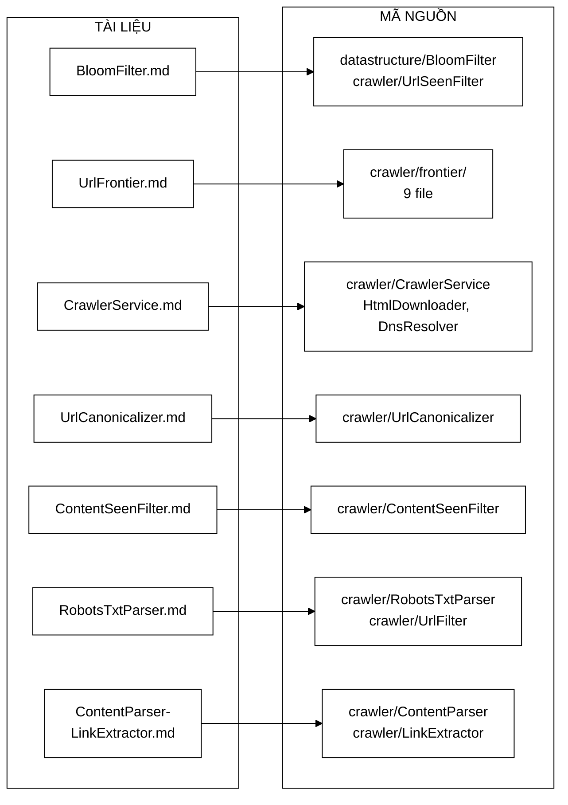

<details>
<summary><b>Xem bản chữ (ASCII)</b></summary>

```
 TÀI LIỆU                          MÃ NGUỒN
 ────────────────────────────      ──────────────────────────────────────────
 BloomFilter.md              ───►  datastructure/BloomFilter.java
                                   crawler/UrlSeenFilter.java   (nơi cấp phát)
 UrlFrontier.md              ───►  crawler/frontier/  (cả 9 file)
 CrawlerService.md           ───►  crawler/CrawlerService.java
                                   crawler/HtmlDownloader.java
                                   crawler/DnsResolver.java
 UrlCanonicalizer.md         ───►  crawler/UrlCanonicalizer.java
 ContentSeenFilter.md        ───►  crawler/ContentSeenFilter.java
 RobotsTxtParser.md          ───►  crawler/RobotsTxtParser.java
                                   crawler/UrlFilter.java
 ContentParser-LinkExtractor ───►  crawler/ContentParser.java
                                   crawler/LinkExtractor.java
```

</details>

### 13.1 Chỗ nào có code chứng minh tính đúng đắn

Không phải khẳng định nào cũng cần dẫn chứng như nhau. Ba mức, và mỗi mức có cách kiểm khác nhau:

| Mức | Loại khẳng định | Kiểm bằng cách nào | Ví dụ trong thư mục này |
|---|---|---|---|
| **1 — chứng minh được từ code** | Tính chất bất biến của thuật toán | Đọc code, lập luận | "Không có false negative" — [BloomFilter §2](BloomFilter.md), chứng minh dựa trên ba điều kiện đọc thẳng từ `BloomFilter.java:47-48`, `:113-115`, `:125-149` |
| **2 — tính lại được** | Công thức, độ phức tạp, con số suy ra | Thay số vào công thức | $m = 9\,585\,059$, $k = 7$, $p = 1{,}003\%$ — [BloomFilter §11](BloomFilter.md) chạy tay khép kín 8 bước |
| **3 — chỉ đo được** | Số liệu thực nghiệm | **Chạy lại phép đo** | 78,8 outlink/trang, 52 host, 26,2 trang/giây — phụ thuộc mốc corpus; lệnh chạy lại ở §12 |

> ⚠️ **Mức 3 là chỗ duy nhất tài liệu có thể sai mà không ai phát hiện bằng cách
> đọc.** Đó cũng chính là chỗ đã sai thật: một bản trước của `UrlFrontier.md`
> ghi *49 host / 26,6 trang/giây / hơn 90 outlink* trong khi mọi tài liệu khác
> ghi *52 / 26,2 / 78,8*. Không công thức nào bắt được sai lệch đó — chỉ có
> đối chiếu chéo mới bắt được.
>
> **Cách phòng:** mọi số ở mức 3 phải kèm **nhãn mốc corpus**. Bảng quy chiếu
> bốn mốc nằm ở đầu [`DSA-REPORT.md`](../../DSA-REPORT.md).

### 13.2 Ba lệnh tự kiểm chứng tài liệu này

```bash
# 1. Số file có đúng 43 không?
find search-engine/src/main/java/com/vnsearch/crawler -name "*.java" | wc -l

# 2. Số file test có đúng 24 không?
find search-engine/src/test/java/com/vnsearch/crawler -name "*.java" | wc -l

# 3. Mọi đoạn code trích trong docs có còn tồn tại không?
#    Lấy một dòng đặc trưng bất kỳ rồi tìm ngược lại trong mã nguồn.
grep -rn "URLS_SEEN_PER_PAGE" search-engine/src/main/java/
grep -rn "followRedirects" search-engine/src/main/java/
```

Lệnh số 3 chính là lệnh đã phát hiện ra đoạn
`visited = new BloomFilter(Math.max(200_000, config.maxPages * 200), 0.01)`
**không còn tồn tại ở đâu trong repo** — nó bị trích trong hai trang tài liệu
suốt nhiều tháng sau khi code đã đổi.

---

## 14. Đọc tiếp gì

| Muốn hiểu | Đọc trang nào |
|---|---|
| Toán của Bloom Filter — vì sao **1,14 MB đủ cho 1 triệu URL** | [BloomFilter.md](BloomFilter.md) |
| Chứng minh trần thông lượng, chống bỏ đói bằng xác suất | [UrlFrontier.md](UrlFrontier.md) |
| Phát hiện kết thúc phân tán, $P(\text{nhầm}) \approx 10^{-15}$ | [CrawlerService.md](CrawlerService.md) |
| Nghịch lý ngày sinh cho SHA-256 | [ContentSeenFilter.md](ContentSeenFilter.md) |
| Quan hệ tương đương và dạng chuẩn tắc của URL | [UrlCanonicalizer.md](UrlCanonicalizer.md) |
| Khớp tiền tố dài nhất, máy trạng thái hai cờ | [RobotsTxtParser.md](RobotsTxtParser.md) |
| **Nhóm 6 — bus và chế độ phân tán** | [Sơ đồ tư duy Kafka](../09-kafka/00-SO-DO-TU-DUY.md) |
| **Nhóm 6 — kho ảnh và cách chọn ảnh đại diện** | [Sơ đồ tư duy tầng ảnh](../10-images/00-SO-DO-TU-DUY.md) |
| **Dữ liệu crawl được đi tiếp về đâu** | [Sơ đồ tư duy tầng chỉ mục](../02-index/00-SO-DO-TU-DUY.md) |
