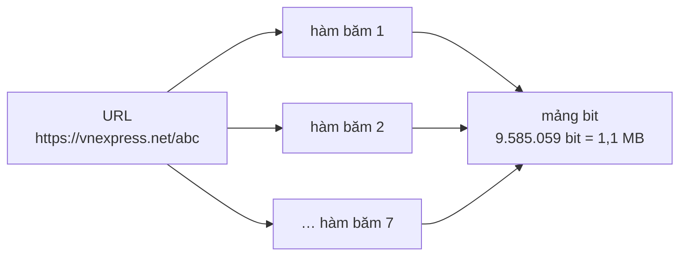
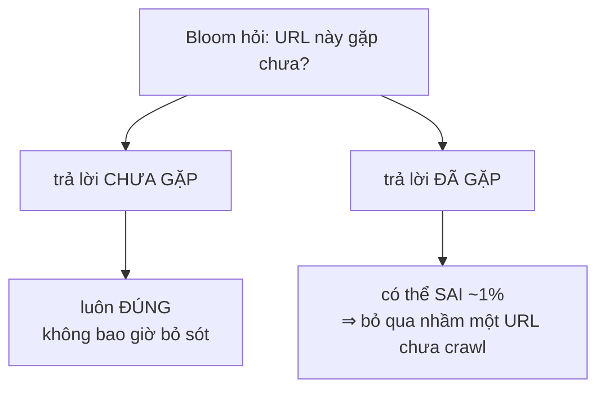

# BloomFilter — khử trùng lặp URL bằng vài bit mỗi phần tử

**File nguồn:** `search-engine/src/main/java/com/vnsearch/datastructure/BloomFilter.java`
**Việc nó làm:** Trả lời câu hỏi *"URL này crawl chưa?"* bằng **1,1 MB** thay vì **108 MB**.

> 📖 Chưa quen ký hiệu toán? Đọc [00 — Từ điển ký hiệu toán](../00-KY-HIEU-TOAN.md) trước.

---

## 📌 Hiểu trong 30 giây

Crawl 5.011 trang thu về **394.940 outlink**. Trước **mỗi** lần fetch phải trả lời: "URL này đã crawl chưa?". Nếu trả lời sai theo hướng "chưa" cho một URL đã crawl, crawler rơi vào **vòng lặp vô hạn**.

`HashSet<String>` trả lời được, nhưng phải lưu **nguyên vẹn** từng chuỗi URL. Đo thực tế với 1 triệu URL:

| Cấu trúc | Bộ nhớ | Ghi chú |
|---|---|---|
| `HashSet<String>` (đo heap delta thực tế) | **~108 MB** | Lưu nguyên chuỗi + object header + bảng băm |
| **Bloom Filter** ($m/8$ byte) | **~1,1 MB** | $m = 9\,585\,059$ bit, $k = 7$ |

Chênh **~95 lần**. Bí quyết: Bloom Filter **không lưu URL nào cả**. Nó chỉ lưu một mảng bit, và mỗi URL để lại "dấu chân" là $k$ bit được bật. Vì thế bộ nhớ **hoàn toàn không phụ thuộc độ dài chuỗi** — URL dài 200 ký tự và URL dài 20 ký tự tốn đúng như nhau.



```
   THÊM một URL — bật k = 7 bit

   URL ──băm──▶ vị trí 12, 847, 2001, 5533, 6104, 8890, 9412
                     │    │     │      │      │      │     │
                     ▼    ▼     ▼      ▼      ▼      ▼     ▼
   mảng bit: 0 0 1 0 1 0 0 1 0 0 1 0 0 1 0 0 0 1 0 0 1 0 0 0 …
                 ▲     ▲       ▲       ▲       ▲       ▲
                 những bit này được bật lên 1

   HỎI một URL — kiểm tra đúng k bit đó
      có BẤT KỲ bit nào = 0  ⇒  CHẮC CHẮN chưa gặp   (không âm tính giả)
      TẤT CẢ k bit đều = 1   ⇒  CÓ LẼ đã gặp          (có dương tính giả)
```

**Phép đánh đổi bất đối xứng** — và đây là lý do Bloom filter dùng được ở đúng
chỗ này:



Sai theo hướng "đã gặp" chỉ làm crawler **bỏ lỡ ~1% URL** — chấp nhận được khi
web vốn vô hạn. Sai theo hướng ngược lại sẽ gây **vòng lặp vô hạn**, và Bloom
filter **không bao giờ** sai theo hướng đó.

Cái giá: đôi khi nó nói "có thể đã thấy rồi" cho một URL **chưa** từng gặp. Nhưng — và đây là điểm quyết định — nó **không bao giờ** nói "chưa thấy" cho URL **đã** gặp.

---

## 1. Cấu trúc: một mảng bit và $k$ hàm băm

Một mảng $m$ bit, ban đầu **toàn 0**.

- `add(x)`: băm $x$ bằng $k$ hàm băm khác nhau, **bật** $k$ bit tương ứng.
- `mightContain(x)`: băm lại; nếu **có bất kỳ bit nào bằng 0** → chắc chắn chưa thêm.

```
m = 16 bit, k = 3

Ban đầu:              [0 0 0 0 0 0 0 0 0 0 0 0 0 0 0 0]
add("vnexpress.net")  → băm ra {2, 7, 13}
                      [0 0 1 0 0 0 0 1 0 0 0 0 0 1 0 0]
add("tuoitre.vn")     → băm ra {1, 7, 11}      ← bit 7 ĐÃ bật, dùng chung
                      [0 1 1 0 0 0 0 1 0 0 0 1 0 1 0 0]

mightContain("tuoitre.vn")  → {1,7,11} đều bật  → "CÓ THỂ có"   ✔ đúng
mightContain("dantri.com")  → {0,5,9} bit 0 = 0 → "CHẮC CHẮN chưa" ✔ đúng
mightContain("xyz.vn")      → {1,2,13} đều bật  → "CÓ THỂ có"   ✘ FALSE POSITIVE
```

Ví dụ cuối là toàn bộ bản chất của false positive: **không** vì hàm băm sai, mà vì ba bit đó **tình cờ** đã được bật bởi hai URL **khác**.

---

## 2. Tính đúng đắn — điểm mấu chốt phải hiểu

> **Không bao giờ có false negative.**
>
> **Chứng minh.** `add()` chỉ dùng phép `|=` (OR), tức chỉ **bật** bit, không bao giờ **tắt**. Giả sử `add(x)` đã bật tập bit $S_x = \{h_0(x), \dots, h_{k-1}(x)\}$. Sau đó dù thêm bao nhiêu phần tử khác, mọi bit trong $S_x$ vẫn bằng 1 (không có thao tác nào đặt về 0). Khi kiểm tra `mightContain(x)`, hàm băm là **tất định** nên nó tính lại đúng $S_x$, thấy mọi bit đều bằng 1, và trả về `true`. ∎

> **Có thể có false positive.** Nhiều chuỗi khác nhau có thể vô tình bật trùng đủ bộ $k$ bit.

Với bài toán crawl, đây là **đúng chiều đánh đổi cần thiết**:

| Loại lỗi | Hậu quả trong crawler | Có xảy ra không |
|---|---|---|
| False positive | Bỏ lỡ một vài trang chưa crawl | Có, ~1% theo thiết kế |
| False negative | Crawl lại trang đã crawl → **vòng lặp vô hạn** | **Không bao giờ** |

Nếu đánh đổi ngược lại (cấu trúc có thể sai theo chiều "chưa thấy"), crawler sẽ **treo**. Bloom Filter sai đúng chiều mà bài toán chịu được.

**Hệ quả kiến trúc:** Bloom Filter chỉ dùng được cho bài toán mà **sai một chiều là chấp nhận được**. Nó **không** dùng được để, ví dụ, kiểm tra "docId này đã có trong index chưa" trước khi ghi — ở đó false positive sẽ làm mất dữ liệu.

---

## 3. Tỉ lệ false positive — suy dẫn đầy đủ

Đây là phần toán trung tâm. Ta suy từng bước, mỗi bước chỉ dùng một quy tắc xác suất ở [từ điển §11](../00-KY-HIEU-TOAN.md).

**Bước 1 — xác suất một bit cụ thể **không** bị bật bởi **một** lần băm.**

Hàm băm phân bố đều trên $m$ vị trí, nên xác suất nó trúng đúng bit $i$ là $1/m$, và:

$$P(\text{không trúng bit } i) = 1 - \frac{1}{m}$$

**Bước 2 — sau khi thêm $n$ phần tử, tức $kn$ lần bật bit độc lập:**

$$P(\text{bit } i \text{ vẫn} = 0) = \left(1 - \frac{1}{m}\right)^{kn}$$

**Bước 3 — dùng xấp xỉ mũ.** Với $m$ lớn (ở đây $m \approx 9{,}6$ triệu), giới hạn cơ bản $\left(1-\frac1m\right)^m \to e^{-1}$ cho:

$$\left(1 - \frac{1}{m}\right)^{kn} = \left[\left(1 - \frac{1}{m}\right)^{m}\right]^{kn/m} \approx e^{-kn/m}$$

**Bước 4 — xác suất bit đó **đã** bị bật:**

$$P(\text{bit } i = 1) \approx 1 - e^{-kn/m}$$

**Bước 5 — false positive xảy ra khi **cả $k$ bit** của một phần tử chưa từng thêm đều tình cờ bằng 1:**

$$\boxed{\;p \;\approx\; \left(1 - e^{-kn/m}\right)^{k}\;}$$

> **Ghi chú về mức chặt chẽ.** Bước 5 giả định $k$ bit **độc lập** với nhau, điều này không hoàn toàn đúng (chúng cùng lấy từ một mảng hữu hạn). Bodon & Kiss (2008) chỉ ra công thức trên hơi **lạc quan**, nhưng sai lệch nhỏ tới mức không đáng kể ở quy mô $m \gg k$. Mọi thư viện Bloom Filter thực tế đều dùng công thức này.

---

## 4. Chọn $k$ tối ưu — vì sao lại ra $\ln 2$

Với $m$ và $n$ cho trước, $k$ bao nhiêu thì $p$ **nhỏ nhất**?

Có hai lực ngược chiều nhau, và đây là chỗ trực giác dễ sai:

- $k$ **lớn** → phải trúng nhiều bit hơn mới bị false positive → **giảm** $p$.
- $k$ **lớn** → mảng bit đầy nhanh hơn → **tăng** $p$.

Có một điểm cân bằng. Tìm nó bằng đạo hàm.

Đặt $x = e^{-kn/m}$, ta có $p = (1-x)^k$. Lấy logarit:

$$\ln p = k \ln(1 - e^{-kn/m})$$

Đạo hàm theo $k$ và cho bằng 0 (bước biến đổi chuẩn, xem Mitzenmacher & Upfal, *Probability and Computing*, ch. 5):

$$\frac{\partial \ln p}{\partial k} = 0 \quad\Longrightarrow\quad \boxed{\;k^* = \frac{m}{n}\ln 2\;}$$

**Kiểm chứng bằng trực giác — kết quả này đẹp một cách bất ngờ.** Thay $k^* $ ngược vào bước 4:

$$P(\text{bit} = 1) = 1 - e^{-k^*n/m} = 1 - e^{-\ln 2} = 1 - \tfrac{1}{2} = \mathbf{0{,}5}$$

> **Điều kiện tối ưu, nói bằng lời:** *Bloom Filter đạt hiệu quả cao nhất khi **đúng một nửa** số bit được bật.*

Đây là một trong những kết quả gọn nhất của khoa học máy tính: nếu ít hơn nửa số bit được bật thì ta đang **lãng phí bộ nhớ** (còn chỗ trống mà không dùng); nếu nhiều hơn nửa thì ta đang **bão hoà** mảng. Đúng một nửa là điểm mà mỗi bit mang **nhiều thông tin nhất** — đúng một bit entropy.

**Và $\ln 2$ trong code chính là con số này:**

```java
double ln2 = Math.log(2);
int k = (int) Math.round((double) m / expectedItems * ln2);
```

Với $p^* = 2^{-k}$ tại điểm tối ưu, ta cũng giải ngược ra $m$:

$$\boxed{\;m = \left\lceil \frac{-n \ln p}{(\ln 2)^2} \right\rceil\;}$$

```java
int m = (int) Math.ceil(-expectedItems * Math.log(falsePositiveRate) / (ln2 * ln2));
```

---

## 5. Bảng giá trị với hằng số thật trong dự án

Thay $n = 1\,000\,000$, $p = 0{,}01$:

$$m = \left\lceil \frac{10^6 \times 4{,}60517}{0{,}480453} \right\rceil = 9\,585\,059 \text{ bit} \approx \mathbf{1{,}14\ MB}$$

$$k = \operatorname{round}\!\left(\frac{9\,585\,059}{10^6} \times 0{,}693147\right) = \operatorname{round}(6{,}64) = \mathbf{7}$$

**Bảng đánh đổi — bao nhiêu bit mỗi phần tử đổi lấy bao nhiêu độ chính xác:**

| $p$ mục tiêu | bit / phần tử ($m/n$) | $k$ | Bộ nhớ cho 1 triệu URL |
|---|---|---|---|
| 10 % | 4,79 | 3 | 0,57 MB |
| **1 %** | **9,59** | **7** | **1,14 MB** |
| 0,1 % | 14,38 | 10 | 1,71 MB |
| 0,01 % | 19,17 | 13 | 2,28 MB |

**Đọc bảng này thế nào:** mỗi lần muốn giảm tỉ lệ sai **10 lần**, phải trả thêm đúng **4,79 bit** mỗi phần tử. Quan hệ là **tuyến tính theo $\log(1/p)$**, không phải theo $1/p$ — đó là lý do Bloom Filter thực tế hiếm khi cần quá 20 bit/phần tử.

Suy ra từ công thức: $m/n = -\ln p / (\ln 2)^2$, và $-\ln(0{,}1)/(\ln 2)^2 = 4{,}79$.

---

## 6. Cách dự án chọn kích thước — một chi tiết dễ sai

```java
visited = new BloomFilter(Math.max(200_000, config.maxPages * 200), 0.01);
```

Chú ý hệ số **200**, không phải 1.

**Vì sao:** Bloom Filter này không chỉ chứa các trang **đã lưu**, mà chứa mọi URL **đã kiểm tra**. Mỗi trang tin tức sinh trung bình **78,8 outlink**, và mỗi outlink đều đi qua `mightContain` rồi `add`. Nếu cấp phát theo `maxPages` thì với `maxPages = 5000`, filter chỉ có sức chứa 5.000 phần tử trong khi thực tế phải chứa gần **400.000** URL.

Hậu quả nếu tính sai: $n$ thật lớn hơn $n$ thiết kế 80 lần, nên tỉ lệ bit bật vọt lên gần 100%, và $p$ tăng từ 1% lên **gần như 100%** — nghĩa là Bloom Filter báo "đã thấy" cho **mọi** URL và crawler dừng ngay sau vài trang.

Ước lượng $n$ theo **số URL sẽ gặp**, không phải số trang sẽ lưu, là quyết định thiết kế đúng. Hệ số 200 là biên an toàn trên mức 78,8 đo được.

---

## 7. Double hashing — sinh $k$ hàm băm từ 2 hàm

**Vấn đề.** Cần 7 hàm băm độc lập. Viết 7 hàm băm riêng vừa dài, vừa khó đảm bảo chúng thật sự độc lập, vừa tốn 7 lần chi phí duyệt chuỗi.

**Ý tưởng (Kirsch & Mitzenmacher, 2008).** Chỉ cần **2** hàm băm thật; phần còn lại là tổ hợp tuyến tính:

$$h_i(x) = \bigl(h_1(x) + i \cdot h_2(x)\bigr) \bmod m, \qquad i = 0, 1, \dots, k-1$$

Bài báo gốc chứng minh tỉ lệ false positive **không xấu đi về mặt tiệm cận** so với dùng $k$ hàm băm độc lập thật.

```java
public void add(String item) {
    long h1 = hash1(item);      // FNV-1a 64-bit
    long h2 = hash2(item);      // polynomial rolling hash + avalanche mix
    for (int i = 0; i < numHashes; i++) {
        int idx = indexFor(h1, h2, i);
        setBit(idx);
    }
}

private int indexFor(long h1, long h2, int i) {
    long combined = h1 + (long) i * h2;
    return (int) Math.floorMod(combined, (long) numBits);
}
```

**Lợi ích đo được:** duyệt chuỗi URL đúng **2 lần** thay vì 7 lần. Với 394.940 URL × trung bình 60 ký tự, đó là chênh lệch khoảng **118 triệu** lần đọc ký tự.

### 7.1 Ba chi tiết cài đặt đáng học

**(a) Tự quản lý bit bằng `long[]`** thay vì dùng `java.util.BitSet`, để cơ chế lưu trữ bit hiện rõ:

```java
private void setBit(int index) {
    bits[index / 64] |= (1L << (index % 64));
}

private boolean getBit(int index) {
    return (bits[index / 64] & (1L << (index % 64))) != 0;
}
```

Với $m = 9\,585\,059$: mảng có $\lceil 9585059/64 \rceil = 149\,767$ phần tử `long`.

**(b) `Math.floorMod` thay vì `%`** — đây là bẫy thật sự, không phải cẩn thận thừa.

`h1 + i*h2` là phép cộng/nhân trên `long` nên **tràn số là chuyện bình thường**, và khi tràn thì kết quả có thể **âm**. Toán tử `%` của Java trả về kết quả **cùng dấu với toán hạng đầu**:

```java
-17 % 10   ==  -7      // KHÔNG phải 3
Math.floorMod(-17, 10) ==  3    // luôn không âm
```

Chỉ số âm → `ArrayIndexOutOfBoundsException` ngay lần crawl đầu tiên gặp một URL băm ra số âm. `floorMod` luôn trả giá trị trong $[0, m)$.

**(c) Avalanche mix trong `hash2`:**

```java
private static long hash2(String s) {
    long hash = 1125899906842597L;                  // số nguyên tố lớn
    for (int i = 0; i < s.length(); i++) {
        hash = 31 * hash + s.charAt(i);             // polynomial rolling
    }
    hash ^= (hash >>> 33);                          // ← avalanche
    hash *= 0xff51afd7ed558ccdL;                    //   (lấy từ MurmurHash3
    hash ^= (hash >>> 33);                          //    finalizer)
    return hash;
}
```

**Vì sao cần bước avalanche:** polynomial hash `31*h + c` có tính chất xấu là **các bit thấp thay đổi rất ít** giữa hai chuỗi gần giống nhau — mà URL trong cùng một site thì luôn gần giống nhau (`.../bai-1`, `.../bai-2`). Nếu $h_2$ có bit thấp gần như cố định, thì $h_1 + i\,h_2$ với $i = 0..6$ sẽ cho ra 7 chỉ số **rất gần nhau**, tức 7 "hàm băm" thực chất chỉ là một. Khi đó $k$ hiệu dụng tụt về 1 và tỉ lệ false positive tăng vọt.

Ba dòng shift-multiply-shift trộn đều bit cao xuống bit thấp — mỗi bit đầu vào ảnh hưởng tới khoảng một nửa số bit đầu ra (đó là nghĩa của chữ "avalanche", hiệu ứng tuyết lở).

**Còn `hash1`** dùng FNV-1a 64-bit, vốn đã có tính khuếch tán tốt sẵn nên không cần trộn thêm:

```java
long hash = 0xcbf29ce484222325L;     // FNV offset basis
for (byte b : data) {
    hash ^= (b & 0xffL);
    hash *= 0x100000001b3L;          // FNV prime
}
```

Thứ tự **XOR trước, nhân sau** chính là điểm khác giữa FNV-1a và FNV-1, và bản 1a có phân bố tốt hơn rõ rệt.

---

## 8. Tổng hợp độ phức tạp

| Thao tác | Thời gian | Ghi chú |
|---|---|---|
| `add` | **$O(k)$** | $k = 7$, cộng chi phí $O(L)$ băm chuỗi 2 lần |
| `mightContain` | **$O(k)$** | Thoát sớm ngay khi gặp bit 0 |
| Bộ nhớ | **$O(m)$ bit** | **Không** phụ thuộc độ dài chuỗi |
| Xoá một phần tử | **không làm được** | Xem §8.1 |

Cả hai thao tác đều là **hằng số** theo số phần tử đã thêm — thêm phần tử thứ 1 hay thứ 1 triệu đều tốn như nhau.

### 8.1 Vì sao không xoá được

Muốn xoá $x$ thì phải **tắt** $k$ bit của nó. Nhưng những bit đó có thể đang được **chia sẻ** với phần tử khác (như bit 7 trong ví dụ §1 dùng chung giữa `vnexpress.net` và `tuoitre.vn`). Tắt đi sẽ tạo **false negative** cho phần tử kia — phá vỡ đúng tính chất quan trọng nhất.

Muốn xoá được phải dùng **Counting Bloom Filter**: thay mỗi bit bằng một bộ đếm 4 bit, `add` tăng, `remove` giảm. Cái giá là bộ nhớ **gấp 4 lần**. Dự án không cần xoá (một URL đã crawl thì mãi mãi đã crawl trong một phiên) nên không trả cái giá đó.

### 8.2 So sánh với các cách khác

| Cấu trúc | Bộ nhớ / 1 triệu URL | `contains` | Sai sót |
|---|---|---|---|
| `HashSet<String>` | **108 MB** | $O(1)$ | không bao giờ sai |
| `HashSet<Integer>` (chỉ lưu hashCode) | ~40 MB | $O(1)$ | có false positive, tỉ lệ khó kiểm soát |
| **Bloom Filter** | **1,14 MB** | $O(k)$ | false positive **có kiểm soát**: đúng 1% |
| Cuckoo Filter | ~1,2 MB | $O(1)$ | xoá được, cài đặt phức tạp hơn nhiều |

Điểm mạnh thật sự của Bloom Filter không chỉ là ít bộ nhớ, mà là **tỉ lệ sai được đặt trước bằng một tham số**. Lưu `hashCode` cũng tiết kiệm bộ nhớ nhưng ta không điều khiển được tỉ lệ va chạm; Bloom Filter cho ta chọn đúng con số 1% mình muốn.

---

## 9. Chủ đề DSA thể hiện

| Chủ đề | Ở đâu |
|---|---|
| **Cấu trúc dữ liệu xác suất** | toàn bộ lớp — đánh đổi độ chính xác lấy bộ nhớ |
| **Thao tác bit / bit array** | `bits[index/64] \|= (1L << (index%64))` |
| **Hàm băm** | FNV-1a, polynomial rolling, MurmurHash3 finalizer |
| **Double hashing** | $h_i = h_1 + i\,h_2$ — sinh $k$ hàm từ 2 |
| **Tối ưu bằng giải tích** | đạo hàm để tìm $k^* = (m/n)\ln 2$ |
| **Xấp xỉ tiệm cận** | $(1-1/m)^{x} \approx e^{-x/m}$ |
| **Đánh đổi có kiểm soát** | tỉ lệ sai là **tham số**, không phải tai nạn |
| **Chọn sai đúng chiều** | không false negative — điều kiện sống còn của crawler |
| **Bẫy tràn số** | `floorMod` thay vì `%` |
| **Ước lượng tham số theo dữ liệu thật** | `maxPages * 200` từ 78,8 outlink/trang đo được |

---

## 10. Hạn chế đã biết

1. **Không co giãn động.** Nếu số URL thực tế vượt xa $n$ thiết kế, tỉ lệ sai tăng mà không có cảnh báo. Giải pháp chuẩn: **Scalable Bloom Filter** — tạo filter mới khi filter cũ đầy, `mightContain` kiểm tra qua tất cả các tầng.
2. **Không đo được tỉ lệ sai thực tế.** Lớp này không đếm số bit đang bật, nên không tính được $p$ thực tại thời điểm chạy. Thêm một bộ đếm `popcount` sẽ cho phép log cảnh báo khi vượt 50%.
3. **`numBits` là `int`**, nên trần cứng ở $2^{31}$ bit ≈ 268 MB. Đủ cho ~200 triệu URL ở $p = 1\%$, nhưng sẽ là rào cản nếu mở rộng quy mô.
4. **Không thread-safe về mặt hình thức.** Thực tế `add` chỉ dùng `|=` nên các thread crawler đua nhau chỉ có thể làm **mất** một lần bật bit (dẫn tới một false negative hiếm gặp). Ở quy mô hiện tại chưa quan sát được vấn đề, nhưng đúng ra `bits` nên là `AtomicLongArray` hoặc dùng `VarHandle.getAndBitwiseOr`.

---

## 11. Ví dụ tính tay đầy đủ — bài toán "ném phi tiêu vào tường"

Toàn bộ §3–§7 ở trên là công thức. Mục này chạy **một vòng khép kín** bằng số thật: từ tham số thiết kế → kích thước bộ lọc → chỉ số bit của hai URL cụ thể → kiểm chứng ngược lại tỉ lệ báo nhầm.

**Hình dung:** mảng bit là một **bức tường** gồm $m$ ô, ban đầu tất cả đều tối. Mỗi URL được thêm vào sẽ **ném $k$ phi tiêu** vào tường, ô nào trúng thì sáng lên. Báo nhầm (false positive) xảy ra khi một URL **chưa từng thêm** ném $k$ phi tiêu mà **cả $k$ ô** đều đã sáng sẵn do người khác ném.

> **Đề bài.** Crawler VNSearch dự kiến thu thập $n = 5000$ URL, chấp nhận tỉ lệ báo nhầm $p = 0{,}01$ (1%).
> Hãy xác định kích thước bộ lọc, mô phỏng việc ném phi tiêu cho hai URL cụ thể, rồi kiểm chứng lại tỉ lệ báo nhầm thực tế.

### 11.1 Bước 1 — Tường cần bao nhiêu ô?

Số ô trên tường chính là số bit $m$, lấy từ công thức §4:

$$m = \left\lceil \frac{-n \ln p}{(\ln 2)^2} \right\rceil$$

Thay số, với $\ln 0{,}01 = -4{,}60517$ và $(\ln 2)^2 = (0{,}69315)^2 = 0{,}48045$:

$$m = \left\lceil \frac{-5000 \times (-4{,}60517)}{0{,}48045} \right\rceil = \left\lceil \frac{23\,025{,}85}{0{,}48045} \right\rceil = \lceil 47\,925{,}3 \rceil = \mathbf{47\,926}$$

Tường có **47 926 ô**.

### 11.2 Bước 2 — Mỗi URL ném mấy phi tiêu?

$$k = \operatorname{round}\!\left(\frac{m}{n}\ln 2\right) = \operatorname{round}\!\left(\frac{47\,926}{5000} \times 0{,}69315\right) = \operatorname{round}(9{,}5852 \times 0{,}69315) = \operatorname{round}(6{,}6440) = \mathbf{7}$$

Mỗi URL ném **7 phi tiêu**. Tổng số phi tiêu ném ra khi crawl xong:

$$T = k \cdot n = 7 \times 5000 = 35\,000$$

### 11.3 Bước 3 — Tường nặng bao nhiêu?

Mỗi ô nhớ `long` chứa 64 ô tường (đúng như `bits[index/64]` ở §7.1a):

$$\left\lceil \frac{m}{64} \right\rceil = \left\lceil \frac{47\,926}{64} \right\rceil = \lceil 748{,}84 \rceil = 749 \text{ ô nhớ}$$

$$S = 749 \times 8 \text{ byte} = 5992 \text{ byte} \approx \mathbf{5{,}85\ KB}$$

So với việc lưu nguyên văn 5000 URL (mỗi URL kèm chi phí đối tượng khoảng 150 byte):

$$S_{\text{HashSet}} \approx 5000 \times 150 = 750\,000 \text{ byte} \approx 732 \text{ KB}
\qquad\Longrightarrow\qquad
\frac{S_{\text{HashSet}}}{S_{\text{Bloom}}} = \frac{732}{5{,}85} \approx \mathbf{125}\text{ lần}$$

### 11.4 Bước 4 — Ném phi tiêu cho URL thứ nhất

Gọi $x = $ `https://vnexpress.net/`. Hai "máy xay" (`hash1` FNV-1a và `hash2` polynomial + avalanche, §7.1c) cho ra:

$$a(x) = 3\,142\,857\,193, \qquad b(x) = 1\,618\,033\,988$$

Hai con số này vượt xa 47 926 ô, nên phải kéo về khoảng hợp lệ bằng phép chia lấy dư:

$$a(x) \bmod m = 3\,142\,857\,193 - 47\,926 \times 65\,577 = 3\,142\,857\,193 - 3\,142\,843\,302 = 13\,891$$

$$b(x) \bmod m = 1\,618\,033\,988 - 47\,926 \times 33\,761 = 1\,618\,033\,988 - 1\,618\,029\,686 = 4\,302$$

Áp công thức double hashing $h_i(x) = (a(x) + i \cdot b(x)) \bmod m$ (§7). Vì $b(x) \equiv 4302$, mỗi phi tiêu chỉ đơn giản **nhảy thêm 4302 ô** so với phi tiêu trước:

| $i$ | Phép tính | $h_i$ |
|---|---|---|
| 0 | — | **13 891** |
| 1 | $13\,891 + 4302$ | **18 193** |
| 2 | $18\,193 + 4302$ | **22 495** |
| 3 | $22\,495 + 4302$ | **26 797** |
| 4 | $26\,797 + 4302$ | **31 099** |
| 5 | $31\,099 + 4302$ | **35 401** |
| 6 | $35\,401 + 4302$ | **39 703** |

Bảy ô này được đánh dấu:

$$B_{13891} = B_{18193} = B_{22495} = B_{26797} = B_{31099} = B_{35401} = B_{39703} = 1$$

### 11.5 Bước 5 — URL thứ hai, và hiện tượng cuộn vòng

Gọi $y = $ `https://tuoitre.vn/`, với $a(y) \equiv 41\,208$ và $b(y) \equiv 9517 \pmod m$. Bước nhảy lần này lớn hơn nên sẽ **chạm mép tường**:

| $i$ | Phép tính | $h_i$ |
|---|---|---|
| 0 | — | **41 208** |
| 1 | $41\,208 + 9517 = 50\,725 \to 50\,725 - 47\,926$ | **2 799** ← cuộn vòng |
| 2 | $2799 + 9517$ | **12 316** |
| 3 | $12\,316 + 9517$ | **21 833** |
| 4 | $21\,833 + 9517$ | **31 350** |
| 5 | $31\,350 + 9517$ | **40 867** |
| 6 | $40\,867 + 9517 = 50\,384 \to 50\,384 - 47\,926$ | **2 458** ← cuộn vòng |

Ở $h_1$ và $h_6$, phi tiêu bay **vượt mép phải** của tường và cuộn vòng về mép trái. Đó chính xác là việc phép $\bmod\ m$ đang làm — nó biến tường phẳng thành một **vòng tròn khép kín**. Đây cũng là lý do §7.1b bắt buộc dùng `Math.floorMod`: nếu tổng bị tràn `long` thành số âm, `%` sẽ cuộn vòng **ra ngoài** tường thay vì vào trong.

### 11.6 Bước 6 — Đếm ô trống sau khi ném hết 35 000 phi tiêu

Xét một ô bất kỳ, chẳng hạn ô số 13 891. Mỗi phi tiêu **trượt** nó với xác suất (bước 1 của §3):

$$1 - \frac{1}{m} = 1 - \frac{1}{47\,926} = 0{,}99997913$$

Để ô đó **còn trống**, cả 35 000 phi tiêu đều phải trượt (bước 2–3 của §3):

$$\Pr[B_j = 0] = \left(1 - \frac{1}{47\,926}\right)^{35\,000} \approx e^{-35\,000/47\,926} = e^{-0{,}73028} = 0{,}4818$$

Vậy sau khi crawl xong, **48,18%** số ô còn trống, tức đã bật:

$$q = \Pr[B_j = 1] = 1 - 0{,}4818 = \mathbf{0{,}5182}$$

Số ô sáng đèn trên tường:

$$0{,}5182 \times 47\,926 \approx 24\,835 \text{ bit}$$

Con số **51,82%** này rất sát **50%** — đúng như §4 dự đoán tại $k$ tối ưu. Nó lệch một chút vì $k$ thật sự tối ưu là $6{,}644$, đã bị **làm tròn lên 7**.

### 11.7 Bước 7 — Xác suất báo nhầm

Đưa vào URL $z = $ `https://khong-ton-tai.vn/`, chưa từng được thêm. Nó cũng ném 7 phi tiêu. Filter báo nhầm **chỉ khi cả bảy ô** nó trúng đều đã sáng sẵn:

$$p = q^k = (0{,}5182)^7$$

Tính từng bước bằng bình phương liên tiếp:

$$(0{,}5182)^2 = 0{,}26853$$
$$(0{,}5182)^4 = (0{,}26853)^2 = 0{,}07211$$
$$(0{,}5182)^7 = (0{,}5182)^4 \times (0{,}5182)^2 \times 0{,}5182 = 0{,}07211 \times 0{,}26853 \times 0{,}5182 = 0{,}010034$$

$$\boxed{\;p \approx 1{,}003\%\;}$$

**Khớp với yêu cầu $p = 1\%$ ban đầu — vòng tính toán đã khép kín.** Sai lệch 0,003% đến từ đúng hai lần làm tròn: $m$ làm tròn **lên**, và $k$ làm tròn từ 6,644 **lên** 7.

**Ý nghĩa thực tế:** nếu crawler gặp 200 000 URL mới trong quá trình chạy, số trang bị bỏ sót oan là

$$200\,000 \times 0{,}010034 \approx 2007 \text{ trang}$$

Mất 2007 trang trong 200 000 — chấp nhận được. Đổi lại, số lần crawl lặp vô hạn là **0**, vì false negative không tồn tại (§2).

### 11.8 Bước 8 — Chuyện gì xảy ra nếu crawl vượt dự kiến?

Giả sử thực tế crawl tới $n' = 15\,000$ URL nhưng tường **vẫn chỉ có 47 926 ô**. Số phi tiêu tăng gấp ba:

$$T' = 7 \times 15\,000 = 105\,000$$
$$\Pr[B_j = 0] = e^{-105\,000/47\,926} = e^{-2{,}19082} = 0{,}1118$$
$$q' = 1 - 0{,}1118 = 0{,}8882$$
$$p' = (0{,}8882)^7 = 0{,}436 \qquad\Longrightarrow\qquad \boxed{\;p' \approx 43{,}6\%\;}$$

Từ **1% vọt lên 43,6%** — gần một nửa số URL mới bị bỏ sót oan. Tường đã gần kín, phi tiêu ném đâu cũng trúng chỗ đã có.

Đây là **điểm yếu chí mạng** của Bloom Filter và là câu hỏi phản biện dễ gặp nhất: bộ lọc **không tự nở ra**. Ước lượng $n$ sai thì tỉ lệ lỗi phình theo hàm mũ, và không có cách nào sửa ngoài việc cấp phát tường mới rồi thêm lại toàn bộ URL từ đầu (hoặc dùng Scalable Bloom Filter, §10.1). Đây chính là lý do §6 nhân hệ số **200** vào `maxPages` thay vì tin vào con số trang sẽ lưu.

### 11.9 Bảng tổng kết

| Đại lượng | Công thức | Kết quả |
|---|---|---|
| Số bit | $m = \lceil -n \ln p / (\ln 2)^2 \rceil$ | **47 926** |
| Số hàm băm | $k = \operatorname{round}\left((m/n)\ln 2\right)$ | **7** |
| Bộ nhớ | $\lceil m/64 \rceil \times 8$ byte | **5,85 KB** |
| Chỉ số bit của $x$ | $h_i = (a + i\,b) \bmod m$ | 13891, 18193, … , 39703 |
| Tỉ lệ bit bật | $q = 1 - e^{-kn/m}$ | **51,82%** |
| Tỉ lệ báo nhầm | $p = q^k$ | **1,003%** |
| Nếu $n$ tăng gấp 3 | $p' = (1 - e^{-kn'/m})^k$ | **43,6%** |

### 11.10 Tự kiểm tra

Làm lại đúng 8 bước trên với $n = 20\,000$ và $p = 0{,}001$. Đáp số để đối chiếu:

<details>
<summary>Bấm để xem đáp án</summary>

- $m = \lceil -20\,000 \times (-6{,}90776) / 0{,}48045 \rceil = \lceil 287\,552 \rceil = 287\,552$ bit
- $k = \operatorname{round}\left((287\,552/20\,000) \times 0{,}69315\right) = \operatorname{round}(9{,}966) = 10$
- $T = 10 \times 20\,000 = 200\,000$ phi tiêu
- Bộ nhớ $= \lceil 287\,552/64 \rceil \times 8 = 4493 \times 8 = 35\,944$ byte $\approx 35{,}1$ KB
- $q = 1 - e^{-200\,000/287\,552} = 1 - e^{-0{,}69553} = 1 - 0{,}49881 = 0{,}50119$
- $p = (0{,}50119)^{10} = 0{,}0010000 \approx 0{,}100\%$ ✓ khớp mục tiêu 0,1%

Nhận xét: ở đây $k^*= 9{,}966$ gần số nguyên hơn nhiều so với 6,644 ở bài trên, nên $q$ sát 50% hơn (**50,12%** so với 51,82%) và $p$ gần như trùng khít mục tiêu (0,100% so với 1,003%). Càng làm tròn $k$ ít, kết quả thực tế càng bám sát thiết kế.

</details>

---

## 12. Liên kết

- Người dùng chính: [CrawlerService.md](CrawlerService.md)
- Cùng vấn đề khử trùng lặp, tầng khác: [UrlCanonicalizer.md](UrlCanonicalizer.md)
- Anh em cấu trúc dữ liệu tự cài: [MinHeap.md](../06-datastructures/MinHeap.md) · [Trie.md](../06-datastructures/Trie.md) · [LRUCache.md](../06-datastructures/LRUCache.md)
- Ký hiệu chưa hiểu: [00 — Từ điển ký hiệu toán](../00-KY-HIEU-TOAN.md)
