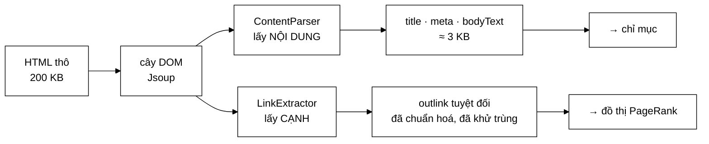
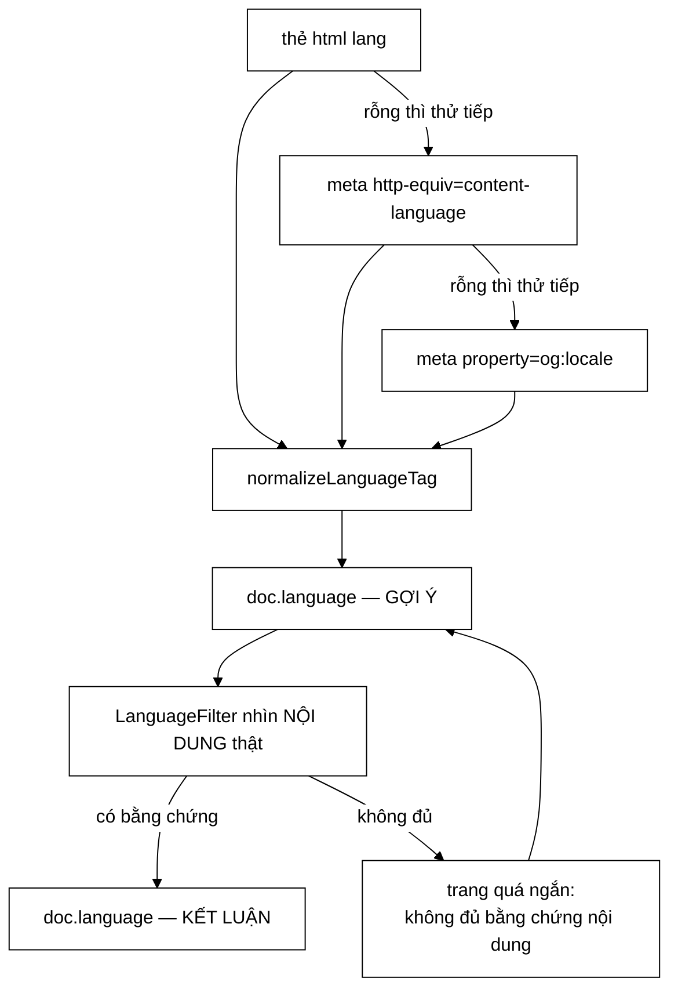

# ContentParser & LinkExtractor — từ cây DOM về văn bản và cạnh đồ thị

**File nguồn:** `crawler/ContentParser.java` và `crawler/LinkExtractor.java`
**Việc nó làm:** Biến một trang HTML thành **hai thứ**: văn bản để lập chỉ mục (`ContentParser`), và danh sách outlink để dựng đồ thị PageRank (`LinkExtractor`).

> 📖 Chưa quen ký hiệu toán? Đọc [00 — Từ điển ký hiệu toán](../00-KY-HIEU-TOAN.md) trước.

---

## 📌 Hiểu trong 30 giây

Đây là điểm nối giữa **thế giới HTML lộn xộn** và **thế giới dữ liệu sạch** mà phần còn lại của hệ thống làm việc trên đó.

Một trang tin tức 200 KB HTML chứa: menu, quảng cáo, script theo dõi, CSS, chân trang, và — đâu đó ở giữa — khoảng 3 KB nội dung thật. Việc của lớp này là lấy đúng 3 KB đó.

Nó cũng là nơi **đồ thị web được sinh ra**: mỗi thẻ `<a href>` trở thành một cạnh, và tập hợp 239.691 cạnh này chính là đầu vào của PageRank.



```
   Một trang tin 200 KB HTML

   ┌─────────────────────────────────┐
   │ menu, quảng cáo, script, CSS    │  ◀── boilerplate
   │ ┌─────────────────────────────┐ │
   │ │  NỘI DUNG THẬT  ≈ 3 KB      │ │  ◀── thứ duy nhất cần lấy
   │ └─────────────────────────────┘ │
   │ chân trang, liên kết liên quan  │  ◀── boilerplate
   └─────────────────────────────────┘
        1,5%  nội dung   |   98,5%  vỏ
```

**Vì sao lấy nhầm boilerplate lại phá hỏng công thức xếp hạng.** TF-IDF chia
cho $\sqrt{|d|}$ để chuẩn hoá độ dài. Nếu $|d|$ bao gồm cả menu và chân trang —
vốn **giống hệt nhau ở mọi trang cùng site** — thì:

```
   |d| thật     ≈    500 token   ⇒  √|d| ≈ 22
   |d| kèm vỏ   ≈ 12.000 token   ⇒  √|d| ≈ 110      ◀── mẫu số phình 5 lần

   ⇒ mọi tài liệu cùng site bị chia cho một hằng số lớn như nhau
   ⇒ phép chuẩn hoá mất tác dụng phân biệt, và term trong vỏ
     làm nhiễu IDF của toàn corpus
```

### Vì sao là HAI lớp chứ không phải một

Trước đây cả hai việc nằm trong một lớp `HtmlExtractor`. Sơ đồ kiến trúc crawler tách chúng thành hai khối — `Content Parser` và `Link Extractor` — và **thứ tự giữa chúng có ý nghĩa**, vì ở giữa còn một khối thứ ba:

```
Content Parser  ->  Content Seen?  ->  Link Extractor
                         |
                         +-- "da thay noi dung nay" -> vut, KHONG boc lien ket
```

Nếu một trang là bản trùng nội dung, nó bị vứt ngay sau khi phân tích nội dung. Các liên kết của nó đã được lấy từ bản gốc rồi, nên bóc lại là công vô ích. Gộp hai việc vào một lớp khiến công đoạn bóc liên kết **luôn** chạy, kể cả với trang sắp bị vứt — xem [ContentSeenFilter.md](ContentSeenFilter.md).

---

## 1. Vì sao dùng Jsoup và ranh giới của việc dùng thư viện

```java
/**
 * (Jsoup la thu vien DUY NHAT duoc phep dung de PARSE HTML theo dac ta —
 * chi lam nhiem vu duyet DOM, KHONG lam thay viec tokenize/index/rank,
 * nhung viec do van do VietnameseTokenizer/InvertedIndex/ResultRanker tu
 * cai dat dam nhiem).
 */
```

Đây là một ranh giới đáng nói rõ trong báo cáo đồ án.

**Vì sao tự viết parser HTML là ý tồi:** HTML thật trên web **không** tuân theo ngữ pháp nào cả. Thẻ không đóng, thẻ lồng sai, thuộc tính không có dấu nháy, ký tự thoát nửa vời. Chuẩn HTML5 dành **hàng trăm trang** chỉ để mô tả thuật toán khôi phục lỗi. Tự viết lại nghĩa là dành hàng tháng cho một việc **không** liên quan tới trọng tâm đồ án (cấu trúc dữ liệu và giải thuật tìm kiếm).

**Vì sao vẫn tự viết tokenizer, chỉ mục, xếp hạng:** vì **đó chính là trọng tâm**. Dùng Lucene sẽ xoá sạch nội dung đồ án.

Ranh giới rút ra: **dùng thư viện cho việc "đọc định dạng"; tự cài cho việc "cấu trúc dữ liệu và giải thuật"**.

---

## 2. Trích xuất meta description — chuỗi dự phòng

```java
private String extractMetaDescription(Document document) {
    Element meta = document.selectFirst("meta[name=description]");
    if (meta == null) {
        meta = document.selectFirst("meta[property=og:description]");
    }
    return meta != null ? meta.attr("content").trim() : "";
}
```

Hai nguồn, thử theo thứ tự:

| Thứ tự | Thẻ | Nguồn gốc |
|---|---|---|
| 1 | `<meta name="description">` | HTML chuẩn, dùng cho SEO |
| 2 | `<meta property="og:description">` | Open Graph của Facebook |

Trả về `""` chứ không phải `null` khi không có — quyết định nhỏ nhưng cứu người dùng khỏi `NullPointerException`. Xem cách `InvertedIndex` ghép văn bản:

```java
String combinedText = String.join(" ",
        doc.getTitle() != null ? doc.getTitle() : "",
        doc.getMetaDescription() != null ? doc.getMetaDescription() : "",
        doc.getBodyText() != null ? doc.getBodyText() : "");
```

Vẫn phải kiểm tra `null` ở đó vì tài liệu có thể đến từ JSON đã lưu chứ không phải từ `ContentParser`. Đây là dấu hiệu của một thiết kế đáng cải thiện: nếu `WebDocument` đảm bảo bất biến "các trường văn bản không bao giờ `null`" ngay trong constructor, thì mọi nơi dùng đều bớt được kiểm tra.

**Vì sao meta description đáng lấy riêng.** Nó là bản tóm tắt do **con người viết** cho chính trang đó — mật độ thông tin cao hơn hẳn thân bài. Trong `InvertedIndex`, nó được ghép vào cùng văn bản để lập chỉ mục, nghĩa là term xuất hiện ở đó được đếm thêm một lần — một dạng tăng trọng số ngầm định.

---

## 3. Trích xuất thân bài — loại nhiễu bằng danh sách đen

**`ContentParser.java:80-84`:**

```java
private String extractBodyText(Document document) {
    Document clone = document.clone();
    clone.select("script, style, noscript, nav, footer, header, iframe, svg").remove();
    return clone.body() != null ? clone.body().text().trim() : "";
}
```

### 3.1 Vì sao phải `clone()`

`remove()` **sửa cây DOM tại chỗ**. Nếu không clone, ta phá huỷ `document` gốc — mà `LinkExtractor` chạy **sau** trên đúng cây đó và cần nó nguyên vẹn (`<a href>` có thể nằm trong `<nav>` hoặc `<footer>`).

Ranh giới trách nhiệm này rõ hơn hẳn khi hai việc nằm ở hai lớp: `ContentParser` nhận `Document` của người khác thì **không được** để lại dấu vết trên đó, vì nó biết sẽ còn lớp khác dùng tiếp.

Đây là nguyên tắc **không sửa tham số đầu vào**: hàm nhận `Document` từ người gọi thì không được để lại tác dụng phụ trên nó. Cái giá là một bản sao cây DOM — với trang 200 KB thì tốn vài trăm KB bộ nhớ tạm, hoàn toàn chấp nhận được.

### 3.2 Danh sách thẻ bị loại — phân tích từng cái

| Thẻ | Vì sao loại |
|---|---|
| `script`, `noscript` | Mã JavaScript — `.text()` sẽ trả về nguyên mã nguồn |
| `style` | Mã CSS — tương tự |
| `iframe`, `svg` | Nội dung nhúng, không phải văn bản trang |
| `nav`, `header`, `footer` | **Nhiễu mẫu (boilerplate)** — xem dưới |

**Boilerplate là vấn đề lớn hơn vẻ ngoài.** Menu và chân trang giống hệt nhau trên **mọi** trang của một site. Nếu đưa vào chỉ mục:

- Term như `Trang chủ`, `Liên hệ`, `Bản quyền` xuất hiện trong **5.011/5.011** tài liệu.
- $\text{df} = N$, nên $\text{idf} = \log_{10}(N/N) = \log_{10} 1 = \mathbf{0}$.
- TF-IDF của chúng bằng 0 — về mặt xếp hạng, chúng vô hại.

Vậy tại sao vẫn phải loại? **Vì độ dài tài liệu.**

$$\text{docNorm} = \sqrt{\lvert d \rvert}$$

Menu 200 token cộng vào $\lvert d \rvert$ của **mọi** tài liệu. Với một bài viết ngắn 300 token, thêm 200 token boilerplate làm $\lvert d \rvert$ tăng 67% và điểm cosine **giảm 22%**:

$$\frac{\sqrt{300}}{\sqrt{500}} = \sqrt{0{,}6} = 0{,}775$$

Bài ngắn bị phạt nặng hơn bài dài (vì boilerplate chiếm tỉ lệ lớn hơn) — một thiên lệch hoàn toàn giả tạo. Điều tương tự xảy ra với `avgdl` của BM25.

> **Hạn chế của cách làm này.** Danh sách đen theo tên thẻ chỉ bắt được boilerplate được đánh dấu ngữ nghĩa đúng. Rất nhiều site dùng `<div class="menu">` thay vì `<nav>` — và những chỗ đó lọt lưới. Các thuật toán chuyên dụng (**Boilerpipe**, **Readability**, hoặc phương pháp **mật độ liên kết** — đoạn nào có tỉ lệ ký tự-trong-thẻ-`<a>` cao thì là menu) làm việc này tốt hơn nhiều. Đây là một hướng nâng cấp rõ ràng cho đồ án tốt nghiệp.

### 3.3 Ngôn ngữ trang tự khai — một trường mới, và vì sao nó chỉ là "gợi ý"

`ContentParser.parse` nay điền thêm một trường thứ tư (`ContentParser.java:44`),
lấy bằng một **chuỗi dự phòng ba tầng** — `ContentParser.java:59-70`:

```java
private String extractDeclaredLanguage(Document document) {
    Element html = document.selectFirst("html");
    String declared = html != null ? html.attr("lang") : "";
    if (declared.isBlank()) {
        Element meta = document.selectFirst("meta[http-equiv=content-language]");
        if (meta == null) {
            meta = document.selectFirst("meta[property=og:locale]");
        }
        declared = meta != null ? meta.attr("content") : "";
    }
    return LanguageFilter.normalizeLanguageTag(declared);
}
```

**Điểm quan trọng nhất nằm ở Javadoc `:50-57`, không ở code:**

> Đây mới chỉ là một **gợi ý**, không phải kết luận: rất nhiều mã nguồn website
> để mặc định `lang="en"` trên toàn bộ site kể cả trang tiếng Việt.
> `LanguageFilter` sẽ **ghi đè** trường này bằng kết quả nhận diện theo **nội
> dung**, và chỉ dùng tới giá trị khai báo khi trang quá ngắn để có bằng chứng
> nội dung.



<details>
<summary><b>Xem bản chữ (ASCII)</b></summary>

```
   <html lang="...">                 ─┐
        │ rỗng thì thử tiếp           │
        ▼                             ├─► normalizeLanguageTag ──► doc.language
   <meta http-equiv=content-language> │                            (mới là GỢI Ý)
        │ rỗng thì thử tiếp           │                                  │
        ▼                             │                                  ▼
   <meta property=og:locale>         ─┘                        LanguageFilter
                                                          nhìn NỘI DUNG thật
                                                                  │
                                              ┌───────────────────┴──────────┐
                                              ▼                              ▼
                                     có bằng chứng nội dung        trang quá ngắn
                                     ⇒ GHI ĐÈ, thành kết luận      ⇒ dùng giá trị tự khai
```

</details>

**Bài học thiết kế:** trang web là **nguồn dữ liệu không đáng tin**. Lấy giá trị
nó tự khai là đúng, nhưng coi đó là kết luận thì sai. Cách làm ở đây — *lấy làm
gợi ý, kiểm chứng bằng bằng chứng độc lập, chỉ quay về gợi ý khi không có bằng
chứng* — là mẫu đáng dùng lại cho mọi siêu dữ liệu do trang tự khai (`canonical`,
`published_time`, `author`).

### 3.4 `.text()` làm gì

Jsoup `.text()` duyệt cây DOM theo thứ tự tài liệu, thu thập mọi nút văn bản, **chèn khoảng trắng ở ranh giới thẻ khối**, và gộp các khoảng trắng liên tiếp.

```html
<p>Máy tính</p><p>xách tay</p>   →   "Máy tính xách tay"
```

Chi tiết chèn khoảng trắng quan trọng: nếu nối thẳng, ta được `Máy tínhxách tay` — một "tiếng" rác mà tokenizer không xử lý được.

---

## 4. Trích xuất outlink — nơi đồ thị web sinh ra

**`LinkExtractor.java:45-64`** — cả lớp chỉ có đúng một phương thức này:

```java
public List<String> extract(String baseUrl, Document document) {
    String canonicalBase = UrlCanonicalizer.canonicalize(baseUrl);
    Set<String> seen = new LinkedHashSet<>();

    Elements links = document.select("a[href]");
    for (Element link : links) {
        String absUrl = link.absUrl("href");
        if (absUrl == null || absUrl.isBlank()) continue;
        if (!absUrl.startsWith("http://") && !absUrl.startsWith("https://")) continue;

        String canonical = UrlCanonicalizer.canonicalize(absUrl);
        // Bo qua anchor link tro ve chinh trang nay (vd href="#section")
        if (!canonical.equals(canonicalBase)) {
            seen.add(canonical);
        }
    }
    return new ArrayList<>(seen);
}
```

Bốn phép lọc, mỗi phép giải một vấn đề cụ thể:

### 4.1 `absUrl("href")` — chuyển tương đối thành tuyệt đối

HTML cho phép liên kết tương đối:

```html
<a href="/tin-tuc">      <!-- tương đối gốc -->
<a href="bai-2.html">    <!-- tương đối thư mục -->
```

`absUrl` giải chúng dựa trên base URI của tài liệu (Jsoup lấy từ URL đã fetch hoặc thẻ `<base>`). Không có bước này, `/tin-tuc` sẽ được đưa vào frontier như một "URL" vô nghĩa.

### 4.2 Chỉ nhận `http://` và `https://`

Loại bỏ `mailto:`, `tel:`, `javascript:`, `ftp:`, `data:` — không phải trang web, không crawl được. Đây cũng là một phép **lọc bảo mật** cơ bản: `javascript:` trong frontier là thứ không bao giờ nên có.

### 4.3 `LinkedHashSet` — khử trùng **và** giữ thứ tự

Một trang tin tức trỏ tới trang chủ hàng chục lần (logo, breadcrumb, menu, chân trang). `Set` khử trùng trong $O(1)$ mỗi lần thêm.

**Vì sao `LinkedHashSet` chứ không phải `HashSet`:** để giữ **thứ tự xuất hiện trong tài liệu**. Điều này khiến kết quả crawl **tái lập được** — chạy lại cùng một trang cho ra cùng thứ tự outlink, nên cùng thứ tự đưa vào frontier. Với `HashSet`, thứ tự phụ thuộc hàm băm và có thể đổi giữa các phiên bản JVM.

Tính tái lập là điều kiện để so sánh hai lần chạy thí nghiệm — không có nó thì mọi phép đo đều lẫn thêm nhiễu.

### 4.4 Bỏ liên kết tự trỏ

```java
if (!canonical.equals(canonicalBase)) {
```

`<a href="#section-2">` giải ra thành chính URL trang hiện tại (sau khi bỏ fragment). Không lọc thì:

- Trang tự trỏ về chính nó → **cạnh tự vòng** trong đồ thị PageRank.
- Cạnh tự vòng làm trang tự "bầu" cho mình, làm sai lệch điểm uy tín.
- URL đó cũng được đưa lại vào frontier (dù Bloom Filter sẽ chặn).

Chú ý **cả hai vế đều được chuẩn hoá** — đây chính là ví dụ về nguyên tắc choke point ở [UrlCanonicalizer §5](UrlCanonicalizer.md). Nếu chỉ chuẩn hoá một vế, `https://a.com/x` và `https://a.com/x/` sẽ không khớp nhau và cạnh tự vòng lọt lưới.

---

## 5. Số liệu thực tế

> 📊 Bảng này đo trên **mốc A** (5.011 trang). Repo có bốn mốc corpus — bảng quy
> chiếu ở đầu [`DSA-REPORT.md`](../../DSA-REPORT.md).

| Đại lượng | **Mốc A** — 5.011 trang | **Mốc D** — 31.030 trang |
|---|---|---|
| Tổng outlink trích được | **394.940** | **2.100.699** |
| Trung bình mỗi trang | **78,8** | **70,0** |
| Trong đó trỏ **vào** corpus (thành cạnh PageRank) | **239.691** (60,7 %) | **1.611.135** (76,7 %) |
| — liên kết nội bộ domain | 197.689 (82,5 % số cạnh) | 1.439.708 (89,4 %) |
| — **liên kết chéo domain** | **42.002 (17,5 %)** | **171.427 (10,6 %)** |

**Hai xu hướng đọc được khi corpus lớn lên gấp 6 lần:**

1. **Tỷ lệ cạnh giữ lại tăng** (60,7 % → 76,7 %): corpus càng lớn thì càng nhiều outlink trỏ tới trang **đã có trong corpus**, nên ít cạnh bị bỏ hơn. Thiên lệch nêu ở dưới **giảm dần** theo quy mô.
2. **Tỷ lệ chéo domain lại giảm** (17,5 % → 10,6 %): đi sâu hơn (`maxDepth=4`) sinh ra rất nhiều liên kết điều hướng nội bộ. Với PageRank, đây là chiều **xấu** — xem ghi chú cuối mục.

**Đọc con số 60,7 %.** Gần 40% outlink trỏ ra ngoài corpus (site khác không nằm trong 6 báo được crawl, hoặc trang trong 6 báo nhưng chưa kịp crawl). Những cạnh đó bị bỏ khi dựng ma trận PageRank:

```java
Integer targetIdx = urlToIndex.get(outlink);
if (targetIdx != null && targetIdx != idx) {    // ← null = ngoài corpus, bỏ
    outDegree[idx]++;
}
```

Đây là một **thiên lệch có hệ thống** đáng ghi nhận: PageRank tính trên đồ thị con của web, không phải web thật. Trang trỏ nhiều ra ngoài corpus có $\text{outDegree}$ nhỏ giả tạo, nên mỗi liên kết còn lại của nó được đánh trọng số cao hơn thực tế.

---

## 6. Độ phức tạp

| Thao tác | Thời gian |
|---|---|
| `document.clone()` | $O(\lvert\text{DOM}\rvert)$ |
| `select(...).remove()` | $O(\lvert\text{DOM}\rvert)$ — duyệt toàn cây |
| `.text()` | $O(\lvert\text{văn bản}\rvert)$ |
| `select("a[href]")` | $O(\lvert\text{DOM}\rvert)$ |
| Với mỗi link: `absUrl` + `canonicalize` + `Set.add` | $O(L)$ |
| **Tổng** | **$O(\lvert\text{DOM}\rvert + b \cdot L)$** |

với $b$ = số liên kết (78,8), $L$ = độ dài URL (~60).

Hai lớp cộng lại vẫn cùng bậc: tách lớp **không** làm tăng độ phức tạp, vì mỗi lớp duyệt cây đúng một lần như trước.

Với trang 200 KB: khoảng $2 \times 10^5 + 78{,}8 \times 60 \approx 2{,}05 \times 10^5$ thao tác — dưới 1 mili giây. So với 38 ms chờ mạng cho chính trang đó, phần trích xuất là **2,6 %** thời gian.

---

## 7. Chủ đề DSA thể hiện

| Chủ đề | Ở đâu |
|---|---|
| **Duyệt cây (DOM)** | `select`, `.text()` |
| **Sinh đồ thị từ dữ liệu bán cấu trúc** | mỗi `<a href>` → một cạnh |
| **Tập băm giữ thứ tự** | `LinkedHashSet` — khử trùng + tái lập được |
| **Sao chép trước khi sửa** | `document.clone()` chống tác dụng phụ |
| **Lọc theo danh sách đen** | loại thẻ boilerplate |
| **Chuỗi dự phòng** | meta `description` → `og:description` → `""` |
| **Chuẩn hoá cả hai vế trước khi so** | chống cạnh tự vòng |
| **Ranh giới dùng thư viện** | Jsoup cho parse, tự cài cho DSA |

---

## 8. Hạn chế đã biết

1. **Loại boilerplate quá thô** — chỉ theo tên thẻ, bỏ sót `<div class="menu">` (xem §3.2).
2. **Không lấy `rel="nofollow"`.** Thuộc tính này nghĩa là "đừng tính liên kết này là phiếu bầu" — chính xác là thứ PageRank cần biết. Hiện mọi liên kết đều được tính như nhau.
3. **Không lấy `<link rel="canonical">`.** Trang thường tự khai báo URL chuẩn của mình trong thẻ này. Dùng nó sẽ khử trùng lặp tốt hơn hẳn `UrlCanonicalizer` thuần cú pháp.
4. **Không lấy anchor text.** Chữ trong thẻ `<a>` là một trong những tín hiệu xếp hạng mạnh nhất mà máy tìm kiếm thật dùng — nó mô tả trang **đích** bằng lời của người **khác**. Bỏ qua nó là bỏ lỡ một tín hiệu lớn.
5. **Không lấy `<h1>`, `<h2>`.** Tiêu đề mục mang trọng số cao hơn thân bài, hiện đang bị trộn chung.
6. **`crawledAt = Instant.now()`** là thời điểm **trích xuất**, không phải thời điểm **xuất bản** của bài viết. Muốn xếp hạng theo độ mới thì cần đọc `<meta property="article:published_time">`.

---

## 9. Liên kết

- Người gọi: [CrawlerService.md](CrawlerService.md)
- Khối đứng giữa hai lớp này: [ContentSeenFilter.md](ContentSeenFilter.md)
- Chuẩn hoá URL: [UrlCanonicalizer.md](UrlCanonicalizer.md)
- Nơi dùng `bodyText`: [VietnameseTokenizer.md](../02-index/VietnameseTokenizer.md) · [InvertedIndex.md](../02-index/InvertedIndex.md)
- Nơi dùng `outlinks`: [PageRankService.md](../04-ranking/PageRankService.md)
- Ký hiệu chưa hiểu: [00 — Từ điển ký hiệu toán](../00-KY-HIEU-TOAN.md)
