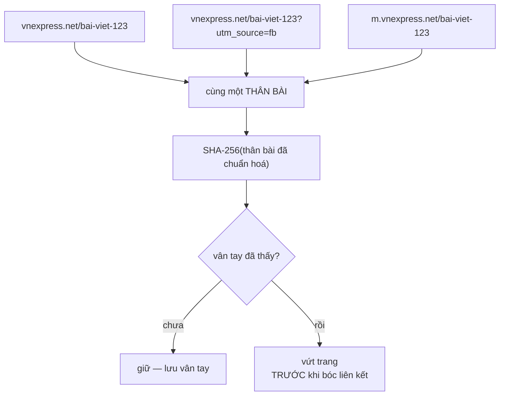

# ContentSeenFilter — khử trùng lặp theo NỘI DUNG

**File nguồn:** `crawler/ContentSeenFilter.java`
**Việc nó làm:** Trả lời câu hỏi *"nội dung của trang này đã lưu chưa?"* — khối `Content Seen?` trong sơ đồ kiến trúc crawler.

> 📖 Chưa quen ký hiệu toán? Đọc [00 — Từ điển ký hiệu toán](../00-KY-HIEU-TOAN.md) trước.

---

## 📌 Hiểu trong 30 giây

Crawler đã có [BloomFilter](BloomFilter.md) để không tải lại cùng một **địa chỉ**. Nhưng hai địa chỉ *khác nhau* vẫn có thể trả về *cùng một nội dung* — và trên báo điện tử Việt Nam đó là chuyện thường ngày.

Lớp này băm phần thân bài rồi đối chiếu với tập vân tay đã thấy. Trùng thì vứt trang, và vứt **trước** khi bóc liên kết.



```
   HAI MỨC CHỐNG TRÙNG — rất dễ nhầm là một

   ┌─ mức 1: URL Seen? ─────────────┐   ┌─ mức 2: Content Seen? ───────┐
   │ so sánh ĐỊA CHỈ                │   │ so sánh NỘI DUNG              │
   │ Bloom filter, 1,1 MB           │   │ SHA-256, tập vân tay          │
   │ chạy TRƯỚC khi tải             │   │ chạy SAU khi tải, TRƯỚC khi   │
   │                                │   │ bóc liên kết                  │
   │ bắt: cùng URL crawl 2 lần      │   │ bắt: 2 URL khác, 1 bài viết   │
   └────────────────────────────────┘   └───────────────────────────────┘
        ▲                                      ▲
        rẻ, chặn trước khi tốn mạng            đắt hơn, nhưng bắt được
                                               thứ mức 1 không thấy
```

**Vì sao vứt trước khi bóc liên kết.** Một trang trùng có cùng tập outlink với
bản gốc — bóc chúng ra chỉ để rồi bị `URL Seen?` loại hết là công vô ích. Quan
trọng hơn: nó làm **phình đồ thị PageRank** bằng những cạnh trùng lặp, khiến
trang đích được tính thêm uy tín một cách giả tạo.

---

## 1. Vì sao khử trùng theo URL là chưa đủ

[UrlCanonicalizer](UrlCanonicalizer.md) gom được các biến thể chỉ khác nhau về dấu `/` cuối, chữ hoa/thường, cổng mặc định, fragment. Nó cố ý **không** đụng tới query string, vì đó là phép chuẩn hoá không an toàn: đổi tham số có thể đổi hẳn trang trả về.

Hệ quả là bốn dạng trùng sau lọt hết qua tầng URL:

| Dạng trùng | Ví dụ |
|---|---|
| Cùng bài, hai chuyên mục | `/the-thao/bai-x` và `/bong-da/bai-x` |
| Bản in / bản AMP | `/bai-x` và `/amp/bai-x` |
| Khác tham số theo dõi | `/bai-x?utm_source=fb` và `/bai-x?utm_source=zalo` |
| Khác `www.` hoặc subdomain đồng bộ nội dung | `m.site.vn/bai-x` và `site.vn/bai-x` |

**Cái giá không chỉ là băng thông.** Các bản sao cùng lọt vào chỉ mục, cùng xuất hiện trong **một** trang kết quả, và làm nhiễu PageRank — một bài được đếm như nhiều trang độc lập, tự bơm uy tín cho nhau.

---

## 2. Vì sao băm chứ không so trực tiếp

So từng cặp nội dung là $O(n^2)$ phép so chuỗi. Với $n = 5.011$ trang, đó là hơn 12,5 triệu phép so, mỗi phép trên chuỗi vài nghìn ký tự.

Băm đưa bài toán về tra cứu tập hợp:

$$\text{chi phí} = \underbrace{O(\lvert d \rvert)}_{\text{băm một lần}} + \underbrace{O(1)}_{\text{tra cứu}}$$

Tổng cho cả phiên crawl là $O(\sum \lvert d \rvert)$ — tuyến tính theo tổng lượng văn bản, tức **bằng đúng chi phí đọc dữ liệu một lần**. Không thể rẻ hơn.

Và vân tay chiếm 64 ký tự bất kể trang dài bao nhiêu: với 5.011 trang, tập vân tay tốn khoảng **0,5 MB**, so với hàng trăm MB nếu giữ nội dung để so.

---

## 3. Chuẩn hoá trước khi băm — quan hệ tương đương

```java
private static String normalize(String text) {
    return text.toLowerCase(Locale.ROOT).replaceAll("\\s+", " ").trim();
}
```

Băm là hàm **rất nhạy**: đổi một ký tự thì toàn bộ vân tay đổi. Nên phép băm chỉ hữu ích khi đứng sau một phép chuẩn hoá.

Chuẩn hoá ở đây định nghĩa một **quan hệ tương đương** $\sim$ trên tập văn bản:

$$d_1 \sim d_2 \iff \text{normalize}(d_1) = \text{normalize}(d_2)$$

Hai văn bản thuộc cùng lớp tương đương khi chỉ khác nhau ở chữ hoa/thường và cách ngắt khoảng trắng. Đây đúng là hai thứ mà HTML sinh ra một cách tuỳ tiện: cùng một bài, nếu template đổi cách xuống dòng, `.text()` của Jsoup cho ra chuỗi khác — nhưng nội dung với người đọc thì y hệt.

Không có bước này, phép so vân tay gần như vô dụng trong thực tế.

---

## 4. Vì sao KHÔNG dùng Bloom Filter ở đây

Đây là câu hỏi hay nhất của trang này, vì `URL Seen?` ngay bên cạnh **có** dùng Bloom Filter cho đúng bài toán "đã thấy chưa".

Câu trả lời nằm ở **cái giá của false positive**, và nó bất đối xứng:

| Khối | False positive nghĩa là | Hậu quả |
|---|---|---|
| `URL Seen?` | báo "đã gặp" cho URL chưa gặp | bỏ lỡ **một trang** — tiếc nhưng vô hại |
| `Content Seen?` | báo "đã thấy" cho nội dung mới | **vứt hẳn một trang có nội dung riêng** khỏi corpus |

Với tỷ lệ $p = 0{,}01$ của Bloom Filter, crawl 5.011 trang sẽ **mất khoảng 50 trang** chỉ vì bộ lọc đoán nhầm — và mất im lặng, không cách nào biết.

Còn về quy mô: bộ lọc URL phải chứa **394.940** URL đã gặp, còn tập vân tay chỉ chứa **5.011** nội dung. Nhỏ hơn gần 80 lần, nên lưu chính xác hoàn toàn kham được.

> **Bài học:** chọn cấu trúc dữ liệu theo *cái giá của việc sai*, không chỉ theo *bài toán trông giống gì*. Hai khối cạnh nhau, cùng câu hỏi "đã thấy chưa", nhưng lời giải khác nhau.

---

## 5. SHA-256 có thể đụng độ không

Có, về lý thuyết. Xác suất tính bằng **nghịch lý ngày sinh**: với $n$ vân tay lấy từ không gian $2^{256}$ giá trị,

$$P(\text{đụng độ}) \approx \frac{n^2}{2 \cdot 2^{256}}$$

| $n$ | $P(\text{đụng độ})$ |
|---|---|
| $5 \times 10^3$ (corpus hiện tại) | $\approx 10^{-70}$ |
| $10^6$ | $\approx 4 \times 10^{-66}$ |
| $10^{12}$ (cỡ web thật) | $\approx 4 \times 10^{-54}$ |

Để dễ hình dung: xác suất đó nhỏ hơn xác suất đoán trúng một nguyên tử cụ thể trong toàn bộ Trái Đất, hai lần liên tiếp. Trong bài toán này, SHA-256 coi như **không bao giờ** đụng độ.

Đây là khác biệt căn bản với Bloom Filter: ở đó false positive là **hệ quả thiết kế** (đánh đổi lấy bộ nhớ), còn ở đây nó là **giới hạn lý thuyết** ở mức không đo được.

---

## 6. Test-and-set nguyên tử

```java
String fingerprint = fingerprint(bodyText);
boolean isNew = fingerprints.add(fingerprint);   // ConcurrentHashMap.newKeySet()
if (!isNew) duplicates.incrementAndGet();
return !isNew;
```

`Set.add` của `ConcurrentHashMap.newKeySet()` là **nguyên tử** và chỉ trả về `true` cho đúng một luồng. Nên khi 12 worker cùng lúc tải về hai bản sao của cùng một bài, đúng **một** bản đi tiếp.

Tách rời thành "hỏi rồi thêm" sẽ hỏng: hai worker cùng thấy "chưa có", cả hai cùng lưu, và bản trùng lọt lưới. Đây là cùng một lỗi mà [UrlSeenFilter](CrawlerService.md) phải xử lý bằng khối `synchronized`.

---

## 7. Văn bản rỗng được cho qua

```java
if (bodyText == null || bodyText.isBlank()) {
    blankSkipped.incrementAndGet();
    return false;                       // luôn coi là MỚI
}
```

Thân bài rỗng hầu như luôn là dấu hiệu **trích xuất thất bại** — trang dựng hoàn toàn bằng JavaScript, hoặc bị chặn bởi tường phí — chứ không phải các trang đó giống nhau.

Nếu coi chúng là trùng, chỉ trang lỗi **đầu tiên** được giữ và mọi trang lỗi sau đó bị vứt im lặng. Khi đó một sự cố ở tầng tải trang lại hiện ra như một thống kê "trùng lặp cao" ở tầng nội dung — sai chỗ, rất khó lần ra.

Đếm riêng bằng `getBlankSkippedCount()` để con số này hiện ra như **chỉ báo sức khoẻ của bộ trích xuất**, không trộn vào số bản trùng.

---

## 8. Hạn chế đã biết — chỉ bắt trùng CHÍNH XÁC

Đây là hạn chế lớn nhất, và cần nêu rõ trong báo cáo.

Chỉ cần khác **một ký tự** là hai vân tay khác nhau:

- một dòng "Cập nhật lúc 14:05";
- một banner quảng cáo lọt vào phần thân;
- số lượt xem, số bình luận in kèm trong bài.

Những ca đó lọt lưới hoàn toàn.

**Hướng nâng cấp: SimHash + khoảng cách Hamming.** Ý tưởng là thay hàm băm mật mã (nhạy tối đa) bằng một hàm băm **bảo toàn tương tự**: hai văn bản giống nhau 95% cho ra hai vân tay 64 bit chỉ khác nhau vài bit. Khi đó "trùng gần đúng" trở thành

$$d_{\text{Hamming}}(h_1, h_2) \le k$$

với $k \approx 3$ là ngưỡng Google từng công bố cho vân tay 64 bit. MinHash trên tập shingle là một lời giải khác cùng họ.

Đổi lại, phép chính xác hiện tại có một tính chất quý: nó **không bao giờ vứt nhầm** một trang thật sự khác nội dung. Sai lầm đó đắt hơn nhiều so với việc bỏ sót một bản trùng — cùng đúng lập luận ở §4.

---

## 9. Chủ đề DSA thể hiện

| Chủ đề | Ở đâu |
|---|---|
| **Hàm băm mật mã** | SHA-256 làm vân tay nội dung |
| **Nghịch lý ngày sinh** | ước lượng xác suất đụng độ (§5) |
| **Quan hệ tương đương và dạng chuẩn tắc** | `normalize()` (§3) |
| **Đánh đổi chính xác ↔ bộ nhớ** | tập băm chính xác vs Bloom Filter (§4) |
| **Test-and-set nguyên tử** | `ConcurrentHashMap.newKeySet().add()` (§6) |
| **Giảm $O(n^2)$ về $O(n)$** | băm thay cho so từng cặp (§2) |

---

## 10. Liên kết

- Khối trước và sau nó: [ContentParser-LinkExtractor.md](ContentParser-LinkExtractor.md)
- Người gọi: [CrawlerService.md](CrawlerService.md)
- Khử trùng lặp ở tầng URL: [BloomFilter.md](BloomFilter.md) · [UrlCanonicalizer.md](UrlCanonicalizer.md)
- Nơi bản trùng gây hại nếu lọt: [PageRankService.md](../05-ranking/PageRankService.md)
- Ký hiệu chưa hiểu: [00 — Từ điển ký hiệu toán](../00-KY-HIEU-TOAN.md)
