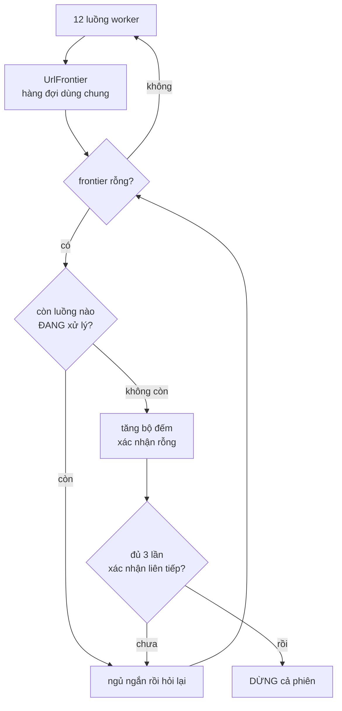

# CrawlerService — BFS đa luồng và bài toán "khi nào thì hết việc"

**File nguồn:** `search-engine/src/main/java/com/vnsearch/crawler/CrawlerService.java`
**Việc nó làm:** Điều phối $T$ worker thread cùng duyệt đồ thị web theo BFS, thu về 5.011 trang trong 3,2 phút.

> 📖 Chưa quen ký hiệu toán? Đọc [00 — Từ điển ký hiệu toán](../00-KY-HIEU-TOAN.md) trước.


> ### 🔄 Đã cập nhật sau đợt tái cấu trúc
>
> Phần **toán học và thuật toán** dưới đây vẫn đúng nguyên vẹn. Nhưng một số
> đoạn mã trích dẫn và mục *"Hạn chế đã biết"* mô tả **phiên bản trước**.
> Những gì đã thay đổi ở file này:
>
> - `CrawlConfig` nay là lớp riêng, **bất biến, dựng bằng Builder**, kiểm tra tính hợp lệ tập trung trong `build()`.
> - Tiến độ crawl nay phát qua **`CrawlListener`** (Observer) thay vì `System.out.printf` chôn trong worker.
> - Log dùng **SLF4J** thay `System.out`.
> - **Mỗi khối trong sơ đồ kiến trúc crawler nay là một lớp riêng.** `CrawlerService` chỉ còn *điều phối* — nó không tự tải, tự lọc, tự lưu nữa. Xem bảng ánh xạ ở §0.
>

---

## 0. Mỗi khối trong sơ đồ là một lớp

Lớp này không tự làm gì; nó nối các khối lại theo đúng sơ đồ kiến trúc crawler kinh điển:

```
seed URLs -> URL Frontier -> HTML Downloader -> Content Parser -> Content Seen? -(Yes)-> vut
                  ^                 |                                  |
                  |                 v                                  v (No)
                  |           DNS Resolver                      Content Storage
                  |                                                    |
                  |                                                    v
                  |                                             Link Extractor
                  |                                                    |
                  |                                                    v
                  |                                                URL Filter
                  |                                                    |
                  +--------------- (chua gap) -------------------  URL Seen? <-> URL Storage
```

| Khối | Lớp cài đặt |
|---|---|
| URL Frontier | [`UrlFrontier`](UrlFrontier.md) |
| DNS Resolver | `DnsResolver` — cache bằng [`LRUCache`](../06-datastructures/LRUCache.md) tự cài |
| HTML Downloader | `HtmlDownloader` |
| Content Parser | [`ContentParser`](ContentParser-LinkExtractor.md) |
| Content Seen? | [`ContentSeenFilter`](ContentSeenFilter.md) |
| Content Storage | `ContentStorage` |
| Link Extractor | [`LinkExtractor`](ContentParser-LinkExtractor.md) |
| URL Filter | `UrlFilter` (dùng [`RobotsTxtParser`](RobotsTxtParser.md)) |
| URL Seen? | `UrlSeenFilter` (bọc [`BloomFilter`](BloomFilter.md)) |
| URL Storage | `UrlStorage` |

**Thứ tự các khối không tuỳ tiện.** `Content Seen?` đứng trước `Link Extractor` nên trang trùng nội dung bị vứt mà không phải bóc liên kết. `URL Filter` đứng trước `URL Seen?` nên các luật rẻ chạy trước phép tra bộ lọc Bloom.

---

## 📌 Hiểu trong 30 giây

Web là một **đồ thị có hướng** gần như vô hạn về chiều sâu: đỉnh là trang, cạnh là liên kết. Crawl là bài toán **duyệt đồ thị với ngân sách hữu hạn**.

Ba câu hỏi phải trả lời, và câu thứ ba khó nhất:

1. **Duyệt theo thứ tự nào?** → BFS có ưu tiên (xem [UrlFrontier](UrlFrontier.md)).
2. **Làm sao không duyệt lại đỉnh cũ?** → Bloom Filter (xem [BloomFilter](BloomFilter.md)).
3. **Khi nào thì dừng?** → **Đây là phần riêng của lớp này, và nó tinh tế hơn vẻ ngoài rất nhiều.**



```
   VÌ SAO "frontier rỗng" KHÔNG đủ để dừng

   thời điểm t:  frontier rỗng           ⇒ tưởng xong
                 nhưng luồng #7 đang tải một trang
                       │
                       ▼
   thời điểm t+1: luồng #7 bóc được 40 outlink mới
                  frontier lại đầy
                       │
                  ⇒ nếu đã dừng ở t thì MẤT 40 URL đó

   Phải hỏi ĐỒNG THỜI hai điều:
     ① frontier rỗng          ②  KHÔNG luồng nào đang xử lý
   và xác nhận 3 lần liên tiếp để loại trừ ca đúng-lúc-giao-nhau.
```

**Vì sao 3 lần xác nhận chứ không 1.** Hai điều kiện ① và ② không đọc được
nguyên tử cùng lúc — giữa lúc đọc ① và đọc ② vẫn có khe hở. Ba lần xác nhận
liên tiếp, mỗi lần cách nhau một khoảng ngủ, đưa xác suất nhầm xuống mức mà
tài liệu này tính ra là $\approx 10^{-15}$.

Ở chế độ bus phân tán, hai hằng số này nới rộng hẳn (`IDLE_CONFIRMATIONS_BUS = 15`,
`IDLE_SLEEP_MS_BUS = 1000`) vì thông điệp có thể đang nằm trên đường truyền —
một trạng thái không tồn tại khi chạy trong một tiến trình.

Với một thread, câu 3 dễ: hàng đợi rỗng là hết việc. Với nhiều thread, **hàng đợi rỗng KHÔNG đồng nghĩa với hết việc** — một worker khác có thể đang fetch một trang và sắp thêm 78 outlink mới vào frontier ngay giây tới.

---

## 1. Vì sao BFS mà không phải DFS

**Vấn đề.** Web gần như vô hạn về chiều sâu. Nếu duyệt bằng DFS, crawler sẽ lao xuống một nhánh (chuyên mục → bài → bài liên quan → bài liên quan → …) và **không bao giờ quay lên**. Với ngân sách 5.000 trang, ta thu về một tập lệch hẳn và bỏ sót những trang quan trọng nằm ngay cạnh seed.

**Ý tưởng.** BFS duyệt theo **từng lớp độ sâu**, nên các trang thu được là những trang **gần seed nhất** — vốn thường là trang chủ và trang chuyên mục, tức là những trang quan trọng nhất.

**Số liệu minh hoạ, ước lượng theo hệ số phân nhánh thật $b = 78{,}8$:**

| Độ sâu | Số trang lý thuyết ở lớp đó | Cộng dồn |
|---|---|---|
| 0 | 6 (seed) | 6 |
| 1 | ~473 | ~479 |
| 2 | ~37 000 | vượt xa ngân sách 5.000 |

Nghĩa là với `maxPages = 5000`, crawler thực tế **chưa duyệt xong lớp 2**. Đó là lý do `maxDepth = 3` là quá đủ và tại sao BFS ở đây gần như tương đương "lấy các trang gần seed nhất".

> **Ghi chú về tính chính xác của mô hình:** con số 37 000 giả định các outlink không trùng nhau, điều hoàn toàn sai trên thực tế (mọi trang của một báo đều trỏ về trang chủ, menu, chuyên mục). Số đỉnh phân biệt thật nhỏ hơn nhiều — nhưng kết luận "chưa duyệt xong lớp 2" vẫn đúng.

---

## 2. Vòng lặp worker — cấu trúc

```java
private void workerLoop(CrawlConfig config) {
    int idleChecks = 0;

    while (pagesCrawled.get() < config.maxPages()) {
        UrlFrontier.Task task = frontier.nextUrl();
        if (task == null) {
            if (activeWorkers.get() == 0 && ++idleChecks >= idleConfirmations) {
                break; // thật sự hết việc
            }
            try { Thread.sleep(200); } catch (InterruptedException e) { ...; return; }
            continue;
        }
        idleChecks = 0; // chỉ tích luỹ khi LIÊN TỤC rỗng

        // URL Filter, mức ĐẮT: có thể phải tải robots.txt qua mạng.
        // Các luật rẻ đã chạy từ lúc URL được xếp vào hàng đợi.
        if (!urlFilter.isAllowedByRobots(task.url())) {
            continue;
        }

        activeWorkers.incrementAndGet();
        try {
            processPage(task, config);
        } finally {
            activeWorkers.decrementAndGet();
        }
    }
}
```

Một lượt đi qua toàn bộ chuỗi khối, cho đúng một URL:

```java
private void processPage(UrlFrontier.Task task, CrawlConfig config) {
    Document html;
    try {
        html = htmlDownloader.download(task.url());       // HTML Downloader -> DNS Resolver
    } catch (IOException e) {
        notifyError(task.url(), e);                       // <- Observer
        return;
    }

    WebDocument doc = contentParser.parse(task.url(), html);   // Content Parser

    if (contentSeenFilter.seenBefore(doc.getBodyText())) {     // Content Seen?
        notifyDuplicateContent(task.url());
        return;                                                // vut, KHONG boc lien ket
    }

    doc.setOutlinks(linkExtractor.extract(task.url(), html));  // Link Extractor
    if (!contentStorage.save(doc)) return;                     // Content Storage

    int count = pagesCrawled.incrementAndGet();
    doc.setDocId(count - 1);
    notifyPageCrawled(new CrawlListener.CrawlEvent(...));

    for (String outlink : doc.getOutlinks()) {
        enqueue(outlink, task.depth() + 1);
    }
}

/** Chang URL Filter -> URL Seen? -> URL Frontier. */
private void enqueue(String url, int depth) {
    if (!urlFilter.accept(url, depth)) return;            // URL Filter (muc re)
    if (!urlSeenFilter.markSeenIfNew(url)) return;        // URL Seen? -> URL Storage
    frontier.addUrl(url, depth, 1);                       // URL Frontier
}
```

**Thứ tự các phép lọc rất quan trọng** — xếp từ rẻ tới đắt:

| Thứ tự | Phép lọc | Ở đâu | Chi phí |
|---|---|---|---|
| 1 | `depth > maxDepth` | `UrlFilter.accept` | so sánh số nguyên — gần như 0 |
| 2 | scheme + host + đuôi tệp | `UrlFilter.accept` | phân tích URI + so chuỗi — $O(L)$ |
| 3 | `markSeenIfNew` | `UrlSeenFilter` | 2 lần băm + 7 lần đọc bit — $O(k)$ |
| 4 | `isAllowedByRobots` | `UrlFilter` | tra cache, có thể **fetch mạng** lần đầu |
| 5 | `download` | `HtmlDownloader` | **mạng**, tới 30 giây |

Đây là nguyên tắc **short-circuit theo chi phí tăng dần**: đặt phép kiểm tra rẻ nhất và loại nhiều nhất lên trước.

**Bước 1–3 chạy lúc XẾP HÀNG, bước 4–5 chạy lúc LẤY RA.** Đó là lý do `UrlFilter` có hai phương thức tách rời: `accept` (không chạm mạng, gọi khoảng 90 lần cho mỗi trang tải về) và `isAllowedByRobots` (có thể chạm mạng, gọi đúng một lần cho mỗi trang sắp tải). Gộp làm một sẽ khiến **mỗi liên kết bóc được** đều kéo theo một lần tra robots — vô nghĩa với những liên kết bị loại ngay từ luật rẻ nhất.

**Ghi nhận "đã gặp" cũng xảy ra lúc xếp hàng**, không phải lúc lấy ra. Ghi nhận muộn thì suốt khoảng thời gian URL nằm chờ trong frontier, nó vẫn bị coi là chưa gặp — và một worker khác có thể xếp nó vào lần nữa.

---

## 3. Bài toán trung tâm: phát hiện kết thúc phân tán

**Vấn đề, phát biểu chính xác.** Gọi $F$ = số URL trong frontier, $A$ = số worker đang xử lý một trang. Điều kiện "thật sự hết việc" là:

$$F = 0 \;\wedge\; A = 0$$

Chỉ kiểm tra $F = 0$ là **sai**, vì tồn tại khoảng thời gian mà $F = 0$ nhưng $A > 0$ — một worker đang fetch và sắp thêm hàng chục outlink.

**Hậu quả nếu làm sai:** các worker sẽ **chết dần** trong những khoảng trống tạm thời đó. Worker thứ nhất thấy frontier rỗng → thoát. Worker thứ hai cũng vậy. Đến khi worker đang fetch trả về outlink thì đã không còn ai nhặt. Phiên crawl dừng ở vài trăm trang thay vì 5.000.

**Lời giải: một bộ đếm nguyên tử + xác nhận nhiều lần.**

```java
private final AtomicInteger activeWorkers = new AtomicInteger(0);
```

```java
if (activeWorkers.get() == 0 && ++idleChecks >= idleConfirmations) {
    break;
}
```

### 3.1 Vì sao cần `idleConfirmations = 3` chứ không phải 1

Vì `frontier.nextUrl()` và `activeWorkers.get()` là **hai phép đọc riêng biệt, không nguyên tử với nhau**. Có một cửa sổ đua thật sự:

```
Thời điểm   Worker A                     Worker B
────────────────────────────────────────────────────────────────
t0          nextUrl() → null             đang chuẩn bị lấy task
t1                                       ĐÃ lấy task xong,
                                         CHƯA kịp incrementAndGet
t2          activeWorkers.get() == 0     ← đọc đúng vào khe hở!
t3          → tưởng hết việc             activeWorkers = 1, fetch...
```

Tại $t_2$, worker A quan sát một trạng thái **không phản ánh sự thật**. Đây không phải lỗi cài đặt mà là hệ quả tất yếu của việc **không có ảnh chụp nhất quán toàn cục** trong hệ thống đồng thời.

Yêu cầu điều kiện đúng **3 lần liên tiếp, cách nhau 200ms** biến xác suất nhầm từ "thỉnh thoảng" thành "gần như không bao giờ": khe hở giữa `nextUrl()` trả về và `incrementAndGet()` rộng cỡ **micro giây**, nên xác suất trúng nó ba lần liên tiếp cách nhau 200ms là tích của ba xác suất cực nhỏ.

$$P(\text{nhầm 3 lần liên tiếp}) \approx \left(\frac{\text{vài } \mu s}{200\,000\,\mu s}\right)^3 \approx 10^{-15}$$

**Và `idleChecks = 0` sau mỗi lần lấy được task** đảm bảo bộ đếm chỉ tích luỹ khi **liên tục** rỗng, không phải cộng dồn rải rác qua cả phiên crawl.

> **Đây là một heuristic, không phải một thuật toán đúng đắn có chứng minh.** Bài toán "phát hiện kết thúc phân tán" có lời giải chính xác — thuật toán **Dijkstra–Scholten** (đếm tham chiếu trên cây lan toả) hoặc **Safra** (thẻ bài vòng) — nhưng cả hai phức tạp hơn nhiều. Với một crawler đồ án, xác suất sai $10^{-15}$ là đánh đổi hoàn toàn hợp lý, miễn là **nói rõ đó là heuristic**.

### 3.2 `try / finally` là bắt buộc

```java
activeWorkers.incrementAndGet();
try {
    ...
} finally {
    activeWorkers.decrementAndGet();
}
```

Nếu `processPage` ném ngoại lệ mà không có `finally`, `activeWorkers` sẽ **không bao giờ về 0**, và điều kiện dừng **không bao giờ đúng** — mọi worker kẹt trong vòng lặp ngủ-thử-lại vô hạn cho tới khi hết `maxDurationMinutes`.

`processPage` có tới **ba** lối thoát sớm: tải lỗi, trùng nội dung, lưu thất bại. Mỗi lối thoát đó vẫn chạy qua `finally` — đó chính là lý do phải dùng `finally` chứ không đặt `decrementAndGet()` ở cuối khối. Tách `processPage` thành hàm riêng còn làm điều này an toàn hơn: mọi lối thoát nằm gọn trong một hàm, không cách nào lọt ra ngoài khối `try`.

---

## 4. Ba lớp bảo vệ chống chạy vô hạn

Crawler có **ba** cơ chế dừng độc lập, mỗi cơ chế chặn một kiểu hỏng khác nhau:

| Cơ chế | Chặn kiểu hỏng nào | Code |
|---|---|---|
| `maxPages` | Đủ dữ liệu thì dừng | `while (pagesCrawled.get() < config.maxPages)` |
| `maxDepth` | Lao quá sâu vào một nhánh | `UrlFilter.accept()` loại URL có `depth > maxDepth` |
| `maxDurationMinutes` | Mọi thứ khác hỏng | `latch.await(config.maxDurationMinutes, TimeUnit.MINUTES)` |

```java
CountDownLatch latch = new CountDownLatch(config.threadCount);
...
if (!latch.await(config.maxDurationMinutes(), TimeUnit.MINUTES)) {
    log.warn("Het tran thoi gian {} phut, dung crawl voi {} trang.",
            config.maxDurationMinutes(), pagesCrawled.get());
}
pool.shutdownNow();
```

**`CountDownLatch` hoạt động thế nào:** khởi tạo bằng $T$ (số thread), mỗi worker gọi `countDown()` khi kết thúc, `await()` chặn cho tới khi bộ đếm về 0 **hoặc** hết thời gian chờ. Đây là **rào chắn một chiều** — đếm xuống rồi không đếm lên lại được, đúng ngữ nghĩa "chờ tất cả xong".

`countDown()` nằm trong `finally` của worker để đảm bảo được gọi kể cả khi worker chết vì ngoại lệ — nếu không, `await()` sẽ chờ đủ 60 phút một cách vô ích.

Trần thời gian là **lưới an toàn cuối cùng**: nếu hai cơ chế trên đều hỏng vì một lỗi chưa lường trước, phiên crawl vẫn kết thúc.

---

## 5. Retry có giới hạn

```java
// HtmlDownloader.java - khoi "HTML Downloader" trong so do
public Document download(String url) throws IOException {
    dnsResolver.resolveHostOf(url);   // <- hoi DNS TRUOC, khong vao vong thu lai

    IOException lastError = null;
    for (int attempt = 0; attempt <= maxRetries; attempt++) {
        try {
            return Jsoup.connect(url)
                    .userAgent(USER_AGENT).timeout(timeoutMs).followRedirects(true).get();
        } catch (IOException e) {
            lastError = e;            // ghi nho, chua bao
        }
    }
    throw lastError;                  // <- CrawlerService bat roi phat qua Observer
}
```

**Vì sao hỏi DNS trước khi vào vòng thử lại.** Một tên miền không phân giải được sẽ khiến vòng lặp thử đủ 3 lần, mỗi lần chờ hết timeout 10 giây — **30 giây cho một URL vốn không bao giờ tải được**. Hỏi `DnsResolver` trước tốn vài mili giây (và thường trúng cache) nhưng loại được ca đó ngay lập tức.

**Vấn đề.** Lỗi mạng tạm thời (timeout, connection reset) rất thường xuyên khi crawl hàng nghìn trang. Bỏ luôn trang thì mất dữ liệu; thử lại vô hạn thì một URL chết treo cả worker.

**Chặn trên thời gian cho một URL chết:**

$$(\text{MAX\_RETRIES} + 1) \times \text{TIMEOUT} = 3 \times 10\text{s} = \mathbf{30\ giây}$$

Chỉ báo lỗi **một lần**, sau khi đã hết số lần thử — với 5.000 trang và tỉ lệ lỗi vài phần trăm, chênh lệch so với báo mỗi lần thử là hàng trăm dòng log.

**Việc *báo* đã tách khỏi việc *thực thi*.** Bản cũ gọi thẳng `System.out.printf` trong vòng lặp worker; bản hiện tại phát sự kiện qua `notifyError(url, lastError)`, và từng `CrawlListener` tự quyết định làm gì: in log, đẩy WebSocket, hoặc — trong test — **không đăng ký gì cả**. Xem [**07-OBSERVER.md**](../09-design-patterns/07-OBSERVER.md).

> **Ghi chú:** đây là retry đơn giản, **không có exponential backoff**. Với crawler nghiêm túc nên giãn khoảng chờ theo số lần thất bại ($1s, 2s, 4s, \dots$) để không dồn tải lên một server đang gặp sự cố. Ở đây politeness delay 1 giây đã tạo ra một mức giãn tối thiểu, nhưng không tăng theo số lần lỗi.

---

## 6. Cấp phát Bloom Filter theo quy mô thật

```java
visited = new BloomFilter(Math.max(200_000, config.maxPages * 200), 0.01);
```

Hệ số **200** chứ không phải 1 — và đây là một trong những dòng dễ viết sai nhất của cả dự án.

Bloom Filter này không chứa các trang **đã lưu**, mà chứa mọi URL **đã kiểm tra**. Mỗi trang sinh 78,8 outlink, mỗi outlink đi qua `mightContain`. Với `maxPages = 5000`, số phần tử thật là gần **400.000** chứ không phải 5.000.

Hậu quả nếu tính theo `maxPages`: $n$ thật gấp 80 lần $n$ thiết kế ⇒ tỉ lệ bit bật vọt lên gần 100% ⇒ **mọi** URL đều bị báo "đã thấy" ⇒ crawler dừng sau vài trang.

Chi tiết toán học ở [BloomFilter §6](BloomFilter.md).

---

## 7. Mô hình đồng thời — bảng tổng hợp

| Trạng thái chia sẻ | Kiểu | Vì sao kiểu đó |
|---|---|---|
| `frontier` | `UrlFrontier` (`synchronized` nội bộ) | Cần nguyên tử **nhóm** thao tác |
| `contentStorage` | `ConcurrentHashMap` bên trong | Chỉ cần nguyên tử **từng** `putIfAbsent` |
| `contentSeenFilter` | `ConcurrentHashMap.newKeySet()` | `add` là **test-and-set nguyên tử** |
| `pagesCrawled` | `AtomicInteger` | Đếm không mất mát **và** cấp docId |
| `activeWorkers` | `AtomicInteger` | Điều kiện dừng |
| `urlSeenFilter` | `volatile`, nội bộ `synchronized` | Gán lại đầu `crawl()`; xem bên dưới |

**Vì sao `pagesCrawled` vừa đếm vừa cấp docId.** Trước đây đây là **hai** `AtomicInteger` riêng: `docIdCounter` cấp id *trước* khi lưu, `pagesCrawled` đếm *sau* khi lưu. Mỗi lần lưu thất bại lại đốt một id, và dãy docId thủng lỗ. Dùng chung một bộ đếm, cấp id ngay *sau* khi lưu thành công:

```java
int count = pagesCrawled.incrementAndGet();
doc.setDocId(count - 1);
```

thì docId luôn **đặc** và bằng đúng $0..n-1$. `incrementAndGet()` là phép đọc-sửa-ghi nguyên tử, nên hai thread không thể nhận cùng một giá trị — nếu dùng `int` thường với `id++`, hai tài liệu khác nhau có thể nhận cùng docId, phá vỡ bất biến mà binary search của posting list dựa vào (xem [InvertedIndex §3](../03-index/InvertedIndex.md)).

**Vì sao `UrlSeenFilter` phải `synchronized` chứ không chỉ `volatile`.** `volatile` chỉ bảo đảm các worker thấy **tham chiếu** mới sau khi gán lại ở đầu `crawl()`; nó **không** bảo vệ nội dung bên trong. Mà `BloomFilter.add` thực hiện `bits[i] |= mask` — một phép đọc-sửa-ghi **không** nguyên tử trên `long[]`. Hai worker cùng bật hai bit khác nhau nằm trong *cùng một phần tử mảng* có thể làm mất một phép ghi.

Bit bị mất nghĩa là bộ lọc sinh **false negative**: báo "chưa gặp" cho một URL đã gặp — đúng thứ mà [BloomFilter](BloomFilter.md) khẳng định không bao giờ xảy ra *khi dùng một luồng*. `UrlSeenFilter` bọc mọi truy cập trong khối `synchronized` nên tính chất đó được khôi phục, đồng thời biến "hỏi rồi ghi nhận" thành **một** thao tác nguyên tử.

---

## 8. `CrawlConfig` — Builder kiểu fluent

```java
public static class CrawlConfig {
    public int maxDepth = 3;
    public int maxPages = 100;
    public int threadCount = 4;
    public Set<String> allowedDomains = Set.of();
    public int maxDurationMinutes = 60;

    public CrawlConfig maxDepth(int v) { this.maxDepth = v; return this; }
    public CrawlConfig maxPages(int v) { this.maxPages = v; return this; }
    ...
}
```

Mỗi setter `return this` nên gọi được nối chuỗi:

```java
CrawlerService.CrawlConfig config = new CrawlerService.CrawlConfig()
        .maxDepth(maxDepth)
        .maxPages(maxPages)
        .threadCount(allowedDomains.size() * 2)
        .allowedDomains(allowedDomains)
        .maxDurationMinutes(90);
```

**Vì sao tốt hơn constructor 6 tham số:** `new CrawlConfig(3, 5000, 12, domains, 90, "data/seen.txt")` không đọc được — người đọc phải tra thứ tự tham số. Fluent setter làm mỗi giá trị **tự giải thích tên**.

> ✅ **Đã khắc phục.** Bản trích ở trên là `CrawlConfig` **cũ**: trường `public`, sửa được **sau khi** đã dùng, và không kiểm tra hợp lệ ở đâu cả. Bản hiện tại là một object **bất biến hoàn toàn**, dựng qua `CrawlConfig.builder()…build()`, với mọi ràng buộc kiểm tra tập trung trong `build()` và `Set.copyOf` làm bản sao phòng thủ cho `allowedDomains`. 10 test riêng, gồm 2 test cho bản sao phòng thủ.
>
> Phân tích đầy đủ: [**08-BUILDER.md**](../09-design-patterns/08-BUILDER.md).

---

## 9. Số đo thực tế

| Phép đo | Kết quả |
|---|---|
| Thời gian crawl 5.011 trang | **3,2 phút** |
| Thông lượng | **26,2 trang/giây** (trần lý thuyết 52 do politeness) |
| Số host phân biệt | **52** |
| Tổng outlink thu được | **394.940** (trung bình **78,8**/trang) |
| Số cạnh trong đồ thị PageRank (outlink trỏ **vào** corpus) | **239.691** |
| — liên kết nội bộ domain | 197.689 (82,5 %) |
| — **liên kết chéo domain** | **42.002 (17,5 %)** |
| Kích thước `data/crawled-documents.json` | 62 MB |

**Đọc con số 17,5 % thế nào.** Đây là tỉ lệ quyết định xem PageRank có ý nghĩa hay không. Liên kết **nội bộ** một tờ báo phản ánh cấu trúc điều hướng (menu, chuyên mục, "bài liên quan") chứ không phản ánh uy tín. Chỉ liên kết **chéo** giữa các site độc lập mới là "phiếu bầu" thật.

Corpus cũ 150 trang **một domain** có 0 % liên kết chéo — PageRank khi đó đo cấu trúc menu của vnexpress.net. Đó chính là lý do `MultiDomainCrawlRunner` tồn tại.

---

## 10. Tổng hợp độ phức tạp

| Thao tác | Thời gian |
|---|---|
| Một vòng worker (một trang) | $O(\log n_d + D)$ lấy URL + $O(k)$ Bloom + **$O(\text{mạng})$** fetch + $O(\lvert\text{HTML}\rvert)$ trích xuất + $O(b \log n_d)$ thêm outlink |
| Toàn phiên crawl | $O(P \cdot (D + b\log n_d))$ **cộng** chi phí mạng |

với $P$ = số trang, $b$ = số outlink/trang, $D$ = số host.

**Điểm quan trọng nhất về độ phức tạp:** toàn bộ phiên crawl **hoàn toàn bị chi phối bởi độ trễ mạng và politeness delay**, không phải bởi thuật toán. Phần thuật toán tốn cỡ **65 thao tác** mỗi trang; phần mạng tốn cỡ **38 mili giây**. Tỉ lệ là khoảng 1 : 500.000.

Đó cũng là lý do bản dùng một heap toàn cục mới thảm hoạ đến thế: nó đẩy phần thuật toán từ 65 lên 7,3 triệu thao tác, tức từ "không đáng kể" thành "chậm hơn cả mạng".

---

## 11. Chủ đề DSA thể hiện

| Chủ đề | Ở đâu |
|---|---|
| **BFS trên đồ thị** | duyệt web theo lớp độ sâu |
| **Đồ thị ẩn** | đỉnh/cạnh sinh ra dần khi fetch, không lưu sẵn |
| **Hàng đợi ưu tiên** | `UrlFrontier` |
| **Cấu trúc dữ liệu xác suất** | `BloomFilter` chống duyệt lại |
| **Thread pool / producer–consumer** | `ExecutorService` + frontier chia sẻ |
| **Biến nguyên tử** | `AtomicInteger` cho docId, bộ đếm |
| **Phát hiện kết thúc phân tán** | `activeWorkers` + `IDLE_CONFIRMATIONS` |
| **Rào chắn đồng bộ** | `CountDownLatch` + `await` có thời hạn |
| **Short-circuit theo chi phí** | thứ tự các phép lọc từ rẻ tới đắt |
| **Retry có chặn trên** | $3 \times 10$s |
| **Ước lượng tham số theo dữ liệu đo** | `maxPages * 200` từ 78,8 outlink/trang |

---

## 12. Hạn chế đã biết

1. **Điều kiện dừng là heuristic**, không có chứng minh đúng đắn (xem §3.1).
2. **Không có exponential backoff** khi retry.
3. **`docId` cấp theo thứ tự hoàn thành**, nên nó **không** phản ánh thứ tự BFS. Không sai (id vẫn đặc và duy nhất), nhưng `docId` nhỏ không đồng nghĩa với "gần seed".
4. **Không xử lý trang lỗi mềm.** Trang 404 trả về HTML "không tìm thấy" với mã 200 vẫn được index như một tài liệu bình thường.
5. **`Content Seen?` chỉ bắt trùng chính xác** — khác một ký tự là lọt lưới. Cần SimHash cho trùng gần đúng, xem [ContentSeenFilter §8](ContentSeenFilter.md).
6. **`URL Storage` chưa khôi phục được hàng đợi.** Nó lưu bền các URL *đã gặp*, nên phiên sau không tải lại trang cũ — nhưng frontier thì không được lưu, nên "tiếp tục một phiên crawl dang dở" vẫn chưa thật sự làm được.
7. **Không render JavaScript.** Trang dựng hoàn toàn bằng JS cho ra thân bài rỗng; `ContentSeenFilter.getBlankSkippedCount()` là chỉ báo cho tình trạng này.

**Đã khắc phục so với bản trước:** lọc theo đuôi tệp (`UrlFilter` loại PDF/ảnh/video **trước** khi vào frontier, không còn tốn 30 giây retry vô ích); log bằng SLF4J thay `System.out.printf`; khử trùng lặp nội dung bằng `ContentSeenFilter`.

---

## 13. Liên kết

- Hàng đợi và politeness: [UrlFrontier.md](UrlFrontier.md)
- Khử trùng lặp: [BloomFilter.md](BloomFilter.md) · [UrlCanonicalizer.md](UrlCanonicalizer.md)
- Luật crawl: [RobotsTxtParser.md](RobotsTxtParser.md)
- Trích xuất nội dung: [ContentParser-LinkExtractor.md](ContentParser-LinkExtractor.md)
- Bước tiếp theo trong pipeline: [VietnameseTokenizer.md](../03-index/VietnameseTokenizer.md)
- Ký hiệu chưa hiểu: [00 — Từ điển ký hiệu toán](../00-KY-HIEU-TOAN.md)
