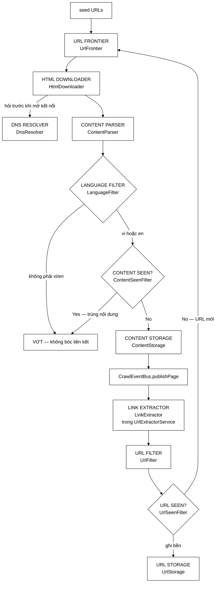
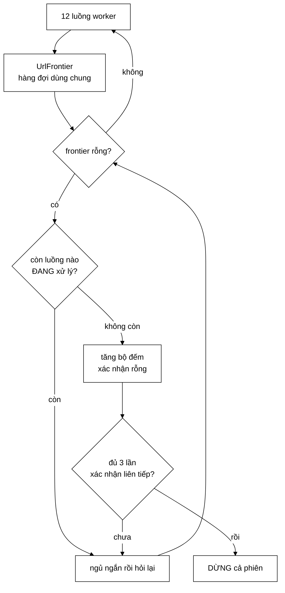
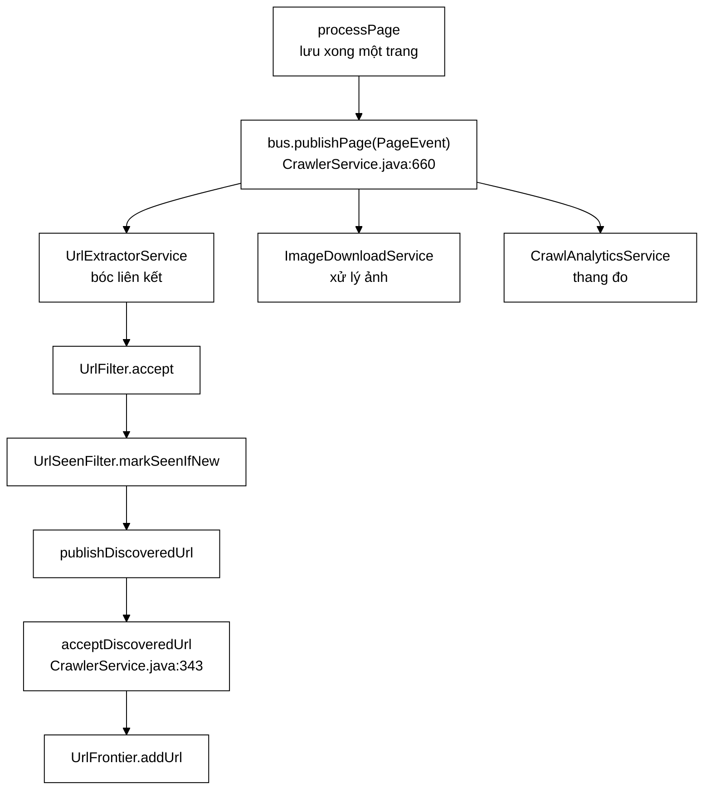
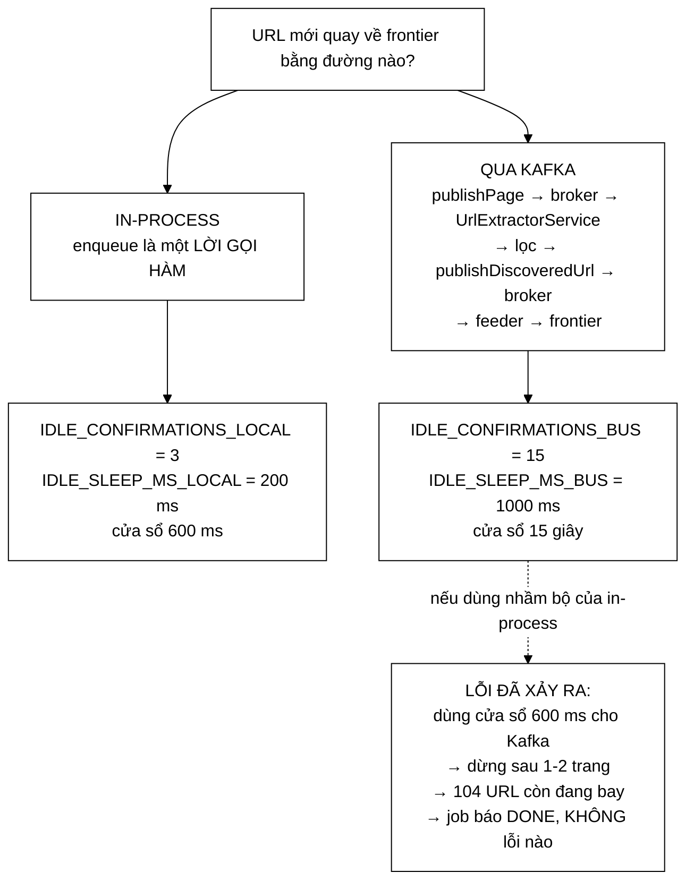
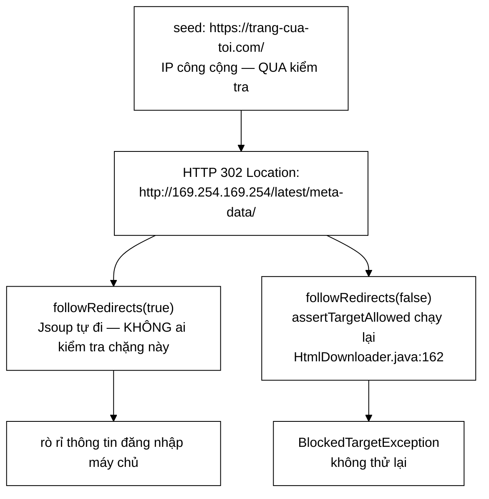

# CrawlerService — BFS đa luồng và bài toán "khi nào thì hết việc"

**File nguồn:** `search-engine/src/main/java/com/vnsearch/crawler/CrawlerService.java`
**Việc nó làm:** Điều phối $T$ worker thread cùng duyệt đồ thị web theo BFS, thu về 5.011 trang trong 3,2 phút.

> 📖 Chưa quen ký hiệu toán? Đọc [00 — Từ điển ký hiệu toán](../00-KY-HIEU-TOAN.md) trước.


> ### 🔄 Đã đồng bộ với code — mọi đoạn mã dưới đây được trích từ bản hiện hành
>
> Trang này từng trích **code của phiên bản cũ**. Toàn bộ đã được thay bằng mã
> thật, kèm số dòng bấm được. Bốn đợt tái cấu trúc đã đi qua lớp này:
>
> | Đợt | Đổi gì | Ảnh hưởng tới trang này |
> |---|---|---|
> | Tách khối | Mỗi khối trong sơ đồ thành **một lớp riêng**; `CrawlerService` chỉ còn điều phối | §0 — bảng ánh xạ |
> | Builder + Observer | `CrawlConfig` **bất biến**; tiến độ phát qua `CrawlListener`; log bằng **SLF4J** | §8 |
> | **Lọc ngôn ngữ** | Thêm khối `LanguageFilter` **giữa** `Content Parser` và `Content Seen?` | §0, §2 — sơ đồ cũ **thiếu hẳn khối này** |
> | **Bus sự kiện** | `processPage` không còn gọi thẳng `LinkExtractor`; nó **phát `PageEvent` lên `CrawlEventBus`**, ba Modular Service phía sau tự lấy phần mình | §2 — đoạn mã cũ mô tả kiến trúc **đã bị thay** |
> | **Chống SSRF** | `HtmlDownloader` **tự đi từng chặng chuyển hướng**, kiểm tra đích trước mỗi lần mở kết nối | §5 — đoạn mã cũ dùng `followRedirects(true)`, nay là `false` |
>
> Phần **toán học và thuật toán** không bị ảnh hưởng bởi bất kỳ đợt nào ở trên —
> điều kiện dừng, độ phức tạp, phân tích tương tranh đều đúng nguyên vẹn.
>

---

## 0. Mỗi khối trong sơ đồ là một lớp

Lớp này không tự làm gì; nó nối các khối lại theo đúng sơ đồ kiến trúc crawler kinh điển.

> **Dẫn chứng.** Sơ đồ dưới đây **không phải do trang tài liệu này vẽ ra** — nó
> được chép từ chính Javadoc của lớp, `CrawlerService.java:37-57`. Hai bên lệch
> nhau là lỗi thấy được ngay.



<details>
<summary><b>Xem bản chữ (ASCII)</b></summary>

```
seed URLs -> URL Frontier -> HTML Downloader -> Content Parser -> Language Filter
                  ^                 |                              (khong vi/en) -> vut
                  |                 v                                    |
                  |           DNS Resolver                               v
                  |                                              Content Seen? -(Yes)-> vut
                  |                                                      | (No)
                  |                                                      v
                  |                                              Content Storage
                  |                                                      |
                  |                                                      v
                  |                                        CrawlEventBus.publishPage
                  |                                                      |
                  |                                                      v
                  |                                              Link Extractor
                  |                                                      |
                  |                                                      v
                  |                                                  URL Filter
                  |                                                      |
                  +--------------- (chua gap) -----------------  URL Seen? <-> URL Storage
```

</details>

| Khối | Lớp cài đặt | Dẫn chứng |
|---|---|---|
| URL Frontier | [`UrlFrontier`](UrlFrontier.md) | `CrawlerService.java:145` |
| DNS Resolver | `DnsResolver` — cache bằng [`LRUCache`](../05-datastructures/LRUCache.md) tự cài | `CrawlerService.java:146` |
| HTML Downloader | `HtmlDownloader` | `CrawlerService.java:147` |
| Content Parser | [`ContentParser`](ContentParser-LinkExtractor.md) | `CrawlerService.java:148` |
| **Language Filter** | **`LanguageFilter`** — giữ `vi` và `en` | **`CrawlerService.java:149`** |
| Content Seen? | [`ContentSeenFilter`](ContentSeenFilter.md) | `CrawlerService.java:150` |
| Content Storage | `ContentStorage` | `CrawlerService.java:151` |
| Link Extractor | [`LinkExtractor`](ContentParser-LinkExtractor.md) | **không còn ở đây** — `UrlExtractorService`, xem §2.1 |
| URL Filter | `UrlFilter` (dùng [`RobotsTxtParser`](RobotsTxtParser.md)) | `CrawlerService.java:201`, cấp lại mỗi phiên ở `:404` |
| URL Seen? | `UrlSeenFilter` (bọc [`BloomFilter`](BloomFilter.md)) | `CrawlerService.java:202`, cấp lại ở `:406` |
| URL Storage | `UrlStorage` | `CrawlerService.java:401-403` |

**Thứ tự các khối không tuỳ tiện — ba chỗ có lý do cụ thể.**

| Cặp | Vì sao thứ tự đó | Dẫn chứng |
|---|---|---|
| `Content Seen?` **trước** `Link Extractor` | Trang trùng nội dung bị vứt mà không phải bóc liên kết | `CrawlerService.java:626-629` |
| `URL Filter` **trước** `URL Seen?` | Luật rẻ chạy trước phép tra Bloom | `CrawlerService.java:703-711` |
| **`Language Filter` trước `Content Seen?`** | Trang ngoại ngữ **không tốn một lần băm SHA-256**, và quan trọng hơn: **không bị bóc liên kết**, nên crawler không đi sâu thêm vào vùng ngoại ngữ rồi vứt tiếp | `CrawlerService.java:617-623` |

---

## 📌 Hiểu trong 30 giây

Web là một **đồ thị có hướng** gần như vô hạn về chiều sâu: đỉnh là trang, cạnh là liên kết. Crawl là bài toán **duyệt đồ thị với ngân sách hữu hạn**.

Ba câu hỏi phải trả lời, và câu thứ ba khó nhất:

1. **Duyệt theo thứ tự nào?** → BFS có ưu tiên (xem [UrlFrontier](UrlFrontier.md)).
2. **Làm sao không duyệt lại đỉnh cũ?** → Bloom Filter (xem [BloomFilter](BloomFilter.md)).
3. **Khi nào thì dừng?** → **Đây là phần riêng của lớp này, và nó tinh tế hơn vẻ ngoài rất nhiều.**



```
   VÌ SAO "frontier rỗng" KHÔNG đủ để dừng

   thời điểm t:  frontier rỗng           ⇒ tưởng xong
                 nhưng luồng #7 đang tải một trang
                       │
                       ▼
   thời điểm t+1: luồng #7 bóc được 40 outlink mới
                  frontier lại đầy
                       │
                  ⇒ nếu đã dừng ở t thì MẤT 40 URL đó

   Phải hỏi ĐỒNG THỜI hai điều:
     ① frontier rỗng          ②  KHÔNG luồng nào đang xử lý
   và xác nhận 3 lần liên tiếp để loại trừ ca đúng-lúc-giao-nhau.
```

**Vì sao 3 lần xác nhận chứ không 1.** Hai điều kiện ① và ② không đọc được
nguyên tử cùng lúc — giữa lúc đọc ① và đọc ② vẫn có khe hở. Ba lần xác nhận
liên tiếp, mỗi lần cách nhau một khoảng ngủ, đưa xác suất nhầm xuống mức mà
tài liệu này tính ra là $\approx 10^{-15}$.

Ở chế độ bus phân tán, hai hằng số này nới rộng hẳn (`IDLE_CONFIRMATIONS_BUS = 15`,
`IDLE_SLEEP_MS_BUS = 1000`) vì thông điệp có thể đang nằm trên đường truyền —
một trạng thái không tồn tại khi chạy trong một tiến trình.

Với một thread, câu 3 dễ: hàng đợi rỗng là hết việc. Với nhiều thread, **hàng đợi rỗng KHÔNG đồng nghĩa với hết việc** — một worker khác có thể đang fetch một trang và sắp thêm 78 outlink mới vào frontier ngay giây tới.

---

## 1. Vì sao BFS mà không phải DFS

**Vấn đề.** Web gần như vô hạn về chiều sâu. Nếu duyệt bằng DFS, crawler sẽ lao xuống một nhánh (chuyên mục → bài → bài liên quan → bài liên quan → …) và **không bao giờ quay lên**. Với ngân sách 5.000 trang, ta thu về một tập lệch hẳn và bỏ sót những trang quan trọng nằm ngay cạnh seed.

**Ý tưởng.** BFS duyệt theo **từng lớp độ sâu**, nên các trang thu được là những trang **gần seed nhất** — vốn thường là trang chủ và trang chuyên mục, tức là những trang quan trọng nhất.

**Số liệu minh hoạ, ước lượng theo hệ số phân nhánh thật $b = 78{,}8$:**

| Độ sâu | Số trang lý thuyết ở lớp đó | Cộng dồn |
|---|---|---|
| 0 | 6 (seed) | 6 |
| 1 | ~473 | ~479 |
| 2 | ~37 000 | vượt xa ngân sách 5.000 |

Nghĩa là với `maxPages = 5000`, crawler thực tế **chưa duyệt xong lớp 2**. Đó là lý do `maxDepth = 3` là quá đủ và tại sao BFS ở đây gần như tương đương "lấy các trang gần seed nhất".

> **Ghi chú về tính chính xác của mô hình:** con số 37 000 giả định các outlink không trùng nhau, điều hoàn toàn sai trên thực tế (mọi trang của một báo đều trỏ về trang chủ, menu, chuyên mục). Số đỉnh phân biệt thật nhỏ hơn nhiều — nhưng kết luận "chưa duyệt xong lớp 2" vẫn đúng.

---

## 2. Vòng lặp worker — cấu trúc

**`CrawlerService.java:563-601`** — vòng lặp worker:

```java
private void workerLoop(CrawlConfig config) {
    final int idleConfirmations = ownsBus ? IDLE_CONFIRMATIONS_LOCAL : IDLE_CONFIRMATIONS_BUS;
    final long idleSleepMs = ownsBus ? IDLE_SLEEP_MS_LOCAL : IDLE_SLEEP_MS_BUS;
    int idleChecks = 0;

    while (pagesCrawled.get() < config.maxPages()) {
        CrawlTask task = frontier.nextUrl(); // URL Frontier
        if (task == null) {
            if (activeWorkers.get() == 0 && ++idleChecks >= idleConfirmations) {
                break; // thật sự hết việc
            }
            try {
                Thread.sleep(idleSleepMs);
            } catch (InterruptedException e) {
                Thread.currentThread().interrupt();
                return;
            }
            continue;
        }
        idleChecks = 0; // chỉ tích luỹ khi LIÊN TỤC rỗng

        // URL Filter, mức đắt: có thể phải tải robots.txt qua mạng. Các
        // luật rẻ đã chạy từ lúc URL được xếp vào hàng đợi.
        if (!urlFilter.isAllowedByRobots(task.url())) {
            continue;
        }

        activeWorkers.incrementAndGet();
        try {
            processPage(task, config);
        } finally {
            activeWorkers.decrementAndGet();
        }
    }
}
```

> ⚠️ **Hai hằng số, không phải một.** `idleConfirmations` và `idleSleepMs` được
> chọn theo chế độ chạy (`CrawlerService.java:136-142`) — xem §3.3. Bản trước
> của trang này ghi cứng `Thread.sleep(200)`, đúng cho chế độ in-process nhưng
> sai hẳn cho chế độ Kafka.

Một lượt đi qua toàn bộ chuỗi khối, cho đúng một URL — **`CrawlerService.java:604-676`**:

```java
private void processPage(CrawlTask task, CrawlConfig config) {
    Document html;
    try {
        html = htmlDownloader.download(task.url()); // HTML Downloader -> DNS Resolver
    } catch (IOException e) {
        notifyError(task.url(), e);
        return;
    }

    WebDocument doc = contentParser.parse(task.url(), html); // Content Parser

    // Language Filter — chỉ giữ tiếng Việt và tiếng Anh.
    if (!languageFilter.accept(doc)) {
        notifyForeignLanguage(task.url(), doc.getLanguage());
        return;
    }

    // Content Seen? — nhánh "Yes": vứt, KHÔNG bóc liên kết.
    if (contentSeenFilter.seenBefore(doc.getBodyText())) {
        notifyDuplicateContent(task.url());
        return;
    }

    if (!contentStorage.save(doc)) { // Content Storage
        return;
    }

    int count = pagesCrawled.incrementAndGet();
    doc.setDocId(restoredDocCount + count - 1);

    // ─── Ranh giới giữa crawler và cụm Modular Services ───
    bus.publishPage(new PageEvent(
            task.url(), hostOf(task.url()), task.depth(),
            doc.getTitle(), doc.getBodyText(), doc.getLanguage(),
            html.outerHtml(),
            ContentSeenFilter.fingerprint(...),
            doc.getCrawledAt() != null ? doc.getCrawledAt() : Instant.now(),
            jobId));

    notifyPageCrawled(new CrawlListener.CrawlEvent(...));
}
```

**Ba khác biệt so với bản mã cũ mà trang này từng trích**, mỗi khác biệt có lý do riêng:

| Cũ | Nay | Vì sao |
|---|---|---|
| `UrlFrontier.Task` | `CrawlTask` | Lớp tách ra gói `crawler.frontier`, `CrawlTask.java` |
| `doc.setDocId(count - 1)` | `doc.setDocId(restoredDocCount + count - 1)` | Phiên **nối tiếp** corpus cũ không được cấp lại docId đã dùng — `CrawlerService.java:216-224` |
| `linkExtractor.extract(...)` rồi lặp `enqueue` | `bus.publishPage(...)` | Xem §2.1 |

### 2.1 Vì sao `LinkExtractor` biến mất khỏi `processPage`

Đây là thay đổi kiến trúc lớn nhất của lớp này, và bản trước của trang mô tả sai hoàn toàn.



<details>
<summary><b>Xem bản chữ (ASCII)</b></summary>

```
   processPage lưu xong một trang
              │
              ▼
   bus.publishPage(PageEvent)                    CrawlerService.java:660
              │
      ┌───────┼───────────────┬──────────────────┐
      ▼       ▼               ▼                  ▼
 UrlExtractor  ImageDownload  CrawlAnalytics
 Service       Service        Service
      │
      ├─► LinkExtractor.extract
      ├─► UrlFilter.accept              (luật rẻ)
      ├─► UrlSeenFilter.markSeenIfNew   (nguyên tử)
      └─► publishDiscoveredUrl ──► acceptDiscoveredUrl ──► UrlFrontier.addUrl
                                       CrawlerService.java:343
```

</details>

**Cái được:** cùng **một đường mã** chạy được ở cả hai chế độ — in-process (bus
gọi thẳng, `CrawlerService.java:246-250`) và Kafka (service ở tiến trình khác,
`:262-279`). Không có nhánh `if (in-process)` nào, tức không có nhánh nào chỉ
chạy ở môi trường thật mà test không chạm tới.

**Cái mất, và code nói thẳng ra** (`CrawlerService.java:650-655`):

> `html.outerHtml()` kết xuất lại cây DOM thành chuỗi, và ở chế độ in-process
> thì `UrlExtractorService` phân tích chuỗi đó lần nữa — khoảng **3–8 ms mỗi
> trang**, tức DOM bị dựng hai lần.

**Vì sao phần tải trang KHÔNG thành một service nữa:** nó là thứ duy nhất phải
tôn trọng chính sách lịch sự theo host, mà chính sách đó gắn liền với
`UrlFrontier` (`CrawlerService.java:657-659`).

**Chặng `URL Filter → URL Seen? → URL Frontier`** vẫn còn nguyên trong lớp này,
nhưng chỉ dùng cho **seed** và cho **phiên nối tiếp** — `CrawlerService.java:703-712`:

```java
private boolean enqueue(String url, int depth) {
    if (!urlFilter.accept(url, depth)) { // URL Filter
        return false;
    }
    if (!urlSeenFilter.markSeenIfNew(url)) { // URL Seen? -> URL Storage
        return false;
    }
    frontier.addUrl(url, depth, 1); // URL Frontier
    return true;
}
```

> ⚠️ **Bẫy đã có người vấp thật.** `acceptDiscoveredUrl` (`:343-348`) **không**
> lọc lại, nó gọi thẳng `frontier.addUrl`. Javadoc ở `:338-341` giải thích: hai
> phép lọc đã chạy tại `UrlExtractorService`, chạy lại thì `markSeenIfNew` trả
> `false` cho **chính URL vừa được ghi nhận** và không URL nào vào được frontier
> — crawler dừng ngay sau các seed.

**Thứ tự các phép lọc rất quan trọng** — xếp từ rẻ tới đắt:

| Thứ tự | Phép lọc | Ở đâu | Chi phí |
|---|---|---|---|
| 1 | `depth > maxDepth` | `UrlFilter.accept` | so sánh số nguyên — gần như 0 |
| 2 | scheme + host + đuôi tệp | `UrlFilter.accept` | phân tích URI + so chuỗi — $O(L)$ |
| 3 | `markSeenIfNew` | `UrlSeenFilter` | 2 lần băm + 7 lần đọc bit — $O(k)$ |
| 4 | `isAllowedByRobots` | `UrlFilter` | tra cache, có thể **fetch mạng** lần đầu |
| 5 | `download` | `HtmlDownloader` | **mạng**, tới 30 giây |

Đây là nguyên tắc **short-circuit theo chi phí tăng dần**: đặt phép kiểm tra rẻ nhất và loại nhiều nhất lên trước.

**Bước 1–3 chạy lúc XẾP HÀNG, bước 4–5 chạy lúc LẤY RA.** Đó là lý do `UrlFilter` có hai phương thức tách rời — `UrlFilter.java:166` và `:217`:

- `accept(url, depth)` — không chạm mạng, gọi **~79 lần cho mỗi trang** tải về *(mốc A: 78,8 outlink/trang)*
- `isAllowedByRobots(url)` — có thể chạm mạng, gọi **đúng một lần** cho mỗi trang sắp tải

Gộp làm một sẽ khiến **mỗi liên kết bóc được** đều kéo theo một lần tra robots — vô nghĩa với những liên kết bị loại ngay từ luật rẻ nhất. Javadoc của lớp nói đúng điều này ở `UrlFilter.java:26-27`.

**`accept` có SÁU nguyên nhân loại, không phải bốn** — mỗi nguyên nhân một bộ đếm riêng (`UrlFilter.java:126-132`):

| Thứ tự chạy | Nguyên nhân | Bộ đếm | Dòng |
|---|---|---|---|
| 1 | `depth > maxDepth` | `rejectedByDepth` | `:167` |
| 2 | URL rỗng / không phân tích được / sai scheme / không có host | `rejectedByScheme` | `:171-194` |
| 3 | ngoài `allowedDomains` | `rejectedByDomain` | `:195` |
| 4 | **subdomain ngoại ngữ** (`cn.`, `ja.`, `ru.`…) | `rejectedByHostPrefix` | `:199` |
| 5 | đuôi tệp bị chặn (48 đuôi) | `rejectedByExtension` | `:203` |
| 6 | `robots.txt` cấm — **chạy ở `isAllowedByRobots`, không ở `accept`** | `rejectedByRobots` | `:220` |

> ⚠️ Nguyên nhân số 4 được thêm **sau** đợt crawl 30.001 trang, khi phát hiện
> **12.677 trang (42,3 %)** trong corpus không phải tiếng Việt. Javadoc
> `UrlFilter.java:58-106` là một trong những đoạn giải thích kỹ nhất repo — nó
> chỉ ra vì sao `host.endsWith(domain)` kéo theo `cn.nhandan.vn`, và vì sao
> tiếng Trung là ca tệ nhất (tokenizer trả về **2 token cho cả một mệnh đề**,
> tài liệu vào chỉ mục nhưng **vĩnh viễn không tìm được**).

**Ghi nhận "đã gặp" cũng xảy ra lúc xếp hàng**, không phải lúc lấy ra. Ghi nhận muộn thì suốt khoảng thời gian URL nằm chờ trong frontier, nó vẫn bị coi là chưa gặp — và một worker khác có thể xếp nó vào lần nữa.

---

## 3. Bài toán trung tâm: phát hiện kết thúc phân tán

**Vấn đề, phát biểu chính xác.** Gọi $F$ = số URL trong frontier, $A$ = số worker đang xử lý một trang. Điều kiện "thật sự hết việc" là:

$$F = 0 \;\wedge\; A = 0$$

Chỉ kiểm tra $F = 0$ là **sai**, vì tồn tại khoảng thời gian mà $F = 0$ nhưng $A > 0$ — một worker đang fetch và sắp thêm hàng chục outlink.

**Hậu quả nếu làm sai:** các worker sẽ **chết dần** trong những khoảng trống tạm thời đó. Worker thứ nhất thấy frontier rỗng → thoát. Worker thứ hai cũng vậy. Đến khi worker đang fetch trả về outlink thì đã không còn ai nhặt. Phiên crawl dừng ở vài trăm trang thay vì 5.000.

**Lời giải: một bộ đếm nguyên tử + xác nhận nhiều lần.**

```java
private final AtomicInteger activeWorkers = new AtomicInteger(0);
```

```java
if (activeWorkers.get() == 0 && ++idleChecks >= idleConfirmations) {
    break;
}
```

### 3.1 Vì sao cần `idleConfirmations = 3` chứ không phải 1

Vì `frontier.nextUrl()` và `activeWorkers.get()` là **hai phép đọc riêng biệt, không nguyên tử với nhau**. Có một cửa sổ đua thật sự:

```
Thời điểm   Worker A                     Worker B
────────────────────────────────────────────────────────────────
t0          nextUrl() → null             đang chuẩn bị lấy task
t1                                       ĐÃ lấy task xong,
                                         CHƯA kịp incrementAndGet
t2          activeWorkers.get() == 0     ← đọc đúng vào khe hở!
t3          → tưởng hết việc             activeWorkers = 1, fetch...
```

Tại $t_2$, worker A quan sát một trạng thái **không phản ánh sự thật**. Đây không phải lỗi cài đặt mà là hệ quả tất yếu của việc **không có ảnh chụp nhất quán toàn cục** trong hệ thống đồng thời.

Yêu cầu điều kiện đúng **3 lần liên tiếp, cách nhau 200ms** biến xác suất nhầm từ "thỉnh thoảng" thành "gần như không bao giờ": khe hở giữa `nextUrl()` trả về và `incrementAndGet()` rộng cỡ **micro giây**, nên xác suất trúng nó ba lần liên tiếp cách nhau 200ms là tích của ba xác suất cực nhỏ.

$$P(\text{nhầm 3 lần liên tiếp}) \approx \left(\frac{\text{vài } \mu s}{200\,000\,\mu s}\right)^3 \approx 10^{-15}$$

**Và `idleChecks = 0` sau mỗi lần lấy được task** đảm bảo bộ đếm chỉ tích luỹ khi **liên tục** rỗng, không phải cộng dồn rải rác qua cả phiên crawl.

> **Đây là một heuristic, không phải một thuật toán đúng đắn có chứng minh.** Bài toán "phát hiện kết thúc phân tán" có lời giải chính xác — thuật toán **Dijkstra–Scholten** (đếm tham chiếu trên cây lan toả) hoặc **Safra** (thẻ bài vòng) — nhưng cả hai phức tạp hơn nhiều. Với một crawler đồ án, xác suất sai $10^{-15}$ là đánh đổi hoàn toàn hợp lý, miễn là **nói rõ đó là heuristic**.

### 3.2 `try / finally` là bắt buộc

```java
activeWorkers.incrementAndGet();
try {
    ...
} finally {
    activeWorkers.decrementAndGet();
}
```

Nếu `processPage` ném ngoại lệ mà không có `finally`, `activeWorkers` sẽ **không bao giờ về 0**, và điều kiện dừng **không bao giờ đúng** — mọi worker kẹt trong vòng lặp ngủ-thử-lại vô hạn cho tới khi hết `maxDurationMinutes`.

`processPage` có tới **bốn** lối thoát sớm: tải lỗi (`:611`), sai ngôn ngữ (`:621`), trùng nội dung (`:627`), lưu thất bại (`:632`). Mỗi lối thoát đó vẫn chạy qua `finally` — đó chính là lý do phải dùng `finally` chứ không đặt `decrementAndGet()` ở cuối khối. Tách `processPage` thành hàm riêng còn làm điều này an toàn hơn: mọi lối thoát nằm gọn trong một hàm, không cách nào lọt ra ngoài khối `try`.

### 3.3 Hai bộ hằng số, vì "bao lâu là đủ" phụ thuộc đường về của URL

Đây là phần mà bản trước của trang này bỏ sót hoàn toàn, và nó là **một lỗi đã xảy ra thật**.



<details>
<summary><b>Xem bản chữ (ASCII)</b></summary>

```
   URL mới quay về frontier bằng đường nào?
                    │
      ┌─────────────┴──────────────┐
      ▼                            ▼
 IN-PROCESS                    QUA KAFKA
 enqueue = lời gọi hàm         publishPage → broker → UrlExtractorService
 URL có mặt TRƯỚC khi          → lọc → publishDiscoveredUrl → broker
 processPage trả về            → feeder → frontier
      │                             │   riêng linger.ms đã là 20 ms
      ▼                             ▼
 3 × 200 ms = 600 ms          15 × 1000 ms = 15 giây
                                    │
                                    ▼  nếu dùng nhầm 600 ms:
                        crawler kết luận "hết việc" ngay sau trang seed,
                        dừng với 1–2 trang, trong khi 104 URL đang trên
                        đường quay về. Job báo DONE, không lỗi nào.
```

</details>

`CrawlerService.java:136-142`:

```java
/** in-process: enqueue đồng bộ, 3 × 200 ms là quá đủ. */
private static final int IDLE_CONFIRMATIONS_LOCAL = 3;
private static final long IDLE_SLEEP_MS_LOCAL = 200L;

/** qua Kafka: 15 × 1 giây = 15 giây, phủ được vòng khứ hồi chậm nhất đo được. */
private static final int IDLE_CONFIRMATIONS_BUS = 15;
private static final long IDLE_SLEEP_MS_BUS = 1_000L;
```

**Điều đáng học ở đây không phải hai con số**, mà là nhận xét ở
`CrawlerService.java:127-131`: nới cửa sổ **chỉ làm xác suất nhầm nhỏ đi, không
làm nó bằng 0**, và nó đánh đổi bằng ~15 giây chết ở cuối mỗi phiên. Lời giải
đúng đắn (Dijkstra–Scholten, Safra) dựa trên **đếm thông điệp đang bay**, không
dựa vào thời gian — nên nó không có tham số nào để chỉnh sai.

Công thức $10^{-15}$ ở §3.1 tính cho **chế độ in-process**. Ở chế độ Kafka, khe
hở không còn là "vài micro giây giữa hai lệnh" mà là "độ trễ mạng của hai chặng
broker" — một đại lượng không chặn trên được, nên con số đó **không áp dụng**.

---

## 4. Ba lớp bảo vệ chống chạy vô hạn

Crawler có **ba** cơ chế dừng độc lập, mỗi cơ chế chặn một kiểu hỏng khác nhau:

| Cơ chế | Chặn kiểu hỏng nào | Code |
|---|---|---|
| `maxPages` | Đủ dữ liệu thì dừng | `while (pagesCrawled.get() < config.maxPages)` |
| `maxDepth` | Lao quá sâu vào một nhánh | `UrlFilter.accept()` loại URL có `depth > maxDepth` |
| `maxDurationMinutes` | Mọi thứ khác hỏng | `latch.await(config.maxDurationMinutes, TimeUnit.MINUTES)` |

```java
CountDownLatch latch = new CountDownLatch(config.threadCount);
...
if (!latch.await(config.maxDurationMinutes(), TimeUnit.MINUTES)) {
    log.warn("Het tran thoi gian {} phut, dung crawl voi {} trang.",
            config.maxDurationMinutes(), pagesCrawled.get());
}
pool.shutdownNow();
```

**`CountDownLatch` hoạt động thế nào:** khởi tạo bằng $T$ (số thread), mỗi worker gọi `countDown()` khi kết thúc, `await()` chặn cho tới khi bộ đếm về 0 **hoặc** hết thời gian chờ. Đây là **rào chắn một chiều** — đếm xuống rồi không đếm lên lại được, đúng ngữ nghĩa "chờ tất cả xong".

`countDown()` nằm trong `finally` của worker để đảm bảo được gọi kể cả khi worker chết vì ngoại lệ — nếu không, `await()` sẽ chờ đủ 60 phút một cách vô ích.

Trần thời gian là **lưới an toàn cuối cùng**: nếu hai cơ chế trên đều hỏng vì một lỗi chưa lường trước, phiên crawl vẫn kết thúc.

---

## 5. Retry có giới hạn

**Vấn đề.** Lỗi mạng tạm thời (timeout, connection reset) rất thường xuyên khi crawl hàng nghìn trang. Bỏ luôn trang thì mất dữ liệu; thử lại vô hạn thì một URL chết treo cả worker.

**`HtmlDownloader.java:93-123`** — vòng thử lại, và điểm mấu chốt là **phân loại lỗi**:

```java
public Document download(String url) throws IOException {
    IOException lastError = null;
    for (int attempt = 0; attempt <= maxRetries; attempt++) {
        if (attempt > 0) {
            retries.incrementAndGet();
        }
        try {
            Document document = fetchFollowingRedirects(url);
            downloaded.incrementAndGet();
            return document;
        } catch (BlockedTargetException e) {
            // URL trỏ vào mạng nội bộ. Thử lại là vô nghĩa — địa chỉ sẽ
            // không tự trở thành công khai.
            failed.incrementAndGet();
            throw e;
        } catch (UnknownHostException e) {
            // Host chết: cũng không thử lại. Ba lần thử với timeout 10 giây
            // là 30 giây lãng phí cho một tên miền không tồn tại.
            throw e;
        } catch (IOException e) {
            lastError = e;            // ghi nhớ, chưa báo
        } catch (Exception e) {
            // Jsoup ném cả unchecked. Gói lại để phía gọi chỉ phải bắt IOException.
            lastError = new IOException(e.getMessage(), e);
        }
    }
    failed.incrementAndGet();
    throw lastError;                  // <- CrawlerService bắt rồi phát qua Observer
}
```

> ⚠️ **Đính chính một khẳng định sai của bản trước.** Trang này từng viết *"hỏi
> DNS **trước** khi vào vòng thử lại"* và trích một dòng
> `dnsResolver.resolveHostOf(url)` đặt ngoài vòng lặp. Dòng đó **không còn tồn
> tại**. Phép phân giải DNS nay nằm **bên trong** vòng lặp, ở
> `HtmlDownloader.java:219`.
>
> **Kết quả thì vẫn y hệt, nhưng bằng cơ chế khác:** `UnknownHostException`
> được bắt riêng và **ném lại ngay** (`:109-112`), không rơi vào nhánh
> `lastError`. Nên một tên miền chết vẫn tốn đúng **một** lần thử chứ không
> phải ba. Cơ chế đổi từ *"đặt phép kiểm tra ra ngoài vòng lặp"* sang *"phân
> loại ngoại lệ trong vòng lặp"* — cách sau tổng quát hơn, vì nó xử lý được cả
> `BlockedTargetException` vốn cũng không đáng thử lại.

**Chặn trên thời gian cho một URL chết** (`DEFAULT_MAX_RETRIES = 2`, `DEFAULT_TIMEOUT_MS = 10_000` — `HtmlDownloader.java:42-43`):

$$(\text{maxRetries} + 1) \times \text{timeout} = 3 \times 10\text{s} = \mathbf{30\ giây}$$

### 5.1 Tự đi từng chặng chuyển hướng — vá một lỗ hổng SSRF

`HtmlDownloader.java:164-167` tắt hẳn tính năng đi theo chuyển hướng của Jsoup:

```java
Connection.Response response = Jsoup.connect(current)
        .userAgent(USER_AGENT)
        .timeout(timeoutMs)
        .followRedirects(false)   // tự đi, để kiểm tra được từng chặng
        .execute();
```

**Vì sao.** `SeedUrlValidator` kiểm tra URL hạt giống tại `AdminController`, nhưng
nếu Jsoup tự đi theo chuyển hướng thì phép kiểm tra đó chỉ áp cho **chặng đầu
tiên** (`HtmlDownloader.java:128-139`):



<details>
<summary><b>Xem bản chữ (ASCII)</b></summary>

```
   seed: https://trang-cua-toi.com/       ✅ IP công cộng, qua kiểm tra
              │  HTTP 302
              ▼
        http://169.254.169.254/latest/meta-data/iam/
              │
      ┌───────┴────────┐
      ▼                ▼
 followRedirects(true)   followRedirects(false)  ← bản hiện tại
 Jsoup TỰ đi             assertTargetAllowed chạy LẠI cho chặng này
      │                        │
      ▼                        ▼
 RÒ RỈ thông tin          BlockedTargetException — không thử lại
```

</details>

Phép kiểm tra chạy **trước mỗi lần mở kết nối** (`HtmlDownloader.java:161-162`),
nên chặng thứ mười cũng được soi kỹ như chặng đầu. `MAX_REDIRECTS = 5` (`:53`)
chặn vòng lặp chuyển hướng vô hạn.

Cùng phép kiểm tra ấy chặn luôn **đường thứ hai**: liên kết do `LinkExtractor`
moi ra không đi qua `AdminController`, nên trước đây chúng chưa từng được kiểm
tra (`:145-148`).

**Hạn chế còn lại, code ghi rõ chứ không giấu** (`:150-156`): DNS rebinding —
`DnsResolver` phân giải một lần, Jsoup phân giải lần nữa lúc mở socket. Đóng hẳn
thì phải ghim IP rồi tự đặt header `Host`, việc này phá SNI của HTTPS.

**Chặn trên thời gian cho một URL chết:**

$$(\text{MAX\_RETRIES} + 1) \times \text{TIMEOUT} = 3 \times 10\text{s} = \mathbf{30\ giây}$$

Chỉ báo lỗi **một lần**, sau khi đã hết số lần thử — với 5.000 trang và tỉ lệ lỗi vài phần trăm, chênh lệch so với báo mỗi lần thử là hàng trăm dòng log.

**Việc *báo* đã tách khỏi việc *thực thi*.** Bản cũ gọi thẳng `System.out.printf` trong vòng lặp worker; bản hiện tại phát sự kiện qua `notifyError(url, lastError)`, và từng `CrawlListener` tự quyết định làm gì: in log, đẩy WebSocket, hoặc — trong test — **không đăng ký gì cả**. Xem [**07-OBSERVER.md**](../08-design-patterns/07-OBSERVER.md).

> **Ghi chú:** đây là retry đơn giản, **không có exponential backoff**. Với crawler nghiêm túc nên giãn khoảng chờ theo số lần thất bại ($1s, 2s, 4s, \dots$) để không dồn tải lên một server đang gặp sự cố. Ở đây politeness delay 1 giây đã tạo ra một mức giãn tối thiểu, nhưng không tăng theo số lần lỗi.

---

## 6. Cấp phát Bloom Filter theo quy mô thật

Phép cấp phát nay nằm trong `UrlSeenFilter`, không còn là một dòng trần trụi
trong lớp này — **`UrlSeenFilter.java:74-84`**:

```java
public static UrlSeenFilter forMaxPages(int maxPages) {
    return forMaxPages(maxPages, UrlStorage.disabled());
}

public static UrlSeenFilter forMaxPages(int maxPages, UrlStorage urlStorage) {
    // Tính bằng long rồi mới kẹp về int: phép nhân này tràn số nguyên với
    // maxPages từ khoảng 10,7 triệu trở lên.
    long expected = Math.max(MIN_EXPECTED_URLS, (long) maxPages * URLS_SEEN_PER_PAGE);
    return new UrlSeenFilter((int) Math.min(expected, MAX_EXPECTED_URLS), urlStorage);
}
```

với ba hằng số ở `UrlSeenFilter.java:49-63`:

| Hằng số | Giá trị | Nó chặn kiểu hỏng nào |
|---|---|---|
| `URLS_SEEN_PER_PAGE` | **200** | $n$ thật gấp ~80 lần $n$ thiết kế → bộ lọc báo "đã thấy" cho **mọi** URL |
| `MIN_EXPECTED_URLS` | 200.000 | Phiên crawl nhỏ vẫn có bộ lọc đủ thưa |
| `MAX_EXPECTED_URLS` | 50.000.000 | **Tràn số nguyên**: `maxPages × 200` vượt `int` từ ~10,7 triệu trang |

> ⚠️ **Bản trước của trang này trích một dòng không còn tồn tại:**
> `visited = new BloomFilter(Math.max(200_000, config.maxPages * 200), 0.01)`.
> Chính `UrlSeenFilter.java:9-11` xác nhận nó đã bị thay: *"Trước đây phần này
> là một trường `BloomFilter visited` trần trụi trong `CrawlerService`"*. Bản
> hiện tại thêm hai thứ mà dòng cũ không có: **ép kiểu `long` chống tràn số**
> và **trần `MAX_EXPECTED_URLS`**.

Hệ số **200** chứ không phải 1 — và đây là một trong những con số dễ đặt sai nhất của cả dự án.

Bloom Filter này không chứa các trang **đã lưu**, mà chứa mọi URL **đã kiểm tra**. Mỗi trang sinh 78,8 outlink *(mốc A)*, mỗi outlink đi qua `mightContain`. Với `maxPages = 5000`, số phần tử thật là gần **400.000** chứ không phải 5.000.

Hậu quả nếu tính theo `maxPages`: $n$ thật gấp 80 lần $n$ thiết kế ⇒ tỉ lệ bit bật vọt lên gần 100% ⇒ **mọi** URL đều bị báo "đã thấy" ⇒ crawler dừng sau vài trang. Con số cụ thể: [BloomFilter §11.8](BloomFilter.md) tính ra $p' = 43{,}6\%$ chỉ với $n$ gấp **ba**.

Chi tiết toán học ở [BloomFilter §6](BloomFilter.md).

---

## 7. Mô hình đồng thời — bảng tổng hợp

| Trạng thái chia sẻ | Kiểu | Vì sao kiểu đó | Dòng mã |
|---|---|---|---|
| `frontier` | `UrlFrontier` (`synchronized` nội bộ) | Cần nguyên tử **nhóm** thao tác | `:145` |
| `contentStorage` | `ConcurrentHashMap` bên trong | Chỉ cần nguyên tử **từng** `putIfAbsent` | `:151` |
| `contentSeenFilter` | `ConcurrentHashMap.newKeySet()` | `add` là **test-and-set nguyên tử** | `:150` |
| `pagesCrawled` | `AtomicInteger` | Đếm không mất mát **và** cấp docId | `:213` |
| `activeWorkers` | `AtomicInteger` | Điều kiện dừng | `:227` |
| `urlSeenFilter`, `urlFilter` | `volatile`, nội bộ `synchronized` | Gán lại đầu `crawl()`; xem bên dưới | `:201-202` |
| `restoredDocCount` | `volatile int` | Mốc docId của phiên nối tiếp, ghi một lần trước khi worker chạy | `:224` |
| `listeners` | `CopyOnWriteArrayList` | Đọc từ mọi worker, ghi cực hiếm | `:234` |
| `jobId` | `volatile String` | Gán trước `crawl()`; đổi giữa chừng thì sự kiện mang id cũ | `:183`, `:829` |
| `orphanOutlinks` | `AtomicLong` | Đếm sự kiện outlinks tới cho URL không có trong kho | `:174` |

**Vì sao `pagesCrawled` vừa đếm vừa cấp docId.** Trước đây đây là **hai** `AtomicInteger` riêng: `docIdCounter` cấp id *trước* khi lưu, `pagesCrawled` đếm *sau* khi lưu. Mỗi lần lưu thất bại lại đốt một id, và dãy docId thủng lỗ. Dùng chung một bộ đếm, cấp id ngay *sau* khi lưu thành công — `CrawlerService.java:635-638`:

```java
int count = pagesCrawled.incrementAndGet();
// Đặc, không thủng lỗ vì cấp SAU khi lưu thành công; cộng mốc corpus cũ
// để phiên nối tiếp không cấp lại docId đã dùng.
doc.setDocId(restoredDocCount + count - 1);
```

thì docId luôn **đặc** và bằng đúng $0..n-1$ trong một phiên mới.

> **Vì sao phải có `restoredDocCount` riêng, không cộng thẳng vào `pagesCrawled`**
> (`CrawlerService.java:215-223`): `pagesCrawled` còn là **điều kiện dừng**
> (`< maxPages`). Cộng corpus cũ vào đó thì một phiên nối tiếp với corpus 5.000
> trang và `maxPages=5000` sẽ **dừng ngay khi chưa tải trang nào**. Thiếu mốc
> này thì phiên nối tiếp cấp lại docId `0, 1, 2…` vốn đã thuộc về tài liệu cũ. `incrementAndGet()` là phép đọc-sửa-ghi nguyên tử, nên hai thread không thể nhận cùng một giá trị — nếu dùng `int` thường với `id++`, hai tài liệu khác nhau có thể nhận cùng docId, phá vỡ bất biến mà binary search của posting list dựa vào (xem [InvertedIndex §3](../02-index/InvertedIndex.md)).

**Vì sao `UrlSeenFilter` phải `synchronized` chứ không chỉ `volatile`.** `volatile` chỉ bảo đảm các worker thấy **tham chiếu** mới sau khi gán lại ở đầu `crawl()`; nó **không** bảo vệ nội dung bên trong. Mà `BloomFilter.add` thực hiện `bits[i] |= mask` — một phép đọc-sửa-ghi **không** nguyên tử trên `long[]`. Hai worker cùng bật hai bit khác nhau nằm trong *cùng một phần tử mảng* có thể làm mất một phép ghi.

Bit bị mất nghĩa là bộ lọc sinh **false negative**: báo "chưa gặp" cho một URL đã gặp — đúng thứ mà [BloomFilter](BloomFilter.md) khẳng định không bao giờ xảy ra *khi dùng một luồng*. `UrlSeenFilter` bọc mọi truy cập trong khối `synchronized` nên tính chất đó được khôi phục, đồng thời biến "hỏi rồi ghi nhận" thành **một** thao tác nguyên tử.

---

## 8. `CrawlConfig` — Builder kiểu fluent

```java
public static class CrawlConfig {
    public int maxDepth = 3;
    public int maxPages = 100;
    public int threadCount = 4;
    public Set<String> allowedDomains = Set.of();
    public int maxDurationMinutes = 60;

    public CrawlConfig maxDepth(int v) { this.maxDepth = v; return this; }
    public CrawlConfig maxPages(int v) { this.maxPages = v; return this; }
    ...
}
```

Mỗi setter `return this` nên gọi được nối chuỗi:

```java
CrawlerService.CrawlConfig config = new CrawlerService.CrawlConfig()
        .maxDepth(maxDepth)
        .maxPages(maxPages)
        .threadCount(allowedDomains.size() * 2)
        .allowedDomains(allowedDomains)
        .maxDurationMinutes(90);
```

**Vì sao tốt hơn constructor 6 tham số:** `new CrawlConfig(3, 5000, 12, domains, 90, "data/seen.txt")` không đọc được — người đọc phải tra thứ tự tham số. Fluent setter làm mỗi giá trị **tự giải thích tên**.

> ✅ **Đã khắc phục.** Bản trích ở trên là `CrawlConfig` **cũ**: trường `public`, sửa được **sau khi** đã dùng, và không kiểm tra hợp lệ ở đâu cả. Bản hiện tại là một object **bất biến hoàn toàn**, dựng qua `CrawlConfig.builder()…build()`, với mọi ràng buộc kiểm tra tập trung trong `build()` và `Set.copyOf` làm bản sao phòng thủ cho `allowedDomains`. 10 test riêng, gồm 2 test cho bản sao phòng thủ.
>
> Phân tích đầy đủ: [**08-BUILDER.md**](../08-design-patterns/08-BUILDER.md).

---

## 9. Số đo thực tế

> 📊 **Đọc bảng này cần biết mốc corpus.** Repo có **bốn mốc** đo trên bốn phiên
> crawl khác nhau; trộn chúng vào một bảng là cách nhanh nhất để ra số bịa. Bảng
> quy chiếu đầy đủ nằm ở đầu [`DSA-REPORT.md`](../../DSA-REPORT.md).

| Phép đo | **Mốc A** — 5.011 trang | **Mốc D** — hiện hành, 31.030 trang |
|---|---|---|
| Số trang | 5.011 | **31.030** |
| Thời gian | 3,2 phút | 35,6 phút *(tại mốc B, 30.001 trang)* |
| Thông lượng | **26,2** trang/giây | **14,03** trang/giây |
| Số host phân biệt | **52** | **93** trong cache DNS, 45 host có trang |
| Tổng outlink | **394.940** (TB **78,8**/trang) | **2.100.699** (TB **70,0**/trang) |
| Cạnh đồ thị PageRank | **239.691** | **1.611.135** |
| — nội bộ domain | 197.689 (82,5 %) | 1.439.708 (89,4 %) |
| — **chéo domain** | **42.002 (17,5 %)** | **171.427 (10,6 %)** |
| Corpus JSON | 62 MB | 384 MB |

**Phần lớn trang này dùng mốc A** vì đó là phiên đầu tiên đủ lớn để đo có ý
nghĩa, và mọi ví dụ tính tay đều dựng trên nó. Chỗ nào dùng mốc khác đều ghi rõ.

**Vì sao thông lượng giảm từ 26,2 xuống 14,03** dù cùng thuật toán: mốc D crawl
**11 hạt giống** với `maxDepth=4`, đi sâu hơn vào các host nhỏ nên số trang trên
mỗi host mất cân đối hơn — politeness 1 giây/host cắn mạnh hơn. Đây là minh hoạ
đúng cho §5: **trần thông lượng do số host quyết định, không do thuật toán**.

**Đọc con số 17,5 % thế nào.** Đây là tỉ lệ quyết định xem PageRank có ý nghĩa hay không. Liên kết **nội bộ** một tờ báo phản ánh cấu trúc điều hướng (menu, chuyên mục, "bài liên quan") chứ không phản ánh uy tín. Chỉ liên kết **chéo** giữa các site độc lập mới là "phiếu bầu" thật.

Corpus cũ 150 trang **một domain** có 0 % liên kết chéo — PageRank khi đó đo cấu trúc menu của vnexpress.net. Đó chính là lý do `MultiDomainCrawlRunner` tồn tại.

---

## 10. Tổng hợp độ phức tạp

| Thao tác | Thời gian |
|---|---|
| Một vòng worker (một trang) | $O(\log n_d + D)$ lấy URL + $O(k)$ Bloom + **$O(\text{mạng})$** fetch + $O(\lvert\text{HTML}\rvert)$ trích xuất + $O(b \log n_d)$ thêm outlink |
| Toàn phiên crawl | $O(P \cdot (D + b\log n_d))$ **cộng** chi phí mạng |

với $P$ = số trang, $b$ = số outlink/trang, $D$ = số host.

**Điểm quan trọng nhất về độ phức tạp:** toàn bộ phiên crawl **hoàn toàn bị chi phối bởi độ trễ mạng và politeness delay**, không phải bởi thuật toán. Phần thuật toán tốn cỡ **65 thao tác** mỗi trang; phần mạng tốn cỡ **38 mili giây**. Tỉ lệ là khoảng 1 : 500.000.

Đó cũng là lý do bản dùng một heap toàn cục mới thảm hoạ đến thế: nó đẩy phần thuật toán từ 65 lên 7,3 triệu thao tác, tức từ "không đáng kể" thành "chậm hơn cả mạng".

---

## 11. Chủ đề DSA thể hiện

| Chủ đề | Ở đâu | Dòng mã chứng minh |
|---|---|---|
| **BFS trên đồ thị** | duyệt web theo lớp độ sâu | `DefaultPrioritizer.java:59` — `level = depth` |
| **Đồ thị ẩn** | đỉnh/cạnh sinh ra dần khi fetch, không lưu sẵn | `LinkExtractor.java:49` |
| **Hàng đợi ưu tiên** | `UrlFrontier` hai tầng | `BackQueues.java:121-129` |
| **Cấu trúc dữ liệu xác suất** | `BloomFilter` chống duyệt lại | `BloomFilter.java:82-89` |
| **Thread pool / producer–consumer** | `ExecutorService` + frontier chia sẻ | `CrawlerService.java:518-530` |
| **Biến nguyên tử** | `AtomicInteger` cho docId, bộ đếm | `CrawlerService.java:213`, `:635` |
| **Phát hiện kết thúc phân tán** | `activeWorkers` + `IDLE_CONFIRMATIONS` | `CrawlerService.java:571` |
| **Rào chắn đồng bộ** | `CountDownLatch` + `await` có thời hạn | `CrawlerService.java:519`, `:533` |
| **Short-circuit theo chi phí** | thứ tự các phép lọc từ rẻ tới đắt | `UrlFilter.java:166-210` |
| **Phân loại ngoại lệ để chặn retry vô ích** | `UnknownHostException` / `BlockedTargetException` ném lại ngay | `HtmlDownloader.java:103-112` |
| **Retry có chặn trên** | $3 \times 10$s | `HtmlDownloader.java:42-43` |
| **Bảo vệ bất biến qua ranh giới tin cậy** | kiểm tra đích **mỗi** chặng chuyển hướng | `HtmlDownloader.java:161-162` |
| **Ước lượng tham số theo dữ liệu đo** | `maxPages × 200` từ 78,8 outlink/trang | `UrlSeenFilter.java:49`, `:82` |
| **Chặn tràn số nguyên** | tính bằng `long` rồi kẹp về `int` | `UrlSeenFilter.java:82-83` |

---

## 12. Hạn chế đã biết

Mỗi mục có dòng mã để tự kiểm chứng, chứ không phải lời khai chung chung.

| # | Hạn chế | Dẫn chứng | Sửa thế nào |
|---|---|---|---|
| 1 | **Điều kiện dừng là heuristic**, không có chứng minh đúng đắn | `CrawlerService.java:126-131` — chính code thừa nhận | Dijkstra–Scholten hoặc Safra: đếm thông điệp đang bay |
| 2 | **Không có exponential backoff** khi retry | `HtmlDownloader.java:95-120` — vòng `for` không có `sleep` nào | Giãn $1s, 2s, 4s$ theo số lần thất bại |
| 3 | **`docId` cấp theo thứ tự hoàn thành**, không phản ánh thứ tự BFS | `CrawlerService.java:635-638` | Không sai — id vẫn đặc và duy nhất; chỉ là `docId` nhỏ ≠ "gần seed" |
| 4 | **Không xử lý trang lỗi mềm** — 404 trả HTML "không tìm thấy" với mã 200 | `HtmlDownloader.java:171-172` chỉ xét `status < 300 \|\| >= 400` | Nhận dạng theo mẫu tiêu đề/độ dài thân bài |
| 5 | **`Content Seen?` chỉ bắt trùng chính xác** | `ContentSeenFilter.java:97-112` — SHA-256 | SimHash + khoảng cách Hamming, xem [ContentSeenFilter §8](ContentSeenFilter.md) |
| 6 | **Frontier không lưu bền** | `UrlFrontier.java:124-127` — `HashSet`/`HashMap` thuần trong RAM | Xem ghi chú dưới bảng — đã có lời giải **một phần** |
| 7 | **Không render JavaScript** | `HtmlDownloader.java:172` — `response.parse()` chỉ dựng DOM tĩnh | Headless browser; `getBlankSkippedCount()` là chỉ báo |
| 8 | **DNS rebinding vẫn còn cửa sổ hẹp** | `HtmlDownloader.java:150-156` — code ghi rõ | Ghim IP + tự đặt header `Host`, đánh đổi bằng SNI của HTTPS |
| 9 | **Chi phí dựng DOM hai lần** ở chế độ in-process | `CrawlerService.java:650-655` — 3–8 ms/trang | Đánh đổi có chủ ý để **một đường mã chạy cả hai chế độ** |

> ✅ **Mục 6 đã được giải một phần, theo hướng khác hẳn dự kiến.** Bản trước của
> trang này viết *"`URL Storage` chưa khôi phục được hàng đợi"* và coi đó là việc
> còn dang dở. Code hiện tại (`CrawlerService.java:376-391`) giải thích vì sao
> hướng đó **không nên làm**:
>
> > `UrlStorage` ghi mọi URL **được xếp hàng** — bao gồm hàng chục nghìn URL còn
> > nằm trong frontier lúc phiên dừng, những URL **chưa hề được tải**. Nạp lại tệp
> > đó sẽ đánh dấu tất cả là "đã gặp" và chúng **không bao giờ được crawl nữa**.
>
> Lời giải thật là **nối tiếp qua corpus**, không qua `UrlStorage`: mỗi tài liệu
> trong corpus là một trang *thật sự đã tải*, và frontier **tái tạo được** từ
> `outlinks` của chính chúng (`:457-495`). Frontier không cần lưu bền chút nào.

**Đã khắc phục so với bản trước** (giữ lại để thấy quá trình):

- ~~Không lọc theo đuôi tệp~~ → `UrlFilter.BLOCKED_EXTENSIONS`, 48 đuôi (`UrlFilter.java:46-56`)
- ~~`System.out.printf` chôn trong worker~~ → SLF4J + `CrawlListener`
- ~~Không khử trùng lặp nội dung~~ → `ContentSeenFilter`
- ~~Chuyển hướng không được kiểm tra~~ → tự đi từng chặng (§5.1)
- ~~Corpus lẫn 42,3 % trang ngoại ngữ~~ → `LanguageFilter` + `NON_VI_EN_HOST_PREFIXES`

---

## 13. Liên kết

- Hàng đợi và politeness: [UrlFrontier.md](UrlFrontier.md)
- Khử trùng lặp: [BloomFilter.md](BloomFilter.md) · [UrlCanonicalizer.md](UrlCanonicalizer.md)
- Luật crawl: [RobotsTxtParser.md](RobotsTxtParser.md)
- Trích xuất nội dung: [ContentParser-LinkExtractor.md](ContentParser-LinkExtractor.md)
- Bước tiếp theo trong pipeline: [VietnameseTokenizer.md](../02-index/VietnameseTokenizer.md)
- Ký hiệu chưa hiểu: [00 — Từ điển ký hiệu toán](../00-KY-HIEU-TOAN.md)
