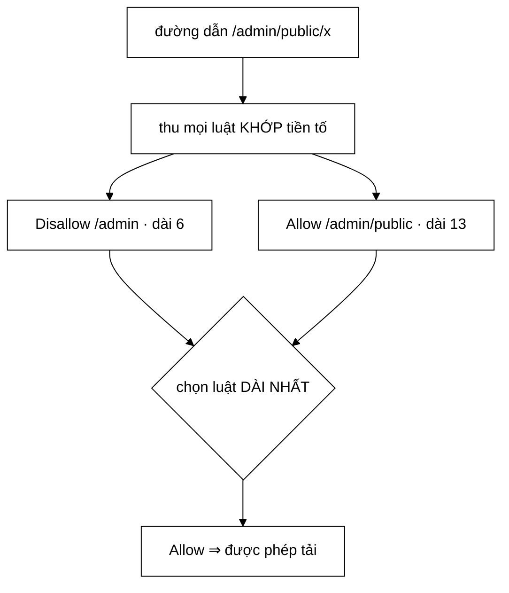
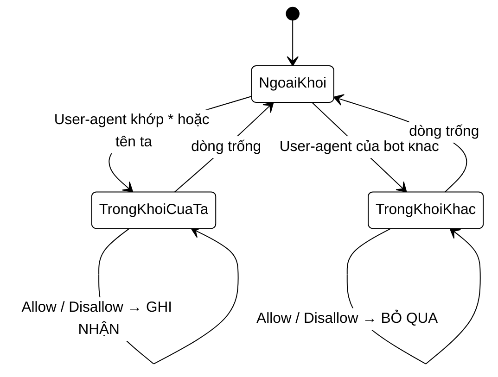

# RobotsTxtParser — longest-prefix-match và luật ưu tiên

**File nguồn:** `search-engine/src/main/java/com/vnsearch/crawler/RobotsTxtParser.java`
**Việc nó làm:** Đọc `robots.txt` của mỗi domain và trả lời *"được phép crawl đường dẫn này không?"*.

> 📖 Chưa quen ký hiệu toán? Đọc [00 — Từ điển ký hiệu toán](../00-KY-HIEU-TOAN.md) trước.

---

## 📌 Hiểu trong 30 giây

`robots.txt` là hợp đồng giữa website và crawler. Nó gồm những dòng đơn giản:

```
User-agent: *
Disallow: /admin
Allow: /admin/public
```

Vấn đề thú vị nằm ở chỗ **nhiều luật có thể cùng khớp một đường dẫn**. Với `/admin/public/x`, cả `Disallow: /admin` lẫn `Allow: /admin/public` đều khớp. **Luật nào thắng?**

```
   Đường dẫn cần quyết định:  /admin/public/x

   luật 1:  Disallow: /admin           khớp,  dài  6 ký tự
   luật 2:  Allow:    /admin/public    khớp,  dài 13 ký tự  ◀── DÀI HƠN ⇒ THẮNG

            /admin/public/x
            ├─────┤                    luật 1 phủ tới đây
            ├────────────┤             luật 2 phủ tới đây — CỤ THỂ HƠN
```

**Quy tắc: khớp tiền tố DÀI NHẤT thắng.** Trực giác đằng sau: luật dài hơn là
luật **cụ thể hơn**, và cái cụ thể bao giờ cũng là ngoại lệ có chủ ý của cái
tổng quát.



Máy trạng thái đọc tệp — chỗ dễ sai nhất là **khối `User-agent` nào đang mở**:



Bỏ qua trạng thái này là đọc nhầm luật của bot khác thành luật của mình — lỗi
im lặng, và hậu quả là crawl vào chỗ bị cấm.

Câu trả lời của chuẩn Robots Exclusion Protocol: **luật có đường dẫn dài nhất (cụ thể nhất) thắng**. Đây là nguyên tắc **longest-prefix-match**, cùng họ với cách bộ định tuyến IP chọn tuyến đường.

---

## 1. Longest-prefix-match — thuật toán

**Mã giả:**

```
IS-PATH-ALLOWED(rules, path):
    best ← null
    for mỗi rule trong rules:
        nếu path bắt đầu bằng rule.path:
            nếu best = null hoặc độ dài rule.path > độ dài best.path:
                best ← rule
    trả về (best = null) hoặc best.isAllow      # không luật nào khớp → cho phép
```

**Mã thật — `RobotsTxtParser.java:59-70`:**

```java
/** Luat co duong dan CU THE (dai) nhat khop se thang (chuan robots.txt). */
boolean isPathAllowed(List<Rule> rules, String path) {
    Rule best = null;
    for (Rule rule : rules) {
        if (path.startsWith(rule.path())) {
            if (best == null || rule.path().length() > best.path().length()) {
                best = rule;
            }
        }
    }
    return best == null || best.isAllow();
}
```

> ⚠️ **Toán tử `>` chặt, không phải `>=` — và đó là một sai lệch nhỏ so với chuẩn.**
> Khi hai luật khớp **cùng độ dài**, `>` giữ nguyên luật gặp **trước**. Chuẩn
> quy định `Allow` thắng trong ca hoà. Đổi thành `>=` cũng chưa đúng — nó chỉ
> lật thành "luật gặp **sau** thắng". Muốn đúng chuẩn phải viết:
> ```java
> if (best == null
>         || rule.path().length() > best.path().length()
>         || (rule.path().length() == best.path().length() && rule.isAllow())) {
> ```
> Ghi lại ở §6.2 như một hạn chế đã biết.

**Chạy tay với ví dụ ở đầu bài:**

| Đường dẫn kiểm tra | Luật khớp | Độ dài | Thắng | Kết quả |
|---|---|---|---|---|
| `/admin/public/x` | `Disallow: /admin` | 6 | | |
| | `Allow: /admin/public` | **13** | ✅ | **cho phép** |
| `/admin/secret` | `Disallow: /admin` | 6 | ✅ | **cấm** |
| | `Allow: /admin/public` | — | không khớp | |
| `/tin-tuc` | (không luật nào) | — | — | **cho phép** |

**Vì sao "dài hơn thì thắng" là quy tắc đúng.** Đường dẫn dài hơn mô tả một **tập con** hẹp hơn:

$$\{p : p \text{ bắt đầu bằng } \texttt{/admin/public}\} \;\subset\; \{p : p \text{ bắt đầu bằng } \texttt{/admin}\}$$

Chủ website viết luật cụ thể hơn nghĩa là họ muốn **khoét một ngoại lệ** ra khỏi luật tổng quát. Nếu luật ngắn thắng, ngoại lệ sẽ không bao giờ có hiệu lực và cú pháp `Allow` trở nên vô nghĩa.

**Mặc định khi không luật nào khớp là CHO PHÉP** (`best == null` → `true`). Đây là ngữ nghĩa "opt-out" của chuẩn: robots.txt liệt kê những gì **cấm**, mọi thứ khác mặc nhiên được phép.

---

## 2. Ba quyết định thiết kế đi kèm

### 2.1 Section riêng thay thế hoàn toàn section `*`

```java
// Neu co section rieng cho userAgent, no thay the hoan toan section "*".
out.addAll(specificRules.isEmpty() ? wildcardRules : specificRules);
```

Nếu robots.txt có mục riêng cho user-agent của ta thì mục `User-agent: *` bị **bỏ hẳn**, **không gộp lại**.

**Vì sao đúng theo chuẩn.** Xét ví dụ:

```
User-agent: *
Disallow: /

User-agent: VnSearchBot
Disallow: /admin
```

Ý định của chủ site rõ ràng: *"Cấm mọi bot, trừ VnSearchBot thì chỉ cấm /admin."* Nếu **gộp** hai section, `Disallow: /` vẫn còn hiệu lực và VnSearchBot bị cấm sạch — hiểu sai hoàn toàn ý định.

Đây là điểm mà một parser viết vội rất dễ sai.

### 2.2 Cache theo domain

```java
private final Map<String, List<Rule>> cache = new ConcurrentHashMap<>();
...
List<Rule> rules = cache.computeIfAbsent(domainKey, key -> fetchAndParse(key, userAgent));
```

Fetch robots.txt qua mạng mất khoảng **100–500 ms**. Không cache thì với 5.011 trang *(mốc A)*:

$$5011 \times 200\text{ms} \approx \mathbf{17 \text{ phút}} \text{ chỉ để tải robots.txt}$$

— gấp hơn 5 lần toàn bộ thời gian crawl thật (3,2 phút). Có cache, ta tải đúng **52 lần** (mỗi host một lần):

$$52 \times 200\text{ms} \approx \mathbf{10 \text{ giây}}$$

**Độ lợi tăng theo quy mô, không giảm.** Ở mốc D (31.030 trang, 93 host):

$$\underbrace{31030 \times 200\text{ms} \approx 103 \text{ phút}}_{\text{không cache}} \quad\text{so với}\quad \underbrace{93 \times 200\text{ms} \approx 19 \text{ giây}}_{\text{có cache}}$$

Tỷ lệ tiết kiệm đi từ ~96× lên ~330×, vì số lần tải chỉ tăng theo **số host** còn
số lần hỏi tăng theo **số trang** — hai đại lượng lệch nhau ngày càng xa.

**Vì sao `ConcurrentHashMap` mà không phải `synchronized Map`:** nhiều worker thread cùng gọi `isAllowed` đồng thời. `computeIfAbsent` của `ConcurrentHashMap` khoá **theo bucket** chứ không khoá cả bảng, nên hai thread hỏi hai domain khác nhau không chặn nhau.

> ⚠️ **Một chi tiết đáng lưu ý về `computeIfAbsent`:** hàm ánh xạ ở đây thực hiện **I/O mạng** trong lúc đang giữ khoá bucket. Javadoc của `ConcurrentHashMap` khuyến cáo hàm ánh xạ nên ngắn và không sửa map. Ở đây hệ quả thực tế chỉ là: hai thread cùng hỏi **cùng một domain** thì thread thứ hai chờ thread thứ nhất fetch xong — đúng ra là hành vi mong muốn (tránh fetch trùng). Nhưng đây vẫn là một chỗ nên biết là mình đang đi ra ngoài khuyến cáo.

**Khoá cache là `scheme://host:port`**, không phải chỉ host:

```java
String domainKey = uri.getScheme() + "://" + uri.getHost() + (uri.getPort() > 0 ? ":" + uri.getPort() : "");
```

Đúng theo chuẩn: `http://a.com` và `https://a.com` là **hai origin khác nhau**, mỗi cái có robots.txt riêng.

### 2.3 Lỗi mạng → mặc định CHO PHÉP

```java
} catch (Exception e) {
    // Neu khong fetch/parse duoc robots.txt (loi mang, domain khong ton tai...),
    // mac dinh CHO PHEP de khong chan crawl vi loi ha tang, dung nhu hanh vi
    // khuyen nghi trong dac ta Robots Exclusion Protocol khi khong co robots.txt.
    return true;
}
```

Đúng theo hành vi khuyến nghị của đặc tả khi **không có** robots.txt: không chặn crawl chỉ vì lỗi hạ tầng.

**Đây là một quyết định về hướng sai (fail-open vs fail-closed) đáng suy nghĩ:**

| Hướng | Nghĩa | Rủi ro |
|---|---|---|
| **Fail-open** (dự án chọn) | Lỗi → cho phép | Có thể crawl trang mà chủ site không muốn |
| Fail-closed | Lỗi → cấm | Một sự cố mạng thoáng qua làm crawler bỏ cả domain |

Chuẩn khuyến nghị fail-open vì mã 404 (không có robots.txt) là trường hợp phổ biến nhất và nó có nghĩa "không có hạn chế nào". Nhưng đáng lưu ý là code hiện gộp cả **404** lẫn **lỗi mạng thật** lẫn **mã 5xx** vào một nhánh. Chuẩn hiện hành (RFC 9309) phân biệt: 5xx nên coi là "cấm toàn bộ tạm thời". Đây là một điểm chưa đúng chuẩn, đáng ghi trong phần hạn chế.

---

## 3. Parse — máy trạng thái hai cờ

```java
private void parseInto(String content, String userAgent, List<Rule> out) {
    String[] lines = content.split("\r?\n");
    List<Rule> wildcardRules = new ArrayList<>();
    List<Rule> specificRules = new ArrayList<>();
    boolean inWildcardSection = false;
    boolean inSpecificSection = false;

    for (String rawLine : lines) {
        String line = rawLine.split("#", 2)[0].trim();     // bỏ chú thích
        if (line.isEmpty()) continue;
        int colon = line.indexOf(':');
        if (colon < 0) continue;
        String key = line.substring(0, colon).trim().toLowerCase();
        String value = line.substring(colon + 1).trim();

        switch (key) {
            case "user-agent" -> {
                inWildcardSection = value.equals("*");
                inSpecificSection = value.equalsIgnoreCase(userAgent);
            }
            case "disallow" -> { ... }
            case "allow"    -> { ... }
            default -> { /* bo qua Crawl-delay, Sitemap, ... */ }
        }
    }
    out.addAll(specificRules.isEmpty() ? wildcardRules : specificRules);
}
```

Đây là một **máy trạng thái** rất gọn: hai biến boolean ghi nhớ "đang ở trong section nào", và mỗi dòng `Disallow`/`Allow` được xếp vào một trong hai danh sách theo trạng thái hiện tại.

Bốn chi tiết xử lý văn bản đáng chú ý:

| Chi tiết | Code | Vì sao |
|---|---|---|
| Bỏ chú thích | `rawLine.split("#", 2)[0]` | `Disallow: /x # ghi chú` phải cho ra `/x` |
| Tách theo `:` **đầu tiên** | `line.indexOf(':')` | Giá trị có thể chứa `:` (ví dụ `Sitemap: https://…`) |
| Khoá không phân biệt hoa thường | `.toLowerCase()` | `Disallow` / `disallow` / `DISALLOW` đều hợp lệ |
| Xuống dòng cả hai kiểu | `split("\r?\n")` | Windows CRLF và Unix LF |

**`split("#", 2)` với giới hạn 2** thay vì `split("#")`: giới hạn 2 nghĩa là chỉ cắt ở dấu `#` **đầu tiên**, phần còn lại giữ nguyên. Không có giới hạn thì `split` cắt ở mọi dấu `#` và tạo mảng thừa — không sai ở đây vì chỉ lấy `[0]`, nhưng tốn công cắt vô ích.

**`value.isEmpty()` bị bỏ qua** với `Disallow:` (không có giá trị): theo chuẩn, `Disallow:` rỗng nghĩa là "không cấm gì", nên đúng là phải bỏ qua chứ không tạo `Rule("", false)` — nếu tạo, `path.startsWith("")` luôn đúng và **mọi** đường dẫn bị cấm.

---

## 4. Độ phức tạp

| Thao tác | Thời gian | Số lần thực hiện |
|---|---|---|
| `fetchAndParse` | $O(\lvert\text{file}\rvert)$ + **mạng** | **1 lần / domain** = 52 lần |
| `isPathAllowed` | $O(R \cdot L)$ | 1 lần / URL = 394.940 lần |

với $R$ = số luật, $L$ = độ dài đường dẫn (chi phí `startsWith`).

Thực tế $R < 50$ với hầu hết site, nên coi như $O(1)$. Tổng chi phí cho cả phiên crawl:

$$394\,940 \times 50 \times 60 \approx 1{,}2 \times 10^9 \text{ phép so ký tự}$$

Nghe lớn, nhưng đó là khoảng **1 giây CPU** — không đáng kể so với 3,2 phút chờ mạng.

> **Nếu $R$ lớn.** Có site có hàng nghìn luật. Khi đó nên dựng một **Trie** trên các đường dẫn luật: longest-prefix-match trở thành "đi sâu nhất có thể trong trie", tức $O(L)$ thay vì $O(R \cdot L)$. Đây đúng là cấu trúc mà bộ định tuyến IP dùng. Dự án đã có sẵn một `Trie` tự cài ([Trie.md](../05-datastructures/Trie.md)) nên chi phí tái sử dụng rất thấp — một hướng mở rộng tự nhiên.

---

## 5. Chủ đề DSA thể hiện

| Chủ đề | Ở đâu |
|---|---|
| **Longest-prefix-match** | `isPathAllowed` — cùng họ với định tuyến IP |
| **Máy trạng thái hữu hạn** | hai cờ `inWildcardSection` / `inSpecificSection` |
| **Memoization / cache** | `ConcurrentHashMap` theo domain, 17 phút → 10 giây |
| **Phân tích cú pháp theo dòng** | tách khoá–giá trị, bỏ chú thích |
| **Chọn hướng sai (fail-open)** | lỗi mạng → cho phép |
| **Điều kiện biên** | `Disallow:` rỗng phải bỏ qua |

---

## 6. Hạn chế đã biết

1. **Bỏ qua wildcard `*` và `$`** trong đường dẫn. `Disallow: /*.pdf$` bị hiểu là cấm đường dẫn bắt đầu bằng chuỗi ký tự `/*.pdf$` — tức gần như không cấm gì. Chuẩn hiện hành có hỗ trợ hai ký tự này.
2. **Hai luật khớp cùng độ dài** thì luật xuất hiện **trước** thắng (do dùng `>` chặt). Chuẩn quy định **`Allow` thắng** trong trường hợp hoà.
3. **Bỏ qua `Crawl-delay`.** Dự án dùng cứng 1 giây cho mọi host thay vì đọc giá trị site khai báo.
4. **Bỏ qua `Sitemap`.** Đây là nguồn URL chất lượng cao mà crawler đang không tận dụng.
5. **Không phân biệt 404 với 5xx** (xem §2.3).
6. **Cache không hết hạn.** robots.txt thay đổi giữa phiên crawl sẽ không được nhận ra. Với phiên 3,2 phút thì không thành vấn đề; với crawler chạy dài thì phải có TTL.

---

## 7. Liên kết

- Người dùng: [CrawlerService.md](CrawlerService.md)
- Cấu trúc có thể dùng để tăng tốc `isPathAllowed`: [Trie.md](../05-datastructures/Trie.md)
- Ký hiệu chưa hiểu: [00 — Từ điển ký hiệu toán](../00-KY-HIEU-TOAN.md)
