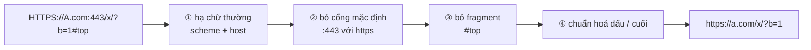
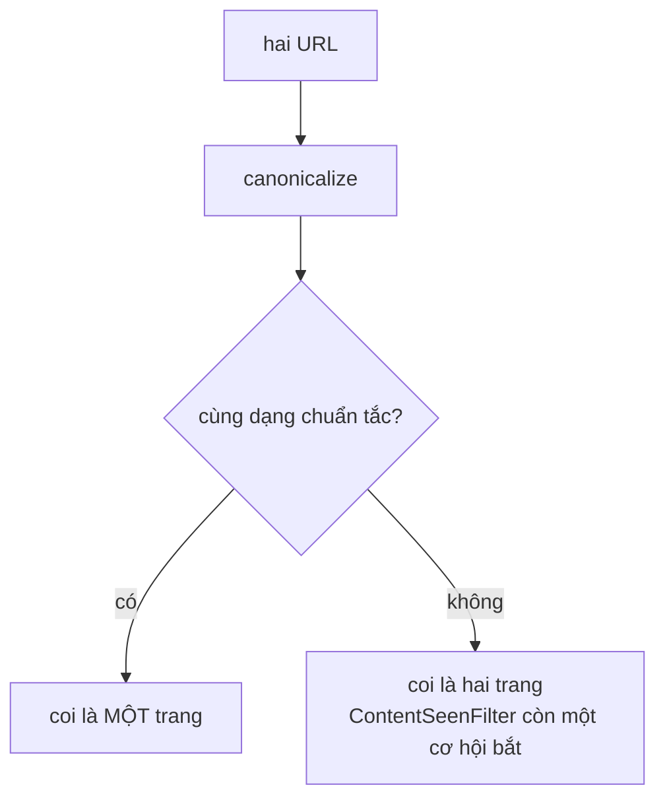

# UrlCanonicalizer — quan hệ tương đương trên tập URL

**File nguồn:** `search-engine/src/main/java/com/vnsearch/crawler/UrlCanonicalizer.java`
**Việc nó làm:** Đưa mọi biến thể chuỗi của **cùng một trang** về **một** dạng biểu diễn duy nhất.

> 📖 Chưa quen ký hiệu toán? Đọc [00 — Từ điển ký hiệu toán](../00-KY-HIEU-TOAN.md) trước.

---

## 📌 Hiểu trong 30 giây

`https://a.com` và `https://a.com/` là **cùng một trang** nhưng là **hai chuỗi khác nhau**. Bloom Filter so sánh chuỗi, nên nó coi hai cái đó khác nhau và crawler tải cả hai.

Dự án này đã dính đúng lỗi đó: **23 cặp trang trùng nhau** chỉ khác dấu gạch chéo cuối, trong phiên crawl đầu tiên.

Hậu quả không chỉ là lãng phí băng thông: **các bản sao cùng lọt vào chỉ mục và cùng xuất hiện trong kết quả tìm kiếm**, làm giảm chất lượng thấy rõ — người dùng thấy hai kết quả y hệt nhau ở hạng 1 và 2.



```
   Bốn phép, và LÝ DO DỪNG LẠI Ở BỐN

   ✓ ① hạ chữ thường scheme+host   HTTPS://A.com → https://a.com
        an toàn: RFC nói host không phân biệt hoa thường
   ✓ ② bỏ cổng mặc định            https://a.com:443 → https://a.com
        an toàn: :443 với https là mặc định, cùng một máy chủ
   ✓ ③ bỏ fragment                 /x#top → /x
        an toàn: fragment chỉ dùng phía trình duyệt, không gửi lên server
   ✓ ④ chuẩn hoá dấu / cuối        /x và /x/ → một dạng
        an toàn trên thực tế: chính lỗi 23 cặp trùng đã gặp

   ✗ KHÔNG đụng query string       /x?b=1 và /x?b=2 GIỮ NGUYÊN khác nhau
        KHÔNG an toàn: đổi tham số có thể đổi hẳn trang trả về
   ✗ KHÔNG sắp xếp tham số         ?a=1&b=2 và ?b=2&a=1 GIỮ NGUYÊN khác nhau
        KHÔNG an toàn: một số máy chủ phân biệt thứ tự
```

**Nguyên tắc chọn phép nào được làm:** một phép chuẩn hoá chỉ được phép nếu nó
**không bao giờ** gộp hai trang thật sự khác nhau. Gộp nhầm gây mất dữ liệu và
không phát hiện được; bỏ sót chỉ gây trùng lặp — mà trùng lặp còn có
`ContentSeenFilter` bắt ở tầng sau.



---

## 1. Bài toán, phát biểu bằng toán học

Gọi $U$ là tập mọi chuỗi URL, và định nghĩa quan hệ:

$$u_1 \sim u_2 \iff u_1 \text{ và } u_2 \text{ trỏ tới cùng một tài nguyên}$$

$\sim$ là một **quan hệ tương đương** (phản xạ, đối xứng, bắc cầu), nên nó chia $U$ thành các **lớp tương đương**. Chuẩn hoá là việc chọn **một đại diện duy nhất** cho mỗi lớp:

$$\text{canonicalize}: U \to U, \qquad u_1 \sim u_2 \implies \text{canonicalize}(u_1) = \text{canonicalize}(u_2)$$

Một hàm như thế gọi là **hàm chọn đại diện chuẩn tắc** (canonical form). Sau khi áp dụng, phép so sánh "cùng trang không?" — vốn là một câu hỏi ngữ nghĩa — trở thành phép so sánh chuỗi thuần tuý.

**Hai tính chất phải giữ, và chúng không đối xứng về mức nghiêm trọng:**

| Tính chất | Vi phạm nghĩa là gì | Hậu quả |
|---|---|---|
| $u_1 \sim u_2 \Rightarrow c(u_1) = c(u_2)$ (đầy đủ) | Bỏ sót một phép chuẩn hoá | Crawl trùng — **lãng phí** |
| $c(u_1) = c(u_2) \Rightarrow u_1 \sim u_2$ (an toàn) | Chuẩn hoá quá tay | **Mất trang** — nghiêm trọng hơn |

Dự án ưu tiên **an toàn** hơn **đầy đủ**: thà crawl trùng vài trang còn hơn gộp nhầm hai trang khác nhau thành một và mất hẳn một trong hai.

---

## 2. Bốn phép chuẩn hoá được áp dụng

Tất cả đều là những phép **an toàn** theo RFC 3986 — tức không làm thay đổi tài nguyên được trỏ tới.

| Phép | Ví dụ | Vì sao an toàn |
|---|---|---|
| Bỏ fragment | `a.com/x#phan-2` → `a.com/x` | Fragment **không được gửi lên máy chủ** — nó chỉ là chỉ dẫn cuộn trang cho trình duyệt |
| Hạ chữ thường scheme + host | `HTTPS://A.COM/X` → `https://a.com/X` | RFC 3986 §3.1, §3.2.2: hai thành phần này **không** phân biệt hoa thường |
| Bỏ cổng mặc định | `a.com:443/x` → `a.com/x` | `:443` với https, `:80` với http là mặc định — máy chủ nhận request y hệt |
| Bỏ `/` cuối | `a.com/tin/` → `a.com/tin` | Quy ước; đường dẫn gốc rút hẳn thành chuỗi rỗng |

```java
public static String canonicalize(String rawUrl) {
    if (rawUrl == null || rawUrl.isBlank()) return rawUrl;
    String withoutFragment = stripFragment(rawUrl.trim());
    try {
        URI uri = URI.create(withoutFragment);
        String scheme = uri.getScheme();
        String host = uri.getHost();
        if (scheme == null || host == null) return withoutFragment;
        scheme = scheme.toLowerCase(Locale.ROOT);
        host = host.toLowerCase(Locale.ROOT);

        StringBuilder sb = new StringBuilder(scheme).append("://").append(host);

        int port = uri.getPort();
        boolean isDefaultPort = (port == 80 && scheme.equals("http"))
                || (port == 443 && scheme.equals("https"));
        if (port > 0 && !isDefaultPort) sb.append(':').append(port);

        String path = uri.getRawPath();
        if (path != null && !path.isEmpty()) {
            while (path.length() > 1 && path.endsWith("/")) {
                path = path.substring(0, path.length() - 1);
            }
            if (!path.equals("/")) sb.append(path);
        }

        String query = uri.getRawQuery();
        if (query != null && !query.isEmpty()) sb.append('?').append(query);
        return sb.toString();
    } catch (Exception e) {
        return withoutFragment;
    }
}
```

**Bảng chạy tay:**

| Đầu vào | Đầu ra |
|---|---|
| `https://a.com` | `https://a.com` |
| `https://a.com/` | `https://a.com` |
| `HTTPS://A.COM/Tin-Tuc/` | `https://a.com/Tin-Tuc` |
| `https://a.com:443/x#phan-2` | `https://a.com/x` |
| `https://a.com:8080/x` | `https://a.com:8080/x` |
| `https://a.com/x?id=5` | `https://a.com/x?id=5` |
| `khong-phai-url` | `khong-phai-url` (giữ nguyên) |

Ba dòng đầu cho ra **cùng một chuỗi** — đúng mục tiêu §1.

---

## 3. Hai phép KHÔNG được làm — đây là phần dễ sai nhất

### 3.1 Không hạ chữ thường phần path

```java
String path = uri.getRawPath();   // ← KHÔNG gọi toLowerCase
```

Theo RFC 3986, đường dẫn **có** phân biệt hoa thường. `/Tin-Tuc` và `/tin-tuc` **có thể** là hai tài nguyên khác nhau — trên máy chủ Linux (hệ tập tin phân biệt hoa thường) thì gần như chắc chắn là vậy.

Nếu hạ chữ thường path, ta vi phạm tính chất **an toàn** ở §1: hai URL khác nhau bị gộp thành một, và một trong hai **biến mất khỏi corpus**.

> Trớ trêu là trên Windows/macOS hệ tập tin không phân biệt hoa thường, nên lập trình viên phát triển trên hai hệ đó dễ tưởng việc hạ chữ thường là vô hại — rồi hỏng khi chạy thật.

### 3.2 Không đụng vào query string

```java
String query = uri.getRawQuery();
if (query != null && !query.isEmpty()) sb.append('?').append(query);   // giữ NGUYÊN VĂN
```

Hai phép "chuẩn hoá" thường được đề xuất, cả hai đều **không an toàn**:

**(a) Bỏ tham số theo dõi (`utm_source`, `fbclid`, …).** Nghe vô hại vì chúng chỉ dùng cho phân tích. Nhưng không có cách nào biết chắc một tham số là "theo dõi" — một số site dùng chính `utm_*` để chọn nội dung hiển thị. Muốn làm đúng phải có **danh sách trắng theo từng site**, tức là dữ liệu chứ không phải thuật toán.

**(b) Sắp xếp tham số theo thứ tự chữ cái.** `?a=1&b=2` và `?b=2&a=1` *thường* cho cùng kết quả — nhưng chuẩn HTTP **không đảm bảo** điều đó. Máy chủ được phép lấy tham số theo thứ tự xuất hiện, và với tham số lặp (`?tag=a&tag=b`) thì thứ tự **chắc chắn** có ý nghĩa.

Chọn **không làm** cả hai là quyết định đúng: ưu tiên an toàn hơn đầy đủ.

### 3.3 Dùng `getRawPath()` chứ không phải `getPath()`

Khác biệt tinh tế nhưng quan trọng:

| Phương thức | Với `/tin%20tuc` | |
|---|---|---|
| `getPath()` | `/tin tuc` | đã **giải mã** percent-encoding |
| `getRawPath()` | `/tin%20tuc` | giữ **nguyên văn** |

Nếu dùng `getPath()`, ta ghép lại một URL có **khoảng trắng thật** trong đường dẫn — chuỗi đó không còn là URL hợp lệ và `Jsoup.connect()` sẽ hỏng. Dùng `getRawPath()`/`getRawQuery()` là bắt buộc khi mục đích là **ghép lại thành URL**.

---

## 4. Xử lý lỗi — thà giữ nguyên còn hơn làm hỏng

```java
} catch (Exception e) {
    return withoutFragment;
}
```

Nếu chuỗi không phân tích được thành URI hợp lệ (URL méo, ký tự lạ, thiếu scheme), hàm trả về **nguyên văn đầu vào** (đã bỏ fragment).

**Vì sao đây là lựa chọn đúng.** Một URL méo vẫn có thể fetch được — trình duyệt và thư viện HTTP rất khoan dung. Nếu chuẩn hoá thất bại mà ta trả về `null` hoặc ném ngoại lệ, ta **chắc chắn** mất trang đó. Trả về nguyên văn thì tệ nhất là mất cơ hội khử trùng lặp — nhẹ hơn nhiều.

Cùng logic với `if (scheme == null || host == null) return withoutFragment;`: URL tương đối như `/tin-tuc` không có host, không chuẩn hoá được, nhưng vẫn giữ lại (thực tế `LinkExtractor` đã chuyển sang tuyệt đối trước khi gọi, nên nhánh này hiếm khi chạy).

---

## 5. Choke point — biến "phải nhớ" thành "không thể quên"

Đây là bài học kiến trúc quan trọng nhất của lớp này.

```java
public boolean addUrl(String rawUrl, int depth, int knownBacklinks) {
    // Chuan hoa ngay tai cua vao: day la choke point duy nhat ma moi URL
    // deu phai di qua, nen chuan hoa o day dam bao tap enqueued khong bao
    // gio chua 2 bien the cua cung mot trang.
    String url = com.vnsearch.crawler.UrlCanonicalizer.canonicalize(rawUrl);
    ...
}
```

**Vấn đề với cách rải rác.** Nếu để mỗi nơi gọi tự nhớ chuẩn hoá, ta có 4 điểm phải nhớ: seed URL, outlink, kiểm tra Bloom Filter, và khoá của `crawled`. Quên **một** chỗ là lỗi quay lại — và lỗi này **im lặng**, không có ngoại lệ nào, chỉ là vài trang trùng trong kết quả.

**Cách đúng.** Xác định **điểm vào duy nhất** mà mọi URL đều phải đi qua, đặt phép chuẩn hoá ở đó. Với frontier, điểm đó là `addUrl`.

Nguyên tắc tổng quát:

> **Bất biến nào cần giữ, hãy ép nó tại ranh giới cấu trúc dữ liệu — đừng trông vào việc người gọi nhớ.**

Cùng nguyên tắc đó xuất hiện ở `LinkExtractor`, nơi chuẩn hoá **cả base lẫn outlink** trước khi so sánh:

```java
String canonicalBase = UrlCanonicalizer.canonicalize(baseUrl);
...
String canonical = UrlCanonicalizer.canonicalize(absUrl);
// Bo qua anchor link tro ve chinh trang nay (vd href="#section")
if (!canonical.equals(canonicalBase)) {
    seen.add(canonical);
}
```

Nếu chỉ chuẩn hoá một vế, phép so sánh `!canonical.equals(canonicalBase)` sẽ không nhận ra `https://a.com` và `https://a.com/` là một, và trang tự trỏ về chính nó — sinh ra một cạnh tự vòng trong đồ thị PageRank.

---

## 6. Độ phức tạp

| Thao tác | Thời gian |
|---|---|
| `stripFragment` | $O(L)$ — `indexOf` + `substring` |
| `URI.create` | $O(L)$ — phân tích cú pháp |
| Hạ chữ thường scheme + host | $O(\lvert\text{host}\rvert)$ |
| Bỏ `/` cuối | $O(L)$ trường hợp xấu nhất — vòng `while` với `substring` |
| **Tổng** | **$O(L)$** |

> **Một chi tiết hiệu năng nhỏ:** vòng `while (path.endsWith("/")) path = path.substring(...)` tạo một chuỗi mới **mỗi lần lặp**. Với `a.com/x///` (3 dấu gạch chéo) đó là 3 lần cấp phát. Trường hợp bệnh lý `a.com/x` theo sau 1000 dấu `/` cho ra $O(L^2)$. Cách viết $O(L)$: tìm chỉ số cuối bằng vòng lặp rồi `substring` **một** lần. Với URL thật (hiếm khi quá 2 dấu gạch chéo thừa) thì khác biệt không đo được, nhưng đây là loại chi tiết nên biết.

Với 394.940 URL × $L \approx 60$: khoảng $2{,}4 \times 10^7$ thao tác ký tự — dưới 1 giây.

---

## 7. Chủ đề DSA thể hiện

| Chủ đề | Ở đâu |
|---|---|
| **Quan hệ tương đương và dạng chuẩn tắc** | toàn bộ lớp |
| **Bất biến ép tại ranh giới** | choke point ở `UrlFrontier.addUrl` |
| **Xử lý chuỗi** | `indexOf`, `substring`, `StringBuilder` |
| **Phân tích cú pháp có cấu trúc** | `URI` thay vì regex tự viết |
| **Ưu tiên an toàn hơn đầy đủ** | không đụng path/query |
| **Suy biến nhẹ nhàng** | lỗi parse → trả nguyên văn |
| **Lớp tiện ích bất biến** | `final class` + constructor `private` + toàn `static` |

---

## 8. Hạn chế đã biết

1. **Không giải quyết `.` và `..`** trong đường dẫn. `a.com/x/./y` và `a.com/x/y` vẫn là hai chuỗi khác nhau. `URI.normalize()` làm được việc này và nên được thêm.
2. **Không chuẩn hoá percent-encoding.** `%7E` và `~` là cùng một ký tự nhưng cho ra hai chuỗi. Chuẩn RFC 3986 §6.2.2.2 quy định nên giải mã các ký tự "unreserved".
3. **Không xử lý `www.`** — `a.com` và `www.a.com` bị coi là hai host khác nhau. Đây thực ra **đúng về mặt kỹ thuật** (chúng có thể trỏ tới máy chủ khác nhau), nhưng thực tế 99% là một. `MultiDomainCrawlRunner` phải tự cắt tiền tố `www.` khi dựng `allowedDomains` — dấu hiệu cho thấy chỗ này nên được xử lý tập trung ở đây.
4. **Không phát hiện trùng lặp nội dung.** Hai URL hoàn toàn khác nhau có thể trả về nội dung y hệt. Giải pháp chuẩn: **SimHash** hoặc **MinHash** trên nội dung sau khi tải — một hướng mở rộng đáng giá cho đồ án tốt nghiệp.

---

## 9. Liên kết

- Nơi được gọi: [UrlFrontier.md](UrlFrontier.md) · [ContentParser-LinkExtractor.md](ContentParser-LinkExtractor.md)
- Tầng khử trùng lặp thứ hai: [BloomFilter.md](BloomFilter.md)
- Ký hiệu chưa hiểu: [00 — Từ điển ký hiệu toán](../00-KY-HIEU-TOAN.md)
