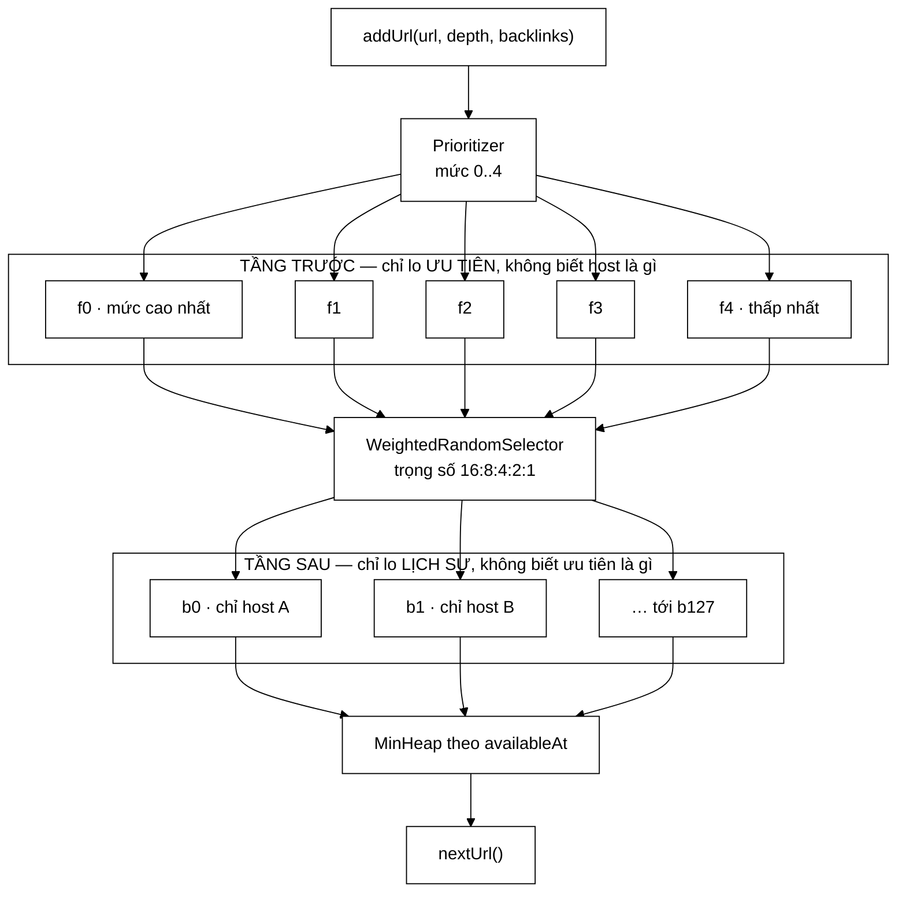

# UrlFrontier — hàng đợi hai tầng (mô hình Mercator đầy đủ)

**File nguồn:** `search-engine/src/main/java/com/vnsearch/crawler/frontier/` — 9 lớp, xem bảng ở §0
**Việc nó làm:** Quyết định **crawl URL nào tiếp theo**, vừa theo độ ưu tiên vừa tôn trọng giới hạn 1 request/giây cho mỗi host.

> 📖 Chưa quen ký hiệu toán? Đọc [00 — Từ điển ký hiệu toán](../00-KY-HIEU-TOAN.md) trước.

> ### 🔄 Đã cập nhật: từ một tầng lên hai tầng
>
> Bản trước dùng **một** cấu trúc duy nhất — `Map<host, MinHeap>` sắp theo điểm
> ưu tiên — tức gộp cả hai tầng của sơ đồ Mercator làm một. Bản này tách đúng
> như sơ đồ: **tầng trước** xếp theo ưu tiên, **tầng sau** gom theo host.
> Ba thứ thay đổi kèm theo:
>
> - Ưu tiên là **mức số nguyên** (chỉ số hàng đợi) thay cho **điểm `double`**.
> - Bộ chọn hàng đợi trước là **ngẫu nhiên có trọng số**, nên mức thấp không bị bỏ đói.
> - `nextUrl` không còn quét mọi host: chi phí từ $O(D)$ xuống $O(\log n)$.
>
> Lớp cũng chuyển từ gói `datastructure/` sang `crawler/frontier/` — nó là một
> khối kiến trúc của crawler, không phải cấu trúc dữ liệu dùng chung.

---

## 📌 Hiểu trong 30 giây

Frontier là "danh sách việc cần làm" của crawler. Nó phải giải **hai bài toán cùng lúc**, và chính sự xung đột giữa chúng là toàn bộ nội dung thú vị của lớp:

1. **Chọn URL tốt nhất** — trang nào quan trọng hơn thì crawl trước.
2. **Không được spam host** — mỗi host tối đa 1 request/giây.

Riêng lẻ thì mỗi bài toán đều dễ: bài 1 dùng heap, bài 2 dùng một bảng `host → thời điểm truy cập cuối`. Ghép lại thì **hỏng**: URL ưu tiên cao nhất rất có thể thuộc host vừa mới truy cập, nên không dùng được — mà heap chỉ cho ta lấy phần tử đỉnh.

Lời giải của Mercator (Heydon & Najork, 1999) là **không ghép**: dùng hai tầng hàng đợi, mỗi tầng lo đúng một bài toán và không biết gì về bài toán kia.



```
   Vì sao KHÔNG gộp được vào một cấu trúc

   ƯU TIÊN muốn : "lấy URL tốt nhất, bất kể host nào"
   LỊCH SỰ cấm  : "không chạm cùng host 2 lần trong 1 giây,
                   bất kể URL đó tốt tới đâu"
                              │
                    nhét chung ⇒ một bên phải nhường
                              │
                    tách HAI TẦNG ⇒ mỗi bên làm trọn vẹn

   ┌─ TẦNG TRƯỚC ─────────┐      ┌─ TẦNG SAU ──────────────┐
   │ f0 f1 f2 f3 f4       │      │ b0(hostA) b1(hostB) …   │
   │ chia theo ƯU TIÊN    │ ───▶ │ chia theo HOST          │
   │ KHÔNG biết host      │      │ KHÔNG biết ưu tiên      │
   └──────────────────────┘      └─────────────────────────┘
        ▲                              ▲
        chọn ngẫu nhiên có trọng số    MinHeap theo thời điểm rảnh
        16:8:4:2:1 ⇒ chống bỏ đói
```

**Vì sao chọn ngẫu nhiên có trọng số chứ không luôn lấy mức cao nhất.** Lấy
tuyệt đối theo ưu tiên thì mức 4 có thể **không bao giờ** được chạm tới — web
sinh URL mức 0–1 nhanh hơn tốc độ crawler tiêu thụ. Trọng số 16:8:4:2:1 vẫn ưu
ái mức cao gấp 16 lần, nhưng xác suất mức thấp được chọn **luôn dương**, nên
mọi URL cuối cùng đều tới lượt.

---

## 0. Mỗi khối trong sơ đồ là một lớp

```
input URLs
    |
    v
Prioritizer  --->  f1 f2 ... fn  --->  Front queue selector
                   (theo muc uu tien)          |
                                               v  output URLs
                                       Back queue router  <->  Mapping Table
                                               |
                                               v
                                       b1 b2 ... bn  (moi hang doi MOT host)
                                               |
                                               v
                                       Back queue selector  --->  worker threads
```

| Khối trong sơ đồ | Lớp |
|---|---|
| Prioritizer | `Prioritizer` (giao diện) + `DefaultPrioritizer` |
| f1..fn | `FrontQueues` |
| Front queue selector | `FrontQueueSelector` + `WeightedRandomSelector` / `StrictPrioritySelector` |
| Back queue router | `BackQueues.refillFrom` |
| Mapping Table | `BackQueues.hostToQueue` |
| b1..bn | `BackQueues.queues` + `boundHost` |
| Back queue selector | `BackQueues.poll` + min-heap `ready` |
| — (ghép tất cả) | `UrlFrontier` — **Facade** |

Mỗi trục dễ thay đổi đều là một giao diện: `Prioritizer` (xếp hạng thế nào) và `FrontQueueSelector` (phục vụ mức nào trước). Đó là **Strategy pattern**, và nó cho phép kiểm thử từng chính sách một mình.

---

## 1. Prioritizer — ưu tiên là MỨC, không phải điểm

**`DefaultPrioritizer.java:57-67`** — cả chính sách ưu tiên gói trong sáu dòng:

```java
@Override
public int levelOf(String url, String host, int depth, int knownBacklinks) {
    int level = depth;
    if (host != null && host.endsWith(".vn")) {
        level--;
    }
    if (knownBacklinks >= BACKLINK_BOOST_THRESHOLD) {   // = 5, dòng :37
        level--;
    }
    return Math.max(0, Math.min(level, levels - 1));    // levels = 5, dòng :34
}
```

Quy ước: **0 là cao nhất**, `levels - 1` là thấp nhất. Với 5 mức:

| URL | depth | backlinks | .vn | mức |
|---|---|---|---|---|
| `https://vnexpress.net/` (seed) | 0 | 10 | không | **0** |
| `https://tuoitre.vn/` (seed) | 0 | 10 | có | **0** |
| Bài viết depth 1, `.vn` | 1 | 1 | có | **0** |
| Bài viết depth 3, `.vn` | 3 | 1 | có | **2** |
| Trang rất nóng, depth 2 | 2 | 5000 | không | **1** |
| Bất kỳ trang nào depth ≥ 6 | 6+ | 0 | không | **4** |

### 1.1 Vì sao bỏ công thức điểm số

Bản trước tính $-2\,\text{depth} + 0{,}5\min(\text{backlinks}, 50) + 5\cdot\mathbb{1}[\texttt{.vn}]$. Ba hằng số đó phải giải thích riêng, và tệ hơn — **chúng cho phép một tín hiệu lấn át hoàn toàn tín hiệu khác**:

$$0{,}5 \times 50 = 25 \text{ điểm} \;\equiv\; 12{,}5 \text{ lớp độ sâu}$$

nghĩa là một trang sâu 12 lớp có đủ backlink sẽ **vượt lên trên cả seed**. Bản cũ phải thêm `min(backlinks, 50)` chỉ để chặn hậu quả đó lại.

Đếm theo bậc thì giới hạn nằm ngay trong định nghĩa: mỗi tín hiệu phụ đáng đúng **một bậc**, nên chúng không bao giờ lật ngược thứ tự theo độ sâu quá 2 bậc. Không cần hằng số chặn, không cần hằng số trọng số.

### 1.2 Vì sao mức lại là chỉ số hàng đợi

Đây là điểm mấu chốt của cả thiết kế. Khi ưu tiên là **khoá so sánh** trong một heap, chính sách phục vụ bị khoá cứng vào cấu trúc: heap luôn trả về cực trị, không có cách nào bảo nó "thỉnh thoảng lấy phần tử tệ hơn".

Khi ưu tiên là **chỉ số hàng đợi**, chính sách phục vụ tách hẳn ra thành một tham số — chính là `FrontQueueSelector` ở §2.

---

## 2. Front queue selector — đánh đổi giữa ưu tiên và bỏ đói

Tầng trước là $n$ hàng đợi **FIFO thuần**, mỗi hàng một mức. Câu hỏi còn lại: lấy từ hàng nào?

**Chính sách tất định** (`StrictPrioritySelector`) — luôn lấy mức cao nhất còn URL. Đây là hành vi của bản cũ, và nó **bỏ đói** mức thấp: mỗi trang crawl được lại sinh trung bình **78,8 liên kết mới** *(mốc A)*, phần lớn nông, nên mức 0 gần như không bao giờ cạn và mức 4 không bao giờ tới lượt.

**Chính sách ngẫu nhiên có trọng số** (`WeightedRandomSelector`, mặc định) — mức $i$ có trọng số $2^{\,n-1-i}$:

$$P(\text{chọn mức } i) = \frac{2^{\,n-1-i}}{\sum_{j \in \text{còn hàng}} 2^{\,n-1-j}}$$

Với 5 mức đều còn URL, tổng trọng số là $16+8+4+2+1 = 31$:

| Mức | 0 | 1 | 2 | 3 | 4 |
|---|---|---|---|---|---|
| Xác suất | 51,6 % | 25,8 % | 12,9 % | 6,5 % | **3,2 %** |

Mức cao vẫn nhận hơn một nửa số lượt, nhưng mức thấp nhất nhận $1/31$ — **bỏ đói là không thể**. Đó là tính chất mà không cấu trúc heap nào cho được.

> **Chi tiết cài đặt đáng chú ý:** trọng số chỉ cộng trên các hàng đợi **còn hàng**. Nếu tính cả hàng rỗng, phần trọng số của chúng thành "lượt trống" và bộ chọn phải bốc lại — với 4 trên 5 hàng rỗng thì kỳ vọng số lần bốc tăng vọt. Chuẩn hoá lại cho ra đúng một lần bốc.

Hạt giống của `Random` cố định, nên phiên crawl vẫn **lặp lại được** — điều kiện cần để so sánh hai lần thí nghiệm.

---

## 3. Vì sao một heap toàn cục thì hỏng

Đây là lập luận thúc đẩy toàn bộ tầng sau, và nó vẫn đúng nguyên vẹn.

**Thiết kế ngây thơ:** một heap duy nhất chứa cả frontier, sắp theo ưu tiên. Khi lấy URL, phần tử đỉnh rất có thể thuộc host đang trong thời gian hoãn. Khi đó phải rút nó ra, gác sang một danh sách tạm, rút tiếp phần tử sau…

**Trường hợp xấu nhất** — mọi URL đang chờ đều thuộc các host vừa được truy cập — phải rút **cạn** cả heap rồi nhét lại toàn bộ:

$$\underbrace{n \cdot O(\log n)}_{\text{rút cạn}} \;+\; \underbrace{n \cdot O(\log n)}_{\text{nhét lại}} \;=\; O(n \log n) \quad \textbf{cho MỖI URL lấy ra}$$

Ở quy mô vài trăm URL không thấy được. Nhưng mỗi trang tin sinh **78,8 outlink** *(mốc A)*, nên crawl 10.000 trang đẩy $n$ lên hàng trăm nghìn — và crawler thực tế đứng hình.

**Gốc rễ:** heap chỉ cho phép truy cập **cực trị**, trong khi bài toán cần "phần tử tốt nhất **thoả một điều kiện**". Không cấu trúc một-chiều nào làm được cả hai.

---

## 4. Tầng sau — mỗi hàng đợi đúng một host

Bất biến cốt lõi: **hàng đợi sau thứ $i$ chỉ chứa URL của đúng một host.** Nhờ nó, "chờ 1 giây giữa hai lần chạm cùng máy chủ" trở thành "chờ 1 giây giữa hai lần lấy từ cùng hàng đợi" — kiểm tra được tại chỗ, không tra cứu gì thêm.

### 4.1 Nạp theo yêu cầu, không định tuyến ngay

Số hàng đợi sau là **cố định** (`DEFAULT_BACK_QUEUE_COUNT = 128`, `UrlFrontier.java:108`), số host thì không — một phiên crawl 6 tờ báo chạm tới **52 host** *(mốc A)* vì các subdomain; mốc D chạm **93 host** trong cache DNS. Nếu định tuyến ngay lúc `addUrl`, host vượt quá số hàng đợi sẽ không có chỗ đi.

Lời giải Mercator: hàng đợi sau được **nạp lại khi cạn**, kéo từ tầng trước cho tới khi gặp một host chưa có chủ. Host thừa nằm yên ở tầng trước — **tầng trước chính là vùng đệm**.

```
REFILL-FROM(front):
    lặp khi front còn URL:
        slot ← một hàng đợi sau đang rỗng
        nếu không có slot: dừng                  # mọi hàng đợi đều đang có việc
        lặp:
            task ← front.poll()
            nếu task = null: dừng hẳn            # tầng trước cạn
            owner ← MappingTable[task.host]
            nếu owner ≠ null và owner ≠ slot:
                đẩy task vào hàng đợi owner      # host đã có chủ
                tiếp
            gán host cho slot; đẩy task vào slot; thoát vòng trong
```

URL kéo lên mà host đã có chủ thì đi thẳng vào hàng đợi của chủ đó, **không bị trả ngược** về tầng trước — nên không có URL nào lặp vòng.

### 4.2 Min-heap dùng đúng chiều tự nhiên

Bản cũ phải **đảo dấu** để biến min-heap thành max-heap (`Double.compare(-a, -b)`). Ở đây `MinHeap` được dùng cho đúng thứ nó sinh ra: chọn **thời điểm khả dụng sớm nhất**.

```java
this.ready = new MinHeap<>((a, b) -> {
    int byTime = Long.compare(availableAt[a], availableAt[b]);
    return byTime != 0 ? byTime : Integer.compare(a, b);
});
```

Nếu phần tử nhỏ nhất chưa tới giờ thì **chắc chắn** không hàng đợi nào tới giờ — nên chỉ cần nhìn đỉnh heap, không phải quét. Đó là chỗ $O(D)$ biến thành $O(\log n)$.

Khoá phụ theo chỉ số hàng đợi làm thứ tự **tất định**: hai hàng đợi cùng thời điểm khả dụng sẽ được phục vụ theo thứ tự host được phát hiện, thay vì theo thứ tự tuỳ ý mà heap tình cờ sắp.

> **Bất biến giữ cho heap không hỏng:** `availableAt[i]` chỉ được sửa khi `i` đang **ở ngoài** heap. Sửa khoá của một phần tử đang nằm trong heap sẽ phá thứ tự một cách âm thầm — heap không có cách nào phát hiện.

### 4.3 Không huỷ liên kết host khi hàng đợi cạn

Hàng đợi cạn vẫn **giữ nguyên** host và `availableAt`, chỉ rời heap và vào danh sách chờ nạp. Huỷ liên kết ngay sẽ làm mất đồng hồ lịch sự của host đó, và một URL mới của chính host ấy có thể được tải lại tức thì.

Đây cũng là cách Mapping Table được chặn kích thước: tối đa đúng `queueCount` mục, vì mỗi lần một slot đổi host thì host cũ bị gỡ khỏi bảng.

> ✅ **Rò rỉ đã sửa.** Bản trước dùng `Map<domain, thời điểm truy cập>` **lớn dần theo mọi host từng gặp và không bao giờ co lại** — `it.remove()` chỉ dọn `byDomain`, không dọn `lastAccessTime`. Với 52 host thì vô hại; crawl rộng hàng chục nghìn host thì đó là rò rỉ thật.
>
> Bản hiện tại chặn kích thước bằng cách **gỡ host cũ khi một slot đổi chủ** — `BackQueues.java:252-259`:
>
> ```java
> private void bind(int slot, String host) {
>     String previous = boundHost[slot];
>     if (previous != null && !previous.equals(host)) {
>         hostToQueue.remove(previous); // giữ Mapping Table không phình quá số hàng đợi
>     }
>     boundHost[slot] = host;
>     hostToQueue.put(host, slot);
> }
> ```
>
> Bất biến thu được: `hostToQueue.size() ≤ queueCount`, **luôn luôn**, bất kể
> phiên crawl chạm bao nhiêu host.

### 4.4 Xoá lười cho danh sách hàng đợi rỗng

Một hàng đợi rỗng có thể được nạp lại **gián tiếp** — khi URL của chính host nó đang giữ chảy về từ tầng trước. Đi tìm nó trong danh sách chờ để xoá tốn $O(n)$. Thay vào đó nó được để lại và **lọc bằng cờ `empty[]`** lúc lấy ra:

```java
private int nextFreeSlot() {
    while (!freeSlots.isEmpty()) {
        int slot = freeSlots.peekFirst();
        if (empty[slot]) return slot;
        freeSlots.pollFirst();          // mục cũ, bỏ đi
    }
    return -1;
}
```

Mỗi mục bị bỏ đúng một lần nên tổng chi phí vẫn là $O(1)$ khấu hao. Cùng kỹ thuật "xoá lười" mà các hàng đợi ưu tiên hay dùng khi không hỗ trợ `decrease-key`.

---

## 5. Politeness — ràng buộc ngoài đặt trần cứng lên thông lượng

Mỗi host tối đa 1 request/giây, nên với $H$ host **đang hoạt động**:

$$\text{thông lượng tối đa} = \frac{H}{1 \text{ giây}} \text{ trang/giây}$$

Đây là **trần cứng**, không thuật toán nào vượt qua được — thêm thread cũng vô ích. Muốn crawl nhanh hơn thì chỉ có một cách: **crawl nhiều host hơn**.

Số hàng đợi sau chính là chặn trên của $H$: `DEFAULT_BACK_QUEUE_COUNT = 128` (`UrlFrontier.java:108`) cho trần 128 trang/giây, cao hơn hẳn mức mà mạng và số worker cho phép, nên **nó không phải nút thắt**.

**Số đo thực tế xác nhận điều đó** — và so hai mốc là cách rõ nhất để thấy trần thật nằm ở đâu:

| | **Mốc A** — 6 hạt giống | **Mốc D** — 11 hạt giống, `maxDepth=4` |
|---|---|---|
| Host phân biệt | **52** | **93** trong cache DNS, 45 host có trang |
| Trần lý thuyết theo politeness | 52 trang/giây | ~45 trang/giây *(chỉ host có trang mới cạnh tranh)* |
| Trần theo số hàng đợi sau | 128 | 128 |
| **Thực đo** | **26,2** trang/giây | **14,03** trang/giây |
| Đạt bao nhiêu phần trần | ~50 % | ~31 % |

Hai điều đọc được từ bảng:

1. **Trần có hiệu lực là $\min(H, \text{số hàng đợi sau})$**, và ở cả hai mốc thì $H$ nhỏ hơn 128 rất nhiều — nên 128 chưa từng cắn vào kết quả.
2. **Thực đo luôn thấp hơn trần** vì politeness chỉ là một trong ba ràng buộc; hai cái kia là độ trễ mạng và số worker. Mốc D thấp hơn vì đi sâu hơn (`maxDepth=4`) nên số trang phân bố lệch về vài host lớn.

Đây cũng là lý do `MultiDomainCrawlRunner` đặt `threadCount = 2 × số domain`: thread không được là nút thắt, phần còn lại đã bị politeness khống chế.

---

## 6. Chặn trên kích thước — kiểm soát bộ nhớ

**`UrlFrontier.java:98`:**

```java
/** Số URL đang chờ tối đa, chặn bộ nhớ khi crawl quy mô lớn. */
public static final int DEFAULT_MAX_SIZE = 500_000;
```

Mỗi trang sinh **78,8 outlink** *(mốc A)*, nên crawl 10.000 trang có thể đẩy vào frontier gần **800.000** URL (vài trăm MB chuỗi). Chặn trên này giới hạn số URL đang chờ; khi đầy, URL mới bị bỏ và `droppedDueToCapacity` đếm lại — `UrlFrontier.java:189-192`:

```java
if (totalSize >= maxSize) {
    droppedDueToCapacity++;
    return false;
}
```

Đây là đánh đổi có chủ ý: crawler ưu tiên theo bề rộng nên URL bị bỏ hầu hết là URL độ sâu lớn, vốn nằm ở mức ưu tiên thấp nhất. **Đếm số bị bỏ** quan trọng không kém việc bỏ — không có con số đó thì không biết chặn trên có đang cắn vào kết quả hay không.

---

## 7. Chuẩn hoá tại điểm vào duy nhất

```java
String url = UrlCanonicalizer.canonicalize(rawUrl);
```

`addUrl` là **choke point**: mọi URL đều phải đi qua đây. Chuẩn hoá tại đúng một chỗ biến "phải nhớ chuẩn hoá" thành "không thể quên" — xem [UrlCanonicalizer §5](UrlCanonicalizer.md).

Host cũng được rút **một lần** tại đây rồi đi theo `CrawlTask`. Bản trước phân tích URI hai lần cho mỗi URL (`computePriority` và `extractDomain` mỗi hàm tự gọi `URI.create`), và cả hai lần đều diễn ra **trong lúc đang giữ khoá**.

---

## 8. Đồng bộ hoá — một khoá cho cả hai tầng

`FrontQueues` và `BackQueues` đều **không** tự đồng bộ; `UrlFrontier` bọc mọi thao tác trong một khối `synchronized` duy nhất.

**Một khoá chung là cố ý.** `nextUrl` phải nạp lại tầng sau rồi mới lấy — hai tầng đổi trạng thái **cùng nhau**. Hai khoá riêng chỉ tạo thêm cơ hội cho tình trạng đua mà không tăng thông lượng thực, vì thân khoá không có thao tác vào/ra nào.

**Không bao giờ ngủ khi đang giữ khoá.** Khi mọi host đều đang hoãn, luồng ngủ **ngoài** khối đồng bộ:

```java
    }   // <- đóng khối synchronized ở đây
    Thread.sleep(sleepMs);
```

Nếu ngủ bên trong, thread đang ngủ vẫn giữ khoá và chặn mọi thread khác đang muốn `addUrl` — với 12 worker, một tối ưu biến thành nút cổ chai.

Bản này còn ngủ **đúng tới thời điểm hàng đợi sớm nhất khả dụng** thay vì thăm dò 50ms cố định, với trần 50ms để vẫn thấy URL mới do worker khác thêm vào.

---

## 9. Tổng hợp độ phức tạp

| Thao tác | Bản một tầng | **Bản hai tầng** |
|---|---|---|
| `addUrl` | $O(\log n_d)$ | **$O(1)$** |
| `nextUrl` | $O(D + \log n_d)$ — quét mọi host | **$O(\log n)$** — $n$ = số hàng đợi sau |
| `size`, `domainCount` | $O(1)$ | $O(1)$ |
| Bộ nhớ Mapping Table | $O(\text{mọi host từng gặp})$ — rò rỉ | **$O(n)$** |

Điểm đáng chú ý: chi phí lấy URL **không còn phụ thuộc số host đã gặp**, mà chỉ phụ thuộc số hàng đợi sau — một hằng số cấu hình. Với $n = 128$: $\log_2 128 = 7$ thao tác.

---

## 10. Chủ đề DSA thể hiện

| Chủ đề | Ở đâu |
|---|---|
| **Hàng đợi ưu tiên (binary heap)** | `MinHeap` chọn hàng đợi khả dụng sớm nhất |
| **Phân tầng cấu trúc dữ liệu** | hai tầng, mỗi tầng một ràng buộc |
| **Hàng đợi FIFO nhiều mức** | tầng trước, ưu tiên = chỉ số hàng đợi |
| **Chọn ngẫu nhiên có trọng số** | chống bỏ đói, $P \propto 2^{\,n-1-i}$ |
| **Xoá lười** | danh sách hàng đợi rỗng, $O(1)$ khấu hao |
| **Bảng băm chặn kích thước** | Mapping Table ≤ số hàng đợi sau |
| **Bất biến quanh khoá heap** | chỉ sửa `availableAt` khi phần tử ở ngoài heap |
| **Strategy** | `Prioritizer`, `FrontQueueSelector` |
| **Facade** | `UrlFrontier` ghép 4 thành phần |
| **Đồng bộ hoá đa cấu trúc** | một khoá cho nguyên tử nhóm thao tác |
| **Không giữ khoá khi ngủ** | `Thread.sleep` ngoài `synchronized` |
| **Ràng buộc ngoài đặt trần thuật toán** | politeness ⇒ thông lượng $\le H$ |

---

## 11. Hạn chế đã biết

1. **`knownBacklinks` chưa hoạt động thật.** Crawler truyền hằng số `1` cho mọi outlink — `CrawlerService.java:347` và `:710` — nên tín hiệu thứ hai của prioritizer chỉ phân biệt được **seed với không-seed** (`SEED_BACKLINK_SCORE = 10`, `:105`, dùng ở `:513`). Ngưỡng `BACKLINK_BOOST_THRESHOLD = 5` (`DefaultPrioritizer.java:37`) vì thế **không bao giờ** được kích hoạt bởi một outlink. Muốn dùng thật phải đếm số lần một URL được trỏ tới **trước** khi crawl nó — tức phải giữ một `Map<url, đếm>` song song với frontier.

2. ~~**Không bền vững qua lần khởi động.** `UrlStorage` lưu được các URL đã gặp nhưng không lưu hàng đợi, nên "tiếp tục một phiên dang dở" chưa làm được.~~
   ✅ **ĐÃ GIẢI — bằng một hướng khác, và hướng cũ hoá ra là sai.**

   Frontier vẫn hoàn toàn nằm trong RAM (`UrlFrontier.java:124-127`: `HashSet` +
   `HashMap` thuần), và **đúng ra là không nên lưu bền**. Javadoc
   `CrawlerService.java:380-391` giải thích vì sao lưu `UrlStorage` rồi nạp lại
   là một cái bẫy:

   > `UrlStorage` ghi mọi URL **được xếp hàng** — bao gồm hàng chục nghìn URL còn
   > nằm trong frontier lúc phiên dừng, những URL **chưa hề được tải**. Nạp lại
   > tệp đó sẽ đánh dấu tất cả là "đã gặp", và `enqueue` loại thẳng chúng, nên
   > chúng **KHÔNG BAO GIỜ được crawl nữa** — khoá vĩnh viễn phần lớn không gian
   > tìm kiếm còn lại.

   Lời giải đúng: **nối tiếp qua corpus** (`CrawlerService.java:457-495`). Mỗi
   tài liệu trong corpus là một trang *thật sự đã tải*; frontier được **tái tạo**
   từ `outlinks` của chính chúng. Frontier không cần lưu bền chút nào.

   > **Bài học tổng quát đáng ghi vào báo cáo:** khi khôi phục trạng thái, phải
   > phân biệt *"việc đã làm xong"* với *"việc đã lên lịch"*. Ghi nhớ nhóm thứ
   > hai như thể nó thuộc nhóm thứ nhất là cách đánh mất công việc một cách im
   > lặng.

3. **Politeness cố định 1 giây** (`POLITENESS_DELAY_MS = 1000L`, `UrlFrontier.java:95`), không đọc `Crawl-delay` từ robots.txt — parser cố ý bỏ qua trường này, `RobotsTxtParser.java:147-149`. Xem [RobotsTxtParser](RobotsTxtParser.md) §6.3.
4. **Hàng đợi tái sử dụng thừa hưởng đồng hồ cũ.** Một slot vừa phục vụ host $A$ rồi đổi sang host $B$ sẽ bắt $B$ chờ nốt phần còn lại của delay. Chờ thừa thì vô hại, chờ thiếu mới vi phạm politeness — nên đây là hướng làm tròn an toàn, nhưng nó có làm giảm thông lượng chút ít khi số host vượt số hàng đợi.
5. **Vòng lặp bận có ngủ.** `nextUrl` ngủ rồi thử lại thay vì `wait`/`notify`. Đơn giản hơn nhưng thêm độ trễ tối đa 50ms.

---

## 12. Liên kết

- Cấu trúc nền: [MinHeap.md](../05-datastructures/MinHeap.md)
- Người dùng: [CrawlerService.md](CrawlerService.md)
- Chuẩn hoá tại cửa vào: [UrlCanonicalizer.md](UrlCanonicalizer.md)
- Khử trùng lặp ở tầng khác: [BloomFilter.md](BloomFilter.md) · [ContentSeenFilter.md](ContentSeenFilter.md)
- Ký hiệu chưa hiểu: [00 — Từ điển ký hiệu toán](../00-KY-HIEU-TOAN.md)
