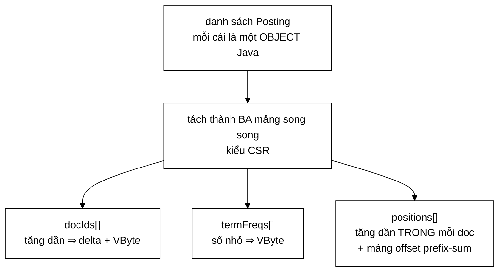

# CompressedPostings — dạng nén của posting list trên đĩa

**File nguồn:** `search-engine/src/main/java/com/vnsearch/index/CompressedPostings.java`
**Việc nó làm:** Biến posting list dạng bộ nhớ thành ba mảng byte nén, giảm chỉ mục từ **341,5 MB xuống 94,7 MB**.

> 📖 Chưa quen ký hiệu toán? Đọc [00 — Từ điển ký hiệu toán](../00-KY-HIEU-TOAN.md) trước.

> 📊 **Số đo trong trang này thuộc mốc A** — corpus **5.011 trang**. Repo có
> **bốn mốc corpus** đo trên bốn phiên crawl khác nhau; trộn chúng vào một bảng
> là cách nhanh nhất để ra số vô nghĩa. Bảng quy chiếu đầy đủ ở đầu
> [`DSA-REPORT.md`](../../DSA-REPORT.md). Mốc hiện hành là **D — 31.030 trang**.
> Nên đọc [VByteCodec](VByteCodec.md) trước trang này.

---

## 📌 Hiểu trong 30 giây



```
   TRƯỚC — 1,59 triệu object Posting, mỗi cái một List<Integer>

   [Posting]──▶[Posting]──▶[Posting]  …   mỗi object: header 16B
      │            │            │          + con trỏ + List riêng
      ▼            ▼            ▼
   [List]       [List]       [List]        341,5 MB

   SAU — ba mảng nguyên thuỷ, không object nào

   docIds   : ▪▪▪▪▪▪▪▪▪▪▪▪▪▪▪▪▪▪▪▪▪▪▪▪   đã nén VByte
   termFreqs: ▪▪▪▪▪▪▪▪▪▪▪▪▪▪▪▪▪▪▪▪▪▪▪▪   đã nén VByte
   positions: ▪▪▪▪▪▪▪▪▪▪▪▪▪▪▪▪▪▪▪▪▪▪▪▪   đã nén VByte
   offsets  : ▪  ▪   ▪    ▪              prefix sum — biết mỗi doc bắt đầu ở đâu

                                          94,7 MB   (÷ 3,6)
```

**Mảng `offsets` là mấu chốt của kiểu CSR.** Không có nó thì không biết vùng
`positions` của tài liệu thứ $i$ nằm ở đâu; có nó thì vị trí bắt đầu là
`offsets[i]` và độ dài là `offsets[i+1] - offsets[i]` — tra trong $O(1)$ mà
không tốn một con trỏ nào.

`VByteCodec` biết nén **một** danh sách số nguyên tăng dần. Nhưng một posting
list không phải một danh sách — nó là **ba** loại dữ liệu trộn vào nhau:

```java
record Posting(int docId, int termFrequency, int[] positions)
```

| Thành phần | Tăng dần? | Nén trực tiếp được? |
|---|---|---|
| `docId` qua các posting | ✅ Luôn tăng dần | ✅ Được ngay |
| `termFrequency` | ❌ Lung tung (3, 1, 2, 5…) | ❌ Không |
| `positions` của **một** posting | ✅ Tăng dần | ✅ Được |
| `positions` **nối liền** nhiều posting | ❌ Reset về 0 mỗi posting | ❌ Không |

Lớp này giải đúng ba chỗ ❌ đó, và giải bằng **hai ý tưởng** chứ không phải ba.

---

## 1. Ý tưởng thứ nhất — chứng minh một trường là thừa

**Quan sát.** Mọi `Posting` do `InvertedIndex.addDocument` tạo ra đều thoả:

$$\text{termFrequency} = |\text{positions}|$$

Vì `addDocument` gom vị trí trước rồi mới tạo Posting:

```java
Posting posting = new Posting(docId, positions.size(), positions);
//                                   ^^^^^^^^^^^^^^^^  chính là |positions|
```

Nên `termFrequency` **không mang thông tin nào mới**. Lưu nó là lưu cùng một
thứ hai lần.

> **Bài học tổng quát.** Cách rẻ nhất để nén một trường không phải là tìm thuật
> toán nén tốt hơn — mà là **chứng minh trường đó thừa**. Tỷ lệ nén của việc bỏ
> hẳn một trường là **vô hạn**; không thuật toán nào bằng.

**Nhưng "thừa" là một bất biến, và bất biến phải được ép.** Nếu ai đó về sau
tạo `Posting` với `tf ≠ |positions|`, dữ liệu sẽ **sai âm thầm** lúc giải nén —
và lỗi chỉ lộ ra ở điểm BM25 sai, hàng tháng sau. Vì vậy `of()` kiểm tra và ném
ngoại lệ ngay:

```java
if (posting.termFrequency() != positions.size()) {
    throw new IllegalArgumentException(
            "Bat bien 'termFrequency == positions.size()' bi vi pham tai docId " + ...);
}
```

Đây là cùng một triết lý với `InvertedIndex.addDocument` ép thứ tự docId tăng
dần: **biến một lỗi im lặng thành một lỗi ồn ào**, ngay tại chỗ sai.

---

## 2. Ý tưởng thứ hai — biến dãy không sắp xếp thành dãy sắp xếp

Bỏ được `termFrequency` rồi, vẫn còn một vấn đề: muốn giải nén `positions` thì
phải biết **mỗi posting có bao nhiêu vị trí**. Mà dãy số lượng đó không tăng
dần nên không nén bằng delta được.

**Lời giải: tổng tích luỹ (prefix sum).**

$$\text{offset}_0 = 0, \qquad \text{offset}_{i+1} = \text{offset}_i + tf_i$$

```
tf mỗi posting  : [3, 1, 2, 5]        ← không tăng dần ❌
offset tích luỹ : [0, 3, 4, 6, 11]    ← LUÔN tăng dần ✅
```

Tổng tích luỹ của một dãy **không âm** thì **luôn không giảm** — đó là toàn bộ
lý do thủ thuật này hoạt động. Và phép nghịch đảo cũng tầm thường:

$$tf_i = \text{offset}_{i+1} - \text{offset}_i$$

Nhờ vậy **đúng một** codec (`encodeSorted`) dùng được cho **cả ba** mảng.

### Đây chính là `rowPtr` của CSR

Không phải trùng hợp — đây là **cùng một kỹ thuật** mà
[`SparseMatrix.freeze()`](../05-datastructures/SparseMatrix.md) dùng để nén ma
trận thưa:

| | `SparseMatrix` (CSR) | `CompressedPostings` |
|---|---|---|
| Mảng "con trỏ" | `csrRowPtr[rows + 1]` | `offsets[count + 1]` |
| Suy ra kích thước | `rowPtr[r+1] - rowPtr[r]` = số phần tử khác 0 của hàng `r` | `offsets[i+1] - offsets[i]` = số vị trí của posting `i` |
| Phần tử canh biên | `csrRowPtr[rows] = nnz` | `offsets[count] = tổng vị trí` |

Cùng một ý tưởng xuất hiện **hai lần** ở hai chỗ không liên quan trong đồ án.
Đó là dấu hiệu nó là một kỹ thuật nền tảng, không phải một thủ thuật riêng lẻ.

**Vì sao cần phần tử canh biên (`count + 1` phần tử chứ không phải `count`).**
Để công thức `offsets[i+1] - offsets[i]` đúng cho **mọi** `i` kể cả phần tử
cuối, không cần một nhánh `if` riêng. Cùng lý do với sentinel node của
[LRUCache](../05-datastructures/LRUCache.md): **thêm một phần tử giả để xoá
mọi trường hợp đặc biệt.**

---

## 3. Vì sao `positions` phải nén theo **đoạn**

Sau khi có mảng offset, vẫn không thể nối tất cả vị trí lại rồi delta hoá một
lần. Lý do:

```
posting 0: positions = [100]
posting 1: positions = [1]

Nối lại  : [100, 1]
Delta    : [100, -99]        ← ÂM! VByte chỉ mã hoá được số không âm
```

Vị trí là **chỉ số token trong tài liệu**, nên mỗi tài liệu bắt đầu lại từ 0.
Ranh giới posting là chỗ dãy "nhảy lùi".

Vì vậy `VByteCodec.encodeSegments` reset biến `previous` về 0 ở **đầu mỗi
đoạn**:

```java
for (int[] segment : segments) {
    int previous = 0;          // ← đây là toàn bộ khác biệt với encodeSorted
    for (int i = 0; i < segment.length; i++) { ... }
}
```

Giải nén đọc **tuần tự**: đọc xong đoạn `i` thì con trỏ byte đã đứng đúng đầu
đoạn `i+1`. Nhờ vậy **không cần lưu vị trí byte** bắt đầu của từng đoạn — chỉ
cần biết số phần tử, mà số đó đã suy được từ mảng offset. Ba mảng khớp nhau
vừa khít, không mảng nào thừa.

---

## 4. Ví dụ tính tay đầy đủ

Posting list của term `công_nghệ` trong một corpus tí hon:

```
Posting(docId=3,  tf=2, positions=[5, 9])
Posting(docId=17, tf=1, positions=[0])
Posting(docId=19, tf=3, positions=[2, 7, 40])
```

### Bước 1 — tách thành ba dãy

| Dãy | Giá trị | Tăng dần? |
|---|---|---|
| `docIds` | `[3, 17, 19]` | ✅ |
| `offsets` | `[0, 2, 3, 6]` | ✅ (tổng tích luỹ của `[2, 1, 3]`) |
| `segments` | `[5, 9]`, `[0]`, `[2, 7, 40]` | ✅ trong từng đoạn |

### Bước 2 — delta hoá

| Dãy | Gốc | Delta |
|---|---|---|
| `docIds` | `[3, 17, 19]` | `[3, 14, 2]` |
| `offsets` | `[0, 2, 3, 6]` | `[0, 2, 1, 3]` |
| đoạn 0 | `[5, 9]` | `[5, 4]` |
| đoạn 1 | `[0]` | `[0]` |
| đoạn 2 | `[2, 7, 40]` | `[2, 5, 33]` |

### Bước 3 — VByte

Mọi delta ở đây đều $\le 127$ nên **mỗi số đúng 1 byte**:

| Mảng | Số phần tử | Số byte |
|---|---|---|
| `docIds` | 3 | **3** |
| `offsets` | 4 | **4** |
| `positions` | 6 | **6** |
| **Tổng** | | **13 byte** |

### So sánh với dạng chưa nén

| Cách lưu | Số byte |
|---|---|
| `int` thuần (3 docId + 3 tf + 6 vị trí = 12 số × 4 byte) | **48** |
| **CompressedPostings** | **13** |
| | **tiết kiệm 72,9 %** |

Chưa kể dạng trong bộ nhớ còn tệ hơn nhiều: mỗi `Integer` boxed tốn **16 byte**
chứ không phải 4.

### Bước 4 — giải nén, kiểm tra khớp

```
decodeSorted(docIds, 3)     → [3, 17, 19]        ✓
decodeSorted(offsets, 4)    → [0, 2, 3, 6]       ✓
tf[i] = offsets[i+1] - offsets[i] → [2, 1, 3]    ✓
decodeSegments(positions, [2,1,3]) → [5,9], [0], [2,7,40]  ✓
```

Khôi phục **đúng nguyên vẹn** cả ba thành phần, kể cả `termFrequency` vốn không
hề được lưu.

---

## 5. Độ phức tạp

| Thao tác | Thời gian | Bộ nhớ |
|---|---|---|
| `of(postings)` | $O(n + \sum_i tf_i)$ — một lượt | $O(\text{số byte kết quả})$ |
| `toPostings()` | $O(n + \sum_i tf_i)$ — một lượt | $O(n + \sum_i tf_i)$ cho kết quả |
| `totalBytes()` | $O(1)$ | $O(1)$ |

với $n$ = số posting (= document frequency của term).

Không có phép sắp xếp, không có cấu trúc trung gian nào ngoài bộ đệm kết quả.
Cả hai chiều đều **tuyến tính theo lượng dữ liệu thật sự đi qua**.

---

## 6. Kết quả đo trên corpus thật

Corpus 5.011 trang, 136.768 term phân biệt. Ba mốc để **tách bạch** hai thay
đổi (bỏ thụt dòng, và nén):

| Định dạng | Kích thước | So với mốc trước |
|---|---|---|
| A. Thụt dòng + không nén (**cũ**) | **341,5 MB** | — |
| B. Gói + không nén | **226,6 MB** | −33,7 % |
| C. Gói + nén VByte (**đang dùng**) | **94,7 MB** | **−58,2 %** |
| | | **Tổng: −72,3 % (nhỏ 3,60 lần)** |

Chạy lại:

```bash
MAVEN_OPTS=-Xmx4g ./mvnw.cmd -q compile exec:java \
  -Dexec.mainClass=com.vnsearch.index.IndexPersistence \
  -Dexec.args="data/crawled-documents.json"
```

> **Vì sao ba mốc chứ không phải hai.** Gộp cả hai thay đổi rồi báo một con số
> sẽ **quy nhầm công của việc bỏ thụt dòng cho phần nén**: nén được báo là
> −72,3 % trong khi công thật của nó là −58,2 %. Cùng một bài học phương pháp
> với lỗi JIT warmup ở [`DSA-REPORT §3.2`](../../DSA-REPORT.md).

---

## 7. Vì sao không dùng GZIP cho xong

GZIP nén tốt hơn (nó bắt được cả quy luật lặp trong JSON) và chỉ tốn 3 dòng
code. Nhưng nó **phá vỡ một tính chất quan trọng hơn tỷ lệ nén**:

| Tiêu chí | GZIP toàn file | CompressedPostings |
|---|---|---|
| Tỷ lệ nén | Tốt hơn | Kém hơn |
| Đọc **một** term | ❌ Phải giải nén **toàn bộ** | ✅ Chỉ giải nén term đó |
| Nạp theo yêu cầu (lazy) | ❌ Không thể | ✅ Được |
| Tự cài (yêu cầu đồ án) | ❌ Gọi thư viện | ✅ Tự cài |

Giữ **mỗi term là một đơn vị độc lập** mở đường cho một cải tiến sau này: nạp
posting list **khi cần** thay vì nạp cả chỉ mục vào RAM lúc khởi động. Nén
**cộng** truy cập ngẫu nhiên là thứ nén tổng quát không cho.

So sánh đầy đủ với PForDelta, Simple9, Elias–Fano, Roaring Bitmap:
[`SO-SANH-PHUONG-AN.md §4`](../../SO-SANH-PHUONG-AN.md).

---

## 8. Khái niệm học được từ file này

| Khái niệm | Xuất hiện ở |
|---|---|
| **Prefix sum để biến dãy bất kỳ thành dãy đơn điệu** | §2 |
| **Định dạng CSR / `rowPtr`** | §2 |
| **Phần tử canh biên xoá trường hợp đặc biệt** | §2 |
| **Loại bỏ dữ liệu dư thừa bằng chứng minh bất biến** | §1 |
| **Fail fast** — ép bất biến, ném ngoại lệ tại chỗ sai | §1 |
| **Mã hoá theo đoạn (segmented encoding)** | §3 |
| **Đọc tuần tự để khỏi lưu con trỏ vị trí** | §3 |
| **Tách biến khi đo** — ba mốc thay vì hai | §6 |
| **Nén ≠ chỉ có tỷ lệ nén** — truy cập ngẫu nhiên là một tiêu chí | §7 |

---

## 9. Hạn chế đã biết

1. **Chỉ nén ở tầng lưu trữ.** Sau khi `toPostings()`, dữ liệu trở lại dạng
   `List<Posting>` với `Integer` boxed (16 byte/phần tử). Nén trong RAM tiết
   kiệm nhiều hơn hẳn nhưng phải giải mã ở **đường nóng** của mỗi truy vấn —
   đánh đổi chưa được đo.
2. **Overhead base64 +33 %.** Đánh đổi có chủ ý để giữ một file JSON duy nhất;
   ở dạng nhị phân thuần chỉ mục còn ~71 MB.
3. **Không có skip pointer trong dữ liệu nén.** Muốn tới posting thứ $k$ phải
   giải nén $k$ posting đầu. Chỉ mục thật chia thành khối 128 posting và lưu
   skip pointer giữa các khối.
4. **`int` 32-bit.** Corpus vượt 2,1 tỷ tài liệu sẽ cần `long`.

---

## 10. Liên kết

- Codec bên dưới: [VByteCodec](VByteCodec.md)
- Bất biến "posting list sắp xếp" mà cả hai dựa vào: [InvertedIndex §4](InvertedIndex.md)
- Cùng kỹ thuật `rowPtr` ở chỗ khác: [SparseMatrix](../05-datastructures/SparseMatrix.md)
- Cùng triết lý "phần tử canh biên": [LRUCache](../05-datastructures/LRUCache.md)
- So sánh với các thuật toán nén khác: [SO-SANH-PHUONG-AN.md §4](../../SO-SANH-PHUONG-AN.md)
- Mục lục: [../README.md](../README.md)
