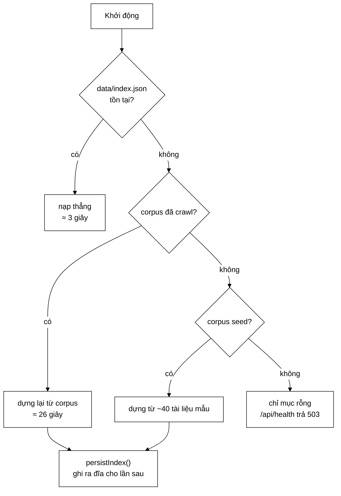

# IndexPersistence — đánh đổi giữa đơn giản và kích thước

**File nguồn:** `search-engine/src/main/java/com/vnsearch/index/IndexPersistence.java`
**Việc nó làm:** Lưu/nạp toàn bộ chỉ mục ra một file JSON, để không phải crawl + index lại mỗi lần khởi động.

> 📖 Chưa quen ký hiệu toán? Đọc [00 — Từ điển ký hiệu toán](../00-KY-HIEU-TOAN.md) trước.

> 📊 **Số đo trong trang này thuộc mốc A** — corpus **5.011 trang**. Repo có
> **bốn mốc corpus** đo trên bốn phiên crawl khác nhau; trộn chúng vào một bảng
> là cách nhanh nhất để ra số vô nghĩa. Bảng quy chiếu đầy đủ ở đầu
> [`DSA-REPORT.md`](../../DSA-REPORT.md). Mốc hiện hành là **D — 31.030 trang**.


> ### 🔄 Đã cập nhật sau đợt tái cấu trúc
>
> Phần **toán học và thuật toán** dưới đây vẫn đúng nguyên vẹn. Nhưng một số
> đoạn mã trích dẫn và mục *"Hạn chế đã biết"* mô tả **phiên bản trước**.
> Những gì đã thay đổi ở file này:
>
> - Nhận `Tokenizer` (interface) thay vì lớp cụ thể.
> - Trạng thái dẫn xuất nay tính lại qua `InvertedIndex.recomputeDerivedState()` — gom về một chỗ nên thêm trạng thái mới chỉ sửa một nơi.
>

---

## 📌 Hiểu trong 30 giây

Dựng chỉ mục mất **6,8–9,5 giây**; crawl lại corpus mất **3,2 phút**. Không có persistence thì mỗi lần khởi động Spring Boot đều phải trả cái giá đó.

Lớp này chỉ 46 dòng và **không chứa thuật toán mới nào**. Nó có mặt trong tập tài liệu này vì hai lý do: nó minh hoạ một **đánh đổi thiết kế** rõ ràng, và nó là nơi một **bất biến bị phá vỡ nếu bất cẩn** (đã phân tích ở [InvertedIndex §7](InvertedIndex.md)).



```
   CHUỖI DỰ PHÒNG 4 TẦNG — mỗi tầng đều kiểm docs.isEmpty()

   ① index.json      ──▶ nạp thẳng            3 giây   ◀── đường nhanh
   ② PostgreSQL      ──▶ dựng lại            26 giây
   ③ corpus JSON     ──▶ dựng lại            26 giây
   ④ seed 40 bài     ──▶ dựng lại           tức thì   ◀── vừa clone là chạy
   ─────────────────────────────────────────────────
   ⑤ không gì cả     ──▶ chỉ mục rỗng, health 503
```

⚠️ **Cái giá của đường nhanh, phải biết trước.** Tầng ① được **ưu tiên tuyệt
đối**. Sau một phiên crawl bằng dòng lệnh, corpus mới hơn `index.json` nhưng
backend vẫn nạp chỉ mục **cũ** — không lỗi, không cảnh báo từ ứng dụng, chỉ là
trang vừa crawl không tìm ra.

```
   data/crawled-documents.json   12:08  ◀── mới
   data/index.json               10:46  ◀── nhưng cái này được nạp

   chữa:  POST /api/admin/reindex
```

**Vì sao tệp rỗng cũng phải bị loại.** Một phiên crawl hỏng để lại `index.json`
159 byte. Nếu tầng ① chỉ hỏi "tệp có tồn tại không" thì nó nạp tệp rỗng rồi
`return` — che mất cả corpus phía sau. Trong Docker, hậu quả là container vào
**vòng lặp khởi động lại vô hạn** vì health check mãi trả 503. Nay mỗi tầng đều
kiểm `docs.isEmpty()`.

---

## 1. Toàn bộ lớp

```java
private static ObjectMapper createMapper() {
    return new ObjectMapper()
            .registerModule(new JavaTimeModule())
            .disable(SerializationFeature.WRITE_DATES_AS_TIMESTAMPS);
    // INDENT_OUTPUT đã tắt — xem §3.3
}

public static void save(InvertedIndex index, String path) throws IOException {
    Path filePath = Path.of(path);
    if (filePath.getParent() != null) {
        Files.createDirectories(filePath.getParent());
    }
    createMapper().writeValue(new File(path), index.exportData());
}

public static InvertedIndex load(String path, Tokenizer tokenizer) throws IOException {
    InvertedIndex.IndexData data = createMapper().readValue(new File(path), InvertedIndex.IndexData.class);
    return InvertedIndex.importData(data, tokenizer);
}

public static InvertedIndex load(String path) throws IOException {
    return load(path, new VietnameseTokenizer());
}
```

---

## 2. Đánh đổi trung tâm: một file chứa tất cả

Lớp lưu **toàn bộ** `IndexData` trong **một** file JSON:

```java
record IndexData(Map<String, CompressedPostings> index,   // ← đã nén, xem §3.4
                 Map<Integer, WebDocument> documents,
                 Map<Integer, Integer> docLength) {
}
```

`WebDocument` chứa cả `bodyText` đầy đủ — trung bình 6 KB mỗi tài liệu. Kết quả:

| File | Kích thước (corpus 5.011 trang) |
|---|---|
| `data/index.json` — thụt dòng + **không nén** (định dạng cũ) | **341,5 MB** |
| `data/index.json` — gói + **nén VByte** (đang dùng) | **94,7 MB** |
| `data/crawled-documents.json` (chỉ tài liệu thô) | **62 MB** |

**Vì sao `index.json` vẫn lớn hơn `crawled-documents.json`:** nó chứa **cả hai** —
toàn văn `WebDocument` **và** posting list của 136.768 term (5,2 triệu cặp
(term, doc) kèm vị trí). Đây là cái giá của việc gộp mọi thứ vào một file.

**Bảng đánh đổi:**

| Tiêu chí | Một file JSON (dự án chọn) | Nhiều file / định dạng nhị phân |
|---|---|---|
| Độ phức tạp code | **~60 dòng** | hàng trăm dòng |
| Thứ tự nạp lại | **không có vấn đề** — một lần đọc | phải quản lý phụ thuộc |
| Kích thước | 94,7 MB | ~71 MB (bỏ overhead base64 +33 %) |
| Đọc được bằng mắt | phần tài liệu: có; posting list: **không** (base64) | không |
| Nạp một phần | **không thể** (hiện tại) | được |

**Đánh đổi đã dịch chuyển sau khi nén.** Trước đây lý do mạnh nhất để chọn JSON
là *"mở lên xem được ngay"*. Nay posting list ở dạng base64 nên lý do đó **chỉ
còn đúng một nửa** — phần `documents` vẫn đọc được, phần `index` thì không. Lý
do còn lại vẫn đủ mạnh: **một file, một lần đọc, không phải quản lý thứ tự phụ
thuộc**. Nói rõ rằng một lập luận đã yếu đi thì trung thực hơn là giữ nguyên
nó như chưa có gì thay đổi.

Với quy mô đồ án, cột giữa thắng rõ ràng. Javadoc của lớp nói thẳng điều này:

> *"don gian hoa viec nap lai dung thu tu, chap nhan danh doi la file co the lon (chua ca noi dung WebDocument) de doi lay tinh don gian."*

Nói rõ đánh đổi thay vì giả vờ không có là điều đáng làm trong mọi báo cáo kỹ thuật.

---

## 3. Ba cấu hình Jackson và lý do từng cái

### 3.1 `registerModule(new JavaTimeModule())`

`WebDocument.crawledAt` là `java.time.Instant`. Jackson lõi **không** biết serialize các kiểu của `java.time` (chúng ra đời sau Jackson). Không đăng ký module này, Jackson sẽ cố serialize `Instant` theo cấu trúc trường nội bộ và cho ra thứ vô nghĩa như `{"seconds":1690000000,"nanos":0}` — hoặc ném lỗi khi đọc lại.

### 3.2 `disable(WRITE_DATES_AS_TIMESTAMPS)`

Mặc định Jackson ghi thời gian dưới dạng **số** (epoch seconds). Tắt đi thì nó ghi chuỗi ISO-8601:

| Cấu hình | Kết quả |
|---|---|
| Mặc định (bật) | `1690000000.000000000` |
| **Đã tắt** | `"2026-07-22T10:26:40Z"` |

Chuỗi ISO dài hơn nhưng **đọc được bằng mắt** — nhất quán với triết lý "chọn JSON để xem được" ở §2. Nó cũng tránh mất độ chính xác nano giây khi số thực bị làm tròn.

### 3.3 ~~`enable(INDENT_OUTPUT)`~~ — đã tắt, và con số dự đoán đã được kiểm chứng

Bản trước bật thụt lề cho đẹp, và trang này từng ghi:

> *"Đây là chỗ đáng cân nhắc lại. Thụt lề tốn khoảng 30–40 % kích thước file.
> Không ai thực sự đọc một file 9 MB bằng mắt."*

**Nay đã tắt, và phép đo xác nhận dự đoán đó gần như chính xác:**

| Định dạng | Kích thước | Chênh |
|---|---|---|
| Thụt dòng | 341,5 MB | — |
| **Gói (đã tắt thụt lề)** | **226,6 MB** | **−33,7 %** |

Dự đoán "30–40 %" → thực đo **33,7 %**. Đây là một ví dụ nhỏ nhưng đáng giá của
việc **ghi lại dự đoán trước khi đo**: nó biến một nhận xét mơ hồ thành một
giả thuyết kiểm chứng được.

Nguyên tắc rút ra và nay đã áp dụng nhất quán: **tắt thụt lề cho file máy đọc**
(`index.json`), **giữ bật cho file người phải điền tay** (`pool-to-label.json`
— xem [PoolBuilder](../06-eval/PoolBuilder.md)).

### 3.4 Nén posting list trước khi ghi

Thay đổi lớn hơn thụt lề: posting list được nén bằng delta + variable-byte
trước khi đưa cho Jackson. Chi tiết ba kỹ thuật nén và ví dụ tính tay:
[CompressedPostings](CompressedPostings.md).

| Định dạng | Kích thước | Chênh |
|---|---|---|
| Gói + không nén | 226,6 MB | — |
| **Gói + nén VByte** | **94,7 MB** | **−58,2 %** |

> **Vì sao phải tách hai phép đo này ra.** Gộp cả hai thay đổi rồi báo một con
> số (−72,3 %) sẽ **quy nhầm công của việc bỏ thụt lề cho phần nén**. Cùng bài
> học phương pháp với lỗi JIT warmup ở [`DSA-REPORT §3.2`](../../DSA-REPORT.md):
> *không bao giờ đổi hai biến cùng lúc rồi báo một tỷ lệ.*

---

## 4. `createMapper()` gọi mới mỗi lần — có đáng không

```java
createMapper().writeValue(new File(path), index.exportData());
```

Mỗi lần `save`/`load` tạo một `ObjectMapper` mới. `ObjectMapper` khá đắt để khởi tạo (nó dựng cache của serializer/deserializer cho từng kiểu).

**Vì sao ở đây không sao:** `save` và `load` được gọi đúng **vài lần trong cả vòng đời ứng dụng** — lúc khởi động, và sau mỗi lần crawl/reindex. Chi phí vài chục mili giây so với vài giây ghi gần 100 MB ra đĩa là không đáng kể.

**Vì sao vẫn nên biết:** `ObjectMapper` là **thread-safe sau khi cấu hình xong** và được thiết kế để dùng lại. Nếu lớp này được gọi trong vòng lặp nóng (ví dụ serialize từng phản hồi HTTP), tạo mới mỗi lần sẽ là một lỗi hiệu năng nghiêm trọng. Đây là kiến thức đáng có, kể cả khi ở đây không dùng tới.

---

## 5. `Files.createDirectories` — chi tiết nhỏ cứu người dùng

```java
Path filePath = Path.of(path);
if (filePath.getParent() != null) {
    Files.createDirectories(filePath.getParent());
}
```

`new File("data/index.json")` với thư mục `data/` **chưa tồn tại** sẽ ném `FileNotFoundException` — một lỗi khó hiểu với người vừa clone repo về.

`createDirectories` (số nhiều) tạo cả cây thư mục nếu cần, và **không ném lỗi** nếu thư mục đã có (khác với `createDirectory` số ít). Kiểm tra `getParent() != null` xử lý trường hợp đường dẫn không có thư mục cha (`"index.json"`).

Cùng đoạn code này xuất hiện ở `CrawlerService.saveToJson` và `PoolBuilder.writePools` — một chỗ **trùng lặp nhỏ** đáng gom vào một hàm tiện ích chung.

---

## 6. Nạp lại phá vỡ bất biến gì

Đây là phần quan trọng nhất về mặt đúng đắn.

```java
static InvertedIndex importData(IndexData data, Tokenizer tokenizer) {
    InvertedIndex result = new InvertedIndex(tokenizer);
    result.index.putAll(data.index());
    result.documents.putAll(data.documents());
    result.docLength.putAll(data.docLength());
    // Nap lai tu file khong di qua addDocument nen phai tinh lai tong token.
    result.totalTokens = data.docLength().values().stream().mapToLong(Integer::longValue).sum();
    return result;
}
```

**Nạp lại KHÔNG đi qua `addDocument`.** Nghĩa là mọi thứ mà `addDocument` làm ngoài việc điền ba map đều **không xảy ra** — cụ thể là việc cộng dồn `totalTokens`.

Nếu quên dòng cuối:

$$\text{totalTokens} = 0 \implies \text{avgdl} = 0 \implies \text{BM25 trả về } 0 \text{ cho mọi tài liệu}$$

```java
double avgDocLength = index.getAverageDocLength();
if (avgDocLength <= 0) {
    return 0.0;                    // ← toàn bộ BM25 chết lặng
}
```

Không có ngoại lệ, không có log. Chỉ là mọi kết quả BM25 bằng 0 và bảng đánh giá trong `EVALUATION.md` toàn số 0 — người viết báo cáo sẽ mất hàng giờ để tìm ra tại sao.

> **Bài học tổng quát:** mỗi khi một lớp có **trạng thái dẫn xuất** (giá trị tính từ trạng thái khác và được lưu sẵn để tăng tốc), thì **mọi đường vào** cấu trúc đó đều phải cập nhật nó. Cứ mỗi đường vào mới là một cơ hội quên.
>
> Cách thiết kế tránh được lỗi này hoàn toàn: đặt việc tính `totalTokens` vào một hàm `private void recomputeDerivedState()` và gọi ở cuối **cả** `addDocument` lẫn `importData`. Khi đó thêm một trạng thái dẫn xuất mới chỉ cần sửa một chỗ.

---

## 7. Nạp có ưu tiên — chuỗi dự phòng bốn tầng

`SearchEngineFacade.init()` dùng `IndexPersistence.load` như một mắt xích trong chuỗi:

**Bản cũ** — bốn nhánh `else if` chôn cứng trong `init()`:

```java
if (postgresEnabled && loadFromPostgres()) {                // ← BẢN CŨ
    System.out.println("Da nap corpus tu PostgreSQL");
} else if (Files.exists(Path.of(indexDataPath))) {
    index = IndexPersistence.load(indexDataPath);
} else if (Files.exists(Path.of(crawledDataPath))) {
    ...
} else if (Files.exists(Path.of(seedDataPath))) {
    ...
}
```

**Bản hiện tại** — chuỗi dự phòng trở thành **dữ liệu** thay vì **cấu trúc điều khiển**:

```java
// Đường nhanh nhất: chỉ mục đã dựng sẵn, không phải tokenize lại.
if (Files.exists(Path.of(indexDataPath))) {
    index = IndexPersistence.load(indexDataPath, tokenizer);
    log.info("Da nap chi muc dung san tu {}", indexDataPath);
    return;
}
for (DocumentStore store : buildStoreChain()) {
    if (!store.isAvailable()) continue;
    lastCrawledDocuments = store.loadAll();
    index = indexBuilder.build(lastCrawledDocuments);
    log.info("Da nap corpus tu {} ({} tai lieu)", store.describe(), lastCrawledDocuments.size());
    return;
}
log.warn("Khong tim thay nguon du lieu nao, bat dau voi index rong");
```

Thêm nguồn thứ tư (S3, MongoDB, Redis) = **thêm một lớp**, không sửa hàm này. Xem [**01-STRATEGY.md §4.4**](../08-design-patterns/01-STRATEGY.md).

| Tầng | Nguồn | Chi phí |
|---|---|---|
| 1 | PostgreSQL | 1,0 giây đọc + 6,8 giây index |
| 2 | **`index.json`** | **vài giây, không index lại** |
| 3 | `crawled-documents.json` | vài giây đọc + 6,8 giây index |
| 4 | `seed-documents.json` | tức thì (~40 tài liệu) |

Tầng 4 là chi tiết đáng khen về trải nghiệm: người vừa clone repo về chạy được ngay, không cần crawl mạng thật, không cần cài PostgreSQL. Nhiều đồ án bỏ qua điều này và người chấm không chạy nổi.

---

## 8. Độ phức tạp

| Thao tác | Thời gian | Bộ nhớ đỉnh |
|---|---|---|
| `save` | $O(\lvert\text{chỉ mục}\rvert)$ | Jackson stream ra file, không dựng chuỗi trong RAM |
| `load` | $O(\lvert\text{file}\rvert)$ | **Toàn bộ cây object trong RAM** |

**Điểm cần lưu ý về bộ nhớ khi nạp:** Jackson `readValue` dựng **toàn bộ** `IndexData` trong RAM trước khi `importData` chạy. Với gần 100 MB JSON, cây object Java tương ứng lớn hơn nhiều — mỗi `Integer` trong `positions` là một object 16 byte, mỗi `String` term có overhead ~40 byte. Ước lượng thô: **1,5–2,5 GB** heap ở đỉnh — đây là lý do các lệnh đo phải chạy với `MAVEN_OPTS=-Xmx4g`.

Với chỉ mục lớn hơn, phải chuyển sang **streaming API** của Jackson (`JsonParser`) để xử lý từng phần tử một thay vì dựng cả cây.

---

## 9. Chủ đề DSA thể hiện

| Chủ đề | Ở đâu |
|---|---|
| **Serialize / deserialize** | Jackson, `record` ↔ JSON |
| **Trạng thái dẫn xuất** | `totalTokens` phải tính lại khi nạp |
| **Chuỗi dự phòng có ưu tiên** | 4 tầng nguồn dữ liệu |
| **Đánh đổi đơn giản ↔ kích thước** | một file chứa tất cả |
| **Mức truy cập package-private** | `IndexData` chỉ phơi cho lớp này |
| **Suy biến nhẹ nhàng** | không có dữ liệu → dùng seed mẫu |

---

## 10. Hạn chế đã biết

1. **`INDENT_OUTPUT` cho file máy đọc** — lãng phí ~3 MB (xem §3.3).
2. **Không nén.** JSON gzip lại sẽ nhỏ hơn khoảng 5–8 lần. `GZIPOutputStream` bọc quanh là một dòng code.
3. **Không nạp từng phần.** Phải đọc cả file kể cả khi chỉ cần thống kê — dù dạng nén *cho phép* nạp theo yêu cầu, đường đọc hiện tại chưa tận dụng.
4. **Không có phiên bản định dạng.** Nếu `Posting` thêm một trường, file cũ nạp vào sẽ hỏng mà không có thông báo rõ ràng. Thêm một trường `formatVersion` là cách phòng chuẩn.
5. **Ghi không nguyên tử.** Nếu tiến trình chết giữa lúc `writeValue`, file `index.json` bị cắt cụt và **không nạp lại được**, mà bản cũ cũng đã mất. Cách chuẩn: ghi ra `index.json.tmp` rồi `Files.move(..., ATOMIC_MOVE)`.
6. **Trùng lặp `createDirectories`** ở ba lớp (xem §5).

---

## 11. Liên kết

- Cấu trúc được lưu: [InvertedIndex.md](InvertedIndex.md)
- Người gọi: `service/SearchEngineFacade.java`
- Nguồn dữ liệu thay thế: `storage/DocumentRepository.java`
- Ký hiệu chưa hiểu: [00 — Từ điển ký hiệu toán](../00-KY-HIEU-TOAN.md)
