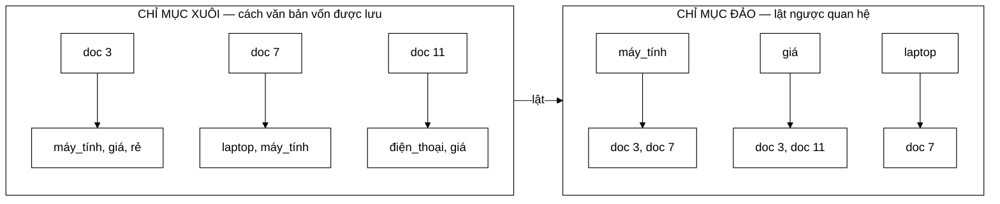
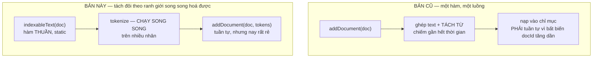

# InvertedIndex — lật ngược quan hệ, và bất biến quan trọng nhất dự án

**File nguồn:** `search-engine/src/main/java/com/vnsearch/index/InvertedIndex.java`
**Việc nó làm:** Trả lời *"tài liệu nào chứa từ này?"* trong $O(1)$ thay vì $O(N)$.

> 📖 Chưa quen ký hiệu toán? Đọc [00 — Từ điển ký hiệu toán](../00-KY-HIEU-TOAN.md) trước.

> 📊 **Số đo trong trang này thuộc mốc A** — corpus **5.011 trang**. Repo có
> **bốn mốc corpus** đo trên bốn phiên crawl khác nhau; trộn chúng vào một bảng
> là cách nhanh nhất để ra số vô nghĩa. Bảng quy chiếu đầy đủ ở đầu
> [`DSA-REPORT.md`](../../DSA-REPORT.md). Mốc hiện hành là **D — 31.030 trang**.


> ### 🔄 Đã cập nhật sau đợt tái cấu trúc
>
> Phần **toán học và thuật toán** dưới đây vẫn đúng nguyên vẹn. Nhưng một số
> đoạn mã trích dẫn và mục *"Hạn chế đã biết"* mô tả **phiên bản trước**.
> Những gì đã thay đổi ở file này:
>
> - **Bất biến sắp xếp nay do lớp TỰ ÉP**: `addDocument` ném `IllegalArgumentException` nếu gọi sai thứ tự docId.
> - Đã gom ba bản sao `findTermFrequencyInDoc` về một `binarySearchPosting`; API mới là `getTermFrequency(term, docId)`.
> - `getAllDocuments()` nay trả `Collections.unmodifiableMap`.
> - Đã thêm **Flyweight** (`TermDictionary.intern`) cho khoá term, và lớp cài đặt interface `SearchIndex`.
> - Trạng thái dẫn xuất gom vào `recomputeDerivedState()` — một chỗ duy nhất.
>

---

## 📌 Hiểu trong 30 giây



```
   CHỈ MỤC XUÔI                      CHỈ MỤC ĐẢO
   ─────────────                     ────────────
   doc 3  → máy_tính, giá, rẻ        máy_tính → [3, 7]
   doc 7  → laptop, máy_tính         giá      → [3, 11]
   doc 11 → điện_thoại, giá          laptop   → [7]

   "tìm doc chứa máy_tính"           "tìm doc chứa máy_tính"
   duyệt HẾT N tài liệu              tra 1 lần vào bảng băm
        O(N)                              O(1)
```

Chỉ mục **xuôi** (`doc → danh sách từ`) là thứ tự tự nhiên — đó chính là cách văn bản được lưu. Nhưng muốn tìm tài liệu chứa `máy_tính` phải duyệt hết **mọi** tài liệu:

$$5011 \text{ tài liệu} \times 1043 \text{ token} = \mathbf{5{,}2 \text{ triệu}} \text{ phép so sánh} \quad\text{cho MỖI truy vấn}$$

**Ý tưởng.** Lật ngược quan hệ: `từ → danh sách tài liệu`. Tra một từ trở thành một phép tra `HashMap`: **$O(1)$**.

```
Chỉ mục xuôi                      Chỉ mục đảo
doc1 → [máy_tính, xách_tay, rẻ]   máy_tính  → [doc1, doc2]
doc2 → [công_nghệ, máy_tính]      xách_tay  → [doc1]
                                  công_nghệ → [doc2]
```

Đây là **ý tưởng nền tảng nhất của toàn ngành truy hồi thông tin**. Mọi máy tìm kiếm — từ Google tới Elasticsearch tới `pg_trgm` của PostgreSQL — đều xây trên nó.

Nhưng phần thú vị nhất của lớp này không phải chỉ mục đảo. Đó là một **bất biến** dài đúng một câu, được đảm bảo **miễn phí**, và mở khoá hai tối ưu lớn ở tầng trên.

---

## 1. Cấu trúc dữ liệu

```java
private final Map<String, List<Posting>> index = new LinkedHashMap<>();
private final Map<Integer, WebDocument> documents = new LinkedHashMap<>();
private final Map<Integer, Integer> docLength = new LinkedHashMap<>();
private long totalTokens = 0;
```

| Cấu trúc | Vai trò | Kích thước thật |
|---|---|---|
| `index` | Trái tim — term → posting list | **136.768** khoá |
| `documents` | docId → tài liệu gốc (lấy tiêu đề, URL, snippet) | 5.011 mục |
| `docLength` | docId → số token (chuẩn hoá độ dài) | 5.011 mục |
| `totalTokens` | Tổng token toàn corpus | 5.226.463 |

**Vì sao `LinkedHashMap` mà không phải `HashMap`:** để việc duyệt (`getAllDocuments().values()`, `exportData()`) cho ra **thứ tự ổn định**. Điều này khiến việc lưu/nạp JSON và việc dựng lại Trie gợi ý tái lập được giữa các lần chạy. Cái giá là mỗi mục tốn thêm 2 tham chiếu cho danh sách liên kết đôi — với 136.768 khoá là khoảng 2 MB, chấp nhận được để đổi lấy tính tái lập.

---

## 2. Mỗi posting chứa gì

**`Posting.java:43`:**

```java
public record Posting(int docId, int termFrequency, int[] positions) {
```

| Trường | Dùng để |
|---|---|
| `docId` | Định danh tài liệu; cơ sở cho phép giao posting list |
| `termFrequency` | $f(t,d)$ trong TF-IDF và BM25 |
| `positions` | Tìm theo cụm từ (hai term "cạnh nhau" khi vị trí sau = vị trí trước + 1) |

Là `record` (bất biến) vì một `Posting` không bao giờ thay đổi sau khi tạo — index lại thì tạo `Posting` mới.

### 2.1 `int[]` chứ không phải `List<Integer>` — tiết kiệm bộ nhớ lớn nhất của cả chỉ mục

> ⚠️ **Bản trước của trang này ghi `List<Integer> positions`.** Kiểu đó đã bị
> thay, và đây **không phải tối ưu vặt** — nó là thay đổi tiết kiệm bộ nhớ lớn
> nhất của toàn bộ chỉ mục, quyết định **bằng số đo** chứ không bằng cảm tính
> (`Posting.java:15-34`, đo bằng [`MemoryBreakdown`](../06-eval/00-SO-DO-TU-DUY.md)).

Trên corpus 2.518 trang — **3.821.061 vị trí, 1.594.938 posting**:

```
   List<Integer>                          int[]
   ├─ Integer:        16 byte/phần tử     ├─ 4 byte/phần tử
   ├─ ô tham chiếu:   4..8 byte           ├─ (không có)
   ├─ ArrayList:      40 byte/danh sách   ├─ (không có)
   └─ Object[] header: 16 byte            └─ mảng header: 16 byte/mảng

   Đo được:  87,5 MB  ──────────────────▶  14,6 MB      giảm 6 lần
```

**Vì sao đổi được mà không mất gì.** Danh sách vị trí là thứ **chỉ đọc, duyệt
tuần tự hoặc tìm nhị phân** — không bao giờ thêm/bớt phần tử sau khi tạo. Toàn bộ
tiện ích của `List` vì vậy không được dùng tới, chỉ còn lại chi phí.

**Cái giá phải trả, và code trả nó tường minh** (`Posting.java:36-41`, `:59-73`):
record sinh sẵn `equals`/`hashCode`, nhưng với trường kiểu **mảng** chúng so sánh
theo **danh tính tham chiếu** chứ không theo nội dung — hai `Posting` giống hệt
nhau vẫn "khác nhau". Nên cả hai phải tự viết bằng `Arrays.equals` / `Arrays.hashCode`:

```java
@Override
public boolean equals(Object other) {
    if (this == other) return true;
    return other instanceof Posting that
            && docId == that.docId
            && termFrequency == that.termFrequency
            && Arrays.equals(positions, that.positions);   // ← nội dung, không phải tham chiếu
}
```

> **Vì sao lỗi này nguy hiểm hơn vẻ ngoài.** Nó **hoàn toàn im lặng**, và nó phá
> đúng phép kiểm chứng quan trọng nhất: `IndexPersistence` so sánh posting list
> **trước và sau khi nén** để khẳng định vòng nén/giải nén không làm mất dữ liệu.
> Nếu `equals` so theo tham chiếu thì phép so đó **luôn báo khác nhau** — hoặc tệ
> hơn, người viết sẽ "sửa" bằng cách bỏ phép kiểm chứng đi.

Còn `positions.size()` của bản `List` nay là `positionCount()` (`Posting.java:54-57`),
và constructor nhỏ gọn chuẩn hoá `null` về một mảng rỗng **dùng chung** (`:45-52`)
để không cấp phát thừa cho các posting không có vị trí nào.

**Sự dư thừa có chủ ý vẫn còn:** `termFrequency == positions.length` luôn đúng.
Lưu cả hai làm ý định của code rõ ràng, và cho phép sau này lược bỏ hẳn
`positions` mà không phá vỡ scorer — đó chính là điều
[`CompressedPostings`](CompressedPostings.md) đã làm.

---

## 3. `addDocument` — ba điều đáng học từ 20 dòng code

Hàm này nay **tách làm hai** (`InvertedIndex.java:86-88` và `:115`), và lý do
tách là một quyết định hiệu năng, không phải sở thích:

```java
public void addDocument(WebDocument doc) {
    addDocument(doc, tokenizer.tokenize(indexableText(doc)));
}
```

**`InvertedIndex.java:115-159`** — bản nhận token đã tách sẵn:

```java
public void addDocument(WebDocument doc, List<VietnameseTokenizer.Token> tokens) {
    int docId = doc.getDocId();
    if (docId <= lastDocId) {                              // ← LỚP TỰ ÉP BẤT BIẾN
        throw new IllegalArgumentException(
                "addDocument phai duoc goi theo docId TANG DAN de giu bat bien"
                        + " 'posting list sap xep theo docId'. docId truoc = " + lastDocId
                        + ", docId hien tai = " + docId
                        + ". Hay sap xep danh sach tai lieu truoc khi index.");
    }
    lastDocId = docId;

    // Van ban than bai di duong RIENG, o dang nen.
    bodyTexts.put(docId, CompressedText.compress(doc.getBodyText()));
    documents.put(docId, doc.withoutBodyText());
    docLength.put(docId, tokens.size());
    totalTokens += tokens.size();

    Map<String, List<Integer>> positionsByTerm = new LinkedHashMap<>();
    for (VietnameseTokenizer.Token token : tokens) {
        String term = termDictionary.intern(token.term());          // ← FLYWEIGHT
        positionsByTerm.computeIfAbsent(term, k -> new ArrayList<>()).add(token.position());
        if (!token.noDiacriticTerm().equals(token.term())) {
            String noDiacritic = termDictionary.intern(token.noDiacriticTerm());
            positionsByTerm.computeIfAbsent(noDiacritic, k -> new ArrayList<>()).add(token.position());
        }
    }

    for (Map.Entry<String, List<Integer>> entry : positionsByTerm.entrySet()) {
        // Chuyen sang int[] NGAY tai day: danh sach tam o tren chi song trong
        // pham vi mot tai lieu, con mang ket qua thi nam lai suot vong doi.
        List<Integer> positions = entry.getValue();
        int[] packed = new int[positions.size()];
        for (int i = 0; i < packed.length; i++) {
            packed[i] = positions.get(i);
        }
        Posting posting = new Posting(docId, packed.length, packed);
        index.computeIfAbsent(entry.getKey(), k -> new ArrayList<>()).add(posting);   // ← APPEND
    }
}
```

**Bốn chi tiết đáng học, mỗi cái là một quyết định thiết kế:**

| # | Chi tiết | Vì sao | Dòng |
|---|---|---|---|
| 1 | `lastDocId` + ném ngoại lệ | Bất biến sắp xếp do **lớp tự ép**, không phụ thuộc người gọi nhớ sort — xem §4 | `:117-124` |
| 2 | `termDictionary.intern(...)` | Flyweight cho khoá term: ~7 triệu `String` xuống **136.768** *(mốc A)* — xem [10-FLYWEIGHT](../08-design-patterns/10-FLYWEIGHT.md) | `:139`, `:142` |
| 3 | **Tách `indexableText` thành hàm công khai** | Cho phép **tách từ song song** trên nhiều nhân rồi mới nạp tuần tự | `:90-103` |
| 4 | **Thân bài đi đường riêng, đã nén** | `documents` giữ bản `withoutBodyText()`; văn bản nằm ở `bodyTexts` dạng nén | `:126-129` |

### 3.0 Vì sao tách `indexableText` ra — một dòng đổi được cả mô hình song song

`InvertedIndex.java:93-96` nói rõ:

> Tách thành hàm công khai để `IndexBuilder` **tách từ song song** trên nhiều
> nhân rồi mới nạp tuần tự vào đây. Nếu hàm này chỉ là một biểu thức nội trong
> `addDocument`, bước tách từ — **phần chiếm gần như toàn bộ thời gian dựng chỉ
> mục** — bị khoá cứng vào một luồng.



<details>
<summary><b>Xem bản chữ (ASCII)</b></summary>

```
 BẢN CŨ                              BẢN NÀY
 ─────────────────────────           ────────────────────────────────────────
 addDocument(doc)                    indexableText(doc)        ← hàm thuần, static
   │                                        │
   ├─ ghép text                             ▼
   ├─ TÁCH TỪ  ◀── chiếm gần hết      tokenize(...)            ← SONG SONG nhiều nhân
   │            thời gian, nhưng             │
   │            BỊ KHOÁ vào 1 luồng          ▼
   └─ nạp vào chỉ mục (tuần tự)       addDocument(doc, tokens) ← tuần tự, nay rất rẻ
```

</details>

**Nguyên tắc rút ra:** khi một hàm trộn *phần song song hoá được* với *phần buộc
phải tuần tự*, hãy **cắt đúng ranh giới đó** thành hai hàm. Ở đây phần tuần tự là
bắt buộc — bất biến "docId tăng dần" ở §4 không cho phép nạp song song — nhưng
phần đắt nhất thì không, và tách ra là cách duy nhất để thấy điều đó.

### 3.0.1 Thân bài đi đường riêng, ở dạng nén

`documents` **không còn** chứa `bodyText`: nó lưu `doc.withoutBodyText()`, còn văn
bản đi vào `bodyTexts` dưới dạng nén Deflate (`InvertedIndex.java:126-129`,
`CompressedText.java`). Comment ở `:127` nêu đúng lý do: *"nếu giữ cả hai thì
không tiết kiệm được gì"*.

Vì sao thân bài vẫn phải **nằm trong chỉ mục** dù xếp hạng không cần tới nó —
`CompressedText.java:7-11`: chỉ một chỗ cần, là **sinh đoạn trích cho top-K**.
Nhưng "chỉ 10 tài liệu" là biết **sau** khi truy vấn chạy xong, còn văn bản thì
phải có sẵn **từ trước** đó.

### 3.1 Gom vị trí vào `positionsByTerm` TRƯỚC, rồi mới tạo `Posting`

Nếu tạo `Posting` ngay khi gặp token thì một term xuất hiện 5 lần trong tài liệu sẽ sinh ra **5 `Posting` cho cùng một `docId`**, phá vỡ giả định *"mỗi cặp (term, doc) đúng một posting"* — mà binary search dựa hoàn toàn vào giả định đó (một `docId` xuất hiện nhiều lần thì binary search trả về bản nào là không xác định).

Hai vòng lặp thay vì một là cái giá phải trả để giữ bất biến. Đáng.

### 3.2 `totalTokens` được cộng dồn thay vì tính lại

```java
public double getAverageDocLength() {
    int docCount = docLength.size();
    return docCount == 0 ? 0.0 : (double) totalTokens / docCount;
}
```

BM25 gọi `getAverageDocLength()` cho **mọi** tài liệu ứng viên của **mọi** truy vấn. Nếu hàm này duyệt `docLength` để cộng lại:

$$\underbrace{c}_{\text{ứng viên}} \times \underbrace{N}_{\text{duyệt map}} = 500 \times 5011 = \mathbf{2{,}5 \text{ triệu}} \text{ phép cộng mỗi truy vấn}$$

Giữ sẵn một biến tổng biến $O(N)$ thành $O(1)$. Đây là kỹ thuật **duy trì giá trị tổng hợp tăng dần** (incremental aggregate) — cùng ý tưởng với việc một `ArrayList` giữ sẵn `size` thay vì đếm mỗi lần.

### 3.3 Vì sao `totalTokens` nay cộng thẳng, không cần trừ giá trị cũ

**Bản cũ** phải trừ độ dài cũ để xử lý trường hợp index lại cùng một `docId`:

```java
Integer previousLength = docLength.put(doc.getDocId(), tokens.size());
totalTokens += tokens.size() - (previousLength == null ? 0 : previousLength);   // ← BẢN CŨ
```

Nhưng phép trừ đó chỉ chữa **một nửa** vấn đề: `docLength` và `documents` được cập nhật đúng, còn `index` thì **không** — `computeIfAbsent(...).add(posting)` chỉ **thêm**, không thay thế posting cũ của cùng `docId`, nên vẫn tạo **posting trùng** và vẫn phá vỡ bất biến.

**Bản hiện tại giải quyết triệt để bằng cách chặn từ đầu:**

```java
if (docId <= lastDocId) throw new IllegalArgumentException(...);   // index lại cùng docId là LỖI
...
totalTokens += tokens.size();                                      // cộng thẳng, không cần trừ
```

Vì `addDocument` **không idempotent theo thiết kế**, cách dùng đúng là **luôn dựng chỉ mục mới** — đúng điều `IndexBuilder.build()` làm. Javadoc của nó nói rõ:

> *"Luôn tạo chỉ mục mới thay vì cập nhật chỉ mục cũ: `addDocument` không idempotent, và việc dựng lại chỉ tốn 6,8–9,5 giây nên không đáng đánh đổi tính đúng đắn."*

> **Bài học thiết kế:** một phép trừ khéo léo *che* triệu chứng của cách dùng sai; ném ngoại lệ *loại bỏ* cách dùng sai. Cái thứ hai đơn giản hơn và đúng hơn.

---

## 4. Bất biến quan trọng nhất: posting list luôn sắp xếp theo `docId`

> **Bất biến:** *Với mọi term $t$, posting list của $t$ được sắp xếp **tăng dần nghiêm ngặt** theo `docId`.*

**Đây là chi tiết dễ bỏ qua nhưng quyết định toàn bộ hiệu năng phía sau.**

### 4.1 Nó được đảm bảo MIỄN PHÍ

**Chứng minh.** Hai điều kiện đủ:

1. `addDocument()` luôn được gọi theo thứ tự `docId` **tăng dần**.
2. Mỗi lần `addDocument` chỉ **append** vào cuối posting list (`list.add(posting)`).

Với (2), posting mới luôn ở cuối. Với (1), `docId` của posting mới luôn lớn hơn mọi `docId` đã có. Vậy danh sách luôn tăng dần. ∎

**Không tốn một phép sort nào.** So sánh: nếu để thứ tự tuỳ ý rồi sort sau, chi phí là

$$\sum_{t} O(\lvert\text{list}_t\rvert \log \lvert\text{list}_t\rvert)$$

Với tổng số cặp (term, doc) khoảng 5,2 triệu, đó là hàng chục triệu phép so sánh — cộng vào 6,8 giây dựng chỉ mục.

### 4.2 Tiền đề nay được ép ở HAI lớp độc lập

**Trước đây** điều kiện (1) không được lớp tự ép, nên mỗi nơi gọi phải nhớ sort — và tiền đề đó bị **lặp lại ở ba chỗ** (`SearchEngineFacade`, `EvaluationRunner`, `GinBaselineRunner`). Quên một chỗ là hệ thống **im lặng trả kết quả sai**: binary search trên list chưa sắp xếp cho kết quả tuỳ ý, không ném ngoại lệ nào.

**Nay có hai lớp bảo vệ độc lập:**

**Lớp 1 — `IndexBuilder` gom tiền đề về một chỗ duy nhất:**

```java
public InvertedIndex build(List<WebDocument> documents) {
    InvertedIndex index = new InvertedIndex(tokenizer);
    List<WebDocument> sorted = new ArrayList<>(documents);
    sorted.sort(Comparator.comparingInt(WebDocument::getDocId));   // ← TIỀN ĐỀ bắt buộc
    for (WebDocument doc : sorted) {
        index.addDocument(doc);
    }
    return index;
}
```

**Lớp 2 — `InvertedIndex` tự ép, ném ngoại lệ nếu bị gọi sai thứ tự:**

```java
if (docId <= lastDocId) {
    throw new IllegalArgumentException(
            "addDocument phải được gọi theo docId TĂNG DẦN để giữ bất biến"
                    + " 'posting list sắp xếp theo docId'. docId trước = " + lastDocId
                    + ", docId hiện tại = " + docId
                    + ". Hãy sắp xếp danh sách tài liệu trước khi index.");
}
```

> **Nguyên tắc rút ra:** *ép bất biến tại ranh giới của lớp*, giống cách [UrlCanonicalizer](../01-crawler/UrlCanonicalizer.md) ép "URL luôn chuẩn hoá tại cửa vào". Một lỗi im lặng đã trở thành một lỗi ồn ào, ném ra **ngay tại chỗ gây ra**, với thông điệp chỉ đúng cách sửa.
>
> Hai lớp bảo vệ không thừa: `IndexBuilder` làm việc đúng **tự động**, còn kiểm tra trong `InvertedIndex` bắt được mọi đường nạp dữ liệu mới mà người viết chưa biết tới `IndexBuilder`.

### 4.3 Bất biến này mở khoá hai thứ

| Mở khoá | Thay vì | Tài liệu |
|---|---|---|
| Giao posting list bằng two-pointer $O(m+n)$ | Sort lại $O(n \log n)$ **mỗi truy vấn** | [PostingListMerger](../03-query/PostingListMerger.md) |
| Binary search $O(\log n)$ để tra tần suất/vị trí | Quét tuyến tính $O(n)$ | §5 dưới đây |

> **Bài học tổng quát:** chọn đúng **bất biến** khi xây dựng cấu trúc dữ liệu thường có giá trị hơn tối ưu thuật toán về sau. Một câu bất biến ở đây tiết kiệm nhiều hơn mọi vi tối ưu ở tầng truy vấn.

---

## 5. Binary search trên posting list

**Vấn đề.** Khi chấm điểm TF-IDF cho tài liệu `docId = 3500`, cần biết term `công_nghệ` xuất hiện bao nhiêu lần **trong đúng tài liệu đó**. Posting list của `công_nghệ` có **1.639** mục. Quét tuyến tính là $O(1639)$ — và phải làm vậy cho **mọi** ứng viên × **mọi** term.

**`InvertedIndex.java:228-244`** — phép tìm nhị phân, nay là **một** cài đặt riêng tư duy nhất:

```java
private static int binarySearchPosting(List<Posting> postings, int docId) {
    int low = 0, high = postings.size() - 1;
    while (low <= high) {
        int mid = (low + high) >>> 1;        // ← >>> chứ không phải /2
        int midDocId = postings.get(mid).docId();
        if (midDocId == docId) {
            return mid;
        } else if (midDocId < docId) {
            low = mid + 1;
        } else {
            high = mid - 1;
        }
    }
    return -1;
}
```

Trước đây bản gần như y hệt cũng có trong `TfIdfScorer` và `BM25Scorer`; nay cả ba đã gom về đây — xem §5.2.

**Số bước:**

$$\lceil \log_2 1639 \rceil = \lceil 10{,}68 \rceil = \mathbf{11} \text{ phép so sánh, thay vì 1.639}$$

Nhanh hơn **149 lần**.

### 5.1 `(low + high) >>> 1` — lỗi kinh điển

Với danh sách rất lớn, `low + high` có thể **tràn `int` thành số âm**, và `/2` giữ nguyên dấu âm → chỉ số âm → `ArrayIndexOutOfBoundsException`.

$$\text{low} = \text{high} = 2 \times 10^9 \implies \text{low}+\text{high} = 4 \times 10^9 > 2^{31}-1 \implies \text{tràn thành số âm}$$

Dịch bit không dấu `>>>` coi 32 bit là số **không dấu** nên xử lý đúng cả khi tràn.

Đây là lỗi từng tồn tại **9 năm** trong `java.util.Arrays.binarySearch` của chính JDK, được Joshua Bloch công bố năm 2006. Trong dự án này posting list dài nhất chỉ 1.639 nên không bao giờ tràn — nhưng viết đúng ngay từ đầu là thói quen đáng có.

### 5.2 Ba bản sao đã gom về một — ✅ đã khắc phục

`findTermFrequencyInDoc` từng xuất hiện **gần như y hệt** ở ba nơi: `InvertedIndex.getPositions`, `TfIdfScorer`, `BM25Scorer`. Đây là **trùng lặp mã** — ba cơ hội để cùng một thuật toán trôi lệch.

Nay chỉ còn **một** cài đặt riêng tư `binarySearchPosting`, lộ ra qua hai phương thức của interface `SearchIndex`:

**`InvertedIndex.java:183-208`** — hai phương thức của `SearchIndex` cùng dùng một phép tìm:

```java
@Override
public int getTermFrequency(String term, int docId) {
    int position = binarySearchPosting(getPostings(term), docId);
    return position < 0 ? 0 : getPostings(term).get(position).termFrequency();
}

@Override
public int[] getPositions(String term, int docId) {
    List<Posting> postings = getPostings(term);
    int position = binarySearchPosting(postings, docId);
    return position < 0 ? EMPTY_POSITIONS : postings.get(position).positions();
}
```

Hai scorer nay gọi `index.getTermFrequency(term, docId)`.

> ⚠️ **Kiểu trả về là `int[]`, không phải `List<Integer>`** — bản trước của trang
> này ghi sai ở cả hai chỗ. Xem §2.1 về lý do và số đo.
>
> Và có **một đánh đổi được ghi rõ thay vì để ngầm** (`InvertedIndex.java:196-201`):
>
> > Trả về mảng **NỘI BỘ**, không phải bản sao: sao chép ở đây sẽ dùng hết phần
> > tiết kiệm mà `int[]` vừa mang lại, và phrase search gọi hàm này cho **mỗi**
> > term nhân **mỗi** tài liệu ứng viên. Người gọi phải coi mảng trả về là **CHỈ ĐỌC**.
>
> Đây là kiểu quyết định đáng nêu trong báo cáo: nó **phá vỡ đóng gói có chủ ý**,
> đổi lấy hiệu năng ở một đường nóng, và **tự ghi lại giao kèo** thay vì hy vọng
> người sau đoán đúng. Hằng `EMPTY_POSITIONS` (`:210`) cũng dùng chung một mảng
> rỗng duy nhất cho mọi lần "không tìm thấy", khỏi cấp phát lại.

Lợi ích không chỉ là ít code hơn: giờ có **một chỗ duy nhất để sửa** nếu đổi sang skip list — và quan trọng hơn, một cài đặt `SearchIndex` khác (chỉ mục nén, chỉ mục trên đĩa) có thể tự chọn cách tra tần suất tối ưu cho định dạng của nó mà scorer không cần biết.

---

## 6. Chỉ mục kép có dấu / không dấu

**Vấn đề.** Cần hỗ trợ gõ không dấu mà không phải xây và đồng bộ **hai** cấu trúc dữ liệu riêng.

**Ý tưởng.** Dùng **cùng một** `LinkedHashMap`, chèn hai khoá cùng trỏ tới các `Posting` giống nhau:

```
máy_tính → [Posting(doc1, 3, [5, 20, 88]), ...]
may_tinh → [Posting(doc1, 3, [5, 20, 88]), ...]    ← cùng nội dung
```

```java
positionsByTerm.computeIfAbsent(token.term(), k -> new ArrayList<>()).add(token.position());
if (!token.noDiacriticTerm().equals(token.term())) {
    positionsByTerm.computeIfAbsent(token.noDiacriticTerm(), k -> new ArrayList<>()).add(token.position());
}
```

Nhờ vậy truy vấn không dấu hoạt động **mà không có thêm một dòng code nào ở tầng truy vấn** — `CandidateResolver` không hề biết chuyện này tồn tại. Đây là một ví dụ đẹp về việc giải một yêu cầu ở **đúng tầng** của nó.

Điều kiện `if` tránh chèn trùng khi từ vốn không có dấu (`web`, `robot`) — nếu không, một term như `web` sẽ có hai posting cùng `docId` trong cùng list, phá vỡ bất biến §4.

**Cái giá phải trả, nói cho công bằng:**

1. **Số khoá tăng.** 136.768 khoá gồm cả bản không dấu, tức khoảng 1,7 lần số term thật.
2. **`getDocumentFrequency` của khoá không dấu có thể LỚN HƠN thực tế** khi hai từ có dấu khác nhau cùng rút về một dạng không dấu:

   $$\texttt{ngân} \to \texttt{ngan}, \qquad \texttt{ngàn} \to \texttt{ngan}$$

   Cả hai đóng góp vào posting list của `ngan`. Vì $\text{idf} = \log_{10}(N/\text{df})$, df bị thổi phồng làm idf **giảm** — term không dấu bị đánh giá thấp hơn thực tế.

3. Đây chính là gốc rễ của lỗi bôi sáng snippet mà `ResultRanker` phải xử lý riêng — xem [ResultRanker §5](../04-ranking/ResultRanker.md).

**Cách làm đúng hơn về mặt IR:** dùng **hai trường** (field) riêng như Lucene — `content` và `content_nodiacritic` — rồi truy vấn cả hai với trọng số khác nhau. Khi đó df của mỗi trường độc lập và không lẫn nhau. Đánh đổi: phức tạp hơn ở tầng truy vấn.

---

## 7. Lưu/nạp — `record` package-private

```java
record IndexData(Map<String, List<Posting>> index, Map<Integer, WebDocument> documents,
                  Map<Integer, Integer> docLength) {
}

IndexData exportData() { ... }

static InvertedIndex importData(IndexData data, Tokenizer tokenizer) {
    InvertedIndex result = new InvertedIndex(tokenizer);
    result.index.putAll(data.index());
    result.documents.putAll(data.documents());
    result.docLength.putAll(data.docLength());
    // Nap lai tu file khong di qua addDocument nen phai tinh lai tong token.
    result.totalTokens = data.docLength().values().stream().mapToLong(Integer::longValue).sum();
    return result;
}
```

**Chi tiết quan trọng nhất:** dòng cuối. Nạp từ file **không** đi qua `addDocument`, nên `totalTokens` không được cộng dồn tự nhiên — phải tính lại một lần. Quên dòng này thì `totalTokens = 0`, `avgdl = 0`, và BM25 trả về 0 cho mọi tài liệu (`if (avgDocLength <= 0) return 0.0;`).

Đây là loại lỗi mà một biến trạng thái dẫn xuất luôn mang theo: **mỗi đường vào cấu trúc đều phải cập nhật nó**.

`record IndexData` và hai phương thức đều **package-private** — chỉ `IndexPersistence` (cùng gói `com.vnsearch.index`) truy cập được. Đây là dùng đúng mức truy cập mặc định của Java để phơi bày cấu trúc nội bộ cho đúng một lớp bạn, thay vì `public` cho cả thế giới.

**Kích thước file:** `data/index.json` = **94,7 MB** (đã nén delta+VByte; 341,5 MB nếu không nén). Lưu cả `WebDocument` (chứa `bodyText` đầy đủ) trong cùng file là đánh đổi đơn giản hoá — xem [IndexPersistence.md](IndexPersistence.md).

---

## 8. Tổng hợp độ phức tạp

| Thao tác | Thời gian | Ghi chú |
|---|---|---|
| `addDocument` | **$O(L)$** | $L$ = số token; chi phối bởi `tokenize` |
| `getPostings` | **$O(1)$** | Tra `HashMap` |
| `getDocumentFrequency` | **$O(1)$** | `getPostings().size()` |
| `getPositions` | **$O(\log n)$** | Binary search |
| `getDocument` | $O(1)$ | |
| `getAverageDocLength` | **$O(1)$** | Nhờ `totalTokens` cộng dồn |
| `getTotalDocs`, `getTermCount` | $O(1)$ | |
| Bộ nhớ | $O(\text{tổng số cặp (term, doc)})$ | 5,2 triệu cặp |

**Số đo thực tế:**

| Phép đo | Kết quả |
|---|---|
| Thời gian dựng chỉ mục 5.011 tài liệu | **6,8 – 9,5 giây** |
| Số term phân biệt | **136.768** (gồm cả bản không dấu) |
| Độ dài tài liệu trung bình | **1.043,3 token** |
| Kích thước `data/index.json` | **94,7 MB** (đã nén; 341,5 MB nếu không) |

---

## 9. Chủ đề DSA thể hiện

| Chủ đề | Ở đâu |
|---|---|
| **Chỉ mục đảo** | toàn bộ lớp — ý tưởng nền tảng của IR |
| **Bảng băm** | `LinkedHashMap` cho tra term $O(1)$ |
| **Bất biến của cấu trúc dữ liệu** | posting list sắp theo `docId`, giữ được miễn phí |
| **Binary search** | `getPositions`, $O(\log n)$ |
| **Bẫy tràn số** | `>>>` thay vì `/2` |
| **Giá trị tổng hợp tăng dần** | `totalTokens` biến $O(N)$ thành $O(1)$ |
| **Chỉ mục đa khoá** | có dấu + không dấu trỏ chung posting |
| **Bản ghi bất biến** | `record Posting` |
| **Mức truy cập package-private** | `IndexData` chỉ phơi cho `IndexPersistence` |
| **Dữ liệu dẫn xuất phải cập nhật ở mọi đường vào** | `totalTokens` trong `importData` |

---

## 10. Hạn chế đã biết

1. ~~**Bất biến phụ thuộc người gọi**~~ ✅ **Đã khắc phục** — `addDocument` ném `IllegalArgumentException` nếu bị gọi sai thứ tự docId, và `IndexBuilder` gom tiền đề sort về một chỗ (xem §4.2).
2. **`addDocument` không idempotent** — gọi hai lần cùng `docId` nay **bị chặn bằng ngoại lệ** thay vì tạo posting trùng âm thầm. Cách dùng đúng là luôn dựng chỉ mục mới qua `IndexBuilder.build()` (xem §3.3).
3. ~~**Ba bản sao của `findTermFrequencyInDoc`**~~ ✅ **Đã khắc phục** — gom về một `binarySearchPosting` (xem §5.2).
4. ~~**`getAllDocuments()` trả về map nội bộ**~~ ✅ **Đã khắc phục** — nay trả `Collections.unmodifiableMap(documents)`.
5. ~~**Không nén chỉ mục.**~~ ✅ **Đã cài đặt** — `VByteCodec` làm **delta encoding + variable-byte**: lưu hiệu `docId` giữa hai posting liên tiếp (số nhỏ) rồi mã hoá biến độ dài. Với posting list 1.639 mục, hiệu trung bình khoảng 3 nên chỉ tốn 1 byte thay vì 4 — đo được **tiết kiệm > 66 %**, 9 test. Xem [VByteCodec](VByteCodec.md).
6. ~~**Không có skip pointer.**~~ ✅ **Đã cài đặt** — `PostingCursor.skipTo` dùng **galloping search**, đưa chi phí về $O(m\log\frac{n}{m})$ thay vì $O(m+n)$ khi $m \ll n$: 4005 bước → **48 bước**. Xem [ArrayPostingCursor](../05-datastructures/ArrayPostingCursor.md) và [09-ITERATOR-CURSOR.md](../08-design-patterns/09-ITERATOR-CURSOR.md).
7. **Toàn bộ nằm trong RAM.** Chỉ mục nén trên đĩa là 94,7 MB, nhưng dạng trong RAM lớn hơn nhiều (mỗi `Integer` boxed 16 byte) — ước lượng 1,5–2,5 GB heap ở đỉnh cho 5.011 tài liệu, và tỉ lệ tuyến tính theo quy mô. Chỉ mục thật lưu trên đĩa với bộ nhớ đệm. *(Interface `SearchIndex` nay cho phép thêm cài đặt trên đĩa mà không sửa tầng trên — xem điểm 8.)*
8. ~~**Không có interface.**~~ ✅ **Đã khắc phục** — nay có interface `SearchIndex`, và 4 lớp dùng nó (`CandidateResolver`, `TfIdfScorer`, `BM25Scorer`, `ResultRanker`) đều nhận kiểu trừu tượng thay vì lớp cụ thể. Nhờ vậy giả lập được trong test và thay được bằng cài đặt nén/trên đĩa. Xem [**01-STRATEGY.md §4.3**](../08-design-patterns/01-STRATEGY.md).

---

## 11. Liên kết

- Đầu vào: [VietnameseTokenizer.md](VietnameseTokenizer.md)
- Lưu/nạp: [IndexPersistence.md](IndexPersistence.md)
- Hai thứ mà bất biến §4 mở khoá: [PostingListMerger.md](../03-query/PostingListMerger.md) · [TfIdfScorer.md](../04-ranking/TfIdfScorer.md)
- Đối chứng bên ngoài: `docs/GIN-BASELINE.md`
- Ký hiệu chưa hiểu: [00 — Từ điển ký hiệu toán](../00-KY-HIEU-TOAN.md)
