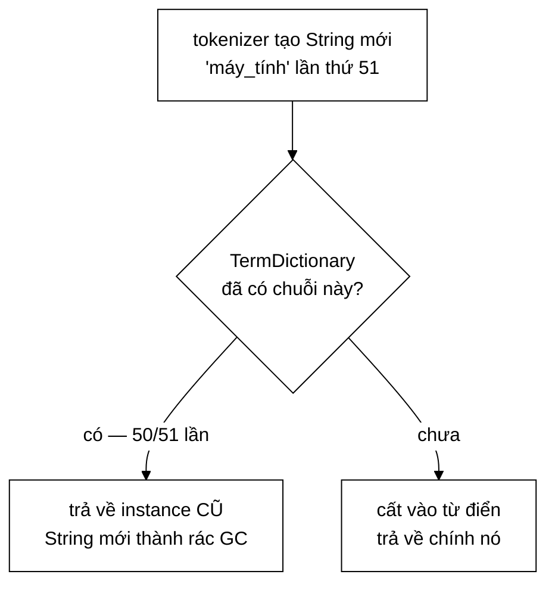

# TermDictionary — kho chuỗi dùng chung (string interning)

**File nguồn:** `search-engine/src/main/java/com/vnsearch/index/TermDictionary.java`
**Việc nó làm:** Giảm ~7 triệu object `String` xuống **136.768** instance, bằng 5 dòng code.

> 📖 Chưa quen ký hiệu toán? Đọc [00 — Từ điển ký hiệu toán](../00-KY-HIEU-TOAN.md) trước.

---

## 📌 Hiểu trong 30 giây

Chỉ mục có **136.768 term phân biệt**. Nhưng tokenizer tạo chuỗi **mới** mỗi lần gặp term đó:

```java
term = String.join("_", Arrays.copyOfRange(syllables, i, i + matchedLen));
//     ↑ LUÔN cấp phát một String mới, kể cả khi nội dung đã gặp 10.000 lần
```

$$5011 \text{ tài liệu} \times \approx 1400 \text{ tiếng} \approx \mathbf{7\ \text{triệu}}\ \text{object } \texttt{String}$$

cho **136.768** giá trị phân biệt. Tỷ lệ trùng lặp $\approx \mathbf{51:1}$.

Giải pháp: giữ **một instance chuẩn tắc** cho mỗi nội dung, và cho tất cả cùng trỏ vào đó.



```
   TRƯỚC — mỗi lần gặp là một object

   heap:  ["máy_tính"] ["máy_tính"] ["máy_tính"] … × 51
            ▲            ▲            ▲
          doc 3        doc 7        doc 11

   SAU — một object, 51 tham chiếu

   heap:  ["máy_tính"]
            ▲   ▲   ▲
            │   │   └── doc 11
            │   └────── doc 7
            └────────── doc 3

   7.000.000 object  ──▶  136.768 object      (÷ 51)
```

**Vì sao không dùng `String.intern()` của JDK.** Nó cất chuỗi vào **string
pool của JVM** — một vùng có vòng đời gắn với cả tiến trình, không giải phóng
được khi chỉ mục bị vứt đi. `TermDictionary` là một `HashMap` bình thường:
xoá chỉ mục là toàn bộ từ điển thành rác thu hồi được. Chi tiết ở mục dưới.

---

## 1. Chi phí bộ nhớ của một `String`

Trên JVM 64-bit với compressed oops:

| Thành phần | Byte |
|---|---|
| Object header của `String` | 16 |
| Tham chiếu tới `byte[] value` | 8 (nén thành 4, nhưng căn 8) |
| Trường `int hash` (cache) | 4 |
| Object header của `byte[]` | 16 |
| Nội dung (Latin-1: 1 byte/ký tự; UTF-16: 2 byte) | $L$ … $2L$ |

$$\text{sizeof}(\texttt{String}) \approx 44 + L\ \text{byte}$$

Với term trung bình $L \approx 10$ ký tự tiếng Việt (UTF-16 → 20 byte nội dung):

$$\text{Không intern}: 7 \times 10^6 \times 54 \approx \mathbf{378\ \text{MB}}\ \text{cấp phát}$$
$$\text{Có intern}: 136\,768 \times 54 \approx \mathbf{7{,}4\ \text{MB}}\ \text{thường trú}$$

Phần lớn 378 MB đó là **rác ngắn hạn** — GC thu hồi được. Nhưng áp lực cấp phát đó chính là thứ làm chậm quá trình dựng chỉ mục và gây các đợt GC dừng ứng dụng.

---

## 2. Toàn bộ thuật toán — 5 dòng

```java
public final class TermDictionary {

    private final Map<String, String> pool;

    public TermDictionary() {
        this(1 << 18);   // 262.144 — đủ cho 136.768 term mà không phải rehash
    }

    /** O(L) — trả về instance CHUẨN TẮC của chuỗi. */
    public String intern(String term) {
        if (term == null) return null;
        String existing = pool.putIfAbsent(term, term);
        return existing != null ? existing : term;
    }
}
```

Nơi dùng:

```java
// InvertedIndex.addDocument
String term = termDictionary.intern(token.term());          // ← Flyweight
positionsByTerm.computeIfAbsent(term, k -> new ArrayList<>()).add(token.position());
```

Chuỗi mới do tokenizer tạo ra **trở thành rác ngay lập tức** nếu nội dung đã có trong pool — GC thu hồi ở thế hệ trẻ, rất rẻ. Cái được giữ lại là instance chuẩn tắc.

---

## 3. Vì sao `Map<String, String>` chứ không phải `Set<String>`

Đây là chỗ gây bối rối khi đọc lần đầu — khoá và giá trị là **cùng một tham chiếu**:

```java
pool.putIfAbsent(term, term);
```

Lý do: `Map` tra cứu bằng `equals()` (**so sánh nội dung**), nhưng ta cần lấy ra **instance** (tham chiếu cụ thể). `HashSet` có `contains()` nhưng **không có** phương thức *"trả về phần tử đã có trong tập"*.

Vậy `Map` được dùng như một *"tập có khả năng lấy lại phần tử"*:

| Bạn đưa vào | Bạn nhận về |
|---|---|
| Một `String` mới có nội dung `"máy_tính"` | Instance `"máy_tính"` **đầu tiên từng thấy** |

Sau đó `term1 == term2` là `true` — **so sánh tham chiếu**, $O(1)$ thay vì `equals()` $O(L)$, và là điều kiện để tiết kiệm bộ nhớ thật sự.

---

## 4. `putIfAbsent` — một lần băm thay vì hai

```java
// ✅ MỘT lần băm
String existing = pool.putIfAbsent(term, term);
return existing != null ? existing : term;

// ❌ HAI lần băm — cùng kết quả, gấp đôi chi phí
if (pool.containsKey(term)) return pool.get(term);
pool.put(term, term);
return term;
```

Băm một `String` là $O(L)$ — phải duyệt hết ký tự (`String.hashCode` có cache, nhưng lần đầu vẫn phải tính). Với **7 triệu lần gọi**, tiết kiệm một lần băm mỗi lần gọi là con số thật:

$$7 \times 10^6 \times 10\ \text{ký tự} = \mathbf{7 \times 10^7}\ \text{phép tính hash tiết kiệm được}$$

> **Nguyên tắc chung:** khi API cung cấp một phương thức làm **tra cứu + cập nhật trong một thao tác** (`putIfAbsent`, `computeIfAbsent`, `merge`, `getOrDefault`), dùng nó. Nó vừa nhanh hơn vừa an toàn hơn về mặt đồng thời so với việc ghép hai lời gọi.

Dự án dùng nhất quán: `computeIfAbsent` trong `InvertedIndex`, `merge` trong `CandidateResolver.buildQueryTermFrequency`, `getOrDefault` trong `PageRankBoostScorer`.

---

## 5. Vì sao `1 << 18` cho dung lượng ban đầu

$$2^{18} = 262\,144 \approx 1{,}9 \times 136\,768$$

`HashMap` rehash khi hệ số lấp đầy vượt `loadFactor = 0,75`:

$$\text{ngưỡng} = 262\,144 \times 0{,}75 = 196\,608 > 136\,768 \quad ✓$$

Mỗi lần rehash phải **băm lại toàn bộ khoá** và cấp phát mảng bucket mới. Nếu bắt đầu từ dung lượng mặc định 16, số lần rehash tới 136.768 phần tử là:

$$\log_2 \frac{136\,768 / 0{,}75}{16} \approx \mathbf{14}\ \text{lần rehash}$$

với tổng chi phí $O(n)$ mỗi lần — cộng dồn thành công việc thừa đáng kể ngay giữa quá trình dựng chỉ mục.

Cấp phát đủ ngay từ đầu tốn $262\,144 \times 8 \approx 2$ MB cho mảng bucket. Đánh đổi rõ ràng có lợi.

---

## 6. Vì sao không dùng `String.intern()` của JDK

Câu hỏi hiển nhiên, và câu trả lời là một quyết định thiết kế đáng bảo vệ:

| Tiêu chí | `String.intern()` của JDK | `TermDictionary` |
|---|---|---|
| Vùng nhớ | Bảng chuỗi **nội bộ JVM** | Heap thường |
| Giải phóng được | ❌ **Không**, cho tới khi lớp bị gỡ | ✅ `clear()` |
| Kích thước | Cấu hình cứng (`-XX:StringTableSize`) | Tự động theo `HashMap` |
| Đo được | ❌ Không có API | ✅ `size()`, `estimatedBytes()` |
| Ảnh hưởng phần còn lại của JVM | Có — dùng chung bảng với **mọi** thư viện | Không — cô lập |

Ba lý do cụ thể trong bối cảnh dự án:

**1. Không giải phóng được.** Mỗi lần **reindex** sinh ra một tập term mới. Với `String.intern()`, term của chỉ mục cũ nằm lại trong bảng chuỗi JVM **vĩnh viễn** → rò rỉ bộ nhớ sau vài lần reindex.

**2. Không đo được.** Dự án lấy đo đạc làm nguyên tắc. `estimatedBytes()` và `size()` cho số liệu đưa thẳng vào báo cáo; bảng chuỗi JVM không có API tương đương.

**3. Ảnh hưởng toàn cục.** Bảng chuỗi JVM dùng chung với mọi thư viện trong tiến trình. Đổ 136.768 chuỗi vào đó gây áp lực lên vùng nhớ bạn **không kiểm soát và không đo được**.

> **Bài học:** *"đã có sẵn trong thư viện chuẩn"* không tự động là lý do đủ. Hãy so sánh **vòng đời**, **khả năng đo đạc**, và **phạm vi ảnh hưởng** — ba tiêu chí thường quyết định, và cả ba đều bất lợi cho `String.intern()` ở đây.

---

## 7. Định luật Zipf — vì sao tỷ lệ trùng lặp cao

Phân bố tần suất từ trong ngôn ngữ tự nhiên tuân theo **định luật Zipf**: term xếp hạng $r$ có tần suất

$$f(r) \approx \frac{C}{r^{s}}, \qquad s \approx 1$$

Hệ quả: một số ít term chiếm phần lớn số lần xuất hiện. Với corpus này:

| | Giá trị |
|---|---|
| Tổng token | 5.226.463 |
| Term phân biệt | 136.768 |
| **Tỷ lệ trùng lặp trung bình** | $5\,226\,463 / 136\,768 \approx \mathbf{38:1}$ |

Term phổ biến nhất (`của`, `và`, `trong` — nếu không bị lọc stopword) xuất hiện hàng trăm nghìn lần; term hiếm xuất hiện đúng một lần.

**Chi phí của term hiếm:** một entry `HashMap` thừa (~32 byte) cho một chuỗi không tiết kiệm được gì. Nhưng vì phân bố Zipf, **lợi ích từ term phổ biến áp đảo hoàn toàn** chi phí của term hiếm.

**Ước lượng cho corpus lớn hơn** dùng **định luật Heaps**:

$$V \approx k \cdot N_{\text{token}}^{\beta}, \qquad \beta \approx 0{,}5$$

Corpus tăng 10 lần → số term phân biệt chỉ tăng $\sqrt{10} \approx 3{,}2$ lần → **tỷ lệ trùng lặp tăng lên $\approx 3{,}2$ lần**. Flyweight càng có lợi khi corpus càng lớn.

---

## 8. Một hạn chế được nói thẳng

Javadoc ghi rõ:

> **Không thread-safe.** `InvertedIndex` chỉ dùng nó trong `addDocument`, mà việc dựng chỉ mục luôn **đơn luồng** (dựng xong một chỉ mục mới hoàn chỉnh rồi gán bằng tham chiếu `volatile`).

Đây là cách xử lý đúng cho một ràng buộc như vậy:

1. **Nêu rõ** giới hạn — không giả vờ nó không tồn tại.
2. **Nêu vì sao** giới hạn đó chấp nhận được ở đây.
3. **Nêu cơ chế** đảm bảo điều kiện đó (`volatile` reference swap).

So sánh với việc dùng `ConcurrentHashMap` "cho chắc": sẽ trả chi phí đồng bộ cho **7 triệu lần gọi** mà không cần thiết. Đó là **tối ưu hoá ngược** — trả giá cho một vấn đề không tồn tại.

> Đối chiếu: [`Trie`](../05-datastructures/Trie.md) **thật sự** bị truy cập đa luồng (gợi ý từ nhiều request HTTP đồng thời) nên nó dùng `ReentrantReadWriteLock`. Cùng dự án, hai lựa chọn khác nhau, mỗi lựa chọn khớp với ca sử dụng thật. **Đó là dấu hiệu của thiết kế có suy nghĩ** — không phải áp một quy tắc chung cho mọi chỗ.

Nếu về sau cần dựng chỉ mục song song, đổi **một dòng**:

```java
this.pool = new ConcurrentHashMap<>(expectedTerms);
```

`putIfAbsent` đã đúng ngữ nghĩa nguyên tử — đây chính là lợi ích của §4.

---

## 9. Độ phức tạp

| Thao tác | Thời gian | Bộ nhớ |
|---|---|---|
| `intern(term)` | $O(L)$ — băm chuỗi | $O(1)$ amortised (chỉ khi term mới) |
| `size()` | $O(1)$ | 0 |
| `estimatedBytes()` | $O(V)$ — duyệt toàn pool | 0 |
| `clear()` | $O(1)$ | giải phóng $O(\sum L_i)$ |

Bộ nhớ tổng: $O\!\left(\sum_{t \in V} L_t\right)$ — tổng ký tự của các term **phân biệt**, không phụ thuộc số lần xuất hiện.

---

## 10. Chủ đề DSA thể hiện

| Chủ đề | Ở đâu |
|---|---|
| **Flyweight pattern** | Toàn bộ lớp |
| **String interning** | §2 |
| **Bảng băm** — hệ số lấp đầy, rehash | §5 |
| **Định luật Zipf / Heaps** | §7 |
| **Thao tác nguyên tử tra-cứu-và-cập-nhật** | §4 |
| **Phân tích chi phí object trên JVM** | §1 |
| **Đánh đổi CPU ↔ bộ nhớ có ý thức** | §8 |

---

## 11. Hạn chế đã biết

1. **Không thread-safe** — xem §8. Sửa bằng một dòng nếu cần.
2. **Pool sống suốt vòng đời chỉ mục.** `clear()` tồn tại nhưng chỉ được gọi khi chỉ mục bị bỏ. Với ứng dụng chạy rất dài và reindex liên tục, cần đảm bảo chỉ mục cũ được GC thu hồi để pool đi theo.
3. **`estimatedBytes()` là ước lượng.** Công thức `44 + 2L` giả định UTF-16; JDK 9+ dùng compact strings nên chuỗi thuần Latin-1 chỉ tốn `44 + L`. Con số thật **thấp hơn** ước lượng — sai số an toàn.
4. **Chưa intern `positions`.** Danh sách vị trí cũng có nhiều mẫu lặp (nhất là các list một phần tử), nhưng lợi ích nhỏ hơn nhiều và rủi ro chia sẻ object thay đổi được thì cao.

---

## 12. Liên kết

- Nơi dùng nó: [InvertedIndex §3](InvertedIndex.md)
- Nguồn sinh ra các chuỗi tạm: [VietnameseTokenizer](VietnameseTokenizer.md)
- Mẫu thiết kế và bài học OOP: [10-FLYWEIGHT.md](../08-design-patterns/10-FLYWEIGHT.md)
- Mục lục: [../README.md](../README.md)
