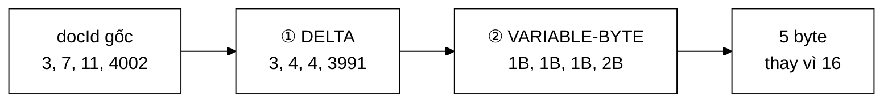

# VByteCodec — nén chỉ mục bằng delta + variable-byte

**File nguồn:** `search-engine/src/main/java/com/vnsearch/index/VByteCodec.java`
**Việc nó làm:** Nén một danh sách số nguyên tăng dần xuống **25 %** kích thước gốc, không mất mát.

> 📖 Chưa quen ký hiệu toán? Đọc [00 — Từ điển ký hiệu toán](../00-KY-HIEU-TOAN.md) trước.

> 📊 **Số đo trong trang này thuộc mốc A** — corpus **5.011 trang**. Repo có
> **bốn mốc corpus** đo trên bốn phiên crawl khác nhau; trộn chúng vào một bảng
> là cách nhanh nhất để ra số vô nghĩa. Bảng quy chiếu đầy đủ ở đầu
> [`DSA-REPORT.md`](../../DSA-REPORT.md). Mốc hiện hành là **D — 31.030 trang**.

---

## 📌 Hiểu trong 30 giây

Posting list lưu `docId` là `int` — **4 byte mỗi số**, kể cả khi số đó là `3`. Với 5,2 triệu cặp (term, doc), đó là **20,8 MB** chỉ để lưu docId.

Nhưng hai tính chất của dữ liệu bị bỏ phí hoàn toàn:

1. Danh sách **đã sắp xếp tăng dần** → hiệu giữa hai phần tử liên tiếp **nhỏ hơn nhiều** giá trị tuyệt đối.
2. Số nhỏ **không cần 4 byte** → 3 chỉ cần 1 byte.

Khai thác cả hai cho ra kỹ thuật nén kinh điển của ngành truy hồi thông tin: **delta encoding + variable-byte**.



```
   ① DELTA — lưu HIỆU thay vì giá trị tuyệt đối

      gốc   :   3      7      11        4002
                └──┬───┘──┬───┘────┬─────┘
      delta :   3      4      4        3991
                ▲
                số nhỏ hơn nhiều ⇒ mở đường cho bước ②

   ② VARIABLE-BYTE — số nhỏ dùng ít byte

      mỗi byte:  [C][d d d d d d d]
                  ▲   └── 7 bit dữ liệu
                  └────── bit TIẾP TỤC: 1 = còn byte nữa

      3     → 1 byte    0000_0011
      4     → 1 byte    0000_0100
      3991  → 2 byte    1001_1111  0001_0111
                        ▲          ▲
                        còn tiếp   byte cuối

   Kết quả: 16 byte (4 × int)  →  5 byte
```

**Vì sao hai bước phải đi cùng nhau.** Variable-byte một mình không giúp gì
nhiều: docId thật có thể lên tới hàng chục nghìn, vẫn cần 3 byte. Delta một
mình cũng không giúp: hiệu nhỏ nhưng vẫn lưu trong `int` 4 byte. Chỉ khi
**delta làm số nhỏ đi** thì **variable-byte mới có gì để tiết kiệm**.

**Đo trên posting list mô phỏng thật (1.639 mục, hiệu trung bình ≈ 3):**

```
Số phần tử       : 1639
Không nén (int)  : 6556 byte
Đã nén (VByte)   : 1639 byte
Tỷ lệ nén        : 25,0 % (tiết kiệm 75,0 %)
Giải nén đúng nguyên vẹn: true
```

---

## 1. Bước 1 — Delta encoding

Thay vì lưu giá trị tuyệt đối, lưu **hiệu** giữa hai phần tử liên tiếp:

$$\delta_i = x_i - x_{i-1}, \qquad \delta_0 = x_0 - 0 = x_0$$

```
gốc   : [3, 17, 19, 40, 1041]
delta : [3, 14,  2, 21, 1001]
```

Khôi phục bằng **tổng tích luỹ** (prefix sum), cũng $O(n)$:

$$x_i = \sum_{j=0}^{i} \delta_j$$

### 1.1 Vì sao delta luôn dương và nhỏ

Vì danh sách **tăng dần nghiêm ngặt** nên $\delta_i > 0$ — không cần mã hoá dấu, tiết kiệm một bit.

Và độ lớn trung bình có công thức chính xác. Với posting list $n$ mục trải trên corpus $N$ tài liệu:

$$\bar{\delta} = \frac{x_{n-1} - x_0}{n - 1} \approx \frac{N}{n}$$

Con số thật của term `công_nghệ`:

$$\bar{\delta} \approx \frac{5011}{1639} \approx \mathbf{3{,}06}$$

> **Nghịch lý dễ chịu:** posting list **càng dài** thì nén **càng tốt**. Term phổ biến (list dài) có docId sát nhau nên delta rất nhỏ; term hiếm (list ngắn) có delta lớn nhưng lại chỉ có vài phần tử nên tổng chi phí vẫn nhỏ. Nén tự động tối ưu ở đúng chỗ tốn nhiều dữ liệu nhất.

---

## 2. Bước 2 — Variable-byte encoding

Mỗi số được ghi bằng **số byte tối thiểu cần thiết**. Trong mỗi byte:

- **7 bit thấp** mang dữ liệu.
- **Bit cao nhất (bit 8)** là cờ *"còn byte nữa không"*.

```
bit cao = 1  →  còn byte tiếp theo
bit cao = 0  →  byte cuối cùng của số này
```

### 2.1 Bảng ngưỡng

Với $k$ byte ta mã hoá được $7k$ bit dữ liệu:

| Số byte | Bit dữ liệu | Khoảng giá trị |
|---|---|---|
| 1 | 7 | $0 \ldots 127$ |
| 2 | 14 | $128 \ldots 16\,383$ |
| 3 | 21 | $16\,384 \ldots 2\,097\,151$ |
| 4 | 28 | $2\,097\,152 \ldots 268\,435\,455$ |
| 5 | 35 | tối đa cho `int` 32-bit |

Công thức số byte cần:

$$\text{bytes}(v) = \max\left(1, \left\lceil \frac{\lfloor\log_2 v\rfloor + 1}{7} \right\rceil\right)$$

### 2.2 Mã hoá — ghi 7 bit mỗi vòng

```java
private static void writeVInt(ByteArrayOutputStream out, int value) {
    while ((value & ~0x7F) != 0) {          // còn bit ngoài 7 bit thấp
        out.write((value & 0x7F) | 0x80);   // ghi 7 bit + bật cờ "còn nữa"
        value >>>= 7;
    }
    out.write(value & 0x7F);                // byte cuối: bit cao = 0
}
```

Đọc từng phép toán bit:

| Phép | Ý nghĩa |
|---|---|
| `value & ~0x7F` | Còn bit nào **ngoài** 7 bit thấp không? `~0x7F` = `1111...10000000` |
| `value & 0x7F` | Lấy đúng 7 bit thấp |
| `\| 0x80` | Bật bit cao = cờ "còn nữa" |
| `value >>>= 7` | Dịch phải **không dấu** 7 bit — dùng `>>>` chứ không phải `>>` vì `>>` giữ bit dấu và sẽ lặp vô hạn với số âm |

### 2.3 Giải mã — và một mẹo tránh cấp phát

```java
private static long readVInt(byte[] data, int position) {
    int value = 0, shift = 0;
    while (true) {
        if (position >= data.length) {
            throw new IllegalArgumentException("Dữ liệu VByte bị cắt cụt tại vị trí " + position);
        }
        int b = data[position++] & 0xFF;     // & 0xFF: byte trong Java CÓ DẤU
        value |= (b & 0x7F) << shift;
        if ((b & 0x80) == 0) break;          // bit cao = 0 → byte cuối
        shift += 7;
        if (shift > 28) {
            throw new IllegalArgumentException("Số VByte vượt quá phạm vi int 32-bit");
        }
    }
    return ((long) position << 32) | (value & 0xFFFFFFFFL);
}
```

**Hai chi tiết đáng học:**

**`data[position++] & 0xFF`** — `byte` trong Java là kiểu **có dấu**, khoảng $[-128, 127]$. Byte `0x80` (cờ "còn nữa") đọc ra thành `-128`. Phép `& 0xFF` nâng lên `int` và giữ đúng giá trị không dấu $0 \ldots 255$. Bỏ sót nó là một lỗi kinh điển khi làm việc với byte trong Java.

**Đóng gói hai giá trị vào một `long`** — hàm cần trả về **cả** giá trị đọc được **và** vị trí đọc tiếp theo. Java không có tuple. Ba lựa chọn:

| Cách | Chi phí |
|---|---|
| Trả về một `record(value, nextPosition)` | **Cấp phát một object** mỗi lần gọi — trong vòng lặp nóng là hàng triệu object rác |
| Dùng trường instance làm "biến ra" | Phá vỡ tính thuần khiết, không thread-safe |
| **Đóng gói vào `long`**: 32 bit thấp = giá trị, 32 bit cao = vị trí | **0 cấp phát** |

```java
return ((long) position << 32) | (value & 0xFFFFFFFFL);
//        ↑ 32 bit cao            ↑ 32 bit thấp
```

Bên gọi tách ra:

```java
long packed  = readVInt(data, position);
int  delta   = (int) (packed & 0xFFFFFFFFL);
position     = (int) (packed >>> 32);
```

> Cùng triết lý "tránh cấp phát trong vòng lặp nóng" với [PostingCursor](../05-datastructures/ArrayPostingCursor.md) — nơi autoboxing `List<Integer>` bị loại bỏ hoàn toàn.

---

## 3. Ví dụ tính tay đầy đủ

Nén danh sách `[3, 17, 19, 40, 1041]`:

**Bước 1 — delta:**

| $i$ | $x_i$ | $x_{i-1}$ | $\delta_i$ |
|---|---|---|---|
| 0 | 3 | 0 | **3** |
| 1 | 17 | 3 | **14** |
| 2 | 19 | 17 | **2** |
| 3 | 40 | 19 | **21** |
| 4 | 1041 | 40 | **1001** |

**Bước 2 — VByte từng delta:**

| $\delta$ | Nhị phân | Số byte | Byte ghi ra |
|---|---|---|---|
| 3 | `0000011` | 1 | `0000_0011` = `0x03` |
| 14 | `0001110` | 1 | `0000_1110` = `0x0E` |
| 2 | `0000010` | 1 | `0000_0010` = `0x02` |
| 21 | `0010101` | 1 | `0001_0101` = `0x15` |
| 1001 | `1111101001` | **2** | `1110_1001`, `0000_0111` |

Chi tiết cho $\delta = 1001$ (vượt 127 nên cần 2 byte):

```
1001 = 0b1111101001                     (10 bit)

Vòng 1:  1001 & 0x7F = 0b1101001 = 105
         ghi 105 | 0x80 = 0b11101001 = 0xE9      ← cờ "còn nữa"
         1001 >>> 7 = 7

Vòng 2:  7 & ~0x7F == 0  →  thoát vòng lặp
         ghi 7 & 0x7F = 0b00000111 = 0x07        ← bit cao = 0, byte cuối
```

Kiểm tra giải mã: $7 \times 2^7 + 105 = 896 + 105 = 1001$ ✓

**Kết quả:**

```
Gốc     : 5 × 4 byte           = 20 byte
Đã nén  : 1+1+1+1+2            =  6 byte
Tiết kiệm                        70 %
```

---

## 4. Vì sao kỹ thuật này dùng được ở đây

Cả **hai** bước đều dựa vào một bất biến duy nhất:

> Với mọi term $t$, posting list của $t$ được sắp xếp **tăng dần nghiêm ngặt** theo `docId`.

Nếu danh sách không sắp xếp, delta có thể **âm** — và VByte chỉ mã hoá số không âm. Lớp này **tự kiểm tra** điều đó thay vì tin người gọi:

```java
if (value < 0) {
    throw new IllegalArgumentException("VByte chỉ mã hoá số không âm, gặp: " + value);
}
if (i > 0 && value < previous) {
    throw new IllegalArgumentException(
            "Danh sách phải tăng dần; vị trí " + i + " có " + value + " < " + previous);
}
```

Đây là **lợi ích thứ ba** của bất biến sắp xếp, bên cạnh:

| # | Lợi ích | Ở đâu |
|---|---|---|
| 1 | Two-pointer merge $O(m+n)$ | [PostingListMerger](../03-query/PostingListMerger.md) |
| 2 | Binary search $O(\log n)$ | [InvertedIndex §5](InvertedIndex.md) |
| 3 | **Delta encoding** | *trang này* |
| 4 | Galloping skip $O(\log d)$ | [ArrayPostingCursor](../05-datastructures/ArrayPostingCursor.md) |

> **Bài học thiết kế:** một bất biến tốt không chỉ giúp một chỗ. Bốn tối ưu trên đều là hệ quả của **cùng một câu** trong hợp đồng của `SearchIndex`.

---

## 5. Độ phức tạp

| Thao tác | Thời gian | Bộ nhớ |
|---|---|---|
| `encodeSorted(int[] n)` | $O(n)$ một lượt | $O(n)$ cho bộ đệm kết quả |
| `decodeSorted(byte[], count)` | $O(n)$ một lượt | $O(n)$ cho mảng kết quả |
| `encodedSize(int v)` | $O(\log_{128} v) \le 5$ | $O(1)$ |

Không có cấp phát trung gian nào ngoài bộ đệm kết quả — `writeVInt` ghi thẳng vào `ByteArrayOutputStream`, `readVInt` đóng gói vào `long`.

**Chi phí CPU đổi lấy bộ nhớ:** mỗi lần đọc posting list nén phải giải mã, tức thêm một lượt $O(n)$. Đánh đổi này có lợi khi chỉ mục lớn hơn cache CPU — lúc đó chi phí đọc bộ nhớ áp đảo chi phí giải mã. Đây là lý do nén hiện chỉ áp dụng ở **tầng lưu trữ** (đọc/ghi file, vài lần mỗi vòng đời ứng dụng) chứ chưa áp dụng ở **tầng bộ nhớ** (đường nóng của mỗi truy vấn) — xem mục 9.

---

## 6. Vì sao `count` phải lưu riêng

```java
public static int[] decodeSorted(byte[] data, int count)
//                                            ↑ phải truyền vào
```

VByte **không tự mô tả độ dài**: nhìn vào mảng byte không biết nó chứa bao nhiêu số, vì mỗi số chiếm số byte khác nhau. Ba cách xử lý:

| Cách | Đánh đổi |
|---|---|
| **Lưu `count` riêng** (cách đang dùng) | Đơn giản; `Posting` đã có `termFrequency` = số vị trí, nên thông tin này **sẵn có** |
| Ghi `count` vào đầu mảng | Tự mô tả, nhưng tốn 1–5 byte mỗi posting list |
| Ghi sentinel kết thúc | Phải chọn một giá trị không bao giờ xuất hiện — không có với `int` không âm |

Cách 1 thắng ở đây vì `count` **đã được lưu sẵn** ở nơi khác cho mục đích khác. Không tốn thêm gì.

---

## 7. So sánh với các sơ đồ nén khác

| Sơ đồ | Tỷ lệ nén | Tốc độ giải mã | Độ phức tạp cài đặt |
|---|---|---|---|
| Không nén (`int`) | 100 % | Nhanh nhất | — |
| **Delta + VByte** | **~25 %** | Nhanh | **~50 dòng** |
| Simple-9 / Simple-16 | ~20 % | Nhanh hơn VByte | Trung bình |
| PForDelta | ~15 % | Rất nhanh (SIMD) | Cao |
| Elias-Gamma / Golomb | ~18 % | Chậm (thao tác bit lẻ) | Trung bình |

VByte là lựa chọn đúng cho dự án này: **tỷ lệ nén tốt, cài đặt đơn giản đủ để đọc hiểu và kiểm chứng bằng tay**, và là kỹ thuật mà Lucene từng dùng làm mặc định trong nhiều năm.

---

## 8. Chủ đề DSA thể hiện

| Chủ đề | Ở đâu |
|---|---|
| **Nén dữ liệu không mất mát** | Toàn bộ lớp |
| **Delta encoding / prefix sum** | §1 |
| **Mã có độ dài thay đổi** (variable-length code) | §2 |
| **Thao tác bit**: `&`, `\|`, `>>>`, mặt nạ | §2.2, §2.3 |
| **Khai thác bất biến của dữ liệu** | §4 |
| **Tránh cấp phát trong vòng lặp nóng** | §2.3 — đóng gói vào `long` |
| **Fail fast** — kiểm tra tiền đề, ném ngoại lệ có thông điệp | §4 |

---

## 9. Hạn chế đã biết

1. **Đã dùng ở tầng lưu trữ, chưa dùng ở tầng bộ nhớ.** `CompressedPostings` gọi codec này mỗi lần `IndexPersistence.save`, và chỉ mục trên đĩa giảm từ **341,5 MB xuống 94,7 MB** (corpus 5.011 trang). Nhưng sau khi nạp, `InvertedIndex` vẫn giữ posting list dạng `List<Posting>` với `Integer` boxed — tức **chưa nén trong RAM**. Nén trong RAM tiết kiệm nhiều hơn hẳn nhưng phải giải mã ở **đường nóng** của mỗi truy vấn; đánh đổi đó chưa được đo.
2. **Chỉ hỗ trợ `int` 32-bit.** Corpus vượt 2,1 tỷ tài liệu sẽ cần `long`.
3. **~~Không nén `termFrequency`~~ — nay không lưu nó nữa.** `CompressedPostings` khai thác bất biến `termFrequency == |positions|` để **bỏ hẳn** trường này, suy lại từ hiệu hai offset tích luỹ liên tiếp. Không nén gì cả mà vẫn tiết kiệm — cách rẻ nhất để nén một trường là chứng minh nó thừa.
4. **Không có block-based skipping.** Chỉ mục thật chia posting list thành khối và lưu skip pointer giữa các khối, để nhảy cóc **mà không phải giải nén** toàn bộ. Hiện `PostingCursor` nhảy cóc trên dữ liệu **chưa nén** (dạng trong RAM).
5. **Overhead base64 +33 %.** Mảng byte được Jackson mã hoá base64 để giữ **một file JSON duy nhất**. Ở dạng nhị phân thuần, chỉ mục còn nhỏ hơn nữa (~71 MB). Đây là đánh đổi có chủ ý: đơn giản hoá định dạng thay vì tối đa hoá tỷ lệ nén.

---

## 10. Liên kết

- Bất biến mà kỹ thuật này dựa vào: [InvertedIndex §4](InvertedIndex.md)
- Lợi ích thứ tư của cùng bất biến: [ArrayPostingCursor](../05-datastructures/ArrayPostingCursor.md)
- Two-pointer merge: [PostingListMerger](../03-query/PostingListMerger.md)
- Mục lục: [../README.md](../README.md)
