# Sơ đồ tư duy — Toàn bộ tầng Inverted Index

**Phạm vi:** 11 file trong `com.vnsearch.index`, cộng `service/IndexBuilder` là cửa vào duy nhất.

**Trang này trả lời câu hỏi gì?** Không phải "công thức là gì" (các trang khác lo việc đó), mà: **các file liên hệ với nhau ra sao**, **dữ liệu có hình dạng thế nào trong bộ nhớ**, và **một câu bất biến duy nhất** đã mở khoá cả bốn kỹ thuật quan trọng nhất như thế nào.

> ### Cách đọc trang này
>
> - Mọi sơ đồ vẽ bằng **Mermaid**. GitHub hiển thị được; VS Code cần extension *Markdown Preview Mermaid Support*.
> - **Nếu không hiện hình:** mỗi sơ đồ đều có khối *"Xem bản chữ (ASCII)"* bấm mở được ngay bên dưới, nội dung y hệt.
> - Đọc §1 → §4 là đủ hiểu tổng thể. §5 trở đi đi sâu từng nhóm.
>
> 📖 **Các trang đi sâu:** [InvertedIndex](InvertedIndex.md) · [VByteCodec](VByteCodec.md) · [CompressedPostings](CompressedPostings.md) · [TermDictionary](TermDictionary.md) · [IndexPersistence](IndexPersistence.md) · [VietnameseTokenizer](VietnameseTokenizer.md)

---

## 1. Bản đồ toàn cảnh — 11 file chia thành 4 nhóm

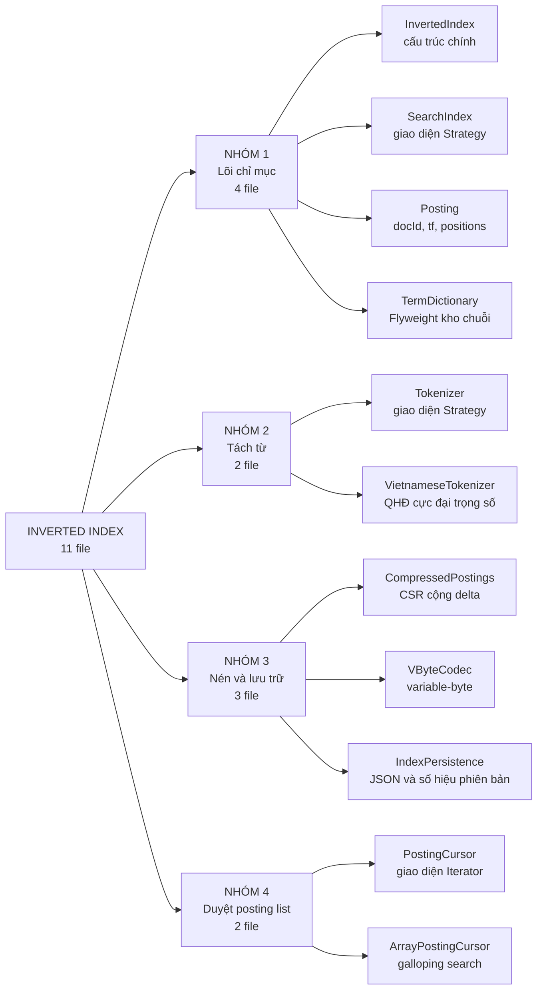

<details>
<summary><b>Xem bản chữ (ASCII)</b></summary>
```
                          INVERTED INDEX — 11 file
                                     │
        ┌────────────────┬───────────┴────────────┬──────────────────┐
        │                │                        │                  │
     NHÓM 1           NHÓM 2                  NHÓM 3             NHÓM 4
   Lõi chỉ mục       Tách từ               Nén và lưu trữ     Duyệt posting
    (4 file)         (2 file)                (3 file)           (2 file)
        │                │                        │                  │
  InvertedIndex     Tokenizer            CompressedPostings    PostingCursor
  SearchIndex       VietnameseTokenizer  VByteCodec            ArrayPostingCursor
  Posting                                IndexPersistence
  TermDictionary
```

</details>

### Bảng tra nhanh — cả 11 file, mỗi file một câu

| # | File | Nhóm | Nó làm gì (một câu) |
|---|---|---|---|
| 1 | `InvertedIndex` | 1 | Cấu trúc chính: `Map<term, List<Posting>>` — trái tim của cả hệ thống tìm kiếm |
| 2 | `SearchIndex` | 1 | Giao diện Strategy, để tầng truy vấn và xếp hạng **không phụ thuộc** một cài đặt cụ thể |
| 3 | `Posting` | 1 | Một mục: `docId` + `termFrequency` + danh sách `positions` |
| 4 | `TermDictionary` | 1 | Flyweight — kho chuỗi dùng chung, 7 triệu `String` xuống còn 136.768 |
| 5 | `Tokenizer` | 2 | Giao diện Strategy cho bộ tách từ |
| 6 | `VietnameseTokenizer` | 2 | Tách từ tiếng Việt bằng quy hoạch động cực đại trọng số, sinh cả bản không dấu |
| 7 | `CompressedPostings` | 3 | Dạng nén của một posting list: bỏ `tf`, tổng tích luỹ kiểu CSR, delta theo đoạn |
| 8 | `VByteCodec` | 3 | Mã hoá variable-byte cho dãy số nguyên tăng dần |
| 9 | `IndexPersistence` | 3 | Lưu/nạp chỉ mục ra file JSON, có **kiểm tra số hiệu phiên bản** |
| 10 | `PostingCursor` | 4 | Giao diện Iterator có `skipTo` — duyệt **không cấp phát** |
| 11 | `ArrayPostingCursor` | 4 | Cài đặt cursor bằng **galloping search** (exponential search) |

---

## 2. Hai đường đi của dữ liệu

Cả tầng chỉ mục chỉ có đúng **hai luồng**: **dựng** chỉ mục (ghi) và **tra** chỉ mục (đọc).

### 2.1 Đường ghi — chạy một lần sau khi crawl xong

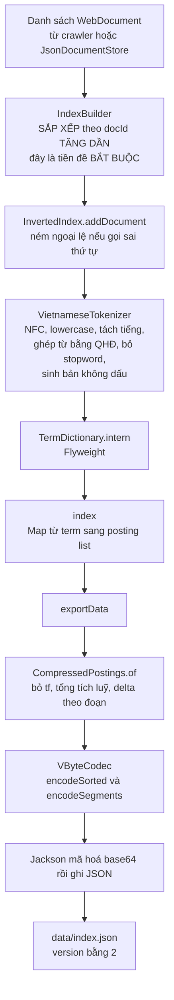

<details>
<summary><b>Xem bản chữ (ASCII)</b></summary>
```
List<WebDocument>
      │
      ▼
IndexBuilder — SORT theo docId tăng dần        ← TIỀN ĐỀ BẮT BUỘC
      │
      ▼
InvertedIndex.addDocument  (ném ngoại lệ nếu sai thứ tự)
      │
      ▼
VietnameseTokenizer  →  TermDictionary.intern  →  index: Map<term, List<Posting>>
                                                        │
                                                        ▼ khi lưu ra đĩa
                                          CompressedPostings.of
                                                        │
                                                        ▼
                                                  VByteCodec
                                                        │
                                                        ▼
                                       Jackson → base64 → data/index.json (v2)
```

</details>

### 2.2 Đường đọc — chạy mỗi lần có truy vấn

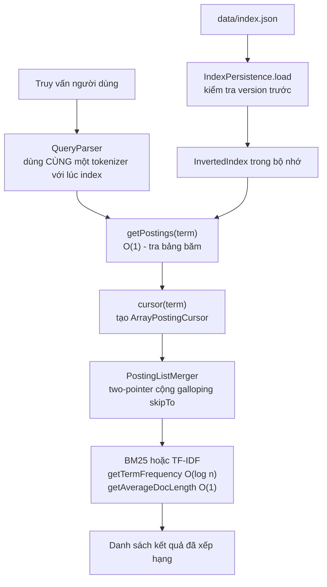

<details>
<summary><b>Xem bản chữ (ASCII)</b></summary>
```
data/index.json ──► IndexPersistence.load (kiểm tra version) ──► InvertedIndex
                                                                       │
truy vấn ──► QueryParser (CÙNG tokenizer) ──► getPostings(term) ◄──────┘
                                                    │
                                                    ▼
                                             cursor(term)
                                                    │
                                                    ▼
                            PostingListMerger (two-pointer + skipTo)
                                                    │
                                                    ▼
                                   BM25 / TF-IDF ──► kết quả xếp hạng
```

</details>

---

## 3. Hình dạng thật của chỉ mục trong bộ nhớ

Đây là hình quan trọng nhất trang này. Nhìn được hình này là hiểu được toàn bộ tầng chỉ mục.
```
InvertedIndex
│
├── index : Map<String, List<Posting>>              ◄── TRÁI TIM của cả hệ thống
│     │
│     ├── "máy_tính"  ──► [ Posting(docId= 3, tf=2, pos=[10, 88])          ,
│     │                     Posting(docId=17, tf=1, pos=[4])               ,
│     │                     Posting(docId=40, tf=5, pos=[0, 9, 12, 60, 77]) ]
│     │                              ▲▲▲▲▲▲▲▲
│     │                              docId LUÔN TĂNG DẦN  ◄── bất biến trung tâm
│     │
│     ├── "may_tinh"  ──► [ ... ]     ◄── bản KHÔNG DẤU, là một khoá RIÊNG
│     │
│     └── "công_nghệ" ──► [ ... ]
│
├── documents   : Map<Integer, WebDocument>   ◄── docId → trang gốc, để hiện kết quả
├── docLength   : Map<Integer, Integer>       ◄── docId → số token, BM25 cần
├── totalTokens : long                        ◄── DẪN XUẤT, giữ sẵn để avgdl là O(1)
├── lastDocId   : int                         ◄── để ÉP bất biến thứ tự
└── termDictionary : TermDictionary           ◄── kho chuỗi Flyweight
```

### Vì sao gọi là chỉ mục "đảo"?
```
CHỈ MỤC XUÔI (forward index) — cách nghĩ tự nhiên nhất:

    doc3   →  [máy_tính, công_nghệ, phần_mềm, ...]
    doc17  →  [máy_tính, giáo_dục, ...]
    doc40  →  [máy_tính, ...]

    ⟹ muốn tìm "máy_tính" phải QUÉT MỌI TÀI LIỆU          → O(N)
       với N = 5.011 tài liệu, mỗi truy vấn quét cả 5.011


CHỈ MỤC ĐẢO (inverted index) — cách làm ở đây:

    "máy_tính"  →  [doc3, doc17, doc40]

    ⟹ tra một lần trong bảng băm                          → O(1)
```

Chữ "đảo" là đảo **chiều của phép ánh xạ**: thay vì `tài liệu → các term`, ta lưu `term → các tài liệu`.

---

## 4. Bất biến trung tâm — một câu, bốn lợi ích

> **Với mọi term `t`, `getPostings(t)` trả về danh sách sắp xếp TĂNG DẦN NGHIÊM NGẶT theo `docId`.**

Đây là câu quan trọng nhất của cả tầng chỉ mục — có lẽ của cả đồ án. Nó được ghi trong Javadoc của **giao diện** `SearchIndex`, nghĩa là **mọi cài đặt** đều buộc phải giữ, không riêng gì `InvertedIndex`.

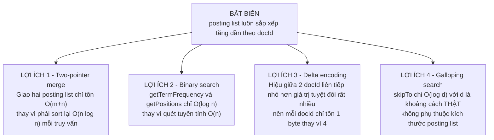

<details>
<summary><b>Xem bản chữ (ASCII)</b></summary>
```
                   BẤT BIẾN: posting list sắp xếp tăng dần theo docId
                                        │
        ┌───────────────┬───────────────┼───────────────┬────────────────┐
        ▼               ▼               ▼               ▼
  Two-pointer      Binary search    Delta encoding   Galloping search
  O(m+n)           O(log n)         1 byte/docId     O(log d)
  thay vì          thay vì          thay vì          không phụ thuộc n
  O(n log n)       O(n)             4 byte
```

</details>

### 4.1 Bất biến này được giữ **miễn phí** — không có phép sort nào

Nhờ đúng **hai điều kiện**:
```
   điều kiện 1:  addDocument() luôn được gọi theo docId TĂNG DẦN
   điều kiện 2:  mỗi lần chỉ APPEND vào cuối posting list
                              ↓
                 danh sách TỰ KHẮC đã sắp xếp
                 không tốn một phép so sánh nào
```

### 4.2 Và nó được **ép** ở hai tầng độc lập

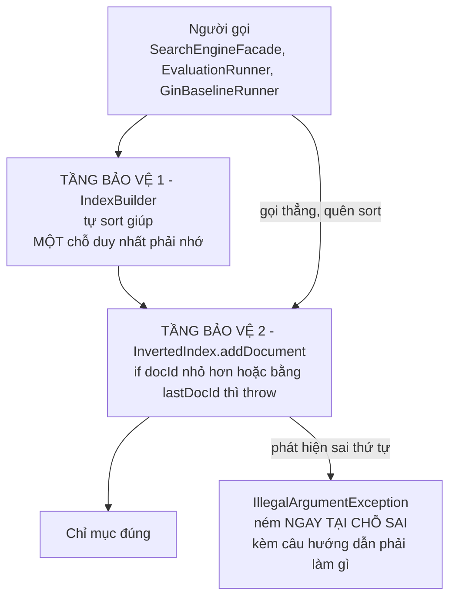

<details>
<summary><b>Xem bản chữ (ASCII)</b></summary>
```
Người gọi ──► IndexBuilder (tự sort)  ──► InvertedIndex.addDocument ──► chỉ mục đúng
    │                                            │
    └──── gọi thẳng, quên sort ──────────────────┘
                                                 │
                                                 ▼
                              IllegalArgumentException NGAY TẠI CHỖ SAI
```

</details>

**Vì sao phải ép mà không chỉ ghi vào tài liệu là đủ?**

Vì hậu quả của việc quên là một **lỗi im lặng**:
```
   quên sort trước khi index
            ↓
   posting list KHÔNG sắp xếp
            ↓
   binary search trên danh sách chưa sắp xếp cho kết quả TUỲ Ý
   (nó KHÔNG ném ngoại lệ nào cả!)
            ↓
   điểm BM25 lệch  →  kết quả tìm kiếm sai  →  KHÔNG CÓ GÌ BÁO ĐỘNG
```

Biến một **lỗi im lặng** thành một **lỗi ồn ào** là nguyên tắc lặp lại nhiều lần trong đồ án này — xem thêm `CompressedPostings.of` ở §7 và `IndexPersistence.load` ở §8.

Trước đây tiền đề "phải sort trước" bị **lặp lại ở ba nơi**, mỗi nơi tự nhớ. Quên một chỗ là hệ thống trả kết quả sai một cách im lặng. Nay gom hết về `IndexBuilder`.

---

## 5. Đi sâu nhóm 2 — Tokenizer tiếng Việt

### 5.1 Sáu bước xử lý

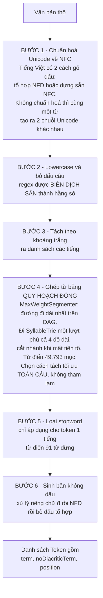

<details>
<summary><b>Xem bản chữ (ASCII)</b></summary>
```
Văn bản thô
   │
   1. chuẩn hoá Unicode về NFC          (tránh 2 cách gõ dấu cho cùng một từ)
   2. lowercase + bỏ dấu câu            (regex biên dịch sẵn)
   3. tách theo khoảng trắng            → danh sách "tiếng"
   4. ghép từ bằng QUY HOẠCH ĐỘNG        (SyllableTrie, từ điển 49.793 mục)
      cực đại trọng số trên DAG          → tối ưu TOÀN CÂU, không tham lam
   5. loại stopword (chỉ token 1 tiếng) (từ điển 91 từ dừng)
   6. sinh bản không dấu                (xử lý riêng "đ", rồi NFD, rồi bỏ \p{M})
   │
   ▼
List<Token{term, noDiacriticTerm, position}>
```

</details>

### 5.2 Chạy tay một câu — hiểu là hiểu ở đây
```
ĐẦU VÀO:  "Máy tính của công ty rất tốt."

Bước 1-3  →  [máy, tính, của, công, ty, rất, tốt]

Bước 4-5, quét từ trái sang phải:

  i=0   thử "máy tính của công"?  ✗ không có trong từ điển
        thử "máy tính của"?       ✗
        thử "máy tính"?           ✓ CÓ  →  token "máy_tính"    position 0
        nhảy tới i=2

  i=2   thử "của công ty rất"?    ✗
        thử "của công ty"?        ✗
        thử "của công"?           ✗
        → lùi về 1 tiếng: "của"   →  LÀ STOPWORD  →  BỎ, position KHÔNG tăng
        nhảy tới i=3

  i=3   thử "công ty rất tốt"?    ✗
        thử "công ty rất"?        ✗
        thử "công ty"?            ✓ CÓ  →  token "công_ty"     position 1
        nhảy tới i=5

  i=5   thử "rất tốt"?            ✗
        → lùi về 1 tiếng: "rất"   →  LÀ STOPWORD  →  BỎ
        nhảy tới i=6

  i=6   "tốt" → không phải stopword →  token "tốt"             position 2

Bước 6, thêm bản không dấu:

  Token{ term="máy_tính", noDiacritic="may_tinh", position=0 }
  Token{ term="công_ty",  noDiacritic="cong_ty",  position=1 }
  Token{ term="tốt",      noDiacritic="tot",      position=2 }
```

> **Chú ý `position`:** nó **không** tăng khi gặp stopword. Nhờ vậy `position` là "chỉ số token thứ mấy trong tài liệu **sau khi đã lọc**" — đúng thứ mà phrase search cần: hai term nằm cạnh nhau khi `position` của term sau bằng `position` của term trước cộng 1.

### 5.3 Chỉ mục kép: có dấu và không dấu
```
              một token "máy_tính" tại position 0
                            │
              ┌─────────────┴─────────────┐
              ▼                           ▼
      index["máy_tính"]            index["may_tinh"]
              │                           │
              └───────► cùng trỏ về docId hiện tại, cùng danh sách vị trí

              HAI KHOÁ RIÊNG BIỆT trong cùng một Map

⟹ người dùng gõ "may tinh" (không dấu) vẫn tìm ra tài liệu chứa "máy tính"
```

**Chi phí:** số khoá trong chỉ mục **gần gấp đôi**. **Đổi lại:** một tính năng người dùng Việt Nam thực sự cần, và không phải viết riêng một tầng "đoán dấu" phức tạp.

*Chi tiết nhỏ:* nếu một token vốn đã không dấu (chữ số, từ tiếng Anh, từ Việt không dấu) thì `noDiacriticTerm` bằng chính `term`, và code **không** tạo khoá thứ hai — kiểm tra bằng `if (!token.noDiacriticTerm().equals(token.term()))`.

### 5.4 Bất biến song hành — vi phạm là lỗi im lặng

> **Lúc lập chỉ mục và lúc truy vấn PHẢI dùng CÙNG một cài đặt tokenizer** — cùng thuật toán **và** cùng từ điển.
```
   Lúc index sinh ra  :  "máy_tính"
   Lúc query sinh ra  :  "máy"  +  "tính"        ← vì dùng từ điển khác
                                 ↓
                       KHÔNG BAO GIỜ khớp
                                 ↓
   Không ngoại lệ, không log, chỉ là KẾT QUẢ RỖNG một cách khó hiểu
```

Vì vậy cả `InvertedIndex` lẫn `QueryParser` đều **nhận** tokenizer qua constructor thay vì tự tạo lấy một cái.

Giao diện `Tokenizer` (Strategy) tồn tại chính vì lý do này, và cho thêm một lợi ích: **đo được** câu hỏi *"tokenizer nào tốt hơn"* bằng thí nghiệm ablation. Trước đây `RelevanceScorer` cho phép đo *"mô hình tính điểm nào tốt hơn"*, nhưng tokenizer thì không đo được — dù nó thực tế là **trần chất lượng** của cả hệ thống (từ điển từ ghép nay có 40.390 mục trên tổng 49.793). Giao diện này xoá bỏ sự bất đối xứng đó.

---

## 6. Đi sâu `TermDictionary` — Flyweight với con số cụ thể

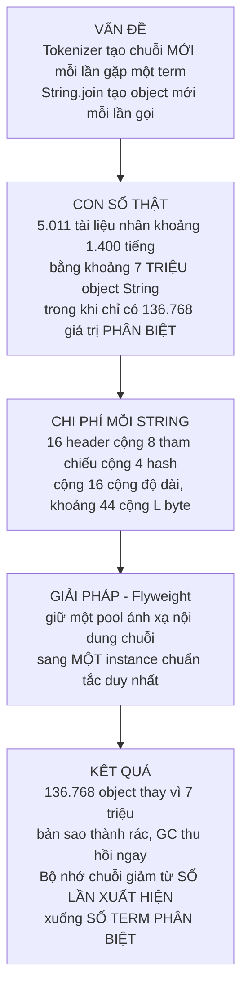

<details>
<summary><b>Xem bản chữ (ASCII)</b></summary>
```
TRƯỚC — mỗi lần gặp là một String mới:
    doc0: "công_nghệ" → String@1a2b
    doc1: "công_nghệ" → String@3c4d          ~7 TRIỆU object
    doc2: "công_nghệ" → String@5e6f          cho 136.768 giá trị PHÂN BIỆT
    ...

SAU — intern() ánh xạ về một instance chuẩn tắc:
    doc0 ─┐
    doc1 ─┼──► String@1a2b                   136.768 object
    doc2 ─┘                                  bản sao thành rác, GC thu ngay
```

</details>

**Vì sao không dùng `String.intern()` có sẵn của JDK?** Vì nó dùng bảng chuỗi nội bộ của JVM — một vùng nhớ có kích thước cấu hình cứng, **không giải phóng được** cho tới khi lớp bị gỡ, và **không đo được**. Pool tự quản lý thì kiểm soát được vòng đời (`clear()`) và đo được kích thước (`size()`).

**Một chi tiết cực dễ mất:** khi nạp chỉ mục từ file, Jackson tạo một `String` **mới** cho **mỗi** khoá. Nếu không gọi `intern()` lại trong `importData`, **toàn bộ lợi ích Flyweight biến mất sau mỗi lần khởi động lại ứng dụng**. Dòng đó nằm ở `InvertedIndex.importData`, kèm chú thích giải thích.

---

## 7. Đi sâu nhóm 3 — Nén chỉ mục bằng ba tầng ý tưởng

### 7.1 Bài toán: VByte chỉ nén được dãy **tăng dần**

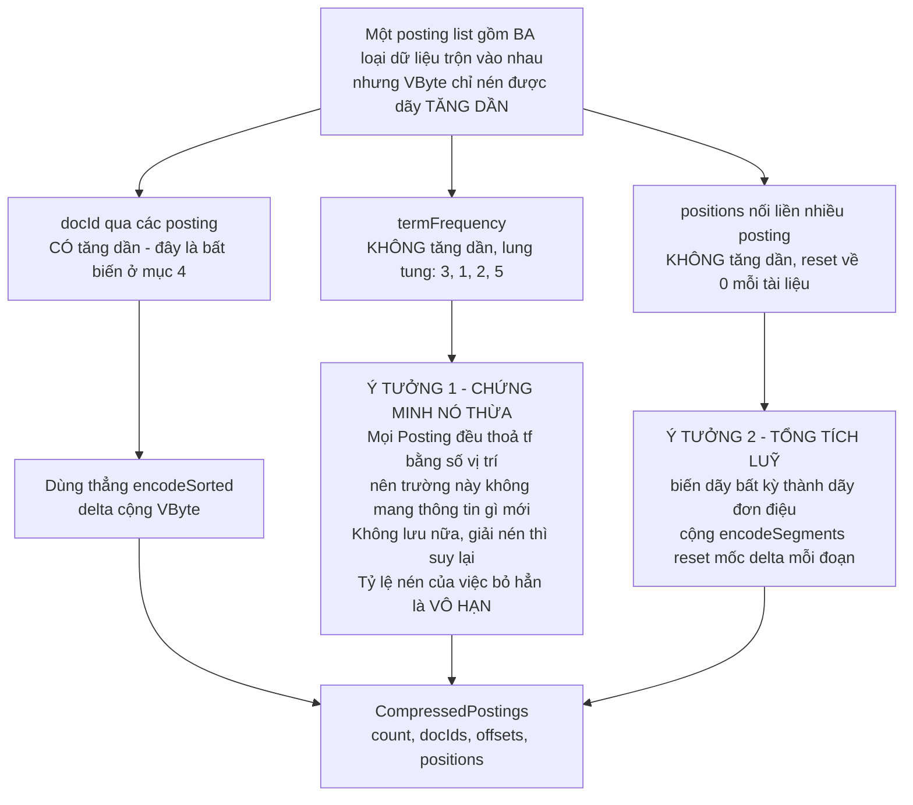

<details>
<summary><b>Xem bản chữ (ASCII)</b></summary>
```
Posting list = 3 loại dữ liệu, chỉ 1 loại tăng dần:

  docId        ✓ LUÔN tăng dần   → encodeSorted (delta + VByte)
  termFrequency ✗ lung tung       → Ý TƯỞNG 1: chứng minh nó THỪA, bỏ hẳn
  positions     ✗ reset mỗi doc   → Ý TƯỞNG 2: tổng tích luỹ + encodeSegments
                                              ↓
                        CompressedPostings{count, docIds, offsets, positions}
```

</details>

### 7.2 Ý tưởng 1 — cách nén rẻ nhất là chứng minh trường đó thừa

Mọi `Posting` do `InvertedIndex.addDocument` tạo ra đều thoả:

$$\texttt{termFrequency} = |\texttt{positions}|$$

vì hàm đó **gom vị trí trước rồi mới dựng Posting**. Nên trường `tf` **không mang thông tin nào mới** — bỏ hẳn, lúc giải nén thì đếm lại số vị trí.

> Cách rẻ nhất để nén một trường không phải là tìm thuật toán tốt hơn, mà là **chứng minh trường đó thừa**. Tỷ lệ nén của việc bỏ hẳn là vô hạn.

Nhưng "thừa" là một **bất biến**, và bất biến thì phải **ép**. Nếu về sau ai đó dựng một `Posting` với `tf` khác số vị trí, dữ liệu sẽ bị **giải nén sai một cách im lặng**, và lỗi chỉ lộ ra ở điểm BM25 lệch — hàng tháng sau. Vì vậy `CompressedPostings.of` kiểm tra và **ném ngoại lệ ngay tại chỗ sai**, kèm giải thích đầy đủ.

### 7.3 Ý tưởng 2 — tổng tích luỹ, chính là kỹ thuật `rowPtr` của CSR
```
   tf mỗi posting   :  [ 3,   1,   2,   5 ]           ◄── KHÔNG tăng dần, VByte chịu
                          │    │    │    │
                          ▼    ▼    ▼    ▼   (cộng dồn)
   offset tích luỹ  :  [ 0,   3,   4,   6,  11 ]      ◄── LUÔN tăng dần, VByte nén được
                         └─┬──┘└─┬─┘└─┬─┘└──┬──┘
   nghịch đảo       :   tf[i] = offset[i+1] − offset[i]

   ⟹ chỉ cần MỘT codec (encodeSorted) dùng được cho CẢ BA mảng
```

Mảng `offsets` có `count + 1` phần tử chứ không phải `count`: **phần tử canh biên (sentinel)** làm công thức hiệu số đúng cho **mọi** `i`, kể cả phần tử cuối, nên khỏi cần một nhánh `if` riêng — **cùng lý do** với sentinel node của [`LRUCache`](../06-datastructures/LRUCache.md).

> 🔗 **Đây chính là** kỹ thuật `rowPtr` mà [`SparseMatrix.freeze()`](../06-datastructures/SparseMatrix.md) dùng để nén ma trận liên kết cho PageRank. Cùng một ý tưởng xuất hiện **hai lần ở hai chỗ hoàn toàn không liên quan** trong đồ án — đó là dấu hiệu nó là một **kỹ thuật nền tảng**, không phải thủ thuật riêng lẻ.

### 7.4 `VByteCodec` — cơ chế từng bit
```
BƯỚC 1 — DELTA (mã hoá hiệu):

   gốc    :  [   3,  17,  19,  40, 1041 ]
   delta  :  [   3,  14,   2,  21, 1001 ]     ◄── nhỏ hơn hẳn giá trị gốc

   Danh sách càng DÀY thì delta càng nhỏ:
   posting list dài ⟹ các docId liên tiếp càng sát nhau.


BƯỚC 2 — VARIABLE-BYTE (mỗi số dùng số byte tối thiểu):

   7 bit thấp của mỗi byte   =  DỮ LIỆU
   bit cao nhất (bit thứ 8)  =  CỜ "còn byte nữa không"

        bit cao = 1  →  còn byte tiếp theo
        bit cao = 0  →  đây là byte CUỐI của số này


VÍ DỤ — mã hoá số 300:

   300 = 0b1_0010_1100

   chia thành nhóm 7 bit, NHÓM THẤP ĐI TRƯỚC:
        nhóm thấp = 0101100        nhóm cao = 0000010

   byte 1:   1 0101100   = 0xAC    (cờ = 1 → còn nữa; mang 7 bit THẤP)
   byte 2:   0 0000010   = 0x02    (cờ = 0 → hết)

   ⟹ số 300 tốn 2 byte thay vì 4 byte của kiểu int


BẢNG PHẠM VI:

        0     ..       127   →  1 byte
        128   ..    16 383   →  2 byte
        16384 .. 2 097 151   →  3 byte
        ...                     tối đa 5 byte cho int 32-bit
```

**Hiệu quả trên dữ liệu thật:** posting list của term `công_nghệ` có **1.639 mục** trải đều trên **5.011 tài liệu**, nên hiệu trung bình là $5011/1639 \approx 3$. Với delta ≈ 3, mỗi `docId` chỉ tốn **1 byte** thay vì 4 byte → **tiết kiệm 75 %**. Danh sách vị trí còn dày hơn nữa nên tỷ lệ nén còn tốt hơn.

### 7.5 Vì sao `positions` phải nén **theo đoạn**
```
   positions của 3 posting:   doc3: [10, 88]     doc17: [4]     doc40: [0, 9, 12]

   ❌ NỐI TẤT CẢ RỒI DELTA MỘT LẦN:

      nối    :  [ 10,  88,   4,   0,  9,  12 ]
      delta  :  [ 10,  78, −84,  −4,  9,   3 ]
                            ▲▲▲▲ ▲▲              ◄── ÂM!
                            tại mỗi RANH GIỚI posting
      → VByte chỉ mã hoá được số KHÔNG ÂM ⟹ hỏng


   ✓ encodeSegments — RESET mốc delta ở ĐẦU MỖI ĐOẠN:

      đoạn 1: [10, 78]     đoạn 2: [4]     đoạn 3: [0, 9, 3]
                                                        ← tất cả đều ≥ 0
```

Chiều giải nén đọc **tuần tự**, nên **không cần** lưu vị trí byte bắt đầu của từng đoạn — chỉ cần biết **số phần tử** mỗi đoạn, mà số đó đã suy được từ mảng `offsets` ở §7.3. Hai ý tưởng khớp vào nhau.

### 7.6 Vì sao không dùng GZIP cho xong?

| Tiêu chí | GZIP | delta + VByte theo từng term |
|---|---|---|
| Tỷ lệ nén | **tốt hơn** | tốt |
| Số dòng code | ~3 | ~240 |
| **Đọc MỘT term** | phải giải nén **TOÀN BỘ** file | chỉ giải nén đúng term đó |
| Nạp posting list theo yêu cầu | **không thể** | mở đường được |

> Nén **CỘNG** truy cập ngẫu nhiên là thứ mà nén tổng quát không cho. Đó mới là lý do thật, không phải tỷ lệ nén.

Giữ mỗi term là một **đơn vị độc lập** mở đường cho việc nạp posting list theo yêu cầu, thay vì nạp cả chỉ mục vào RAM lúc khởi động.

---

## 8. `IndexPersistence` — lưu, nạp, và một bài học về cách đo

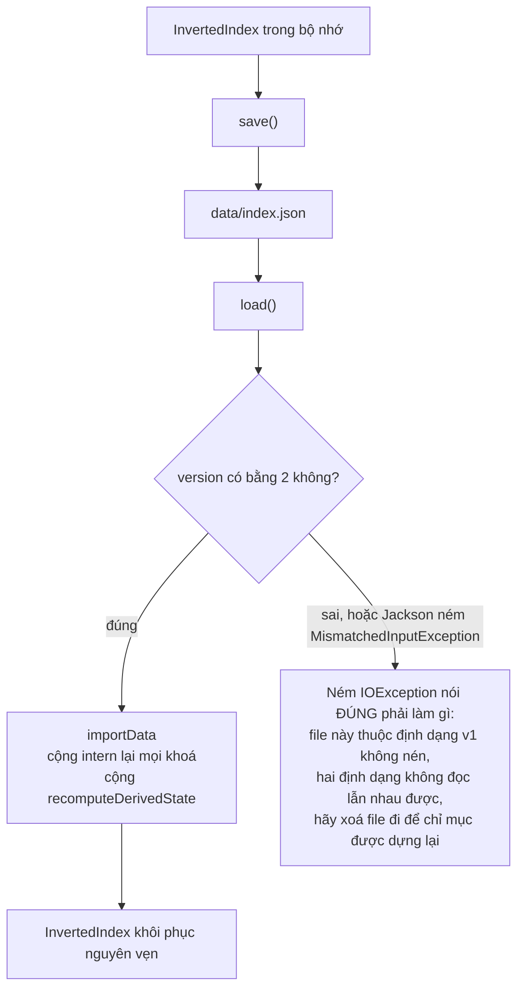

<details>
<summary><b>Xem bản chữ (ASCII)</b></summary>
```
InvertedIndex ──save()──► data/index.json ──load()──► version == 2 ?
                                                          │
                                     ┌────────────────────┴──────────────────┐
                                     │ đúng                                  │ sai
                                     ▼                                       ▼
                        importData + intern lại khoá          IOException nói rõ:
                        + recomputeDerivedState               "file định dạng v1,
                                     │                         hãy xoá đi"
                                     ▼
                        InvertedIndex khôi phục nguyên vẹn
```

</details>

### 8.1 Vì sao cần trường `version`

Khi định dạng đổi từ v1 sang v2, những file chỉ mục cũ còn nằm trên đĩa vẫn được nạp thử, và Jackson ném ra:
```
MismatchedInputException: Cannot deserialize value of type
CompressedPostings from Array value
```

Thông báo này nói về **kiểu dữ liệu Java**, hoàn toàn **không** gợi ý rằng vấn đề thật là *"file này thuộc định dạng đời trước"* — và người đọc không có cách nào đoán ra rằng việc cần làm chỉ đơn giản là **xoá file đi**.

Một số hiệu phiên bản biến lỗi khó hiểu đó thành **một câu nói đúng việc phải làm**. File v1 không có trường này nên Jackson để `version = 0` — chính đó là dấu hiệu nhận ra định dạng cũ.

### 8.2 Trạng thái dẫn xuất phải tính lại ở **mọi** đường vào

Nạp từ file **không** đi qua `addDocument`, nên mọi trạng thái dẫn xuất phải được tính lại thủ công:
```
   quên tính lại totalTokens
            ↓
      avgdl = 0
            ↓
   BM25 trả về 0 cho MỌI tài liệu     ◄── lỗi im lặng, không ngoại lệ nào
```

Vì vậy `recomputeDerivedState()` gom **mọi** trạng thái dẫn xuất về **một chỗ**, để sau này thêm một trạng thái mới chỉ phải sửa đúng một nơi.

### 8.3 Bài học đo đạc: không bao giờ đổi hai biến cùng lúc

File chỉ mục cũ vừa **không nén**, vừa **thụt dòng** (`INDENT_OUTPUT`). Nếu gộp cả hai thay đổi rồi báo một con số, ta sẽ **quy nhầm công của việc bỏ thụt dòng cho phần nén**.

Nên `IndexPersistence.main` đo **ba mốc**, tách bạch đóng góp của từng thay đổi:
```
   A.  thụt dòng  +  không nén      ← định dạng CŨ
   B.  gói chặt   +  không nén      ← đo riêng đóng góp của việc BỎ THỤT DÒNG
   C.  gói chặt   +  nén VByte      ← đo riêng đóng góp của việc NÉN, định dạng MỚI
```

Đây là cùng một bài học phương pháp với lỗi JIT warmup ghi ở `DSA-REPORT.md` §3.2.

**Base64 có làm mất hết lợi ích nén không?** Không. Base64 có overhead cố định 4/3 (tăng 33 %), trong khi một số nguyên viết dưới dạng JSON tốn trung bình 4–6 ký tự kể cả dấu phẩy. Kết quả ròng vẫn là một khoản giảm lớn.

Chạy lại phép đo bất cứ lúc nào:

```bash
MAVEN_OPTS=-Xmx4g ./mvnw -q compile exec:java \
  -Dexec.mainClass=com.vnsearch.index.IndexPersistence \
  -Dexec.args="data/crawled-documents.json"
```

---

## 9. Đi sâu nhóm 4 — `PostingCursor` và galloping search

### 9.1 Hai lợi ích, cái thứ hai quan trọng hơn

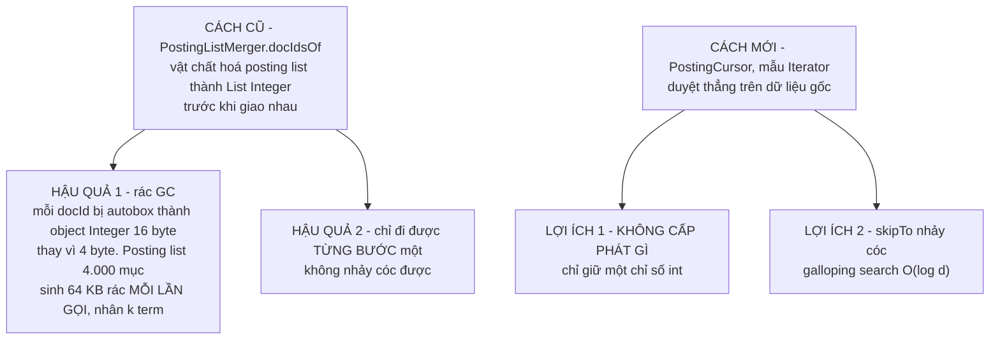

<details>
<summary><b>Xem bản chữ (ASCII)</b></summary>
```
CÁCH CŨ: vật chất hoá thành List<Integer>
    → autobox: 16 byte/docId thay vì 4 → 64 KB rác GC mỗi lần gọi, × k term
    → chỉ đi được từng bước một

CÁCH MỚI: PostingCursor duyệt thẳng trên dữ liệu gốc
    → KHÔNG cấp phát gì, chỉ giữ một chỉ số int
    → skipTo() nhảy cóc bằng galloping search, O(log d)
```

</details>

### 9.2 Vì sao nhảy cóc lại quan trọng đến thế
```
   Bài toán: giao một list RẤT NGẮN (5 mục) với một list RẤT DÀI (4.000 mục)

     two-pointer thuần  :  O(m + n)          =  5 + 4000    =  4005 bước
     galloping skipTo   :  O(m · log(n/m))   =  5 · log(800) ≈    48 bước
                                                             ──────────────
                                                             nhanh hơn ~83 lần
```

Tình huống này **rất phổ biến**: truy vấn `"máy tính" AND "Nguyễn Văn A"` có một term cực hiếm và một term cực phổ biến.

### 9.3 Galloping search — hai pha
```
   MỤC TIÊU: nhảy tới posting đầu tiên có docId >= target


   PHA 1 — NHẢY THEO CẤP SỐ NHÂN (1, 2, 4, 8, ...) cho tới khi VƯỢT QUA target

     index                                                        n-1
       │                                                           │
       ▼                                                           ▼
      [·][·][·][·][·][·][·][·][·][·][·][·][·][·][·][·][·][·][·][·][·]
       └1┘
       └──2──┘
       └─────4─────┘
       └───────────8───────────┘   ◄── đã vượt qua target, DỪNG

     ⟹ sau ceil(log2 d) lần nhảy, target bị khoanh vào đoạn (index+4, index+8]


   PHA 2 — BINARY SEARCH trong đúng đoạn vừa khoanh được

                      └─────┬─────┘
                         O(log d)


   TỔNG:  O(log d)  với d = KHOẢNG CÁCH THẬT SỰ phải nhảy
          ⟹ chi phí KHÔNG phụ thuộc kích thước posting list (n)
```

**Điểm mạnh so với binary search thuần trên cả mảng:**

- Khi hai posting list có **nhiều phần tử chung**, `d` nhỏ → galloping gần như **miễn phí**.
- Khi chúng **lệch nhau nhiều**, nó **nhảy xa được ngay** thay vì bò từng bước.

Kỹ thuật này dựa **hoàn toàn** vào bất biến ở §4. Không có bất biến đó thì không có galloping.

---

## 10. Vì sao có giao diện `SearchIndex`

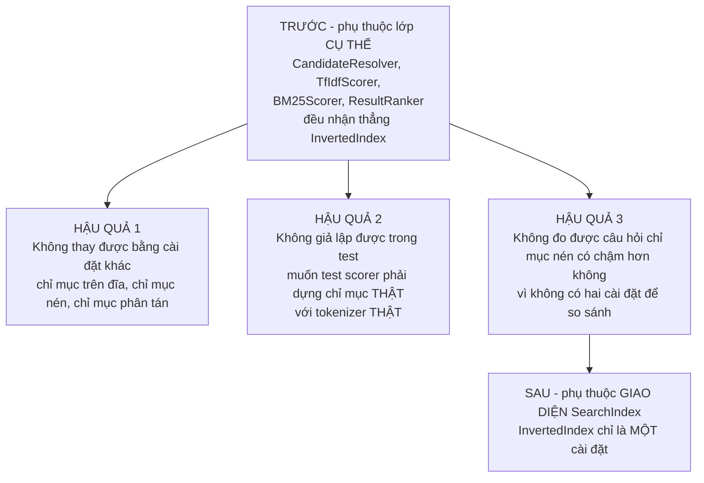

<details>
<summary><b>Xem bản chữ (ASCII)</b></summary>
```
TRƯỚC:  CandidateResolver ─┐
        TfIdfScorer       ─┼──► InvertedIndex   (lớp CỤ THỂ)
        BM25Scorer        ─┤
        ResultRanker      ─┘
        ✗ không thay được   ✗ không giả lập được   ✗ không đo so sánh được

SAU:    CandidateResolver ─┐
        TfIdfScorer       ─┼──► SearchIndex  (GIAO DIỆN)
        BM25Scorer        ─┤          ▲
        ResultRanker      ─┘          ├── InvertedIndex
                                      └── (chỉ mục trên đĩa / giả lập / ...)
```

</details>

Giao diện này cũng chính là nơi **bất biến ở §4 được ghi thành hợp đồng**: mọi cài đặt tương lai đều buộc phải giữ, chứ không phải là chi tiết nội bộ của riêng `InvertedIndex`.

---

## 11. Bốn cái bẫy đã được xử lý

| Bẫy | Nằm ở đâu | Cách xử lý và vì sao |
|---|---|---|
| **Tràn số nguyên trong binary search** | `InvertedIndex.binarySearchPosting`, `ArrayPostingCursor.skipTo` | Dùng `(low + high) >>> 1` chứ **không** phải `/ 2`. Với danh sách rất lớn, `low + high` có thể **tràn thành số âm**, và `/2` **giữ nguyên dấu âm** → chỉ số âm. Dịch bit không dấu xử lý đúng cả khi tràn. Đây là **lỗi kinh điển từng tồn tại 9 năm** trong chính `java.util.Arrays.binarySearch` của JDK |
| **Gom vị trí trước, tạo `Posting` sau** | `InvertedIndex.addDocument` | Nếu tạo `Posting` ngay khi gặp token, một term xuất hiện 5 lần sẽ sinh **5 Posting cho CÙNG một docId** → phá vỡ giả định *"mỗi cặp (term, doc) có đúng một posting"* mà binary search dựa vào |
| **Regex biên dịch lại mỗi lần gọi** | `VietnameseTokenizer` | `String.replaceAll` và `String.split` gọi `Pattern.compile` **mỗi lần**. `stripDiacritics` chạy cho **mọi token của mọi tài liệu** (hàng triệu lần trên corpus 5.011 trang), rồi lại chạy khi bôi sáng snippet. Nay: `Pattern` là `static final` biên dịch sẵn, và `stripDiacritics` quét ký tự một lượt — trường hợp phổ biến nhất (chuỗi vốn không dấu) **không cấp phát gì** |
| **Trả về thẳng map nội bộ** | `InvertedIndex.getAllDocuments` | Trước đây trả về thẳng map, nên người gọi có thể `index.getAllDocuments().clear()` và **phá huỷ trạng thái chỉ mục**. Nay bọc `unmodifiableMap` — mọi thao tác ghi ném `UnsupportedOperationException` **ngay tại chỗ sai** |

Ngoài ra còn ba lớp bảo vệ khác đã nhắc ở trên: `addDocument` ép thứ tự docId (§4.2), `CompressedPostings.of` ép bất biến `tf` (§7.2), và `IndexPersistence.load` kiểm tra số hiệu phiên bản (§8.1). **Cả sáu đều theo cùng một triết lý: biến lỗi im lặng thành lỗi ồn ào.**

---

## 12. Bảng độ phức tạp

| Thao tác | Độ phức tạp | Ghi chú |
|---|---|---|
| `addDocument` | **O(L)** | L = số token của tài liệu |
| `tokenize` | **O(n × 4)** = O(n) | n = số tiếng; 4 là `MAX_COMPOUND_LENGTH`, một hằng số nhỏ |
| `getPostings` | **O(1)** | tra bảng băm |
| `getDocumentFrequency` | **O(1)** | chính là `getPostings(t).size()` |
| `getTermFrequency` | **O(log n)** | binary search. **Hàm nóng nhất cả hệ thống**: TF-IDF gọi nó cho MỖI ứng viên nhân MỖI term của truy vấn |
| `getPositions` | **O(log n)** | dùng cho phrase search |
| `getAverageDocLength` | **O(1)** | nhờ `totalTokens` cộng dồn sẵn. Nếu tính lại O(N) mỗi lần thì việc xếp hạng thành O(N × c) |
| `intern` | **O(L)** | băm chuỗi |
| `cursor().next()` | **O(1)** | không cấp phát |
| `cursor().skipTo()` | **O(log d)** | d = khoảng cách thật, **không** phụ thuộc n |
| `CompressedPostings.of` / `toPostings` | **O(n + tổng tf)** | một lượt, không sắp xếp, không cấu trúc trung gian |
| Bộ nhớ chỉ mục | **O(số cặp (term, doc))** | riêng chuỗi term: O(tổng ký tự các term **phân biệt**) nhờ Flyweight |

---

## 13. Xoá một file thì hỏng chính xác cái gì?

| File | Nếu không có | Hậu quả cụ thể |
|---|---|---|
| `InvertedIndex` | quét tuyến tính corpus | Mỗi truy vấn O(N) trên 5.011 tài liệu, thay vì O(1) tra bảng băm |
| `SearchIndex` | phụ thuộc lớp cụ thể | Không giả lập được trong test, không so sánh được hai cài đặt |
| `TermDictionary` | mỗi lần gặp là một `String` mới | ~7 triệu object `String` thay vì 136.768 |
| `VietnameseTokenizer` | tách theo khoảng trắng | "máy tính" thành hai token vô nghĩa; mất luôn tính năng tìm không dấu |
| `Tokenizer` (giao diện) | dùng lớp cụ thể | Không đo được ablation *"tokenizer nào tốt hơn"* — mà bộ tách từ chính là **trần chất lượng** của cả hệ thống |
| `VByteCodec` + `CompressedPostings` | ghi thẳng ra JSON | File chỉ mục lớn hơn nhiều lần; xem ba mốc đo ở §8.3 |
| `IndexPersistence` | không có | Phải crawl + index lại **mỗi lần** khởi động ứng dụng |
| `PostingCursor` | vật chất hoá `List<Integer>` | 64 KB rác GC mỗi lần giao, và **mất hẳn** khả năng nhảy cóc |
| `IndexBuilder` | mỗi nơi tự sort | Tiền đề "docId tăng dần" bị lặp ở ba nơi; quên một chỗ là **sai im lặng** |

---

## 14. Bản đồ kiểm thử
```
test/java/com/vnsearch/index/
│
├── InvertedIndexTest.java        → bất biến thứ tự bị ÉP, TF/DF, chỉ mục kép có và không dấu
├── VietnameseTokenizerTest.java  → ghép từ, stopword, bẫy chữ "đ", NFC/NFD
├── MaxWeightSegmenterTest.java   → quy hoạch động, ca nhập nhằng chồng lấp
├── VByteCodecTest.java           → round-trip, các biên 127/128/16383, từ chối số âm
├── CompressedPostingsTest.java   → round-trip, ép bất biến tf bằng số vị trí
├── PostingCursorTest.java        → galloping đúng ở mọi vị trí, giá trị NO_MORE
└── IndexPersistenceTest.java     → lưu/nạp nguyên vẹn, từ chối file sai version
```

Tầng chỉ mục có độ phủ test **tốt hơn hẳn** tầng crawler, đơn giản vì mọi thứ ở đây đều **thuần tính toán** — không cần mạng, không cần đĩa (trừ `IndexPersistenceTest`, và nó dùng thư mục tạm).

---

## 15. Chạy thử từng khối

```bash
cd search-engine

# --- Demo từng khối, để chụp màn hình làm báo cáo ---
./mvnw -q compile exec:java -Dexec.mainClass=com.vnsearch.index.InvertedIndex
./mvnw -q compile exec:java -Dexec.mainClass=com.vnsearch.index.VietnameseTokenizer
./mvnw -q compile exec:java -Dexec.mainClass=com.vnsearch.index.TermDictionary
./mvnw -q compile exec:java -Dexec.mainClass=com.vnsearch.index.VByteCodec

# --- Đo kích thước ba định dạng file chỉ mục trên corpus thật ---
MAVEN_OPTS=-Xmx4g ./mvnw -q compile exec:java \
  -Dexec.mainClass=com.vnsearch.index.IndexPersistence \
  -Dexec.args="data/crawled-documents.json"
```

`InvertedIndex.main` còn cố tình gọi sai thứ tự `docId` ở cuối để **cho thấy bất biến thật sự được ép**:
```
Ep bat bien: addDocument phai duoc goi theo docId TANG DAN de giu bat bien
'posting list sap xep theo docId'. docId truoc = 1, docId hien tai = 0.
Hay sap xep danh sach tai lieu truoc khi index.
```

---

## 16. Đọc tiếp gì

| Muốn hiểu | Đọc trang nào |
|---|---|
| **Dữ liệu từ đâu tới** — toàn bộ tầng crawler | [Sơ đồ tư duy tầng Crawler](../01-crawler/00-SO-DO-TU-DUY.md) |
| Chi tiết toán của chỉ mục đảo | [InvertedIndex.md](InvertedIndex.md) |
| Định luật Zipf/Heaps, vì sao đúng 136.768 term | [TermDictionary.md](TermDictionary.md) |
| Thao tác bit, đóng gói hai giá trị vào một `long` | [VByteCodec.md](VByteCodec.md) |
| Con số nén thật, chứng minh một trường là thừa | [CompressedPostings.md](CompressedPostings.md) |
| Ghép từ bằng QHĐ, Unicode NFC/NFD, bẫy chữ `đ` | [VietnameseTokenizer.md](VietnameseTokenizer.md) |
| **Chỉ mục được dùng thế nào** — two-pointer, filter-and-refine | [04-query/](../04-query/) |
| Điểm BM25 dùng `avgdl` và `tf` ra sao | [05-ranking/BM25Scorer.md](../05-ranking/BM25Scorer.md) |
