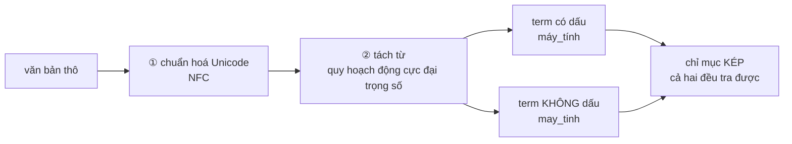

# VietnameseTokenizer — Longest Matching và bài toán riêng của tiếng Việt

**File nguồn:** `search-engine/src/main/java/com/vnsearch/index/VietnameseTokenizer.java`
**Việc nó làm:** Biến một đoạn văn bản thành danh sách **token** — đơn vị nhỏ nhất mà chỉ mục làm việc trên đó.

> 📖 Chưa quen ký hiệu toán? Đọc [00 — Từ điển ký hiệu toán](../00-KY-HIEU-TOAN.md) trước.


> ### 🔄 Đã cập nhật sau đợt tái cấu trúc
>
> Phần **toán học và thuật toán** dưới đây vẫn đúng nguyên vẹn. Nhưng một số
> đoạn mã trích dẫn và mục *"Hạn chế đã biết"* mô tả **phiên bản trước**.
> Những gì đã thay đổi ở file này:
>
> - Lớp nay cài đặt interface **`Tokenizer`** — đã có thể làm thí nghiệm ablation "tokenizer nào tốt hơn", xoá bất đối xứng với `RelevanceScorer`.
> - Tokenizer là **một bean dùng chung** (`SearchConfig`), nên bất biến "cùng tokenizer lúc index và lúc query" được đảm bảo ở tầng cấu hình.
> - **Bước ghép từ đã được thay hoàn toàn.** Longest Matching tham lam trên `HashSet` 154 mục nay là **quy hoạch động cực đại trọng số** (`MaxWeightSegmenter`) trên `SyllableTrie` **49.793 mục** — xem §9. Mọi đoạn mô tả Longest Matching bên dưới là **lịch sử**, không phải mã hiện tại.
>

---

## 📌 Hiểu trong 30 giây

Tiếng Anh tách từ bằng khoảng trắng: `computer science` → 2 từ, mỗi từ có nghĩa riêng.

Tiếng Việt **không** như vậy. `máy tính` là **một từ** (computer), nhưng viết thành 2 tiếng cách nhau bởi khoảng trắng. Tách theo khoảng trắng sẽ được `máy` (machine) và `tính` (to calculate) — **sai hoàn toàn về nghĩa**.

Hệ quả trực tiếp cho tìm kiếm: nếu index `máy` và `tính` riêng lẻ thì truy vấn `máy tính` sẽ khớp cả bài viết về "máy giặt" có chữ "tính tiền".

```
   "máy tính để bàn giá rẻ"

   Tách theo KHOẢNG TRẮNG (sai)
   ├─máy─┤├─tính─┤├─để─┤├─bàn─┤├─giá─┤├─rẻ─┤
     ▲      ▲
     machine  to calculate     ⇒ khớp cả bài về "máy giặt" có "tính tiền"

   Tách theo TỪ (đúng)
   ├──── máy_tính ────┤├─ để_bàn ─┤├─ giá ─┤├─ rẻ ─┤
              ▲
           computer
```



**Vì sao bước ① không bỏ được.** Chữ `ế` có **hai** cách mã hoá Unicode khác
nhau — một ký tự dựng sẵn (NFC), hoặc `e` cộng hai dấu tổ hợp (NFD). Hai chuỗi
trông **y hệt nhau trên màn hình** nhưng khác nhau từng byte, nên bảng băm coi
là hai term khác nhau:

```
   "tiếng"  dạng NFC :  t i ế n g            5 ký tự
   "tiếng"  dạng NFD :  t i e ◌́ ◌̂ n g       7 ký tự
                            └─┬─┘
                       dấu tổ hợp rời

   Không chuẩn hoá ⇒ hai term, một nửa tài liệu không tìm được.
```

Lớp này giải bài toán đó bằng **Longest Matching**, cộng thêm hai việc riêng của tiếng Việt: chuẩn hoá Unicode và sinh bản không dấu.

---

## 1. Quy trình sáu bước

```
văn bản thô
   │ 1. Chuẩn hoá Unicode NFC
   │ 2. Hạ chữ thường + bỏ dấu câu
   │ 3. Tách theo khoảng trắng → mảng "tiếng"
   │ 4. Ghép từ ghép bằng Longest Matching
   │ 5. Lọc từ dừng (chỉ với token 1 tiếng)
   │ 6. Sinh bản không dấu
   ▼
List<Token(term, noDiacriticTerm, position)>
```

---

## 2. Longest Matching — thuật toán tham lam

**Ý tưởng.** Tại mỗi vị trí, thử ghép **nhiều tiếng nhất có thể** và tra từ điển; cụm dài nhất khớp được sẽ thắng.

**Mã giả:**

```
TOKENIZE(syllables):
    i ← 0
    while i < độ dài syllables:
        matchedLen ← 1
        maxLen ← min(MAX_COMPOUND_LENGTH, còn lại)
        for len từ maxLen GIẢM về 2:
            nếu từ điển chứa ghép(syllables[i..i+len]):
                matchedLen ← len; DỪNG
        nếu matchedLen > 1:
            term ← nối bằng "_"; không phải stopword
        ngược lại:
            term ← syllables[i]; kiểm tra stopword
        nếu không phải stopword: phát ra Token(term, bỏ dấu(term), position++)
        i ← i + matchedLen
```

**Mã thật:**

```java
private static final int MAX_COMPOUND_LENGTH = 4;
...
while (i < syllables.length) {
    int matchedLen = 1;
    int maxLen = Math.min(MAX_COMPOUND_LENGTH, syllables.length - i);
    for (int len = maxLen; len >= 2; len--) {
        String candidate = String.join(" ", Arrays.copyOfRange(syllables, i, i + len));
        if (bigramDictionary.contains(candidate)) {
            matchedLen = len;
            break;                       // ← dài nhất thắng, dừng ngay
        }
    }
    String term;
    boolean isStopword;
    if (matchedLen > 1) {
        term = String.join("_", Arrays.copyOfRange(syllables, i, i + matchedLen));
        isStopword = false;              // ← từ ghép KHÔNG bao giờ bị coi là stopword
    } else {
        term = syllables[i];
        isStopword = stopwords.contains(term);
    }
    if (!isStopword) {
        tokens.add(new Token(term, stripDiacritics(term), position));
        position++;
    }
    i += matchedLen;
}
```

**Chạy tay với `khoa học máy tính rất hay`:**

| $i$ | Tiếng tại $i$ | Thử ghép | Trong từ điển? | Kết quả |
|---|---|---|---|---|
| 0 | `khoa` | `khoa học máy tính` (4) | ✅ | token `khoa_học_máy_tính`, $i \to 4$ |
| 4 | `rất` | `rất hay` (2) | ❌ | token `rất`, $i \to 5$ |
| 5 | `hay` | (hết chuỗi, maxLen=1) | — | token `hay`, $i \to 6$ |

**Hai chi tiết quyết định tính đúng đắn:**

### 2.1 Vòng lặp đi từ `maxLen` GIẢM xuống — đó là chữ "Longest"

```java
for (int len = maxLen; len >= 2; len--) {
```

Nếu đi từ 2 lên 4 và `break` ở lần khớp đầu tiên, thuật toán thành **shortest matching**, và `khoa học máy tính` sẽ bị cắt thành `khoa_học` + `máy_tính` — hai token thay vì một, mất mất khái niệm "khoa học máy tính" như một chỉnh thể.

Đây là một trong những chỗ mà **đổi một dấu trừ thành dấu cộng** làm hỏng toàn bộ ngữ nghĩa mà không có lỗi biên dịch nào.

### 2.2 `position` chỉ tăng khi token được phát ra

```java
if (!isStopword) {
    tokens.add(new Token(term, stripDiacritics(term), position));
    position++;      // ← trong khối if
}
i += matchedLen;     // ← ngoài khối if
```

Hai biến đếm khác nhau, có chủ ý:

| Biến | Ý nghĩa | Tăng khi nào |
|---|---|---|
| `i` | Vị trí trong mảng **tiếng gốc** | Luôn tăng, kể cả khi bỏ stopword |
| `position` | Vị trí trong dãy **token đã lọc** | Chỉ khi token thực sự được phát ra |

Nghĩa là stopword bị loại **không chiếm** một vị trí. Điều này quan trọng cho tìm cụm từ: cụm `"trình duyệt web"` vẫn khớp trong câu `trình duyệt của web` (nếu `của` là stopword) vì `duyệt` ở vị trí 1 và `web` ở vị trí 2 — liên tiếp.

> Đây là một quyết định đánh đổi: nó làm phrase search **khoan dung hơn** (bắt được cụm bị chèn stopword) nhưng cũng **kém chính xác hơn** (một cụm không liền thật vẫn khớp). Với tiếng Việt, khoan dung là lựa chọn đúng vì stopword tiếng Việt (`của`, `và`, `là`) thường chỉ là chất kết dính ngữ pháp.

---

## 3. Chuẩn hoá Unicode NFC — hai chuỗi trông giống nhau nhưng khác byte

**Vấn đề.** Chữ `ế` có **hai cách** biểu diễn hợp lệ trong Unicode:

| Dạng | Biểu diễn | Số code point | Số byte UTF-8 |
|---|---|---|---|
| **NFC** (dựng sẵn) | `U+1EBF` | 1 | 3 |
| **NFD** (tổ hợp) | `e` + `◌̂` (U+0302) + `◌́` (U+0301) | 3 | 5 |

Hai chuỗi trông **y hệt nhau trên màn hình** nhưng `equals()` trả về `false` và `hashCode()` khác nhau. Không chuẩn hoá thì:

- Cùng một từ tạo ra **hai khoá khác nhau** trong `HashMap` chỉ mục.
- Người gõ kiểu NFD sẽ **không tìm được** tài liệu gõ kiểu NFC.
- Và lỗi này **hoàn toàn im lặng** — không có ngoại lệ, chỉ là kết quả rỗng khó hiểu.

**Vì sao tiếng Việt dễ dính hơn các ngôn ngữ khác:** tiếng Việt có tới **hai** dấu chồng lên một nguyên âm (dấu mũ/móc + dấu thanh), nên số tổ hợp NFD nhiều hơn hẳn. Bộ gõ Telex/VNI trên các nền tảng khác nhau sinh ra dạng khác nhau; macOS thậm chí lưu tên tệp ở dạng NFD.

**Ý tưởng.** Luôn chuẩn hoá về **một** dạng duy nhất (dự án chọn NFC) ở **mọi** điểm vào.

```java
private static String normalizeForLookup(String s) {
    return Normalizer.normalize(s, Normalizer.Form.NFC).toLowerCase(Locale.forLanguageTag("vi"));
}

private static String[] splitIntoSyllables(String text) {
    String nfc = Normalizer.normalize(text, Normalizer.Form.NFC).toLowerCase(Locale.forLanguageTag("vi"));
    String cleaned = nfc.replaceAll("[^\\p{L}\\p{N}\\s]", " ").replaceAll("\\s+", " ").trim();
    ...
}
```

**Ba điểm vào đều được phủ:** văn bản đầu vào (`splitIntoSyllables`), từ điển và stopword khi nạp (`loadResourceLines` gọi `normalizeForLookup`), và `Trie` gợi ý (có hàm `normalize` riêng). Bỏ sót bất kỳ điểm nào là hỏng.

**Vì sao chọn NFC chứ không phải NFD:** NFC ngắn hơn (ít code point hơn) nên tiết kiệm bộ nhớ và so sánh nhanh hơn. Nó cũng là dạng mà đại đa số văn bản web dùng.

### 3.1 `Locale.forLanguageTag("vi")` — không phải thừa

Hạ chữ thường **phụ thuộc ngôn ngữ**. Ví dụ nổi tiếng: tiếng Thổ Nhĩ Kỳ có `I` → `ı` (i không chấm) chứ không phải `i`. Nếu JVM chạy với `Locale` mặc định là `tr-TR`, `"INDEX".toLowerCase()` cho ra `ındex` và mọi phép tra khoá hỏng.

Chỉ rõ locale là **thói quen đúng**, không phải dư thừa — và đây là loại lỗi chỉ xuất hiện trên máy của người dùng ở một quốc gia nhất định.

### 3.2 Hai biểu thức chính quy làm sạch

```java
nfc.replaceAll("[^\\p{L}\\p{N}\\s]", " ")   // bỏ mọi thứ không phải chữ/số/khoảng trắng
   .replaceAll("\\s+", " ")                  // gộp khoảng trắng liên tiếp
   .trim();
```

`\p{L}` là **lớp Unicode "Letter"** — bao gồm mọi chữ cái của mọi ngôn ngữ, kể cả `á`, `ế`, `đ`, và cả chữ Hán. Đây là điểm khác biệt then chốt so với `[a-zA-Z]`: dùng `[a-zA-Z]` sẽ **xoá sạch dấu tiếng Việt**.

Thay bằng **khoảng trắng** chứ không phải xoá hẳn: `máy-tính` phải thành `máy tính` (2 tiếng), không phải `máytính` (1 tiếng rác).

---

## 4. Sinh bản không dấu — và cái bẫy chữ `đ`

**Vấn đề.** Người Việt hay gõ không dấu trên bàn phím quốc tế: `may tinh` thay vì `máy tính`. Hệ thống phải tìm được.

**Ý tưởng.** Ba bước, và bước thứ ba là chỗ **hầu như ai cũng sai lần đầu**:

```java
public static String stripDiacritics(String s) {
    String withoutDd = s.replace('đ', 'd').replace('Đ', 'D');   // ← BƯỚC 1, phải TRƯỚC
    String nfd = Normalizer.normalize(withoutDd, Normalizer.Form.NFD);
    return nfd.replaceAll("\\p{M}", "");
}
```

| Bước | Làm gì | Vì sao |
|---|---|---|
| 1 | Thay `đ`/`Đ` thủ công | Xem dưới |
| 2 | Chuẩn hoá về **NFD** | Tách dấu ra thành ký tự riêng |
| 3 | Xoá mọi ký tự `\p{M}` | `M` = "Mark", nhóm ký tự dấu tổ hợp |

**Vì sao `đ` phải xử lý riêng.** Trong bảng chữ cái tiếng Việt, `đ` là một **chữ cái Latin độc lập** (code point `U+0111`), **không phải** `d` + một dấu tổ hợp. NFD **không tách được** nó vì không có gì để tách.

Nếu bỏ bước 1:

$$\texttt{đồng} \xrightarrow{\text{NFD} + \text{xoá }\backslash p\{M\}} \texttt{đong}$$

— vẫn còn chữ `đ`, và người gõ `dong` sẽ **không tìm ra**.

Thứ tự cũng quan trọng: phải thay `đ` **trước** khi NFD. Sau NFD thì `ồ` đã tách thành `o` + 2 dấu, nhưng `đ` vẫn nguyên — thay lúc nào cũng được với riêng `đ`, nhưng đặt trước là cách viết rõ ràng hơn.

**`\p{M}` bắt được những gì:** toàn bộ nhóm Unicode "Mark", gồm dấu thanh (`◌́`, `◌̀`, `◌̉`, `◌̃`, `◌̣`) và dấu phụ nguyên âm (`◌̂` cho `â/ê/ô`, `◌̆` cho `ă`, `◌̛` cho `ơ/ư`). Đúng bằng một biểu thức, không cần bảng tra 134 nguyên âm tiếng Việt.

**Kết quả:**

| Có dấu | Không dấu |
|---|---|
| `máy_tính` | `may_tinh` |
| `đồng` | `dong` |
| `Việt Nam` | `Viet Nam` |
| `web` | `web` (không đổi) |

---

## 5. Lọc từ dừng — và vì sao chỉ áp dụng cho token 1 tiếng

**Vấn đề.** Từ như `của`, `và`, `là` xuất hiện trong gần như **mọi** tài liệu nên không mang thông tin phân biệt, nhưng lại chiếm chỗ lớn nhất trong chỉ mục (posting list của chúng dài nhất).

Dự án dùng danh sách **91 từ** ở `vietnamese-stopwords.txt`.

**Quyết định thiết kế đáng chú ý:**

```java
if (matchedLen > 1) {
    term = String.join("_", ...);
    isStopword = false;        // ← từ ghép không bao giờ bị loại
} else {
    term = syllables[i];
    isStopword = stopwords.contains(term);
}
```

**Vì sao:** một tiếng có thể là stopword khi đứng riêng nhưng lại là thành phần **mang nghĩa** của một từ ghép.

Ví dụ: `và` là stopword. Nhưng nếu từ điển có cụm `hoà và giải` (giả định), việc lọc `và` trước khi ghép sẽ phá vỡ chính cụm ta muốn giữ.

Thứ tự đúng là: **ghép trước, lọc sau**. Nếu lọc stopword *trước* khi ghép từ, ta phá vỡ ngữ cảnh mà thuật toán ghép cần.

**Giá trị đo được của việc lọc stopword.** Với 91 từ chiếm khoảng 25–30% số tiếng trong văn bản tiếng Việt tự nhiên, việc lọc giảm:

- Số token mỗi tài liệu: ~1.400 → **1.043**
- Kích thước posting list dài nhất: giảm hàng nghìn mục
- Thời gian giao posting list: tỉ lệ thuận với độ dài list

---

## 6. Cấu trúc `Token` — vì sao ba trường

```java
public record Token(String term, String noDiacriticTerm, int position) {
}
```

| Trường | Dùng ở đâu |
|---|---|
| `term` | Khoá chính trong chỉ mục |
| `noDiacriticTerm` | Khoá phụ, cho tìm không dấu ([InvertedIndex §5](../03-index/InvertedIndex.md)) |
| `position` | Phrase search ([PostingListMerger §5](../04-query/PostingListMerger.md)) |

Là `record` (bất biến) vì một token không bao giờ thay đổi sau khi tạo. Bất biến cho ta ba thứ miễn phí: `equals`/`hashCode`/`toString` tự sinh, an toàn khi chia sẻ giữa các thread, và không thể vô tình sửa nhầm.

---

## 7. Độ phức tạp

**Phân tích `tokenize` trên văn bản có $n$ tiếng:**

Vòng ngoài chạy tối đa $n$ lần (mỗi lần $i$ tăng ít nhất 1). Vòng trong chạy tối đa `MAX_COMPOUND_LENGTH − 1 = 3` lần. Mỗi lần vòng trong làm:

- `Arrays.copyOfRange` — $O(\text{len}) \le O(4)$
- `String.join` — $O(\text{tổng độ dài}) \le O(40)$ ký tự
- `HashSet.contains` — $O(\text{độ dài chuỗi})$ để băm

$$T(n) = O(n \times 3 \times c) = \mathbf{O(n)}$$

vì `MAX_COMPOUND_LENGTH = 4` là hằng số.

| Thao tác | Thời gian |
|---|---|
| `tokenize` | **$O(n)$** với $n$ = số tiếng |
| `stripDiacritics` | $O(L)$ |
| `splitIntoSyllables` | $O(L)$ (hai lượt regex) |
| Bộ nhớ | $O(n)$ cho token + $O(\lvert\text{từ điển}\rvert)$ cố định |

**Hằng số ẩn không nhỏ.** Mỗi vị trí tạo tới 3 chuỗi tạm (`copyOfRange` + `join`). Với 5.011 tài liệu × 1.400 tiếng, đó là khoảng **21 triệu** chuỗi tạm được cấp phát và vứt đi — góp phần đáng kể vào 6,8–9,5 giây dựng chỉ mục.

**Cách tối ưu nếu cần:** dùng một `StringBuilder` tái sử dụng, hoặc tra từ điển bằng **Trie trên tiếng** thay vì `HashSet` trên chuỗi ghép. Trie sẽ cho phép duyệt một lượt từ vị trí $i$ và biết ngay cụm dài nhất khớp là bao nhiêu — $O(1)$ chuỗi tạm thay vì 3.

---

## 8. Chủ đề DSA thể hiện

| Chủ đề | Ở đâu |
|---|---|
| **Thuật toán tham lam** | Longest Matching — chọn cụm dài nhất tại mỗi bước |
| **Tra bảng băm** | `HashSet.contains` cho từ điển và stopword |
| **Chuẩn hoá về dạng chuẩn tắc** | NFC — cùng ý tưởng với [UrlCanonicalizer](../01-crawler/UrlCanonicalizer.md) |
| **Lớp ký tự Unicode** | `\p{L}`, `\p{N}`, `\p{M}` |
| **Hai biến đếm độc lập** | `i` (tiếng gốc) và `position` (token đã lọc) |
| **Bản ghi bất biến** | `record Token` |
| **Chặn hằng số hoá độ phức tạp** | `MAX_COMPOUND_LENGTH = 4` biến $O(n \cdot k)$ thành $O(n)$ |
| **Thứ tự xử lý quyết định đúng sai** | ghép trước — lọc stopword sau; thay `đ` trước — NFD sau |

---

## 9. Trần chất lượng cũ — và cách nó đã được gỡ

> **Đây từng là hạn chế lớn nhất của cả dự án.** Bản trước ghi ở đây: *"Từ điển
> `vietnamese-bigrams.txt` chỉ có **154 mục** (131 cụm 2 tiếng, 11 cụm 3 tiếng,
> 12 cụm 4 tiếng). Thuật toán cài đúng, nhưng chạy trên từ điển nhỏ này thì
> nhiều cụm từ phổ biến không được ghép — `bóng đá` bị tách thành `bóng` +
> `đá`."* Kèm nhận định *"một từ điển tiếng Việt đầy đủ cần 30.000–70.000 mục"*.
>
> **Trần đó đã được gỡ, bằng HAI thay đổi bắt buộc đi cùng nhau.**

| | Trước | Nay |
|---|---|---|
| Từ điển | `vietnamese-bigrams.txt` — **154 mục** | `vietnamese-words.txt` — **49.793 mục** (40.390 từ ghép) |
| Cấu trúc | `HashSet<String>` | **`SyllableTrie`** (mảng phẳng) |
| Từ điển trả lời được | có / không | có / không **+ trọng số** |
| Thuật toán ghép | Longest Matching **tham lam** | **QHĐ cực đại trọng số** (`MaxWeightSegmenter`) |
| Tốc độ ghép từ | 3.718.748 âm tiết/giây | **17.853.690 âm tiết/giây** (nhanh **4,80 lần**) |
| Bộ nhớ từ điển | ~0,02 MB | 2,0 MB |
| Nạp từ điển | ~1 ms | 143 ms, **một lần / tiến trình** |

`bóng đá` nay ghép đúng. Dấu vân tay tokenizer hiện tại:

```
VietnameseTokenizer(MaxWeightDP, maxSyllables=4, dict=49793 (40390 tu ghep), stopwords=91)
```

> **Vì sao hai thay đổi BẮT BUỘC đi cùng nhau.** Khiếm khuyết của tham lam —
> không rút lại được quyết định — hầu như **không lộ ra** khi từ điển còn nhỏ:
> muốn chọn sai thì trước hết phải có nhiều lựa chọn. Mở rộng từ điển mà **giữ**
> tham lam sẽ làm chất lượng **tệ đi** ở một lớp câu, chứ không tốt lên.
>
> Ví dụ kinh điển — `nhà hàng xóm`: cả `[nhà_hàng][xóm]` lẫn `[nhà][hàng_xóm]`
> đều **hợp lệ về từ điển**, nên tham lam không có cách nào phân biệt và phải
> đoán bằng heuristic "dài hơn thì đúng hơn" — ở đây heuristic đó sai. Quy hoạch
> động chấm điểm **cả câu**: 13,05 so với 13,13, và chọn cách thứ hai.

Chi tiết thuật toán và số đo: [`DSA-REPORT.md` §2.8](../../DSA-REPORT.md) ·
[`SO-SANH-PHUONG-AN.md` §2](../../SO-SANH-PHUONG-AN.md).

### Hạn chế còn lại của bước tách từ

- **Trọng số lấy từ tần suất trong từ điển**, chưa ước lượng từ chính corpus đã
  crawl — làm vậy sẽ hợp với miền dữ liệu hơn.
- **Độ chính xác tách từ vẫn chưa được đo** trên một tập chuẩn. Muốn đo cần vài
  trăm câu đã tách từ thủ công. Đây là khoảng trống lớn nhất còn lại.

Các hạn chế khác:

1. **Đặt tên gây hiểu nhầm.** Biến trong code gọi là `bigramDictionary` nhưng từ điển chứa cụm **tới 4 tiếng**, không chỉ bigram.
2. **Longest Matching là tham lam, không tối ưu toàn cục.** Có trường hợp chọn cụm dài nhất tại vị trí $i$ khiến phần còn lại không ghép được, trong khi chọn cụm ngắn hơn sẽ cho kết quả tổng thể tốt hơn. Thuật toán đúng là **quy hoạch động** trên toàn câu (tối đa hoá tổng điểm), hoặc mô hình xác suất (CRF, n-gram) như VnCoreNLP dùng.
3. **Không xử lý từ láy, tên riêng, số, đơn vị.** `Hà Nội` bị tách thành 2 token nếu không có trong từ điển.
4. **Nạp từ điển trong constructor.** Mỗi `new VietnameseTokenizer()` đọc lại 2 tệp từ classpath. `SearchEngineFacade` tạo một instance dùng chung, nhưng `QueryParser()` và `EvaluationHarness` có constructor không tham số tự tạo instance mới — lãng phí và dễ dẫn tới hai từ điển khác nhau nếu tệp thay đổi.
5. ~~**Không có tokenizer nào khác để so sánh.**~~ ✅ **Đã khắc phục** — nay có interface `Tokenizer`, nên thí nghiệm ablation *"tokenizer nào tốt hơn"* đã đo được, xoá bỏ sự bất đối xứng với `RelevanceScorer`. `InvertedIndex` và `QueryParser` đều nhận `Tokenizer` qua constructor, ép luôn bất biến *"index và query phải dùng cùng một cài đặt"*. Xem [**01-STRATEGY.md §4.2**](../09-design-patterns/01-STRATEGY.md).

---

## 10. Liên kết

- Người dùng: [InvertedIndex.md](../03-index/InvertedIndex.md) · [QueryParser.md](../04-query/QueryParser.md)
- Nơi `stripDiacritics` được dùng lại: [ResultRanker.md](../05-ranking/ResultRanker.md) · [Trie.md](../06-datastructures/Trie.md)
- Cùng ý tưởng "dạng chuẩn tắc": [UrlCanonicalizer.md](../01-crawler/UrlCanonicalizer.md)
- Ký hiệu chưa hiểu: [00 — Từ điển ký hiệu toán](../00-KY-HIEU-TOAN.md)
