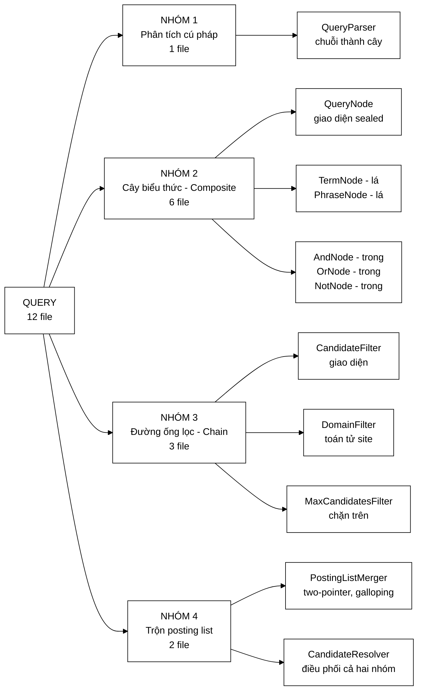
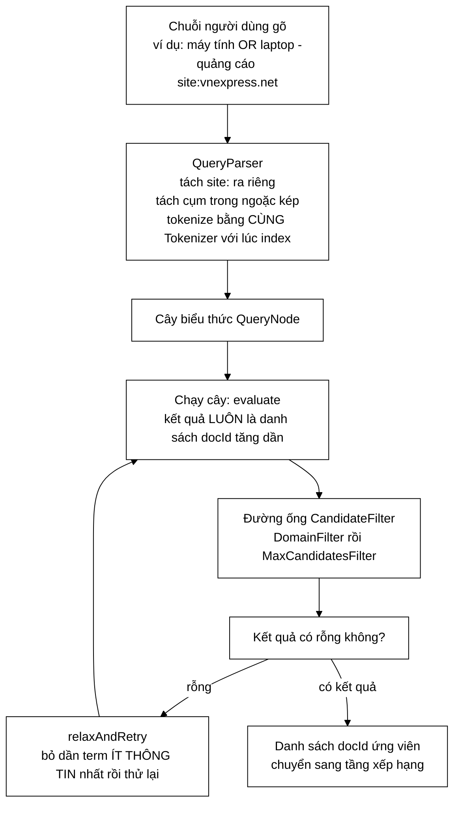
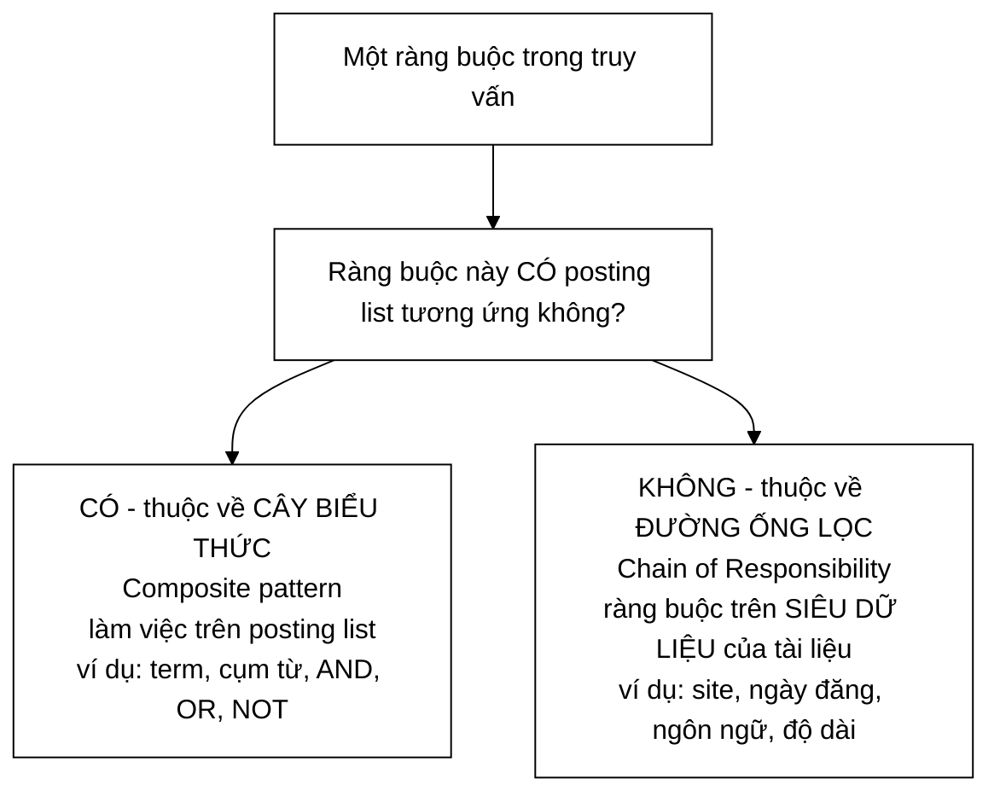
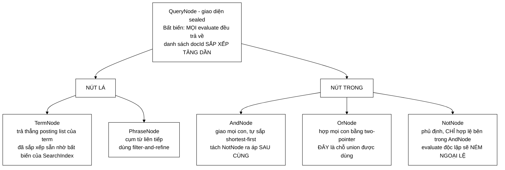
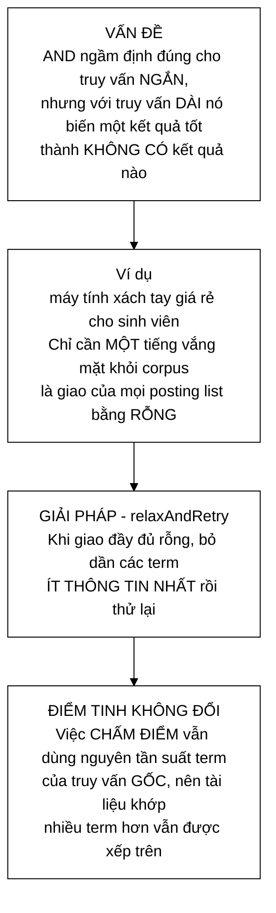

# Sơ đồ tư duy — Toàn bộ tầng Xử lý truy vấn

**Phạm vi:** 12 file trong `com.vnsearch.query` (3 file gốc + 6 file `ast/` + 3 file `filter/`).

**Trang này trả lời:** các file liên hệ với nhau ra sao, một câu truy vấn biến thành danh sách docId qua những bước nào, và **hai mẫu thiết kế chia nhau công việc theo ranh giới nào**.

> ### Cách đọc
> - Sơ đồ vẽ bằng **Mermaid**; nếu trình xem không hiện hình, bấm khối *"Xem bản chữ (ASCII)"* ngay dưới mỗi sơ đồ.
> - Đọc §1 → §3 là đủ hiểu tổng thể.
>
> 📖 **Trang đi sâu:** [QueryParser](QueryParser.md) · [CandidateResolver](CandidateResolver.md) · [PostingListMerger](PostingListMerger.md)

---

## 1. Bản đồ toàn cảnh — 12 file chia 4 nhóm



<details>
<summary><b>Xem bản chữ (ASCII)</b></summary>
```
                            QUERY — 12 file
                                   │
   ┌───────────────┬───────────────┼───────────────┬──────────────────┐
NHÓM 1          NHÓM 2                        NHÓM 3            NHÓM 4
Phân tích      Cây biểu thức                  Đường ống lọc     Trộn posting
cú pháp        (Composite, 6 file)            (Chain, 3 file)   (2 file)
   │               │                              │                 │
QueryParser    QueryNode (sealed)            CandidateFilter   PostingListMerger
               TermNode, PhraseNode          DomainFilter      CandidateResolver
               AndNode, OrNode, NotNode      MaxCandidatesFilter
```

</details>

### Bảng tra nhanh — 12 file, mỗi file một câu

| # | File | Nhóm | Nó làm gì |
|---|---|---|---|
| 1 | `QueryParser` | 1 | Biến chuỗi người dùng gõ thành **cây biểu thức** |
| 2 | `QueryNode` | 2 | Giao diện `sealed` — một nút của cây, Composite |
| 3 | `TermNode` | 2 | Nút **lá**: một term đơn → posting list của nó |
| 4 | `PhraseNode` | 2 | Nút **lá**: cụm từ phải xuất hiện **liên tiếp** |
| 5 | `AndNode` | 2 | Nút **trong**: giao mọi con, tự sắp shortest-first |
| 6 | `OrNode` | 2 | Nút **trong**: hợp mọi con |
| 7 | `NotNode` | 2 | Nút **trong**: phủ định — **chỉ hợp lệ trong `AndNode`** |
| 8 | `CandidateFilter` | 3 | Giao diện một tầng lọc, Chain of Responsibility |
| 9 | `DomainFilter` | 3 | Toán tử `site:vnexpress.net`, khớp theo **hậu tố** |
| 10 | `MaxCandidatesFilter` | 3 | Chặn trên số ứng viên đưa sang khâu chấm điểm |
| 11 | `PostingListMerger` | 4 | `intersect` / `union` two-pointer, galloping search |
| 12 | `CandidateResolver` | 4 | Điều phối: chạy cây → chạy đường ống lọc → lùi dần nếu rỗng |

---

## 2. Cú pháp truy vấn được hỗ trợ

| Cú pháp | Ý nghĩa | Sinh ra nút |
|---|---|---|
| `máy tính` | AND ngầm định giữa các term | `AndNode(TermNode, TermNode)` |
| `"trình duyệt web"` | Cụm từ phải xuất hiện **liên tiếp** | `PhraseNode` |
| `-giá` | Loại trừ một tiếng | `NotNode` |
| `laptop OR máy tính` | **Hợp** | `OrNode` |
| `site:vnexpress.net` | Giới hạn domain | *(không vào cây — thành `DomainFilter`)* |

---

## 3. Đường đi của một truy vấn



<details>
<summary><b>Xem bản chữ (ASCII)</b></summary>
```
chuỗi truy vấn
      │
      ▼
QueryParser  ── tách site: ra riêng
             ── tách cụm trong ngoặc kép
             ── tokenize bằng CÙNG Tokenizer với lúc index  ← bất biến sống còn
      │
      ▼
cây QueryNode ──► evaluate() ──► danh sách docId TĂNG DẦN
      │
      ▼
đường ống CandidateFilter:  DomainFilter → MaxCandidatesFilter
      │
      ├── rỗng? ──► relaxAndRetry (bỏ dần term ít thông tin) ──┐
      │                                                        │
      └── có kết quả ──► ứng viên → tầng xếp hạng      ◄────────┘
```

</details>

---

## 4. Ranh giới giữa hai mẫu — chỗ đáng học nhất của tầng này

`CandidateResolver` dùng **hai** mẫu thiết kế, và ranh giới giữa chúng **không tuỳ tiện**:



<details>
<summary><b>Xem bản chữ (ASCII)</b></summary>
```
        Ràng buộc này CÓ posting list tương ứng không?
                          │
        ┌─────────────────┴──────────────────┐
       CÓ                                  KHÔNG
        │                                    │
   CÂY BIỂU THỨC                      ĐƯỜNG ỐNG LỌC
   (Composite)                        (Chain of Responsibility)
   term, cụm từ, AND, OR, NOT         site:, ngày đăng, ngôn ngữ
```

</details>

**Ví dụ cụ thể — vì sao `site:` là filter chứ không phải nút cây:** `site:` không phải một term, nó là ràng buộc trên **URL** của tài liệu. Không có posting list nào tương ứng. Đưa nó vào cây sẽ buộc phải dựng thêm một chỉ mục phụ `host → docIds`; còn ở đường ống lọc, với vài chục ứng viên thì kiểm tra trực tiếp là đủ và đơn giản hơn nhiều.

---

## 5. Cây biểu thức — Composite

### 5.1 Vấn đề của cấu trúc phẳng

Bản cũ lưu **ba danh sách phẳng** (`mustTerms`, `phrases`, `excludedTerms`), tức đã **mã hoá sẵn** giả định *"mọi mustTerm nối với nhau bằng AND"*. Cấu trúc đó **không biểu diễn được**:
```
   (máy tính OR laptop) AND giá rẻ
   NOT (quảng cáo OR khuyến mãi)
```

> **Chi tiết đáng chú ý:** `PostingListMerger.union` **đã tồn tại và đã có test**, nhưng trước khi có cây biểu thức thì **không có đường nào gọi tới nó** từ tầng truy vấn — một cấu trúc dữ liệu bị bỏ phí hoàn toàn, chỉ vì ngôn ngữ truy vấn không hỗ trợ `OR`.

### 5.2 Hình dạng cây

Cây cho truy vấn `(máy tính OR laptop) AND giá rẻ`:
```
                  AndNode
                 /       \
            OrNode      TermNode(giá_rẻ)
            /     \
      TermNode   TermNode
     (máy_tính)  (laptop)
```

### 5.3 Năm loại nút



<details>
<summary><b>Xem bản chữ (ASCII)</b></summary>
```
QueryNode (sealed)  — bất biến: evaluate() luôn trả danh sách docId TĂNG DẦN
   │
   ├── NÚT LÁ ──┬── TermNode    : trả thẳng posting list
   │            └── PhraseNode  : cụm liên tiếp, filter-and-refine
   │
   └── NÚT TRONG ─┬── AndNode : giao, shortest-first, NOT áp sau cùng
                  ├── OrNode  : hợp, two-pointer  ← chỗ union được dùng
                  └── NotNode : phủ định, chỉ hợp lệ TRONG AndNode
```

</details>

**Vì sao `sealed` + `record`:** Java 17 cho phép khai báo **kín** tập cài đặt, nên `switch` trên `QueryNode` được trình biên dịch **kiểm tra đầy đủ nhánh**. Thêm một loại nút mới thì compiler **nhắc mọi chỗ cần sửa** — thay vì phát hiện thiếu nhánh lúc chạy.

### 5.4 `AndNode` tự áp dụng shortest-first

Cơ sở là bất đẳng thức:

$$|A \cap B| \le \min(|A|, |B|)$$

Giao **không bao giờ lớn hơn** tập nhỏ hơn. Nên bắt đầu từ con cho **ít** kết quả nhất thì kết quả trung gian nhỏ ngay từ đầu, và mọi bước giao sau đều rẻ hơn.

Điểm hay: ước lượng kích thước dùng `QueryNode.estimatedSize` nên **không phải đánh giá thật** để biết nên sắp thế nào — với `TermNode` đó chỉ là một phép tra document frequency **O(1)**.

### 5.5 `NotNode` — vì sao không đánh giá độc lập được
```
   Truy vấn:  NOT quảng_cáo      trên corpus 5.011 tài liệu
                    ↓
   Kết quả :  gần 5.000 tài liệu
                    ↓
   • vô nghĩa với người dùng
   • đắt: phải liệt kê toàn bộ corpus rồi trừ đi
```

Mọi hệ thống tìm kiếm thực tế đều yêu cầu phủ định **gắn với một mệnh đề khẳng định**: `A AND NOT B`, không phải `NOT B` đơn độc. Vì vậy `NotNode.evaluate` **ném ngoại lệ có thông điệp rõ ràng**, còn `evaluateAgainst` mới là đường đúng.

---

## 6. `PostingListMerger` — phần đắt giá nhất

### 6.1 Vì sao two-pointer chứ không phải `HashSet.retainAll`

Đo thực tế với 2 danh sách 500.000 phần tử:

| Cách làm | Thời gian |
|---|---|
| **two-pointer** | **~10,0 ms** |
| `HashSet.retainAll` (không tính chi phí dựng set) | ~15,5 ms (+55 %) |
| `HashSet.retainAll` (**tính cả** dựng 2 set) | ~27,0 ms (**2,7 lần**) |

Ba lý do:

1. **Không tốn chi phí dựng cấu trúc trung gian** — posting list lấy **thẳng** từ chỉ mục, nên dòng thứ 3 mới là so sánh công bằng.
2. **Cục bộ cache tốt** — duyệt tuần tự thay vì nhảy ngẫu nhiên trong bảng băm.
3. **Không có hằng số ẩn** của việc băm.

### 6.2 Galloping search — khi hai danh sách lệch nhau nhiều
```
   Giao một danh sách RẤT NGẮN (5 mục) với một danh sách RẤT DÀI (4.000 mục):

     two-pointer thuần :  O(m + n)        = 5 + 4000    = 4005 bước
     galloping         :  O(m log(n/m))                 ≈   48 bước
                                                          ───────────
                                                          ~83 lần nhanh hơn
```

Đồng thời `intersectCursors` **không cấp phát `List<Integer>` trung gian**, nên tránh được autoboxing (16 byte/phần tử thay vì 4). Chi tiết cursor: [ArrayPostingCursor](../05-datastructures/ArrayPostingCursor.md).

---

## 7. Đường ống lọc — Chain of Responsibility

### 7.1 Vấn đề của bản cũ

`CandidateResolver.resolve` từng có **ba tầng lọc chôn cứng** trong thân hàm 104 dòng. Hậu quả: thêm một bộ lọc mới (theo ngày đăng, ngôn ngữ, độ dài) phải **sửa thân hàm** — vi phạm nguyên tắc Mở/Đóng. Và không test riêng được từng tầng, cũng không đo được *"tầng nào loại bao nhiêu ứng viên, tốn bao nhiêu ms"*.

### 7.2 Thứ tự lọc quan trọng — nguyên tắc "rẻ và loại nhiều trước"
```
   1. Giao posting list    5011  →  ~50     (rẻ nhất, loại nhiều nhất)
   2. Khớp cụm từ           ~50  →  ~20     (ĐẮT: binary search mỗi tài liệu)
   3. Loại trừ              ~20  →  ~19     (rẻ: tra HashSet)
```

**Nếu đảo thứ tự** — kiểm tra cụm từ trước khi giao — ta phải chạy `matchesPhrase` trên **5.011** tài liệu thay vì 50, tức **chậm hơn 100 lần**.

### 7.3 `MaxCandidatesFilter` — nói thẳng hạn chế

Truy vấn một term rất phổ biến có thể cho hàng nghìn ứng viên, và **tất cả** đều được chấm điểm ở tầng sau: mỗi ứng viên tốn `O(q log d)`. Với 4.000 ứng viên và 3 term, đó là khoảng **132.000 phép so sánh** — trong khi người dùng chỉ xem 10 kết quả đầu.

| | Cách chuẩn của ngành | Cách làm ở đây |
|---|---|---|
| Tên | **WAND** / **MaxScore** | giữ lại `maxCandidates` ứng viên đầu tiên |
| Nguyên lý | Ước lượng chặn trên điểm, bỏ qua sớm tài liệu không thể lọt top-K | cắt thẳng |
| Bảo toàn top-K | **Có** | **Không** — posting list sắp theo `docId` chứ không theo điểm |
| Chi phí cài đặt | Phải lưu chặn trên điểm theo term | 61 dòng |

> Javadoc của lớp này ghi thẳng: *"**Nói rõ hạn chế này quan trọng hơn việc giấu nó**: bộ lọc bảo vệ hệ thống khỏi truy vấn bất thường, không phải một tối ưu xếp hạng."* Nó chỉ kích hoạt ở ngưỡng rất cao (mặc định 10.000) nên thực tế không ảnh hưởng truy vấn bình thường.

---

## 8. `relaxAndRetry` — lùi dần về AND-của-tập-con

Đây là chi tiết mà nhiều đồ án bỏ qua, và nó ảnh hưởng trực tiếp tới trải nghiệm người dùng.



<details>
<summary><b>Xem bản chữ (ASCII)</b></summary>
```
VẤN ĐỀ  : AND ngầm định + truy vấn dài  →  giao rỗng  →  không có kết quả
VÍ DỤ   : "máy tính xách tay giá rẻ cho sinh viên"
          chỉ cần 1 tiếng vắng mặt là giao = ∅
GIẢI    : relaxAndRetry — bỏ dần term ÍT THÔNG TIN nhất rồi thử lại
GIỮ     : chấm điểm vẫn dùng tần suất term của truy vấn GỐC
          → tài liệu khớp nhiều term hơn vẫn xếp trên
```

</details>

---

## 9. Vì sao `CandidateResolver` phải là một lớp riêng

Logic này trước đây nằm trong `SearchEngineFacade` dưới dạng **phương thức private**, nên bộ đánh giá chất lượng **không gọi lại được** và buộc phải viết một **bản sao**.
```
   Hai bản sao  →  chắc chắn trôi lệch nhau theo thời gian
                        ↓
   Khi đó MỌI con số trong báo cáo đánh giá đều MẤT GIÁ TRỊ,
   vì chúng đo một đường đi KHÁC với đường đi mà hệ thống
   thực sự phục vụ người dùng.
```

Đây là lý do `EvaluationHarness` ở [tầng đánh giá](../06-eval/00-SO-DO-TU-DUY.md) dùng lại **nguyên si** `QueryParser`, `CandidateResolver`, `ResultRanker` của hệ thống thật.

---

## 10. Bảng độ phức tạp

| Thao tác | Độ phức tạp | Ghi chú |
|---|---|---|
| `QueryParser.parse` | **O(L)** | L = độ dài chuỗi truy vấn |
| `TermNode.evaluate` | **O(1)** | trả thẳng posting list |
| `PostingListMerger.intersect` | **O(m+n)** | two-pointer |
| `PostingListMerger.union` | **O(m+n)** | two-pointer |
| `intersectCursors` | **O(m log(n/m))** | galloping, không cấp phát |
| `AndNode.evaluate` | **O(tổng độ dài)** | shortest-first làm hằng số nhỏ đi rõ rệt |
| `PhraseNode.evaluate` | **O(giao) + O(|ứng viên| · log d)** | filter-and-refine |
| `DomainFilter.apply` | **O(c)** | c = số ứng viên |

---

## 11. Xoá một file thì hỏng cái gì?

| File | Nếu không có | Hậu quả |
|---|---|---|
| `QueryNode` + 5 loại nút | dùng lại ba danh sách phẳng | Mất `OR`, mất lồng biểu thức, và `union` trở lại thành **code chết** |
| `PostingListMerger` | dùng `HashSet.retainAll` | Chậm **2,7 lần**, và mất bất biến "kết quả đã sắp xếp" nên nút cha phải sort lại |
| `CandidateFilter` (giao diện) | chôn cứng trong thân hàm | Không test riêng từng tầng, không đo được tầng nào loại bao nhiêu |
| `MaxCandidatesFilter` | không có | Truy vấn một term phổ biến có thể chấm điểm hàng nghìn ứng viên vô ích |
| `CandidateResolver` | để private trong Facade | Bộ đánh giá phải viết bản sao → **mọi số liệu báo cáo mất giá trị** |
| `relaxAndRetry` | không có | Truy vấn dài trả về rỗng dù corpus có đủ tài liệu liên quan |

---

## 12. Đọc tiếp

| Muốn hiểu | Đọc |
|---|---|
| Chứng minh bất biến vòng lặp của two-pointer | [PostingListMerger.md](PostingListMerger.md) |
| Filter-and-refine, phần tử hấp thụ rỗng | [CandidateResolver.md](CandidateResolver.md) |
| Bất biến "cùng một tokenizer", regex giữ phần ngoài ngoặc kép | [QueryParser.md](QueryParser.md) |
| **Dữ liệu vào từ đâu** — chỉ mục đảo | [Sơ đồ tư duy tầng chỉ mục](../02-index/00-SO-DO-TU-DUY.md) |
| **Ứng viên đi tiếp về đâu** — chấm điểm và xếp hạng | [Sơ đồ tư duy tầng xếp hạng](../04-ranking/00-SO-DO-TU-DUY.md) |
| Galloping search chi tiết | [ArrayPostingCursor.md](../05-datastructures/ArrayPostingCursor.md) |
| Composite và Chain of Responsibility | [04-COMPOSITE](../08-design-patterns/04-COMPOSITE.md) · [05-CHAIN](../08-design-patterns/05-CHAIN-OF-RESPONSIBILITY.md) |
