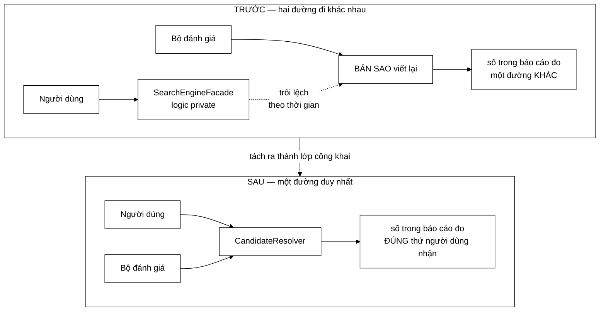

# CandidateResolver — đường ống lọc và bài học "một cài đặt duy nhất"

**File nguồn:** `search-engine/src/main/java/com/vnsearch/query/CandidateResolver.java`
**Việc nó làm:** Biến một `ParsedQuery` thành danh sách docId ứng viên, qua ba tầng lọc.

> 📖 Chưa quen ký hiệu toán? Đọc [00 — Từ điển ký hiệu toán](../00-KY-HIEU-TOAN.md) trước.

> 📊 **Số đo trong trang này thuộc mốc A** — corpus **5.011 trang**. Repo có
> **bốn mốc corpus** đo trên bốn phiên crawl khác nhau; trộn chúng vào một bảng
> là cách nhanh nhất để ra số vô nghĩa. Bảng quy chiếu đầy đủ ở đầu
> [`DSA-REPORT.md`](../../DSA-REPORT.md). Mốc hiện hành là **D — 31.030 trang**.


> ### 🔄 Đã cập nhật sau đợt tái cấu trúc
>
> Phần **toán học và thuật toán** dưới đây vẫn đúng nguyên vẹn. Nhưng một số
> đoạn mã trích dẫn và mục *"Hạn chế đã biết"* mô tả **phiên bản trước**.
> Những gì đã thay đổi ở file này:
>
> - Truy hồi boolean nay do **cây biểu thức** (`QueryNode` — Composite) đảm nhiệm, hỗ trợ AND/OR/NOT/cụm từ.
> - Đường ống lọc (**Chain of Responsibility**) nay lo các ràng buộc *sau* truy hồi: `DomainFilter`, `MaxCandidatesFilter`.
> - Ranh giới phân công: ràng buộc **có posting list** → cây; ràng buộc trên **siêu dữ liệu** → đường ống lọc.
>

---

## 📌 Hiểu trong 30 giây

Lớp này chỉ 104 dòng và không có thuật toán mới nào — nó **điều phối** `PostingListMerger`. Nhưng nó có mặt trong tập tài liệu này vì **lý do nó tồn tại** là một bài học kỹ thuật đáng giá hơn cả code trong nó.

Javadoc nói thẳng:

> *"logic này trước đây nằm trong `SearchEngineFacade` dưới dạng phương thức private, nên bộ đánh giá chất lượng không gọi lại được và buộc phải viết lại một bản sao. Hai bản sao chắc chắn sẽ trôi lệch nhau theo thời gian, và khi đó **mọi con số trong báo cáo đánh giá đều mất giá trị** vì chúng đo một đường đi khác với đường đi mà hệ thống thật sự phục vụ người dùng."*

Đây là vấn đề về **tính hợp lệ khoa học**, không phải về code sạch.



```
   TRƯỚC                                SAU
   ─────                                ───
   người dùng ──▶ Facade.private()      người dùng ──┐
                       ╎ trôi lệch                    ├──▶ CandidateResolver
   bộ đánh giá ──▶ bản sao ◀╌╌╌╌╌╌╌╌    bộ đánh giá ──┘
                                                          ▲
   ⇒ báo cáo đo đường A                   ⇒ báo cáo đo ĐÚNG đường
     người dùng đi đường B                   người dùng đi
```

Bài học tổng quát: **thứ gì được đo phải là đúng thứ được phục vụ.** Một bản
sao "chỉ để test" nghe vô hại, nhưng ngay khi hai bản trôi lệch, mọi con số đo
được đều nói về một hệ thống không tồn tại.

---

## 1. Vấn đề: hai bản sao là hai hệ thống khác nhau

Trước khi tách lớp:

```
SearchEngineFacade.search()          EvaluationRunner
    └─ resolveCandidates() private       └─ resolveCandidates() bản sao
           ↑                                     ↑
    đường người dùng đi              đường bộ đo đi
```

Ban đầu hai bản giống hệt nhau. Nhưng mỗi lần sửa một bên mà quên bên kia, chúng lệch đi một chút. Và **không có test nào bắt được** — cả hai bản đều chạy đúng, chỉ là chúng làm hai việc hơi khác nhau.

**Hậu quả logic:** báo cáo nói *"hệ thống đạt MRR 0,8758"*. Nhưng con số đó đo **bản sao trong `EvaluationRunner`**, không phải bản mà người dùng gọi. Nếu hai bản lệch nhau, câu khẳng định trong báo cáo **sai** — và không ai biết.

Đây là dạng lỗi mà một đồ án tốt nghiệp phải tránh bằng mọi giá: **số liệu đo một thứ, sản phẩm là thứ khác.**

**Sau khi tách:**

```
SearchEngineFacade.search()  ─┐
                              ├─→ CandidateResolver.resolve()  ← MỘT cài đặt
EvaluationHarness.search()   ─┘
```

Bây giờ mọi thay đổi tự động áp dụng cho cả hai, và báo cáo đo đúng thứ được phục vụ.

Nguyên tắc rút ra:

> **Bộ đo và sản phẩm phải chia sẻ đúng một đường thực thi. Mọi nhánh riêng cho việc đo đều làm hỏng giá trị của phép đo.**

`EvaluationHarness` áp dụng đúng nguyên tắc này — nó chỉ thay **một** biến số mỗi thí nghiệm và dùng lại nguyên si `QueryParser`, `CandidateResolver`, `ResultRanker`.

---

## 2. Đường ống lọc

**Bản hiện tại — hai giai đoạn, 25 dòng.** Ba tầng lọc cũ đã tách thành hai mẫu thiết kế có trách nhiệm rạch ròi:

```java
public static ResolvedQuery resolve(SearchIndex index, QueryParser.ParsedQuery parsed) {
    Map<String, Integer> queryTermFrequency = buildQueryTermFrequency(parsed);

    // --- Giai đoạn 1: truy hồi boolean bằng cây biểu thức (Composite) ---
    QueryNode ast = AST_BUILDER.buildAst(parsed);
    if (ast == null) {
        return new ResolvedQuery(new ArrayList<>(), queryTermFrequency);
    }
    List<Integer> candidates = ast.evaluate(index);

    // --- Giai đoạn 2: ràng buộc sau truy hồi (Chain of Responsibility) ---
    // Rỗng là PHẦN TỬ HẤP THỤ của mọi phép lọc, nên một khi rỗng thì dừng ngay.
    CandidateFilter.FilterContext context = new CandidateFilter.FilterContext(index, parsed);
    for (CandidateFilter filter : FILTERS) {
        if (candidates.isEmpty()) break;
        if (!filter.isApplicable(context)) continue;
        candidates = filter.apply(candidates, context);
    }

    return new ResolvedQuery(candidates, queryTermFrequency);
}
```

Ba tầng lọc cũ nay nằm ở đâu:

| Tầng cũ (chôn trong thân hàm 104 dòng) | Nay ở |
|---|---|
| Giao posting list | `AndNode.evaluate` — [Composite](../08-design-patterns/04-COMPOSITE.md) |
| Khớp cụm từ | `PhraseNode.evaluate` — filter-and-refine ngay trong nút |
| Loại trừ | `NotNode.evaluateAgainst` — two-pointer $O(m+n)$ |
| *(mới)* Lọc domain `site:` | `DomainFilter` — [Chain of Responsibility](../08-design-patterns/05-CHAIN-OF-RESPONSIBILITY.md) |
| *(mới)* Chặn trên số ứng viên | `MaxCandidatesFilter` |

Chuỗi lọc khai báo ở **một chỗ duy nhất**, thêm bộ lọc = thêm một dòng:

```java
private static final List<CandidateFilter> FILTERS = List.of(
        new DomainFilter(),
        new MaxCandidatesFilter());
```

**Thứ tự vẫn theo nguyên tắc "rẻ và loại nhiều trước":**

| Tầng | Chi phí mỗi ứng viên | Tỉ lệ loại điển hình |
|---|---|---|
| 1. Giao posting list | $O(\sum \lvert L_j \rvert)$ một lần cho cả tập | 5.011 → ~50 |
| 2. Khớp cụm từ | $O(p_1 \cdot k \cdot \log n)$ | ~50 → ~20 |
| 3. Loại trừ | $O(1)$ tra `HashSet` | ~20 → ~19 |

Tầng 1 làm phần lớn công việc và làm nó theo cách rẻ nhất. Nếu đảo thứ tự — kiểm tra cụm từ trước rồi mới giao — ta sẽ phải chạy `matchesPhrase` trên **5.011** tài liệu thay vì 50, tức chậm hơn **100 lần**.

---

## 3. Vì sao term của phrase cũng vào `allRequiredTerms`

```java
List<String> allRequiredTerms = new ArrayList<>(parsed.mustTerms());
for (List<String> phrase : parsed.phrases()) {
    allRequiredTerms.addAll(phrase);
}
```

Một cụm `"trình duyệt web"` yêu cầu 3 term xuất hiện **liên tiếp**. Điều kiện liên tiếp **kéo theo** điều kiện "cùng có mặt":

$$\text{liên tiếp} \implies \text{cùng có mặt}$$

Nên ta có thể dùng điều kiện yếu hơn (cùng có mặt) để **lọc thô** bằng phép giao rẻ tiền, rồi mới áp điều kiện mạnh (liên tiếp) trên tập nhỏ còn lại.

Đây là mẫu **filter-and-refine** kinh điển:

> Dùng một điều kiện **cần nhưng không đủ**, rẻ, để thu hẹp tập; rồi kiểm tra điều kiện đầy đủ, đắt, trên tập nhỏ.

Cùng ý tưởng với: kiểm tra hộp bao AABB trước khi kiểm tra va chạm chính xác, hay dùng Bloom Filter trước khi tra đĩa.

**Nếu bỏ bước này** và chỉ chạy `matchesPhrase` trực tiếp: phải gọi nó cho cả 5.011 tài liệu, và mỗi lần gọi lại làm binary search trên posting list. Đó là kịch bản chậm hơn 100 lần ở §2.

---

## 4. `queryTermFrequency` — vì sao trả về luôn

```java
public record ResolvedQuery(List<Integer> candidateDocIds, Map<String, Integer> queryTermFrequency) {
}
```

`queryTermFrequency` là số lần mỗi term xuất hiện **trong truy vấn** — cần cho `TfIdfScorer` để tính $\text{tf}$ của vector truy vấn.

Trả về luôn thay vì để tầng trên tự tính lại là tránh **tính hai lần** cùng một thứ, và quan trọng hơn: tránh **hai cách tính khác nhau**. Nếu `ResultRanker` tự đếm term từ `ParsedQuery`, nó có thể quên cộng term của phrase, và ta lại có hai nguồn sự thật — đúng vấn đề mà cả lớp này sinh ra để giải.

**`Map.merge` là cách viết gọn của "cộng dồn vào map":**

```java
queryTermFrequency.merge(term, 1, Integer::sum);
```

tương đương:

```java
Integer old = map.get(term);
map.put(term, old == null ? 1 : old + 1);
```

**Hệ quả thú vị:** vì term của phrase cũng được đếm, truy vấn `"máy tính" máy tính` cho `máy_tính → 2`. Trong TF-IDF, $\text{tf}(2) = 1 + \log_{10} 2 = 1{,}301$ thay vì $1{,}0$ — term được nhấn mạnh hơn 30%. Đây là hành vi hợp lý (người gõ hai lần rõ ràng muốn nhấn mạnh) nhưng nó là **tác dụng phụ** chứ không phải thiết kế có chủ ý.

---

## 5. Tầng loại trừ — dựng `HashSet` một lần

```java
Set<Integer> excludedDocIds = new HashSet<>();
for (String excludedTerm : parsed.excludedTerms()) {
    for (Posting posting : index.getPostings(excludedTerm)) {
        excludedDocIds.add(posting.docId());
    }
}
```

Đây là chỗ **duy nhất** trong toàn bộ tầng truy vấn dùng `HashSet` thay vì two-pointer — và đó là lựa chọn đúng.

**Vì sao ở đây `HashSet` hợp lý trong khi ở `intersect` thì không:**

| | `intersect` | Tầng loại trừ |
|---|---|---|
| Hai bên có sắp xếp? | **Cả hai** đều sắp | Ứng viên sắp, nhưng hợp của **nhiều** excluded list thì không |
| Kích thước | Cả hai lớn | Ứng viên **nhỏ** (~50) |
| Số lần tra | $m+n$ | ~50 |

Muốn dùng two-pointer, ta phải **hợp** các posting list của mọi excluded term thành một danh sách sắp xếp trước — tức gọi `union` nhiều lần, tốn $O(\sum \lvert L_j \rvert)$ và cấp phát danh sách trung gian. Với 50 ứng viên, `HashSet` đơn giản hơn và không chậm hơn.

Đây là ví dụ về việc **chọn công cụ theo hình dạng bài toán**, không phải áp dụng máy móc một kỹ thuật vì nó nhanh ở chỗ khác.

**Ngữ nghĩa loại trừ là OR:** tài liệu bị loại nếu chứa **bất kỳ** excluded term nào. Đúng trực giác — `-quảng -cáo` nên loại cả tài liệu chỉ chứa `quảng`.

---

## 6. Ba lần thoát sớm

| Điều kiện | Dòng | Tiết kiệm |
|---|---|---|
| `allRequiredTerms.isEmpty()` | truy vấn rỗng hoặc toàn stopword | toàn bộ |
| `postings.isEmpty()` | một term có df = 0 | `intersectAll` + 2 tầng lọc |
| `!candidates.isEmpty()` | giao đã rỗng | tầng lọc còn lại |

Trường hợp thứ hai đáng nói: nó rất **phổ biến** (gõ sai chính tả, tìm từ không có trong corpus) và được xử lý với chi phí gần bằng 0 — chỉ một phép tra `HashMap` là biết ngay.

**Cơ sở toán học của cả ba:**

$$\emptyset \cap L = \emptyset, \qquad \text{filter}(\emptyset) = \emptyset$$

Một khi tập rỗng, mọi thao tác sau đều cho rỗng. Đây là **phần tử hấp thụ** của phép giao — thuộc tính đại số cho phép thoát sớm an toàn.

---

## 7. Lớp tiện ích viết đúng chuẩn

```java
public final class CandidateResolver {
    private CandidateResolver() {
    }
    ...
}
```

| Yếu tố | Vì sao |
|---|---|
| `final` | Không ai kế thừa được — lớp toàn `static` mà kế thừa thì vô nghĩa |
| Constructor `private` | Không ai `new` được — ngăn tạo instance vô ích |

So sánh: `PostingListMerger` **không** làm hai việc này dù cũng toàn `static`. Đây là một sự thiếu nhất quán nhỏ trong codebase, đáng ghi khi chấm điểm OOP.

**Lưu ý về đánh đổi:** lớp toàn `static` **không mock được** trong test. Muốn test `SearchEngineFacade` với một `CandidateResolver` giả lập thì không có cách nào. Ở đây chấp nhận được vì `resolve` là hàm thuần tuý (cùng đầu vào → cùng đầu ra, không trạng thái), nên test nó trực tiếp là đủ. Nhưng đây là lý do các lớp có tác dụng phụ **không** nên viết kiểu này.

---

## 8. Độ phức tạp

| Tầng | Thời gian |
|---|---|
| Gom term + đếm tần suất | $O(k)$ |
| Tầng 1: `intersectAll` | $O\!\left(\sum_j \lvert L_j \rvert\right) + O(k\log k)$ |
| Tầng 2: khớp cụm từ | $O(c \cdot P \cdot p_1 \cdot k \cdot \log n)$ |
| Tầng 3: loại trừ | $O\!\left(\sum \lvert L_e \rvert\right) + O(c)$ |

với $k$ = số term bắt buộc, $c$ = số ứng viên sau tầng 1, $P$ = số cụm từ.

**Chi phối bởi tầng 1** trong mọi trường hợp thực tế. Số đo: thời gian truy vấn trung bình **1,59 ms** (đã làm nóng JVM), trong đó phần lớn là giao posting list và chấm điểm.

---

## 9. Chủ đề DSA thể hiện

| Chủ đề | Ở đâu |
|---|---|
| **Đường ống lọc (filter pipeline)** | ba tầng nối tiếp |
| **Filter-and-refine** | giao thô trước, khớp cụm chính xác sau |
| **Thứ tự lọc theo chi phí** | rẻ và loại nhiều trước |
| **Phần tử hấp thụ** | $\emptyset \cap L = \emptyset$ ⇒ thoát sớm |
| **Bảng băm cho tra thành viên** | `excludedDocIds` |
| **Chọn công cụ theo hình dạng bài toán** | `HashSet` ở tầng 3, two-pointer ở tầng 1 |
| **Hàm thuần tuý** | `resolve` không trạng thái, test được trực tiếp |
| **Một nguồn sự thật** | tách khỏi Facade để bộ đo và sản phẩm dùng chung |

---

## 10. Hạn chế đã biết

1. ~~**Ba tầng lọc là cứng.**~~ ✅ **Đã khắc phục** — nay dùng **Chain of Responsibility**: `resolve()` chỉ còn 7 dòng chạy qua `List<CandidateFilter> FILTERS`, thêm bộ lọc = thêm một lớp và một dòng. Và truy hồi boolean đã tách sang **Composite** (`QueryNode`), với nguyên tắc phân công rõ ràng: *ràng buộc có posting list → cây; ràng buộc trên siêu dữ liệu → đường ống lọc*. Xem [**05-CHAIN-OF-RESPONSIBILITY.md**](../08-design-patterns/05-CHAIN-OF-RESPONSIBILITY.md) và [**04-COMPOSITE.md**](../08-design-patterns/04-COMPOSITE.md).
2. **Không có ngưỡng số ứng viên.** Truy vấn một term phổ biến có thể cho hàng nghìn ứng viên, và tất cả đều được chấm điểm ở tầng sau. Máy tìm kiếm thật dùng **WAND** hoặc **MaxScore** để bỏ qua sớm các tài liệu không thể lọt top-K.
3. **Không hỗ trợ OR** (kế thừa từ [QueryParser](QueryParser.md)).
4. **Term của phrase bị đếm vào `queryTermFrequency`** — hợp lý nhưng là tác dụng phụ chưa có chủ đích (§4).
5. **Không mock được** vì toàn `static` (§7).
6. **Tầng 2 gọi `matchesPhrase` với chi phí thừa** — kế thừa hạn chế từ [PostingListMerger §5.1](PostingListMerger.md).

---

## 11. Liên kết

- Đầu vào: [QueryParser.md](QueryParser.md)
- Công cụ chính: [PostingListMerger.md](PostingListMerger.md)
- Người gọi: `service/SearchEngineFacade.java` · `eval/EvaluationHarness.java`
- Bước tiếp theo: [ResultRanker.md](../04-ranking/ResultRanker.md)
- Ký hiệu chưa hiểu: [00 — Từ điển ký hiệu toán](../00-KY-HIEU-TOAN.md)
