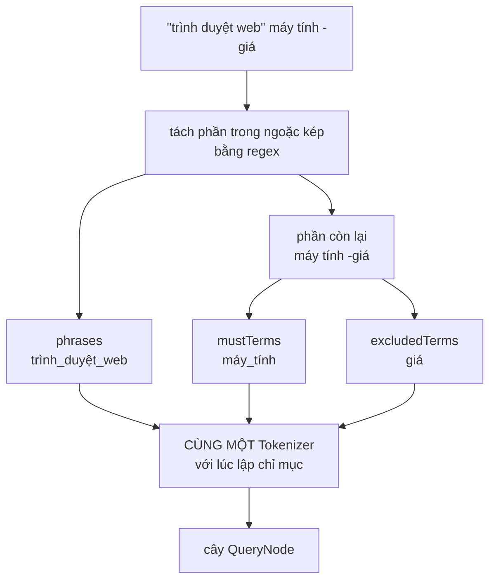
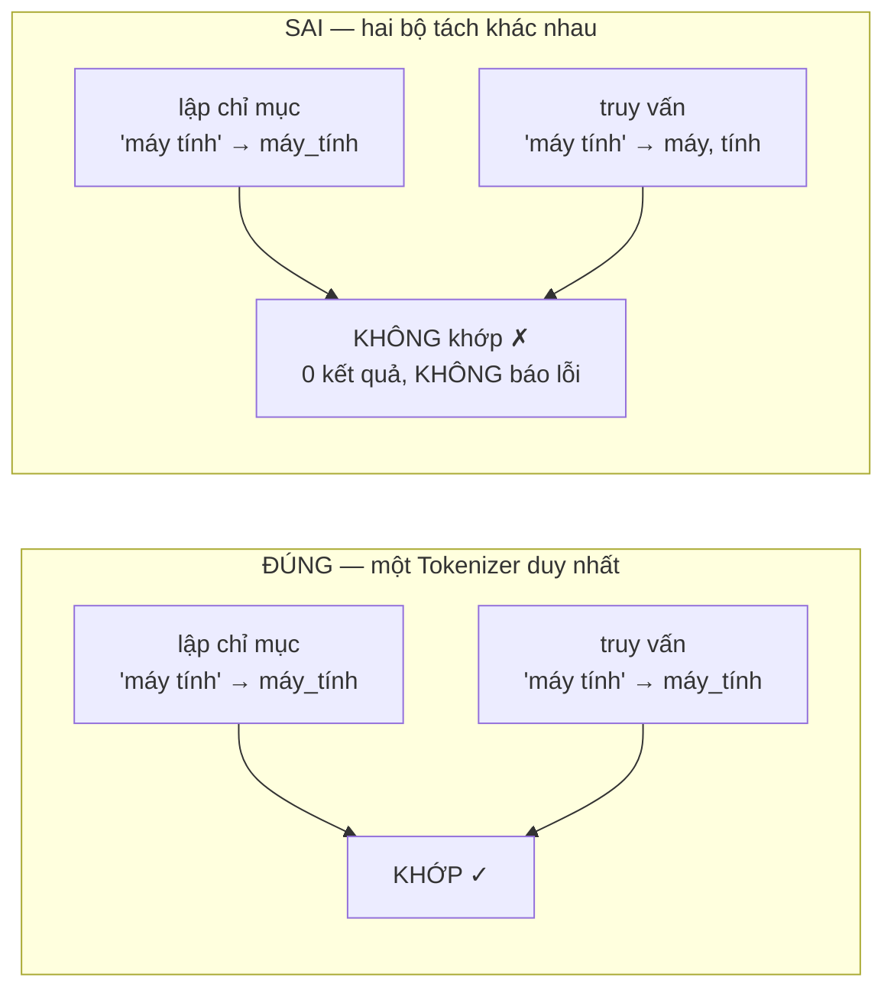

# QueryParser — tách truy vấn và bất biến "cùng một tokenizer"

**File nguồn:** `search-engine/src/main/java/com/vnsearch/query/QueryParser.java`
**Việc nó làm:** Biến chuỗi người dùng gõ thành ba thành phần có cấu trúc mà tầng dưới hiểu được.

> 📖 Chưa quen ký hiệu toán? Đọc [00 — Từ điển ký hiệu toán](../00-KY-HIEU-TOAN.md) trước.


> ### 🔄 Đã cập nhật sau đợt tái cấu trúc
>
> Phần **toán học và thuật toán** dưới đây vẫn đúng nguyên vẹn. Nhưng một số
> đoạn mã trích dẫn và mục *"Hạn chế đã biết"* mô tả **phiên bản trước**.
> Những gì đã thay đổi ở file này:
>
> - Đã hỗ trợ **toán tử `OR`** (`laptop OR máy tính`) và **`site:`** (`công nghệ site:vnexpress.net`).
> - `ParsedQuery` có thêm `orGroups` và `siteFilter`; constructor 3 tham số cũ vẫn dùng được.
> - Đã thêm `buildAst()` dựng **cây biểu thức** (Composite) — mục §5 nói cấu trúc phẳng "chưa hỗ trợ OR" nay đã lỗi thời.
> - Nhận `Tokenizer` (interface) thay vì lớp cụ thể.
>

---

## 📌 Hiểu trong 30 giây

Truy vấn `"trình duyệt web" máy tính -giá` chứa **ba loại thành phần** khác nhau, phải tách ra trước khi làm gì tiếp:

| Thành phần | Giá trị | Ý nghĩa |
|---|---|---|
| `phrases` | `[[trình_duyệt_web]]` | Phải xuất hiện **liên tiếp** đúng thứ tự |
| `mustTerms` | `[máy_tính]` | Phải có (AND ngầm định) |
| `excludedTerms` | `[giá]` | Tài liệu chứa từ này bị loại |



```
   "trình duyệt web"   máy tính   -giá
    └──────┬───────┘   └───┬──┘    └┬─┘
        phrases       mustTerms  excludedTerms
    liên tiếp đúng     AND ngầm    loại bỏ
      thứ tự             định
```

Nhưng phần quan trọng nhất của lớp này không phải việc tách. Đó là một **bất biến một dòng** mà nếu vi phạm, hệ thống trả kết quả rỗng một cách hoàn toàn im lặng.



Không có ngoại lệ nào được ném, không có log nào. Chỉ là **mọi truy vấn đều
trả về rỗng** — và người ta sẽ đi tìm lỗi ở chỉ mục, ở scorer, ở mọi nơi trừ
chỗ thật sự hỏng.

---

## 1. Bất biến quyết định: phải dùng CHÍNH tokenizer đã dùng lúc index

```java
public QueryParser(Tokenizer tokenizer) {
    this.tokenizer = tokenizer;
}
```

**Vì sao đây là điều quan trọng nhất của lớp.**

Lúc index, `máy tính` được ghép thành token `máy_tính` (xem [VietnameseTokenizer §2](../03-index/VietnameseTokenizer.md)). Khoá trong `HashMap` chỉ mục là chuỗi `"máy_tính"`.

Nếu lúc truy vấn ta tách khác đi và cho ra hai token `máy` + `tính`, thì:

```
index chứa khoá:  "máy_tính"
query tìm khoá:   "máy", "tính"
→ getPostings("máy")  = []     ← df = 0
→ CandidateResolver thoát sớm, trả về rỗng
```

**Kết quả rỗng. Không có ngoại lệ. Không có log. Không có gì cả.**

Đây là loại lỗi tệ nhất trong hệ thống phần mềm: nó **không** làm chương trình sập, nó chỉ làm chương trình **sai** — và người phát triển sẽ đi tìm bug ở tầng xếp hạng, ở tầng chỉ mục, ở crawler, trước khi nghĩ tới tokenizer.

**Phát biểu chính xác bất biến:**

> Gọi $T_{\text{index}}$ là tokenizer dùng lúc lập chỉ mục và $T_{\text{query}}$ là tokenizer dùng lúc truy vấn. Hệ thống chỉ đúng khi:
>
> $$T_{\text{index}} = T_{\text{query}} \quad \text{(cùng thuật toán VÀ cùng từ điển)}$$

Chú ý vế "cùng từ điển": hai instance `VietnameseTokenizer` khác nhau nhưng nạp cùng tệp resource thì vẫn thoả. Nhưng nếu ai đó sửa `vietnamese-bigrams.txt` mà **không index lại**, bất biến bị phá vỡ ngay — chỉ mục cũ dùng từ điển cũ, truy vấn mới dùng từ điển mới.

**Cách dự án giữ bất biến này:**

```java
// SearchEngineFacade
private final Tokenizer tokenizer;   // tiem qua constructor
private final QueryParser queryParser = new QueryParser(tokenizer);   // ← truyền vào, dùng chung
```

Constructor tiêm phụ thuộc là cách đúng. Nhưng lớp cũng có constructor tiện lợi:

```java
public QueryParser() {
    this(new VietnameseTokenizer());     // ← tạo instance MỚI
}
```

`EvaluationHarness` dùng constructor này (`this.queryParser = new QueryParser();`). Ở đây không sai vì cả hai instance nạp cùng tệp resource — nhưng nó là một **cánh cửa mở** cho lỗi: chỉ cần một ngày nào đó tokenizer nhận tham số cấu hình, hai instance sẽ khác nhau và bất biến vỡ mà không ai nhận ra.

---

## 2. Tách cụm từ bằng regex — chi tiết giữ phần ngoài ngoặc

```java
private static final Pattern PHRASE_PATTERN = Pattern.compile("\"([^\"]*)\"");
...
Matcher matcher = PHRASE_PATTERN.matcher(rawQuery);
StringBuilder remaining = new StringBuilder();
int lastEnd = 0;
while (matcher.find()) {
    remaining.append(rawQuery, lastEnd, matcher.start());   // giữ phần NGOÀI ngoặc kép
    if (!matcher.group(1).isBlank()) {
        phrasesRaw.add(matcher.group(1));
    }
    lastEnd = matcher.end();
}
remaining.append(rawQuery.substring(lastEnd));
```

**Biểu thức `"([^\"]*)"` đọc thế nào:**

| Phần | Nghĩa |
|---|---|
| `"` | Một dấu nháy kép |
| `(` … `)` | Nhóm bắt — nội dung sẽ lấy ra bằng `group(1)` |
| `[^\"]*` | **Không** phải dấu nháy, lặp 0 lần trở lên |
| `"` | Dấu nháy đóng |

**Vì sao `[^"]*` chứ không phải `.*`:** `.*` là **tham lam** — với `"a" và "b"` nó sẽ khớp toàn bộ `a" và "b` thành **một** cụm. `[^"]*` không thể vượt qua dấu nháy nên tự nhiên dừng đúng chỗ.

**Cơ chế "ghép phần còn lại" là phần đáng học:**

```
rawQuery = ' "trình duyệt web" máy tính -giá '
             ↑                ↑
          start=1          end=18

lastEnd=0 → append(rawQuery, 0, 1)   = " "           (phần trước ngoặc)
          → phrasesRaw += "trình duyệt web"
          → lastEnd = 18
hết vòng → append(rawQuery.substring(18)) = " máy tính -giá"

remaining = "  máy tính -giá"
```

Nghĩa là các cụm trong ngoặc bị **cắt ra khỏi** chuỗi, và `remaining` chứa mọi thứ còn lại. Không có bước này, `trình`, `duyệt`, `web` sẽ **vừa** là phrase **vừa** là mustTerm — bị đếm hai lần trong `queryTermFrequency` và làm sai trọng số truy vấn.

---

## 3. Tách toán tử loại trừ

```java
for (String word : remaining.toString().trim().split("\\s+")) {
    if (word.isEmpty()) continue;
    if (word.startsWith("-") && word.length() > 1) {
        excludedRaw.add(word.substring(1));
    } else if (!word.equals("-")) {
        mustRaw.add(word);
    }
}
```

Ba nhánh, mỗi nhánh xử lý một điều kiện biên:

| Đầu vào | Nhánh | Kết quả |
|---|---|---|
| `giá` | else | mustTerm |
| `-giá` | if | excludedTerm `giá` |
| `-` (một mình) | else-if loại | **bỏ qua** |
| `""` | continue | bỏ qua |

Điều kiện `word.length() > 1` và `!word.equals("-")` cùng xử lý trường hợp người dùng gõ một dấu gạch ngang lơ lửng. Không có chúng, `word.substring(1)` cho chuỗi rỗng và ta thêm một `excludedTerm` rỗng vào danh sách — vô hại nhưng bẩn.

---

## 4. Ba lần tokenize riêng biệt

```java
List<String> mustTerms = tokenizeToTerms(String.join(" ", mustRaw));
List<String> excludedTerms = tokenizeToTerms(String.join(" ", excludedRaw));
List<List<String>> phrases = new ArrayList<>();
for (String phraseRaw : phrasesRaw) {
    List<String> phraseTerms = tokenizeToTerms(phraseRaw);
    if (!phraseTerms.isEmpty()) {
        phrases.add(phraseTerms);
    }
}
```

**Vì sao mỗi cụm được tokenize RIÊNG** thay vì nối tất cả rồi tokenize một lần: vì phép ghép từ hoạt động trên **ngữ cảnh liền kề**. Nối `"trình duyệt web"` với `"máy tính"` thành một chuỗi có thể khiến `web máy` bị ghép nhầm nếu cụm đó có trong từ điển.

**Vì sao `mustRaw` được nối rồi tokenize một lần:** ngược lại, ở đây ta **muốn** ngữ cảnh. Người gõ `máy tính` (không ngoặc kép) vẫn phải được ghép thành `máy_tính` — tokenize từng tiếng riêng sẽ mất hoàn toàn khả năng ghép từ.

Đây là một sự bất đối xứng có chủ ý và đúng: **trong ngoặc kép = một đơn vị độc lập; ngoài ngoặc kép = một dòng văn bản liên tục.**

---

## 5. `ParsedQuery` — cấu trúc phẳng và giới hạn của nó

**Bản cũ — ba danh sách phẳng:**

```java
public record ParsedQuery(List<String> mustTerms, List<List<String>> phrases, List<String> excludedTerms) {
}
```

**Bản hiện tại — năm trường, kèm constructor rút gọn giữ tương thích ngược:**

```java
public record ParsedQuery(List<String> mustTerms, List<List<String>> phrases,
                          List<String> excludedTerms, List<List<String>> orGroups,
                          String siteFilter) {

    /** Constructor rút gọn giữ tương thích với mã cũ (không OR, không site:). */
    public ParsedQuery(List<String> mustTerms, List<List<String>> phrases, List<String> excludedTerms) {
        this(mustTerms, phrases, excludedTerms, List.of(), null);
    }

    public boolean isEmpty() {
        return mustTerms.isEmpty() && phrases.isEmpty() && orGroups.isEmpty();
    }
}
```

Nhưng ngay cả năm trường phẳng vẫn **cứng**: chúng mã hoá sẵn giả định *"mọi `mustTerm` nối với nhau bằng AND, mọi `orGroup` là một tầng OR duy nhất"*.

**Không biểu diễn được:**

- `(máy tính OR laptop) AND giá rẻ`
- `NOT (quảng cáo OR khuyến mãi)`
- Lồng nhau bất kỳ độ sâu nào

**Cấu trúc đúng cho việc đó là một cây biểu thức** (Composite pattern):

```
        AND
       /   \
      OR   TERM(giá_rẻ)
     /  \
TERM   TERM
(máy_tính)(laptop)
```

> ✅ **Đã khắc phục.** Cấu trúc phẳng vẫn còn (làm đầu vào cho `buildAst`), nhưng truy hồi boolean nay chạy trên **cây biểu thức** `QueryNode` — biểu diễn được `(máy tính OR laptop) AND giá rẻ` và lồng nhau tuỳ ý. `ParsedQuery` cũng đã có thêm `orGroups` và `siteFilter`. Phân tích đầy đủ: [**04-COMPOSITE.md**](../09-design-patterns/04-COMPOSITE.md).

**Vai trò của hai lớp hiện nay:** `ParsedQuery` là **kết quả phân tích cú pháp** — phẳng, dễ tuần tự hoá, dễ log. `QueryNode` là **dạng thực thi được** — cây, đệ quy, biết tự tối ưu shortest-first. `buildAst(ParsedQuery)` là cầu nối giữa hai dạng:

```java
public QueryNode buildAst(ParsedQuery parsed) { ... }

/** Tiện lợi: phân tích rồi dựng cây trong một bước. */
public QueryNode buildAst(String rawQuery) {
    return buildAst(parse(rawQuery));
}
```

Tách hai dạng là lựa chọn đúng: cú pháp và ngữ nghĩa thực thi thay đổi vì những lý do khác nhau.

---

## 6. Độ phức tạp

| Bước | Thời gian |
|---|---|
| Quét regex tìm cụm | $O(L)$ — một lượt |
| Ghép `remaining` | $O(L)$ |
| `split("\\s+")` | $O(L)$ |
| Tokenize (3 lần, tổng độ dài $\le L$) | $O(L)$ |
| **Tổng** | **$O(L)$** |

với $L$ = độ dài chuỗi truy vấn (thực tế 10–50 ký tự).

Chi phí này hoàn toàn không đáng kể so với 1,59 ms trung bình mỗi truy vấn — phần lớn thời gian nằm ở giao posting list và chấm điểm.

**Regex được biên dịch một lần:**

```java
private static final Pattern PHRASE_PATTERN = Pattern.compile("\"([^\"]*)\"");
```

`static final` nghĩa là biên dịch đúng một lần khi nạp lớp. Nếu viết `rawQuery.matches("...")` hay `Pattern.compile` trong thân hàm, mỗi truy vấn sẽ biên dịch lại — biên dịch regex đắt hơn chạy nó nhiều lần.

---

## 7. Chủ đề DSA thể hiện

| Chủ đề | Ở đâu |
|---|---|
| **Phân tích cú pháp bằng regex** | tách cụm trong ngoặc kép |
| **Bất biến xuyên tầng** | cùng tokenizer lúc index và lúc query |
| **Tiêm phụ thuộc qua constructor** | `QueryParser(Tokenizer)` |
| **Bản ghi bất biến** | `record ParsedQuery` |
| **Biên dịch trước mẫu regex** | `static final Pattern` |
| **Xử lý điều kiện biên** | `-` lơ lửng, chuỗi rỗng, cụm rỗng |
| **Bất đối xứng có chủ ý** | phrase tokenize riêng, mustTerm tokenize chung |

---

## 8. Hạn chế đã biết

1. **Dấu `-` chỉ loại trừ MỘT tiếng ngay sau nó** (giống toán tử `-word` của Google). `-quảng cáo` chỉ loại trừ `quảng`, còn `cáo` vẫn là `mustTerm`. Muốn loại trừ cả cụm phải viết `-"quảng cáo"` — **chưa hỗ trợ** dấu `-` trước phrase.
2. **Không có OR.** `PostingListMerger.union` tồn tại nhưng không có đường nào gọi tới nó từ tầng truy vấn.
3. **Không có toán tử trường** (`title:máy tính`, `site:vnexpress.net`) — hai thứ rất hữu ích mà chỉ mục hiện tại chưa hỗ trợ vì mọi trường đã bị trộn vào một `combinedText`.
4. **Không có dấu ngoặc đơn / độ ưu tiên** (xem §5).
5. **Nháy kép không đóng** bị bỏ qua lặng lẽ. `"trình duyệt` (thiếu nháy đóng) không khớp regex nên toàn bộ chuỗi rơi vào `remaining` — dấu `"` sẽ bị `splitIntoSyllables` xoá thành khoảng trắng. Kết quả cuối cùng đúng ý người dùng, nhưng đó là may mắn chứ không phải thiết kế.
6. **Không có phản hồi cho người dùng.** Nếu một term bị loại vì là stopword, hoặc một cụm không tìm thấy, người dùng không được báo. Máy tìm kiếm thật hiển thị "đã bỏ qua từ X" hoặc "có phải bạn muốn tìm Y".
7. **Không giới hạn độ dài truy vấn.** Một chuỗi 1 MB sẽ được tokenize đầy đủ. Nên có chặn trên ở tầng controller.

---

## 9. Liên kết

- Tokenizer phải dùng chung: [VietnameseTokenizer.md](../03-index/VietnameseTokenizer.md)
- Người tiêu thụ `ParsedQuery`: [CandidateResolver.md](CandidateResolver.md)
- Nơi `phrases` được kiểm tra: [PostingListMerger §5](PostingListMerger.md)
- Cây biểu thức truy vấn (Composite): [04-COMPOSITE.md](../09-design-patterns/04-COMPOSITE.md)
- Ký hiệu chưa hiểu: [00 — Từ điển ký hiệu toán](../00-KY-HIEU-TOAN.md)
