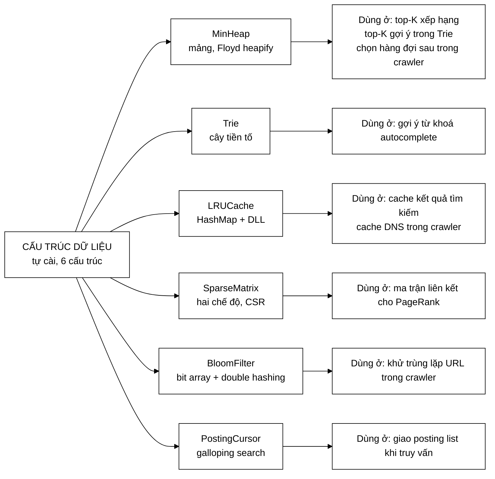
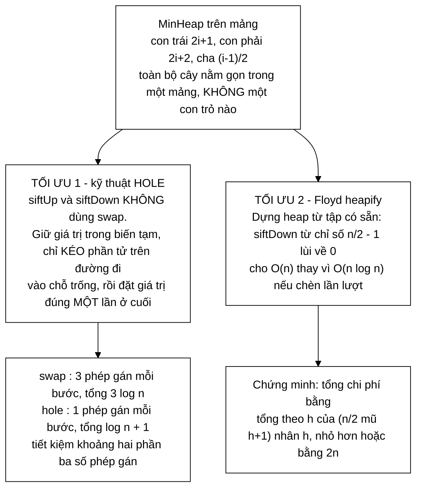
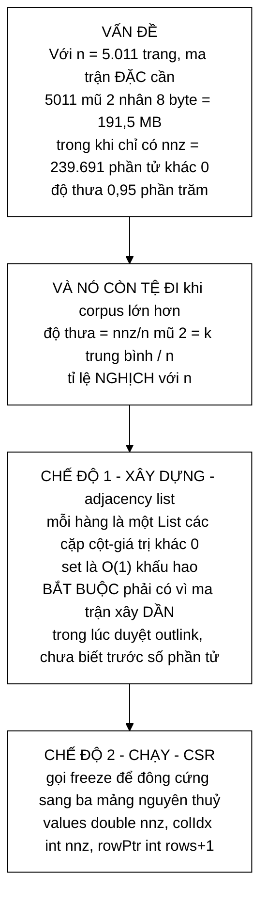

# Sơ đồ tư duy — Toàn bộ Cấu trúc dữ liệu tự cài

**Phạm vi:** **6 file** trong `com.vnsearch.datastructure`, cộng `index/ArrayPostingCursor` + `index/PostingCursor` (được phân tích ở nhóm này vì bản chất là một cấu trúc duyệt).

> **Tự kiểm chứng:**
> ```bash
> find search-engine/src/main/java/com/vnsearch/datastructure -name "*.java" | wc -l
> ```

**Trang này trả lời:** mỗi cấu trúc được dùng ở đâu trong hệ thống, **vì sao tự cài thay vì dùng thư viện có sẵn**, và cấu trúc nào được **tái sử dụng** ở nhiều nơi — đó là bằng chứng nó đủ tổng quát.

> ### Cách đọc
> - Sơ đồ vẽ bằng **Mermaid**; không hiện hình thì bấm khối *"Xem bản chữ (ASCII)"* ngay dưới.
> - Nếu bảo vệ đồ án, đọc kỹ **§3** — bảng "vì sao không dùng thư viện có sẵn" là câu hỏi hội đồng hay hỏi nhất.
>
> 📖 **Trang đi sâu:** [MinHeap](MinHeap.md) · [Trie](Trie.md) · [LRUCache](LRUCache.md) · [SparseMatrix](SparseMatrix.md) · [ArrayPostingCursor](ArrayPostingCursor.md) · [BloomFilter](../01-crawler/BloomFilter.md)

---

## 1. Bản đồ toàn cảnh — 6 cấu trúc, dùng ở đâu



<details>
<summary><b>Xem bản chữ (ASCII)</b></summary>
```
CẤU TRÚC DỮ LIỆU TỰ CÀI (6)
   │
   ├── MinHeap       ──► top-K xếp hạng · top-K gợi ý · chọn hàng đợi sau (crawler)
   ├── Trie          ──► gợi ý từ khoá (autocomplete)
   ├── LRUCache      ──► cache kết quả tìm kiếm · cache DNS (crawler)
   ├── SparseMatrix  ──► ma trận liên kết cho PageRank
   ├── BloomFilter   ──► khử trùng lặp URL (crawler)
   └── PostingCursor ──► giao posting list khi truy vấn
```

</details>

### Bảng tra nhanh

| # | Cấu trúc | Dòng | Nền tảng | Dùng ở tầng nào |
|---|---|---|---|---|
| 1 | `MinHeap` | 241 | mảng (`ArrayList`) | **ba** tầng: crawler, xếp hạng, gợi ý |
| 2 | `Trie` | 253 | `Map<Character, TrieNode>` | gợi ý từ khoá |
| 3 | `SparseMatrix` | 246 | adjacency list → CSR | PageRank |
| 4 | `BloomFilter` | 163 | `long[]` + dịch bit | crawler |
| 5 | `LRUCache` | 158 | `HashMap` + DLL tự viết | **hai** tầng: tìm kiếm, crawler |
| 6 | `ArrayPostingCursor` | 106 | chỉ số `int` trên `List` | truy vấn |
| **7** | **`SyllableTrie`** | **302** | **mảng phẳng `int[]`**, khoá là **âm tiết** chứ không phải ký tự | **bộ tách từ** |

> ⚠️ **`SyllableTrie` bị thiếu hẳn trong bản trước của bảng này**, dù nó là cấu
> trúc dữ liệu **dài nhất** trong gói (302 dòng) và là nền của bộ tách từ.
>
> Hai điểm khiến nó đáng đọc riêng, chứ không phải "một cái `Trie` thứ hai":
>
> | | `Trie` (dòng 2) | `SyllableTrie` (dòng 7) |
> |---|---|---|
> | Đơn vị khoá | **ký tự** | **âm tiết** |
> | Lưu nút | `Map<Character, TrieNode>` mỗi nút | **mảng phẳng**, không có đối tượng nút |
> | Vì sao | gợi ý từ khoá cần duyệt theo tiền tố ký tự | 185.000 từ ≈ 460.000 nút — mỗi nút một `HashMap` rỗng đã tốn ~48 byte header trước khi chứa gì |
>
> Nó còn trả lời được một câu hỏi mà `HashSet` không trả lời được: *"có còn từ
> nào dài hơn bắt đầu từ đây không?"* — `child()` trả `-1` thì **cắt nhánh ngay**,
> khỏi thử các độ dài còn lại. Chi tiết ở `SyllableTrie.java:1-40`.

---

## 2. Cấu trúc nào phục vụ tầng nào

```mermaid
%%{init:{'theme':'base','themeVariables':{'background':'#ffffff','primaryColor':'#ffffff','primaryTextColor':'#000000','primaryBorderColor':'#000000','secondaryColor':'#ffffff','secondaryTextColor':'#000000','secondaryBorderColor':'#000000','tertiaryColor':'#ffffff','tertiaryTextColor':'#000000','tertiaryBorderColor':'#000000','lineColor':'#000000','textColor':'#000000','mainBkg':'#ffffff','nodeBorder':'#000000','clusterBkg':'#ffffff','clusterBorder':'#000000','edgeLabelBackground':'#ffffff','actorBkg':'#ffffff','actorBorder':'#000000','actorTextColor':'#000000','actorLineColor':'#000000','signalColor':'#000000','signalTextColor':'#000000','labelBoxBkgColor':'#ffffff','labelBoxBorderColor':'#000000','labelTextColor':'#000000','loopTextColor':'#000000','noteBkgColor':'#ffffff','noteBorderColor':'#000000','noteTextColor':'#000000','sequenceNumberColor':'#ffffff','fontFamily':'ui-monospace, SFMono-Regular, Consolas, monospace'}}}%%
flowchart TD
    CR["TẦNG CRAWLER"]
    IX["TẦNG CHỈ MỤC"]
    QR["TẦNG TRUY VẤN"]
    RK["TẦNG XẾP HẠNG"]
    SV["TẦNG PHỤC VỤ"]

    BF["BloomFilter<br/>UrlSeenFilter dùng"]
    MH["MinHeap"]
    LRU["LRUCache"]
    CUR["PostingCursor"]
    SM["SparseMatrix"]
    TR["Trie"]

    CR --> BF
    CR --> MH
    CR --> LRU
    QR --> CUR
    RK --> MH
    RK --> SM
    SV --> LRU
    SV --> TR
    SV --> MH
```



<details>
<summary><b>Xem bản chữ (ASCII)</b></summary>
```
TẦNG CRAWLER   ──► BloomFilter (UrlSeenFilter)
               ──► MinHeap     (BackQueues chọn hàng đợi khả dụng sớm nhất)
               ──► LRUCache    (DnsResolver)

TẦNG TRUY VẤN  ──► PostingCursor (giao posting list bằng galloping)

TẦNG XẾP HẠNG  ──► MinHeap      (top-K, không sort toàn bộ)
               ──► SparseMatrix (ma trận liên kết PageRank)

TẦNG PHỤC VỤ   ──► LRUCache     (cache kết quả tìm kiếm)
               ──► Trie         (gợi ý từ khoá)
               ──► MinHeap      (top-k gợi ý theo tần suất)
```

</details>

> **Hai cấu trúc được tái sử dụng ở nhiều tầng — đây là điểm đáng nói khi bảo vệ:**
>
> - **`MinHeap`** dùng ở **ba** chỗ hoàn toàn khác nhau: chọn hàng đợi sau khả dụng sớm nhất (crawler), lấy top-K kết quả (xếp hạng), lấy top-k gợi ý theo tần suất (Trie).
> - **`LRUCache`** vốn viết cho cache kết quả tìm kiếm, nay dùng lại làm **cache DNS** trong crawler — một mục đích hoàn toàn khác.
>
> Tái sử dụng được ở nhiều ngữ cảnh là bằng chứng cấu trúc đủ **tổng quát**, chứ không phải viết riêng cho một chỗ.

---

## 3. Vì sao TỰ CÀI thay vì dùng thư viện có sẵn

Đây là câu hỏi hội đồng hay hỏi nhất. Mỗi cấu trúc có một lý do **cụ thể**, không phải "để cho biết":

| Cấu trúc | Thư viện có sẵn | Vì sao vẫn tự cài |
|---|---|---|
| `MinHeap` | `java.util.PriorityQueue` | Cần `topK` **streaming** và `Comparator` truy cập mảng ngoài (`BackQueues` so theo `availableAt[i]`). Bản tự cài dùng đúng kỹ thuật "hole" của JDK, cộng **Floyd heapify** O(n) |
| `LRUCache` | `java.util.LinkedHashMap` | Để **chứng minh hiểu rõ cơ chế O(1)** bên dưới: `HashMap` tra cứu + danh sách liên kết đôi cập nhật recency |
| `BloomFilter` | `java.util.BitSet` / Guava | Tự quản lý bit bằng `long[]` và dịch bit để **thể hiện rõ cơ chế lưu trữ bit** |
| `Trie` | — (không có sẵn trong JDK) | Không có lựa chọn nào khác trong thư viện chuẩn |
| `SparseMatrix` | thư viện đại số tuyến tính | Đề bài yêu cầu tự cài; và **hai chế độ lưu trữ** (dựng linh hoạt → đông cứng CSR) là quyết định thiết kế riêng cho bài toán này |
| `PostingCursor` | `Iterator` của JDK | `Iterator` **không có `skipTo`** — mà nhảy cóc mới là điểm mấu chốt |

---

## 4. Đi sâu từng cấu trúc

### 4.1 `MinHeap` — hai tối ưu đáng học



<details>
<summary><b>Xem bản chữ (ASCII)</b></summary>
```
MinHeap trên mảng:  con trái = 2i+1 · con phải = 2i+2 · cha = (i−1)/2
                    → toàn bộ cây nằm trong một mảng, KHÔNG một con trỏ nào

TỐI ƯU 1 — kỹ thuật "hole" (không dùng swap)
     swap  : 3 phép gán mỗi bước  →  3·log n
     hole  : 1 phép gán mỗi bước  →  log n + 1      (tiết kiệm ~2/3)
     Đây cũng là kỹ thuật java.util.PriorityQueue dùng.

TỐI ƯU 2 — Floyd heapify (dựng heap từ tập có sẵn)
     siftDown từ n/2−1 lùi về 0   →  O(n)   thay vì  O(n log n)
     Chứng minh: Σ_{h} (n/2^{h+1})·h  ≤  2n
```

</details>

**Ứng dụng quan trọng nhất — top-K streaming:** giữ heap kích thước đúng `k`, duyệt `n` phần tử, mỗi phần tử so với đỉnh heap. Chi phí `O(n log k)` thay vì `O(n log n)` của sort toàn bộ. Với `n = 500` ứng viên và `k = 10`, đó là khác biệt lớn.

### 4.2 `LRUCache` — vì sao phải danh sách liên kết ĐÔI
```
       head (sentinel)                                   tail (sentinel)
            │                                                  │
            ▼                                                  ▼
      ┌───┐   ┌─────┐   ┌─────┐   ┌─────┐   ┌─────┐   ┌───┐
      │ H │◄─►│ MRU │◄─►│  …  │◄─►│  …  │◄─►│ LRU │◄─►│ T │
      └───┘   └─────┘   └─────┘   └─────┘   └─────┘   └───┘
              dùng gần                       ít dùng nhất
              đây nhất                       → bị loại đầu tiên

      HashMap<K, Node>  ──► tra cứu O(1) tới bất kỳ node nào
```

**Vì sao ĐÔI, không phải ĐƠN:** xoá một node ở **giữa** trong O(1) đòi hỏi biết **cả** node trước và node sau. Danh sách đơn phải duyệt từ đầu để tìm node trước → **O(n)**, và khi đó cache LRU **mất hoàn toàn ưu điểm** vì mỗi lần truy cập đều thành O(n).

**Hai node lính canh (sentinel):** không chứa dữ liệu thật, chỉ đánh dấu hai đầu. Nhờ vậy mọi thao tác thêm/xoá node **đầu tiên hoặc cuối cùng** không cần kiểm tra `null` riêng — **xoá hẳn** một loạt nhánh `if`.

> Cùng ý tưởng sentinel với phần tử canh biên `offsets[count+1]` của [`CompressedPostings`](../02-index/CompressedPostings.md).

**Điểm tinh tế về đồng thời:** `get()` **về bản chất KHÔNG phải thao tác đọc thuần tuý** — nó **di chuyển node lên đầu** (cập nhật recency). Nên phải dùng **write lock** giống `put()`. Nếu dùng read lock, nhiều luồng đọc đồng thời sẽ cùng sửa danh sách liên kết và **làm hỏng cấu trúc**. Đây là điểm khác biệt so với `Trie`, nơi `getSuggestions` là đọc thuần tuý.

### 4.3 `SparseMatrix` — hai chế độ lưu trữ



<details>
<summary><b>Xem bản chữ (ASCII)</b></summary>
```
VẤN ĐỀ: ma trận ĐẶC cho 5.011 trang = 5011² × 8 B = 191,5 MB
        thực tế chỉ có nnz = 239.691 phần tử khác 0  (độ thưa 0,95 %)
        và độ thưa = nnz/n² = k̄/n  → càng TỆ khi n càng lớn

CHẾ ĐỘ 1 — XÂY DỰNG (adjacency list)
    mỗi hàng = List<Entry(cột, giá trị)>     set() O(1) khấu hao
    BẮT BUỘC: ma trận được xây DẦN khi duyệt outlink, chưa biết trước số phần tử

CHẾ ĐỘ 2 — CHẠY (CSR — Compressed Sparse Row), sau khi gọi freeze()
    values[]  double[nnz]     giá trị khác 0, xếp theo hàng
    colIdx[]  int[nnz]        chỉ số cột tương ứng
    rowPtr[]  int[rows+1]     rowPtr[i] = chỉ số bắt đầu của hàng i
```

</details>

> **Kỹ thuật `rowPtr` này xuất hiện LẦN THỨ HAI trong đồ án** — ở [`CompressedPostings`](../02-index/CompressedPostings.md), mảng `offsets` dùng đúng ý tưởng tổng tích luỹ để nén posting list. Cùng một ý tưởng ở hai chỗ hoàn toàn không liên quan là dấu hiệu nó là **kỹ thuật nền tảng**, không phải thủ thuật riêng lẻ.

### 4.4 `BloomFilter` — chiều sai của cấu trúc
```
   m = ceil(−n · ln(p) / (ln 2)²)      số bit
   k = round((m / n) · ln 2)            số hàm băm

   Double hashing (Kirsch & Mitzenmacher 2008):
        hᵢ(x) = h₁(x) + i · h₂(x)  (mod m),   i = 0..k−1
   → chỉ tính THẬT 2 hàm băm, k−2 hàm còn lại là tổ hợp tuyến tính
```

**Chiều sai quan trọng — phải nói đúng:**

| | Có xảy ra không? | Vì sao |
|---|---|---|
| **False positive** — báo "có thể có" nhưng chưa từng add | **CÓ** | nhiều chuỗi khác nhau có thể cùng bật trúng một tập bit |
| **False negative** — đã add mà báo "chưa có" | **KHÔNG BAO GIỜ** | `add` chỉ **BẬT** bit (phép OR), không bao giờ **TẮT** bit |

> Nhưng tính chất "không bao giờ false negative" chỉ đúng **khi dùng một luồng**. Đó chính là lý do `UrlSeenFilter` phải bọc `synchronized` — xem [sơ đồ tư duy tầng crawler §6.2](../01-crawler/00-SO-DO-TU-DUY.md).

### 4.5 `Trie` — gợi ý từ khoá
```
   Cấu trúc mỗi node:  Map<Character, TrieNode> children
                       boolean isEndOfWord
                       int     frequency        ← để xếp hạng gợi ý

   Chuỗi đầu vào được chuẩn hoá Unicode NFC trước khi xử lý,
   để tiếng Việt có dấu (gõ tổ hợp hay dựng sẵn) đều về CÙNG một chuỗi ký tự
   → tránh tạo 2 nhánh khác nhau cho cùng một từ.
```

| Thao tác | Độ phức tạp |
|---|---|
| `insert` / `search` | **O(L)** — L = độ dài chuỗi |
| `getSuggestions(prefix, k)` | **O(L + m log k)** — L để tìm node của prefix, DFS thu thập `m` từ, rồi `MinHeap.topK` |

**Điểm mấu chốt:** `O(L)` **không phụ thuộc M** (tổng số từ trong cây). Tra một tiền tố trong từ điển 1 triệu từ cũng nhanh như trong từ điển 100 từ.

### 4.6 `ArrayPostingCursor` — galloping search

Xem chi tiết ở [sơ đồ tư duy tầng chỉ mục §9](../02-index/00-SO-DO-TU-DUY.md). Tóm tắt:
```
   Pha 1 — nhảy theo cấp số nhân 1, 2, 4, 8, … cho tới khi vượt qua mục tiêu
   Pha 2 — binary search trong đoạn vừa khoanh được

   Tổng: O(log d)  với d = KHOẢNG CÁCH THẬT phải nhảy
         → KHÔNG phụ thuộc kích thước posting list (n)
```

---

## 5. Bảng độ phức tạp tổng hợp

| Cấu trúc | Thao tác chính | Thời gian | Bộ nhớ |
|---|---|---|---|
| `MinHeap` | `insert` / `extractMin` | **O(log n)** | O(n) |
| | `MinHeap(Collection)` — Floyd heapify | **O(n)** | |
| | `topK` streaming | **O(n log k)** | O(k) |
| `Trie` | `insert` / `search` | **O(L)** | O(tổng ký tự) |
| | `getSuggestions` | **O(L + m log k)** | |
| `LRUCache` | `get` / `put` | **O(1)** | O(dung lượng) |
| `SparseMatrix` | `set` (chế độ xây) | **O(1)** khấu hao | O(nnz) |
| | `multiply` (chế độ CSR) | **O(nnz)** | |
| `BloomFilter` | `add` / `mightContain` | **O(k)** | O(m) bit |
| `PostingCursor` | `next` | **O(1)** | O(1) |
| | `skipTo` | **O(log d)** | |

---

## 6. Xoá một cấu trúc thì hỏng cái gì?

| Cấu trúc | Nếu không có | Hậu quả |
|---|---|---|
| `MinHeap` | sort toàn bộ | Xếp hạng: `O(c log c)` thay vì `O(c log K)`. Crawler: quét **mọi** host mỗi lần lấy URL thay vì O(log n) |
| `Trie` | quét tuyến tính từ điển | Gợi ý thành `O(M)` với M = tổng số từ, thay vì `O(L)` |
| `LRUCache` | không cache | Crawler: mỗi URL một truy vấn DNS. Tìm kiếm: mọi truy vấn lặp lại đều tính lại từ đầu |
| `SparseMatrix` | `double[n][n]` | **191,5 MB** thay vì vài MB — và tệ đi theo `n²` |
| `BloomFilter` | `HashSet<String>` | ~108 MB thay vì 1,1 MB cho cùng số URL |
| `PostingCursor` | `List<Integer>` vật chất hoá | 64 KB rác GC mỗi lần giao, và **mất hẳn** khả năng nhảy cóc |

---

## 7. Đọc tiếp

| Muốn hiểu | Đọc |
|---|---|
| Chứng minh công thức chỉ số heap, top-K streaming | [MinHeap.md](MinHeap.md) |
| O(L) không phụ thuộc M, tách khoá tra cứu khỏi chuỗi hiển thị | [Trie.md](Trie.md) |
| Sentinel xoá mọi nhánh `if`, vì sao `get` phải khoá **ghi** | [LRUCache.md](LRUCache.md) |
| Suy dẫn độ thưa `ρ = k̄/N`, 191,5 MB → 3,7 MB | [SparseMatrix.md](SparseMatrix.md) |
| Suy dẫn `p ≈ (1−e^{−kn/m})^k`, tối ưu `k*` bằng đạo hàm | [BloomFilter.md](../01-crawler/BloomFilter.md) |
| Chứng minh `O(m log(n/m))` bằng bất đẳng thức Jensen | [ArrayPostingCursor.md](ArrayPostingCursor.md) |
| Các cấu trúc này được dùng ở đâu | [Crawler](../01-crawler/00-SO-DO-TU-DUY.md) · [Chỉ mục](../02-index/00-SO-DO-TU-DUY.md) · [Truy vấn](../03-query/00-SO-DO-TU-DUY.md) · [Xếp hạng](../04-ranking/00-SO-DO-TU-DUY.md) |
