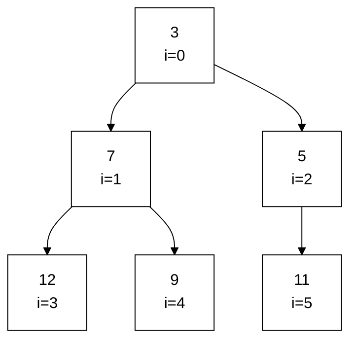
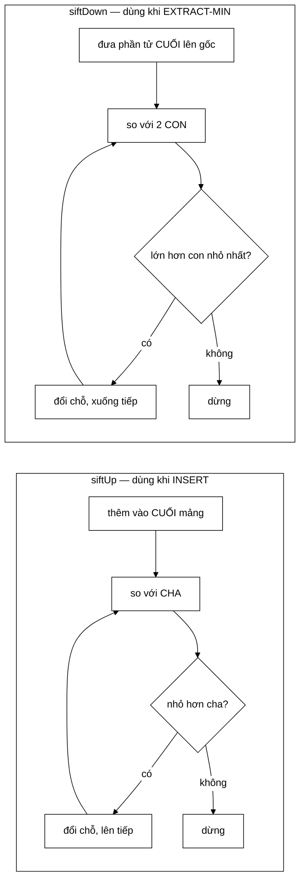

# MinHeap — cây nhị phân hoàn chỉnh trải phẳng và thuật toán top-K

**File nguồn:** `search-engine/src/main/java/com/vnsearch/datastructure/MinHeap.java`
**Việc nó làm:** Trả về phần tử nhỏ nhất trong $O(\log n)$, và lấy top-$K$ từ $n$ phần tử trong $O(n\log K)$.

> 📖 Chưa quen ký hiệu toán? Đọc [00 — Từ điển ký hiệu toán](../00-KY-HIEU-TOAN.md) trước.


> ### 🔄 Đã cập nhật sau đợt tái cấu trúc
>
> Phần **toán học và thuật toán** dưới đây vẫn đúng nguyên vẹn. Nhưng một số
> đoạn mã trích dẫn và mục *"Hạn chế đã biết"* mô tả **phiên bản trước**.
> Những gì đã thay đổi ở file này:
>
> - Đã cài **tối ưu "hole"** — `siftUp`/`siftDown` không còn dùng `swap` (3 gán/bước → 1 gán/bước).
> - Đã thêm **Floyd heapify $O(n)$** qua constructor `MinHeap(Collection, Comparator)`.
> - `topK` gom $k$ phần tử đầu rồi heapify một lần: $O(k)$ thay vì $O(k\log k)$.
>

---

## 📌 Hiểu trong 30 giây

Hai nơi trong dự án cần trả lời câu hỏi *"phần tử tốt nhất là cái nào?"* **liên tục**, trên một tập **thay đổi**:

- **Crawler**: URL nào nên fetch tiếp theo? (`UrlFrontier`)
- **Xếp hạng**: 10 tài liệu điểm cao nhất trong 500 ứng viên? (`ResultRanker`)

Hai cách ngây thơ đều tệ:

| Cách | Thêm | Lấy min |
|---|---|---|
| Mảng chưa sắp | $O(1)$ | $\mathbf{O(n)}$ — phải quét |
| Mảng đã sắp | $\mathbf{O(n)}$ — phải chèn đúng chỗ | $O(1)$ |

**Heap** là thoả hiệp thông minh: **cả hai việc đều $O(\log n)$**.

Bí quyết: nó **không** giữ mảng sắp hoàn toàn, chỉ giữ một điều kiện yếu hơn — *mọi node phải nhỏ hơn hai con của nó*. Điều kiện yếu này đủ để đảm bảo **gốc luôn là nhỏ nhất**, mà lại rẻ để duy trì.

Và mẹo cài đặt hay nhất: heap là một **cây**, nhưng được lưu trong **mảng phẳng** không cần con trỏ nào — quan hệ cha/con chỉ là phép tính chỉ số.



Cùng một heap đó, nhìn ở dạng mảng — **không có con trỏ nào tồn tại**:

```
   chỉ số :   0    1    2    3    4    5
            ┌────┬────┬────┬────┬────┬────┐
   mảng   : │  3 │  7 │  5 │ 12 │  9 │ 11 │
            └────┴────┴────┴────┴────┴────┘
              │    │    │
              │    │    └── con của i=2 là 5,6
              │    └─────── con của i=1 là 3,4
              └──────────── gốc, LUÔN là nhỏ nhất

   cha(i) = (i-1)/2      con trái(i) = 2i+1      con phải(i) = 2i+2
```

**Hai đường đi duy nhất trong heap** — mọi thao tác đều là một trong hai:



Cả hai đều đi **dọc theo một đường từ gốc xuống lá**, mà cây nhị phân hoàn chỉnh
$n$ node thì cao $\lfloor \log_2 n \rfloor$ — đó chính là chỗ $O(\log n)$ đến từ.

---

## 1. Cây nhị phân hoàn chỉnh trải phẳng

**Cây nhị phân hoàn chỉnh** (complete binary tree) là cây mà mọi tầng đều đầy, trừ tầng cuối dồn về trái. Tính chất này cho phép **trải phẳng ra mảng** — không có node, không có con trỏ:

$$\text{cha}(i) = \left\lfloor \frac{i-1}{2} \right\rfloor, \qquad \text{con trái}(i) = 2i+1, \qquad \text{con phải}(i) = 2i+2$$

```
            0                     mảng: [0][1][2][3][4][5][6]
          /   \
         1     2
        / \   / \
       3   4 5   6
```

Kiểm tra nhanh: con trái của node 1 là $2(1)+1 = 3$ ✓; cha của node 6 là $\lfloor 5/2\rfloor = 2$ ✓.

```java
private void siftUp(int i) {
    while (i > 0) {
        int parent = (i - 1) / 2;          // ← công thức cha
        ...
    }
}

private void siftDown(int i) {
    int left = 2 * i + 1;                  // ← công thức con
    int right = 2 * i + 2;
    ...
}
```

### 1.1 Chứng minh công thức chỉ số

**Định lý.** Với cách đánh số theo thứ tự tầng bắt đầu từ 0, node $i$ có con trái ở $2i+1$.

**Chứng minh.** Xét node $i$ ở tầng $\ell$ (tầng 0 là gốc). Số node ở các tầng $0..\ell-1$ là:

$$\sum_{j=0}^{\ell-1} 2^j = 2^\ell - 1$$

Vậy node $i$ là node thứ $k = i - (2^\ell - 1)$ (đếm từ 0) trong tầng $\ell$.

Tầng $\ell+1$ bắt đầu ở chỉ số $2^{\ell+1}-1$. Node thứ $k$ của tầng $\ell$ có hai con là node thứ $2k$ và $2k+1$ của tầng $\ell+1$. Vậy con trái ở chỉ số:

$$(2^{\ell+1}-1) + 2k = 2^{\ell+1} - 1 + 2\bigl(i - 2^\ell + 1\bigr) = 2^{\ell+1} - 1 + 2i - 2^{\ell+1} + 2 = 2i+1 \qquad \blacksquare$$

### 1.2 Vì sao trải phẳng ra mảng

| | Cây có con trỏ | **Mảng** |
|---|---|---|
| Bộ nhớ mỗi node | dữ liệu + 2–3 tham chiếu (16–24 B) | **chỉ dữ liệu** |
| Cục bộ cache | node rải rác khắp heap | **liền kề trong RAM** |
| Tìm cha/con | dereference con trỏ (~100 chu kỳ nếu cache miss) | **1 phép tính số nguyên** |

Với `MinHeap<T>` dùng `ArrayList<T>`, các **tham chiếu** nằm liền kề (dù object thì không). Điều này vẫn cho lợi ích cache đáng kể so với cây có con trỏ.

### 1.3 Chiều cao cây — nguồn gốc của $O(\log n)$

Cây nhị phân hoàn chỉnh với $n$ node có chiều cao:

$$h = \lfloor \log_2 n \rfloor$$

| $n$ | $h$ | Số bước tối đa |
|---|---|---|
| 15 | 3 | 3 |
| 1 000 | 9 | 9 |
| **500 000** (frontier đầy) | **18** | **18** |
| 1 000 000 | 19 | 19 |

Nửa triệu URL trong frontier mà mỗi thao tác chỉ 18 bước — đó là sức mạnh của $\log$.

---

## 2. Tính chất MIN-HEAP

$$\text{cmp}\bigl(\text{heap}[\text{cha}(i)],\ \text{heap}[i]\bigr) \le 0 \qquad \forall i > 0$$

**Đọc thành lời:** *"Mọi node có độ ưu tiên nhỏ hơn hoặc bằng cả hai con của nó."*

⇒ Gốc (chỉ số 0) **luôn là phần tử nhỏ nhất** — lấy ra trong $O(1)$.

> ⚠️ **Chú ý: heap KHÔNG phải mảng đã sắp xếp.** Node 3 có thể lớn hơn node 2 — heap không quan tâm. Nó chỉ đảm bảo quan hệ **dọc** (cha–con), không đảm bảo quan hệ **ngang**. Chính sự "lỏng lẻo" này làm heap rẻ: duy trì thứ tự toàn phần tốn $O(n\log n)$, duy trì thứ tự bộ phận chỉ tốn $O(\log n)$ mỗi thao tác.

**Comparator tuỳ ý** làm heap tổng quát:

```java
private final Comparator<T> comparator;

public MinHeap(Comparator<T> comparator) {
    this.comparator = comparator;
}
```

Kỹ thuật phủ định biến min-heap thành max-heap (thiết kế **cũ** của `UrlFrontier`; bản hiện tại dùng min-heap đúng chiều tự nhiên — xem [UrlFrontier §4.2](../01-crawler/UrlFrontier.md)):

```java
new MinHeap<>((a, b) -> Double.compare(-a.priority(), -b.priority()))
```

---

## 3. `insert` — siftUp (nổi lên)

```java
public void insert(T item) {
    heap.add(item);
    siftUp(heap.size() - 1);
}

private void siftUp(int i) {
    while (i > 0) {
        int parent = (i - 1) / 2;
        if (comparator.compare(heap.get(i), heap.get(parent)) >= 0) {
            break;                              // đã đúng chỗ
        }
        swap(i, parent);
        i = parent;
    }
}
```

**Thuật toán:**

1. Đặt phần tử mới vào **cuối mảng** (lá phải nhất) — cây vẫn hoàn chỉnh.
2. So với cha; nếu nhỏ hơn cha thì **đổi chỗ và đi lên**.
3. Lặp tới khi gặp cha nhỏ hơn (đúng chỗ) hoặc chạm gốc.

**Chạy tay — đẩy giá trị $2$ vào heap `[5, 8, 9, 10]`:**

```
bước 0:  [5, 8, 9, 10, 2]     2 ở chỉ số 4, cha = ⌊3/2⌋ = 1 (giá trị 8)
bước 1:  2 < 8  → swap        → [5, 2, 9, 10, 8], i = 1
bước 2:  cha của 1 là 0 (giá trị 5); 2 < 5 → swap → [2, 5, 9, 10, 8], i = 0
bước 3:  i = 0, dừng.                                              ✔
```

**Chứng minh tính đúng đắn.** Bất biến: *sau mỗi bước, cây thoả tính chất heap ở mọi node trừ có thể tại vị trí `i`.* Ban đầu chỉ node cuối có thể vi phạm. Mỗi lần swap đưa vi phạm lên vị trí cha. Khi thoát vòng (cha $\le$ con), không còn vi phạm nào. ∎

**Độ phức tạp:** chiều cao cây $=\lfloor\log_2 n\rfloor$ ⇒ $O(\log n)$.

### 3.1 Tối ưu "hole" — thứ cài đặt này CHƯA làm

Code hiện tại dùng `swap`, tốn **3 phép gán** mỗi bước:

```java
private void swap(int i, int j) {
    T tmp = heap.get(i);
    heap.set(i, heap.get(j));
    heap.set(j, tmp);
}
```

Cách tối ưu hơn: giữ giá trị cần chèn trong biến tạm, chỉ **kéo cha xuống**, rồi đặt một lần cuối.

| Cách | Số phép gán |
|---|---|
| `swap` (3 gán mỗi bước) | $3\log n$ |
| **"hole"** (1 gán mỗi bước + 1 cuối) | $\log n + 1$ |

Tiết kiệm **~2/3 số phép gán**. Hình dung: có một "lỗ trống" di chuyển dần lên cây, các phần tử lớn hơn tuột xuống lấp vào chỗ nó vừa rời; cuối cùng mới đặt giá trị vào lỗ.

Đây là kỹ thuật mà `java.util.PriorityQueue` của JDK dùng. Với quy mô dự án, chênh lệch không đo được — nhưng nó là một điểm cải tiến rõ ràng, ghi ở §9.

---

## 4. `extractMin` — siftDown (chìm xuống)

```java
public T extractMin() {
    if (heap.isEmpty()) throw new NoSuchElementException("Heap rong");
    T min = heap.get(0);
    T last = heap.remove(heap.size() - 1);
    if (!heap.isEmpty()) {
        heap.set(0, last);
        siftDown(0);
    }
    return min;
}

private void siftDown(int i) {
    int n = heap.size();
    while (true) {
        int left = 2 * i + 1;
        int right = 2 * i + 2;
        int smallest = i;
        if (left < n && comparator.compare(heap.get(left), heap.get(smallest)) < 0) {
            smallest = left;
        }
        if (right < n && comparator.compare(heap.get(right), heap.get(smallest)) < 0) {
            smallest = right;
        }
        if (smallest == i) break;
        swap(i, smallest);
        i = smallest;
    }
}
```

### 4.1 Vì sao lấy node CUỐI lên gốc

Xoá gốc để lại một "lỗ" ở đỉnh. Ta cần lấp lỗ đó mà vẫn giữ cây **hoàn chỉnh**.

Cây hoàn chỉnh có tầng cuối dồn trái, nên node **duy nhất** có thể bỏ đi mà không phá tính hoàn chỉnh là **node cuối cùng**. Vậy: đưa nó lên gốc (lấp lỗ), rồi cho nó **chìm xuống** đúng chỗ.

Đây là cách duy nhất giữ được **cả hai** tính chất (hoàn chỉnh + heap) trong $O(\log n)$.

### 4.2 Phải chọn con NHỎ hơn

```java
if (left < n && cmp(heap.get(left), heap.get(smallest)) < 0)  smallest = left;
if (right < n && cmp(heap.get(right), heap.get(smallest)) < 0) smallest = right;
```

Nếu chìm xuống con **lớn** hơn, thì con **nhỏ** sẽ trở thành cha của nó ⇒ vi phạm min-heap ngay lập tức.

**Chú ý cách viết hai câu `if` nối tiếp:** câu thứ hai so `right` với `heap.get(smallest)` — tức với **kết quả** của câu thứ nhất, không phải với `heap.get(i)`. Nhờ vậy hai câu `if` cùng chọn ra min của bộ ba $\{i, \text{left}, \text{right}\}$ một cách chính xác.

Điều kiện `left < n` và `right < n` cần thiết vì node cuối cùng có thể chỉ có **một** con (tầng cuối dồn trái) hoặc không có con nào.

**Độ phức tạp:** $O(\log n)$.

### 4.3 Ném ngoại lệ thay vì trả `null`

```java
if (heap.isEmpty()) {
    throw new java.util.NoSuchElementException("Heap rong");
}
```

Trả `null` sẽ đẩy lỗi đi xa khỏi nơi gây ra — người gọi quên kiểm tra sẽ gặp `NullPointerException` ở một chỗ hoàn toàn khác. Ném ngoại lệ **ngay tại chỗ sai** với thông điệp rõ ràng là lựa chọn đúng, và nhất quán với `java.util.Queue.remove()`.

---

## 5. `topK` — thuật toán quan trọng nhất của lớp

```java
public static <T> List<T> topK(Collection<T> items, int k, Comparator<T> cmp) {
    if (k <= 0) return new ArrayList<>();
    MinHeap<T> heap = new MinHeap<>(cmp);
    for (T item : items) {
        if (heap.size() < k) {
            heap.insert(item);
        } else if (cmp.compare(item, heap.peek()) > 0) {
            heap.extractMin();
            heap.insert(item);
        }
    }
    List<T> result = new ArrayList<>(heap.size());
    while (!heap.isEmpty()) {
        result.add(heap.extractMin());
    }
    java.util.Collections.reverse(result);
    return result;
}
```

### 5.1 Ý tưởng, và vì sao dùng MIN-heap để tìm phần tử LỚN nhất

Điều này nghe ngược đời nhưng là mấu chốt:

> Duy trì một **min-heap kích thước tối đa $k$** chứa **$k$ phần tử lớn nhất đã gặp**. Đỉnh của heap là **phần tử nhỏ nhất trong nhóm $k$ lớn nhất** — tức là **ngưỡng cửa** để lọt vào top-$k$.

Với mỗi phần tử mới:

- Heap chưa đủ $k$ → cứ thêm vào.
- Heap đã đủ và phần tử mới **lớn hơn ngưỡng** → đá ngưỡng ra, thêm phần tử mới.
- Ngược lại → **bỏ qua ngay**, không tốn gì.

Dùng min-heap là để **truy cập ngưỡng trong $O(1)$**. Nếu dùng max-heap, ta có phần tử lớn nhất — thứ hoàn toàn vô dụng cho việc quyết định "có nên đá ai ra không".

### 5.2 Chạy tay

`items = [5, 3, 8, 1, 9, 2, 7]`, `k = 3`, tìm 3 lớn nhất:

| Phần tử | Heap trước | Hành động | Heap sau |
|---|---|---|---|
| 5 | `[]` | size < 3 → insert | `[5]` |
| 3 | `[5]` | size < 3 → insert | `[3, 5]` |
| 8 | `[3,5]` | size < 3 → insert | `[3, 5, 8]` |
| 1 | `[3,5,8]` | $1 > 3$? **không** → bỏ qua | `[3, 5, 8]` |
| 9 | `[3,5,8]` | $9 > 3$? có → pop 3, push 9 | `[5, 9, 8]` |
| 2 | `[5,9,8]` | $2 > 5$? **không** → bỏ qua | `[5, 9, 8]` |
| 7 | `[5,9,8]` | $7 > 5$? có → pop 5, push 7 | `[7, 9, 8]` |

Extract liên tiếp: $7, 8, 9$ → reverse → $\mathbf{[9, 8, 7]}$ ✓

### 5.3 Phân tích độ phức tạp

Vòng lặp chạy $n$ lần. Mỗi lần:

- Trường hợp tốt (bỏ qua): **1 phép so sánh** với `peek()` — $O(1)$.
- Trường hợp xấu: `extractMin` + `insert` = $2\log k$.

$$T(n) = O(n \log k)$$

**So sánh với sort toàn bộ:**

| Cách | Độ phức tạp | $n=500, k=10$ | $n=10^6, k=10$ |
|---|---|---|---|
| Sort rồi cắt | $O(n\log n)$ | $500\times 8{,}97 = 4\,485$ | $10^6\times 19{,}9 = 1{,}99\times10^7$ |
| **`topK`** | $\mathbf{O(n\log k)}$ | $500\times 3{,}32 = \mathbf{1\,661}$ | $10^6\times3{,}32 = \mathbf{3{,}32\times10^6}$ |
| Tỉ lệ nhanh hơn | $\frac{\log n}{\log k}$ | **2,7×** | **6,0×** |

Tỉ lệ $\frac{\log n}{\log k}$ **tăng khi $n$ lớn** — thuật toán càng có lợi ở quy mô lớn.

**Và lợi ích về bộ nhớ còn quan trọng hơn:**

| Cách | Bộ nhớ |
|---|---|
| Sort toàn bộ | $O(n)$ — phải giữ **cả** danh sách |
| **`topK`** | $\mathbf{O(k)}$ — chỉ giữ $k$ phần tử |

Với $k = 10$, `topK` chạy được trên luồng dữ liệu **vô hạn** — điều mà sort không thể. Đây là một thuật toán **streaming** đúng nghĩa.

> **Ghi chú về cài đặt hiện tại:** hàm nhận `Collection<T>` nên vẫn cần cả tập trong bộ nhớ. Đổi chữ ký thành `Iterator<T>` hoặc `Stream<T>` sẽ khai thác được đầy đủ tính chất streaming.

### 5.4 Hai chi tiết dễ bỏ qua

**`cmp.compare(item, heap.peek()) > 0` dùng `>` chặt.** Với phần tử **bằng** ngưỡng, ta bỏ qua thay vì thay thế. Kết quả cuối vẫn đúng (cả hai đều là "top-k hợp lệ") nhưng tiết kiệm được một cặp `extractMin`+`insert` = $2\log k$ thao tác. Với dữ liệu có nhiều giá trị trùng, tiết kiệm này đáng kể.

**`Collections.reverse` ở cuối.** Extract liên tiếp từ min-heap cho thứ tự **tăng dần**, nhưng ta muốn **giảm dần** (lớn nhất trước). Đảo mảng là $O(k)$ — không đáng kể so với $O(n\log k)$.

Cách thay thế: dùng `List.add(0, item)` để chèn đầu — nhưng đó là $O(k)$ mỗi lần chèn, tổng $O(k^2)$. Đảo một lần ở cuối tốt hơn.

---

## 6. Tổng hợp độ phức tạp

| Thao tác | Thời gian | Ghi chú |
|---|---|---|
| `insert` | **$O(\log n)$** | + $O(n)$ khi `ArrayList` grow (khấu hao $O(1)$) |
| `extractMin` | **$O(\log n)$** | |
| `peek` | **$O(1)$** | |
| `size`, `isEmpty` | $O(1)$ | |
| **`topK`** | **$O(n\log k)$** | bộ nhớ $O(k)$ |
| Bộ nhớ heap | $O(n)$ | |

### 6.1 So sánh với các cách khác

| Cấu trúc | `insert` | `extractMin` | Ghi chú |
|---|---|---|---|
| Mảng chưa sắp | $O(1)$ | **$O(n)$** | phải quét tìm min |
| Mảng đã sắp | **$O(n)$** | $O(1)$ | phải chèn đúng chỗ |
| Cây tìm kiếm cân bằng | $O(\log n)$ | $O(\log n)$ | tốn con trỏ, cache kém |
| **Binary heap** | **$O(\log n)$** | **$O(\log n)$** | không con trỏ, cache tốt |
| Fibonacci heap | $O(1)$ khấu hao | $O(\log n)$ khấu hao | hằng số lớn, phức tạp |

Heap thắng vì nó **chỉ duy trì đúng lượng thứ tự cần thiết**. Cây tìm kiếm duy trì thứ tự đầy đủ — nhiều hơn mức bài toán yêu cầu, và phải trả giá bằng con trỏ + cân bằng lại.

---

## 7. Hai nơi được dùng trong dự án

| Nơi dùng | Vai trò | Comparator |
|---|---|---|
| [`BackQueues`](../01-crawler/UrlFrontier.md) | Chọn hàng đợi khả dụng **sớm nhất** | `Long.compare(availableAt[a], availableAt[b])` — dùng đúng chiều min |
| [`ResultRanker`](../04-ranking/ResultRanker.md) | Top-10 trong ~500 ứng viên | `Comparator.comparingDouble(ScoredCandidate::finalScore)` qua `topK` |

Hai cách dùng khác hẳn nhau — một dùng heap như hàng đợi ưu tiên dài hạn, một dùng như bộ lọc top-K tạm thời — trên **cùng một cấu trúc**. Đó là dấu hiệu của một trừu tượng tốt.

---

## 8. Chủ đề DSA thể hiện

| Chủ đề | Ở đâu |
|---|---|
| **Binary heap** | toàn bộ lớp |
| **Cây nhị phân hoàn chỉnh trải phẳng** | $\text{cha}(i)=\lfloor(i-1)/2\rfloor$, chứng minh ở §1.1 |
| **Hàng đợi ưu tiên** | bài toán chọn min động |
| **`siftUp` / `siftDown`** | khôi phục bất biến trong $O(\log n)$ |
| **Bất biến của cấu trúc dữ liệu** | tính chất heap + tính hoàn chỉnh, giữ **cả hai** |
| **Thuật toán top-K streaming** | $O(n\log k)$ thời gian, $O(k)$ bộ nhớ |
| **Dùng min-heap để tìm max** | đỉnh heap là **ngưỡng cửa** |
| **Generic + Comparator** | một cấu trúc, hai cách dùng khác hẳn |
| **Đảo comparator** | min-heap dùng như max-heap |
| **Ném ngoại lệ thay vì trả `null`** | lỗi hiện ngay tại chỗ sai |
| **Khấu hao** | `ArrayList` nhân đôi sức chứa |

---

## 9. Hạn chế đã biết

1. **Dùng `swap` thay vì tối ưu "hole"** — tốn gấp 3 số phép gán (§3.1).
2. **Không có `decreaseKey`.** `UrlFrontier` không thể cập nhật độ ưu tiên của một URL đã trong hàng đợi khi phát hiện thêm backlink — đây chính là lý do `knownBacklinks` không hoạt động thật (xem [UrlFrontier §11](../01-crawler/UrlFrontier.md)). Muốn có `decreaseKey` $O(\log n)$ cần thêm `Map<T, Integer>` tra vị trí và cập nhật nó trong mọi `swap`.
3. **Không có `remove(item)` tuỳ ý** — chỉ lấy được min.
4. **Không có `heapify`.** Dựng heap từ $n$ phần tử có sẵn bằng cách `insert` $n$ lần là $O(n\log n)$; thuật toán Floyd (`siftDown` từ $\lfloor n/2\rfloor$ về 0) làm được trong **$O(n)$**. Dự án luôn thêm dần từng phần tử nên chưa cần, nhưng đây là một thiếu sót đáng nói của một cấu trúc heap "đầy đủ".
5. **`extractMin` gọi `heap.remove(heap.size()-1)`** — trên `ArrayList` đây là $O(1)$ (xoá phần tử cuối), nên không sao. Nhưng nó tạo một tham chiếu tạm `last` và một lần `set(0, last)` — có thể gộp lại.
6. **`topK` nhận `Collection` chứ không phải `Iterator`** — không khai thác được tính streaming (§5.3).
7. **Không thread-safe.** `UrlFrontier` bọc ngoài bằng `synchronized`, nhưng bản thân lớp không tự bảo vệ. Đây là lựa chọn đúng (không trả phí đồng bộ khi không cần) nhưng nên ghi rõ trong Javadoc.

---

## 10. Liên kết

- Người dùng: [UrlFrontier.md](../01-crawler/UrlFrontier.md) · [ResultRanker.md](../04-ranking/ResultRanker.md) · [Trie.md](Trie.md)
- Anh em cấu trúc dữ liệu tự cài: [LRUCache.md](LRUCache.md) · [SparseMatrix.md](SparseMatrix.md) · [BloomFilter.md](../01-crawler/BloomFilter.md)
- Ký hiệu chưa hiểu: [00 — Từ điển ký hiệu toán](../00-KY-HIEU-TOAN.md)
