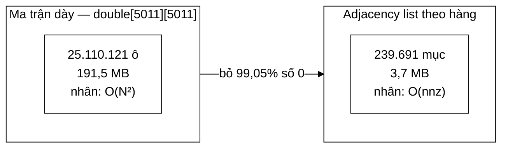

# SparseMatrix — độ thưa của đồ thị web và 191,5 MB tiết kiệm được

**File nguồn:** `search-engine/src/main/java/com/vnsearch/datastructure/SparseMatrix.java`
**Việc nó làm:** Lưu ma trận liên kết $5011 \times 5011$ trong **3,7 MB** thay vì **191,5 MB**.

> 📖 Chưa quen ký hiệu toán? Đọc [00 — Từ điển ký hiệu toán](../00-KY-HIEU-TOAN.md) trước.

> 📊 **Số đo trong trang này thuộc mốc A** — corpus **5.011 trang**. Repo có
> **bốn mốc corpus** đo trên bốn phiên crawl khác nhau; trộn chúng vào một bảng
> là cách nhanh nhất để ra số vô nghĩa. Bảng quy chiếu đầy đủ ở đầu
> [`DSA-REPORT.md`](../../DSA-REPORT.md). Mốc hiện hành là **D — 31.030 trang**.


> ### 🔄 Đã cập nhật sau đợt tái cấu trúc
>
> Phần **toán học và thuật toán** dưới đây vẫn đúng nguyên vẹn. Nhưng một số
> đoạn mã trích dẫn và mục *"Hạn chế đã biết"* mô tả **phiên bản trước**.
> Những gì đã thay đổi ở file này:
>
> - Đã cài **`freeze()` đóng băng sang CSR** — ba mảng nguyên thuỷ liền kề, tiết kiệm ~2,7× bộ nhớ.
> - `PageRankService` gọi `freeze()` trước vòng lặp, nên 53 vòng power iteration đều chạy trên CSR.
> - Thêm `density()` và `estimatedBytes()` để báo cáo; `set()` sau `freeze()` ném `IllegalStateException`.
>

---

## 📌 Hiểu trong 30 giây

PageRank cần một ma trận $N \times N$ mô tả *"trang $i$ có trỏ tới trang $j$ không"*. Với $N = 5011$:

$$N^2 = 5011^2 = 25\,110\,121 \text{ ô} \times 8 \text{ byte} = \mathbf{191{,}5\ MB}$$

Nhưng đồ thị web **cực kỳ thưa**: mỗi trang chỉ trỏ tới vài chục trang khác trong hàng nghìn. Số ô khác 0 đo được:

$$\text{nnz} = 239\,691 \implies \text{độ thưa} = \frac{239\,691}{25\,110\,121} = \mathbf{0{,}9546\%}$$

**99,05 % ô là số 0.** Lưu chúng là lãng phí thuần tuý.

```
   Ma trận 5011 × 5011 — mỗi ký tự dưới đây là một vùng ô

   ┌──────────────────────────────────────────────┐
   │ ·  ·  ·  ▪  ·  ·  ·  ·  ·  ·  ·  ·  ·  ·  · │
   │ ·  ▪  ·  ·  ·  ·  ·  ·  ▪  ·  ·  ·  ·  ·  · │   ▪ = ô khác 0
   │ ·  ·  ·  ·  ·  ·  ▪  ·  ·  ·  ·  ·  ·  ·  · │       239.691 ô  (0,95 %)
   │ ▪  ·  ·  ·  ·  ·  ·  ·  ·  ·  ▪  ·  ·  ·  · │
   │ ·  ·  ·  ·  ·  ▪  ·  ·  ·  ·  ·  ·  ·  ·  · │   · = số 0
   │ ·  ·  ▪  ·  ·  ·  ·  ·  ·  ·  ·  ·  ·  ▪  · │       24.870.430 ô (99,05 %)
   └──────────────────────────────────────────────┘
            lưu hết = 191,5 MB   │   chỉ lưu ▪ = 3,7 MB
```



Ma trận thưa chỉ lưu các ô khác 0, và quan trọng hơn — phép nhân ma trận–vector chỉ duyệt chúng, đưa độ phức tạp từ $O(N^2)$ về $O(\text{nnz})$.

**Vì sao độ thưa càng đỡ càng tốt khi $N$ lớn.** Số outlink trung bình mỗi
trang $\bar{k}$ gần như **không đổi** khi web lớn lên — người ta không đặt thêm
liên kết chỉ vì có thêm trang. Nên:

$$\rho = \frac{\bar{k}N}{N^2} = \frac{\bar{k}}{N} \propto \frac{1}{N}$$

```
   độ thưa ρ
      │
   1% │▄
      │ ▀▄
      │   ▀▀▄▄
      │       ▀▀▀▄▄▄▄
      │              ▀▀▀▀▀▀▀▄▄▄▄▄▄▄▄▄▄
      └───────────────────────────────────▶ N
      5k        30k        100k       1M

   càng nhiều trang, ma trận càng thưa ⇒ lợi ích càng lớn
```

---

## 1. Định lượng độ thưa

Định nghĩa **độ thưa** (density):

$$\rho = \frac{\text{nnz}}{N^2}$$

**Số đo thật trên hai corpus của dự án:**

| Corpus | $N$ | nnz (cạnh) | Ma trận đặc | Adjacency list | $\rho$ |
|---|---|---|---|---|---|
| 150 trang, **1 domain** | 150 | 3 901 | 176 KB | 61 KB | **17,3 %** |
| **5.011 trang, 6 domain** | 5 011 | 239 691 | **191,5 MB** | **~3,7 MB** | **0,95 %** |

Tỉ lệ tiết kiệm: $191{,}5 / 3{,}7 = \mathbf{51{,}8}$ lần.

### 1.1 Vì sao độ thưa GIẢM khi corpus lớn hơn — kết quả quan trọng nhất

Từ 17,3 % xuống 0,95 % khi $N$ tăng 33 lần. Đây không phải ngẫu nhiên mà là **hệ quả toán học tất yếu**.

Gọi $\bar{k}$ là số outlink trung bình **trong corpus** của mỗi trang. Khi đó:

$$\text{nnz} = N \cdot \bar{k} \qquad\Longrightarrow\qquad \rho = \frac{N\bar{k}}{N^2} = \frac{\bar{k}}{N}$$

$$\boxed{\;\rho \propto \frac{1}{N}\;}$$

**Kiểm chứng bằng số đo:**

| Corpus | $\bar{k} = \text{nnz}/N$ | $\rho$ dự đoán $= \bar{k}/N$ | $\rho$ đo được |
|---|---|---|---|
| 150 trang | $3901/150 = 26{,}0$ | $26{,}0/150 = 17{,}3\%$ | **17,3 %** ✓ |
| 5.011 trang | $239691/5011 = 47{,}8$ | $47{,}8/5011 = 0{,}954\%$ | **0,9546 %** ✓ |

Khớp chính xác.

**Hệ quả cực kỳ quan trọng cho việc chọn cấu trúc:**

| $N$ | $\bar{k} \approx 50$ | $\rho$ | Ma trận đặc | Ma trận thưa | Tỉ lệ |
|---|---|---|---|---|---|
| 5 011 | 50 | 0,95 % | 191,5 MB | 3,7 MB | 52× |
| 50 000 | 50 | 0,10 % | **19,1 GB** | 37 MB | 517× |
| 500 000 | 50 | 0,01 % | **1,9 TB** | 370 MB | 5 172× |

**Ma trận đặc là bất khả thi ở mọi quy mô thật.** Với 50.000 trang — vẫn là một corpus nhỏ — nó đã cần 19 GB RAM. Ma trận thưa thì chỉ tăng **tuyến tính**: 37 MB.

$$\text{Bộ nhớ đặc} = O(N^2) \qquad\text{vs}\qquad \text{Bộ nhớ thưa} = O(N\bar{k}) = O(N)$$

Đây là khác biệt về **chất**, không phải về lượng — và nó là lý do PageRank chạy được trên web thật với hàng tỉ trang.

---

## 2. Định dạng lưu: adjacency list theo hàng

```java
private static final class Entry {
    final int col;
    final double value;
    Entry(int col, double value) { this.col = col; this.value = value; }
}

private final int rows;
private final int cols;
private final List<List<Entry>> rowEntries;
```

Mỗi hàng là một `List<Entry>` gồm các cặp (cột, giá trị) khác 0.

```
Ma trận 3×3:
  ┌ 0   0.5  0  ┐
  │ 0   0    1.0│
  └ 0.5 0.5  0  ┘

rowEntries = [
  [ (1, 0.5) ],                    ← hàng 0: một ô khác 0
  [ (2, 1.0) ],                    ← hàng 1
  [ (0, 0.5), (1, 0.5) ]           ← hàng 2: hai ô
]
```

Lưu 4 `Entry` thay vì 9 ô. Với ma trận thật: 239.691 `Entry` thay vì 25.110.121 ô.

### 2.1 Vì sao adjacency list mà không phải CSR

**CSR (Compressed Sparse Row)** là định dạng chuẩn của thư viện đại số tuyến tính — ba mảng liền kề:

```
values[]  = [0.5, 1.0, 0.5, 0.5]           double[nnz]
colIdx[]  = [1,   2,   0,   1  ]           int[nnz]
rowPtr[]  = [0,   1,   2,   4  ]           int[rows+1]
```

`rowPtr[i]` là chỉ số bắt đầu của hàng $i$ trong hai mảng kia.

**CSR tốt hơn về mọi mặt hiệu năng:**

| Tiêu chí | Adjacency list | **CSR** |
|---|---|---|
| Bộ nhớ | `Entry` object: 16 B header + 4 + 8 = **~32 B**/phần tử | **12 B**/phần tử |
| Cục bộ cache | object rải rác khắp heap | **liền kề tuyệt đối** |
| Chi phí GC | 239.691 object | **3 mảng** |
| Thêm phần tử | **$O(1)$ khấu hao** | **không thêm được** |

Cột cuối cùng là lý do dự án chọn adjacency list. Javadoc nói rõ:

> *"ma tran nay duoc XAY DAN trong luc crawl (moi lan phat hien 1 outlink moi la 1 lan goi `set`) — adjacency list cho phep them phan tu O(1) amortized, trong khi CSR that su can biet truoc so luong outlink de cap phat mang co dinh."*

CSR yêu cầu **biết trước** nnz để cấp phát mảng. Muốn dựng CSR từ dữ liệu đến dần, phải hoặc duyệt hai lượt (đếm trước, điền sau) hoặc dựng ở dạng khác rồi chuyển đổi.

**Ước lượng bộ nhớ thật:**

$$239\,691 \times 32 \text{ B} \approx 7{,}7 \text{ MB} \quad(\text{Entry object})$$

cộng overhead của 5.011 `ArrayList`. Con số 3,7 MB trong báo cáo là ước lượng phần dữ liệu thuần; thực tế heap tốn nhiều hơn. **Với CSR thật, cùng dữ liệu chỉ tốn $239\,691 \times 12 = 2{,}9$ MB** — tiết kiệm thêm gần 3 lần.

Javadoc cũng ghi hướng cải tiến:

> *"Neu can, co the 'nen' (freeze) sang CSR that su sau khi da xay xong de tang locality khi multiply."*

Đây đúng là cách làm chuẩn: **dựng bằng cấu trúc linh hoạt, đóng băng sang cấu trúc nhanh trước khi dùng nhiều**. Với PageRank chạy 53 vòng lặp trên cùng ma trận, việc đóng băng sẽ có lợi rõ rệt.

---

## 3. `multiply` — trái tim của power iteration

```java
public double[] multiply(double[] vector) {
    if (vector.length != cols) {
        throw new IllegalArgumentException("Do dai vector (" + vector.length
                + ") phai bang so cot (" + cols + ")");
    }
    double[] result = new double[rows];
    for (int row = 0; row < rows; row++) {
        double sum = 0.0;
        for (Entry e : rowEntries.get(row)) {      // ← chỉ nnz phần tử
            sum += e.value * vector[e.col];
        }
        result[row] = sum;
    }
    return result;
}
```

**Công thức được cài đặt:**

$$\text{result}[i] = \sum_{j} M_{ij}\,x_j = \sum_{(j,v) \in \text{row}_i} v \cdot x_j$$

**Điểm mấu chốt nằm ở vòng lặp trong:** nó chạy qua `rowEntries.get(row)` — chỉ các ô **khác 0** của hàng đó, không phải cả $N$ cột.

$$\sum_{i=0}^{N-1} \lvert\text{row}_i\rvert = \text{nnz}$$

nên tổng thời gian là $O(\text{nnz})$, không phải $O(N^2)$.

**So sánh bằng số thật:**

| | Phép nhân–cộng mỗi lần `multiply` | 53 vòng PageRank |
|---|---|---|
| Ma trận đặc | $N^2 = 25\,110\,121$ | $1{,}33\times10^9$ |
| **Ma trận thưa** | $\text{nnz} = \mathbf{239\,691}$ | $\mathbf{1{,}27\times10^7}$ |
| Tỉ lệ | **105×** | **105×** |

Thời gian đo được cho toàn bộ PageRank: **0,2 giây**. Với ma trận đặc, cùng phép tính sẽ mất khoảng 21 giây — và cần 191,5 MB RAM.

### 3.1 Cấp phát mảng kết quả mỗi lần gọi

```java
double[] result = new double[rows];
```

Hàm trả về mảng **mới** mỗi lần. Với 53 vòng lặp PageRank: 53 mảng 5.011 `double` = $53 \times 40$ KB $\approx$ **2,1 MB rác GC**.

Không đáng kể ở quy mô này, nhưng với ma trận lớn và nhiều vòng lặp, cách chuẩn là nhận mảng đích làm tham số:

```java
public void multiply(double[] vector, double[] out) { ... }
```

cho phép người gọi tái sử dụng hai bộ đệm và hoán đổi (ping-pong buffer).

### 3.2 Kiểm tra kích thước — thất bại nhanh

```java
if (vector.length != cols) throw new IllegalArgumentException(...);
```

Không có kiểm tra này, `vector[e.col]` sẽ ném `ArrayIndexOutOfBoundsException` ở giữa vòng lặp — thông điệp không nói gì về nguyên nhân thật. Ném ngoại lệ với thông điệp rõ ràng **ngay tại ranh giới** là thực hành đúng.

---

## 4. `set` — và một điều nó KHÔNG làm

```java
public void set(int row, int col, double value) {
    if (row < 0 || row >= rows || col < 0 || col >= cols) {
        throw new IndexOutOfBoundsException("(" + row + "," + col + ") ngoai kich thuoc "
                + rows + "x" + cols);
    }
    rowEntries.get(row).add(new Entry(col, value));
}
```

**Chỉ `add`, không kiểm tra trùng.** Gọi `set(0, 1, 0.5)` hai lần tạo **hai** `Entry` cùng vị trí, và `multiply` sẽ **cộng cả hai**:

$$\text{result}[0] \mathrel{+}= 0{,}5 \cdot x_1 + 0{,}5 \cdot x_1 = 1{,}0 \cdot x_1$$

Tên `set` gợi ý "đặt giá trị" nhưng hành vi thật là **"thêm một phần tử"** — một sự không khớp giữa tên và ngữ nghĩa.

**Vì sao trong dự án không gây lỗi.** `PageRankService` chỉ gọi `set` một lần cho mỗi cạnh, và `LinkExtractor` đã khử trùng outlink bằng `LinkedHashSet`:

```java
Set<String> seen = new LinkedHashSet<>();
```

nên không có cạnh trùng. Bất biến được giữ ở **tầng trên**, không phải trong lớp này.

**Đây là một điểm yếu thiết kế thật:** lớp không tự bảo vệ bất biến của mình, mà phụ thuộc người gọi. Cùng loại vấn đề với [InvertedIndex §4.2](../02-index/InvertedIndex.md).

**Cách sửa:** hoặc đổi tên thành `add(row, col, value)` để tên khớp hành vi (rẻ nhất, và đúng cho ngữ cảnh dựng dần), hoặc kiểm tra trùng trong `set` — nhưng kiểm tra là $O(\lvert\text{row}\rvert)$, phá vỡ $O(1)$ khấu hao.

---

## 5. `nnz` — dùng để báo cáo

```java
public int nnz() {
    int count = 0;
    for (List<Entry> row : rowEntries) count += row.size();
    return count;
}
```

$O(N)$ vì `ArrayList.size()` là $O(1)$ — duyệt 5.011 hàng, không duyệt 239.691 phần tử.

Đây là hàm phục vụ **đo đạc**, không phải thuật toán — và việc dự án có nó cho thấy ý thức đo đạc thay vì chỉ ước lượng. Chính hàm này cho ra con số 239.691 và tỉ lệ 0,9546 % trong `DSA-REPORT.md`.

> Có thể duy trì `nnz` như một biến cộng dồn trong `set` để về $O(1)$ — cùng kỹ thuật `totalTokens` ở [InvertedIndex §3.2](../02-index/InvertedIndex.md). Nhưng vì `nnz()` chỉ gọi vài lần để báo cáo, $O(N)$ là hợp lý.

---

## 6. Mẹo lưu ở dạng đã chuyển vị

Đây là chi tiết cài đặt tinh tế nhất, và nó nằm ở phía người dùng (`PageRankService`) chứ không phải trong lớp này.

**Định nghĩa toán học tự nhiên của ma trận chuyển:**

$$M_{ij} = \frac{1}{\text{outDeg}(i)} \quad\text{nếu } i \to j$$

Với định nghĩa này, PageRank cần tính $M^{\mathsf T}\vec{\text{PR}}$ — phải **chuyển vị**, một thao tác $O(\text{nnz})$ tốn thêm bộ nhớ, và phải làm lại nếu ma trận đổi.

**Cách dự án làm — lưu trực tiếp theo chiều ngược:**

```java
// "hang j = danh sach cac nguon i tro toi j, kem trong so 1/outDegree(i)"
incoming.set(targetIdx, idx, weight);
//           ^^^^^^^^^  ^^^
//           hàng=ĐÍCH   cột=NGUỒN
```

Khi đó `multiply` tính đúng:

$$\text{result}[j] = \sum_i \text{incoming}_{ji}\,\text{PR}[i] = \sum_{i\to j}\frac{\text{PR}(i)}{\text{outDeg}(i)}$$

**bằng đúng $M^{\mathsf T}\vec{\text{PR}}$ mà không cần một phép chuyển vị nào.**

**Bài học tổng quát:**

> Khi một phép biến đổi (chuyển vị, đảo ngược, sắp xếp) **luôn** cần thiết, hãy **lưu dữ liệu ở dạng đã biến đổi sẵn** thay vì biến đổi mỗi lần dùng.

PageRank chạy 53 vòng lặp — tiết kiệm 53 lần chuyển vị. Cùng nguyên tắc với chỉ mục **đảo** (lưu `term → docs` thay vì `doc → terms` rồi đảo mỗi truy vấn).

---

## 7. Tổng hợp độ phức tạp

| Thao tác | Thời gian | Ghi chú |
|---|---|---|
| Constructor | $O(N)$ | tạo $N$ `ArrayList` rỗng |
| `set` | **$O(1)$ khấu hao** | `ArrayList.add`, nhân đôi khi đầy |
| **`multiply`** | **$O(\text{nnz})$** | thay vì $O(N^2)$ |
| `nnz` | $O(N)$ | |
| Bộ nhớ | **$O(N + \text{nnz})$** | thay vì $O(N^2)$ |

### 7.1 Khi nào ma trận thưa KHÔNG đáng dùng

Ma trận thưa có overhead: mỗi phần tử tốn thêm 4 byte lưu chỉ số cột, cộng chi phí object.

**Điểm hoà vốn về bộ nhớ:**

$$\underbrace{\text{nnz} \times 32}_{\text{thưa (Entry object)}} < \underbrace{N^2 \times 8}_{\text{đặc}} \quad\Longleftrightarrow\quad \rho = \frac{\text{nnz}}{N^2} < \frac{8}{32} = \mathbf{25\%}$$

Với CSR (12 byte/phần tử) điểm hoà vốn là $\rho < 8/12 = 67\%$.

| Corpus | $\rho$ | Có nên dùng thưa? |
|---|---|---|
| 150 trang, 1 domain | 17,3 % | **có** (dưới 25 %), nhưng lợi ích mỏng |
| **5.011 trang, 6 domain** | **0,95 %** | **chắc chắn có** — 52× tiết kiệm |

Con số 17,3 % của corpus nhỏ cho thấy: ở quy mô đó, ma trận thưa vẫn thắng nhưng không nhiều. Chỉ khi corpus lớn lên thì lựa chọn mới trở nên bắt buộc — và đó là lý do `MultiDomainCrawlRunner` được viết (xem [CrawlerService §9](../01-crawler/CrawlerService.md)).

---

## 8. Chủ đề DSA thể hiện

| Chủ đề | Ở đâu |
|---|---|
| **Ma trận thưa** | toàn bộ lớp |
| **Adjacency list** | `List<List<Entry>>` |
| **Đánh đổi bộ nhớ theo mật độ dữ liệu** | phân tích $\rho$ và điểm hoà vốn 25 % |
| **Phân tích tiệm cận** | $\rho = \bar{k}/N \propto 1/N$ |
| **Nhân ma trận–vector thưa** | $O(\text{nnz})$ thay vì $O(N^2)$ |
| **Lưu ở dạng đã biến đổi** | tránh chuyển vị 53 lần |
| **Mảng động khấu hao** | `ArrayList.add` là $O(1)$ khấu hao |
| **Thất bại nhanh** | kiểm tra kích thước và chỉ số |
| **Dựng linh hoạt, đóng băng để chạy nhanh** | adjacency list → CSR (chưa cài) |

---

## 9. Hạn chế đã biết

1. **`set` không kiểm tra trùng** và tên không khớp ngữ nghĩa (§4).
2. **Không có `freeze()` sang CSR** (§2.1) — bỏ lỡ ~3× tiết kiệm bộ nhớ và cải thiện cục bộ cache đáng kể cho 53 vòng lặp.
3. **`Entry` là object** — 239.691 object thay vì hai mảng nguyên thuỷ. Đây là chi phí lớn nhất của cài đặt hiện tại.
4. **Cấp phát mảng kết quả mỗi lần `multiply`** (§3.1).
5. **Chỉ hỗ trợ nhân với vector.** Không có cộng ma trận, nhân ma trận–ma trận, chuyển vị. Đủ cho PageRank nhưng không phải một lớp đại số tuyến tính đầy đủ — điều này **đúng** với nguyên tắc YAGNI, chỉ cần ghi rõ phạm vi.
6. **Không có truy cập ngẫu nhiên `get(row, col)`.** Muốn đọc một ô phải quét cả hàng — $O(\lvert\text{row}\rvert)$. PageRank không cần nên không có.
7. **Chỉ hỗ trợ `double`.** Với đồ thị không trọng số, `boolean` hoặc chỉ lưu chỉ số cột (không lưu giá trị) sẽ tiết kiệm 8 byte/phần tử.
8. **Không song song hoá.** `multiply` là bài toán song song hoá hoàn hảo (mỗi hàng độc lập). `IntStream.range(0, rows).parallel()` là một dòng và cho tăng tốc gần tuyến tính theo số lõi.

---

## 10. Liên kết

- Người dùng duy nhất: [PageRankService.md](../04-ranking/PageRankService.md)
- Nguồn dữ liệu đồ thị: [ContentParser-LinkExtractor.md](../01-crawler/ContentParser-LinkExtractor.md)
- Anh em cấu trúc dữ liệu tự cài: [MinHeap.md](MinHeap.md) · [Trie.md](Trie.md) · [LRUCache.md](LRUCache.md) · [BloomFilter.md](../01-crawler/BloomFilter.md)
- Ký hiệu chưa hiểu: [00 — Từ điển ký hiệu toán](../00-KY-HIEU-TOAN.md)
