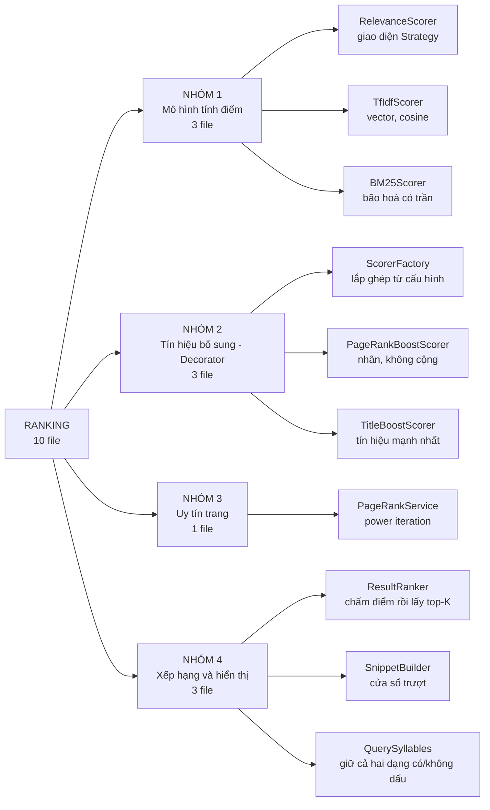
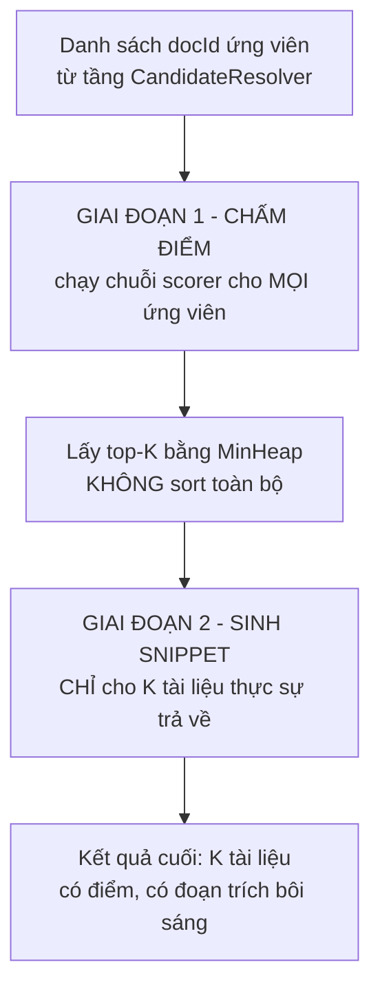
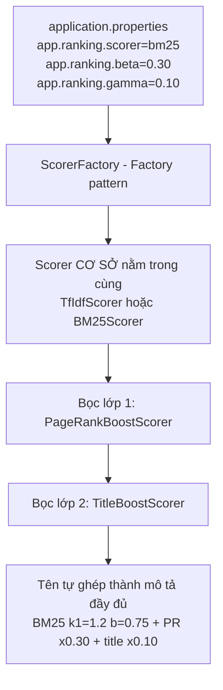
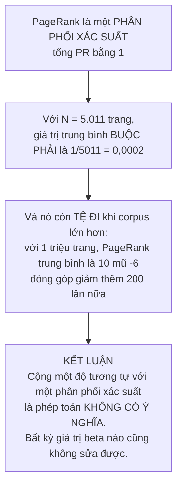

# Sơ đồ tư duy — Toàn bộ tầng Xếp hạng

**Phạm vi:** 10 file trong `com.vnsearch.ranking` (8 file gốc + 2 file `decorator/`).

**Trang này trả lời:** các file liên hệ với nhau ra sao, một danh sách ứng viên biến thành top-10 có snippet qua những bước nào, và **một lỗi thang đo khiến PageRank chỉ đóng góp 0,1 % dù trọng số danh nghĩa là 30 %** đã được phát hiện và sửa như thế nào.

> ### Cách đọc
> - Sơ đồ vẽ bằng **Mermaid**; không hiện hình thì bấm khối *"Xem bản chữ (ASCII)"* ngay dưới.
> - Nếu chỉ đọc được một mục, đọc **§5** — đó là phát hiện quan trọng nhất của cả tầng này.
>
> 📖 **Trang đi sâu:** [TfIdfScorer](TfIdfScorer.md) · [BM25Scorer](BM25Scorer.md) · [PageRankService](PageRankService.md) · [ResultRanker](ResultRanker.md) · [QuerySyllables](QuerySyllables.md)

---

## 1. Bản đồ toàn cảnh — 10 file chia 4 nhóm



<details>
<summary><b>Xem bản chữ (ASCII)</b></summary>
```
                          RANKING — 10 file
                                 │
   ┌──────────────┬──────────────┼──────────────┬───────────────────┐
NHÓM 1         NHÓM 2                        NHÓM 3            NHÓM 4
Mô hình điểm   Tín hiệu bổ sung              Uy tín trang      Xếp hạng/hiển thị
(3 file)       (Decorator, 3 file)           (1 file)          (3 file)
   │               │                             │                  │
RelevanceScorer ScorerFactory              PageRankService    ResultRanker
TfIdfScorer     PageRankBoostScorer                           SnippetBuilder
BM25Scorer      TitleBoostScorer                              QuerySyllables
```

</details>

### Bảng tra nhanh — 10 file, mỗi file một câu

| # | File | Nhóm | Nó làm gì |
|---|---|---|---|
| 1 | `RelevanceScorer` | 1 | Giao diện Strategy — **điều kiện cần** để làm thí nghiệm ablation |
| 2 | `TfIdfScorer` | 1 | Mô hình không gian vector + cosine, chuẩn hoá `sqrt(docLength)` |
| 3 | `BM25Scorer` | 1 | Chuẩn công nghiệp (Lucene/Elasticsearch), bão hoà có tiệm cận |
| 4 | `ScorerFactory` | 2 | Factory — đọc `application.properties` rồi **lắp ghép chuỗi Decorator** |
| 5 | `PageRankBoostScorer` | 2 | Decorator — **nhân**, không cộng; log chuẩn hoá về `[0,1]` |
| 6 | `TitleBoostScorer` | 2 | Decorator — thưởng cho tài liệu có tiêu đề khớp; **mạnh gấp 6 lần PageRank** |
| 7 | `PageRankService` | 3 | Power iteration trên `SparseMatrix`, xử lý dangling node |
| 8 | `ResultRanker` | 4 | Chấm điểm → top-K bằng `MinHeap` → gọi `SnippetBuilder` |
| 9 | `SnippetBuilder` | 4 | Cửa sổ trượt O(n) tìm đoạn chứa nhiều từ khoá nhất |
| 10 | `QuerySyllables` | 4 | Giữ **cả hai dạng** tiếng có dấu / không dấu để bôi sáng cho đúng |

---

## 2. Đường đi của một danh sách ứng viên



<details>
<summary><b>Xem bản chữ (ASCII)</b></summary>
```
danh sách ứng viên (c tài liệu)
        │
        ▼
GIAI ĐOẠN 1: chấm điểm MỌI ứng viên      O(c · q · log d)
        │
        ▼
lấy top-K bằng MinHeap (không sort hết)  O(c · log K)
        │
        ▼
GIAI ĐOẠN 2: sinh snippet CHỈ cho K      O(K · |d|)
        │
        ▼
K kết quả có điểm + đoạn trích bôi sáng
```

</details>

### Vì sao phải tách làm **hai giai đoạn** — nhanh hơn 50 lần

Sinh snippet là thao tác **đắt nhất**: nó phải tách **toàn bộ** `bodyText` (trung bình hơn 1.000 token) rồi trượt cửa sổ. Bản cũ chạy bước này cho **mọi** ứng viên rồi mới cắt top-N:
```
   Trước:  O(c × |d|) = 500 × 1043 = 521.500      ← 490 snippet bị vứt đi ngay sau khi tạo
   Sau  :  O(K × |d|) =  10 × 1043 =  10.430
                                       ─────────
                                       ~50 lần nhanh hơn
```

---

## 3. Chuỗi scorer được lắp ghép thế nào



<details>
<summary><b>Xem bản chữ (ASCII)</b></summary>
```
application.properties
      │
      ▼
ScorerFactory  (Factory)
      │
      ▼
   ┌─────────────────────────────────────────────┐
   │  TitleBoostScorer                           │  ← bọc ngoài cùng
   │   ┌───────────────────────────────────────┐ │
   │   │  PageRankBoostScorer                  │ │
   │   │   ┌─────────────────────────────────┐ │ │
   │   │   │  BM25Scorer  (hoặc TfIdfScorer) │ │ │  ← cơ sở, trong cùng
   │   │   └─────────────────────────────────┘ │ │
   │   └───────────────────────────────────────┘ │
   └─────────────────────────────────────────────┘
      │
      ▼
name() = "BM25(k1=1.2,b=0.75) + PR x0.30 + title x0.10"
```

</details>

### Vấn đề thật mà `ScorerFactory` giải

Giao diện `RelevanceScorer` **đã tồn tại và hoạt động tốt**, nhưng `SearchEngineFacade` lại **chọn cứng** cài đặt:

```java
private final TfIdfScorer tfIdfScorer = new TfIdfScorer();   // ← chọn cứng
```

Hậu quả đo được: **BM25 đạt MRR 0,8989 so với 0,8537 của TF-IDF — hơn 5,3 %** — nhưng **không có cách nào để người dùng thật nhận được kết quả BM25** mà không sửa mã nguồn và biên dịch lại.

> Strategy chỉ được **bộ đánh giá** khai thác; **sản phẩm** thì không. Đó chính là lỗ hổng mà Factory vá.

Nay chỉ cần đổi một dòng trong `application.properties`.

---

## 4. Hai mô hình tính điểm

### 4.1 So sánh

| | TF-IDF cosine | BM25 |
|---|---|---|
| Tần suất | `tf = 1 + log10(f)` — **tăng vô hạn** | phần thức tiến tới **tiệm cận ngang `k1+1 = 2,2`** |
| Chuẩn hoá độ dài | chia cứng cho `sqrt(docLength)` | tham số `b` chỉnh được (mặc định 0,75) |
| IDF | `log10(N/df)` — **có thể ÂM** | `ln(1 + (N−df+0,5)/(df+0,5))` — **luôn dương** |
| MRR (200 truy vấn) | 0,8537 | **0,8989** |
| Success@1 | 78,0 % | **85,0 %** |

### 4.2 Ba chỗ BM25 hơn — giải thích ngắn
```
1. BÃO HOÀ CÓ TRẦN
   TF-IDF : tf = 1 + log10(f) vẫn tăng mãi theo số lần lặp
   BM25   : tiến tới tiệm cận k1+1 = 2,2
            → từ khoá xuất hiện 50 lần gần như không hơn gì 20 lần
            → điểm nửa bão hoà đạt ngay tại f = k1 = 1,2 với tài liệu độ dài trung bình

2. CHUẨN HOÁ ĐỘ DÀI CÓ THAM SỐ
   b = 0  : không phạt tài liệu dài
   b = 1  : chuẩn hoá hoàn toàn theo |D|/avgdl
   b = 0,75: dung hoà đã kiểm chứng qua nhiều thập kỷ thực nghiệm TREC

3. IDF KHÔNG BAO GIỜ ÂM
   log(N/df) hoá ÂM khi term xuất hiện ở hơn MỘT NỬA số tài liệu
   → tài liệu chứa term đó bị TRỪ điểm một cách vô lý
   Dạng ln(1 + ...) của Robertson–Sparck Jones bảo đảm luôn dương
```

### 4.3 Nói cho công bằng — sai số của xấp xỉ trong TF-IDF

Cosine chuẩn cần chia cho `||vector tài liệu||`, mà norm này về lý thuyết phải tính trên **tất cả** term của tài liệu — tốn `O(|từ vựng|)` cho **mỗi** tài liệu, và phải tính lại mỗi lần thêm tài liệu (vì `idf` đổi khi `N` đổi). Nên dùng xấp xỉ kinh điển của Lucene: `docNorm ≈ sqrt(docLength)`.

Theo **định luật Heaps**, số term phân biệt của tài liệu tăng theo `|d|^β` với `β ≈ 0,5`, nên norm thật tỉ lệ `|d|^0,25` trong khi xấp xỉ dùng `|d|^0,5` — tức nó **phạt tài liệu dài mạnh hơn thực tế**. Đây đúng là điểm mà BM25 hơn, vì BM25 có tham số `b` để điều chỉnh mức phạt thay vì chọn cứng.

---

## 5. Phát hiện quan trọng nhất: lỗi thang đo 1000×

### 5.1 Công thức cũ và con số đo được
```
   Công thức cũ, chọn cứng trong ResultRanker:

       final = α·relevance + β·pageRank + γ·titleBonus
                             ↑
                       β = 0,30  (trọng số DANH NGHĨA 30 %)
```

Đo trên corpus 5.011 trang:
```
   TF-IDF cosine  : trung bình 0,177687     → ×0,6 = 0,106612
   PageRank       : trung bình 0,00035388   → ×0,3 = 0,00010616

   tỉ lệ đóng góp của PageRank = 0,00010616 / 0,106612 ≈ 0,1 %
```

> **PageRank đóng góp MỘT PHẦN NGHÌN dù trọng số danh nghĩa là 30 %.**

Bằng chứng thực nghiệm: quét `β` từ 0,05 đến 0,80 (**gấp 16 lần**) chỉ làm MRR đổi **0,0040** — tức 0,4 %.

### 5.2 Vì sao đây KHÔNG phải "chọn β chưa tối ưu"



<details>
<summary><b>Xem bản chữ (ASCII)</b></summary>
```
PageRank là PHÂN PHỐI XÁC SUẤT: Σ PR = 1
        ↓
với N = 5.011 → trung bình BUỘC PHẢI là 1/5011 = 0,0002
        ↓
corpus 1 triệu trang → trung bình 10⁻⁶ → đóng góp giảm thêm 200 lần
        ↓
KẾT LUẬN: cộng một ĐỘ TƯƠNG TỰ với một PHÂN PHỐI XÁC SUẤT
          là phép toán không có ý nghĩa. Đổi β không cứu được.
```

</details>

### 5.3 Cách sửa: **nhân**, không cộng

$$\text{final} = \text{base} \times (1 + w \cdot \text{normalized})$$
$$\text{normalized} = \frac{\log(1 + \text{pr}/\text{pr}_{\min})}{\log(1 + \text{pr}_{\max}/\text{pr}_{\min})} \in [0, 1]$$

Hai lý do:

1. **Logarit nén dải động.** PageRank trải trên nhiều bậc độ lớn (từ `10⁻⁴` đến `7,7×10⁻³`); `log` biến nó thành đại lượng **cộng được**, và chuẩn hoá về `[0,1]` làm `weight` trở thành **tỉ lệ đóng góp THẬT**.
2. **Bất biến với thang điểm của scorer được bọc.** Đổi TF-IDF sang BM25 **không phải chỉnh lại trọng số**.

Tài liệu có điểm cơ sở 0 vẫn bằng 0 — tiêu đề khớp hay PageRank cao **không cứu được** một tài liệu mà nội dung hoàn toàn không liên quan.

### 5.4 Tín hiệu nào thật sự mạnh?

Đo trên 200 truy vấn known-item:

| Cấu hình | MRR | Chênh lệch |
|---|---|---|
| TF-IDF thuần | 0,8537 | — |
| TF-IDF + PageRank | 0,8625 | +0,0088 |
| **TF-IDF + tiêu đề** | **0,9083** | **+0,0546** — *gấp 6 lần PageRank* |

**Vì sao tiêu đề mạnh:** tiêu đề là bản tóm tắt do **chính người viết** đặt cho bài, nên nó là tín hiệu liên quan rất mạnh. Và khác PageRank, nó **cùng thang đo** với điểm liên quan (cả hai nằm trong khoảng tương tự) nên kết hợp dễ hơn nhiều.

---

## 6. `PageRankService` — power iteration

$$PR(j) = \frac{1-d}{N} + d\left[\sum_{i \to j} \frac{PR(i)}{\text{outDeg}(i)} + \frac{\text{danglingMass}}{N}\right]$$

với `d = 0,85`.

### Mẹo lưu ma trận — khỏi phải transpose
```
   Định nghĩa toán học:  M[i][j] = 1/outDeg(i) nếu i → j
                         rồi phải tính  Mᵀ · PR

   Cách làm ở đây     :  lưu TRỰC TIẾP  SparseMatrix.set(j, i, 1/outDeg(i))
                         tức "hàng j = danh sách các NGUỒN i trỏ tới j"
                         → multiply() tính sẵn  result[j] = Σᵢ M[j][i]·PR[i]
                         → chính là Mᵀ·PR mà KHÔNG cần thao tác transpose nào
```

Đây chỉ là **chọn chiều lưu** của ma trận ngay từ đầu — một quyết định miễn phí, loại bỏ hẳn một bước tính.

### Dangling node

Trang không có outlink nào trỏ về một trang **trong corpus đã crawl**: toàn bộ "khối lượng" PR của nó được **phân phối đều cho tất cả N trang**, thay vì biến mất khỏi hệ thống — nếu để nó biến mất thì tính chất `Σ PR = 1` bị vi phạm và thuật toán không còn là chuỗi Markov.

**Điều kiện dừng:** `||PR_new − PR_old||₁ < 10⁻⁶` **hoặc** đủ 100 vòng. Độ phức tạp mỗi vòng: `O(nnz) + O(N)`.

---

## 7. `SnippetBuilder` — cửa sổ trượt

**Bài toán:** trong tài liệu `n` từ, tìm cửa sổ `w` từ liên tiếp chứa **nhiều từ khoá nhất**.
```
   Ngây thơ    : mỗi vị trí đếm lại từ đầu  →  O(n·w) = 1043 × 25 = 26.075
   Cửa sổ trượt: mỗi bước chỉ 2 phép cập nhật →  O(n)   =              1.068
                                                          ──────────────────
                                                          nhanh hơn đúng w lần
```

**Bất biến vòng lặp:** `currentMatches` **luôn** bằng số từ khớp trong `isMatch[start .. start+w−1]`. Khi cửa sổ dịch một bước, chỉ có **một** phần tử rời khỏi bên trái và **một** phần tử vào bên phải.

---

## 8. `QuerySyllables` — một lỗi tinh tế đã sửa

### Lỗi

Trước đây **mọi** tiếng đều bị bỏ dấu trước khi so khớp, khiến snippet bôi sáng nhầm:
```
   Truy vấn: "ngân hàng"
   Văn bản : "cắt giảm cả ngàn nhân sự"
                          ▲▲▲▲
                          bị bôi sáng NHẦM
```

### Nguyên nhân gốc

Bỏ dấu là một **ánh xạ nhiều-một**:
```
   ngân  ─┐
   ngàn  ─┼──►  ngan
   ngắn  ─┘
```

So khớp trên **ảnh** của ánh xạ này thì mất khả năng phân biệt các **nghịch ảnh**.

### Quy tắc mới

| Người dùng gõ | Chế độ khớp | Ví dụ |
|---|---|---|
| `ngân` (**có** dấu) | chỉ khớp **chính xác** | chỉ sáng `ngân` |
| `ngan` (**không** dấu) | khớp lỏng (bỏ dấu) | sáng cả `ngân`, `ngàn` |

Cách kiểm tra "tiếng này có dấu không" dùng **điểm bất động** của phép bỏ dấu:

$$\texttt{stripDiacritics}(s) = s \iff s \text{ không có dấu}$$

> **Bài học chung:** bỏ dấu là **cần thiết** ở khâu **tra cứu** (vì không biết người dùng gõ kiểu nào), nhưng **thừa và gây sai** ở khâu **hiển thị** (vì lúc này đã biết chính xác người dùng gõ gì).

---

## 9. Bảng độ phức tạp

| Thao tác | Độ phức tạp | Ghi chú |
|---|---|---|
| `TfIdfScorer.score` | **O(q log d)** | q = số term phân biệt của truy vấn |
| `BM25Scorer.score` | **O(q log d)** | cùng bậc — đều dùng binary search |
| Decorator bọc thêm | **O(1)** mỗi lớp | chỉ nhân thêm một hệ số |
| `ResultRanker` chấm điểm | **O(c·q·log d)** | c = số ứng viên |
| Lấy top-K | **O(c log K)** | `MinHeap`, không sort toàn bộ |
| `SnippetBuilder.build` | **O(\|d\|)** | cửa sổ trượt |
| `PageRankService.compute` | **O(iter · (nnz + N))** | thực tế hội tụ sau ~53 vòng |

---

## 10. Xoá một file thì hỏng cái gì?

| File | Nếu không có | Hậu quả |
|---|---|---|
| `RelevanceScorer` (giao diện) | chọn cứng một scorer | **Không làm được thí nghiệm ablation** — mọi so sánh lẫn thêm biến số khác và mất giá trị khoa học |
| `ScorerFactory` | chọn cứng trong Facade | BM25 tốt hơn 5,3 % nhưng **không ai dùng được** |
| `PageRankBoostScorer` | cộng tuyến tính | PageRank đóng góp **0,1 %** dù trọng số 30 % — lỗi thang đo |
| `TitleBoostScorer` | không có | Mất tín hiệu **mạnh nhất** (+0,0546 MRR) |
| `SnippetBuilder` tách riêng | gộp vào `ResultRanker` | 490/500 snippet bị vứt đi ngay sau khi tạo — chậm **50 lần** |
| `QuerySyllables` | bỏ dấu hết | Bôi sáng nhầm: `ngân hàng` làm sáng cả `ngàn` |
| `PageRankService` | không có | Mất tín hiệu uy tín — dù yếu, nó vẫn là phần bắt buộc của đề bài |

---

## 11. Đọc tiếp

| Muốn hiểu | Đọc |
|---|---|
| Mô hình không gian vector, idf là self-information, phân tích sai số | [TfIdfScorer.md](TfIdfScorer.md) |
| Hàm bão hoà có tiệm cận, IDF Robertson–Sparck Jones | [BM25Scorer.md](BM25Scorer.md) |
| Chuỗi Markov, Perron–Frobenius, chứng minh tổng PR = 1 | [PageRankService.md](PageRankService.md) |
| Cửa sổ trượt O(n), top-K, phân tích lỗi thang đo 1000× | [ResultRanker.md](ResultRanker.md) |
| Ánh xạ nhiều-một, điểm bất động | [QuerySyllables.md](QuerySyllables.md) |
| **Ứng viên đến từ đâu** | [Sơ đồ tư duy tầng truy vấn](../04-query/00-SO-DO-TU-DUY.md) |
| **Các con số MRR đo bằng cách nào** | [Sơ đồ tư duy tầng đánh giá](../07-eval/00-SO-DO-TU-DUY.md) |
| Ma trận thưa CSR mà PageRank dùng | [SparseMatrix.md](../06-datastructures/SparseMatrix.md) |
| Decorator và Factory | [03-DECORATOR](../09-design-patterns/03-DECORATOR.md) · [02-FACTORY](../09-design-patterns/02-FACTORY.md) |
