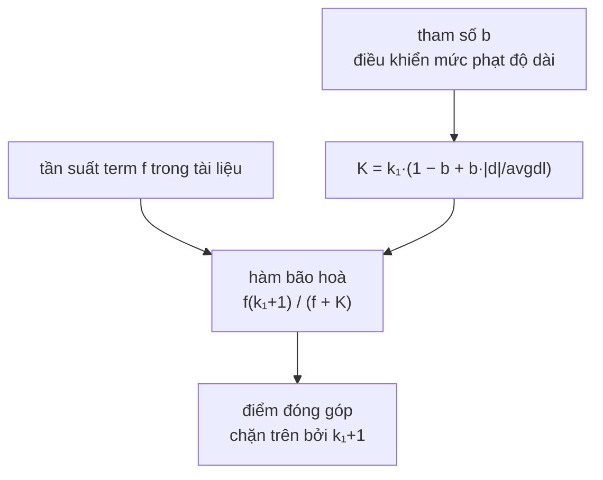

# BM25Scorer — hàm bão hoà và chuẩn hoá độ dài có tham số

**File nguồn:** `search-engine/src/main/java/com/vnsearch/ranking/BM25Scorer.java`
**Việc nó làm:** Mô hình xếp hạng **chuẩn công nghiệp**, dùng làm baseline để đối chiếu với TF-IDF cosine.

> 📖 Chưa quen ký hiệu toán? Đọc [00 — Từ điển ký hiệu toán](../00-KY-HIEU-TOAN.md) trước.


> ### 🔄 Đã cập nhật sau đợt tái cấu trúc
>
> Phần **toán học và thuật toán** dưới đây vẫn đúng nguyên vẹn. Nhưng một số
> đoạn mã trích dẫn và mục *"Hạn chế đã biết"* mô tả **phiên bản trước**.
> Những gì đã thay đổi ở file này:
>
> - BM25 **nay dùng được trong sản phẩm** qua `ScorerFactory`: đặt `app.ranking.scorer=bm25` trong properties.
> - Nhận `SearchIndex` (interface) và dùng `getTermFrequency` chung thay vì bản sao binary search riêng.
> - Constructor kiểm tra `k1 >= 0` và `b ∈ [0,1]`.
>

---

## 📌 Hiểu trong 30 giây

BM25 ("Best Matching 25", Robertson & Sparck Jones, 1994) là mô hình mặc định của **Lucene, Elasticsearch, Solr** — tức là của gần như mọi máy tìm kiếm không phải Google.

Nó giải **đúng hai** vấn đề mà TF-IDF cosine trong dự án này mắc phải:

| Vấn đề của TF-IDF ở đây | Cách BM25 giải |
|---|---|
| $\text{tf} = 1 + \log f$ vẫn **tăng vô hạn** theo $f$ | Phân thức có **tiệm cận ngang** $k_1 + 1$ |
| Chia cứng cho $\sqrt{\lvert d\rvert}$, không chỉnh được | Tham số $b$ điều khiển mức phạt độ dài |

Và một vấn đề thứ ba: IDF của TF-IDF **hoá âm** khi term xuất hiện ở hơn nửa corpus; IDF của BM25 luôn không âm.

Kết quả đo trên 200 truy vấn known-item: BM25 thuần đạt **MRR 0,8989** so với TF-IDF thuần **0,8537** — hơn **5,3 %**.

```
   Điểm đóng góp của term khi tần suất f tăng

   TF-IDF:  1 + log f          BM25:  f(k₁+1) / (f + k₁)
   ─────────────────────       ────────────────────────────
   điểm                        điểm
     │           ╱                │      ╭──────────────  ← tiệm cận k₁+1 = 2,2
     │        ╱                   │    ╭─╯
     │     ╱                      │  ╭─╯
     │  ╱                         │╭─╯
     │╱                           ╯
     └──────────────▶ f           └──────────────▶ f
       TĂNG VÔ HẠN                  BÃO HOÀ

   nhồi 1.000 lần từ khoá        nhồi 1.000 lần cũng chỉ
   ⇒ điểm cứ tăng                 tiến tới 2,2, không hơn
```



**Hai tham số, hai việc tách bạch** — đây là điều TF-IDF không có:

| | Điều khiển | Đặt 0 thì sao | Mặc định |
|---|---|---|---|
| $k_1$ | Tốc độ bão hoà | Mọi term đóng góp như nhau, bất kể xuất hiện mấy lần | `1.2` |
| $b$ | Mức phạt tài liệu dài | Bỏ qua độ dài hoàn toàn | `0.75` |

TF-IDF trong dự án này chia cứng cho $\sqrt{|d|}$ — tương đương một giá trị $b$
cố định **không chỉnh được**. BM25 biến hằng số ẩn đó thành tham số.

---

## 1. Công thức đầy đủ

$$\text{score}(d, q) = \sum_{t \in q} \text{IDF}(t) \cdot \frac{f(t,d)\,(k_1+1)}{f(t,d) + k_1\Bigl(1 - b + b\dfrac{\lvert d\rvert}{\text{avgdl}}\Bigr)}$$

$$\text{IDF}(t) = \ln\!\left(1 + \frac{N - \text{df}(t) + 0{,}5}{\text{df}(t) + 0{,}5}\right)$$

**Tham số mặc định:**

```java
public static final double DEFAULT_K1 = 1.2;   // mức bão hoà tần suất
public static final double DEFAULT_B  = 0.75;  // mức chuẩn hoá độ dài
```

Hai giá trị này là **dung hoà đã được kiểm chứng qua nhiều thập kỷ thực nghiệm TREC** — chúng không phải kết quả của một phép suy dẫn lý thuyết mà là kết quả của việc thử trên hàng trăm bộ dữ liệu.

---

## 2. Hàm bão hoà — phần cốt lõi

Tách phần phụ thuộc $f$ ra khỏi công thức, đặt $K = k_1(1 - b + b\frac{\lvert d\rvert}{\text{avgdl}})$:

$$S(f) = \frac{f\,(k_1+1)}{f + K}$$

**Ba tính chất, mỗi tính chất trả lời một câu hỏi thiết kế:**

### 2.1 Tiệm cận ngang — trần cứng

$$\lim_{f \to \infty} S(f) = \lim_{f\to\infty}\frac{f(k_1+1)}{f+K} = k_1 + 1 = \mathbf{2{,}2}$$

Dù một từ lặp bao nhiêu lần, đóng góp của nó **không bao giờ vượt 2,2**. Đây là điều TF-IDF không có: $1 + \log_{10} f$ tăng mãi (chậm, nhưng vô hạn).

### 2.2 Điểm nửa bão hoà

Giải $S(f) = \frac{k_1+1}{2}$:

$$\frac{f(k_1+1)}{f+K} = \frac{k_1+1}{2} \implies 2f = f + K \implies \boxed{f = K}$$

**Ý nghĩa của $k_1$, nói bằng lời:** *$K$ là số lần xuất hiện mà tại đó term đạt **một nửa** đóng góp tối đa của nó.*

Với tài liệu có độ dài trung bình ($\lvert d\rvert = \text{avgdl}$):

$$K = k_1(1 - b + b\cdot 1) = k_1 = 1{,}2$$

Nghĩa là: **xuất hiện 1,2 lần đã đạt nửa mức tối đa**. BM25 bão hoà rất nhanh — đó là chủ ý.

### 2.3 Đơn điệu tăng

$$S'(f) = \frac{(k_1+1)K}{(f+K)^2} > 0 \quad \forall f > 0$$

Lặp nhiều hơn **luôn** tốt hơn, chỉ là lợi ích giảm dần. Không có trường hợp lặp thêm bị phạt.

### 2.4 Bảng so sánh trực tiếp với TF-IDF

Với $k_1 = 1{,}2$, tài liệu độ dài trung bình ($K = 1{,}2$):

| $f$ | TF-IDF: $1+\log_{10}f$ | BM25: $\frac{2{,}2f}{f+1{,}2}$ | Tỉ lệ BM25 so với $f=1$ |
|---|---|---|---|
| 1 | 1,000 | **1,000** | 1,00× |
| 2 | 1,301 | 1,375 | 1,38× |
| 5 | 1,699 | 1,774 | 1,77× |
| 10 | 2,000 | **1,964** | 1,96× |
| 20 | 2,301 | 2,075 | 2,08× |
| 50 | 2,699 | 2,148 | 2,15× |
| **100** | **3,000** | **2,174** | **2,17×** |
| ∞ | ∞ | **2,200** | 2,20× |

**Đọc bảng này:** từ $f=20$ tới $f=100$ (gấp 5 lần), BM25 chỉ tăng từ 2,075 lên 2,174 — **4,8 %**. TF-IDF tăng từ 2,301 lên 3,000 — **30 %**.

Trực giác đằng sau: *một bài đã nói về "bóng đá" 20 lần thì rõ ràng là nói về bóng đá rồi; lặp thêm 80 lần nữa không làm nó liên quan hơn, mà thường chỉ là dấu hiệu nhồi từ khoá.*

---

## 3. IDF của BM25 — vì sao khác và tốt hơn

$$\text{IDF}_{\text{BM25}}(t) = \ln\!\left(1 + \frac{N - \text{df} + 0{,}5}{\text{df} + 0{,}5}\right)$$

```java
public static double idf(int totalDocs, int documentFrequency) {
    if (documentFrequency <= 0 || totalDocs <= 0) return 0.0;
    return Math.log(1 + ((double) totalDocs - documentFrequency + 0.5) / (documentFrequency + 0.5));
}
```

**Nguồn gốc.** Dạng này xuất phát từ **mô hình xác suất Robertson–Sparck Jones**. Bỏ qua suy dẫn đầy đủ, phần tử số $N - \text{df}$ là số tài liệu **không** chứa term, mẫu số $\text{df}$ là số tài liệu **có** — tỉ số này là **odds** của việc term vắng mặt.

**Ba thành phần và lý do từng cái:**

| Thành phần | Vai trò |
|---|---|
| $N - \text{df}$ ở tử | Số tài liệu không chứa term — càng nhiều thì term càng hiếm |
| $+\,0{,}5$ | Làm trơn, tránh chia cho 0 khi $\text{df}=0$ và tránh $\ln 0$ khi $\text{df}=N$ |
| $\ln(1 + \cdots)$ | Đảm bảo IDF **không bao giờ âm** |

### 3.1 Vì sao "không bao giờ âm" là quan trọng

**TF-IDF cổ điển:**

$$\text{idf} = \log_{10}\frac{N}{\text{df}} < 0 \iff \text{df} > N$$

Trong lý thuyết, $\text{df} \le N$ nên idf $\ge 0$. Nhưng biến thể phổ biến $\log\frac{N - \text{df}}{\text{df}}$ **hoá âm khi $\text{df} > N/2$** — tức tài liệu chứa từ đó bị **TRỪ** điểm, một cách hoàn toàn vô lý: có một từ khoá còn tệ hơn không có.

**BM25:**

$$\frac{N - \text{df} + 0{,}5}{\text{df} + 0{,}5} > 0 \implies 1 + (\cdots) > 1 \implies \ln(1+\cdots) > 0$$

Luôn dương. Bao ngoài bằng $\ln(1+x)$ là một mẹo đơn giản mà triệt để.

### 3.2 Bảng giá trị với $N = 5011$

| df | TF-IDF: $\log_{10}(N/\text{df})$ | BM25: $\ln(1 + \frac{N-\text{df}+0{,}5}{\text{df}+0{,}5})$ |
|---|---|---|
| 1 | 3,700 | **8,116** |
| 10 | 2,700 | 6,175 |
| 100 | 1,700 | 3,904 |
| **1 639** | **0,486** | **0,779** |
| 2 506 (nửa corpus) | 0,301 | **0,693** ($=\ln 2$) |
| 4 000 | 0,098 | 0,236 |
| 5 011 (mọi tài liệu) | **0,000** | 0,000 |

**Điểm đáng chú ý:** BM25 IDF ở df = 1 là **8,116** — thang điểm rộng hơn TF-IDF nhiều (3,700). BM25 **phân biệt mạnh hơn** giữa từ hiếm và từ phổ biến. Đây là một phần lý do MRR của nó cao hơn.

---

## 4. Tham số $b$ — chuẩn hoá độ dài chỉnh được

$$K = k_1\Bigl(\underbrace{1 - b}_{\text{phần cố định}} + \underbrace{b\frac{\lvert d\rvert}{\text{avgdl}}}_{\text{phần theo độ dài}}\Bigr)$$

| $b$ | $K$ | Ý nghĩa |
|---|---|---|
| **0** | $k_1$ | **Không phạt** độ dài chút nào |
| 0,5 | $k_1(0{,}5 + 0{,}5\frac{\lvert d\rvert}{\text{avgdl}})$ | Phạt một nửa |
| **0,75** (mặc định) | $k_1(0{,}25 + 0{,}75\frac{\lvert d\rvert}{\text{avgdl}})$ | **Dung hoà chuẩn** |
| **1** | $k_1\frac{\lvert d\rvert}{\text{avgdl}}$ | **Chuẩn hoá hoàn toàn** theo tỉ lệ độ dài |

**Cơ chế hoạt động.** $K$ nằm ở mẫu số của $S(f)$, nên $K$ lớn → điểm nhỏ. Tài liệu **dài hơn trung bình** có $\frac{\lvert d\rvert}{\text{avgdl}} > 1$ → $K$ lớn → **bị phạt**.

**Bảng số thật, với $\text{avgdl} = 1043$, $k_1 = 1{,}2$, $b = 0{,}75$, $f = 5$:**

| $\lvert d\rvert$ | $\lvert d\rvert/\text{avgdl}$ | $K$ | $S(5) = \frac{11}{5+K}$ |
|---|---|---|---|
| 300 (bài ngắn) | 0,288 | 0,559 | **1,978** |
| **1 043** (trung bình) | 1,000 | 1,200 | **1,774** |
| 3 000 (bài dài) | 2,876 | 2,888 | **1,394** |
| 10 000 (rất dài) | 9,588 | 8,939 | **0,790** |

Bài dài 10.000 token chỉ được **40 %** điểm so với bài 300 token cho cùng số lần xuất hiện. Đúng trực giác: 5 lần trong bài ngắn là dấu hiệu mạnh; 5 lần trong bài rất dài có thể chỉ là ngẫu nhiên.

**Vì sao dạng $1 - b + b\cdot x$ chứ không phải $x^b$:** vì nó là **nội suy tuyến tính** giữa 1 (không phạt) và $x$ (phạt hoàn toàn). Rẻ để tính (không có `pow`), dễ hiểu, và cho $b$ một ý nghĩa trực tiếp là "tỉ lệ phần trăm mức phạt".

**So với TF-IDF trong dự án này:** ở đó chia cứng cho $\sqrt{\lvert d\rvert}$ — tương đương $b$ cố định và không sửa được. Phân tích sai số của cách đó ở [TfIdfScorer §4](TfIdfScorer.md).

---

## 5. Tối ưu cài đặt: tính `lengthNorm` một lần

```java
int docLength = index.getDocLength(docId);
// Hệ số chuẩn hoá độ dài, tính một lần cho cả truy vấn vì không phụ thuộc term.
double lengthNorm = k1 * (1 - b + b * (docLength / avgDocLength));

double total = 0.0;
for (Map.Entry<String, Integer> entry : queryTermFrequency.entrySet()) {
    ...
    double saturated = (termFrequency * (k1 + 1)) / (termFrequency + lengthNorm);
    total += idf(totalDocs, df) * saturated;
}
```

$K$ **không phụ thuộc term** — chỉ phụ thuộc $\lvert d\rvert$ và hai tham số. Tính nó **ngoài** vòng lặp tiết kiệm $q - 1$ phép nhân và chia mỗi tài liệu.

Với $q = 3$ term và 500 ứng viên: tiết kiệm 1.000 phép tính mỗi truy vấn. Nhỏ, nhưng là loại tối ưu **miễn phí** — code còn dễ đọc hơn vì nó nói rõ "phần này không đổi theo term".

Đây cũng là lý do `getAverageDocLength()` phải là $O(1)$ (xem [InvertedIndex §3.2](../03-index/InvertedIndex.md)) — nó được gọi cho **mọi** ứng viên.

---

## 6. Hai lần thoát sớm

```java
int df = postings.size();
if (df == 0) continue;                        // term không có trong chỉ mục

int termFrequency = index.getTermFrequency(term, docId);   // binary search O(log n)
if (termFrequency == 0) continue;             // term không có trong tài liệu NÀY
```

Cả hai đều đúng về mặt toán học: $f = 0 \implies S(0) = \frac{0 \cdot 2{,}2}{0+K} = 0$, nên số hạng đó không đóng góp gì.

Nhưng chúng tiết kiệm **hai phép chia và một `Math.log`** mỗi lần — `Math.log` là hàm siêu việt, tốn khoảng 20–40 chu kỳ CPU. Với 500 ứng viên × 3 term và tỉ lệ vắng mặt cao (do tầng lọc chỉ đảm bảo term **bắt buộc** có mặt, các term khác thì không), đây là tiết kiệm thật.

Cũng có hai lớp bảo vệ ở đầu hàm:

```java
if (totalDocs == 0) return 0.0;
double avgDocLength = index.getAverageDocLength();
if (avgDocLength <= 0) return 0.0;
```

Lớp thứ hai đúng là nơi lỗi "quên tính lại `totalTokens` khi nạp file" biểu hiện — xem [IndexPersistence §6](../03-index/IndexPersistence.md).

---

## 7. Ví dụ tính tay đầy đủ

**Giả thiết:** $N = 5011$, $\text{avgdl} = 1043$, $k_1 = 1{,}2$, $b = 0{,}75$.

**Truy vấn:** `công nghệ blockchain` → hai term.

**Tài liệu $d$:** $\lvert d\rvert = 800$ token.

| Term | df | $f(t,d)$ |
|---|---|---|
| `công_nghệ` | 1 639 | 8 |
| `blockchain` | 12 | 3 |

**Bước 1 — hệ số chuẩn hoá độ dài (một lần):**

$$K = 1{,}2\left(1 - 0{,}75 + 0{,}75 \times \frac{800}{1043}\right) = 1{,}2(0{,}25 + 0{,}5752) = 1{,}2 \times 0{,}8252 = \mathbf{0{,}9902}$$

Tài liệu ngắn hơn trung bình → $K < k_1$ → **được thưởng** nhẹ.

**Bước 2 — term `công_nghệ`:**

$$\text{IDF} = \ln\!\left(1 + \frac{5011 - 1639 + 0{,}5}{1639 + 0{,}5}\right) = \ln(1 + 2{,}0576) = \ln 3{,}0576 = \mathbf{1{,}1178}$$

$$S(8) = \frac{8 \times 2{,}2}{8 + 0{,}9902} = \frac{17{,}6}{8{,}9902} = \mathbf{1{,}9577}$$

$$\text{đóng góp} = 1{,}1178 \times 1{,}9577 = \mathbf{2{,}1884}$$

**Bước 3 — term `blockchain`:**

$$\text{IDF} = \ln\!\left(1 + \frac{5011 - 12 + 0{,}5}{12 + 0{,}5}\right) = \ln(1 + 399{,}96) = \ln 400{,}96 = \mathbf{5{,}9938}$$

$$S(3) = \frac{3 \times 2{,}2}{3 + 0{,}9902} = \frac{6{,}6}{3{,}9902} = \mathbf{1{,}6541}$$

$$\text{đóng góp} = 5{,}9938 \times 1{,}6541 = \mathbf{9{,}9137}$$

**Bước 4 — tổng:**

$$\text{score}(d,q) = 2{,}1884 + 9{,}9137 = \mathbf{12{,}1021}$$

**Nhận xét quan trọng:** term hiếm `blockchain` đóng góp **9,91** trong khi term phổ biến `công_nghệ` chỉ **2,19** — dù `công_nghệ` xuất hiện nhiều hơn gấp 2,7 lần. IDF thống trị hoàn toàn.

Đây chính là hành vi mong muốn: một tài liệu chứa từ hiếm mà người dùng gõ thì gần như chắc chắn là thứ họ tìm.

**Chú ý về thang điểm:** điểm BM25 = 12,1 — **không** nằm trong $[0,1]$ như cosine. BM25 không được chuẩn hoá và điểm của nó chỉ có ý nghĩa **so sánh trong cùng một truy vấn**. Đây là một hệ quả quan trọng cho công thức kết hợp — xem §9.

---

## 8. Kết quả thực nghiệm

Từ `docs/EVALUATION.md`, 200 truy vấn known-item trên corpus 5.011 trang:

| Cấu hình | MRR | Success@1 | Success@5 | ms/truy vấn |
|---|---|---|---|---|
| TF-IDF thuần | 0,8541 | 78,0 % | 95,0 % | 3,10 |
| BM25 thuần | 0,8989 | 85,0 % | 96,5 % | 2,20 |
| TF-IDF + PR + title (đang dùng) | 0,8758 | 81,5 % | 95,5 % | 1,59 |
| **BM25 + PR + title** | **0,9093** | **85,5 %** | **97,0 %** | 2,01 |

**Hai kết luận, và cái thứ hai đi ngược trực giác:**

1. **Khi tắt hết tín hiệu khác, BM25 thắng rõ ràng:** +0,0452 MRR (+5,3 %), +7 điểm phần trăm Success@1. Đúng như lý thuyết dự đoán.

2. **Khi bật thêm PageRank và title bonus, BM25 vẫn thắng:** 0,9093 so với 0,8758 của TF-IDF — và đây chính là chỗ nghịch lý cũ đã **đảo chiều**.

**Vì sao?** Vì công thức kết hợp là **tuyến tính với trọng số cố định**:

$$\text{final} = \alpha \cdot \text{relevance} + \beta \cdot \text{PR} + \gamma \cdot \text{titleBonus}$$

Bộ $\alpha = 0{,}6$, $\beta = 0{,}3$, $\gamma = 0{,}1$ được chọn (và quét thử) trên thang điểm của **TF-IDF cosine** (trung bình 0,178, max 1,895). Điểm BM25 có thang **hoàn toàn khác** (ví dụ 12,1 ở §7) — nên với BM25, số hạng $\alpha \cdot \text{relevance}$ áp đảo tuyệt đối và $\gamma \cdot \text{titleBonus}$ trở thành nhiễu không đáng kể.

**Kết luận đúng phải rút ra:** *"BM25 tốt hơn TF-IDF"* — nhưng *"BM25 + PR + title với bộ trọng số tối ưu cho TF-IDF thì kém hơn"*. Con số 0,9089 **không** nói BM25 tệ; nó nói **công thức kết hợp tuyến tính với thang điểm không tương thích là sai**.

Đây là một phát hiện có giá trị của phần đánh giá, và nó dẫn thẳng tới vấn đề ở [ResultRanker §6](ResultRanker.md).

---

## 9. Độ phức tạp

| Thao tác | Thời gian |
|---|---|
| `idf` | $O(1)$ — một `Math.log` |
| `index.getTermFrequency` | $O(\log n)$ |
| **`score`** | **$O(q \log d)$** — giống TF-IDF |

Bộ nhớ $O(1)$ ngoài dữ liệu chỉ mục.

BM25 chậm hơn TF-IDF khoảng **4,6 %** (4,08 ms so với 3,90 ms) — chênh lệch đến từ `Math.log` (tự nhiên) so với `Math.log10`, và từ việc BM25 không có nhánh thoát sớm `idfValue <= 0`.

---

## 10. Chủ đề DSA thể hiện

| Chủ đề | Ở đâu |
|---|---|
| **Hàm bão hoà có tiệm cận** | $S(f) \to k_1+1$ |
| **Phân tích tiệm cận và đạo hàm** | chứng minh đơn điệu, tìm điểm nửa bão hoà |
| **Nội suy tuyến tính** | $1-b+bx$ giữa "không phạt" và "phạt hoàn toàn" |
| **Mô hình xác suất** | IDF Robertson–Sparck Jones |
| **Làm trơn (smoothing)** | $+0{,}5$ tránh chia 0 và $\ln 0$ |
| **Bất biến miền giá trị** | $\ln(1+x)$ đảm bảo IDF $\ge 0$ |
| **Bất biến vòng lặp** | tính `lengthNorm` ngoài vòng lặp |
| **Thoát sớm** | `df == 0`, `termFrequency == 0` |
| **Strategy pattern** | cùng interface với `TfIdfScorer` |
| **Tham số hoá thay vì chôn cứng** | $k_1$, $b$ qua constructor |

---

## 11. Hạn chế đã biết

1. **Không có BM25F** (bản đa trường). BM25F cho phép đặt trọng số riêng cho tiêu đề, mô tả, thân bài — đúng thứ mà `titleMatchBonus` đang vá vụng ở tầng trên.
2. **Không quét tham số $k_1$, $b$.** `EVALUATION.md` quét $\beta$ (trọng số PageRank) qua 5 giá trị nhưng $k_1$ và $b$ để nguyên mặc định. Quét chúng là một thí nghiệm rẻ và có giá trị — nhất là vì corpus tiếng Việt có đặc điểm độ dài khác corpus tiếng Anh mà giá trị mặc định được hiệu chỉnh trên đó.
3. **Điểm không chuẩn hoá** — không so sánh được giữa các truy vấn, và không kết hợp tuyến tính được với PageRank (§8).
4. ~~**Trùng lặp `findTermFrequencyInDoc`**~~ ✅ **Đã khắc phục** — ba bản sao đã gom về **một** cài đặt `binarySearchPosting` trong `InvertedIndex`, hai scorer nay gọi qua `SearchIndex.getTermFrequency(term, docId)`.
5. **Không có BM25+ hay BM25L** — hai biến thể sửa lỗi "BM25 phạt tài liệu dài quá tay ngay cả khi $b$ nhỏ".
6. ~~**Không dùng trong sản phẩm.**~~ ✅ **Đã khắc phục.** Đoạn dưới là mã **cũ** — Facade từng chôn cứng lớp cụ thể:
   ```java
   private final TfIdfScorer tfIdfScorer = new TfIdfScorer();   // ← BẢN CŨ
   ```
   Nghĩa là kết quả đo *"BM25 hơn TF-IDF 5,3 % MRR"* **không tới được người dùng thật**. Nay `ScorerFactory` đọc lựa chọn từ `application.properties`:
   ```properties
   app.ranking.scorer=bm25
   app.ranking.bm25.k1=1.2
   app.ranking.bm25.b=0.75
   ```
   Xem [**02-FACTORY.md**](../09-design-patterns/02-FACTORY.md).

---

## 12. Liên kết

- Mô hình được so sánh: [TfIdfScorer.md](TfIdfScorer.md)
- Nơi điểm được kết hợp (và vấn đề thang đo): [ResultRanker §6](ResultRanker.md)
- Bất biến được tận dụng: [InvertedIndex §4](../03-index/InvertedIndex.md)
- Kết quả thí nghiệm đầy đủ: `docs/EVALUATION.md`
- Ký hiệu chưa hiểu: [00 — Từ điển ký hiệu toán](../00-KY-HIEU-TOAN.md)
