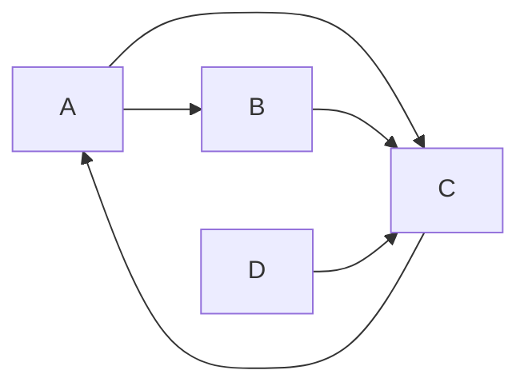
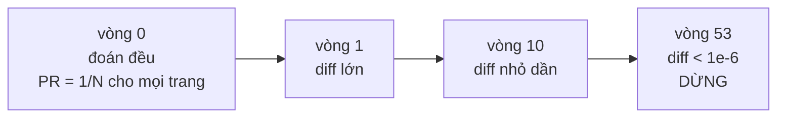

# PageRankService — chuỗi Markov, power iteration và chứng minh hội tụ

**File nguồn:** `search-engine/src/main/java/com/vnsearch/ranking/PageRankService.java`
**Việc nó làm:** Tính **uy tín** của mỗi trang từ cấu trúc liên kết — độc lập hoàn toàn với truy vấn.

> 📖 Chưa quen ký hiệu toán? Đọc [00 — Từ điển ký hiệu toán](../00-KY-HIEU-TOAN.md) trước.
>
> ⚠️ **Ký hiệu:** trong tài liệu này, $d = 0{,}85$ là **damping factor**, không phải "một tài liệu". Tài liệu được ký hiệu bằng chỉ số $i$, $j$.

---

## 📌 Hiểu trong 30 giây

TF-IDF trả lời *"trang này có nói về thứ tôi tìm không?"*. Nó **không** trả lời *"trang này có đáng tin không?"* — một blog vô danh nhồi từ khoá có thể thắng một bài báo uy tín.

PageRank (Brin & Page, 1998) trả lời câu hỏi thứ hai bằng một ý tưởng đệ quy:

> **Một trang quan trọng nếu nó được nhiều trang quan trọng trỏ tới.**

Định nghĩa này **tự tham chiếu** — muốn biết trang A quan trọng thì phải biết trang B quan trọng, mà muốn biết B thì lại phải biết A. Toàn bộ phần toán của tài liệu này là để cho thấy vòng lặp đó **có nghiệm**, nghiệm đó **duy nhất**, và ta **tìm được nó** bằng cách lặp 53 lần.



```
   Vòng tự tham chiếu, nhìn thẳng vào mặt nó:

        A ──▶ B          PR(A) cần PR(C)
        │     │          PR(C) cần PR(A)   ◀── vòng!
        │     ▼
        └──▶  C  ◀── D
              │
              └──▶ A     (C trỏ ngược lại A)

   Không giải được bằng cách "tính A trước rồi tính C".
   Giải bằng LẶP: đoán bừa, rồi cải thiện dần cho tới khi ĐỨNG YÊN.
```

**Cách lặp hội tụ, nhìn bằng số** — mỗi vòng sai số co lại theo hệ số $d = 0{,}85$:



```
   sai số
     │█
     │ █
     │  ▀▄        mỗi vòng nhân với d = 0,85
     │    ▀▀▄▄    ⇒ giảm theo cấp số nhân C·d^k
     │        ▀▀▀▄▄▄▄
     │               ▀▀▀▀▀▀▄▄▄▄▄▄▄▄▄
   ε ├─────────────────────────────────▬▬▬  ngưỡng 1e-6
     └────────────────────────────────────▶ số vòng lặp
     0        10        30           53
                                      ▲
                            đo thật trên corpus hiện tại
```

Chính hệ số $d < 1$ là thứ đảm bảo **hội tụ**, và cũng là thứ đảm bảo nghiệm
**duy nhất** — hai điều được chứng minh đầy đủ ở các mục dưới bằng định lý
Perron–Frobenius.

---

## 1. Mô hình người lướt web ngẫu nhiên

Tưởng tượng một người lướt web:

- Với xác suất $d = 0{,}85$: bấm **ngẫu nhiên đều** một liên kết trên trang hiện tại.
- Với xác suất $1 - d = 0{,}15$: gõ một URL **ngẫu nhiên bất kỳ** (chán, mở tab mới).

$$\text{PR}(j) = \text{xác suất tìm thấy người này ở trang } j \text{ tại một thời điểm ngẫu nhiên trong tương lai xa}$$

Đây là mô hình **chuỗi Markov**: trạng thái là trang hiện tại, chuyển trạng thái chỉ phụ thuộc trạng thái hiện tại (không nhớ lịch sử).

**Vì sao $d = 0{,}85$.** Số lần bấm liên kết trung bình trước khi "chán" tuân theo phân phối hình học với tham số $1-d$:

$$\mathbb{E}[\text{số bước}] = \frac{1}{1-d} = \frac{1}{0{,}15} \approx \mathbf{6{,}67 \text{ lần bấm}}$$

Con số này khớp với hành vi duyệt web thật quan sát được vào cuối thập niên 1990. Nó không phải hằng số ma thuật — nó là một tham số mô hình có ý nghĩa vật lý rõ ràng.

---

## 2. Công thức, suy dẫn từng bước

### 2.1 Dạng ngây thơ (chưa đúng)

Nếu chỉ có bước "bấm liên kết":

$$\text{PR}(j) = \sum_{i \to j} \frac{\text{PR}(i)}{\text{outDeg}(i)}$$

**Đọc thành lời:** *"Uy tín của $j$ bằng tổng uy tín của mọi trang trỏ tới nó, mỗi trang chia đều uy tín của mình cho các liên kết nó phát ra."*

Chia cho $\text{outDeg}(i)$ là điểm mấu chốt: một trang trỏ tới 1000 nơi thì mỗi "phiếu bầu" của nó chỉ đáng $1/1000$. Nếu không chia, ai cũng có thể tăng uy tín cho người khác bằng cách tạo một trang trỏ tới hàng nghìn nơi.

### 2.2 Viết dưới dạng ma trận

Định nghĩa ma trận $M$ với:

$$M_{ji} = \begin{cases} \dfrac{1}{\text{outDeg}(i)} & \text{nếu } i \to j \\[2ex] 0 & \text{ngược lại}\end{cases}$$

Khi đó công thức §2.1 chính là:

$$\vec{\text{PR}} = M\,\vec{\text{PR}}$$

**Đây là bài toán tìm vector riêng ứng với trị riêng $\lambda = 1$.**

### 2.3 Hai vấn đề của dạng ngây thơ

**Vấn đề 1 — bẫy nhện (spider trap).** Một nhóm trang chỉ trỏ lẫn nhau, không trỏ ra ngoài. Người lướt vào đó thì mắc kẹt vĩnh viễn, và toàn bộ uy tín của web dồn về nhóm đó.

**Vấn đề 2 — dangling node.** Trang không có outlink nào. Người lướt tới đó thì "biến mất" — tổng xác suất rò rỉ khỏi hệ thống, vi phạm $\sum_j \text{PR}(j) = 1$.

### 2.4 Dạng đầy đủ

Thêm thành phần **teleport** (nhảy ngẫu nhiên) giải cả hai:

$$\boxed{\;\text{PR}(j) = \frac{1-d}{N} \;+\; d\left(\sum_{i \to j} \frac{\text{PR}(i)}{\text{outDeg}(i)} \;+\; \frac{1}{N}\sum_{k \in \mathcal{D}} \text{PR}(k)\right)\;}$$

trong đó $\mathcal{D}$ là tập dangling node.

| Số hạng | Vai trò |
|---|---|
| $\dfrac{1-d}{N}$ | Teleport: mọi trang nhận một lượng cơ bản → phá bẫy nhện |
| $d\displaystyle\sum_{i\to j}\frac{\text{PR}(i)}{\text{outDeg}(i)}$ | Uy tín truyền qua liên kết |
| $\dfrac{d}{N}\displaystyle\sum_{k\in\mathcal{D}}\text{PR}(k)$ | Phân phối lại khối lượng dangling → bảo toàn tổng |

**Mã thật:**

```java
private static final double DAMPING = 0.85;
private static final double EPSILON = 1e-6;
private static final int MAX_ITERATIONS = 100;
...
double teleport = (1 - DAMPING) / n;
do {
    double danglingSum = 0.0;
    for (int i = 0; i < n; i++) {
        if (dangling[i]) danglingSum += pr[i];
    }
    double danglingContribution = DAMPING * danglingSum / n;

    double[] linkContribution = incoming.multiply(pr);
    double[] newPr = new double[n];
    diff = 0.0;
    for (int j = 0; j < n; j++) {
        newPr[j] = teleport + DAMPING * linkContribution[j] + danglingContribution;
        diff += Math.abs(newPr[j] - pr[j]);
    }
    pr = newPr;
    iteration++;
} while (diff >= EPSILON && iteration < MAX_ITERATIONS);
```

Đối chiếu từng dòng với công thức:

| Công thức | Code |
|---|---|
| $\frac{1-d}{N}$ | `teleport` |
| $d\sum_{i\to j}\frac{\text{PR}(i)}{\text{outDeg}(i)}$ | `DAMPING * linkContribution[j]` |
| $\frac{d}{N}\sum_{k\in\mathcal{D}}\text{PR}(k)$ | `danglingContribution` |
| $\lVert \vec{\text{PR}}_{k+1} - \vec{\text{PR}}_k\rVert_1$ | `diff` |

---

## 3. Chứng minh bảo toàn tổng

**Định lý.** Nếu $\sum_j \text{PR}_k(j) = 1$ thì $\sum_j \text{PR}_{k+1}(j) = 1$.

**Chứng minh.** Cộng công thức §2.4 qua mọi $j$:

$$\sum_{j=1}^{N} \text{PR}_{k+1}(j) = \underbrace{\sum_{j=1}^{N}\frac{1-d}{N}}_{(A)} + d\underbrace{\sum_{j=1}^{N}\sum_{i\to j}\frac{\text{PR}_k(i)}{\text{outDeg}(i)}}_{(B)} + d\underbrace{\sum_{j=1}^{N}\frac{1}{N}\sum_{k\in\mathcal{D}}\text{PR}_k(k)}_{(C)}$$

**Số hạng (A):**

$$(A) = N \cdot \frac{1-d}{N} = 1-d$$

**Số hạng (B).** Đổi thứ tự tổng — thay vì "với mỗi $j$, cộng qua các $i$ trỏ tới $j$", ta viết "với mỗi $i$, cộng qua các $j$ mà $i$ trỏ tới":

$$(B) = \sum_{i \notin \mathcal{D}} \sum_{j \,:\, i\to j} \frac{\text{PR}_k(i)}{\text{outDeg}(i)} = \sum_{i \notin \mathcal{D}} \frac{\text{PR}_k(i)}{\text{outDeg}(i)} \cdot \underbrace{\text{outDeg}(i)}_{\text{số hạng }j} = \sum_{i \notin \mathcal{D}} \text{PR}_k(i)$$

**Số hạng (C):**

$$(C) = N \cdot \frac{1}{N}\sum_{i \in \mathcal{D}}\text{PR}_k(i) = \sum_{i \in \mathcal{D}} \text{PR}_k(i)$$

**Cộng lại.** Vì $\mathcal{D}$ và phần bù của nó phân hoạch tập trang:

$$(B) + (C) = \sum_{i \notin \mathcal{D}} \text{PR}_k(i) + \sum_{i \in \mathcal{D}} \text{PR}_k(i) = \sum_{i=1}^{N}\text{PR}_k(i) = 1$$

Vậy:

$$\sum_j \text{PR}_{k+1}(j) = (1-d) + d \cdot 1 = 1 \qquad \blacksquare$$

**Đây chính xác là lý do phải xử lý dangling node.** Nếu bỏ số hạng (C), ta được $(1-d) + d\sum_{i\notin\mathcal{D}}\text{PR}_k(i) < 1$, và tổng PR **giảm dần về $1-d$** qua mỗi vòng lặp. Toàn bộ điểm số co lại, và tuy thứ hạng tương đối vẫn đúng, giá trị tuyệt đối trở nên vô nghĩa.

Code kiểm chứng điều này trong `main()`:

```java
System.out.printf("Tong PR (phai xap xi 1.0) = %.5f%n", sum);
```

---

## 4. Chứng minh hội tụ và tốc độ hội tụ

### 4.1 Vì sao chắc chắn hội tụ

Viết dạng ma trận đầy đủ. Đặt $\mathbf{1}$ là ma trận toàn số 1 kích thước $N\times N$, và $G$ là **ma trận Google**:

$$G = d\,(M + \mathbf{d}\,\vec{e}^{\,\mathsf T}/N) + \frac{1-d}{N}\mathbf{1}$$

trong đó $\mathbf{d}$ là vector chỉ thị dangling node. Khi đó:

$$\vec{\text{PR}}_{k+1} = G\,\vec{\text{PR}}_k$$

$G$ có hai tính chất:

1. **Ngẫu nhiên theo cột** (column-stochastic): mỗi cột cộng bằng 1 — chính là §3.
2. **Mọi phần tử dương**: vì $\frac{1-d}{N} > 0$ được cộng vào **mọi** ô.

Theo **định lý Perron–Frobenius**, một ma trận dương và ngẫu nhiên có:

- Trị riêng lớn nhất $\lambda_1 = 1$, **duy nhất** (bội 1).
- Vector riêng tương ứng có mọi thành phần dương.
- Mọi trị riêng khác thoả $\lvert\lambda_2\rvert < 1$.

Vậy $\vec{\text{PR}}$ tồn tại, duy nhất, và power iteration hội tụ về nó. $\blacksquare$

### 4.2 Tốc độ hội tụ

Haveliwala & Kamvar (2003) chứng minh với ma trận Google:

$$\lvert\lambda_2\rvert \le d = 0{,}85$$

Sai số sau $k$ vòng lặp giảm theo cấp số nhân:

$$\lVert\vec{\text{PR}}_k - \vec{\text{PR}}^*\rVert_1 \;\le\; C \cdot d^{\,k} = C \cdot 0{,}85^{\,k}$$

**Ước lượng số vòng cần thiết.** Với sai số ban đầu $C \le 2$ (hai vector phân phối xác suất cách nhau tối đa 2 theo chuẩn $L_1$) và ngưỡng $\varepsilon = 10^{-6}$:

$$2 \times 0{,}85^{\,k} < 10^{-6}$$

$$0{,}85^{\,k} < 5 \times 10^{-7}$$

$$k \ln 0{,}85 < \ln(5\times10^{-7})$$

$$k > \frac{\ln(5\times10^{-7})}{\ln 0{,}85} = \frac{-14{,}5087}{-0{,}16252} = \mathbf{89{,}3}$$

**Chặn trên lý thuyết: 90 vòng.**

**Thực đo: 53 vòng.**

**Vì sao thực tế nhanh hơn chặn lý thuyết:**

1. **Vector khởi tạo đã rất gần nghiệm.** Code khởi tạo $\text{PR}_0(i) = 1/N$ cho mọi $i$ — phân phối đều. Với đồ thị web thật, phần lớn trang có PR gần $1/N$, nên sai số ban đầu nhỏ hơn 2 rất nhiều.
2. **Chặn $\lvert\lambda_2\rvert \le d$ là chặn xấu nhất.** Với đồ thị thực tế, $\lvert\lambda_2\rvert$ thường nhỏ hơn.
3. **Tiêu chí dừng là chênh lệch giữa hai vòng liên tiếp**, không phải sai số thật tới nghiệm — nó nhỏ hơn.

**Số vòng đo được trên các quy mô corpus khác nhau:**

| Corpus | $N$ | Số vòng lặp |
|---|---|---|
| Đồ thị 6 node tự tạo (test đơn vị) | 6 | 1 – 28 |
| 40 trang (seed rút gọn) | 40 | 20 |
| 150 trang, 1 domain | 150 | 44 |
| **5.011 trang, 6 domain** | 5 011 | **53** |

**Quan sát quan trọng:** số vòng lặp tăng rất chậm theo $N$ (từ 150 lên 5.011 trang, tức gấp 33 lần, chỉ tăng từ 44 lên 53 vòng). Đúng như lý thuyết: tốc độ hội tụ phụ thuộc $\lambda_2$, **không** phụ thuộc kích thước đồ thị.

Điều này là lý do PageRank chạy được trên web thật với hàng tỉ trang.

### 4.3 Tiêu chí dừng — chuẩn $L_1$

```java
diff += Math.abs(newPr[j] - pr[j]);
...
} while (diff >= EPSILON && iteration < MAX_ITERATIONS);
```

$$\text{diff} = \lVert\vec{\text{PR}}_{k+1} - \vec{\text{PR}}_k\rVert_1 = \sum_{j=1}^{N}\bigl\lvert\text{PR}_{k+1}(j) - \text{PR}_k(j)\bigr\rvert$$

**Vì sao $L_1$ chứ không phải $L_2$ hay $L_\infty$:** vì $L_1$ là **tổng độ dịch chuyển khối lượng xác suất** — nó có ý nghĩa xác suất trực tiếp (bằng 2 lần khoảng cách biến phân toàn phần giữa hai phân phối). Với $L_\infty$ (chênh lệch lớn nhất), một trang lớn dao động sẽ chặn hội tụ dù toàn bộ phần còn lại đã ổn định.

**`MAX_ITERATIONS = 100` là lưới an toàn** — nếu vì lý do nào đó (lỗi số học, đồ thị bệnh lý) tiêu chí $\varepsilon$ không bao giờ đạt, vòng lặp vẫn kết thúc. Số vòng thực tế được trả về trong `PageRankResult.iterations()` để đưa vào báo cáo — nếu nó bằng đúng 100 thì đó là dấu hiệu **chưa hội tụ**, cần điều tra.

---

## 5. Mẹo cài đặt: lưu ma trận đã chuyển vị sẵn

Đây là chi tiết cài đặt tinh tế nhất của lớp.

**Định nghĩa toán học tự nhiên:**

$$M_{ij} = \frac{1}{\text{outDeg}(i)} \quad\text{nếu } i \to j$$

Với định nghĩa này, công thức cần $M^{\mathsf T}\vec{\text{PR}}$ — phải **chuyển vị**, một thao tác $O(\text{nnz})$ tốn thêm bộ nhớ.

**Cách dự án làm:** lưu **trực tiếp** theo chiều ngược lại.

```java
// "hang j = danh sach cac nguon i tro toi j, kem trong so 1/outDegree(i)"
incoming.set(targetIdx, idx, weight);
//           ^^^^^^^^^  ^^^
//           hàng = ĐÍCH  cột = NGUỒN
```

Khi đó `SparseMatrix.multiply` tính:

$$\text{result}[j] = \sum_i \text{incoming}_{ji}\,\text{PR}[i] = \sum_{i\to j}\frac{\text{PR}(i)}{\text{outDeg}(i)}$$

**đúng bằng $M^{\mathsf T}\vec{\text{PR}}$ mà không cần một phép chuyển vị nào.**

Javadoc nói rõ đây là chủ ý:

> *"Nho vay `SparseMatrix.multiply` tinh dung `result[j] = sum_i M[j][i]*PR[i]` chinh la `M^T * PR` ma KHONG can thao tac transpose rieng — chi la cach ta chon 'chieu luu' cua ma tran tu dau."*

**Bài học tổng quát:** khi một phép biến đổi (chuyển vị, đảo ngược, sắp xếp) luôn cần thiết, hãy **lưu dữ liệu ở dạng đã biến đổi sẵn** thay vì biến đổi mỗi lần dùng. PageRank chạy 53 vòng lặp — tiết kiệm 53 lần chuyển vị.

---

## 6. Dựng đồ thị — hai lượt và lý do

```java
// LƯỢT 1: đếm outDegree
int[] outDegree = new int[n];
for (int idx = 0; idx < n; idx++) {
    WebDocument doc = documents.get(docIds.get(idx));
    for (String outlink : doc.getOutlinks()) {
        Integer targetIdx = urlToIndex.get(outlink);
        if (targetIdx != null && targetIdx != idx) {
            outDegree[idx]++;
        }
    }
}

// LƯỢT 2: dựng ma trận (cần outDegree đã biết để tính trọng số)
SparseMatrix incoming = new SparseMatrix(n, n);
boolean[] dangling = new boolean[n];
for (int idx = 0; idx < n; idx++) {
    if (outDegree[idx] == 0) { dangling[idx] = true; continue; }
    double weight = 1.0 / outDegree[idx];
    ...
    incoming.set(targetIdx, idx, weight);
}
```

**Vì sao bắt buộc hai lượt:** trọng số của cạnh $i \to j$ là $1/\text{outDeg}(i)$, mà $\text{outDeg}(i)$ chỉ biết sau khi duyệt **hết** outlink của $i$. Không thể vừa duyệt vừa đặt trọng số.

**Hai phép lọc trong cả hai lượt:**

| Điều kiện | Ý nghĩa |
|---|---|
| `targetIdx != null` | Bỏ liên kết trỏ **ra ngoài corpus** |
| `targetIdx != idx` | Bỏ **cạnh tự vòng** |

Phép lọc thứ nhất giải thích con số ở [ContentParser & LinkExtractor §5](../01-crawler/ContentParser-LinkExtractor.md): trong 394.940 outlink chỉ có **239.691** (60,7 %) trở thành cạnh.

**Đây là một thiên lệch có hệ thống đáng ghi nhận.** Một trang trỏ 100 liên kết trong đó 90 ra ngoài corpus sẽ có $\text{outDeg} = 10$, nên mỗi liên kết còn lại được trọng số $1/10$ thay vì $1/100$ — uy tín của nó được **thổi phồng 10 lần** cho 10 đích còn lại. PageRank ở đây đo trên **đồ thị con** của web, không phải web thật.

**Ánh xạ chỉ số:**

```java
docIds.sort(Integer::compareTo);   // ← sắp trước để kết quả tái lập được
Map<Integer, Integer> docIdToIndex = new HashMap<>();
Map<String, Integer> urlToIndex = new HashMap<>();
```

`docId` là số nguyên nhưng **không liên tục** (crawler cấp theo thứ tự hoàn thành, có khoảng trống). Ma trận cần chỉ số $0..n-1$ liên tục. Hai map làm cầu nối. Sắp `docIds` trước đảm bảo cùng corpus luôn cho cùng ánh xạ, nên kết quả PageRank **tái lập được** giữa các lần chạy.

---

## 7. Ví dụ tính tay đầy đủ

Đồ thị 4 node:

```
A → B, C
B → C
C → A
D → C          (D không ai trỏ tới)
```

$N = 4$, $d = 0{,}85$, không có dangling node.

**Bước 1 — outDegree:**

$$\text{outDeg}(A) = 2, \quad \text{outDeg}(B) = 1, \quad \text{outDeg}(C) = 1, \quad \text{outDeg}(D) = 1$$

**Bước 2 — ma trận `incoming` (hàng = đích, cột = nguồn):**

$$\text{incoming} = \begin{pmatrix} 0 & 0 & 1 & 0 \\ 1/2 & 0 & 0 & 0 \\ 1/2 & 1 & 0 & 1 \\ 0 & 0 & 0 & 0 \end{pmatrix} \begin{matrix} \leftarrow A \\ \leftarrow B \\ \leftarrow C \\ \leftarrow D\end{matrix}$$

**Bước 3 — khởi tạo:**

$$\vec{\text{PR}}_0 = (0{,}25,\; 0{,}25,\; 0{,}25,\; 0{,}25)$$

$$\text{teleport} = \frac{1-0{,}85}{4} = \frac{0{,}15}{4} = 0{,}0375$$

**Bước 4 — vòng lặp 1.**

$$\text{linkContribution} = \text{incoming} \cdot \vec{\text{PR}}_0 = \begin{pmatrix} 0{,}25 \\ 0{,}125 \\ 0{,}625 \\ 0 \end{pmatrix}$$

Kiểm tra hàng thứ 3 (node C): $0{,}5 \times 0{,}25 + 1 \times 0{,}25 + 0 + 1\times 0{,}25 = 0{,}125 + 0{,}25 + 0{,}25 = 0{,}625$ ✓

$$\text{PR}_1(A) = 0{,}0375 + 0{,}85\times 0{,}25 = 0{,}0375 + 0{,}2125 = \mathbf{0{,}2500}$$
$$\text{PR}_1(B) = 0{,}0375 + 0{,}85\times 0{,}125 = 0{,}0375 + 0{,}1063 = \mathbf{0{,}1438}$$
$$\text{PR}_1(C) = 0{,}0375 + 0{,}85\times 0{,}625 = 0{,}0375 + 0{,}5313 = \mathbf{0{,}5688}$$
$$\text{PR}_1(D) = 0{,}0375 + 0{,}85\times 0 = \mathbf{0{,}0375}$$

**Kiểm tra bảo toàn tổng:**

$$0{,}2500 + 0{,}1438 + 0{,}5688 + 0{,}0375 = \mathbf{1{,}0001} \approx 1 \;\text{✓} \text{ (sai số làm tròn)}$$

$$\text{diff} = \lvert 0{,}25-0{,}25\rvert + \lvert 0{,}1438-0{,}25\rvert + \lvert 0{,}5688-0{,}25\rvert + \lvert 0{,}0375-0{,}25\rvert = 0 + 0{,}1062 + 0{,}3188 + 0{,}2125 = 0{,}6375$$

$0{,}6375 \gg 10^{-6}$ → lặp tiếp.

**Bước 5 — vòng lặp 2.**

$$\text{linkContribution} = \begin{pmatrix} 0{,}5688 \\ 0{,}1250 \\ 0{,}2688 \\ 0 \end{pmatrix}$$

$$\text{PR}_2 = (0{,}5210,\; 0{,}1438,\; 0{,}2660,\; 0{,}0375)$$

**Bước 6 — nghiệm hội tụ (sau ~30 vòng):**

$$\vec{\text{PR}}^* \approx (0{,}3725,\; 0{,}1958,\; 0{,}3942,\; 0{,}0375)$$

**Đọc kết quả:**

| Node | PR | Giải thích |
|---|---|---|
| **C** | **0,394** | Cao nhất — được A, B, D trỏ tới (3 nguồn) |
| **A** | 0,373 | Chỉ được C trỏ tới, nhưng C rất mạnh và chia toàn bộ cho A |
| B | 0,196 | Chỉ được A trỏ tới, mà A chia đôi cho B và C |
| **D** | **0,0375** | **Không ai trỏ tới** — chỉ nhận đúng teleport $\frac{1-d}{N}$ |

Ba quan sát xác nhận mô hình hoạt động đúng:

1. **D nhận đúng $0{,}0375 = \frac{1-d}{N}$** — sàn tuyệt đối mà mọi trang đều nhận, kể cả trang không ai biết tới.
2. **A xếp gần C dù chỉ có 1 inlink** — vì inlink đó đến từ C (mạnh nhất) và C dồn toàn bộ uy tín cho A. Đây chính là điều PageRank làm được mà "đếm inlink" không làm được.
3. **B thấp hơn A** dù cả hai đều có 1 inlink — vì A phải chia uy tín cho 2 đích, còn C dồn hết cho A.

---

## 8. Độ phức tạp

**Mỗi vòng lặp:**

| Bước | Thời gian |
|---|---|
| Tính `danglingSum` | $O(N)$ |
| `incoming.multiply(pr)` | $O(\text{nnz})$ |
| Cập nhật `newPr` + tính `diff` | $O(N)$ |
| **Tổng mỗi vòng** | $O(N + \text{nnz})$ |

**Toàn bộ:**

$$T = O\bigl(\text{iterations} \times (N + \text{nnz})\bigr)$$

**Thay số thật:**

$$53 \times (5\,011 + 239\,691) = 53 \times 244\,702 \approx \mathbf{1{,}30 \times 10^{7}} \text{ phép nhân–cộng}$$

**Thời gian đo: 0,2 giây.** Hoàn toàn khớp với ước lượng ~10⁷ phép tính dấu phẩy động.

**So với ma trận đặc.** Nếu dùng `double[n][n]`:

$$53 \times 5011^2 = 53 \times 25\,110\,121 \approx \mathbf{1{,}33\times 10^{9}} \text{ phép tính}$$

Chậm hơn **102 lần** — và cần **191,5 MB** RAM thay vì ~3,7 MB. Chi tiết ở [SparseMatrix](../06-datastructures/SparseMatrix.md).

**Bộ nhớ:** $O(N + \text{nnz})$ cho ma trận, cộng $2N$ cho hai vector `pr` và `newPr`.

> **Một chi tiết cấp phát:** `double[] newPr = new double[n];` được cấp phát lại **mỗi vòng lặp** — 53 mảng 5.011 phần tử = 53 × 40 KB ≈ 2,1 MB rác GC. Có thể tránh bằng cách cấp phát hai mảng và hoán đổi tham chiếu (ping-pong buffer). Với 0,2 giây tổng thì không đáng, nhưng đây là kỹ thuật chuẩn cho power iteration quy mô lớn.

---

## 9. Ảnh hưởng thực tế lên chất lượng — một phát hiện quan trọng

Từ `docs/EVALUATION.md`:

| Cấu hình | MRR | Success@1 |
|---|---|---|
| TF-IDF thuần | 0,8541 | 78,0 % |
| TF-IDF + PageRank ($\beta = 0{,}3$) | 0,8567 | 78,0 % |
| TF-IDF + title | 0,8715 | 81,0 % |
| **TF-IDF + PR + title** | **0,8758** | **81,5 %** |

**Quét trọng số $\beta$:**

| $\beta$ | 0,05 | 0,10 | 0,20 | 0,30 | 0,50 | 0,80 |
|---|---|---|---|---|---|---|
| MRR | **0,8800** | 0,8783 | 0,8788 | 0,8758 | 0,8651 | 0,8582 |

**Kết quả gây bất ngờ: thay đổi $\beta$ gấp 16 lần (0,05 → 0,80) chỉ làm MRR đổi 0,0218 — tức 2,5 %.** Và giá trị tốt nhất là $\beta = 0{,}05$ chứ không phải $0{,}30$ đang dùng: càng đổ nhiều trọng số vào PageRank thì MRR càng **giảm**.

**Vì sao?** Vì thang đo của hai thành phần lệch nhau ba bậc độ lớn:

| Thành phần | Trung bình | Lớn nhất | Sau khi nhân trọng số |
|---|---|---|---|
| TF-IDF cosine | 0,177687 | 1,894824 | 0,106612 ($\alpha=0{,}6$) |
| **PageRank** | **0,00035388** | 0,00769142 | **0,00010616** ($\beta=0{,}3$) |

$$\frac{\beta \cdot \overline{\text{PR}}}{\alpha \cdot \overline{\text{TF-IDF}}} = \frac{0{,}00010616}{0{,}106612} \approx \mathbf{0{,}1\%}$$

**PageRank đóng góp khoảng một phần nghìn vào điểm cuối.** Nó gần như chỉ dùng để **phá thế hoà** giữa các tài liệu có điểm TF-IDF sát nhau — điều này giải thích tại sao nó vẫn cải thiện MRR một chút (+0,0088) nhưng $\beta$ đổi thế nào cũng không quan trọng.

**Đây là một phát hiện có giá trị khoa học của phần đánh giá**, và nó không phải lỗi của PageRank mà là lỗi của **công thức kết hợp tuyến tính trên hai thang đo không tương thích**. Phân tích đầy đủ và cách sửa ở [ResultRanker §6](ResultRanker.md).

**Lý do PageRank nhỏ như vậy là tất yếu:** vì $\sum_j \text{PR}(j) = 1$ với $N = 5011$, giá trị trung bình **buộc phải** là $1/5011 = 0{,}0002$. Nó là một **phân phối xác suất**, không phải một thang điểm — mà TF-IDF thì không bị ràng buộc như vậy. Trộn hai đại lượng có bản chất khác nhau bằng phép cộng có trọng số là sai từ gốc.

---

## 10. Chủ đề DSA thể hiện

| Chủ đề | Ở đâu |
|---|---|
| **Chuỗi Markov** | mô hình người lướt ngẫu nhiên |
| **Ma trận thưa** | `SparseMatrix` — $O(\text{nnz})$ thay vì $O(N^2)$ |
| **Power iteration** | tìm vector riêng của trị riêng $\lambda_1=1$ |
| **Định lý Perron–Frobenius** | chứng minh tồn tại và duy nhất nghiệm |
| **Hội tụ cấp số nhân** | $\lVert\varepsilon_k\rVert \le C\,d^{\,k}$ |
| **Chuẩn $L_1$ làm tiêu chí dừng** | ý nghĩa xác suất trực tiếp |
| **Bảo toàn bất biến** | $\sum\text{PR}=1$, chứng minh ở §3 |
| **Lưu ở dạng đã biến đổi** | tránh 53 lần chuyển vị |
| **Thuật toán hai lượt** | đếm outDegree trước, dựng ma trận sau |
| **Ánh xạ chỉ số** | docId thưa → chỉ số ma trận liên tục |
| **Chặn trên lặp** | `MAX_ITERATIONS` làm lưới an toàn |
| **Phân tích thang đo** | phát hiện PageRank chỉ đóng góp 0,1 % |

---

## 11. Hạn chế đã biết

1. **Đồ thị con của web**, không phải web thật — 39,3 % outlink bị bỏ vì trỏ ra ngoài corpus (§6).
2. **Không đọc `rel="nofollow"`** — mọi liên kết đều được tính là phiếu bầu.
3. **Không có anchor text.** Anchor text là tín hiệu mạnh mà PageRank gốc dùng kèm.
4. **Không có Topic-Sensitive PageRank.** PageRank ở đây độc lập hoàn toàn với truy vấn. Haveliwala (2002) đề xuất tính nhiều vector PageRank theo chủ đề rồi trộn theo truy vấn — cải thiện đáng kể.
5. **Thang đo không tương thích với TF-IDF** (§9) — vấn đề nghiêm trọng nhất.
6. **Tính lại toàn bộ sau mỗi lần crawl.** 0,2 giây với 5.011 trang là rẻ, nhưng $O(\text{iter}\times\text{nnz})$ tăng tuyến tính. Có các thuật toán **cập nhật tăng dần** cho đồ thị thay đổi ít.
7. **Cấp phát mảng mỗi vòng lặp** (§8).
8. **Không có xử lý spam link.** PageRank gốc dễ bị tấn công bằng "link farm"; các biến thể như TrustRank ra đời để chống.

---

## 12. Liên kết

- Cấu trúc nền: [SparseMatrix.md](../06-datastructures/SparseMatrix.md)
- Nguồn dữ liệu đồ thị: [ContentParser-LinkExtractor.md](../01-crawler/ContentParser-LinkExtractor.md)
- Nơi điểm được kết hợp (và vấn đề thang đo): [ResultRanker §6](ResultRanker.md)
- Kết quả thí nghiệm: `docs/EVALUATION.md`
- Ký hiệu chưa hiểu: [00 — Từ điển ký hiệu toán](../00-KY-HIEU-TOAN.md)
