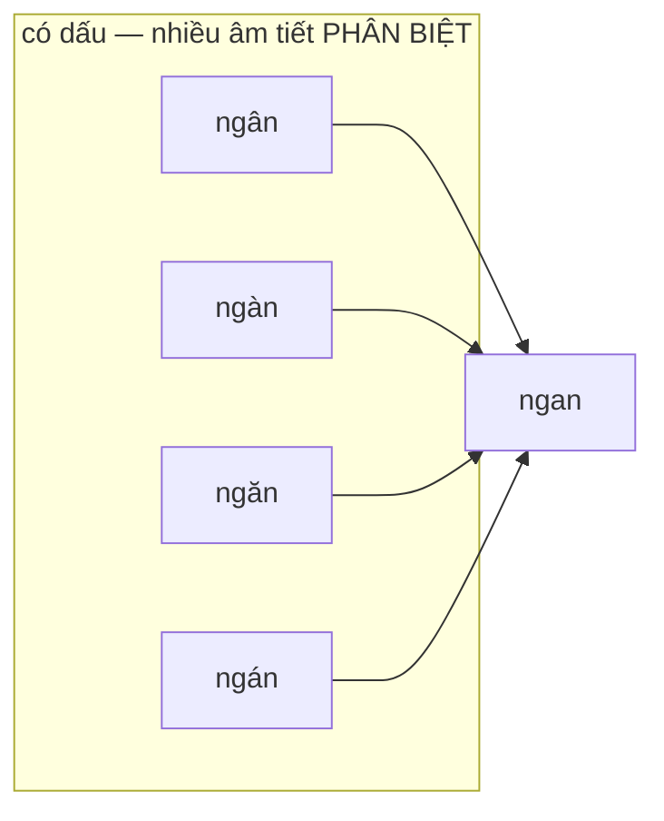
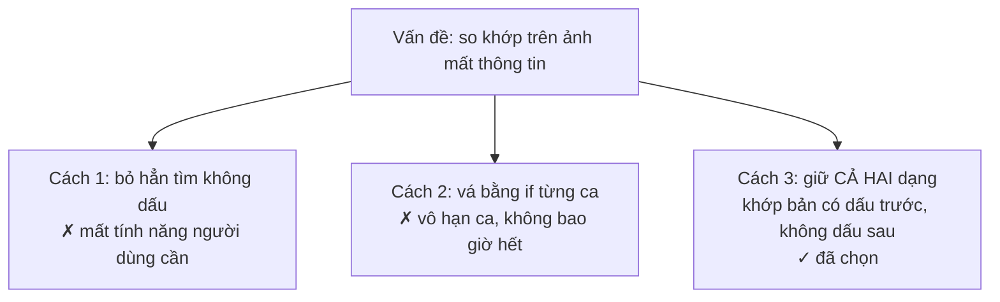

# QuerySyllables — ánh xạ nhiều-một và một lỗi bôi sáng có thật

**File nguồn:** `search-engine/src/main/java/com/vnsearch/ranking/QuerySyllables.java`
**Việc nó làm:** Giữ tập tiếng của truy vấn ở **cả hai dạng** (có dấu / không dấu), để so khớp cho đúng.

> 📖 Chưa quen ký hiệu toán? Đọc [00 — Từ điển ký hiệu toán](../00-KY-HIEU-TOAN.md) trước.

---

## 📌 Hiểu trong 30 giây

Người dùng gõ `ngân hàng`. Snippet trả về bôi sáng cả chữ **ngàn** trong câu *"cắt giảm cả **ngàn** nhân sự"*.

Nguyên nhân: cả `ngân` lẫn `ngàn` khi bỏ dấu đều thành `ngan`.



```
   Ánh xạ bỏ dấu là NHIỀU-MỘT — và không có đường quay lại

     ngân ─┐
     ngàn ─┼──▶  ngan        so khớp xảy ra Ở ĐÂY
     ngăn ─┤              (trên ẢNH, không trên bản gốc)
     ngán ─┘                      │
                                  ▼
                    "ngân hàng" bôi sáng cả "ngàn"

   Mất thông tin ở bước bỏ dấu ⇒ KHÔNG THỂ khôi phục ở bước sau.
```

Đây không phải lỗi cẩu thả — nó là **hệ quả toán học** của việc so khớp trên **ảnh của một ánh xạ nhiều-một**. Và cách sửa cũng phải là một quyết định toán học, không phải một `if` vá tạm.



---

## 1. Bỏ dấu là một ánh xạ NHIỀU-MỘT

Gọi $\sigma$ là phép bỏ dấu. Nó **không đơn ánh**:

$$\sigma(\text{ngân}) = \sigma(\text{ngàn}) = \sigma(\text{ngắn}) = \sigma(\text{ngăn}) = \texttt{ngan}$$

Với ánh xạ nhiều-một, **nghịch ảnh** của một phần tử là cả một tập:

$$\sigma^{-1}(\texttt{ngan}) = \{\text{ngan}, \text{ngân}, \text{ngàn}, \text{ngắn}, \text{ngăn}, \text{ngán}, \ldots\}$$

**Định lý (hiển nhiên nhưng hay bị quên):**

> So khớp trên **ảnh** của một ánh xạ nhiều-một thì **mất khả năng phân biệt** các nghịch ảnh.

Nghĩa là:

$$\sigma(a) = \sigma(b) \;\not\Longrightarrow\; a = b$$

Code cũ so khớp bằng $\sigma(\text{truy vấn}) = \sigma(\text{từ trong văn bản})$ — tức so trên ảnh, nên bôi sáng mọi nghịch ảnh.

### 1.1 Đo mức độ mất mát thông tin

Tiếng Việt có 6 thanh điệu × nhiều nguyên âm có dấu phụ. Một âm tiết không dấu điển hình có **4–8 nghịch ảnh** thật sự tồn tại trong từ vựng:

| Ảnh | Nghịch ảnh có nghĩa | Số lượng |
|---|---|---|
| `ngan` | ngan, ngân, ngàn, ngăn, ngắn, ngán, ngạn | 7 |
| `ma` | ma, má, mà, mả, mã, mạ | 6 |
| `bao` | bao, báo, bào, bảo, bão, bạo | 6 |

Bôi sáng trên ảnh cho ra **tỷ lệ dương tính giả ≈ 5–6 lần**.

---

## 2. Nhưng bỏ dấu **vẫn cần** ở khâu tra cứu

Đây là điểm tinh tế nhất, và là lý do không thể xoá bỏ dấu ở mọi nơi.

| Khâu | Đã biết gì | Có nên bỏ dấu? |
|---|---|---|
| **Tra cứu** (chỉ mục) | **Không** biết người dùng sẽ gõ kiểu nào | ✅ **Có** — phải index cả hai dạng để bắt được cả hai |
| **Hiển thị** (bôi sáng) | **Đã biết chính xác** người dùng gõ gì | ❌ **Không** — thừa và gây sai |

> **Nguyên tắc rút ra:** cùng một phép biến đổi có thể **cần thiết ở khâu này** và **có hại ở khâu kia**, tuỳ vào lượng thông tin đã biết tại khâu đó.

Đây là lý do `InvertedIndex` giữ **chỉ mục kép** (có dấu + không dấu) trong cùng một `HashMap` — xem [InvertedIndex §6](../03-index/InvertedIndex.md).

---

## 3. Quy tắc mới — bất đối xứng có chủ ý

| Người dùng gõ | Chế độ khớp | Ví dụ |
|---|---|---|
| `ngân` (**có** dấu) | Chỉ khớp **chính xác** | chỉ sáng `ngân` |
| `ngan` (**không** dấu) | Khớp **lỏng** (theo dạng bỏ dấu) | sáng cả `ngân`, `ngàn`, `ngắn` |

Lập luận: **người gõ có dấu đã thể hiện ý định rõ ràng**; tôn trọng nó. Người gõ không dấu chưa thể hiện ý định nào, nên mở rộng là hợp lý.

```java
public record QuerySyllables(Set<String> exact, Set<String> loose) {

    public static QuerySyllables from(Set<String> terms) {
        Set<String> exact = new HashSet<>();
        Set<String> loose = new HashSet<>();
        for (String term : terms) {
            for (String syllable : term.split("_")) {        // tách từ ghép
                String lower = syllable.toLowerCase(Locale.ROOT);
                if (lower.isEmpty()) continue;
                exact.add(lower);
                // Chỉ mở khớp lỏng khi CHÍNH tiếng trong truy vấn không có dấu.
                if (VietnameseTokenizer.stripDiacritics(lower).equalsIgnoreCase(lower)) {
                    loose.add(lower);
                }
            }
        }
        return new QuerySyllables(exact, loose);
    }
}
```

### 3.1 Kiểm tra "có dấu không" bằng ĐIỂM BẤT ĐỘNG

```java
if (VietnameseTokenizer.stripDiacritics(lower).equalsIgnoreCase(lower)) { ... }
```

Không cần bảng tra ký tự có dấu, không cần regex. Chỉ cần một quan sát:

$$\sigma(s) = s \iff s \text{ không có dấu nào}$$

Nói cách khác: **tập chuỗi không dấu chính là tập điểm bất động của $\sigma$**.

$$\text{Fix}(\sigma) = \{s : \sigma(s) = s\}$$

Đây là kỹ thuật đẹp vì nó **không cần thêm dữ liệu nào** — tái dùng chính hàm đã có, và **không thể lệch** với hàm đó khi bảng ký tự thay đổi.

> Cùng kỹ thuật được dùng ở [`LanguageDetector.looksVietnamese`](../06-datastructures/Trie.md): *"văn bản có ít nhất một ký tự mang dấu ⟺ $\sigma(s) \ne s$"*.

---

## 4. Hàm khớp

```java
public boolean matches(String word) {
    if (word == null || word.isEmpty()) return false;
    String lower = word.toLowerCase(Locale.ROOT);
    if (exact.contains(lower)) return true;                       // ① khớp chính xác
    return !loose.isEmpty()                                       // ② thoát sớm
            && loose.contains(VietnameseTokenizer.stripDiacritics(lower).toLowerCase(Locale.ROOT));
}
```

**Thứ tự hai nhánh có ý nghĩa hiệu năng:** nhánh ① là một phép tra `HashSet` $O(1)$ trên chuỗi **chưa biến đổi**. Nhánh ② phải chạy `stripDiacritics` — một phép chuẩn hoá Unicode $O(L)$ đắt hơn nhiều. Đặt nhánh rẻ trước là **short-circuit theo chi phí tăng dần**, cùng nguyên tắc với đường ống lọc ứng viên.

**`!loose.isEmpty()` thoát sớm:** nếu truy vấn toàn tiếng có dấu, `loose` rỗng và ta **không bao giờ** phải gọi `stripDiacritics`. Với truy vấn tiếng Việt gõ đủ dấu — trường hợp phổ biến nhất — nhánh đắt bị bỏ hoàn toàn.

---

## 5. `titleMatchRatio` — và vì sao phải kẹp trần

```java
public double titleMatchRatio(String title) {
    if (title == null || title.isBlank() || exact.isEmpty()) return 0.0;
    String[] words = title.toLowerCase(Locale.ROOT).split("\\s+");
    int matched = 0;
    for (String word : words) {
        if (matches(stripPunctuation(word))) matched++;
    }
    return Math.min(1.0, (double) matched / exact.size());
    //     ↑ BẮT BUỘC
}
```

Công thức:

$$\text{titleMatchRatio} = \min\!\left(1,\ \frac{\lvert\{w \in \text{title} : \text{matches}(w)\}\rvert}{\lvert\text{exact}\rvert}\right)$$

### 5.1 Vì sao `Math.min(1.0, ...)` không phải phòng xa thừa

Tử số đếm **số lần xuất hiện** trong tiêu đề; mẫu số là **số tiếng phân biệt** của truy vấn. Hai đại lượng này **không cùng bản chất**, nên tỷ số có thể vượt 1.

Ví dụ cụ thể:

```
Truy vấn : "máy tính"          → exact = {máy, tính},  |exact| = 2
Tiêu đề  : "Máy tính và máy tính bảng"
           matched = máy, tính, máy, tính = 4

Không kẹp:  4 / 2 = 2,0   ← tiêu đề nhồi từ khoá được thưởng GẤP ĐÔI
Có kẹp   :  min(1, 2,0) = 1,0
```

> **Đây là một biện pháp chống spam, không phải một phép làm tròn.** Không kẹp thì **keyword stuffing** — kỹ thuật SEO đen nhồi từ khoá vào tiêu đề — được hệ thống thưởng tuỳ ý. Một tiêu đề lặp từ khoá 10 lần sẽ có điểm gấp 5 lần tiêu đề viết tự nhiên.

### 5.2 `stripPunctuation` dùng lớp Unicode

```java
public static String stripPunctuation(String word) {
    return word == null ? "" : word.replaceAll("[^\\p{L}\\p{N}]", "");
}
```

`\p{L}` = mọi ký tự **chữ** trong Unicode, `\p{N}` = mọi ký tự **số**. Quan trọng: cả hai lớp này **bao gồm ký tự tiếng Việt có dấu**, nên phép này bỏ dấu câu mà **không bỏ dấu thanh**.

Nếu viết `[^a-zA-Z0-9]` thay vào đó, `"công-nghệ,"` sẽ thành `"cngngh"` — mất sạch nguyên âm có dấu. Đây là lỗi kinh điển khi xử lý văn bản không phải tiếng Anh.

---

## 6. Vì sao tách thành một `record` riêng

Ba lý do, và cả ba đều là bài học thiết kế:

**1. Tính sẵn một lần, dùng nhiều lần.** `QuerySyllables.from(...)` chạy `split`, `toLowerCase`, `stripDiacritics` cho mọi term của truy vấn. Nếu làm trong vòng lặp chấm điểm, chi phí đó nhân với **số ứng viên**:

```java
// ResultRanker.rank — tính MỘT lần, ngoài mọi vòng lặp
QuerySyllables syllables = QuerySyllables.from(queryTermFrequency.keySet());
for (ScoredCandidate candidate : top) {
    ... snippetBuilder.build(candidate.document().getBodyText(), syllables);
}
```

**2. Dùng chung giữa hai khâu độc lập.** Cả `SnippetBuilder` (bôi sáng) và `TitleBoostScorer` (chấm điểm tiêu đề) cần **cùng một quy tắc khớp**. Nếu mỗi bên tự cài, chúng sẽ trôi lệch — và người dùng sẽ thấy một từ được bôi sáng nhưng không được tính điểm, hoặc ngược lại.

**3. Bất biến → an toàn đa luồng.** `record` với hai `Set` được dựng xong rồi không đổi. Nhiều luồng phục vụ request cùng đọc mà không cần đồng bộ.

---

## 7. Độ phức tạp

| Thao tác | Thời gian | Ghi chú |
|---|---|---|
| `from(terms)` | $O\!\left(\sum_t L_t\right)$ | Một lần mỗi truy vấn |
| `matches(word)` | $O(1)$ nếu khớp chính xác; $O(L)$ nếu phải bỏ dấu | Thoát sớm khi `loose` rỗng |
| `titleMatchRatio(title)` | $O(\lvert\text{title}\rvert)$ | Gọi cho mỗi ứng viên trong `TitleBoostScorer` |
| `stripPunctuation(word)` | $O(L)$ | Regex đã biên dịch sẵn bởi JIT |

Bộ nhớ: $O(q)$ với $q$ = số tiếng phân biệt trong truy vấn — thường 2–6.

---

## 8. Chủ đề DSA thể hiện

| Chủ đề | Ở đâu |
|---|---|
| **Ánh xạ nhiều-một và mất mát thông tin** | §1 |
| **Điểm bất động** của một phép biến đổi | §3.1 |
| **Bảng băm** cho tra cứu $O(1)$ | §4 |
| **Short-circuit theo chi phí tăng dần** | §4 |
| **Chuẩn hoá Unicode**, lớp ký tự `\p{L}` | §5.2 |
| **Kẹp trần chống spam** | §5.1 |
| **Value Object bất biến** (`record`) | §6 |
| **Một nguồn sự thật duy nhất** cho quy tắc dùng chung | §6 |

---

## 9. Hạn chế đã biết

1. **Khớp ở mức tiếng, không ở mức từ ghép.** Truy vấn `máy tính` được tách thành hai tiếng độc lập, nên tiêu đề *"tính toán trên máy chủ"* vẫn khớp cả hai tiếng dù nghĩa hoàn toàn khác. Khớp theo cụm liên tiếp sẽ chính xác hơn nhưng khắt khe hơn.
2. **Không xử lý biến thể chính tả.** `ki-lô-gam` / `kilogam` / `kg` là ba chuỗi khác nhau.
3. **Quy tắc bất đối xứng chưa được đo.** Việc "gõ có dấu thì khớp chính xác" là một quyết định **hợp lý về mặt lập luận** nhưng chưa có thí nghiệm A/B chứng minh nó tốt hơn cho MRR. Đây là hạn chế về **phương pháp**, không phải về mã.
4. **`titleMatchRatio` không tính trọng số theo IDF.** Một tiếng hiếm khớp được tính ngang một tiếng phổ biến khớp, dù tiếng hiếm mang nhiều thông tin hơn nhiều.

---

## 10. Liên kết

- Người dùng thứ nhất — bôi sáng: `ranking/SnippetBuilder.java`
- Người dùng thứ hai — chấm điểm: [03-DECORATOR.md §5](../09-design-patterns/03-DECORATOR.md)
- Phép bỏ dấu và bẫy chữ `đ`: [VietnameseTokenizer](../03-index/VietnameseTokenizer.md)
- Chỉ mục kép có dấu / không dấu: [InvertedIndex](../03-index/InvertedIndex.md)
- Mục lục: [../README.md](../README.md)
