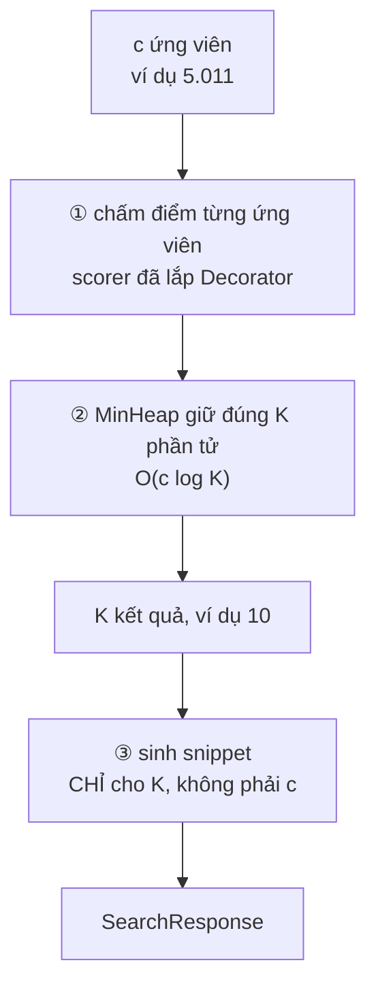
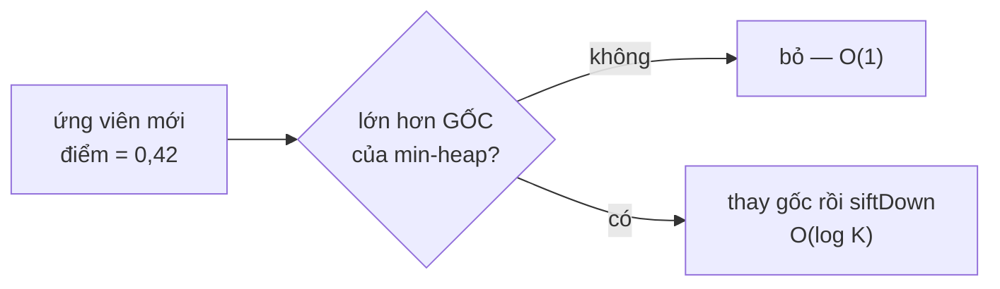

# ResultRanker — kết hợp tín hiệu, top-K và cửa sổ trượt

**File nguồn:** `search-engine/src/main/java/com/vnsearch/ranking/ResultRanker.java`
**Việc nó làm:** Gộp ba tín hiệu thành một điểm, lấy top-N, và sinh đoạn trích có bôi sáng.

> 📖 Chưa quen ký hiệu toán? Đọc [00 — Từ điển ký hiệu toán](../00-KY-HIEU-TOAN.md) trước.


> ### 🔄 Đã cập nhật sau đợt tái cấu trúc
>
> Phần **toán học và thuật toán** dưới đây vẫn đúng nguyên vẹn. Nhưng một số
> đoạn mã trích dẫn và mục *"Hạn chế đã biết"* mô tả **phiên bản trước**.
> Những gì đã thay đổi ở file này:
>
> - **Đã sửa lỗi thang đo 1000×** ở §6: công thức cộng tuyến tính thay bằng **Decorator nhân + log** (`PageRankBoostScorer`, `TitleBoostScorer`), bất biến với thang đo của scorer cơ sở.
> - Sinh snippet đã tách sang `SnippetBuilder`; tập tiếng truy vấn tách sang `QuerySyllables`.
> - **Đã sửa lỗ hổng XSS** — snippet nay thoát ký tự HTML trước khi bọc `<mark>`.
> - Lớp nay chỉ còn hai việc: chấm điểm và lấy top-K.
>

---

## 📌 Hiểu trong 30 giây

Lớp này làm **ba việc** và mỗi việc có một bài học riêng:

1. **Kết hợp tuyến tính** ba tín hiệu — và đây là chỗ có một **lỗi thiết kế thật**, phát hiện được nhờ đo đạc (§6).
2. **Top-K bằng MinHeap** — $O(c\log K)$ thay vì $O(c\log c)$.
3. **Sinh snippet bằng cửa sổ trượt** — $O(n)$ thay vì $O(n \cdot w)$, và chỉ chạy cho $K$ tài liệu thay vì $c$.

Việc thứ ba từng là một **lỗi hiệu năng nghiêm trọng** đã được phát hiện và sửa — quá trình đó được ghi lại ngay trong comment của code.



**Vì sao MinHeap giữ $K$ chứ không sắp xếp cả $c$:**

```
   sắp xếp hết rồi lấy 10 :  O(c log c) = 5011 × log 5011 ≈ 61.000
   MinHeap giữ đúng 10    :  O(c log K) = 5011 × log 10   ≈ 16.600
                                                            ▲
                                                       nhanh ~3,7 lần
```

Mẹo của heap top-K: giữ một **min-heap kích thước K**, gốc là phần tử **tệ
nhất trong nhóm dẫn đầu**. Ứng viên mới chỉ cần so với gốc — thua thì bỏ ngay,
không tốn gì.



**Và chỗ lỗi hiệu năng đã sửa:** trước đây snippet được sinh cho **cả $c$ ứng
viên** rồi mới cắt lấy $K$ — tức là làm 5.011 lần công việc để dùng 10 kết
quả. Đổi thứ tự hai bước ② và ③ là toàn bộ bản vá.

```
   TRƯỚC :  chấm điểm → sinh snippet cho 5.011 → top-K → 10
                        ▲ lãng phí 99,8%
   SAU   :  chấm điểm → top-K → sinh snippet cho 10
```

---

## 1. Công thức kết hợp

### 1.1 Bản cũ — cộng tuyến tính, chôn cứng trong lớp này

$$\text{finalScore}(d) = \alpha \cdot \text{relevance}(d,q) \;+\; \beta \cdot \text{PR}(d) \;+\; \gamma \cdot \text{titleBonus}(d,q)$$

```java
public ResultRanker() { this(0.6, 0.3, 0.1); }          // ← BẢN CŨ
...
double finalScore = alpha * relevance + beta * pageRank + gamma * titleBonus;
```

| Trọng số | Giá trị | Tín hiệu | Trả lời câu hỏi |
|---|---|---|---|
| $\alpha$ | 0,6 | TF-IDF hoặc BM25 | *Trang này có nói về thứ tôi tìm không?* |
| $\beta$ | 0,3 | PageRank | *Trang này có uy tín không?* |
| $\gamma$ | 0,1 | Khớp tiêu đề | *Tiêu đề có đúng thứ tôi gõ không?* |

Ba trọng số cộng lại bằng 1 — nhìn thì gọn, nhưng **§6 sẽ cho thấy điều đó không có ý nghĩa gì** khi ba thành phần không cùng thang đo. Đây là lỗi nghiêm trọng nhất mà dự án tự phát hiện bằng đo đạc.

### 1.2 Bản hiện tại — kết hợp tín hiệu đã rời khỏi lớp này

`ResultRanker` nay **không còn kết hợp tín hiệu**. Nó chỉ gọi `scorer.score(...)` và nhận về một điểm duy nhất:

```java
double finalScore = scorer.score(queryTermFrequency, docId, index);
double pageRank   = pageRankScores == null ? 0.0 : pageRankScores.getOrDefault(docId, 0.0);
scored.add(new ScoredCandidate(doc, finalScore, pageRank));   // pageRank chỉ để HIỂN THỊ
```

Việc kết hợp chuyển sang chuỗi **Decorator** bọc quanh `RelevanceScorer`, dùng **phép nhân** thay phép cộng:

$$\text{final} = \text{base} \times \bigl(1 + w \cdot \hat{p}\bigr), \qquad \hat{p} \in [0,1]$$

`ScorerFactory` lắp chuỗi đó từ `application.properties`, nên `EvaluationHarness` vẫn chạy được các cấu hình ablation mà không sửa code — nhưng nay **người dùng thật cũng đổi được**, chỉ bằng một dòng cấu hình.

> `ResultRanker` từ **ba việc** (chấm điểm + kết hợp tín hiệu + sinh snippet) xuống **một việc**: chấm điểm và lấy top-K. Sinh snippet chuyển sang `SnippetBuilder`, kết hợp tín hiệu chuyển sang Decorator. Xem [**03-DECORATOR.md**](../09-design-patterns/03-DECORATOR.md).

---

## 2. Điểm khớp tiêu đề

```java
private double titleMatchBonus(QuerySyllables queryKeywordSyllables, String title) {
    if (title == null || title.isBlank() || queryKeywordSyllables.exact().isEmpty()) return 0.0;
    String[] titleWords = title.toLowerCase().split("\\s+");
    int matched = 0;
    for (String word : titleWords) {
        if (queryKeywordSyllables.matches(stripPunctuation(word))) matched++;
    }
    return Math.min(1.0, (double) matched / queryKeywordSyllables.exact().size());
}
```

$$\text{titleBonus} = \min\!\left(1,\; \frac{\lvert\{\text{tiếng trong tiêu đề khớp truy vấn}\}\rvert}{\lvert\{\text{tiếng phân biệt của truy vấn}\}\rvert}\right)$$

**Ví dụ.** Truy vấn `máy tính` → tập tiếng $\{$`máy`, `tính`$\}$, mẫu số = 2.

| Tiêu đề | Số tiếng khớp | Bonus |
|---|---|---|
| `Đánh giá máy tính xách tay 2026` | 2 (`máy`, `tính`) | $2/2 = \mathbf{1{,}0}$ |
| `Cách tính tiền điện` | 1 (`tính`) | $1/2 = \mathbf{0{,}5}$ |
| `Công thức nấu ăn` | 0 | $\mathbf{0{,}0}$ |
| `Máy tính và máy tính bảng` | 4 (`máy`,`tính`,`máy`,`tính`) | $\min(1, 4/2) = \mathbf{1{,}0}$ ← bị kẹp |

**Vì sao cần `Math.min(1.0, ...)`.** Tử số đếm **số lần xuất hiện** trong tiêu đề, mẫu số là **số tiếng phân biệt** của truy vấn. Tiêu đề lặp từ khoá có thể cho tỉ số > 1 — hàng cuối bảng. Không kẹp thì một tiêu đề nhồi từ khoá được bonus tuỳ ý, và với $\gamma = 0{,}1$ nó có thể áp đảo TF-IDF.

**Vì sao tín hiệu này hiệu quả đến vậy.** Từ `EVALUATION.md`:

| Cấu hình | MRR | Chênh so với TF-IDF thuần |
|---|---|---|
| TF-IDF thuần | 0,8537 | — |
| TF-IDF + PageRank | 0,8625 | **+0,0088** |
| **TF-IDF + title** | **0,9083** | **+0,0546** |

Title bonus đóng góp **gấp 6 lần** PageRank, dù trọng số của nó ($\gamma = 0{,}1$) chỉ bằng **một phần ba** PageRank ($\beta = 0{,}3$).

Lý do vừa là bản chất (tiêu đề là tín hiệu liên quan rất mạnh — nó là bản tóm tắt do người viết đặt) vừa là thang đo (titleBonus nằm trong $[0,1]$, cùng bậc với TF-IDF, trong khi PageRank ở bậc $10^{-4}$).

---

## 3. Khớp chính xác vs khớp lỏng — sửa một lỗi bôi sáng thật

Đây là phần tinh tế nhất về mặt xử lý ngôn ngữ.

```java
private record QuerySyllables(Set<String> exact, Set<String> loose) {
    boolean matches(String word) {
        String lower = word.toLowerCase();
        if (exact.contains(lower)) return true;
        return !loose.isEmpty()
                && loose.contains(VietnameseTokenizer.stripDiacritics(lower).toLowerCase());
    }
}

private QuerySyllables extractSyllables(Set<String> terms) {
    Set<String> exact = new HashSet<>();
    Set<String> loose = new HashSet<>();
    for (String term : terms) {
        for (String syllable : term.split("_")) {
            String lower = syllable.toLowerCase();
            exact.add(lower);
            // Chi mo khop long khi CHINH tieng trong truy van khong co dau.
            if (VietnameseTokenizer.stripDiacritics(lower).equalsIgnoreCase(lower)) {
                loose.add(lower);
            }
        }
    }
    return new QuerySyllables(exact, loose);
}
```

**Lỗi được sửa, ghi nguyên trong Javadoc:**

> *"Truoc day moi tieng deu bi bo dau truoc khi so khop, khien snippet boi sang nham: truy van `ngân hàng` lam sang ca chu `ngàn` trong `cat giam ca ngan nhan su`, vi ca `ngân` lan `ngàn` deu bo dau thanh `ngan`."*

**Vì sao lỗi này xảy ra.** Bỏ dấu là một **ánh xạ nhiều-một**:

$$\text{ngân} \mapsto \text{ngan}, \qquad \text{ngàn} \mapsto \text{ngan}, \qquad \text{ngắn} \mapsto \text{ngan}$$

So khớp trên ảnh của ánh xạ này thì mất khả năng phân biệt các nghịch ảnh.

**Vì sao vẫn cần bỏ dấu ở khâu chỉ mục.** Ở đó ta **không biết** người dùng sẽ gõ kiểu nào, nên phải index cả hai dạng để bắt được cả hai. Bỏ dấu là **cần thiết** ở khâu tra cứu.

**Nhưng ở khâu bôi sáng thì đã biết chính xác người dùng gõ gì.** Nên quy tắc mới:

| Người dùng gõ | Chế độ khớp | Ví dụ |
|---|---|---|
| `ngân` (**có** dấu) | **Chỉ khớp chính xác** | chỉ sáng `ngân`, không sáng `ngàn` |
| `ngan` (**không** dấu) | Khớp lỏng (bỏ dấu) | sáng cả `ngân`, `ngàn`, `ngắn` |

**Cách kiểm tra "tiếng này có dấu không" rất gọn:**

```java
if (VietnameseTokenizer.stripDiacritics(lower).equalsIgnoreCase(lower)) {
    loose.add(lower);
}
```

*"Nếu bỏ dấu mà chuỗi **không đổi**, tức là nó vốn không có dấu."*

Đây là một **điểm bất động** của phép bỏ dấu:

$$\text{stripDiacritics}(s) = s \iff s \text{ không có dấu}$$

**Bài học tổng quát:**

> Một phép biến đổi mất thông tin (bỏ dấu, hạ chữ thường, stemming) là **cần thiết ở khâu tra cứu** nhưng **có hại ở khâu hiển thị**. Hãy dùng nó ở đúng một tầng.

Và trong `buildSnippet`, comment nhắc lại điều này:

```java
// Truyen tu con NGUYEN DAU vao matches(): chinh no quyet dinh khop
// chinh xac hay khop long, bo dau o day se lam hong quy tac do.
isMatch[i] = queryKeywordSyllables.matches(stripPunctuation(words[i]));
```

---

## 4. Cửa sổ trượt sinh snippet

**Bài toán.** Trong một tài liệu 1.043 token, tìm **cửa sổ 25 từ liên tiếp** chứa nhiều từ khoá nhất.

**Cách ngây thơ.** Với mỗi vị trí bắt đầu, đếm lại số khớp trong cửa sổ:

$$T_{\text{ngây thơ}} = O(n \times w) = 1043 \times 25 = \mathbf{26\,075} \text{ phép kiểm tra}$$

**Cửa sổ trượt.** Khi cửa sổ dịch một bước, chỉ có **hai** phần tử thay đổi: một rời khỏi bên trái, một vào ở bên phải.

```java
int currentMatches = 0;
for (int i = 0; i < windowSize; i++) {
    if (isMatch[i]) currentMatches++;
}
int bestStart = 0;
int bestMatches = currentMatches;
for (int start = 1; start + windowSize <= words.length; start++) {
    if (isMatch[start - 1]) currentMatches--;                  // ← rời khỏi cửa sổ
    if (isMatch[start + windowSize - 1]) currentMatches++;     // ← vào cửa sổ
    if (currentMatches > bestMatches) {
        bestMatches = currentMatches;
        bestStart = start;
    }
}
```

**Bất biến vòng lặp:** *Trước mỗi lần lặp, `currentMatches` bằng đúng số phần tử `true` trong `isMatch[start .. start+w-1]`.*

**Chứng minh.** Đúng ở bước khởi tạo (vòng `for` đầu). Giả sử đúng cho `start`, xét `start+1`: cửa sổ mới là cửa sổ cũ **bỏ** phần tử `start-1`... — chính xác là hai phép cập nhật trong code. ∎

$$T_{\text{cửa sổ trượt}} = O(w) + O(n) = 25 + 1043 = \mathbf{1\,068} \text{ phép kiểm tra}$$

**Nhanh hơn 24,4 lần**, và tỉ lệ này bằng đúng $w$.

**Tính chất số học đằng sau:** tổng trên một cửa sổ là một **tổng tiền tố có hiệu**:

$$S(\text{start}) = P[\text{start}+w] - P[\text{start}]$$

Cửa sổ trượt là cách tính $S$ mà không cần lưu mảng $P$.

**Điều kiện biên `start + windowSize <= words.length`** đảm bảo không đọc quá mảng. Và `windowSize = Math.min(SNIPPET_WINDOW_SIZE, words.length)` xử lý tài liệu ngắn hơn 25 từ.

---

## 5. Tối ưu ba bước — một lỗi hiệu năng thật

Đây là phần được ghi lại chi tiết nhất trong code, vì nó là một **lỗi đã tồn tại và được sửa**.

```java
// BUOC 1 - chi CHAM DIEM moi ung vien, chua sinh snippet.
//
// Sinh snippet la thao tac dat nhat trong ca ham: no phai tach TOAN BO
// bodyText (trung binh hon 1.000 token moi tai lieu) roi truot cua so
// qua tung tu. Truoc day buoc nay chay cho MOI ung vien roi moi cat
// top-N, nghia la voi 500 ung vien thi 490 snippet bi vut di ngay sau
// khi tao ra - chi phi O(so ung vien * do dai tai lieu) hoan toan lang phi.
// Do do tach lam hai buoc: chi diem la du de xep hang.
List<ScoredCandidate> scored = new ArrayList<>(candidateDocIds.size());
for (int docId : candidateDocIds) {
    ...
    scored.add(new ScoredCandidate(doc, finalScore, relevance, pageRank));
}

// BUOC 2 - lay top-N bang MinHeap, O(n log topN).
List<ScoredCandidate> top =
        MinHeap.topK(scored, topN, Comparator.comparingDouble(ScoredCandidate::finalScore));

// BUOC 3 - chi sinh snippet cho dung nhung tai lieu thuc su duoc tra ve.
List<RankedResult> results = new ArrayList<>(top.size());
for (ScoredCandidate candidate : top) {
    results.add(new RankedResult(..., buildSnippet(candidate.document().getBodyText(), ...)));
}
```

**Phân tích chi phí:**

| | Trước | Sau |
|---|---|---|
| Độ phức tạp phần snippet | $O(c \cdot \lvert d\rvert)$ | $\mathbf{O(K \cdot \lvert d\rvert)}$ |
| Với $c = 500$, $K = 10$, $\lvert d\rvert = 1043$ | $521\,500$ thao tác | $\mathbf{10\,430}$ thao tác |
| Số snippet tạo ra | 500 (vứt 490) | **10** |

**Nhanh hơn 50 lần** ở phần đắt nhất của hàm.

**Bài học tổng quát, và nó rất chung:**

> **Chỉ làm công việc đắt cho những phần tử thực sự được dùng.** Nếu một pipeline có bước lọc (top-K) sau một bước đắt, hãy đảo thứ tự: lọc trước, làm việc đắt sau.

Cùng nguyên tắc với **lazy evaluation**, với **projection pushdown** trong cơ sở dữ liệu, và với việc `CandidateResolver` giao posting list trước rồi mới khớp cụm từ.

**`record ScoredCandidate` là cấu trúc trung gian** cho phép tách hai bước — một ví dụ đẹp về việc thêm một kiểu dữ liệu nhỏ để làm rõ một giai đoạn của pipeline.

---

## 6. Vấn đề thang đo — phân tích một lỗi thiết kế

Đây là phần quan trọng nhất của tài liệu này.

### 6.1 Số liệu đo được

Từ `docs/EVALUATION.md` §7:

| Thành phần | Trung bình | Lớn nhất | Sau khi nhân trọng số |
|---|---|---|---|
| TF-IDF cosine | $0{,}177687$ | $1{,}894824$ | $0{,}106612$ ($\alpha = 0{,}6$) |
| **PageRank** | $\mathbf{0{,}00035388}$ | $0{,}00769142$ | $\mathbf{0{,}00010616}$ ($\beta = 0{,}3$) |

$$\frac{\beta\,\overline{\text{PR}}}{\alpha\,\overline{\text{TF-IDF}}} = \frac{0{,}00010616}{0{,}106612} = 9{,}96\times10^{-4} \approx \mathbf{0{,}1\%}$$

**PageRank đóng góp một phần nghìn vào điểm cuối cùng, dù trọng số danh nghĩa là 30 %.**

### 6.2 Bằng chứng thực nghiệm

Quét $\beta$ qua 6 giá trị:

| $\beta$ | 0,05 | 0,10 | 0,20 | 0,30 | 0,50 | 0,80 |
|---|---|---|---|---|---|---|
| MRR | **0,8800** | 0,8783 | 0,8788 | 0,8758 | 0,8651 | 0,8582 |

$$\text{biên độ MRR} = 0{,}8800 - 0{,}8582 = \mathbf{0{,}0218} \quad\text{tức } \mathbf{2{,}5\,\%}$$

Thay đổi $\beta$ **gấp 16 lần** chỉ làm MRR đổi 0,4 %. Nếu $\beta$ thực sự là "trọng số 30 %", thay đổi này phải làm kết quả biến động mạnh.

### 6.3 Vì sao — và tại sao đây là lỗi từ gốc

Phép cộng có trọng số:

$$\text{final} = \alpha r + \beta p + \gamma t$$

**giả định ngầm rằng $r$, $p$, $t$ cùng thang đo.** Giả định đó **sai**:

| Đại lượng | Bản chất | Miền giá trị |
|---|---|---|
| TF-IDF cosine | Độ tương tự | $[0, \sim1{,}9]$ |
| **PageRank** | **Phân phối xác suất** | $[0, 1]$ nhưng $\sum = 1$ ⇒ trung bình $= 1/N$ |
| titleBonus | Tỉ lệ | $[0, 1]$ |

PageRank **bắt buộc** phải nhỏ: vì $\sum_j \text{PR}(j) = 1$ với $N = 5011$ trang, giá trị trung bình **không thể khác** $1/5011 = 0{,}0002$. Và con số này **co lại khi corpus lớn hơn** — với 1 triệu trang, PageRank trung bình là $10^{-6}$, tức đóng góp còn giảm thêm 200 lần nữa.

> **Kết luận:** không phải "chọn $\beta$ chưa tối ưu". Là **phép cộng tuyến tính giữa một độ tương tự và một phân phối xác suất vốn không có ý nghĩa**. Bất kỳ $\beta$ nào cũng không sửa được, vì bản thân phép toán sai.

### 6.4 Ba cách sửa

**Cách 1 — chuẩn hoá về thang chung (rẻ nhất).**

Chuẩn hoá min-max trên tập ứng viên của **từng truy vấn**:

$$\tilde{p}_i = \frac{p_i - \min_j p_j}{\max_j p_j - \min_j p_j} \in [0,1]$$

Sau đó $\alpha, \beta, \gamma$ mới thực sự là tỉ lệ đóng góp. Nhược điểm: điểm phụ thuộc tập ứng viên nên không so sánh được giữa các truy vấn.

**Cách 2 — dùng logarit của PageRank.**

$$\text{final} = \alpha r + \beta \log\!\left(1 + \frac{p}{p_{\min}}\right) + \gamma t$$

Logarit nén dải động và làm PageRank trở thành đại lượng cộng được. Đây là cách nhiều hệ thống thật dùng.

**Cách 3 — nhân thay vì cộng (đúng về mặt xác suất nhất).**

$$\text{final} = r^{\alpha} \cdot p^{\beta} \cdot (1+t)^{\gamma}$$

Tương đương cộng trong không gian log:

$$\log\text{final} = \alpha\log r + \beta\log p + \gamma\log(1+t)$$

Cách này bất biến với việc nhân thang — nghĩa là PageRank nhỏ vẫn có tiếng nói tương xứng. Nhược điểm: một thành phần bằng 0 làm cả tích bằng 0, phải xử lý riêng.

> ✅ **Đã cài đặt.** Bản hiện tại dùng **Decorator**: `PageRankBoostScorer` và `TitleBoostScorer` bọc scorer cơ sở và **nhân** thay vì cộng:
>
> $$\text{final} = \text{base} \times \bigl(1 + w\,\hat{p}\bigr), \qquad \hat{p} = \frac{\log(1 + p/p_{\min})}{\log(1 + p_{\max}/p_{\min})} \in [0,1]$$
>
> Logarit nén dải động của PageRank; phép nhân làm công thức **bất biến với thang đo** của scorer cơ sở, nên đổi TF-IDF sang BM25 không phải chỉnh lại trọng số. Có test khẳng định đúng tính chất đó (`pageRankBoostIsInvariantToBaseScorerScale`).
>
> Phân tích đầy đủ: [**03-DECORATOR.md**](../09-design-patterns/03-DECORATOR.md).

### 6.5 Vì sao vẫn đáng ghi nhận

Việc dự án **phát hiện được vấn đề này bằng đo đạc** và **ghi rõ nó trong báo cáo** có giá trị hơn hẳn việc chọn đại một công thức và không kiểm chứng. Đây đúng là thứ một đồ án tốt nghiệp cần: một kết luận có bằng chứng, kể cả khi kết luận đó chỉ ra khiếm khuyết của chính mình.

---

## 7. Top-K bằng MinHeap

```java
List<ScoredCandidate> top =
        MinHeap.topK(scored, topN, Comparator.comparingDouble(ScoredCandidate::finalScore));
```

| Cách | Độ phức tạp | Với $c=500$, $K=10$ |
|---|---|---|
| Sort toàn bộ rồi cắt | $O(c\log c)$ | $500 \times 8{,}97 = 4\,485$ |
| **MinHeap top-K** | $\mathbf{O(c\log K)}$ | $500 \times 3{,}32 = \mathbf{1\,661}$ |

Nhanh hơn **2,7 lần**, và tỉ lệ này là $\frac{\log c}{\log K}$ — càng lớn khi $c$ lớn và $K$ nhỏ. Với $c = 100\,000$, $K = 10$: nhanh hơn **5 lần**.

Chi tiết thuật toán và chứng minh ở [MinHeap §5](../06-datastructures/MinHeap.md).

---

## 8. Bôi sáng và dấu tỉnh lược

```java
StringBuilder snippet = new StringBuilder();
for (int i = bestStart; i < bestStart + windowSize; i++) {
    if (i > bestStart) snippet.append(' ');
    if (isMatch[i]) {
        snippet.append("<mark>").append(words[i]).append("</mark>");
    } else {
        snippet.append(words[i]);
    }
}
if (bestStart > 0) snippet.insert(0, "... ");
if (bestStart + windowSize < words.length) snippet.append(" ...");
```

Hai dấu `...` chỉ thêm khi cửa sổ **thật sự** không ở đầu/cuối tài liệu — một chi tiết nhỏ nhưng đúng: thêm `...` ở đầu một snippet vốn bắt đầu từ từ đầu tiên sẽ nói dối người đọc.

**Dùng lại mảng `isMatch`** đã tính ở §4 — không tính lại phép khớp lần thứ hai.

> **Lưu ý bảo mật:** `words[i]` được chèn thẳng vào chuỗi HTML mà **không thoát ký tự**. Nếu `bodyText` chứa `<script>`, nó sẽ được trả về nguyên vẹn trong JSON và có thể thực thi nếu client render bằng `innerHTML`. `ContentParser` đã loại thẻ `script` khỏi DOM nên nội dung script không lọt vào `bodyText`, nhưng một trang chứa **văn bản** `<script>alert(1)</script>` (ví dụ bài viết về XSS) thì vẫn lọt. Đây là một lỗ hổng XSS phản chiếu tiềm tàng — nên thoát `<`, `>`, `&` trước khi bọc `<mark>`.

---

## 9. Tổng hợp độ phức tạp

| Bước | Thời gian |
|---|---|
| `extractSyllables` | $O(q)$ |
| Bước 1: chấm điểm $c$ ứng viên | $O(c \cdot q \log d)$ |
| Bước 2: top-K | $O(c \log K)$ |
| Bước 3: snippet cho $K$ tài liệu | $\mathbf{O(K \cdot \lvert d\rvert)}$ |
| `titleMatchBonus` | $O(\lvert\text{title}\rvert)$ mỗi ứng viên |

**Chi phối bởi bước 1** trong đa số trường hợp. Nhưng trước khi tối ưu §5, bước 3 là $O(c\cdot\lvert d\rvert) = 521\,500$ — lớn hơn bước 1 ($500\times3\times11 = 16\,500$) tới **32 lần**, tức nó **là** nút thắt.

**Số đo:** thời gian truy vấn trung bình **1,59 ms** (đã làm nóng JVM). Lịch sử đo cho thấy tối ưu này góp phần đưa con số từ **10,83 ms** xuống — dù phần lớn chênh lệch đó đến từ việc làm nóng JVM đúng cách.

---

## 10. Chủ đề DSA thể hiện

| Chủ đề | Ở đâu |
|---|---|
| **Kết hợp tuyến tính nhiều tín hiệu** | công thức $\alpha r + \beta p + \gamma t$ |
| **Cửa sổ trượt** | `buildSnippet`, $O(n\cdot w) \to O(n)$ |
| **Bất biến vòng lặp** | `currentMatches` luôn đúng bằng số khớp trong cửa sổ |
| **Top-K bằng heap** | `MinHeap.topK`, $O(c\log K)$ |
| **Hoãn công việc đắt** | tách 3 bước, snippet chỉ cho top-K |
| **Điểm bất động của phép biến đổi** | `stripDiacritics(s) == s` ⇔ không có dấu |
| **Ánh xạ nhiều-một mất thông tin** | bỏ dấu — dùng ở tra cứu, không dùng ở hiển thị |
| **Kẹp miền giá trị** | `Math.min(1.0, ...)` chống nhồi từ khoá |
| **Phân tích thang đo** | phát hiện PageRank chỉ đóng góp 0,1 % |
| **Bản ghi trung gian** | `record ScoredCandidate` tách hai giai đoạn |
| **Strategy pattern** | nhận `RelevanceScorer` làm tham số |

---

## 11. Hạn chế đã biết

1. **Thang đo không tương thích** (§6) — vấn đề nghiêm trọng nhất.
2. **Không thoát HTML trong snippet** (§8) — rủi ro XSS.
3. **Lớp làm ba việc** — kết hợp điểm, top-K, sinh snippet. Vi phạm nguyên tắc trách nhiệm đơn (SRP). Tách `SnippetBuilder` ra sẽ làm test dễ hơn và cho phép thay chiến lược sinh snippet.
4. **Snippet chỉ lấy một cửa sổ.** Máy tìm kiếm thật ghép **nhiều** đoạn rời rạc bằng `...`, cho thông tin phong phú hơn.
5. **Không xét vị trí trong tài liệu.** Đoạn ở đầu bài thường quan trọng hơn đoạn ở cuối — có thể thêm hệ số giảm dần theo vị trí.
6. **`titleMatchBonus` so khớp theo tiếng, không theo token.** Nó `split("\\s+")` trên tiêu đề thô chứ không tokenize, nên từ ghép `máy_tính` bị tách ngược lại thành hai tiếng. Hoạt động được nhưng không nhất quán với phần còn lại của hệ thống.
7. **Không có học xếp hạng (learning to rank).** Ba trọng số được chọn tay và quét thủ công. Với dữ liệu nhãn đủ lớn, LambdaMART hoặc một mô hình tuyến tính học được sẽ tốt hơn — và tự giải quyết luôn vấn đề thang đo.
8. **`SNIPPET_WINDOW_SIZE = 25` là hằng số chôn cứng**, không đọc từ cấu hình như $\alpha,\beta,\gamma$.

---

## 12. Liên kết

- Nguồn điểm liên quan: [TfIdfScorer.md](TfIdfScorer.md) · [BM25Scorer.md](BM25Scorer.md)
- Nguồn điểm uy tín: [PageRankService.md](PageRankService.md)
- Cấu trúc top-K: [MinHeap.md](../06-datastructures/MinHeap.md)
- Nguồn ứng viên: [CandidateResolver.md](../04-query/CandidateResolver.md)
- Phép bỏ dấu: [VietnameseTokenizer §4](../03-index/VietnameseTokenizer.md)
- Kết quả thí nghiệm: `docs/EVALUATION.md`
- Ký hiệu chưa hiểu: [00 — Từ điển ký hiệu toán](../00-KY-HIEU-TOAN.md)
