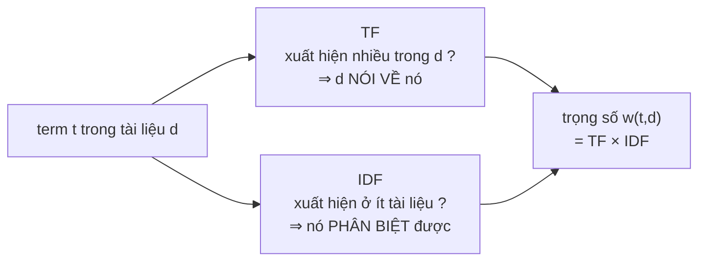

# TfIdfScorer — mô hình không gian vector và cosine similarity

**File nguồn:** `search-engine/src/main/java/com/vnsearch/ranking/TfIdfScorer.java`
**Việc nó làm:** Chấm điểm *"tài liệu này liên quan tới truy vấn bao nhiêu"* bằng góc giữa hai vector.

> 📖 Chưa quen ký hiệu toán? Đọc [00 — Từ điển ký hiệu toán](../00-KY-HIEU-TOAN.md) trước.


> ### 🔄 Đã cập nhật sau đợt tái cấu trúc
>
> Phần **toán học và thuật toán** dưới đây vẫn đúng nguyên vẹn. Nhưng một số
> đoạn mã trích dẫn và mục *"Hạn chế đã biết"* mô tả **phiên bản trước**.
> Những gì đã thay đổi ở file này:
>
> - Nhận `SearchIndex` (interface) và dùng `getTermFrequency` chung — đã hết ba bản sao binary search.
> - Việc kết hợp với PageRank/tiêu đề nay do **Decorator** đảm nhiệm, không còn công thức cộng tuyến tính chôn cứng.
>

---

## 📌 Hiểu trong 30 giây

Ý tưởng nền tảng: **biến mỗi tài liệu và mỗi truy vấn thành một mũi tên** trong không gian $V = 136\,768$ chiều — mỗi chiều là một term. Tài liệu liên quan tới truy vấn khi hai mũi tên **cùng hướng**.

Câu hỏi là: toạ độ của mũi tên trên chiều `máy_tính` bằng bao nhiêu?

Hai trực giác ngược chiều nhau, và TF-IDF là tích của chúng:

- **TF** — từ xuất hiện **nhiều** trong tài liệu thì tài liệu đó nói về nó.
- **IDF** — từ xuất hiện trong **ít** tài liệu thì nó phân biệt tốt.

$$w(t,d) = \underbrace{\text{tf}(t,d)}_{\text{quan trọng với }d} \times \underbrace{\text{idf}(t)}_{\text{phân biệt được}}$$

Từ `của` có TF cao trong mọi tài liệu nhưng IDF gần 0 → trọng số ~0. Từ `blockchain` có TF thấp nhưng IDF cao → trọng số lớn. Đúng trực giác.



```
   Vì sao phải NHÂN hai đại lượng, không dùng một cái

                        IDF thấp              IDF cao
                     (từ phổ biến)         (từ hiếm)
                  ┌────────────────────┬────────────────────┐
      TF cao      │  "của", "và"       │  "blockchain"      │
   (nhiều trong d)│  w ≈ 0  ✓ đúng     │  w LỚN  ✓ đúng     │
                  ├────────────────────┼────────────────────┤
      TF thấp     │  w ≈ 0  ✓ đúng     │  w vừa  ✓ đúng     │
   (ít trong d)   │                    │                    │
                  └────────────────────┴────────────────────┘
                   chỉ dùng TF  ⇒ ô trên-trái sai
                   chỉ dùng IDF ⇒ ô dưới-phải sai
```

**Hình học của cosine** — vì sao phải chuẩn hoá độ dài:

```
              chiều "máy_tính"
                    ▲
                    │      ↗ d₁ (bài ngắn về máy tính)
                    │    ↗
                    │  ↗  θ nhỏ ⇒ cosine lớn ⇒ liên quan
                    │↗ ────────▶ q (truy vấn)
                    └──────────────────────▶ chiều "giá"

   Không chuẩn hoá: một bài DÀI có mọi toạ độ lớn ⇒ luôn thắng,
                    dù nó chỉ nhắc "máy tính" đúng một lần giữa 10.000 từ.
   Cosine đo GÓC, không đo độ dài ⇒ bài dài không còn lợi thế giả tạo.
```

---

## 1. TF — vì sao lấy logarit

```java
public static double tf(int termFrequency) {
    return termFrequency > 0 ? 1 + Math.log10(termFrequency) : 0.0;
}
```

$$\text{tf}(t,d) = \begin{cases} 1 + \log_{10} f(t,d) & f > 0 \\ 0 & f = 0\end{cases}$$

**Vì sao không dùng thẳng $f$.** Một tài liệu lặp `máy tính` 100 lần **không** liên quan gấp 100 lần tài liệu nhắc 1 lần. Quan hệ giữa tần suất và mức liên quan là **phi tuyến, bão hoà**.

**Bảng giá trị:**

| $f$ | $f$ thô | $1 + \log_{10} f$ | Tỉ lệ so với $f=1$ |
|---|---|---|---|
| 1 | 1 | **1,000** | 1,0× |
| 2 | 2 | 1,301 | 1,3× |
| 10 | 10 | **2,000** | 2,0× |
| 50 | 50 | 2,699 | 2,7× |
| 100 | 100 | **3,000** | 3,0× |
| 1000 | 1000 | 4,000 | 4,0× |

Lặp gấp **10 lần** chỉ được thêm **1 điểm**. Đó chính là tính chất chống nhồi từ khoá: kẻ spam lặp từ 1000 lần chỉ được 4 điểm so với 1 điểm của bài viết bình thường — gấp 4, không phải gấp 1000.

**Vì sao có `1 +` phía trước.** Nếu chỉ dùng $\log_{10} f$ thì $f = 1$ cho $\log_{10} 1 = 0$ — một từ xuất hiện đúng một lần sẽ có trọng số **bằng 0**, tức bị coi như không xuất hiện. Cộng 1 đảm bảo mọi lần xuất hiện đều được tính.

**Vì sao phải xử lý riêng $f = 0$.** $\log_{10} 0 = -\infty$. Trong Java, `Math.log10(0)` trả về `Double.NEGATIVE_INFINITY`, và nhân nó với bất cứ gì cho ra `-Infinity` hoặc `NaN` — điểm số hỏng hoàn toàn và lan ra cả bảng kết quả.

---

## 2. IDF — đo lượng thông tin của một từ

```java
public static double idf(int totalDocs, int documentFrequency) {
    if (documentFrequency <= 0 || totalDocs <= 0) {
        return 0.0;
    }
    return Math.log10((double) totalDocs / documentFrequency);
}
```

$$\text{idf}(t) = \log_{10}\frac{N}{\text{df}(t)}$$

**Nguồn gốc lý thuyết thông tin.** Xác suất một tài liệu ngẫu nhiên chứa $t$ là:

$$P(t) = \frac{\text{df}(t)}{N}$$

Lượng thông tin (self-information) của biến cố đó là $-\log P(t)$. Vậy:

$$\text{idf}(t) = -\log_{10} P(t) = \log_{10}\frac{N}{\text{df}(t)}$$

IDF **chính là lượng thông tin mà việc "tài liệu này chứa $t$" mang lại**. Từ hiếm mang nhiều thông tin; từ phổ biến gần như không mang thông tin gì.

**Bảng giá trị với $N = 5011$ (corpus thật):**

| df | Ví dụ term | $\text{idf} = \log_{10}(5011/\text{df})$ |
|---|---|---|
| 1 | Từ chỉ có trong 1 bài | **3,700** |
| 10 | Thuật ngữ chuyên ngành | 2,700 |
| 100 | Chủ đề hẹp | 1,700 |
| 1 000 | Từ khá phổ biến | 0,700 |
| **1 639** | `công_nghệ` | **0,486** |
| 2 506 (= N/2) | Xuất hiện ở nửa corpus | 0,301 |
| 5 011 (= N) | Xuất hiện ở **mọi** tài liệu | **0,000** |

Đường cong giảm rất nhanh: chỉ cần df tăng 10 lần là idf giảm đúng 1 đơn vị.

### 2.1 Bảo vệ chia cho 0

`documentFrequency <= 0` xảy ra khi term không có trong chỉ mục. Không có kiểm tra này, `5011 / 0` với kiểu `double` cho `Infinity` (không ném lỗi như số nguyên) và điểm số hỏng.

Trả về `0.0` đúng ngữ nghĩa: một term không tồn tại thì không đóng góp thông tin gì.

---

## 3. Cosine similarity — và một bỏ qua có chủ ý

```java
@Override
public double score(Map<String, Integer> queryTermFrequency, int docId, SearchIndex index) {
    int totalDocs = index.getTotalDocs();
    double dot = 0.0;
    double queryNormSq = 0.0;

    for (Map.Entry<String, Integer> entry : queryTermFrequency.entrySet()) {
        String term = entry.getKey();
        List<Posting> postings = index.getPostings(term);
        double idfValue = idf(totalDocs, postings.size());
        if (idfValue <= 0.0) {
            continue;   // term không tồn tại, hoặc xuất hiện ở TẤT CẢ tài liệu
        }

        double queryWeight = tf(entry.getValue()) * idfValue;
        queryNormSq += queryWeight * queryWeight;

        int docTermFrequency = index.getTermFrequency(term, docId);  // binary search O(log n)
        if (docTermFrequency > 0) {
            double docWeight = tf(docTermFrequency) * idfValue;
            dot += queryWeight * docWeight;
        }
    }

    if (dot == 0.0) return 0.0;
    double queryNorm = Math.sqrt(queryNormSq);
    double docNorm = Math.sqrt(Math.max(index.getDocLength(docId), 1));
    return dot / (queryNorm * docNorm);
}
```

Công thức cosine chuẩn:

$$\cos(\vec{q}, \vec{d}) = \frac{\vec{q} \cdot \vec{d}}{\lVert\vec{q}\rVert \, \lVert\vec{d}\rVert} = \frac{\sum_t w(t,q)\,w(t,d)}{\sqrt{\sum_t w(t,q)^2} \; \sqrt{\sum_t w(t,d)^2}}$$

**Vì sao chia cho chuẩn — trực giác hình học.** Tích vô hướng thuần tuý thiên vị tài liệu **dài**: tài liệu dài có nhiều term hơn nên tổng lớn hơn, kể cả khi không liên quan hơn. Chia cho chuẩn tức là **chuẩn hoá về mũi tên đơn vị** — chỉ còn so hướng, không so độ dài.

Ví dụ 2 chiều: $\vec{q} = (1,0)$, $\vec{d_1} = (2,0)$, $\vec{d_2} = (1,1)$.

$$\cos(\vec q,\vec{d_1}) = \frac{2}{1\cdot 2} = 1{,}0 \qquad \cos(\vec q,\vec{d_2}) = \frac{1}{1\cdot\sqrt2} = 0{,}707$$

$\vec{d_1}$ dài gấp đôi nhưng **cùng hướng hoàn toàn** → điểm tuyệt đối.

### 3.1 Chỉ duyệt qua term của TRUY VẤN, không phải toàn từ vựng

Vòng lặp chạy qua `queryTermFrequency` (1–4 term), không phải 136.768 chiều.

**Vì sao đúng.** Với một term $t \notin q$, ta có $w(t,q) = 0$, nên số hạng $w(t,q) \cdot w(t,d) = 0$ — không đóng góp gì vào tích vô hướng. Bỏ qua chúng là **chính xác**, không phải xấp xỉ.

$$\vec{q} \cdot \vec{d} = \sum_{t \in V} w(t,q)w(t,d) = \sum_{t \in q} w(t,q)w(t,d)$$

Đây là toàn bộ lý do vector thưa (sparse vector) làm việc được trong không gian 136.768 chiều.

### 3.2 `if (idfValue <= 0.0) continue` — hai trường hợp

| Trường hợp | df | idf | Hành vi |
|---|---|---|---|
| Term không có trong chỉ mục | 0 | 0 (do bảo vệ §2.1) | bỏ qua |
| Term có ở **mọi** tài liệu | $N$ | $\log_{10}1 = 0$ | bỏ qua |

Trường hợp thứ hai đáng nói: một term xuất hiện ở cả 5.011 tài liệu **không phân biệt được gì**. Bỏ qua nó là đúng.

**Nhưng điều kiện `<= 0` (không phải `== 0`) che một vấn đề lớn hơn.** Nếu df **vượt quá** $N$ — điều **có thể xảy ra** với chỉ mục kép có dấu/không dấu (xem [InvertedIndex §6](../03-index/InvertedIndex.md)) — thì:

$$\text{idf} = \log_{10}\frac{N}{\text{df}} < 0 \quad\text{khi } \text{df} > N$$

IDF âm sẽ **trừ điểm** tài liệu chứa term đó — hoàn toàn vô lý. Điều kiện `<= 0` chặn được, nhưng bằng cách **bỏ qua term hoàn toàn** thay vì kẹp về 0. Với truy vấn chỉ có một term như vậy, kết quả là điểm 0 cho mọi tài liệu.

Đây chính là vấn đề mà BM25 giải triệt để bằng dạng IDF khác — xem [BM25Scorer §3](BM25Scorer.md).

---

## 4. Xấp xỉ chuẩn hoá độ dài — đánh đổi lớn nhất của lớp

```java
double docNorm = Math.sqrt(Math.max(index.getDocLength(docId), 1));
```

**Đây KHÔNG phải chuẩn $L_2$ thật.** Chuẩn thật là:

$$\lVert\vec{d}\rVert = \sqrt{\sum_{t \in d} \bigl(\text{tf}(t,d)\cdot\text{idf}(t)\bigr)^2}$$

Tính nó đòi hỏi duyệt **mọi** term của tài liệu — trung bình $V_d \approx 500$ term phân biệt mỗi tài liệu. Lưu sẵn thì cần thêm một `Map<docId, Double>`; nhưng giá trị đó phụ thuộc idf, mà **idf thay đổi mỗi khi thêm tài liệu mới** (vì $N$ đổi) — nên phải tính lại toàn bộ sau mỗi lần index.

**Xấp xỉ dùng thay:** $\text{docNorm} \approx \sqrt{\lvert d \rvert}$ — căn của **số token**, có sẵn trong $O(1)$.

Đây là xấp xỉ kinh điển của **Lucene classic Similarity** (`lengthNorm = 1/√numTerms`), dùng trong hàng chục năm.

**Vì sao xấp xỉ này hợp lý — lập luận toán học.** Với một tài liệu có $V_d$ term phân biệt, trọng số trung bình $\bar{w}$:

$$\lVert\vec{d}\rVert = \sqrt{\sum_{t} w_t^2} \approx \sqrt{V_d \cdot \bar{w}^2} = \bar{w}\sqrt{V_d}$$

Và theo **định luật Heaps**, số term phân biệt tăng theo độ dài tài liệu:

$$V_d \approx K \cdot \lvert d \rvert^{\beta}, \qquad \beta \approx 0{,}4 - 0{,}6$$

Nên $\lVert\vec{d}\rVert \propto \lvert d \rvert^{\beta/2}$, trong khi xấp xỉ dùng $\lvert d \rvert^{0{,}5}$. Với $\beta \approx 0{,}5$ thì số mũ thật là $0{,}25$ còn xấp xỉ dùng $0{,}5$ — **xấp xỉ phạt tài liệu dài mạnh hơn thực tế khoảng gấp đôi về số mũ**.

**Bảng so sánh mức phạt:**

| $\lvert d\rvert$ | $\sqrt{\lvert d\rvert}$ (dùng) | $\lvert d\rvert^{0{,}25}$ (ước lượng đúng hơn) |
|---|---|---|
| 100 | 10,0 | 3,2 |
| **1 043** (trung bình) | **32,3** | 5,7 |
| 10 000 | 100,0 | 10,0 |

Tài liệu dài gấp 100 lần bị phạt 10 lần theo xấp xỉ, nhưng chỉ nên bị phạt ~3 lần.

**Hệ quả thực tế:** hệ thống thiên vị tài liệu ngắn. Và đây chính là một trong hai điểm mà BM25 hơn hẳn — nó có tham số $b$ để **điều chỉnh** mức phạt thay vì chôn cứng.

**`Math.max(..., 1)`** chống chia cho 0 với tài liệu rỗng (có thể xảy ra khi trang chỉ có ảnh, hoặc extract thất bại).

---

## 5. `queryNorm` — có cần không?

```java
double queryNorm = Math.sqrt(queryNormSq);
return dot / (queryNorm * docNorm);
```

**Câu trả lời cho việc xếp hạng: KHÔNG.** Trong một truy vấn, `queryNorm` là **hằng số** với mọi tài liệu — chia cho cùng một số không đổi thứ tự:

$$\frac{a}{c} > \frac{b}{c} \iff a > b \quad (c > 0)$$

Nên bỏ nó đi thì thứ hạng **y hệt**, mà tiết kiệm một phép `sqrt` và một vòng cộng dồn.

**Vì sao vẫn giữ:** để điểm số nằm trong $[0,1]$ và **so sánh được giữa các truy vấn khác nhau**. Điều này cần cho:

- Ngưỡng cắt tuyệt đối ("chỉ hiện kết quả có điểm > 0,3").
- Kết hợp tuyến tính với PageRank — nếu thang điểm trôi theo truy vấn thì trọng số $\alpha, \beta$ mất ý nghĩa.
- Hiển thị điểm cho người dùng (API trả về `score`).

Đây là đánh đổi **đúng**: trả một phép `sqrt` mỗi truy vấn để có thang điểm ổn định.

> Nhưng lưu ý: điểm cosine ở đây **không** thực sự nằm trong $[0,1]$ vì `docNorm` là xấp xỉ chứ không phải chuẩn thật. Số đo trong `EVALUATION.md` cho thấy điểm TF-IDF **lớn nhất là 1,894824** — vượt 1. Điều này không sai về mặt xếp hạng nhưng làm hỏng giả định "điểm trong [0,1]" mà công thức kết hợp ngầm dựa vào — xem [ResultRanker §6](ResultRanker.md).

---

## 6. Binary search tận dụng bất biến

Trước đây hàm này được **sao chép gần như y hệt ở ba nơi** (`TfIdfScorer`, `BM25Scorer`, `InvertedIndex.getPositions`). Nay chỉ còn **một** cài đặt, nằm trong `InvertedIndex` và lộ ra qua interface `SearchIndex`:

```java
// InvertedIndex — MỘT cài đặt duy nhất
private static int binarySearchPosting(List<Posting> postings, int docId) {
    int low = 0, high = postings.size() - 1;
    while (low <= high) {
        int mid = (low + high) >>> 1;          // >>> chống tràn
        int midDocId = postings.get(mid).docId();
        if (midDocId == docId) return mid;
        else if (midDocId < docId) low = mid + 1;
        else high = mid - 1;
    }
    return -1;
}

@Override
public int getTermFrequency(String term, int docId) {
    int position = binarySearchPosting(getPostings(term), docId);
    ...
}
```

Hai scorer nay chỉ gọi:

```java
int docTermFrequency = index.getTermFrequency(term, docId);   // TfIdfScorer
int termFrequency    = index.getTermFrequency(term, docId);   // BM25Scorer
```

> **Bài học OOP:** ba bản sao của cùng một thuật toán là ba cơ hội để chúng trôi lệch. Gom về một chỗ và lộ qua interface vừa xoá trùng lặp, vừa cho phép cài đặt `SearchIndex` khác (chỉ mục nén) tự chọn cách tra tần suất tối ưu cho định dạng của nó.

Đây là **lợi ích thứ hai** (ngoài two-pointer merge) của bất biến "posting list luôn sắp xếp theo docId".

Với posting list `công_nghệ` có 1.639 mục: $\lceil\log_2 1639\rceil = \mathbf{11}$ phép so sánh thay vì 1.639 — nhanh hơn **149 lần**.

Chi tiết `>>>` chống tràn: xem [InvertedIndex §5.1](../03-index/InvertedIndex.md).

**Trùng lặp:** hàm này gần như y hệt ở `BM25Scorer` và `InvertedIndex.getPositions` — ba bản sao, xem [InvertedIndex §5.2](../03-index/InvertedIndex.md).

---

## 7. Interface `RelevanceScorer` — điều kiện cần cho thí nghiệm ablation

```java
public interface RelevanceScorer {
    double score(Map<String, Integer> queryTermFrequency, int docId, SearchIndex index);
    String name();
}
```

Javadoc của interface nói rõ mục đích:

> *"Đây là điều kiện cần để làm thí nghiệm ablation trong báo cáo: chạy CÙNG một bộ truy vấn, CÙNG một chỉ mục, chỉ thay đúng mô hình tính điểm, rồi so sánh các độ đo chất lượng. **Nếu không tách được ra sau một giao diện thì mọi so sánh đều lẫn thêm biến số khác và mất giá trị khoa học.**"*

Đây là **Strategy pattern** dùng đúng chỗ, và điều làm nó đáng khen là **động cơ**: không phải "vì design pattern là tốt", mà vì nó là điều kiện bắt buộc để phép đo có ý nghĩa.

Kết quả thu được nhờ nó (từ `EVALUATION.md`, 200 truy vấn known-item):

| Cấu hình | MRR | Success@1 |
|---|---|---|
| TF-IDF thuần | 0,8537 | 78,0 % |
| **BM25 thuần** | **0,8989** | **85,0 %** |

Không có interface, kết luận *"BM25 tốt hơn TF-IDF 5,3 % MRR"* sẽ không thể rút ra một cách đáng tin.

Phương thức `name()` cũng có mục đích cụ thể: làm nhãn trong bảng kết quả — `String.format("BM25(k1=%.1f,b=%.2f)", k1, b)` giúp phân biệt các cấu hình tham số khác nhau của **cùng** một scorer.

---

## 8. Ví dụ tính tay đầy đủ

Corpus 2 tài liệu (đúng như `main()` trong file):

- doc0: `Máy tính xách tay giá rẻ chất lượng tốt cho sinh viên` (title: `Máy tính xách tay`)
- doc1: `Công thức nấu ăn ngon mỗi ngày cho gia đình` (title: `Công thức nấu ăn`)

Truy vấn: `máy tính` → term `máy_tính`, $f(t,q) = 1$.

**Bước 1 — thống kê:**

$$N = 2, \quad \text{df}(\texttt{máy\_tính}) = 1 \text{ (chỉ doc0)}$$

**Bước 2 — IDF:**

$$\text{idf} = \log_{10}\frac{2}{1} = 0{,}30103$$

**Bước 3 — trọng số truy vấn:**

$$w(t,q) = (1 + \log_{10}1) \times 0{,}30103 = 1 \times 0{,}30103 = 0{,}30103$$

$$\lVert\vec q\rVert = \sqrt{0{,}30103^2} = 0{,}30103$$

**Bước 4 — doc0.** Term xuất hiện 2 lần (title + body), $\lvert d_0 \rvert \approx 9$ token sau lọc stopword:

$$w(t,d_0) = (1 + \log_{10}2) \times 0{,}30103 = 1{,}30103 \times 0{,}30103 = 0{,}39166$$

$$\text{dot} = 0{,}30103 \times 0{,}39166 = 0{,}11791$$

$$\text{docNorm} = \sqrt{9} = 3$$

$$\text{score}(d_0) = \frac{0{,}11791}{0{,}30103 \times 3} = \mathbf{0{,}1306}$$

**Bước 5 — doc1.** Term không xuất hiện → `index.getTermFrequency` trả 0 → `dot = 0` → thoát sớm:

$$\text{score}(d_1) = \mathbf{0{,}0}$$

**Kết luận:** doc0 xếp trên doc1. Đúng.

---

## 9. Tổng hợp độ phức tạp

| Thao tác | Thời gian |
|---|---|
| `tf`, `idf` | $O(1)$ |
| `index.getTermFrequency` | $O(\log n)$ |
| **`score`** | **$O(q \log d)$** |

với $q$ = số term phân biệt trong truy vấn (1–4), $d$ = độ dài posting list dài nhất.

Với $q=3$, $d=1639$: $3 \times 11 = \mathbf{33}$ phép so sánh mỗi tài liệu ứng viên.

Bộ nhớ: $O(1)$ ngoài dữ liệu chỉ mục — không cấp phát gì trong `score`.

**Số đo:** TF-IDF thuần mất **3,90 ms**/truy vấn, TF-IDF + PR + title mất **3,14 ms**. (Chênh lệch nghịch chiều này là nhiễu đo, không phải hiệu ứng thật.)

---

## 10. Chủ đề DSA thể hiện

| Chủ đề | Ở đâu |
|---|---|
| **Mô hình không gian vector** | tài liệu và truy vấn là vector trong $\mathbb{R}^V$ |
| **Vector thưa** | chỉ duyệt term của truy vấn, bỏ 136.764 chiều bằng 0 |
| **Cosine similarity** | chuẩn hoá để so hướng, không so độ dài |
| **Nén phi tuyến (logarit)** | chống nhồi từ khoá |
| **Lý thuyết thông tin** | idf = self-information |
| **Binary search** | tận dụng bất biến sắp xếp |
| **Xấp xỉ có phân tích sai số** | $\sqrt{\lvert d\rvert}$ thay chuẩn $L_2$ thật |
| **Strategy pattern** | `RelevanceScorer` cho ablation |
| **Bảo vệ điều kiện biên** | $f=0$, df$=0$, $\lvert d\rvert = 0$ |
| **Bất biến đơn điệu** | bỏ `queryNorm` không đổi thứ hạng |

---

## 11. Hạn chế đã biết

1. **`docNorm` là xấp xỉ thô** — phạt tài liệu dài quá mạnh (§4).
2. **IDF có thể âm** về mặt công thức; code chặn bằng cách bỏ qua term thay vì kẹp (§3.2).
3. **Điểm không thực sự trong $[0,1]$** — đo được max 1,8948 (§5).
4. **Không có trọng số theo trường.** Term trong tiêu đề và trong thân bài được tính như nhau. `ResultRanker` bù bằng `titleMatchBonus` riêng, nhưng đó là vá ở tầng trên chứ không phải giải ở đúng chỗ. Cách chuẩn: **field boosting** ngay trong scorer.
5. ~~**Ba bản sao `findTermFrequencyInDoc`**~~ ✅ **Đã khắc phục** — gom về một `binarySearchPosting` trong `InvertedIndex`; hai scorer nay gọi qua `SearchIndex.getTermFrequency(term, docId)` (§6).
6. **Không có pivoted length normalization** — cải tiến kinh điển của Singhal (1996) cho đúng vấn đề ở §4.
7. **Không cache trọng số truy vấn.** `tf(entry.getValue()) * idfValue` được tính lại cho **mỗi** tài liệu ứng viên, dù nó không phụ thuộc `docId`. Với 500 ứng viên × 3 term, đó là 1.500 lần tính thừa. Tách thành hai vòng (tính trọng số truy vấn một lần, rồi duyệt ứng viên) sẽ sửa được — cùng loại tối ưu mà `ResultRanker` đã áp dụng cho snippet.

---

## 12. Liên kết

- Đối chứng công nghiệp: [BM25Scorer.md](BM25Scorer.md)
- Người gọi: [ResultRanker.md](ResultRanker.md)
- Bất biến được tận dụng: [InvertedIndex §4](../03-index/InvertedIndex.md)
- Nơi điểm này được kết hợp: [ResultRanker §6](ResultRanker.md)
- Kết quả thí nghiệm: `docs/EVALUATION.md`
- Ký hiệu chưa hiểu: [00 — Từ điển ký hiệu toán](../00-KY-HIEU-TOAN.md)
