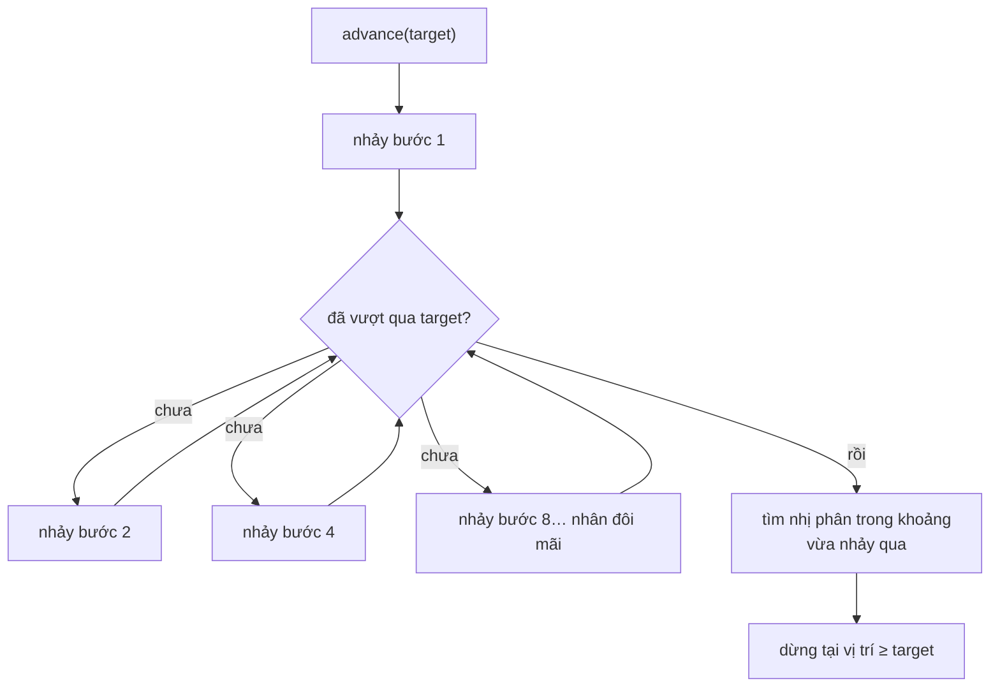

# ArrayPostingCursor — galloping search và skip pointer

**File nguồn:** `search-engine/src/main/java/com/vnsearch/index/ArrayPostingCursor.java`, `index/PostingCursor.java`
**Việc nó làm:** Duyệt posting list **không cấp phát gì**, và **nhảy cóc** tới docId mục tiêu trong $O(\log d)$.

> 📖 Chưa quen ký hiệu toán? Đọc [00 — Từ điển ký hiệu toán](../00-KY-HIEU-TOAN.md) trước.

---

## 📌 Hiểu trong 30 giây

Giao một posting list **5 phần tử** với một posting list **4.000 phần tử**. Two-pointer thuần phải bước qua gần hết list dài:

$$O(m + n) = 5 + 4000 = \mathbf{4005}\ \text{bước}$$

Nhưng cả hai list **đã sắp xếp**. Vậy sao phải bước từng bước qua 4.000 phần tử khi chỉ cần đúng 5 vị trí?

$$O\!\left(m \log \frac{n}{m}\right) = 5 \times \log_2 800 \approx \mathbf{48}\ \text{bước}$$

**Nhanh hơn hơn 80 lần.** Kỹ thuật: **galloping search** (còn gọi là exponential search).

```
   List ngắn (5 phần tử)   :  ▪    ▪      ▪         ▪            ▪
   List dài  (4.000 pt)    :  ▪▪▪▪▪▪▪▪▪▪▪▪▪▪▪▪▪▪▪▪▪▪▪▪▪▪▪▪▪▪▪▪▪▪▪▪

   two-pointer  : bước qua TỪNG phần tử của list dài  ──▶ 4.005 bước
                  ················································

   galloping    : nhảy 1→2→4→8→16→… rồi lùi tìm nhị phân ──▶ 48 bước
                   ↷    ↷      ↷          ↷
```



**Hai pha, mỗi pha một việc:** pha nhảy tìm **một khoảng chắc chắn chứa đáp
án** với chi phí $O(\log d)$ (với $d$ là khoảng cách thật), pha nhị phân thu
hẹp khoảng đó cũng $O(\log d)$. Điểm hay là $d$ **nhỏ** khi hai list gần nhau —
galloping tự thích nghi, còn tìm nhị phân thuần thì luôn trả giá $\log n$ đầy
đủ dù đáp án nằm ngay bên cạnh.

---

## 1. Hai vấn đề đo được

### 1.1 Autoboxing — 64 KB rác GC mỗi lần gọi

Cách cũ vật chất hoá posting list thành `List<Integer>` trước khi giao:

```java
List<Integer> docIds = PostingListMerger.docIdsOf(index.getPostings(term));
```

| | `int` | `Integer` |
|---|---|---|
| Kích thước | **4 byte** | **16 byte** (12 header + 4 giá trị, làm tròn bội 8) |
| Nằm ở đâu | Trong mảng, **liền kề** | Trên heap, **rải rác** → hỏng cache CPU |
| Chi phí GC | 0 | Một object phải thu hồi |

Với posting list 4.000 mục:

$$4000 \times 16\ \text{byte} = \mathbf{64\ \text{KB}}\ \text{rác GC mỗi lần gọi}$$

và gọi $k$ lần cho truy vấn $k$ term. Cursor giữ **toàn bộ trạng thái trong một `int`**:

```java
final class ArrayPostingCursor implements PostingCursor {
    private final List<Posting> postings;
    private int index;                       // ← toàn bộ trạng thái
}
```

### 1.2 Không nhảy cóc được

Xem §📌 ở trên. Two-pointer thuần không tận dụng được việc list dài **đã sắp xếp**.

---

## 2. Giao diện

```java
public interface PostingCursor {

    int NO_MORE = Integer.MAX_VALUE;   // sentinel: đã duyệt hết

    int docId();                       // O(1)
    int termFrequency();               // O(1)
    List<Integer> positions();         // O(1)
    boolean next();                    // O(1)
    boolean skipTo(int targetDocId);   // O(log d) ← galloping
    int size();

    static PostingCursor of(List<Posting> postings) {
        return new ArrayPostingCursor(postings);
    }
}
```

---

## 3. Galloping search — thuật toán

Hai pha, mỗi pha $O(\log d)$ với $d$ là **khoảng cách thật** phải nhảy.

### 3.1 Pha 1 — nhảy theo cấp số nhân

```java
int step = 1;
int low  = index;
int high = index + step;
while (high < n && postings.get(high).docId() < targetDocId) {
    low  = high;
    step <<= 1;                     // 1, 2, 4, 8, 16, ...
    high = index + step;
}
if (high >= n) high = n - 1;
```

Sau $k$ vòng, bước nhảy là $2^k$. Vòng lặp dừng khi $2^k \ge d$, tức:

$$k = \lceil \log_2 d \rceil$$

Kết thúc pha 1 ta biết mục tiêu nằm trong đoạn $(\text{low}, \text{high}]$ có độ dài $\le 2^k \approx d$.

```
docIds:  [2, 4, 8, 16, 32, 64, 128, 256, 512, 1024]
index=0, target=100

step=1  → high=1  docId=4    < 100 → tiếp
step=2  → high=2  docId=8    < 100 → tiếp
step=4  → high=4  docId=32   < 100 → tiếp
step=8  → high=8  docId=512  ≥ 100 → DỪNG

Khoanh được: low=4, high=8   (4 vòng)
```

### 3.2 Pha 2 — binary search trong đoạn vừa khoanh

```java
int lo = low, hi = high;
while (lo < hi) {
    int mid = (lo + hi) >>> 1;      // >>> chống tràn
    if (postings.get(mid).docId() < targetDocId) lo = mid + 1;
    else                                          hi = mid;
}
index = postings.get(lo).docId() >= targetDocId ? lo : n;
return index < n;
```

Đây là biến thể **lower_bound**: tìm vị trí **đầu tiên** có `docId >= target`, không phải tìm khớp chính xác. Bất biến vòng lặp:

> Đáp án luôn nằm trong $[\text{lo}, \text{hi}]$.

Khi `lo == hi` thì đoạn còn đúng một phần tử — chính là đáp án. Nhận xét quan trọng: vòng dùng `hi = mid` (không phải `mid - 1`) vì `mid` **vẫn có thể là đáp án**.

Đoạn có độ dài $\approx d$ nên pha 2 tốn $\log_2 d$ bước.

$$\text{Tổng} = \underbrace{\lceil\log_2 d\rceil}_{\text{pha 1}} + \underbrace{\lceil\log_2 d\rceil}_{\text{pha 2}} = O(\log d)$$

---

## 4. Vì sao galloping thắng binary search thuần

Đây là ý cần nói khi bảo vệ:

> Chi phí phụ thuộc **khoảng cách thật** $d$, **không phụ thuộc kích thước mảng** $n$.

| Tình huống | Binary search trên cả mảng | Galloping |
|---|---|---|
| Mục tiêu ngay phần tử kế tiếp ($d = 1$) | $\log_2 4000 \approx 12$ bước | **1–2 bước** |
| Mục tiêu cách 1.000 phần tử | $\approx 12$ bước | $\approx 20$ bước |
| Hai list chồng lấn nhiều | Luôn 12 bước mỗi lần | **gần như miễn phí** |

Trong giao posting list, **chồng lấn nhiều là trường hợp phổ biến** — nếu hai term hay xuất hiện cùng nhau thì con trỏ chỉ nhích từng chút. Galloping thắng đúng ở chỗ đáng thắng, và chỉ thua nhẹ ở trường hợp xấu.

### 4.1 Chứng minh cận $O\!\left(m\log\frac{n}{m}\right)$

Giao list ngắn $m$ phần tử với list dài $n$ phần tử. Mỗi phần tử của list ngắn gây một lần `skipTo` với khoảng cách $d_i$, và:

$$\sum_{i=1}^{m} d_i \le n$$

Chi phí tổng là $\sum \log d_i$. Theo **bất đẳng thức Jensen** (hàm $\log$ lõm), tổng này lớn nhất khi mọi $d_i$ bằng nhau, tức $d_i = n/m$:

$$\sum_{i=1}^{m} \log d_i \le m \log\frac{n}{m}$$

Với $m = 5$, $n = 4000$: $5 \times \log_2 800 \approx 5 \times 9{,}64 \approx \mathbf{48}$ bước. ∎

---

## 5. Ba chi tiết cài đặt

### 5.1 `(lo + hi) >>> 1` chống tràn

Với `lo` và `hi` lớn, `lo + hi` **tràn `int` thành số âm**, và `/2` giữ nguyên dấu âm → chỉ số âm → `IndexOutOfBoundsException`.

`>>>` là dịch phải **không dấu**: bit dấu được coi là bit dữ liệu, nên kết quả vẫn đúng khi tổng tràn.

Đây là lỗi từng tồn tại **9 năm** trong `java.util.Arrays.binarySearch` của chính JDK, Joshua Bloch công bố năm 2006. Dự án dùng nhất quán cùng kỹ thuật ở `InvertedIndex.binarySearchPosting`.

### 5.2 `NO_MORE = Integer.MAX_VALUE` — sentinel xoá nhánh `if`

```java
@Override
public int docId() {
    return index < postings.size() ? postings.get(index).docId() : NO_MORE;
}
```

Vì sao chọn `MAX_VALUE`: nó **lớn hơn mọi docId hợp lệ**, nên thuật toán giao *"tiến cursor có docId nhỏ hơn"* **tự động dừng đúng chỗ** mà không cần nhánh `if` riêng kiểm tra hết list.

```java
// Không cần: if (a.hasNext() && b.hasNext()) ...
while (a.docId() != NO_MORE && b.docId() != NO_MORE) {
    if (a.docId() == b.docId()) { thu thập; a.next(); b.next(); }
    else if (a.docId() < b.docId()) a.skipTo(b.docId());
    else                            b.skipTo(a.docId());
}
```

> **Kỹ thuật sentinel:** chọn giá trị đặc biệt sao cho **luật chung áp dụng được luôn cho trường hợp biên**. Trường hợp biên *biến mất* thay vì được xử lý riêng. Cùng ý tưởng với node giả trong [LRUCache](LRUCache.md).

### 5.3 Lớp cài đặt là package-private

```java
final class ArrayPostingCursor implements PostingCursor { ... }
//    ↑ không có "public"
```

Đường vào duy nhất là `PostingCursor.of(...)` — một [Factory](../09-design-patterns/02-FACTORY.md) thu nhỏ đặt ngay trong interface bằng `static method` của Java 8+.

Nhờ đó, thêm `CompressedPostingCursor` (đọc từ dữ liệu [VByte](../03-index/VByteCodec.md)) sau này chỉ cần sửa `of()` — **không nơi nào khác phải sửa**, vì không nơi nào biết tên lớp cụ thể.

---

## 6. Test đối chiếu với nguồn sự thật đơn giản

```java
@Test
void gallopingMatchesLinearScanOnEveryPosition() {
    int[] docIds = {2, 4, 8, 16, 32, 64, 128, 256, 512, 1024};
    for (int target = 0; target <= 1100; target++) {
        PostingCursor cursor = PostingCursor.of(postings(docIds));
        boolean found = cursor.skipTo(target);
        int expected = /* quét tuyến tính — cài đặt chậm nhưng hiển nhiên đúng */;
        assertEquals(expected, cursor.docId(), "target=" + target);
    }
}
```

**Kỹ thuật test đáng đưa vào báo cáo:**

> Khi cài một thuật toán **tối ưu và khó**, hãy cài thêm phiên bản **chậm và hiển nhiên đúng**, rồi khẳng định hai bên cho **cùng kết quả ở mọi đầu vào**.

Ưu điểm so với test vài trường hợp lẻ:

- Phủ **mọi** vị trí: trước phần tử đầu (`target=0`), sau phần tử cuối (`target=1100`), **trùng khớp chính xác** (`target=512`), và mọi khoảng giữa — đúng bốn nhóm trường hợp biên mà galloping dễ sai.
- Không phải tự nghĩ ra trường hợp biên — vòng lặp nghĩ hộ.
- Thông điệp lỗi (`"target=" + target`) chỉ thẳng vị trí sai.

`PostingCursorTest` có **9 test** theo tinh thần này.

---

## 7. Độ phức tạp

| Thao tác | Thời gian | Bộ nhớ |
|---|---|---|
| `PostingCursor.of(...)` | $O(1)$ | $O(1)$ — chỉ giữ tham chiếu + một `int` |
| `docId()`, `termFrequency()`, `positions()` | $O(1)$ | 0 |
| `next()` | $O(1)$ | 0 |
| `skipTo(target)` | $O(\log d)$ | **0** |
| Giao hai list bằng cursor | $O\!\left(m\log\frac{n}{m}\right)$ | **0** |

Cột bộ nhớ toàn 0 là điểm chính: cursor **không sở hữu dữ liệu**, chỉ **trỏ vào** dữ liệu.

---

## 8. Chủ đề DSA thể hiện

| Chủ đề | Ở đâu |
|---|---|
| **Exponential / galloping search** | §3 |
| **Binary search biến thể `lower_bound`** | §3.2 |
| **Bất biến vòng lặp** | §3.2 |
| **Bất đẳng thức Jensen** cho cận trên | §4.1 |
| **Iterator pattern** | Toàn bộ interface |
| **Sentinel** để xoá trường hợp biên | §5.2 |
| **Tránh autoboxing** | §1.1 |
| **Chống tràn số nguyên** (`>>>`) | §5.1 |
| **Test đối chiếu nguồn sự thật đơn giản** | §6 |

---

## 9. Hạn chế đã biết

1. **Không thread-safe.** Cursor giữ chỉ số vào một list và **giả định list không đổi** trong lúc duyệt. An toàn trong dự án vì chỉ mục **bất biến sau khi dựng** (dựng chỉ mục mới rồi gán bằng tham chiếu `volatile`, không sửa tại chỗ). Đây là đánh đổi có ý thức để đạt chi phí bằng 0 — khác `ArrayList.Iterator` vốn kiểm tra `modCount`.
2. **Chưa dùng trong đường chạy chính của truy vấn.** `PostingListMerger.intersectCursors` có sẵn nhưng `AndNode` hiện vẫn dùng `intersect` trên `List<Integer>`. Chuyển sang cursor là bước tối ưu tiếp theo, đã có sẵn hạ tầng.
3. **Nhảy cóc trên dữ liệu chưa nén.** Chỉ mục thật chia posting list thành khối và lưu skip pointer giữa các khối, để nhảy cóc **mà không phải giải nén** khối. Kết hợp cursor với [VByteCodec](../03-index/VByteCodec.md) là hướng làm tiếp.
4. **Không hỗ trợ nhảy lùi.** `skipTo` chỉ tiến. Đủ cho giao posting list nhưng không đủ cho các thuật toán cần quay lui.

---

## 10. Liên kết

- Bất biến mà galloping dựa vào: [InvertedIndex §4](../03-index/InvertedIndex.md)
- Nén cùng dựa vào bất biến đó: [VByteCodec](../03-index/VByteCodec.md)
- Two-pointer merge (phương án nền): [PostingListMerger](../04-query/PostingListMerger.md)
- Mẫu thiết kế và bài học OOP: [09-ITERATOR-CURSOR.md](../09-design-patterns/09-ITERATOR-CURSOR.md)
- Mục lục: [../README.md](../README.md)
