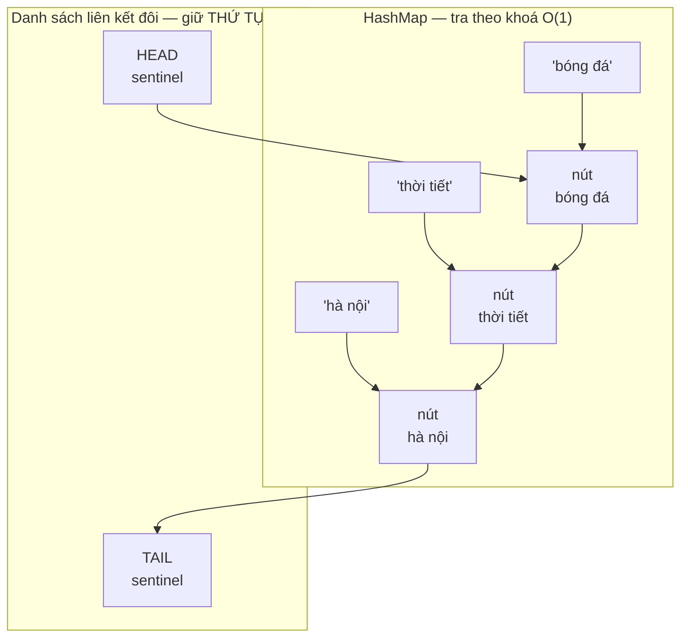
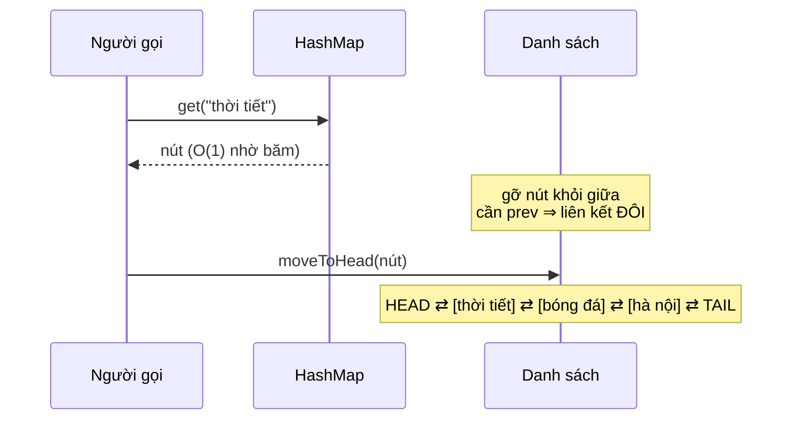

# LRUCache — HashMap + danh sách liên kết đôi, và vì sao `get` phải khoá ghi

**File nguồn:** `search-engine/src/main/java/com/vnsearch/datastructure/LRUCache.java`
**Việc nó làm:** Cache kết quả tìm kiếm gần đây, mọi thao tác $O(1)$.

> 📖 Chưa quen ký hiệu toán? Đọc [00 — Từ điển ký hiệu toán](../00-KY-HIEU-TOAN.md) trước.

---

## 📌 Hiểu trong 30 giây

Truy vấn phổ biến (`bóng đá`, `thời tiết`) được gõ đi gõ lại. Tính lại từ đầu mỗi lần là lãng phí — đo thực tế qua HTTP:

| | Thời gian |
|---|---|
| Cache **miss** | 34,5 ms |
| Cache **hit** | **12,8 ms** |
| Nhanh hơn | **2,7 lần** |

Nhưng RAM có hạn. Khi cache đầy, phải **bỏ ai đó ra**. Chính sách **LRU** (Least Recently Used) bỏ mục **lâu nhất không được dùng** — dựa trên giả định về tính cục bộ theo thời gian: *thứ vừa được dùng thì nhiều khả năng sắp được dùng lại*.

Bài toán thú vị là làm sao mọi thao tác đều $O(1)$. Hai yêu cầu xung khắc:

- **Tra theo khoá nhanh** → cần bảng băm.
- **Biết ai lâu nhất không dùng** → cần thứ tự.

Bảng băm không có thứ tự; danh sách có thứ tự nhưng tra chậm. **Lời giải: dùng cả hai cùng lúc.**



```
   HashMap                     Danh sách liên kết đôi
   ───────                     ──────────────────────
   "bóng đá"   ──────┐
   "thời tiết" ────┐ │
   "hà nội"    ──┐ │ │
                 │ │ │
                 ▼ ▼ ▼
   HEAD ⇄ [bóng đá] ⇄ [thời tiết] ⇄ [hà nội] ⇄ TAIL
    ▲                                            ▲
    │                                            │
   MỚI DÙNG NHẤT                        LÂU NHẤT KHÔNG DÙNG
                                        ← đuổi từ đây
```

**Vì sao phải là liên kết ĐÔI.** Khi `get("thời tiết")` trúng, nút đó phải nhảy
lên đầu — tức là phải **gỡ nó ra khỏi vị trí giữa** trong $O(1)$. Gỡ một nút
khỏi danh sách đơn cần biết nút **đứng trước**, mà tìm nút đứng trước là
$O(n)$. Con trỏ `prev` chính là thứ mua lấy $O(1)$.



---

## 1. Kiến trúc kết hợp

```java
private final int capacity;
private final Map<K, Node<K, V>> map;
private final Node<K, V> head;   // sentinel, đầu là MRU
private final Node<K, V> tail;   // sentinel, cuối là LRU
```

```
map:  { "q=bóng đá" ─┐   "q=thời tiết" ─┐   "q=máy tính" ─┐ }
                     │                  │                 │
                     ▼                  ▼                 ▼
  head ⇄ [q=bóng đá] ⇄ [q=thời tiết] ⇄ [q=máy tính] ⇄ tail
   ▲          MRU                            LRU          ▲
sentinel                                              sentinel
```

**Mỗi cấu trúc giải một nửa bài toán:**

| Cấu trúc | Giải | Độ phức tạp |
|---|---|---|
| `HashMap<K, Node>` | Tra khoá → node | $O(1)$ |
| Danh sách liên kết đôi | Thứ tự dùng gần đây | $O(1)$ để chuyển vị trí |

**Điểm mấu chốt:** `HashMap` không lưu **giá trị**, nó lưu **tham chiếu tới node**. Nhờ đó từ khoá ta tới thẳng node trong danh sách mà không phải duyệt.

**Vì sao phải là danh sách liên kết ĐÔI (có `prev`).** Để xoá node $x$ khỏi danh sách trong $O(1)$, ta cần biết node **đứng trước** nó:

```java
private void removeNode(Node<K, V> node) {
    node.prev.next = node.next;
    node.next.prev = node.prev;
}
```

Với danh sách đơn (chỉ có `next`), tìm node đứng trước cần duyệt từ đầu — $O(n)$, phá hỏng toàn bộ mục tiêu.

---

## 2. Sentinel node — mẹo loại bỏ mọi nhánh `if`

```java
this.head = new Node<>(null, null);
this.tail = new Node<>(null, null);
head.next = tail;
tail.prev = head;
```

Hai node **không chứa dữ liệu thật**, chỉ để đánh dấu hai đầu.

**Vì sao đáng có.** So sánh hai cách viết `addToFront`:

**Không có sentinel:**

```java
private void addToFront(Node<K,V> node) {
    if (head == null) {              // danh sách rỗng
        head = tail = node;
        node.prev = node.next = null;
    } else {                         // có phần tử
        node.next = head;
        node.prev = null;
        head.prev = node;
        head = node;
    }
}
```

**Có sentinel:**

```java
private void addToFront(Node<K, V> node) {
    node.prev = head;
    node.next = head.next;
    head.next.prev = node;
    head.next = node;
}
```

**Bốn dòng, không một câu `if`.** Vì `head.next` **luôn** khác `null` (tệ nhất nó là `tail`), mọi trường hợp biên biến mất.

Tương tự với `removeNode`: không sentinel thì phải xét "node là đầu?", "node là cuối?", "node vừa là đầu vừa là cuối?" — bốn nhánh. Có sentinel: **hai dòng, không nhánh nào**.

**Bài học tổng quát:**

> Thêm một phần tử giả để **xoá bỏ trường hợp biên** là kỹ thuật rẻ và mạnh. Cùng ý tưởng với "phần tử canh" trong tìm kiếm tuyến tính, hay hàng đệm trong xử lý ảnh.

Cái giá: 2 object thừa cho cả cache. Với `capacity = 200`, đó là 1 % — hoàn toàn đáng.

---

## 3. `get` — và vì sao nó phải dùng khoá GHI

```java
public V get(K key) {
    lock.writeLock().lock();          // ← WRITE lock, không phải read
    try {
        Node<K, V> node = map.get(key);
        if (node == null) return null;
        moveToFront(node);            // ← ĐÂY là lý do
        return node.value;
    } finally {
        lock.writeLock().unlock();
    }
}
```

Javadoc nói thẳng:

> *"`get()` ve ban chat KHONG phai thao tac doc thuan tuy vi no di chuyen node len dau danh sach (cap nhat recency), nen phai dung write lock giong nhu `put()` — neu dung read lock cho get() nhieu thread doc dong thoi se cung sua doi danh sach lien ket va lam hong cau truc du lieu."*

**Đây là điểm dễ sai nhất của cả lớp**, và nó đáng phân tích kỹ.

### 3.1 Chuyện gì xảy ra nếu dùng read lock

`ReentrantReadWriteLock` cho phép **nhiều** thread giữ read lock **đồng thời**. Nếu `get` dùng read lock, hai thread A và B cùng gọi `get` sẽ cùng chạy `moveToFront` — tức cùng sửa các con trỏ `prev`/`next`.

**Kịch bản hỏng cụ thể.** Danh sách: `head ⇄ X ⇄ Y ⇄ tail`. Thread A gọi `get(X)`, thread B gọi `get(Y)`, đan xen:

```
A: removeNode(X):  head.next = Y;  Y.prev = head
B: removeNode(Y):  X.next  = tail; tail.prev = X     ← đọc X.next CŨ, đã lỗi thời
A: addToFront(X):  X.prev = head;  X.next = Y;  Y.prev = X;  head.next = X
B: addToFront(Y):  Y.prev = head;  Y.next = X;  X.prev = Y;  head.next = Y

Kết quả: head.next = Y, Y.next = X, X.prev = Y  ... nhưng Y.prev = head và X.next = Y
→ X.next = Y và Y.next = X  ⇒ VÒNG LẶP HAI NODE
```

Lần sau `removeNode(tail.prev)` sẽ đi vào vòng lặp vô hạn hoặc làm hỏng `map` — và triệu chứng xuất hiện **rất lâu sau**, ở một chỗ hoàn toàn khác.

### 3.2 Bài học

> **"Đọc" ở tầng API không có nghĩa là "đọc" ở tầng cấu trúc dữ liệu.**
>
> Trước khi chọn read lock, hỏi: *thao tác này có sửa BẤT KỲ trạng thái nội bộ nào không?* Nếu có — dù chỉ là cập nhật thống kê, bộ đếm, hay thứ tự — thì nó là **ghi**.

`size()` và `containsKey()` thì đúng là đọc thuần tuý, nên chúng dùng read lock hợp lệ:

```java
public int size() {
    lock.readLock().lock();
    try { return map.size(); }
    finally { lock.readLock().unlock(); }
}
```

> **Ghi chú thẳng thắn:** vì `get`/`put` (hai thao tác duy nhất thực sự nóng) đều dùng write lock, `ReentrantReadWriteLock` ở đây **không mang lại lợi ích gì** so với một `synchronized` đơn giản — read lock chỉ phục vụ `size()` và `containsKey()` vốn hiếm khi gọi. Nó phức tạp hơn mà không nhanh hơn. Cách cải thiện thật sự là giảm phạm vi khoá hoặc dùng cấu trúc lock-free, không phải đổi loại khoá.

---

## 4. `put` — thêm, cập nhật, và đuổi

```java
public void put(K key, V value) {
    lock.writeLock().lock();
    try {
        Node<K, V> existing = map.get(key);
        if (existing != null) {
            existing.value = value;
            moveToFront(existing);
            return;                                  // ← không tăng size, không đuổi ai
        }
        Node<K, V> node = new Node<>(key, value);
        map.put(key, node);
        addToFront(node);
        if (map.size() > capacity) {
            Node<K, V> lru = tail.prev;              // ← node ngay TRƯỚC sentinel tail
            removeNode(lru);
            map.remove(lru.key);                     // ← ĐÂY là lý do Node phải lưu key
        }
    } finally {
        lock.writeLock().unlock();
    }
}
```

### 4.1 Vì sao `Node` phải lưu cả `key`

```java
private static class Node<K, V> {
    K key;      // ← trông thừa vì map đã có key
    V value;
    Node<K, V> prev;
    Node<K, V> next;
}
```

Nhìn qua thì `key` là thừa: `map` đã ánh xạ key → node rồi.

Nhưng khi đuổi, ta tìm được **node** cần bỏ (`tail.prev`) và cần xoá nó **khỏi map**. `Map.remove` cần **khoá**, mà từ node không có cách nào lấy ngược ra khoá — trừ khi node tự lưu.

Không lưu `key` thì phải **duyệt toàn bộ map** tìm mục có giá trị bằng node đó — $O(n)$, phá hỏng $O(1)$.

**Bài học:** khi hai cấu trúc trỏ lẫn nhau, thường phải lưu **tham chiếu ngược** để đi được cả hai chiều trong $O(1)$.

### 4.2 `tail.prev` là LRU

Quy ước thứ tự: ngay sau `head` là **MRU** (dùng gần đây nhất), ngay trước `tail` là **LRU**.

Nhờ sentinel, `tail.prev` luôn hợp lệ — nếu danh sách rỗng thì `tail.prev == head`, và ta không bao giờ tới đó vì đã kiểm tra `map.size() > capacity`.

### 4.3 Đuổi đúng một mục mỗi lần

Kiểm tra `if` (không phải `while`) là đủ, vì bất biến *"kích thước $\le$ capacity"* được giữ sau **mỗi** lần `put`. Chỉ thêm một mục thì chỉ vượt tối đa một — đuổi một là về đúng.

Đây là ví dụ về việc **bất biến được duy trì liên tục** giúp code đơn giản hơn: nếu để kích thước trôi tự do rồi mới dọn hàng loạt, ta cần `while`.

---

## 5. Ba thao tác danh sách — tất cả $O(1)$

```java
private void addToFront(Node<K, V> node) {
    node.prev = head;
    node.next = head.next;
    head.next.prev = node;
    head.next = node;
}

private void removeNode(Node<K, V> node) {
    node.prev.next = node.next;
    node.next.prev = node.prev;
}

private void moveToFront(Node<K, V> node) {
    removeNode(node);
    addToFront(node);
}
```

**Tổng cộng 10 phép gán con trỏ, không vòng lặp, không nhánh.** Đây là toàn bộ "phép màu" $O(1)$ của LRU.

`moveToFront` = `removeNode` + `addToFront` — tách hàm không chỉ cho gọn mà còn để **thấy rõ ý nghĩa**: "dùng lại một mục" = "rút nó ra rồi đặt lên đầu".

**Thứ tự bốn dòng trong `addToFront` quan trọng.** Nếu gán `head.next = node` **trước** khi đọc `head.next` để gán vào `node.next`, ta mất tham chiếu tới node cũ và danh sách đứt. Đây là kiểu lỗi mà chỉ cần đảo hai dòng là hỏng, và không có gì trong ngôn ngữ cảnh báo.

---

## 6. Cách dùng trong dự án

```java
// SearchEngineFacade
@Value("${app.search.cache-size:200}")
private int cacheSize;
private volatile LRUCache<String, SearchResponse> searchCache;
...
public SearchResponse search(String rawQuery, int page, int size) {
    long start = System.currentTimeMillis();
    String normalizedQuery = rawQuery == null ? "" : rawQuery.trim();
    String cacheKey = normalizedQuery.toLowerCase() + "|p" + page + "|s" + size;

    SearchResponse cached = searchCache.get(cacheKey);
    if (cached != null) {
        cacheHits.incrementAndGet();
        return cached;
    }
    cacheMisses.incrementAndGet();
    ...
    searchCache.put(cacheKey, response);
    return response;
}
```

Đây là mẫu **cache-aside**: người gọi tự kiểm tra cache, tự nạp khi miss, tự ghi lại.

### 6.1 Thiết kế khoá cache

```java
String cacheKey = normalizedQuery.toLowerCase() + "|p" + page + "|s" + size;
```

Ba thành phần vì kết quả **phụ thuộc cả ba**: cùng truy vấn nhưng trang 2 cho kết quả khác trang 1. Thiếu `page` trong khoá là một lỗi cache kinh điển — trả về trang 1 cho người xin trang 2.

`toLowerCase()` để `Bóng Đá` và `bóng đá` chia sẻ cùng một mục cache — tăng tỉ lệ hit mà không sai (tokenizer cũng hạ chữ thường).

Dấu `|` làm **ký tự phân tách** tránh nhập nhằng: không có nó, `q=abc` + `page=12` + `size=3` cho `abc123` — trùng với `abc` + `page=1` + `size=23`.

### 6.2 Vô hiệu hoá cache

```java
searchCache = new LRUCache<>(cacheSize);   // trong startCrawl() và reindex()
```

Sau khi crawl hoặc reindex, **toàn bộ** cache bị vứt bỏ bằng cách tạo mới. Đơn giản và đúng: chỉ mục đã đổi nên mọi kết quả cũ đều có thể sai.

`volatile` đảm bảo các thread HTTP thấy tham chiếu mới ngay.

> **Một tinh tế về đồng thời:** giữa lúc `searchCache` bị gán lại và lúc một thread đang chạy dở `search()`, thread đó có thể ghi kết quả **cũ** vào cache **mới** (`searchCache.put(...)` ở cuối hàm đọc lại biến `volatile` và thấy instance mới). Một mục lỗi thời lọt vào cache mới. Xác suất thấp và hậu quả nhẹ (một kết quả cũ), nhưng đây là lỗi thật. Cách sửa: đọc tham chiếu cache **một lần** vào biến địa phương ở đầu `search()` và dùng nó xuyên suốt.

### 6.3 Thống kê hit rate

```java
long hits = cacheHits.get();
long misses = cacheMisses.get();
double hitRate = (hits + misses) == 0 ? 0.0 : (double) hits / (hits + misses);
```

$$\text{hitRate} = \frac{\text{hits}}{\text{hits} + \text{misses}}$$

Dùng `AtomicLong` vì nhiều thread HTTP cùng tăng. Với `long` thường, `++` không nguyên tử và số đếm bị mất.

**Ý nghĩa của hit rate với kích thước cache.** Truy vấn web tuân theo phân phối **Zipf**: tần suất của truy vấn phổ biến thứ $r$ tỉ lệ $1/r^s$ với $s \approx 1$. Hệ quả: tỉ lệ hit tăng theo **logarit** của kích thước cache:

$$\text{hitRate}(C) \approx \frac{\ln C}{\ln M}$$

với $M$ = tổng số truy vấn phân biệt. Nghĩa là tăng cache từ 200 lên 2.000 (gấp 10) chỉ tăng hit rate thêm một lượng nhỏ. Đây là lý do 200 là con số hợp lý — lợi ích giảm dần rất nhanh.

---

## 7. Tổng hợp độ phức tạp

| Thao tác | Thời gian | Ghi chú |
|---|---|---|
| `get` | **$O(1)$** | tra map + 6 phép gán con trỏ |
| `put` | **$O(1)$** | tra map + tối đa 10 phép gán + có thể đuổi |
| `size`, `containsKey` | $O(1)$ | read lock |
| Bộ nhớ | $O(\text{capacity})$ | 200 mục |

**Bộ nhớ mỗi mục:** 1 `Node` (4 trường ≈ 32 byte) + 1 mục `HashMap` (≈ 48 byte) + `SearchResponse` (~5–20 KB). Với 200 mục: khoảng **1–4 MB** — chi phối bởi `SearchResponse`, không phải cấu trúc.

### 7.1 So sánh với các cách khác

| Cách | `get` | `put` | Ghi chú |
|---|---|---|---|
| `HashMap` + quét tìm LRU | $O(1)$ | **$O(n)$** | phải quét tìm mục cũ nhất |
| `TreeMap` theo timestamp | $O(\log n)$ | $O(\log n)$ | tốn con trỏ, chậm hơn |
| **HashMap + DLL** | **$O(1)$** | **$O(1)$** | cách này |
| `LinkedHashMap` (JDK) | $O(1)$ | $O(1)$ | **có sẵn**, xem dưới |

**Vì sao không dùng `LinkedHashMap` có sẵn.** JDK cung cấp đúng cấu trúc này:

```java
new LinkedHashMap<K,V>(capacity, 0.75f, true) {   // accessOrder = true
    protected boolean removeEldestEntry(Map.Entry<K,V> eldest) {
        return size() > capacity;
    }
};
```

Ba dòng, thay thế hoàn toàn 152 dòng của lớp này.

Javadoc nói rõ lý do:

> *"khong dung `LinkedHashMap` co san, de chung minh hieu ro co che O(1) ben duoi"*

Đây là quyết định **đúng cho một đồ án DSA** — mục tiêu là chứng minh hiểu cấu trúc, không phải giao hàng nhanh nhất. Nhưng cần nói rõ trong báo cáo rằng đó là lựa chọn có ý thức, không phải vì không biết có sẵn.

---

## 8. Chủ đề DSA thể hiện

| Chủ đề | Ở đâu |
|---|---|
| **Kết hợp hai cấu trúc** | HashMap (tra nhanh) + DLL (giữ thứ tự) |
| **Danh sách liên kết đôi** | xoá node bất kỳ trong $O(1)$ |
| **Sentinel node** | xoá bỏ mọi trường hợp biên |
| **Tham chiếu ngược** | `Node.key` để xoá khỏi map khi đuổi |
| **Chính sách đuổi LRU** | dựa trên cục bộ theo thời gian |
| **Bất biến kích thước** | luôn $\le$ capacity ⇒ `if` thay vì `while` |
| **Khoá đọc–ghi** | và bẫy "`get` thực ra là ghi" |
| **Bộ đếm nguyên tử** | `AtomicLong` cho thống kê |
| **Mẫu cache-aside** | người gọi tự quản lý |
| **Thiết kế khoá cache** | gồm mọi tham số ảnh hưởng kết quả |

---

## 9. Hạn chế đã biết

1. **`ReentrantReadWriteLock` không mang lại lợi ích** vì hai thao tác nóng đều cần write lock (§3.2).
2. **Một khoá toàn cục.** Mọi thread HTTP tuần tự hoá qua đây. Cache thật dùng **phân mảnh (striping)**: chia thành $N$ cache con theo `hash(key) % N`, mỗi cái một khoá — giảm tranh chấp $N$ lần.
3. **Không có TTL.** Mục cache sống mãi tới khi bị đuổi. Nếu chỉ mục đổi mà không gọi `reindex()`, kết quả cũ vẫn được trả.
4. **Cửa sổ đua khi thay cache** (§6.2).
5. **Không có "cache stampede" protection.** Nếu 100 request cùng một truy vấn chưa cache đến cùng lúc, cả 100 đều miss và cùng tính lại. Cách chuẩn: khoá theo khoá (per-key lock) để chỉ một request tính, số còn lại chờ.
6. **Không đo kích thước theo byte.** `capacity = 200` đếm **số mục**, nhưng `SearchResponse` có kích thước rất khác nhau (20 kết quả với snippet dài vs 1 kết quả). Cache thật giới hạn theo **tổng byte**.
7. **LRU không phải chính sách tốt nhất.** Nó dễ bị "quét sạch" bởi một loạt truy vấn hiếm gặp một lần (scan pollution). **LFU** hoặc **ARC** (Adaptive Replacement Cache) chống được. Với truy vấn tìm kiếm phân phối Zipf, LFU thường tốt hơn LRU.

---

## 10. Liên kết

- Người dùng: `service/SearchEngineFacade.java`
- Anh em cấu trúc dữ liệu tự cài: [MinHeap.md](MinHeap.md) · [Trie.md](Trie.md) · [SparseMatrix.md](SparseMatrix.md) · [BloomFilter.md](../01-crawler/BloomFilter.md)
- Ký hiệu chưa hiểu: [00 — Từ điển ký hiệu toán](../00-KY-HIEU-TOAN.md)
