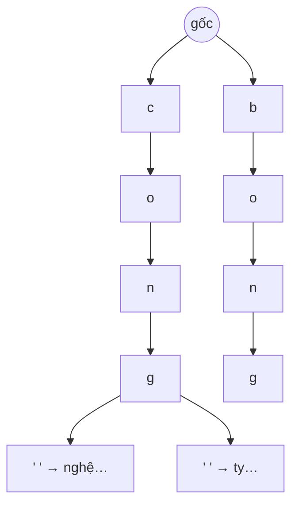
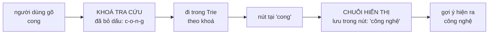

# Trie — cây tiền tố và mẹo tách khoá tra cứu khỏi chuỗi hiển thị

**File nguồn:** `search-engine/src/main/java/com/vnsearch/datastructure/Trie.java`
**Việc nó làm:** Gợi ý từ khoá (autocomplete) khi người dùng gõ vào ô tìm kiếm.

> 📖 Chưa quen ký hiệu toán? Đọc [00 — Từ điển ký hiệu toán](../00-KY-HIEU-TOAN.md) trước.


> ### 🔄 Đã cập nhật sau đợt tái cấu trúc
>
> Phần **toán học và thuật toán** dưới đây vẫn đúng nguyên vẹn. Nhưng một số
> đoạn mã trích dẫn và mục *"Hạn chế đã biết"* mô tả **phiên bản trước**.
> Những gì đã thay đổi ở file này:
>
> - **Đã sửa lỗi thread-safety** bằng `ReentrantReadWriteLock` — `getSuggestions` dùng read lock thật (đọc thuần tuý), `insert`/`clear` dùng write lock.
> - Logic dựng Trie gợi ý đã chuyển từ `SearchEngineFacade` sang lớp `SuggestionService` riêng.
>

---

## 📌 Hiểu trong 30 giây

Người dùng gõ `cong`. Hệ thống phải tìm mọi cụm từ bắt đầu bằng `cong` trong **hàng chục nghìn** cụm, và phải làm xong **trước khi họ gõ ký tự tiếp theo** — tức dưới 50 ms.

Duyệt tuyến tính là $O(M \cdot L)$ với $M$ = số cụm. Với $M = 30\,000$ và $L = 20$: 600.000 phép so ký tự mỗi lần gõ.

**Trie** đưa nó về $O(L)$ — **hoàn toàn không phụ thuộc $M$**. Gõ 4 ký tự thì đi 4 bước, dù kho có 30 nghìn hay 30 triệu cụm.



```
   Gõ "cong" — đi đúng 4 bước, bất kể kho có 30 nghìn hay 30 triệu cụm

        (gốc)
          │ c        ◀── bước 1
          ●
          │ o        ◀── bước 2
          ●
          │ n        ◀── bước 3
          ●
          │ g        ◀── bước 4
          ●  ← tới đây rồi DFS xuống lấy mọi hậu duệ
         ╱ ╲
   "công nghệ"  "công ty"  …
```

**So sánh chi phí, cùng một truy vấn:**

```
   duyệt tuyến tính  O(M·L)  ████████████████████████  600.000 phép so
   Trie              O(L)    ▏                              4 bước
                             ▲
                             M = 30.000 cụm KHÔNG xuất hiện trong công thức
```

Nhưng bài toán tiếng Việt thêm một lớp khó: người dùng gõ `cong` (không dấu) mà gợi ý phải ra `công nghệ` (có dấu). Trie khớp **từng ký tự chính xác**, nên `c-o-n-g` không bao giờ đi tới được nhánh `c-ô-n-g`. Lớp này giải bằng một mẹo gọn: **tách khoá tra cứu khỏi chuỗi hiển thị**.



Một nút giữ **hai thứ khác nhau**: đường đi tới nó là chuỗi **không dấu**, còn
thứ hiện ra cho người dùng là chuỗi **có dấu** cất trong nút. Nhờ vậy chỉ cần
**một** cây, không phải hai.

---

## 1. Cấu trúc

```java
private static class TrieNode {
    final Map<Character, TrieNode> children = new HashMap<>();
    boolean isEndOfWord = false;
    int frequency = 0;
    String display = null;
}

private TrieNode root = new TrieNode();
```

Mỗi cạnh mang **một ký tự**; đường đi từ gốc tới một node **chính là** một chuỗi.

```
Chèn: "may tinh", "may bay", "meo"

        (root)
          │ m
          ●
        ╱ a  ╲ e
       ●      ●
       │ y    │ o ●(end: "meo")
       ●
       │ ' '
       ●
     ╱ t  ╲ b
    ●       ●
    │ i     │ a
    ●       ●
    │ n     │ y ●(end: "may bay")
    ●
    │ h
    ● (end: "may tinh")
```

Tiền tố chung `may ` được **chia sẻ** — đó là nguồn gốc tên "cây tiền tố" và cũng là nguồn tiết kiệm bộ nhớ.

**Vì sao `Map<Character, TrieNode>` chứ không phải mảng.** Với bảng chữ cái ASCII 26 chữ, mảng `TrieNode[26]` nhanh hơn (tra $O(1)$ không băm). Nhưng tiếng Việt có **134 nguyên âm có dấu** cộng chữ cái cơ bản cộng chữ số cộng khoảng trắng — bảng chữ cái hiệu dụng khoảng **180 ký tự**. Mảng 180 phần tử cho **mỗi** node, mà phần lớn node chỉ có 1–2 con, là lãng phí khổng lồ:

$$180 \times 4 \text{ byte} = 720 \text{ byte/node} \quad\text{vs}\quad \text{HashMap 1 mục} \approx 48 \text{ byte}$$

**Bốn trường của node và vai trò:**

| Trường | Vai trò |
|---|---|
| `children` | Cạnh đi tiếp |
| `isEndOfWord` | Đánh dấu **kết thúc một mục**, không phải mọi node đều là mục |
| `frequency` | Số lần cụm xuất hiện — dùng xếp hạng gợi ý |
| `display` | **Chuỗi hiển thị**, có thể khác khoá — mấu chốt ở §4 |

**Vì sao cần `isEndOfWord`:** trong ví dụ trên, node ở `m-a-y` **không** phải một mục (không ai gợi ý "may"), nhưng nó nằm trên đường đi tới hai mục khác. Không có cờ này thì không phân biệt được "node trung gian" với "mục thật".

---

## 2. `insert` và `findNode` — $O(L)$

```java
public void insert(String key, String display, int frequency) {
    if (key == null || key.isEmpty() || frequency <= 0) return;
    String normalized = normalize(key);
    TrieNode node = root;
    for (int i = 0; i < normalized.length(); i++) {
        char c = normalized.charAt(i);
        node = node.children.computeIfAbsent(c, k -> new TrieNode());
    }
    node.isEndOfWord = true;
    node.frequency += frequency;
    node.display = display == null ? null : normalize(display);
}

private TrieNode findNode(String s) {
    TrieNode node = root;
    for (int i = 0; i < s.length(); i++) {
        node = node.children.get(s.charAt(i));
        if (node == null) return null;
    }
    return node;
}
```

Cả hai đều là **một vòng lặp qua $L$ ký tự**, mỗi bước một phép tra `HashMap` $O(1)$.

$$T_{\text{insert}} = T_{\text{find}} = O(L)$$

**Điểm quan trọng nhất, đáng nhấn mạnh:** độ phức tạp **không phụ thuộc số mục trong cây**. Đây là khác biệt về **chất** so với mọi cấu trúc dựa trên so sánh:

| Cấu trúc | Tìm tiền tố | Phụ thuộc $M$? |
|---|---|---|
| `ArrayList` + quét | $O(M\cdot L)$ | **có, tuyến tính** |
| `TreeMap` (cây đỏ-đen) | $O(L\log M)$ | **có, logarit** |
| **Trie** | $\mathbf{O(L)}$ | **không** |

`computeIfAbsent` thay cho cặp `get`/`put` — một lần băm thay vì hai, và code đọc rõ ý "lấy hoặc tạo".

**`frequency += frequency`** (cộng dồn, không gán đè) cho phép chèn cùng một cụm nhiều lần và tần suất tích luỹ. Đúng ngữ nghĩa với việc `SearchEngineFacade` ghi lại truy vấn thật của người dùng:

```java
suggestTrie.insert(queryKey, queryKey, 1);   // gõ lần thứ n → frequency tăng lên n
```

---

## 3. `clear` là $O(1)$ — một điểm tinh tế

```java
public void clear() {
    root = new TrieNode();
}
```

Chỉ cần bỏ tham chiếu tới gốc cũ là **toàn bộ cây con trở thành rác** và được bộ gom rác thu hồi — không cần duyệt để giải phóng từng node.

Đây là lợi ích của môi trường có GC. Trong C++ ta phải duyệt đệ quy để `delete` từng node — $O(\text{tổng số node})$.

**Vì sao `clear()` tồn tại và tại sao nó quan trọng.** Từ `SuggestionService.rebuild(index)`:

```java
// Phai xoa sach truoc khi dung lai: neu chi insert them, cac tieu de
// cua corpus CU van con nam trong trie sau moi lan crawl/reindex.
suggestTrie.clear();
```

Đây là một **lỗi thật đã xảy ra**: sau mỗi lần crawl lại, gợi ý vẫn chứa cụm từ của corpus cũ — những cụm giờ không còn tài liệu nào tương ứng. Người dùng bấm vào gợi ý và nhận về 0 kết quả.

Chú ý `root` **không** phải `final` — đúng là để `clear()` gán lại được. Một chi tiết nhỏ nhưng có chủ đích.

---

## 4. Tách khoá tra cứu khỏi chuỗi hiển thị — mẹo trung tâm

**Vấn đề, phát biểu chính xác.** Người Việt gõ không dấu trên bàn phím quốc tế: `cong` thay vì `công`. Nhưng gợi ý trả về phải là `công nghệ` **có dấu đúng chính tả** — không ai muốn thấy gợi ý `cong nghe`.

Trie khớp tiền tố theo **từng ký tự chính xác**:

$$\texttt{c} \to \texttt{o} \to \texttt{n} \to \texttt{g} \quad\text{và}\quad \texttt{c} \to \texttt{ô} \to \texttt{n} \to \texttt{g}$$

là **hai đường đi hoàn toàn khác nhau** — `o` (U+006F) và `ô` (U+00F4) là hai ký tự khác nhau. Đường thứ nhất không bao giờ tới được node của đường thứ hai.

**Giải pháp: chèn cùng một mục HAI lần, dưới hai khoá, nhưng cùng một chuỗi hiển thị.**

```java
// SuggestionService.rebuild(index)
suggestTrie.insert(phrase, phrase, frequency);
String withoutDiacritics = VietnameseTokenizer.stripDiacritics(phrase);
if (!withoutDiacritics.equals(phrase)) {
    suggestTrie.insert(withoutDiacritics, phrase, frequency);
    //                 ^^^^^^^^^^^^^^^^  ^^^^^^
    //                 khoá không dấu     hiển thị CÓ dấu
}
```

```
Cây sau khi chèn "công nghệ":

  c-ô-n-g- -n-g-h-ệ  → display = "công nghệ"     ← khoá có dấu
  c-o-n-g- -n-g-h-e  → display = "công nghệ"     ← khoá không dấu, CÙNG hiển thị
```

Kết quả:

| Người dùng gõ | Đi theo nhánh | Gợi ý nhận được |
|---|---|---|
| `côn` | có dấu | **công nghệ** |
| `cong` | không dấu | **công nghệ** |

**Gõ kiểu nào cũng ra, mà thứ nhìn thấy luôn là bản có dấu đúng chính tả.**

Trong `collectWords`:

```java
if (node.isEndOfWord) {
    out.add(new WordFrequency(
            node.display != null ? node.display : prefix.toString(), node.frequency));
}
```

`display == null` nghĩa là "hiển thị đúng bằng khoá" — trường hợp cụm vốn không có dấu (`web`, `robot`).

**Điều kiện `if (!withoutDiacritics.equals(phrase))`** tránh chèn hai lần cùng một khoá khi cụm vốn không có dấu. Cùng kỹ thuật với `InvertedIndex` (xem [InvertedIndex §6](../03-index/InvertedIndex.md)) — và cùng dựa trên tính chất **điểm bất động**:

$$\text{stripDiacritics}(s) = s \iff s \text{ không có dấu}$$

---

## 5. Khử trùng và top-K trong `getSuggestions`

```java
public List<String> getSuggestions(String prefix, int limit) {
    List<String> result = new ArrayList<>();
    if (limit <= 0) return result;
    String normalizedPrefix = prefix == null ? "" : normalize(prefix);
    TrieNode prefixNode = findNode(normalizedPrefix);
    if (prefixNode == null) return result;

    List<WordFrequency> candidates = new ArrayList<>();
    collectWords(prefixNode, new StringBuilder(normalizedPrefix), candidates);

    // Gop cac muc trung chuoi hien thi: cung mot goi y duoc chen hai lan
    // (khoa co dau va khoa khong dau) nen mot tien to ngan co the cham
    // toi ca hai node va lam goi y bi lap.
    Map<String, Integer> bestFrequency = new LinkedHashMap<>();
    for (WordFrequency wf : candidates) {
        bestFrequency.merge(wf.word, wf.frequency, Math::max);
    }
    List<WordFrequency> deduplicated = new ArrayList<>(bestFrequency.size());
    for (Map.Entry<String, Integer> entry : bestFrequency.entrySet()) {
        deduplicated.add(new WordFrequency(entry.getKey(), entry.getValue()));
    }

    List<WordFrequency> top = MinHeap.topK(
            deduplicated, limit, Comparator.comparingInt(wf -> wf.frequency));

    for (WordFrequency wf : top) result.add(wf.word);
    return result;
}
```

### 5.1 Vì sao phải khử trùng — hệ quả của mẹo §4

Mẹo chèn hai lần tạo ra một tác dụng phụ: **một tiền tố ngắn có thể chạm tới cả hai node**.

Ví dụ với cụm `công nghệ` (chèn dưới `công nghệ` và `cong nghe`), người dùng gõ tiền tố `c`:

```
DFS từ node "c" thu được:
  - "công nghệ"  (từ nhánh c-ô-n-g...)  display = "công nghệ"
  - "công nghệ"  (từ nhánh c-o-n-g...)  display = "công nghệ"   ← TRÙNG
```

Không khử trùng thì danh sách gợi ý hiện `công nghệ` hai lần — lỗi thấy được bằng mắt ngay.

**`merge(key, value, Math::max)`** gộp theo giá trị **lớn nhất**, không phải cộng dồn. Đúng: hai node là **cùng một cụm** được chèn hai lần với cùng `frequency`, nên cộng lại sẽ **nhân đôi tần suất** một cách sai lệch — và cụm nào có dấu (được chèn 2 lần) sẽ được ưu ái hơn cụm không dấu (chèn 1 lần).

`LinkedHashMap` giữ thứ tự xuất hiện, làm kết quả tái lập được giữa các lần chạy.

### 5.2 Top-K bằng MinHeap thay vì sort

```java
MinHeap.topK(deduplicated, limit, Comparator.comparingInt(wf -> wf.frequency))
```

| Cách | Độ phức tạp | $m=1000$, $k=10$ |
|---|---|---|
| Sort rồi cắt | $O(m\log m)$ | $1000\times9{,}97 = 9\,970$ |
| **`topK`** | $\mathbf{O(m\log k)}$ | $1000\times3{,}32 = \mathbf{3\,322}$ |

Nhanh hơn **3 lần**. Chi tiết ở [MinHeap §5](MinHeap.md).

Với autocomplete, tiền tố ngắn (`c`, `m`) có thể cho $m$ rất lớn — đúng lúc tối ưu này quan trọng nhất.

---

## 6. `collectWords` — DFS với `StringBuilder` tái sử dụng

```java
private void collectWords(TrieNode node, StringBuilder prefix, List<WordFrequency> out) {
    if (node.isEndOfWord) {
        out.add(new WordFrequency(
                node.display != null ? node.display : prefix.toString(), node.frequency));
    }
    for (Map.Entry<Character, TrieNode> entry : node.children.entrySet()) {
        prefix.append(entry.getKey());
        collectWords(entry.getValue(), prefix, out);
        prefix.deleteCharAt(prefix.length() - 1);      // ← QUAY LUI
    }
}
```

Đây là **DFS có quay lui (backtracking)** kinh điển.

**Mẫu ba bước:**

1. `append` — đi xuống, thêm ký tự vào đường đi hiện tại.
2. Đệ quy — khám phá cây con.
3. `deleteCharAt` — **quay lui**, khôi phục trạng thái để nhánh anh em bắt đầu đúng.

**Vì sao dùng một `StringBuilder` chung thay vì truyền chuỗi mới mỗi lần.** Nếu viết `collectWords(child, prefix + c, out)`:

- Java tạo **một chuỗi mới** ở mỗi node.
- Với cây con có $m$ mục và độ sâu trung bình $L$: $O(m \cdot L)$ ký tự được sao chép và vứt đi.

Với `StringBuilder` tái sử dụng: chỉ **1 phép append + 1 phép delete** mỗi cạnh — $O(1)$ mỗi node thay vì $O(L)$.

**Bước 3 là chỗ dễ quên nhất.** Thiếu `deleteCharAt`, `prefix` tích luỹ ký tự của mọi nhánh đã duyệt và kết quả hoàn toàn sai:

```
Duyệt "may tinh" rồi "may bay":
  đúng:  "may tinh", "may bay"
  thiếu quay lui: "may tinh", "may tinhbay"   ← sai
```

**Độ phức tạp:** $O(m)$ với $m$ = số node trong cây con của tiền tố. Mỗi node được thăm đúng một lần.

---

## 7. Chuẩn hoá Unicode ở mọi điểm vào

```java
private static String normalize(String s) {
    return Normalizer.normalize(s, Normalizer.Form.NFC);
}
```

Gọi trong `insert` (cả `key` lẫn `display`), `search`, `startsWith`, `getSuggestions`.

**Vì sao bắt buộc.** Chữ `ế` có hai biểu diễn Unicode hợp lệ:

| Dạng | Code point | Số ký tự |
|---|---|---|
| NFC | `U+1EBF` | **1** |
| NFD | `e` + `U+0302` + `U+0301` | **3** |

Với Trie, sai lệch này nghiêm trọng hơn với `HashMap`: NFC tạo **một** cạnh, NFD tạo **ba** cạnh. Hai đường đi hoàn toàn khác nhau trong cây, và cụm gõ kiểu này không bao giờ tìm ra cụm gõ kiểu kia.

Chi tiết về NFC/NFD ở [VietnameseTokenizer §3](../03-index/VietnameseTokenizer.md).

> **Một điểm chưa nhất quán:** `Trie.normalize` chỉ NFC, **không** `toLowerCase`. Còn `VietnameseTokenizer.normalizeForLookup` làm cả hai. Việc hạ chữ thường được đẩy sang người gọi (`SearchEngineFacade.suggest` gọi `prefix.trim().toLowerCase()`). Hoạt động được, nhưng lại là một bất biến phụ thuộc người gọi nhớ — cùng loại vấn đề với [InvertedIndex §4.2](../03-index/InvertedIndex.md).

---

## 8. Tổng hợp độ phức tạp

| Thao tác | Thời gian | Ghi chú |
|---|---|---|
| `insert` | **$O(L)$** | không phụ thuộc số mục |
| `search` | **$O(L)$** | |
| `startsWith` | **$O(L)$** | |
| `findNode` | $O(L)$ | |
| `getSuggestions` | **$O(L + m + m\log k)$** | $L$ tìm node, $m$ DFS, $m\log k$ top-K |
| `clear` | **$O(1)$** | nhờ GC |
| Bộ nhớ | $O(\text{tổng ký tự})$ | tốt hơn khi nhiều tiền tố chung |

**So sánh bộ nhớ với `HashMap<String, Integer>`:** Trie chia sẻ tiền tố nên tiết kiệm khi kho từ có nhiều tiền tố chung. Nhưng mỗi node là một object Java với một `HashMap` bên trong (~48 byte tối thiểu), nên với kho từ **ít** tiền tố chung, Trie **tốn hơn** `HashMap` nhiều.

Đánh đổi thật sự không phải bộ nhớ mà là **khả năng**: `HashMap` không tìm được theo tiền tố trong $O(L)$, dù có tốn ít bộ nhớ hơn.

---

## 9. Nguồn dữ liệu gợi ý — và ba lỗi đã sửa

`SuggestionService.rebuild(index)` là nơi Trie được nạp. Javadoc ghi lại **ba lỗi thật đã sửa**:

| Lỗi | Hậu quả |
|---|---|
| Chèn **nguyên tiêu đề** làm một gợi ý | Gợi ý dài loằng ngoằng, không ai gõ hết |
| Chèn **từng tiếng lẻ** | `cong`, `the`, `kinh` — trong tiếng Việt tiếng lẻ phần lớn **không phải từ** |
| Chỉ `insert` mà **không `clear()`** | Tiêu đề của corpus **cũ** vẫn còn trong Trie sau mỗi lần crawl lại |

**Cách làm hiện tại — hai nguồn cụm:**

```java
List<VietnameseTokenizer.Token> tokens = tokenizer.tokenize(title);
for (int i = 0; i < tokens.size(); i++) {
    String term = tokens.get(i).term();
    // (1) Tu ghep (tokenizer da noi bang "_") von la mot tu hoan chinh.
    if (term.indexOf('_') >= 0) {
        phraseFrequency.merge(term.replace('_', ' '), 1, Integer::sum);
    }
    // (2) Cap token lien tiep: bat cac cum nguoi dung hay go ma tu dien
    // tu ghep chua kip co, vi du "bong da Viet Nam".
    if (i + 1 < tokens.size()) {
        String bigram = (term + " " + tokens.get(i + 1).term()).replace('_', ' ');
        phraseFrequency.merge(bigram, 1, Integer::sum);
    }
}
```

Nguồn (2) là cách khéo để bắt những cụm mà từ điển KHÔNG có (tên riêng, thuật ngữ mới, cách nói địa phương): dù `bóng đá` không có trong từ điển, cặp token liên tiếp `bóng` + `đá` vẫn được ghi nhận và trở thành gợi ý.

**Hai bộ lọc thêm:**

```java
private static final int MIN_SUGGESTION_FREQUENCY = 3;
...
if (title == null || title.isBlank() || !looksVietnamese(title)) continue;
...
if (entry.getValue() < MIN_SUGGESTION_FREQUENCY) continue;
```

**`looksVietnamese` — một heuristic gọn:**

```java
private boolean looksVietnamese(String title) {
    String trimmed = title.trim();
    if (trimmed.length() < 15) return true;
    return !VietnameseTokenizer.stripDiacritics(trimmed).equals(trimmed);
}
```

*"Văn bản tiếng Việt thật gần như luôn có ít nhất một nguyên âm mang dấu trong một câu đầy đủ. Tiêu đề tiếng Anh thì không bao giờ có."*

Corpus có lẫn bài tiếng Anh của VnExpress International, trước đây làm gợi ý hiện ra `the city that helped vietnam...`. Ngưỡng 15 ký tự để không loại nhầm các tiêu đề rất ngắn (`Video`) vốn có thể không có dấu nào.

Lại một lần nữa dùng **điểm bất động** của `stripDiacritics` — cùng kỹ thuật với §4 và với [ResultRanker §3](../05-ranking/ResultRanker.md).

**Nguồn thứ ba: truy vấn thật của người dùng.**

```java
if (!normalizedQuery.isBlank() && !candidates.isEmpty()) {
    String queryKey = normalizedQuery.toLowerCase();
    suggestTrie.insert(queryKey, queryKey, 1);
    ...
}
```

Chỉ ghi lại truy vấn **có kết quả** (`!candidates.isEmpty()`) — tránh học từ truy vấn gõ sai chính tả. Đây là một vòng phản hồi tự cải thiện: càng nhiều người dùng, gợi ý càng khớp thói quen gõ thật.

---

## 10. Chủ đề DSA thể hiện

| Chủ đề | Ở đâu |
|---|---|
| **Trie (cây tiền tố)** | toàn bộ lớp |
| **Độ phức tạp không phụ thuộc kích thước tập** | $O(L)$ thay vì $O(M\log M)$ |
| **DFS có quay lui** | `collectWords` với `StringBuilder` |
| **Chia sẻ cấu trúc** | tiền tố chung dùng chung đường đi |
| **Tách khoá tra cứu khỏi giá trị hiển thị** | trường `display` |
| **Top-K bằng heap** | `MinHeap.topK` |
| **Khử trùng bằng bảng băm** | `merge(..., Math::max)` |
| **Chuẩn hoá Unicode** | NFC ở mọi điểm vào |
| **Điểm bất động của phép biến đổi** | `stripDiacritics(s) == s` (dùng 2 chỗ) |
| **`clear` $O(1)$ nhờ GC** | bỏ tham chiếu gốc |
| **Tránh cấp phát trong đệ quy** | `StringBuilder` tái sử dụng |

---

## 11. Hạn chế đã biết

1. **Không nén đường đi (no path compression).** Chuỗi node chỉ có một con đáng lẽ có thể gộp thành một cạnh mang nhiều ký tự — đó là **Radix Tree / PATRICIA trie**, tiết kiệm bộ nhớ đáng kể với kho từ thưa.
2. **`HashMap` mỗi node tốn bộ nhớ.** Với node chỉ có 1–2 con (đa số), một `HashMap` là quá nặng. Cách tối ưu phổ biến: dùng mảng nhỏ cho node ít con, chuyển sang `HashMap` khi vượt ngưỡng.
3. **Không có xoá một mục.** Chỉ có `clear()` xoá tất cả. Xoá một mục cần đánh dấu `isEndOfWord = false` rồi cắt tỉa nhánh không còn mục nào.
4. **`getSuggestions` duyệt TOÀN BỘ cây con** rồi mới lấy top-K. Với tiền tố một ký tự trên kho lớn, $m$ có thể rất lớn. Tối ưu chuẩn: lưu ở mỗi node **tần suất lớn nhất trong cây con** rồi duyệt có cắt tỉa (best-first search bằng heap) — chỉ thăm $O(k\log)$ node thay vì $m$.
5. **Không thread-safe.** `SearchEngineFacade.search()` gọi `insert` từ nhiều thread HTTP đồng thời, trong khi `getSuggestions` cũng chạy song song. `HashMap` không an toàn khi vừa đọc vừa ghi — về lý thuyết có thể sinh vòng lặp vô hạn trong bucket (đã từng là lỗi nổi tiếng của `HashMap` Java 7). **Đây là hạn chế nghiêm trọng nhất của lớp**, cần `ConcurrentHashMap` cho `children` hoặc khoá đọc-ghi.
6. **`normalize` không hạ chữ thường** — bất biến phụ thuộc người gọi (§7).
7. **Không có sửa lỗi chính tả.** Người gõ `cogn nghe` không nhận được gợi ý nào. Trie có thể mở rộng để tìm theo **khoảng cách Levenshtein $\le 1$** bằng cách duyệt song song nhiều nhánh — một mở rộng tự nhiên và có giá trị.

---

## 12. Liên kết

- Dùng để lấy top-K: [MinHeap.md](MinHeap.md)
- Nguồn dữ liệu và phép bỏ dấu: [VietnameseTokenizer.md](../03-index/VietnameseTokenizer.md)
- Bản cài đặt song song bằng TypeScript: [BookmarkTrie.md](../08-frontend/BookmarkTrie.md)
- Người gọi: `service/SearchEngineFacade.java` · `controller/SuggestController.java`
- Ký hiệu chưa hiểu: [00 — Từ điển ký hiệu toán](../00-KY-HIEU-TOAN.md)
