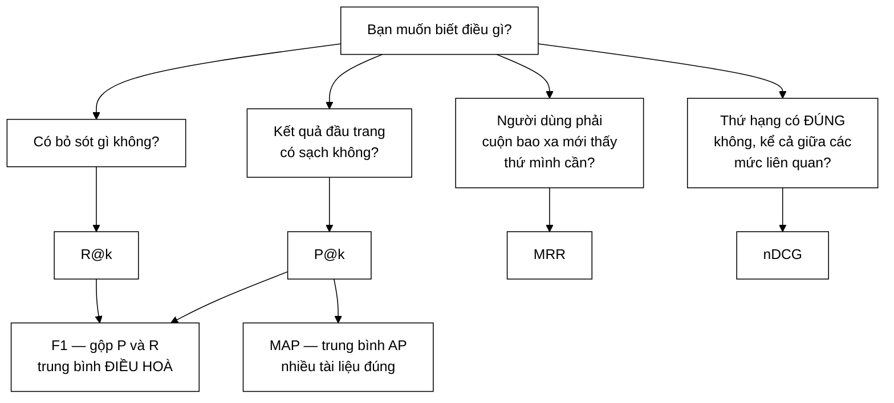

# EvaluationMetrics — bảy độ đo chuẩn của ngành truy hồi thông tin

**File nguồn:** `search-engine/src/main/java/com/vnsearch/eval/EvaluationMetrics.java`
**Việc nó làm:** Đo **chất lượng** kết quả tìm kiếm — khác hẳn với đo tốc độ.

> 📖 Chưa quen ký hiệu toán? Đọc [00 — Từ điển ký hiệu toán](../00-KY-HIEU-TOAN.md) trước.

---

## 📌 Hiểu trong 30 giây

`DSA-REPORT.md` nói hệ thống trả lời trong **1,59 ms**. Con số đó **không nói gì** về việc kết quả có **đúng** không. Một hệ thống trả về 10 kết quả ngẫu nhiên trong 0,1 ms là cực nhanh và hoàn toàn vô dụng.

Lớp này cài đặt các độ đo trả lời câu hỏi *"kết quả có tốt không?"*, theo đúng chuẩn của ngành.



```
   Một trang kết quả, ✓ = liên quan

   hạng :  1   2   3   4   5   6   7   8   9  10
           ✓   ✗   ✓   ✓   ✗   ✗   ✓   ✗   ✗   ✗

   P@5   = 3/5  = 0,60      trong 5 đầu, bao nhiêu phần đúng
   MRR   = 1/1  = 1,00      1 chia cho hạng của kết quả đúng ĐẦU TIÊN
   nDCG  = …                thưởng nhiều hơn khi thứ hạng CAO

   Nếu đảo thành:  ✗ ✗ ✗ ✗ ✓ ✓ ✓ …
   P@5 tụt còn 1/5, MRR tụt còn 1/5 = 0,20
   ⇒ cùng số tài liệu đúng, nhưng THỨ TỰ khác ⇒ điểm khác hẳn
```

**Vì sao F1 dùng trung bình điều hoà chứ không phải trung bình cộng:**

```
   Hệ thống trả về TOÀN BỘ corpus:  P = 0,001   R = 1,00

   trung bình cộng   = (0,001 + 1,00)/2 = 0,50   ◀── nghe như khá tốt!
   trung bình điều hoà = 2PR/(P+R)      ≈ 0,002  ◀── đúng: hệ thống vô dụng
```

Trung bình điều hoà **bị kéo về phía giá trị nhỏ**, nên nó không cho phép một
chỉ số cao che lấp một chỉ số thảm hoạ.

| Độ đo | Trả lời câu hỏi |
|---|---|
| **P@k** | Trong $k$ kết quả đầu, bao nhiêu phần là đúng? |
| **R@k** | Trong tất cả kết quả đúng, ta lấy được bao nhiêu phần? |
| **F1@k** | Cân bằng hai cái trên |
| **AP / MAP** | Có đưa kết quả đúng lên **cao** không? |
| **nDCG@k** | Như AP, nhưng phân biệt "đúng" với "rất đúng" |
| **MRR** | Kết quả đúng **đầu tiên** ở hạng bao nhiêu? |
| **Success@k** | Người dùng có tìm thấy thứ cần ngay trang đầu không? |

---

## 1. Hai quy ước nền tảng

### 1.1 Dùng URL làm định danh, không dùng docId

```java
public static double precisionAtK(List<String> ranked, Map<String, Integer> qrels, int k)
//                                     ^^^^^^ URL          ^^^^^^ URL → mức độ
```

Javadoc giải thích:

> *"Dùng URL làm định danh thay vì `docId` vì docId được gán lại mỗi lần crawl — nhãn liên quan gán tay sẽ hỏng hết sau lần crawl kế tiếp, còn URL thì ổn định."*

Đây là quyết định quan trọng về **chi phí lao động**. Gán nhãn tay cho vài trăm cặp (truy vấn, tài liệu) tốn hàng giờ. Nếu nhãn khoá theo `docId`, toàn bộ công đó **mất trắng** sau mỗi lần crawl — vì `CrawlerService` cấp docId theo thứ tự hoàn thành, không tất định.

URL bền vững qua các lần crawl, nên nhãn dùng lại được mãi.

### 1.2 Nhãn nhiều bậc, và giả định TREC

```java
public static final int RELEVANT_THRESHOLD = 1;

private static int gradeOf(Map<String, Integer> qrels, String url) {
    Integer grade = qrels.get(url);
    return grade == null ? 0 : grade;      // ← không có nhãn = KHÔNG liên quan
}

private static boolean isRelevant(Map<String, Integer> qrels, String url) {
    return gradeOf(qrels, url) >= RELEVANT_THRESHOLD;
}
```

| Mức | Ý nghĩa | Dùng bởi |
|---|---|---|
| 0 | Không liên quan | tất cả |
| 1 | Liên quan | P, R, MAP, MRR (nhị phân) |
| 2 | **Rất** liên quan | chỉ **nDCG** |

**Giả định quan trọng nhất:** *"URL không có trong map được coi là mức 0"* — tức **"chưa gán nhãn tức là không liên quan"**.

Đây đúng chuẩn TREC khi dùng phương pháp **pooling** (xem [PoolBuilder](PoolBuilder.md)), và nó là một **giả định có thể sai**: một tài liệu thực sự liên quan mà không hệ thống nào đưa lên top sẽ bị coi là không liên quan.

Hệ quả: **Recall bị ước lượng cao hơn thực tế** (mẫu số nhỏ hơn thật). Đây là hạn chế đã biết của phương pháp pooling, và mọi báo cáo IR đều phải nói rõ.

---

## 2. Precision@k — và một quyết định về mẫu số

$$P@k = \frac{\lvert\{\text{tài liệu liên quan trong } k \text{ kết quả đầu}\}\rvert}{k}$$

```java
public static double precisionAtK(List<String> ranked, Map<String, Integer> qrels, int k) {
    if (k <= 0) return 0.0;
    int hits = 0;
    int limit = Math.min(k, ranked.size());
    for (int i = 0; i < limit; i++) {
        if (isRelevant(qrels, ranked.get(i))) hits++;
    }
    return (double) hits / k;               // ← mẫu số là k, KHÔNG phải limit
}
```

**Chi tiết quyết định: mẫu số là `k`, không phải `Math.min(k, ranked.size())`.**

Javadoc giải thích:

> *"một hệ thống trả về 3 kết quả đúng cả 3 KHÔNG nên được chấm P@10 = 1,0 ngang với hệ thống trả đủ 10 kết quả đúng cả 10 — việc trả về quá ít kết quả tự nó đã là một khiếm khuyết và phải bị phạt."*

**Bảng minh hoạ:**

| Hệ thống | Số kết quả trả về | Số đúng | Mẫu số $= k$ | Mẫu số $= \min(k,n)$ |
|---|---|---|---|---|
| A | 10 | 10 | $10/10 = \mathbf{1{,}00}$ | $10/10 = 1{,}00$ |
| B | 3 | 3 | $3/10 = \mathbf{0{,}30}$ | $3/3 = 1{,}00$ ← **sai** |

Với mẫu số $\min$, hệ thống B "hoàn hảo" ngang A dù bỏ sót 7 kết quả. Đây đúng quy ước TREC và nó phạt đúng thứ cần phạt.

---

## 3. Recall@k

$$R@k = \frac{\lvert\{\text{tài liệu liên quan trong } k \text{ kết quả đầu}\}\rvert}{\lvert\{\text{tất cả tài liệu liên quan đã biết}\}\rvert}$$

```java
public static double recallAtK(List<String> ranked, Map<String, Integer> qrels, int k) {
    long totalRelevant = countRelevant(qrels);
    if (totalRelevant == 0 || k <= 0) return 0.0;
    ...
    return (double) hits / totalRelevant;
}
```

**Precision và Recall đối lập nhau — đây là đánh đổi cơ bản nhất của IR:**

| Chiến lược | Precision | Recall |
|---|---|---|
| Trả về **1** kết quả (chắc chắn nhất) | cao | **rất thấp** |
| Trả về **toàn bộ** corpus | **rất thấp** | 1,0 (hoàn hảo) |

Nên phải xét **cả hai**, hoặc dùng F1 gộp lại.

**Trả về 0 khi `totalRelevant == 0`.** Về mặt toán học thì $0/0$ không xác định. Trả 0 là quy ước — nhưng nó **nhập nhằng** với trường hợp "có tài liệu liên quan nhưng không tìm thấy cái nào". Cách chặt chẽ hơn là loại truy vấn đó khỏi phép trung bình.

---

## 4. F1@k — vì sao trung bình ĐIỀU HOÀ

$$F_1@k = \frac{2 \cdot P@k \cdot R@k}{P@k + R@k}$$

```java
public static double f1AtK(List<String> ranked, Map<String, Integer> qrels, int k) {
    double p = precisionAtK(ranked, qrels, k);
    double r = recallAtK(ranked, qrels, k);
    return (p + r) == 0.0 ? 0.0 : 2 * p * r / (p + r);
}
```

**Vì sao trung bình điều hoà chứ không phải cộng.**

Trung bình điều hoà **bị chi phối bởi giá trị nhỏ hơn** — nó "phạt" sự mất cân bằng:

| $P$ | $R$ | Cộng: $(P+R)/2$ | **Điều hoà: $F_1$** |
|---|---|---|---|
| 1,0 | 0,0 | **0,50** | **0,00** |
| 0,9 | 0,1 | 0,50 | **0,18** |
| 0,7 | 0,3 | 0,50 | 0,42 |
| **0,5** | **0,5** | **0,50** | **0,50** |

Bốn hàng có cùng trung bình cộng 0,50, nhưng $F_1$ phân biệt rõ ràng. Hàng đầu — precision hoàn hảo nhưng recall bằng 0 — là một hệ thống **vô dụng** (trả về đúng 1 kết quả và bỏ sót tất cả), và $F_1 = 0$ nói đúng điều đó.

**Bất đẳng thức tổng quát:** với mọi $a, b > 0$,

$$\underbrace{\frac{2ab}{a+b}}_{\text{điều hoà}} \;\le\; \underbrace{\sqrt{ab}}_{\text{hình học}} \;\le\; \underbrace{\frac{a+b}{2}}_{\text{cộng}}$$

Dấu bằng chỉ khi $a = b$. Nên $F_1$ chỉ đạt cao khi **cả hai** đều cao.

---

## 5. Average Precision — độ đo nhạy với THỨ TỰ

$$AP = \frac{1}{\lvert R\rvert}\sum_{i=1}^{n} P@i \cdot \mathbb{1}[\text{tài liệu ở hạng } i \text{ liên quan}]$$

```java
public static double averagePrecision(List<String> ranked, Map<String, Integer> qrels) {
    long totalRelevant = countRelevant(qrels);
    if (totalRelevant == 0) return 0.0;
    double sumPrecision = 0.0;
    int hits = 0;
    for (int i = 0; i < ranked.size(); i++) {
        if (isRelevant(qrels, ranked.get(i))) {
            hits++;
            sumPrecision += (double) hits / (i + 1);   // Precision tại đúng vị trí này
        }
    }
    return sumPrecision / totalRelevant;
}
```

**Vì sao AP quan trọng hơn P@k.** P@10 **không phân biệt** thứ tự trong top-10: đưa kết quả đúng lên hạng 1 hay dìm xuống hạng 10 đều cho P@10 như nhau. Nhưng người dùng thì rất quan tâm.

**Ví dụ tính tay.** Có 3 tài liệu liên quan; hệ thống trả 5 kết quả.

**Trường hợp A — kết quả đúng ở đầu:**

| Hạng $i$ | Liên quan? | hits | $P@i$ | Cộng vào? |
|---|---|---|---|---|
| 1 | ✅ | 1 | $1/1 = 1{,}000$ | ✅ |
| 2 | ✅ | 2 | $2/2 = 1{,}000$ | ✅ |
| 3 | ❌ | 2 | — | |
| 4 | ✅ | 3 | $3/4 = 0{,}750$ | ✅ |
| 5 | ❌ | 3 | — | |

$$AP_A = \frac{1{,}000 + 1{,}000 + 0{,}750}{3} = \frac{2{,}750}{3} = \mathbf{0{,}9167}$$

**Trường hợp B — cùng 3 kết quả đúng nhưng ở cuối:**

| Hạng $i$ | Liên quan? | hits | $P@i$ |
|---|---|---|---|
| 1 | ❌ | 0 | — |
| 2 | ❌ | 0 | — |
| 3 | ✅ | 1 | $1/3 = 0{,}333$ |
| 4 | ✅ | 2 | $2/4 = 0{,}500$ |
| 5 | ✅ | 3 | $3/5 = 0{,}600$ |

$$AP_B = \frac{0{,}333 + 0{,}500 + 0{,}600}{3} = \frac{1{,}433}{3} = \mathbf{0{,}4778}$$

**Cùng P@5 = 0,6, nhưng AP chênh gần gấp đôi.** Đó chính là điều P@k không thấy.

**Chia cho `totalRelevant` (chứ không phải `hits`)** để hệ thống **bỏ sót vẫn bị phạt**: nếu chỉ tìm được 1 trong 3 tài liệu liên quan, mẫu số vẫn là 3.

**MAP** (Mean Average Precision) là trung bình AP trên toàn bộ bộ truy vấn:

$$MAP = \frac{1}{\lvert Q\rvert}\sum_{q\in Q} AP_q$$

---

## 6. nDCG@k — độ đo duy nhất dùng nhãn nhiều bậc

$$DCG@k = \sum_{i=1}^{k} \frac{2^{\text{rel}_i} - 1}{\log_2(i+1)}$$

$$nDCG@k = \frac{DCG@k}{IDCG@k}$$

```java
public static double ndcgAtK(List<String> ranked, Map<String, Integer> qrels, int k) {
    if (k <= 0) return 0.0;
    double dcg = 0.0;
    int limit = Math.min(k, ranked.size());
    for (int i = 0; i < limit; i++) {
        dcg += gain(gradeOf(qrels, ranked.get(i))) / discount(i);
    }

    List<Integer> idealGrades = new ArrayList<>(qrels.values());
    idealGrades.sort((a, b) -> Integer.compare(b, a));      // giảm dần
    double idcg = 0.0;
    int idealLimit = Math.min(k, idealGrades.size());
    for (int i = 0; i < idealLimit; i++) {
        idcg += gain(idealGrades.get(i)) / discount(i);
    }

    return idcg == 0.0 ? 0.0 : dcg / idcg;
}

private static double gain(int grade) {
    return Math.pow(2, grade) - 1;
}

private static double discount(int zeroBasedIndex) {
    return Math.log(zeroBasedIndex + 2) / Math.log(2);      // log2(i+2) = log2(hạng+1)
}
```

### 6.1 Độ lợi hàm mũ $2^{\text{rel}} - 1$

| $\text{rel}$ | Tuyến tính | **Hàm mũ $2^{\text{rel}}-1$** |
|---|---|---|
| 0 | 0 | **0** |
| 1 | 1 | **1** |
| 2 | 2 | **3** |

Với thang 0/1/2, tài liệu "rất liên quan" được **3 điểm** còn "liên quan" được 1 điểm — nhấn mạnh **gấp ba**. Cách tuyến tính chỉ cho tỉ lệ 2:1.

Javadoc giải thích: *"không phản ánh đúng thực tế là người dùng quan tâm kết quả xuất sắc hơn nhiều so với kết quả tạm được."*

$\text{rel} = 0$ cho $2^0 - 1 = 0$ — tài liệu không liên quan không đóng góp gì, đúng như mong muốn.

### 6.2 Hệ số chiết khấu $\log_2(\text{hạng}+1)$

```java
private static double discount(int zeroBasedIndex) {
    return Math.log(zeroBasedIndex + 2) / Math.log(2);
}
```

Với `i` đếm từ 0, hạng là `i+1`, nên $\log_2(\text{hạng}+1) = \log_2(i+2)$. Chỉ số `+2` chính là chỗ này.

**Bảng chiết khấu:**

| Hạng | $\log_2(\text{hạng}+1)$ | Trọng số $1/\log$ |
|---|---|---|
| 1 | $\log_2 2 = 1{,}000$ | **1,000** |
| 2 | $\log_2 3 = 1{,}585$ | 0,631 |
| 3 | $\log_2 4 = 2{,}000$ | 0,500 |
| 5 | $\log_2 6 = 2{,}585$ | 0,387 |
| 10 | $\log_2 11 = 3{,}459$ | **0,289** |
| 20 | $\log_2 21 = 4{,}392$ | 0,228 |

Kết quả ở hạng 10 chỉ đáng **28,9 %** so với hạng 1. Đây là mô hình hoá hành vi *"càng xuống dưới càng ít người nhìn tới"*.

**Vì sao $\log$ chứ không phải $1/i$ tuyến tính.** $1/i$ giảm quá nhanh: hạng 10 chỉ còn 10 % — quá khắc nghiệt. $\log$ cho đường cong thoải hơn, khớp tốt hơn với dữ liệu tỉ lệ nhấp chuột thật đo được trên các máy tìm kiếm.

Java không có `log2`, nên đổi cơ số thủ công: $\log_2 x = \ln x / \ln 2$.

### 6.3 Chuẩn hoá bằng IDCG

**IDCG** là DCG của **thứ tự lý tưởng** — sắp mọi nhãn giảm dần:

```java
idealGrades.sort((a, b) -> Integer.compare(b, a));    // b so a = giảm dần
```

Chia cho IDCG đưa kết quả về $[0, 1]$, nên **so sánh được giữa các truy vấn** có số tài liệu liên quan khác nhau. Không chuẩn hoá, một truy vấn có 20 tài liệu liên quan luôn cho DCG cao hơn truy vấn có 2 — dù hệ thống làm tệ hơn.

### 6.4 Ví dụ tính tay đầy đủ

Nhãn: 1 tài liệu mức 2, 2 tài liệu mức 1. $k = 3$.

**Kết quả hệ thống:** `[mức 1, mức 2, mức 0]`

$$DCG@3 = \frac{2^1-1}{\log_2 2} + \frac{2^2-1}{\log_2 3} + \frac{2^0-1}{\log_2 4} = \frac{1}{1{,}000} + \frac{3}{1{,}585} + \frac{0}{2{,}000}$$

$$= 1{,}000 + 1{,}893 + 0 = \mathbf{2{,}893}$$

**Thứ tự lý tưởng:** `[2, 1, 1]`

$$IDCG@3 = \frac{3}{1{,}000} + \frac{1}{1{,}585} + \frac{1}{2{,}000} = 3{,}000 + 0{,}631 + 0{,}500 = \mathbf{4{,}131}$$

$$nDCG@3 = \frac{2{,}893}{4{,}131} = \mathbf{0{,}7003}$$

**Đọc kết quả:** hệ thống đạt 70 % mức lý tưởng. Nó tìm được cả hai tài liệu liên quan nhưng **đặt sai thứ tự** — để tài liệu mức 1 trên tài liệu mức 2. Chỉ riêng lỗi thứ tự đó làm mất 30 %.

---

## 7. MRR và Success@k — độ đo cho known-item search

$$RR = \frac{1}{\text{rank của tài liệu liên quan đầu tiên}}, \qquad MRR = \frac{1}{\lvert Q\rvert}\sum_{q\in Q} RR_q$$

```java
public static double reciprocalRank(List<String> ranked, String targetUrl) {
    int rank = ranked.indexOf(targetUrl);
    return rank < 0 ? 0.0 : 1.0 / (rank + 1);
}

public static double successAtK(List<String> ranked, String targetUrl, int k) {
    int rank = ranked.indexOf(targetUrl);
    return rank >= 0 && rank < k ? 1.0 : 0.0;
}
```

**Bảng giá trị RR:**

| Hạng của đích | RR |
|---|---|
| 1 | **1,000** |
| 2 | 0,500 |
| 3 | 0,333 |
| 5 | 0,200 |
| 10 | 0,100 |
| không tìm thấy | **0,000** |

**Vì sao MRR phù hợp nhất cho known-item search.** Trong bài toán này (xem [KnownItemQueryGenerator](KnownItemQueryGenerator.md)) có **đúng một** tài liệu đúng. Người dùng chỉ cần tìm ra nó, và điều duy nhất quan trọng là **nó nằm ở hạng bao nhiêu**.

**Đường cong RR rất dốc ở đầu:** từ hạng 1 xuống hạng 2 mất **50 %** điểm; từ hạng 9 xuống hạng 10 chỉ mất 1,1 %. Điều này khớp thực tế: khác biệt giữa "kết quả đầu tiên" và "kết quả thứ hai" lớn hơn nhiều so với giữa "thứ chín" và "thứ mười".

**Kết quả thật của dự án** (200 truy vấn, `EVALUATION.md`):

| Cấu hình | MRR | Success@1 | Success@5 | Success@10 |
|---|---|---|---|---|
| TF-IDF thuần | 0,8537 | 78,0 % | 95,0 % | 96,5 % |
| BM25 thuần | 0,8989 | 85,0 % | 96,5 % | 97,5 % |
| **TF-IDF + PR + title** | **0,8758** | **81,5 %** | **95,5 %** | **97,5 %** |

**Đọc MRR = 0,8758 thế nào:** MRR là trung bình của $1/	ext{hạng}$, nên **không** được nghịch đảo nó để suy ra hạng trung bình — $1/0{,}8758$ chỉ là hạng của một truy vấn *giả định* đại diện, không phải trung bình hạng thật (bất đẳng thức Jensen). Cách đọc đúng là qua Success@k: 81,5 % số truy vấn có đích ngay hạng 1, và 95,5 % có đích trong 5 hạng đầu.

> ⚠️ **Chú ý về cách diễn giải:** $1/\text{MRR}$ **không** phải hạng trung bình, vì $\mathbb{E}[1/X] \ne 1/\mathbb{E}[X]$ (bất đẳng thức Jensen). Nó là **nghịch đảo của trung bình điều hoà** của các hạng. Cách đọc chính xác vẫn là: "MRR càng gần 1 thì đích càng thường xuyên ở đầu".

**`indexOf` là $O(n)$** nhưng $n \le 20$ (số kết quả trả về) nên không đáng kể.

---

## 8. Tổng hợp độ phức tạp

| Độ đo | Thời gian |
|---|---|
| `precisionAtK`, `recallAtK`, `f1AtK` | $O(k)$ |
| `countRelevant` | $O(\lvert\text{qrels}\rvert)$ |
| `averagePrecision` | $O(\lvert\text{ranked}\rvert)$ |
| **`ndcgAtK`** | $O(k + \lvert\text{qrels}\rvert\log\lvert\text{qrels}\rvert)$ — có **sort** dựng thứ tự lý tưởng |
| `reciprocalRank`, `successAtK` | $O(\lvert\text{ranked}\rvert)$ — `indexOf` |
| `mean` | $O(\lvert\text{values}\rvert)$ |

Chi phí đo đạc hoàn toàn không đáng kể so với chi phí chạy truy vấn (1,59 ms mỗi truy vấn × 200 truy vấn × 11 cấu hình).

> **Một điểm kém hiệu quả nhỏ:** `recallAtK` gọi `countRelevant(qrels)` mỗi lần, và `countRelevant` dùng stream duyệt cả map. Với `f1AtK` gọi cả `precisionAtK` lẫn `recallAtK`, đó là duyệt qrels một lần thừa. Không đáng kể ở quy mô này.

---

## 9. Lớp tiện ích viết đúng chuẩn

```java
public final class EvaluationMetrics {
    private EvaluationMetrics() {
    }
    ...
}
```

`final` + constructor `private` — giống [CandidateResolver](../03-query/CandidateResolver.md), khác với `PostingListMerger` (thiếu cả hai).

Mọi phương thức là **hàm thuần tuý**: cùng đầu vào luôn cho cùng đầu ra, không trạng thái, không tác dụng phụ. Đây là dạng code **dễ test nhất có thể** — và đó là lý do lớp này có bộ test riêng (`EvaluationMetricsTest`).

---

## 10. Chủ đề DSA thể hiện

| Chủ đề | Ở đâu |
|---|---|
| **Độ đo chuẩn ngành IR** | P, R, F1, AP, MAP, nDCG, MRR, Success@k |
| **Trung bình điều hoà** | $F_1$ phạt sự mất cân bằng |
| **Chiết khấu logarit theo vị trí** | $1/\log_2(\text{hạng}+1)$ |
| **Độ lợi hàm mũ** | $2^{\text{rel}}-1$ nhấn mạnh mức cao |
| **Chuẩn hoá về $[0,1]$** | chia cho IDCG để so sánh giữa truy vấn |
| **Định danh bền vững** | URL thay vì docId |
| **Quy ước TREC** | mẫu số $=k$; chưa gán nhãn $=$ không liên quan |
| **Hàm thuần tuý** | không trạng thái, test được trực tiếp |
| **Sắp xếp để dựng chuẩn lý tưởng** | IDCG |

---

## 11. Hạn chế đã biết

1. **Không có kiểm định thống kê.** Chênh lệch MRR 0,8537 vs 0,8989 có **ý nghĩa thống kê** không? Với 200 truy vấn, cần **paired t-test** hoặc **randomization test** để trả lời. Không có nó, ta không biết chênh lệch là thật hay là nhiễu lấy mẫu. Đây là thiếu sót đáng kể nhất về mặt phương pháp.
2. **Không có khoảng tin cậy.** Nên báo cáo MRR $= 0{,}9229 \pm \delta$ thay vì một số trần trụi.
3. **`recallAtK` trả 0 khi không có tài liệu liên quan** — nhập nhằng với "có mà không tìm thấy" (§3).
4. **nDCG dùng toàn bộ qrels để dựng IDCG**, kể cả tài liệu mức 0. Không sai (chúng đóng góp 0) nhưng làm sort tốn hơn cần thiết.
5. **Không có ERR** (Expected Reciprocal Rank) — độ đo hiện đại hơn nDCG, mô hình hoá việc người dùng **dừng đọc** sau khi tìm thấy kết quả đủ tốt.
6. **Không có độ đo đa dạng.** Nếu 10 kết quả đầu đều là bản sao của cùng một bài, mọi độ đo ở đây đều cho điểm cao — nhưng người dùng thì không hài lòng. Cần $\alpha$-nDCG hoặc S-recall.
7. **Nhãn nhị phân cho hầu hết độ đo.** Chỉ nDCG dùng mức 2. Với 6/7 độ đo, công sức phân biệt "liên quan" và "rất liên quan" bị lãng phí.

---

## 12. Liên kết

- Nguồn truy vấn và ground truth: [KnownItemQueryGenerator.md](KnownItemQueryGenerator.md)
- Nguồn nhãn nhiều bậc: [PoolBuilder.md](PoolBuilder.md)
- Đường chạy truy vấn: `eval/EvaluationHarness.java`
- Kết quả đầy đủ: `docs/EVALUATION.md`
- Ký hiệu chưa hiểu: [00 — Từ điển ký hiệu toán](../00-KY-HIEU-TOAN.md)
