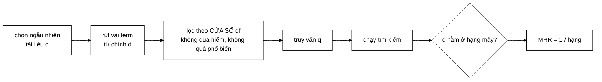

# KnownItemQueryGenerator — lật ngược bài toán để có ground truth miễn phí

**File nguồn:** `search-engine/src/main/java/com/vnsearch/eval/KnownItemQueryGenerator.java`
**Việc nó làm:** Sinh 200 truy vấn đánh giá **tự động** và **khách quan**, không cần một giờ gán nhãn nào.

> 📖 Chưa quen ký hiệu toán? Đọc [00 — Từ điển ký hiệu toán](../00-KY-HIEU-TOAN.md) trước.

> 📊 **Số đo trong trang này thuộc mốc A** — corpus **5.011 trang**. Repo có
> **bốn mốc corpus** đo trên bốn phiên crawl khác nhau; trộn chúng vào một bảng
> là cách nhanh nhất để ra số vô nghĩa. Bảng quy chiếu đầy đủ ở đầu
> [`DSA-REPORT.md`](../../DSA-REPORT.md). Mốc hiện hành là **D — 31.030 trang**.

---

## 📌 Hiểu trong 30 giây

Muốn đo chất lượng tìm kiếm thì phải có **đáp án đúng** (qrels). Mà đáp án đúng thường phải do người gán tay — vừa tốn công, vừa chủ quan.

**Known-item search** là phương pháp kinh điển né được điều đó bằng cách **lật ngược câu hỏi**:

| Cách thường | **Known-item** |
|---|---|
| Cho truy vấn → hỏi *"tài liệu nào liên quan?"* | Cho tài liệu → **sinh truy vấn từ chính nó** |
| Cần người gán nhãn | **Ground truth hiển nhiên** là tài liệu đó |



```
   Vòng khép kín — không cần một người gán nhãn nào

        tài liệu d  ────rút term────▶  truy vấn q
             ▲                              │
             │                              ▼
             └────── đáp án đúng ◀──── chạy tìm kiếm
                    (chính là d)
```

**Vì sao phải có cửa sổ df** — đây là chỗ tinh tế nhất:

```
   df = 1        term chỉ xuất hiện ở ĐÚNG d
                 ⇒ truy vấn tầm thường, hệ thống nào cũng đạt 100%
                 ⇒ phép đo VÔ NGHĨA

   df quá cao    term như "của", "và"
                 ⇒ truy vấn không phân biệt nổi d với hàng nghìn bài khác
                 ⇒ phép đo cũng vô nghĩa, theo chiều ngược lại

   ├──────────┼════════════════════┼──────────┤
   df = 1     df_min          df_max      df = N
              └── cửa sổ dùng được ──┘
```

Nó mô phỏng đúng một tình huống thật rất phổ biến: *người dùng nhớ mang máng một bài báo rồi gõ vài từ khoá để tìm lại*.

Nhưng có một cái bẫy chết người: nếu chọn từ khoá sai cách, bài đánh giá trở nên **hoàn toàn vô nghĩa** — và §2 là về cái bẫy đó.

---

## 1. Ý tưởng và cấu trúc dữ liệu

```java
public record KnownItemQuery(String queryText, String targetUrl, int targetDocId, List<String> terms) {
}
```

| Trường | Vai trò |
|---|---|
| `queryText` | Chuỗi đưa vào search engine |
| `targetUrl` | **Ground truth** — hệ thống lý tưởng phải trả về ở hạng 1 |
| `targetDocId` | Tham chiếu nội bộ |
| `terms` | Các term đã chọn (để gỡ lỗi và báo cáo) |

Độ đo phù hợp: **MRR** và **Success@k** (xem [EvaluationMetrics §7](EvaluationMetrics.md)) — vì có đúng một tài liệu đúng.

---

## 2. Cái bẫy: chọn từ khoá thế nào cho truy vấn có ý nghĩa

Javadoc gọi thẳng đây là *"chỗ dễ làm sai nhất"*:

> *"Nếu chọn các term hiếm nhất ($\text{df} = 1$) thì phép giao posting list chỉ còn đúng một tài liệu, hệ thống nào cũng đạt MRR = 1,0 và bài đánh giá trở nên vô nghĩa."*

**Phân tích chi tiết.** Nếu term $t$ có $\text{df}(t) = 1$, thì posting list của nó có đúng **một** tài liệu. Với AND ngầm định:

$$\lvert\text{ứng viên}\rvert \;\le\; \min_t \text{df}(t) = 1$$

Chỉ còn **một** ứng viên — chính là tài liệu đích. Mọi hệ thống xếp hạng, dù tốt hay tệ, đều trả về nó ở hạng 1:

$$\text{MRR} = 1{,}000, \qquad \text{Success@1} = 100\%$$

**Bài đánh giá không đo gì cả.** Nó đo khả năng của **phép giao posting list**, không đo khả năng của **thuật toán xếp hạng** — mà xếp hạng mới là thứ ta muốn so sánh.

Đây là một dạng **rò rỉ thông tin**: truy vấn chứa thông tin định danh duy nhất của đáp án.

**Lời giải: lọc theo cửa sổ df.**

```java
public static final int MIN_DF = 3;
public static final double MAX_DF_RATIO = 0.10;
...
int maxDf = Math.max(MIN_DF, (int) Math.round(totalDocs * MAX_DF_RATIO));
...
if (df < MIN_DF || df > maxDf) continue;
```

$$\text{MIN\_DF} \;\le\; \text{df}(t) \;\le\; \text{MAX\_DF\_RATIO} \times N$$

Với $N = 5011$:

$$3 \;\le\; \text{df}(t) \;\le\; 501$$

| Ngưỡng | Loại bỏ gì | Vì sao |
|---|---|---|
| $\text{df} \ge 3$ | Term quá hiếm | Truy vấn trở nên **tầm thường**; đồng thời loại nhiễu (lỗi chính tả, mã số, chuỗi rác) |
| $\text{df} \le 501$ | Term quá phổ biến | Gần như không mang thông tin phân biệt |

**Vì sao cận dưới là 3 chứ không phải 2.** Với $\text{df} = 2$, truy vấn 3 term vẫn có thể cho ra giao chỉ 1 tài liệu nếu các term chồng nhau. 3 là biên an toàn tối thiểu mà vẫn giữ được nhiều term để chọn.

**Vì sao cận trên là tỉ lệ chứ không phải số cố định.** $\text{df} \le 501$ với $N = 5011$; nếu corpus tăng lên 50.000 thì cận trên tự động thành 5.000. Dùng tỉ lệ làm ngưỡng **co giãn theo quy mô** — nếu cố định ở 501, với corpus lớn thì hầu như mọi term có nghĩa đều bị loại.

`Math.max(MIN_DF, ...)` xử lý corpus rất nhỏ: với $N = 20$, $0{,}1N = 2 < 3$ — không có term nào lọt cửa sổ. Lấy max đảm bảo cửa sổ không rỗng.

---

## 3. Chọn term phân biệt nhất bằng TF-IDF + boost tiêu đề

```java
private static final double TITLE_BOOST = 2.0;
...
Set<String> titleTerms = new HashSet<>();
for (VietnameseTokenizer.Token token : tokenizer.tokenize(doc.getTitle())) {
    titleTerms.add(token.term());
}
...
double score = TfIdfScorer.tf(entry.getValue()) * TfIdfScorer.idf(totalDocs, df);
if (titleTerms.contains(term)) {
    score *= TITLE_BOOST;
}
scored.add(new ScoredTerm(term, score));
...
scored.sort(Comparator.comparingDouble(ScoredTerm::score).reversed());
```

$$\text{score}(t) = \text{tf}(t,d) \cdot \text{idf}(t) \cdot \bigl(1 + \mathbb{1}[t \in \text{title}]\bigr)$$

**Vì sao nhân đôi điểm cho term trong tiêu đề.** Javadoc: *"vì đó chính là thứ người dùng nhớ và gõ lại."*

Đây là một giả định về **mô hình người dùng**, và nó hợp lý: khi cố nhớ lại một bài báo, người ta nhớ tiêu đề chứ không nhớ đoạn giữa thân bài.

**Dùng lại đúng `TfIdfScorer.tf` và `TfIdfScorer.idf`** của hệ thống thật — không viết lại công thức. Đây là cùng nguyên tắc "một cài đặt duy nhất" mà [CandidateResolver](../03-query/CandidateResolver.md) thể hiện.

> **Nhưng có một điểm đáng đặt câu hỏi về mặt phương pháp.** Bộ sinh truy vấn dùng **chính** TF-IDF để chọn từ khoá, rồi ta lại dùng bộ truy vấn đó để so sánh TF-IDF với BM25. Điều này tạo một **thiên lệch nhẹ có lợi cho TF-IDF**: các term được chọn là những term mà TF-IDF cho điểm cao.
>
> Thực nghiệm cho thấy BM25 vẫn thắng TF-IDF (0,8989 vs 0,8537) **bất chấp** thiên lệch này — nên kết luận vẫn vững, thậm chí còn mạnh hơn. Nhưng đây là điều phải nói rõ trong phần hạn chế của báo cáo, không được im lặng.
>
> Cách trung lập hơn: chọn term ngẫu nhiên trong cửa sổ df, hoặc dùng một tiêu chí không thuộc về bất kỳ mô hình nào đang so sánh.

**Chỉ dùng dạng CÓ DẤU:**

```java
// Chỉ dùng dạng CÓ DẤU: chỉ mục lưu song song cả bản không dấu,
// nếu lấy cả hai thì truy vấn sinh ra sẽ lặp cùng một từ hai lần.
termFrequency.merge(token.term(), 1, Integer::sum);
```

Nếu lấy cả `noDiacriticTerm`, truy vấn sẽ thành `máy tính may tinh` — lặp cùng một khái niệm và làm sai trọng số. Đây là hệ quả trực tiếp của thiết kế chỉ mục kép ở [InvertedIndex §6](../02-index/InvertedIndex.md).

---

## 4. Tính tái lập — điều kiện bắt buộc của một thí nghiệm

```java
List<Integer> docIds = new ArrayList<>(index.getAllDocuments().keySet());
docIds.sort(Integer::compareTo);              // ① sắp trước
java.util.Collections.shuffle(docIds, new Random(seed));   // ② xáo với seed cố định
```

**Hai bước, và cả hai đều cần thiết.**

**Bước ①.** `getAllDocuments().keySet()` là `LinkedHashMap` nên thứ tự phụ thuộc thứ tự chèn — mà thứ tự chèn phụ thuộc thứ tự crawl (đa luồng, không tất định). Sắp lại đưa về một thứ tự **xác định** bất kể corpus được nạp thế nào.

**Bước ②.** `Random(seed)` với seed cố định cho **cùng một dãy số giả ngẫu nhiên** mọi lần chạy. Kết hợp với ① đã tất định, `shuffle` cho ra **cùng một hoán vị**.

$$\text{thứ tự tất định} + \text{seed cố định} \implies \text{cùng bộ truy vấn mọi lần chạy}$$

**Thiếu bước ① thì bước ② vô nghĩa:** xáo trộn một danh sách có thứ tự khác nhau bằng cùng một seed cho ra kết quả khác nhau. Đây là lỗi tinh vi và rất dễ mắc.

Seed được ghi vào báo cáo (`EVALUATION.md`: *"Seed ngẫu nhiên: 42"*) — điều kiện để người khác kiểm chứng lại con số.

**Vì sao cần xáo trộn chút nào.** Không xáo thì luôn lấy 200 tài liệu có `docId` nhỏ nhất — tức 200 trang được crawl **sớm nhất**, tức các trang gần seed nhất (trang chủ, chuyên mục). Đó là một mẫu **lệch**, không đại diện cho corpus.

---

## 5. Tránh truy vấn trùng

```java
Set<String> usedQueryTexts = new HashSet<>();
...
if (!usedQueryTexts.add(queryText)) {
    continue; // tránh 2 tài liệu sinh ra cùng một truy vấn (ground truth sẽ nhập nhằng)
}
```

**Vì sao quan trọng.** Nếu hai tài liệu $d_1$ và $d_2$ sinh ra cùng chuỗi truy vấn $q$, thì với $q$ có **hai** ground truth mâu thuẫn nhau. Khi hệ thống trả $d_2$ ở hạng 1 cho truy vấn của $d_1$, ta chấm $RR = 0$ — nhưng câu trả lời đó **không sai**.

Điều này làm MRR bị **ước lượng thấp một cách giả tạo**.

**`Set.add` trả về `boolean`** — `true` nếu phần tử chưa có. Dùng giá trị trả về của `add` làm điều kiện là cách viết gọn cho "kiểm tra rồi thêm" trong **một** thao tác băm thay vì hai (`contains` rồi `add`).

---

## 6. Định dạng truy vấn — thay `_` bằng khoảng trắng

```java
// Thay "_" bằng khoảng trắng để truy vấn trông tự nhiên như người gõ;
// QueryParser sẽ tự ghép lại thành đúng token như lúc index.
String queryText = String.join(" ", terms).replace('_', ' ');
```

Term trong chỉ mục là `máy_tính`, nhưng người dùng gõ `máy tính`. Truy vấn sinh ra phải **giống thật**.

Và nó **an toàn** vì `QueryParser` dùng đúng tokenizer đã dùng lúc index (xem [QueryParser §1](../03-query/QueryParser.md)) nên `máy tính` sẽ được ghép lại thành `máy_tính` — khớp chính xác khoá trong chỉ mục.

Đây là một **kiểm chứng gián tiếp** cho bất biến "cùng tokenizer": nếu bất biến bị vi phạm, MRR sẽ tụt thảm hại và ta phát hiện ngay.

---

## 7. Bỏ qua tài liệu không đủ term

```java
List<String> terms = pickDistinctiveTerms(doc, index, totalDocs, maxDf, termsPerQuery);
if (terms.size() < termsPerQuery) {
    continue; // tài liệu quá ngắn hoặc không đủ term phân biệt -> bỏ qua
}
```

Một tài liệu rất ngắn, hoặc toàn term nằm ngoài cửa sổ df, sẽ không cho đủ 3 từ khoá. Bỏ qua nó là đúng.

> **Nhưng đây là một nguồn thiên lệch chọn mẫu cần ghi nhận.** Các tài liệu bị bỏ qua có đặc điểm chung: **ngắn** hoặc **từ vựng bất thường**. Bộ 200 truy vấn cuối cùng chỉ đại diện cho các tài liệu "có độ dài và từ vựng bình thường", không đại diện cho toàn corpus.
>
> Bằng chứng có thể thấy ngay trong ví dụ truy vấn của `EVALUATION.md`:
> ```
> | 柬埔寨国会主席昆索达莉圆满结束对越南的正式访问 共产主义 2026年07月29日星期三 | https://cn.nhandan.vn/... |
> | typhoon dolphin storm | https://dtinews.dantri.com.vn/... |
> ```
> Corpus có lẫn trang **tiếng Trung** và **tiếng Anh**. Tokenizer tiếng Việt xử lý chúng bằng cách tách theo khoảng trắng — với tiếng Trung (không có khoảng trắng) thì cả câu thành **một token khổng lồ**. Term đó có df thấp nhưng vẫn lọt cửa sổ nếu $\ge 3$, và tạo ra truy vấn vô nghĩa.
>
> Bộ lọc `looksVietnamese` mà [Trie](../05-datastructures/Trie.md) dùng cho gợi ý **chưa** được áp dụng ở đây — một cải tiến rẻ và rõ ràng.

---

## 8. Độ phức tạp

| Bước | Thời gian |
|---|---|
| Sắp + xáo `docIds` | $O(N\log N)$ |
| Với mỗi tài liệu xét: tokenize | $O(L)$ |
| Với mỗi tài liệu: chấm điểm term | $O(V_d)$ — mỗi term một lần `getPostings` $O(1)$ |
| Với mỗi tài liệu: sort term | $O(V_d\log V_d)$ |
| **Tổng** | $O(N\log N + N(L + V_d\log V_d))$ |

với $V_d$ = số term phân biệt mỗi tài liệu (~500).

**Vòng lặp dừng sớm khi đủ `numQueries`:**

```java
for (int docId : docIds) {
    if (queries.size() >= numQueries) break;
    ...
}
```

Nên thực tế chỉ xử lý ~200–300 tài liệu (một ít bị bỏ qua ở §7), không phải cả 5.011. Chi phí thật:

$$300 \times (1043 + 500\times 8{,}97) \approx 300 \times 5\,528 \approx \mathbf{1{,}7\times10^6} \text{ thao tác}$$

— dưới một giây.

> **Một chỗ kém hiệu quả nhỏ:** `pickDistinctiveTerms` gọi `tokenizer.tokenize(doc.getTitle())` rồi lại `tokenize(combinedText)` — mà `combinedText` **đã chứa** title. Tokenize title hai lần. Có thể tránh bằng cách đánh dấu vị trí ranh giới, nhưng với chi phí hiện tại thì không đáng.

---

## 9. Vì sao phương pháp này đủ tin cậy

**Ba tính chất khiến known-item search có giá trị khoa học:**

1. **Khách quan.** Ground truth không do người phán xét — không có chỗ cho thiên vị vô thức.
2. **Quy mô lớn.** 200 truy vấn sinh trong vài giây. Gán nhãn tay 200 truy vấn × 20 tài liệu = 4.000 phán xét, mất nhiều ngày.
3. **Tái lập.** Seed cố định ⇒ người khác chạy lại ra đúng số.

**Ba hạn chế phải nói rõ:**

1. **Không đo được "liên quan" theo nghĩa rộng.** Một tài liệu **khác** cũng nói về đúng chủ đề đó vẫn bị tính là sai. MRR thật của hệ thống (theo nghĩa người dùng hài lòng) **cao hơn** con số đo được.
2. **Truy vấn máy sinh khác truy vấn người gõ.** Người thật gõ ngắn hơn, sai chính tả, dùng từ thông tục. Bộ truy vấn này "sạch" hơn thực tế.
3. **Chỉ đo known-item, không đo exploratory search.** Nhiều truy vấn thật không có một đáp án duy nhất (`món ngon cuối tuần`) — known-item không nói gì về loại đó.

Đó chính là lý do dự án **còn có** [PoolBuilder](PoolBuilder.md) để làm đánh giá nhiều bậc bằng nhãn người gán — bổ khuyết cho đúng ba hạn chế trên.

---

## 10. Chủ đề DSA thể hiện

| Chủ đề | Ở đâu |
|---|---|
| **Known-item search** | phương pháp đánh giá lật ngược bài toán |
| **Lọc theo cửa sổ df** | tránh truy vấn tầm thường |
| **Ngưỡng theo tỉ lệ** | `MAX_DF_RATIO` co giãn theo $N$ |
| **Chấm điểm TF-IDF** | dùng lại đúng công thức hệ thống |
| **Sắp xếp theo điểm giảm dần** | chọn top term |
| **Tính tái lập** | sắp trước + seed cố định |
| **Khử trùng bằng `Set`** | tránh ground truth nhập nhằng |
| **Dùng giá trị trả về của `Set.add`** | một thao tác băm thay vì hai |
| **Thoát sớm** | dừng khi đủ `numQueries` |
| **Tiêm phụ thuộc** | nhận `VietnameseTokenizer` qua constructor |

---

## 11. Hạn chế đã biết

1. **Thiên lệch có lợi cho TF-IDF** vì dùng chính TF-IDF để chọn term (§3).
2. **Không lọc tài liệu không phải tiếng Việt** — sinh ra truy vấn tiếng Trung/Anh vô nghĩa (§7).
3. **Thiên lệch chọn mẫu** — bỏ qua tài liệu ngắn (§7).
4. **Số term mỗi truy vấn cố định** (`termsPerQuery = 3`). Truy vấn thật có độ dài rất khác nhau; nên lấy ngẫu nhiên trong khoảng 2–5 để giống thật hơn.
5. **Không mô phỏng lỗi chính tả hay gõ không dấu.** Người Việt gõ không dấu rất nhiều — bộ truy vấn không kiểm tra được đường xử lý không dấu, dù đó là một tính năng lớn của hệ thống.
6. **Term được chọn theo thứ tự điểm giảm dần**, tức luôn là 3 term "tốt nhất". Người thật không nhớ chính xác 3 từ khoá phân biệt nhất của một bài.
7. **Tokenize title hai lần** (§8).

---

## 12. Liên kết

- Độ đo dùng cho bộ truy vấn này: [EvaluationMetrics §7](EvaluationMetrics.md)
- Phương pháp bổ sung dùng nhãn người gán: [PoolBuilder.md](PoolBuilder.md)
- Công thức được dùng lại: [TfIdfScorer.md](../04-ranking/TfIdfScorer.md)
- Bất biến được kiểm chứng gián tiếp: [QueryParser §1](../03-query/QueryParser.md)
- Kết quả: `docs/EVALUATION.md`
- Ký hiệu chưa hiểu: [00 — Từ điển ký hiệu toán](../00-KY-HIEU-TOAN.md)
