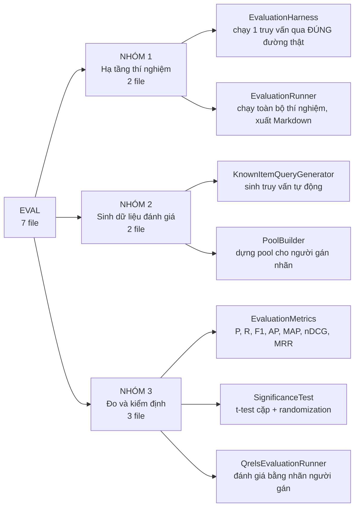
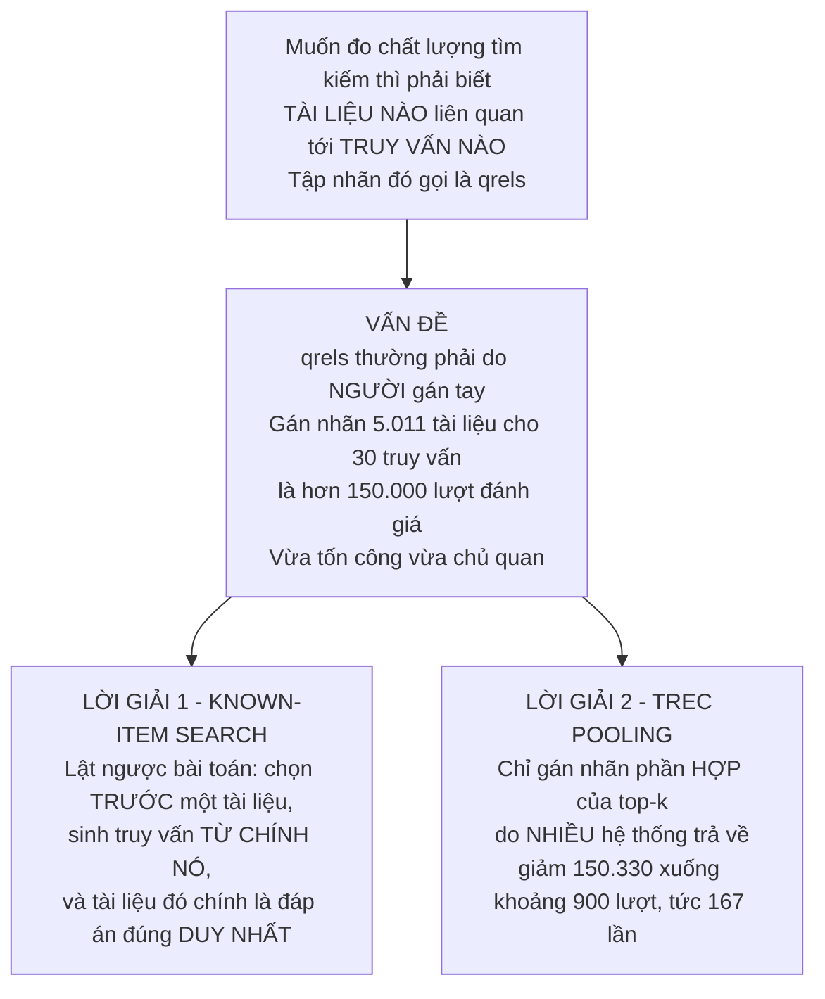
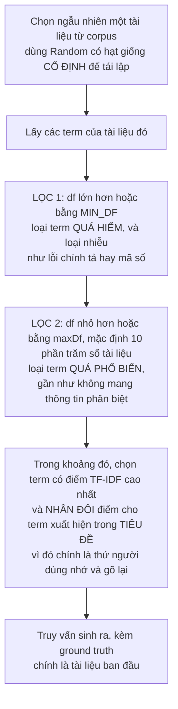
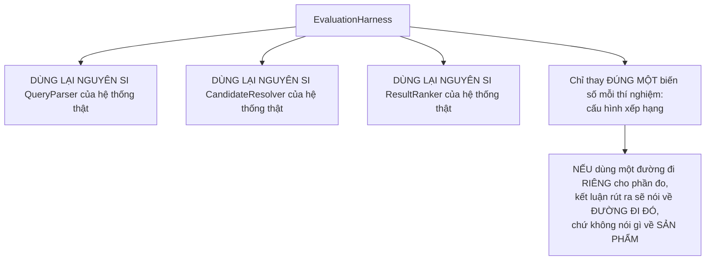
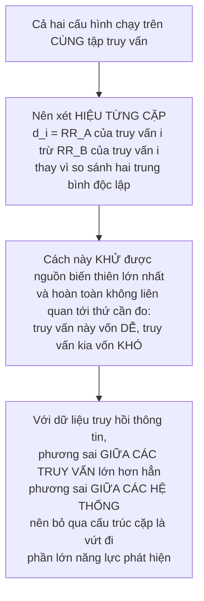
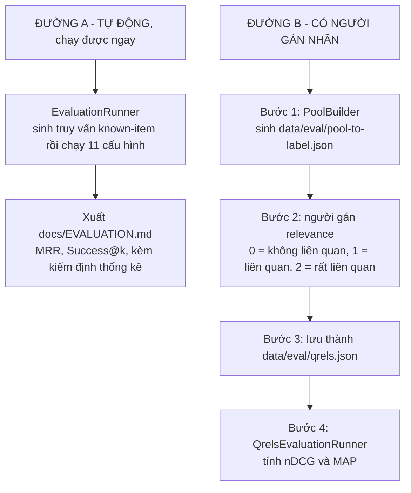

# Sơ đồ tư duy — Toàn bộ tầng Đánh giá chất lượng

**Phạm vi:** 7 file trong `com.vnsearch.eval`.

**Trang này trả lời:** làm sao đo được chất lượng tìm kiếm **khi không có ai gán nhãn**, hai phương pháp đánh giá bù khuyết điểm cho nhau ra sao, và **vì sao một bảng số liệu chưa đủ để nói "A tốt hơn B"**.

> ### Cách đọc
> - Sơ đồ vẽ bằng **Mermaid**; không hiện hình thì bấm khối *"Xem bản chữ (ASCII)"* ngay dưới.
> - Nếu chỉ đọc được một mục, đọc **§6** — kiểm định ý nghĩa thống kê là thứ phân biệt một báo cáo khoa học với một bảng số.
>
> 📖 **Trang đi sâu:** [EvaluationMetrics](EvaluationMetrics.md) · [KnownItemQueryGenerator](KnownItemQueryGenerator.md) · [PoolBuilder](PoolBuilder.md)
> 📊 **Kết quả sinh ra:** [`docs/EVALUATION.md`](../../EVALUATION.md) *(sinh tự động, đừng sửa tay)*

---

## 1. Bản đồ toàn cảnh — 7 file chia 3 nhóm



<details>
<summary><b>Xem bản chữ (ASCII)</b></summary>
```
                            EVAL — 7 file
                                  │
        ┌─────────────────────────┼─────────────────────────┐
     NHÓM 1                    NHÓM 2                    NHÓM 3
  Hạ tầng thí nghiệm       Sinh dữ liệu đánh giá      Đo và kiểm định
     (2 file)                  (2 file)                  (3 file)
        │                         │                         │
EvaluationHarness       KnownItemQueryGenerator      EvaluationMetrics
EvaluationRunner        PoolBuilder                  SignificanceTest
                                                     QrelsEvaluationRunner
```

</details>

### Bảng tra nhanh

| # | File | Dòng | Nó làm gì |
|---|---|---|---|
| 1 | `EvaluationHarness` | 111 | Chạy **một** truy vấn qua **đúng đường đi thật**, chỉ đổi **một** biến số |
| 2 | `EvaluationRunner` | 675 | Chạy toàn bộ thí nghiệm 11 cấu hình, xuất báo cáo Markdown |
| 3 | `KnownItemQueryGenerator` | 166 | Sinh truy vấn **known-item** — ground truth tự động |
| 4 | `PoolBuilder` | 174 | Dựng **pool** tài liệu cần gán nhãn, theo phương pháp TREC |
| 5 | `EvaluationMetrics` | 225 | P / R / F1 / AP / MAP / nDCG / MRR |
| 6 | `SignificanceTest` | 367 | Paired t-test **+** randomization test |
| 7 | `QrelsEvaluationRunner` | 170 | Đánh giá bằng **nhãn người gán** thay vì tự sinh |

---

## 2. Bài toán gốc: lấy đâu ra "đáp án đúng"?



<details>
<summary><b>Xem bản chữ (ASCII)</b></summary>
```
Muốn đo chất lượng → cần qrels (nhãn: tài liệu nào liên quan truy vấn nào)
                              ↓
VẤN ĐỀ: qrels phải do NGƯỜI gán — 5.011 tài liệu × 30 truy vấn
        = hơn 150.000 lượt đánh giá. Tốn công và chủ quan.
                              ↓
        ┌─────────────────────┴─────────────────────┐
LỜI GIẢI 1                                    LỜI GIẢI 2
KNOWN-ITEM SEARCH                             TREC POOLING
lật ngược bài toán:                           chỉ gán nhãn phần HỢP
chọn trước 1 tài liệu →                       của top-k do NHIỀU hệ thống
sinh truy vấn từ nó →                         trả về
tài liệu đó = đáp án đúng duy nhất            150.330 → ~900 (167 lần)
```

</details>

### Hai phương pháp bù khuyết điểm cho nhau

| | Known-item search | Nhãn người gán (qrels) |
|---|---|---|
| Ground truth | **tự sinh** | **người gán tay** |
| Khách quan & tái lập | ✅ chạy lại luôn ra đúng số cũ | ❌ mang tính chủ quan |
| Công sức | ✅ gần như bằng 0 | ❌ tốn nhiều |
| Số tài liệu đúng mỗi truy vấn | **đúng 1** | **nhiều**, có mức độ |
| Độ đo dùng được | **MRR**, Success@k | **nDCG**, MAP |
| Đo được truy vấn khám phá | ❌ không | ✅ có |
| Thiên vị | **chống lại PageRank** *(chỉ 1 đáp án đúng)* | trung lập hơn |

> Vì mỗi truy vấn known-item có **đúng một** đáp án, độ đo phù hợp là **MRR** và **Success@k** — **không phải** MAP hay nDCG, vốn cần nhiều tài liệu liên quan ở nhiều mức độ.

---

## 3. `KnownItemQueryGenerator` — chỗ dễ làm sai nhất



<details>
<summary><b>Xem bản chữ (ASCII)</b></summary>
```
chọn ngẫu nhiên 1 tài liệu (Random hạt giống CỐ ĐỊNH → tái lập được)
        ↓
lấy các term của nó
        ↓
LỌC 1:  df ≥ MIN_DF     → loại term quá HIẾM (và loại lỗi chính tả, mã số)
LỌC 2:  df ≤ maxDf      → loại term quá PHỔ BIẾN (không phân biệt được gì)
        ↓
chọn term có TF-IDF cao nhất, NHÂN ĐÔI điểm nếu term nằm trong TIÊU ĐỀ
        ↓
truy vấn + ground truth (chính là tài liệu ban đầu)
```

</details>

### Cái bẫy `df = 1`
```
   Nếu chọn các term HIẾM NHẤT (df = 1):
        → phép giao posting list chỉ còn ĐÚNG MỘT tài liệu
        → hệ thống nào cũng đạt MRR = 1,0
        → bài đánh giá trở nên VÔ NGHĨA
```

Đó là lý do phải lọc theo **khoảng** `df`, không phải chọn cực trị. Đây là chi tiết mà nhiều đồ án bỏ qua và khiến toàn bộ phần đánh giá mất giá trị.

---

## 4. `EvaluationHarness` — điểm mấu chốt về tính hợp lệ khoa học



<details>
<summary><b>Xem bản chữ (ASCII)</b></summary>
```
EvaluationHarness
   ├── dùng lại NGUYÊN SI  QueryParser
   ├── dùng lại NGUYÊN SI  CandidateResolver
   ├── dùng lại NGUYÊN SI  ResultRanker
   └── chỉ thay ĐÚNG MỘT biến số mỗi thí nghiệm (cấu hình xếp hạng)

CẢNH BÁO: nếu dùng một đường đi RIÊNG cho phần đo, kết luận rút ra
          sẽ nói về ĐƯỜNG ĐI ĐÓ, không nói gì về SẢN PHẨM.
```

</details>

> Đây chính là lý do `CandidateResolver` phải được **tách thành lớp riêng** thay vì để private trong `SearchEngineFacade` — xem [sơ đồ tư duy tầng truy vấn §9](../04-query/00-SO-DO-TU-DUY.md).

**Lợi ích phụ sau khi chuyển sang Decorator:** một "cấu hình xếp hạng" giờ chỉ là **một chuỗi scorer đã lắp ghép sẵn**, không còn ba trọng số rời rạc. Nhờ vậy `RelevanceScorer.name()` tự ghép thành nhãn mô tả đầy đủ cho bảng kết quả:
```
   BM25(k1=1.2,b=0.75) + PR x0.30 + title x0.10
```

---

## 5. `EvaluationMetrics` — bảy độ đo

### Quy ước quan trọng

| Quy ước | Vì sao |
|---|---|
| Định danh tài liệu là **URL**, không phải `docId` | `docId` được **gán lại mỗi lần crawl** — nhãn gán tay sẽ hỏng hết sau lần crawl kế tiếp, còn URL thì ổn định |
| URL không có trong qrels được coi là **mức 0** | Giả định *"chưa gán nhãn tức là không liên quan"* — đúng chuẩn TREC khi dùng pooling |
| Độ đo nhị phân (P, R, MAP) coi mức ≥ 1 là liên quan | Chỉ **nDCG** mới dùng đến mức độ chi tiết (0 / 1 / 2) |

### Chọn độ đo nào cho tình huống nào
```
   Mỗi truy vấn có ĐÚNG MỘT đáp án đúng   →  MRR, Success@k
   Nhiều đáp án đúng, KHÔNG phân mức      →  Precision@k, Recall@k, MAP
   Nhiều đáp án đúng, CÓ phân mức 0/1/2   →  nDCG
```

Dùng sai độ đo là lỗi thường gặp: tính MAP trên known-item search (chỉ 1 đáp án) thì MAP thoái hoá thành MRR mà không ai nhận ra.

---

## 6. `SignificanceTest` — thứ phân biệt báo cáo khoa học với bảng số

### 6.1 Vấn đề nó giải
```
   Bảng ablation nói: cấu hình nào có MRR CAO HƠN.

   Nó KHÔNG trả lời được câu hỏi quan trọng hơn:

       "Nếu hai cấu hình thực sự NGANG NHAU, xác suất quan sát được
        chênh lệch lớn bằng hoặc hơn thế này — chỉ do NGẪU NHIÊN của
        việc chọn đúng 200 truy vấn đó — là bao nhiêu?"

   Không có con số đó, mọi câu "A tốt hơn B" đều là
   KHẲNG ĐỊNH CHƯA ĐƯỢC CHỨNG MINH.
```

### 6.2 Vì sao kiểm định **theo cặp**



<details>
<summary><b>Xem bản chữ (ASCII)</b></summary>
```
Cả hai cấu hình chạy trên CÙNG tập truy vấn
        ↓
xét HIỆU TỪNG CẶP  dᵢ = RR_A(qᵢ) − RR_B(qᵢ)
        ↓
khử được nguồn biến thiên lớn nhất và KHÔNG liên quan tới thứ cần đo:
    "truy vấn này vốn DỄ, truy vấn kia vốn KHÓ"
        ↓
với dữ liệu IR, phương sai GIỮA CÁC TRUY VẤN >> phương sai GIỮA CÁC HỆ THỐNG
→ bỏ qua cấu trúc cặp = vứt đi phần lớn năng lực phát hiện
```

</details>

### 6.3 Hai kiểm định, hai giả định khác nhau

| | Paired t-test | Randomization test (hoán vị dấu) |
|---|---|---|
| Giả định | hiệu phân phối **xấp xỉ chuẩn** | **không giả định gì** về phân phối |
| Vấn đề với dữ liệu IR | reciprocal rank **rất lệch** — dồn ở 1,0 và ở 0 → giả định **đáng hoài nghi** | phù hợp |
| Được ngành khuyến dùng | — | ✅ Smucker, Allan & Carterette (CIKM 2007) |

> **Báo cáo cả hai:** khi chúng **đồng ý**, kết luận vững; khi **khác nhau**, đó tự nó là một phát hiện đáng ghi.

---

## 7. Quy trình chạy đánh giá



<details>
<summary><b>Xem bản chữ (ASCII)</b></summary>
```
ĐƯỜNG A — TỰ ĐỘNG (chạy được ngay)
   EvaluationRunner  →  sinh truy vấn known-item  →  chạy 11 cấu hình
                     →  xuất docs/EVALUATION.md (MRR, Success@k, kiểm định)

ĐƯỜNG B — CÓ NGƯỜI GÁN NHÃN
   1. PoolBuilder             →  data/eval/pool-to-label.json
   2. người gán relevance     →  0 = không liên quan · 1 = liên quan · 2 = rất liên quan
   3. lưu thành                  data/eval/qrels.json
   4. QrelsEvaluationRunner   →  nDCG, MAP
```

</details>

### Lệnh chạy

```bash
cd search-engine

# Đường A — đánh giá tự động, 200 truy vấn known-item
./mvnw exec:java -Dexec.mainClass=com.vnsearch.eval.EvaluationRunner \
     -Dexec.args="data/crawled-documents.json 200"

# Đường B bước 1 — sinh pool cần gán nhãn
./mvnw compile exec:java -Dexec.mainClass=com.vnsearch.eval.QrelsEvaluationRunner \
     -Dexec.args="pool data/crawled-documents.json"

# Đường B bước 4 — sau khi đã điền nhãn vào data/eval/qrels.json
./mvnw compile exec:java -Dexec.mainClass=com.vnsearch.eval.QrelsEvaluationRunner \
     -Dexec.args="eval data/crawled-documents.json"
```

> `docs/EVALUATION.md` được **sinh tự động** — đừng sửa tay. Muốn đổi nội dung thì sửa phần sinh báo cáo trong `EvaluationRunner.java` rồi chạy lại.

---

## 8. Ba câu hỏi mà báo cáo đánh giá trả lời

`EvaluationRunner` được viết để trả lời đúng ba câu:

1. **BM25 có thật sự tốt hơn TF-IDF cosine** trên corpus tiếng Việt này không?
2. **PageRank có cải thiện chất lượng xếp hạng không**, hay chỉ làm nhiễu?
3. Bộ trọng số `α/β/γ = 0,6/0,3/0,1` đang dùng **có phải lựa chọn tốt không** — hay chỉ là con số chọn bừa?

Câu 2 và 3 dẫn thẳng tới phát hiện lỗi thang đo 1000× — xem [sơ đồ tư duy tầng xếp hạng §5](../05-ranking/00-SO-DO-TU-DUY.md).

---

## 9. Xoá một file thì hỏng cái gì?

| File | Nếu không có | Hậu quả |
|---|---|---|
| `EvaluationHarness` | tự viết đường đi riêng cho phần đo | **Mọi con số trong báo cáo mất giá trị** — chúng đo một đường đi khác với đường phục vụ người dùng |
| `KnownItemQueryGenerator` | gán nhãn tay | Hơn 150.000 lượt đánh giá cho 30 truy vấn |
| Lọc khoảng `df` trong generator | chọn term hiếm nhất | Hệ thống nào cũng đạt **MRR = 1,0** → bài đánh giá vô nghĩa |
| `PoolBuilder` | gán nhãn toàn corpus | 150.330 lượt thay vì ~900 (**167 lần**) |
| `SignificanceTest` | chỉ có bảng số | Mọi câu *"A tốt hơn B"* là **khẳng định chưa chứng minh** |
| `QrelsEvaluationRunner` | chỉ có known-item | Không dùng được nDCG/MAP, và **thiên vị chống lại PageRank** không được bù |

---

## 10. Đọc tiếp

| Muốn hiểu | Đọc |
|---|---|
| Công thức P/R/F1/AP/MAP/nDCG/MRR, ví dụ tính tay, vì sao trung bình điều hoà | [EvaluationMetrics.md](EvaluationMetrics.md) |
| Lật ngược bài toán, bẫy `df = 1`, cửa sổ df, tính tái lập | [KnownItemQueryGenerator.md](KnownItemQueryGenerator.md) |
| TREC pooling, giảm 167 lần khối lượng gán nhãn | [PoolBuilder.md](PoolBuilder.md) |
| **Kết quả thí nghiệm thật** | [`docs/EVALUATION.md`](../../EVALUATION.md) |
| **Thứ đang được đo** — các cấu hình xếp hạng | [Sơ đồ tư duy tầng xếp hạng](../05-ranking/00-SO-DO-TU-DUY.md) |
| **Đường đi được dùng lại nguyên si** | [Sơ đồ tư duy tầng truy vấn](../04-query/00-SO-DO-TU-DUY.md) |
| So sánh với baseline Postgres GIN | [`docs/GIN-BASELINE.md`](../../GIN-BASELINE.md) |
