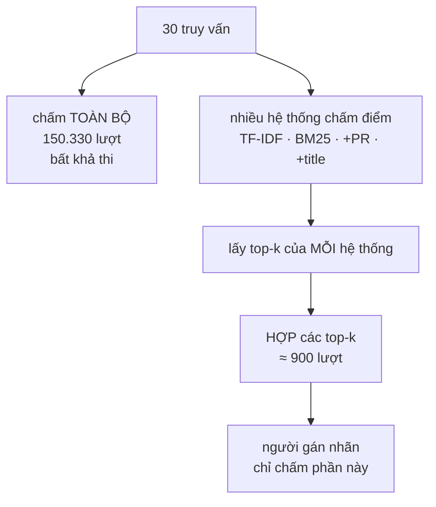

# PoolBuilder — phương pháp pooling của TREC, giảm 150.000 phán xét xuống vài trăm

**File nguồn:** `search-engine/src/main/java/com/vnsearch/eval/PoolBuilder.java`
**Việc nó làm:** Chọn ra **tập nhỏ nhất** tài liệu cần gán nhãn tay để tính được nDCG và MAP.

> 📖 Chưa quen ký hiệu toán? Đọc [00 — Từ điển ký hiệu toán](../00-KY-HIEU-TOAN.md) trước.

---

## 📌 Hiểu trong 30 giây

[Known-item search](KnownItemQueryGenerator.md) cho ground truth miễn phí, nhưng chỉ đo được **một** loại nhu cầu và chỉ dùng nhãn **nhị phân**.

Muốn tính **nDCG** (phân biệt "liên quan" với "rất liên quan") và **MAP** (nhiều tài liệu đúng cho một truy vấn), phải có nhãn nhiều bậc do người gán.

**Bài toán về khối lượng:**

$$5\,011 \text{ tài liệu} \times 30 \text{ truy vấn} = \mathbf{150\,330} \text{ lượt đánh giá}$$



```
   Ý tưởng TREC pooling: tài liệu mà KHÔNG hệ thống nào
   xếp vào top-k thì gần như chắc chắn không liên quan.

   hệ thống A top-10 :  ▪▪▪▪▪▪▪▪▪▪
   hệ thống B top-10 :    ▪▪▪▪▪▪▪▪▪▪
   hệ thống C top-10 :  ▪▪▪  ▪▪▪▪▪▪▪
                        └────┬─────┘
                          HỢP LẠI  ≈ 30 tài liệu / truy vấn
                             │
   150.330 lượt  ──────────▶ ≈ 900 lượt        giảm 167 lần
```

**Cái giá phải trả, nói thẳng:** một tài liệu liên quan mà **mọi** hệ thống
đều bỏ sót sẽ không bao giờ được gán nhãn, nên nó bị tính là "không liên
quan". Điều này làm recall tuyệt đối **không đo được** — pooling chỉ cho phép
**so sánh** các hệ thống với nhau, không cho phép nói "hệ thống này bắt được
80% tài liệu đúng trong corpus".

Với 10 giây mỗi lượt, đó là **417 giờ** — hơn 10 tuần làm việc toàn thời gian. Không ai làm nổi.

**Cách TREC giải quyết:** chỉ gán nhãn **phần hợp của top-$k$ kết quả** do **nhiều hệ thống khác nhau** trả về.

$$\text{pool}(q) = \bigcup_{s \in S} \text{top-}k\bigl(s, q\bigr)$$

Khối lượng giảm từ hàng trăm nghìn xuống **vài trăm**.

---

## 1. Giả định nền tảng — và nó có đúng không

> **Giả định pooling:** *Những tài liệu thực sự liên quan gần như chắc chắn sẽ được ít nhất một trong các hệ thống đưa lên top-$k$. Tài liệu không hệ thống nào đưa lên top thì coi như không liên quan.*

**Vì sao giả định này chấp nhận được.** Nếu $\lvert S\rvert$ hệ thống **đủ đa dạng** cùng bỏ sót một tài liệu ra khỏi top-$k$, thì tài liệu đó hoặc thực sự không liên quan, hoặc liên quan theo một cách mà **không mô hình nào hiện có** nhận ra — trường hợp thứ hai hiếm.

**Hệ quả đo lường được — và phải nói rõ trong báo cáo:**

| Độ đo | Ảnh hưởng |
|---|---|
| **Precision@k** | **Không bị ảnh hưởng** — mọi tài liệu trong top-$k$ đều đã có trong pool |
| **Recall** | **Bị ước lượng CAO hơn thực tế** — mẫu số (tổng tài liệu liên quan) nhỏ hơn thật |
| **MAP** | Bị ảnh hưởng qua Recall |
| **nDCG** | Ảnh hưởng nhẹ qua IDCG |

Đây là hạn chế **cố hữu** của pooling, không phải lỗi cài đặt. Zobel (1998) đã đo và kết luận: **thứ tự xếp hạng giữa các hệ thống hầu như không đổi** dù giá trị tuyệt đối của recall bị lệch — mà so sánh giữa các hệ thống mới là mục đích chính.

---

## 2. "Nhiều hệ thống" ở đây là gì

```java
public List<QueryPool> buildPools(List<String> queries,
                                   List<EvaluationHarness.RankingConfig> configs) {
```

Trong TREC gốc, $S$ là các hệ thống của **các nhóm nghiên cứu khác nhau** trên thế giới.

Ở đây, $S$ là các **cấu hình xếp hạng khác nhau** của cùng một hệ thống:

```java
public record RankingConfig(String label, RelevanceScorer scorer,
                             double alpha, double beta, double gamma) {
}
```

| Cấu hình | Khác biệt |
|---|---|
| TF-IDF thuần | $\alpha=1, \beta=\gamma=0$ |
| BM25 thuần | scorer khác |
| TF-IDF + PageRank | $\beta > 0$ |
| TF-IDF + title | $\gamma > 0$ |
| … | 11 cấu hình tổng cộng |

Javadoc giải thích lựa chọn này:

> *"pool phản ánh được sự khác biệt giữa đúng những phương án ta muốn so sánh."*

**Đánh giá thẳng thắn về mức đa dạng.** Đây **yếu hơn** TREC gốc rõ rệt: 11 cấu hình đều dùng **cùng một** tokenizer, **cùng một** chỉ mục, **cùng một** phép giao posting list. Chúng chỉ khác ở khâu **chấm điểm cuối cùng**.

Hệ quả: một tài liệu bị `CandidateResolver` loại (vì thiếu một term bắt buộc) sẽ **không hệ thống nào** đưa vào pool, dù nó có thể liên quan. Giả định §1 yếu đi đáng kể ở chiều này.

**Cách khắc phục thực tế:** thêm PostgreSQL GIN làm một "hệ thống" trong pool. Dự án đã có `DocumentRepository.searchWithGin` (dùng trong `GIN-BASELINE.md`) — nó dùng tokenizer **hoàn toàn khác** (`to_tsvector('simple', …)`, cắt theo khoảng trắng), nên sẽ đưa vào pool những tài liệu mà chỉ mục tự cài bỏ sót. Đây là một cải tiến rẻ và có giá trị phương pháp luận cao.

---

## 3. Dựng pool — `LinkedHashMap` và lý do

```java
public static final int POOL_DEPTH = 10;
...
// LinkedHashSet giữ thứ tự xuất hiện, nên tài liệu được cấu hình
// đầu tiên xếp cao sẽ nằm đầu danh sách cần gán nhãn — người gán
// gặp các ứng viên khả năng liên quan cao nhất trước.
Map<String, PoolEntry> entries = new LinkedHashMap<>();
for (EvaluationHarness.RankingConfig config : configs) {
    for (String url : harness.search(query, config, POOL_DEPTH)) {
        PoolEntry entry = entries.computeIfAbsent(url, u -> {
            PoolEntry e = new PoolEntry();
            e.url = u;
            WebDocument doc = byUrl.get(u);
            e.title = doc != null ? doc.getTitle() : "";
            e.snippet = doc != null ? shorten(doc.getBodyText()) : "";
            e.relevance = null;              // để trống cho người gán
            return e;
        });
        entry.foundBy.add(config.label());
    }
}
```

**Ba quyết định thiết kế, đều hướng tới người gán nhãn:**

### 3.1 `LinkedHashMap` giữ thứ tự

Không phải để tái lập, mà vì **trải nghiệm của người gán nhãn**. Tài liệu được cấu hình đầu tiên xếp cao nằm đầu danh sách, nên người gán gặp các ứng viên **khả năng liên quan cao nhất trước**.

Điều này quan trọng hơn vẻ ngoài: gán nhãn là công việc mệt mỏi và chất lượng giảm dần theo thời gian. Đặt các trường hợp quan trọng nhất lên đầu nghĩa là chúng được đánh giá khi người gán còn tỉnh táo nhất.

### 3.2 `foundBy` — dấu vết chẩn đoán

```java
/** Các cấu hình đã đưa tài liệu này vào top — chỉ để tham khảo. */
public List<String> foundBy = new ArrayList<>();
```

Không dùng cho tính toán, chỉ để **con người đọc**. Nhưng nó rất hữu ích khi phân tích:

- Tài liệu chỉ **một** cấu hình tìm ra và người gán chấm mức 2 → cấu hình đó có ưu thế thật.
- Tài liệu **mọi** cấu hình tìm ra nhưng người gán chấm 0 → có một lỗi hệ thống chung (ví dụ tokenizer ghép sai).

Nó biến một file nhãn thành một công cụ chẩn đoán.

### 3.3 `snippet` cắt 200 ký tự

```java
private static String shorten(String text) {
    if (text == null || text.isBlank()) return "";
    String trimmed = text.trim().replaceAll("\\s+", " ");
    return trimmed.length() <= 200 ? trimmed : trimmed.substring(0, 200) + "...";
}
```

Người gán cần **đủ ngữ cảnh** để phán xét, nhưng không cần đọc cả 6 KB thân bài. 200 ký tự là điểm cân bằng: đủ để hiểu bài nói về gì, đủ ngắn để đọc trong vài giây.

`replaceAll("\\s+", " ")` gộp xuống dòng và tab thành khoảng trắng đơn — làm JSON dễ đọc hơn nhiều.

---

## 4. Ước lượng kích thước pool

Với $\lvert S\rvert$ cấu hình và độ sâu $k$:

$$k \;\le\; \lvert\text{pool}(q)\rvert \;\le\; \lvert S\rvert \times k$$

Cận dưới khi mọi cấu hình cho **cùng** top-$k$; cận trên khi hoàn toàn không trùng nhau.

**Với $\lvert S\rvert = 11$, $k = 10$:**

$$10 \;\le\; \lvert\text{pool}(q)\rvert \;\le\; 110$$

Thực tế nằm gần cận dưới hơn, vì các cấu hình chia sẻ nhiều thành phần (§2) nên top-10 của chúng chồng lấn nhiều. Ước lượng hợp lý: **20–40 tài liệu/truy vấn**.

**So sánh khối lượng lao động:**

| Cách | Số lượt phán xét (30 truy vấn) | Thời gian (10 s/lượt) |
|---|---|---|
| Gán nhãn toàn bộ | $30 \times 5011 = \mathbf{150\,330}$ | **417 giờ** |
| **Pooling** | $30 \times 30 \approx \mathbf{900}$ | **2,5 giờ** |
| Tỉ lệ giảm | **167×** | |

Từ 10 tuần xuống nửa buổi. Đây chính là lý do pooling ra đời và tại sao mọi hội nghị đánh giá IR đều dùng nó.

`summarise()` in ra con số thật:

```java
return String.format(
        "Pool: %d truy van, %d muc can gan nhan (trung binh %.1f/truy van, nhieu nhat %d), "
                + "%d URL phan biet.", ...);
```

Việc có hàm này cho thấy ý thức **đo trước khi làm** — người dùng biết trước mình sắp phải gán bao nhiêu nhãn.

---

## 5. Quy trình sử dụng — ba bước

```
① Chạy PoolBuilder          → data/eval/pool-to-label.json
② Người mở file, điền `relevance` cho từng mục (0/1/2)
③ Lưu thành qrels.json, chạy QrelsEvaluationRunner → nDCG, MAP
```

```java
public static Map<String, Map<String, Integer>> loadQrels(String path) throws IOException {
    ObjectMapper mapper = new ObjectMapper();
    QueryPool[] pools = mapper.readValue(new File(path), QueryPool[].class);
    Map<String, Map<String, Integer>> qrels = new LinkedHashMap<>();
    for (QueryPool pool : pools) {
        Map<String, Integer> judgments = new LinkedHashMap<>();
        for (PoolEntry entry : pool.documents) {
            judgments.put(entry.url, entry.relevance == null ? 0 : entry.relevance);
            //                       ^^^^^^^^^^^^^^^^^^^^^^^^^^^^^^^^^^^^^^^^
            //                       chưa gán = 0, đúng quy ước TREC
        }
        qrels.put(pool.query, judgments);
    }
    return qrels;
}
```

**Cấu trúc trả về là `Map<truy vấn, Map<URL, mức độ>>`** — khớp **chính xác** chữ ký mà [EvaluationMetrics](EvaluationMetrics.md) nhận:

```java
public static double ndcgAtK(List<String> ranked, Map<String, Integer> qrels, int k)
```

Không cần lớp chuyển đổi trung gian nào. Hai lớp được thiết kế để khớp nhau.

**`relevance == null ? 0`** xử lý mục người gán bỏ qua — đúng quy ước TREC "chưa gán nhãn tức là không liên quan", nhất quán với `EvaluationMetrics.gradeOf`.

---

## 6. Vì sao dùng `class` với trường `public` thay vì `record`

```java
public static class PoolEntry {
    public String url;
    public String title;
    public String snippet;
    public Integer relevance;
    public List<String> foundBy = new ArrayList<>();
}
```

Phần lớn dự án dùng `record` bất biến (`Posting`, `Token`, `Task`, `ParsedQuery`…). Ở đây thì không, và có lý do:

1. **File JSON phải được SỬA bằng tay.** Người gán mở file, điền `relevance`. Sau đó Jackson phải đọc lại — cần setter hoặc trường `public`.
2. **`relevance` là `Integer` chứ không phải `int`** — để phân biệt `null` (chưa gán) với `0` (đã gán, không liên quan). Đây là một khác biệt ngữ nghĩa thật, và kiểu nguyên thuỷ không biểu diễn được.

Đây là ví dụ tốt về việc **chọn kiểu theo bản chất dữ liệu**: `Posting` không bao giờ đổi nên là `record`; `PoolEntry` sinh ra để **được sửa** nên là class có trường thay đổi được.

> **Nhưng trường `public` là quá tay.** Jackson làm việc tốt với getter/setter, và trường `public` phá vỡ đóng gói không cần thiết. Đây là một điểm trừ nhỏ về đóng gói, được giữ lại có ý thức vì lớp này chỉ phục vụ công cụ dòng lệnh.

---

## 7. Độ phức tạp

| Bước | Thời gian |
|---|---|
| Dựng `byUrl` | $O(N)$ |
| Với mỗi truy vấn × mỗi cấu hình: chạy search | $O(\lvert S\rvert \cdot \lvert Q\rvert \cdot T_{\text{search}})$ |
| Gộp vào pool | $O(\lvert S\rvert \cdot \lvert Q\rvert \cdot k)$ |
| **Tổng** | chi phối bởi chạy search |

Với $\lvert S\rvert = 11$, $\lvert Q\rvert = 30$, $T_{\text{search}} \approx 3{,}4$ ms:

$$11 \times 30 \times 3{,}4\text{ms} = \mathbf{1{,}12 \text{ giây}}$$

Chi phí máy tính hoàn toàn không đáng kể. **Nút thắt là con người** — 2,5 giờ gán nhãn.

Đây là một quan sát đáng nhớ về đánh giá IR: mọi tối ưu về tốc độ đo lường đều vô nghĩa; thứ duy nhất đáng tối ưu là **số lượt phán xét của con người**. Và đó chính xác là điều pooling làm.

---

## 8. Chủ đề DSA thể hiện

| Chủ đề | Ở đâu |
|---|---|
| **Pooling của TREC** | phương pháp giảm 167× khối lượng gán nhãn |
| **Phép hợp trên nhiều nguồn** | $\bigcup_s \text{top-}k(s,q)$ |
| **Bảng băm giữ thứ tự** | `LinkedHashMap` — thứ tự phục vụ người gán |
| **`computeIfAbsent`** | gộp "tạo nếu chưa có" thành một thao tác |
| **Lấy mẫu có định hướng** | chỉ lấy top-$k$, không lấy ngẫu nhiên |
| **Chọn kiểu theo bản chất dữ liệu** | class thay đổi được vs `record` bất biến |
| **`Integer` vs `int`** | phân biệt "chưa gán" với "gán 0" |
| **Khớp giao diện** | `loadQrels` trả đúng kiểu `EvaluationMetrics` cần |
| **Đo trước khi làm** | `summarise()` cho biết khối lượng sắp phải gánh |

---

## 9. Hạn chế đã biết

1. **Các "hệ thống" trong pool quá giống nhau** (§2) — chia sẻ tokenizer, chỉ mục, phép giao. Nên thêm GIN làm nguồn thứ hai độc lập.
2. **Không có nhiều người gán và không đo độ đồng thuận.** Chuẩn TREC dùng nhiều người gán độc lập rồi đo **Cohen's kappa** để biết nhãn có nhất quán không. Một người gán duy nhất không có cách nào phát hiện mình thiên vị.
3. **Không có hướng dẫn gán nhãn.** "Mức 1 vs mức 2" là gì? Không có định nghĩa viết ra thì cùng một người gán khác nhau ở đầu và cuối phiên.
4. **`POOL_DEPTH = 10` cố định.** TREC thường dùng độ sâu 100 cho pool đầy đủ hơn. Với 10, giả định §1 yếu hơn.
5. **Trường `public`** thay vì getter/setter (§6).
6. **Không có kiểm tra tính hợp lệ khi nạp qrels.** Nếu người gán gõ `relevance = 5` hoặc `-1`, không có gì báo lỗi; nDCG sẽ tính $2^5-1 = 31$ và làm hỏng toàn bộ thang đo.
7. **Không phát hiện được tài liệu trùng nội dung.** Hai URL khác nhau có cùng nội dung sẽ được gán nhãn hai lần và cả hai đều tính vào IDCG, làm nDCG bị hạ oan.

---

## 10. Liên kết

- Độ đo dùng nhãn này: [EvaluationMetrics §6](EvaluationMetrics.md) (nDCG) và §5 (MAP)
- Phương pháp đánh giá bổ sung, không cần người gán: [KnownItemQueryGenerator.md](KnownItemQueryGenerator.md)
- Đường chạy truy vấn: `eval/EvaluationHarness.java`
- Nguồn "hệ thống" độc lập tiềm năng: `docs/GIN-BASELINE.md`
- Ký hiệu chưa hiểu: [00 — Từ điển ký hiệu toán](../00-KY-HIEU-TOAN.md)
