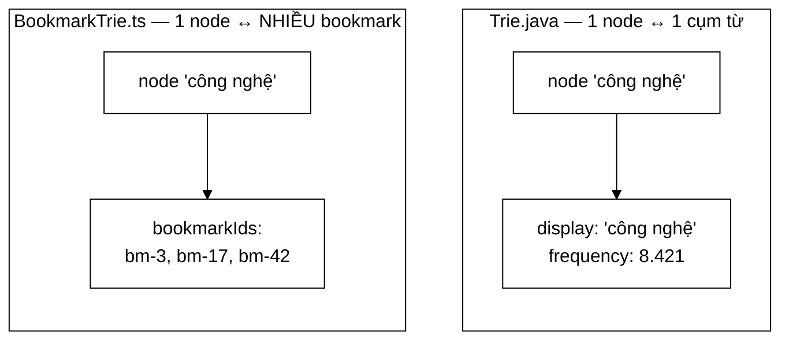

# BookmarkTrie — cùng một cấu trúc, hai ngôn ngữ, hai bài toán

**File nguồn:** `browser-app/src/renderer/src/lib/BookmarkTrie.ts`
**Việc nó làm:** Tìm bookmark theo tiền tố của **một từ bất kỳ** trong tiêu đề.

> 📖 Chưa quen ký hiệu toán? Đọc [00 — Từ điển ký hiệu toán](../00-KY-HIEU-TOAN.md) trước.

> 📊 **Số đo trong trang này thuộc mốc A** — corpus **5.011 trang**. Repo có
> **bốn mốc corpus** đo trên bốn phiên crawl khác nhau; trộn chúng vào một bảng
> là cách nhanh nhất để ra số vô nghĩa. Bảng quy chiếu đầy đủ ở đầu
> [`DSA-REPORT.md`](../../DSA-REPORT.md). Mốc hiện hành là **D — 31.030 trang**.

---

## 📌 Hiểu trong 30 giây

Đây là bản cài đặt Trie thứ hai của dự án — bằng **TypeScript** thay vì Java. Comment nói rõ mục đích:

> *"Cai dat SONG SONG voi `datastructure/Trie.java` o backend (cung y tuong: children la `Map<ky tu, node>`, `isEndOfWord` danh dau tu hoan chinh) — dung de so sanh 2 cach cai dat (Java vs TypeScript) trong bao cao."*

Nhưng nó **không** phải bản dịch máy móc. Bài toán khác nên cấu trúc node khác — và sự khác biệt đó chính là điều đáng học:

| | `Trie.java` (backend) | **`BookmarkTrie.ts`** (frontend) |
|---|---|---|
| Bài toán | Gợi ý **cụm từ** phổ biến | Tìm **bookmark** theo tiêu đề |
| Node kết thúc lưu | `frequency` + `display` | **`bookmarkIds: string[]`** |
| Quan hệ | 1 node ↔ 1 cụm từ | **1 node ↔ NHIỀU bookmark** |
| Xếp hạng | có (theo `frequency`) | không |



```
   CÙNG cấu trúc cây, KHÁC ở nút lá

   Trie.java                        BookmarkTrie.ts
   ─────────                        ───────────────
   c─ô─n─g─ ─n─g─h─ệ                c─ô─n─g─ ─n─g─h─ệ
                   │                                │
                   ▼                                ▼
        ┌──────────────────┐          ┌────────────────────────┐
        │ display  : chuỗi │          │ bookmarkIds : string[] │
        │ frequency: 8421  │          │  ["bm-3","bm-17",…]    │
        └──────────────────┘          └────────────────────────┘
          MỘT giá trị                    NHIỀU giá trị
          ⇒ cần xếp hạng                 ⇒ không cần xếp hạng,
            theo frequency                  trả hết là xong
```

**Vì sao khác biệt đó là tất yếu, không phải tuỳ hứng.** Hai cụm từ khác nhau
thì là hai nút khác nhau — nên một nút chỉ ứng với một cụm. Nhưng **hai
bookmark hoàn toàn có thể trùng tiêu đề** ("Trang chủ", "Tin mới"), mà chúng là
hai mục riêng biệt người dùng lưu. Ép về một giá trị là làm mất bookmark.

---

## 1. Vì sao node phải lưu MỘT DANH SÁCH id

```ts
class TrieNode {
  children: Map<string, TrieNode> = new Map()
  isEndOfWord = false
  bookmarkIds: string[] = []          // ← khác biệt then chốt
}
```

Comment giải thích:

> *"Khac voi `Trie.java` (chi luu 1 tu khoa duy nhat moi node), o day moi nut ket thuc tu luu THEM danh sach `bookmarkId`, vi nhieu bookmark khac nhau co the co cung 1 tu trong tieu de (`tin tuc cong nghe`, `tin tuc the thao` deu co tu `tin`)."*

**Phát biểu bằng toán học.** Ánh xạ từ **từ** sang **bookmark** là quan hệ **nhiều–nhiều**:

$$f: \text{Từ} \to \mathcal{P}(\text{Bookmark})$$

Một bookmark có nhiều từ trong tiêu đề; một từ xuất hiện trong nhiều bookmark.

Với `Trie.java`, ánh xạ là **một–một**: mỗi khoá tương ứng đúng một cụm từ gợi ý (kèm tần suất). Nên một số nguyên `frequency` là đủ.

Ở đây phải là một **danh sách**.

**Đây chính là cấu trúc của một chỉ mục đảo thu nhỏ:**

$$\text{từ} \to [\text{id}_1, \text{id}_2, \dots]$$

so với backend:

$$\text{term} \to [\text{Posting}_1, \text{Posting}_2, \dots]$$

Cùng một ý tưởng nền tảng ở hai quy mô hoàn toàn khác nhau — một bên 136.768 term và 5.011 tài liệu, một bên vài chục bookmark. Điều thú vị là **cùng một cấu trúc dữ liệu phù hợp cho cả hai**.

---

## 2. `insert` — chèn theo TỪ, không theo cả tiêu đề

```ts
insert(word: string, bookmarkId: string): void {
  const normalized = word.toLowerCase()
  if (!normalized) return
  let node = this.root
  for (const ch of normalized) {
    let next = node.children.get(ch)
    if (!next) {
      next = new TrieNode()
      node.children.set(ch, next)
    }
    node = next
  }
  node.isEndOfWord = true
  if (!node.bookmarkIds.includes(bookmarkId)) {
    node.bookmarkIds.push(bookmarkId)
  }
}
```

Chữ ký nhận **một từ**, không phải cả tiêu đề. Người gọi (`bookmarkStore`) tách tiêu đề rồi chèn từng từ:

```
Bookmark "b1" tiêu đề "tin tức công nghệ"
  → insert("tin", "b1")
  → insert("tức", "b1")
  → insert("công", "b1")
  → insert("nghệ", "b1")
```

**Vì sao chèn từng từ chứ không chèn cả tiêu đề.** Người dùng nhớ **một** từ trong tiêu đề, không nhất thiết là từ đầu tiên. Chèn cả tiêu đề `"tin tức công nghệ"` thì chỉ tìm được bằng tiền tố bắt đầu từ `t-i-n...`; gõ `công` sẽ không ra gì.

Chèn từng từ cho phép khớp **từ bất kỳ vị trí nào** trong tiêu đề. Đánh đổi: nhiều node hơn, nhưng với vài chục bookmark thì không đáng kể.

**Chú ý sự bất đối xứng với `Trie.java`:** ở backend, `SuggestionService.rebuild(index)` chèn **cụm từ** (từ ghép và cặp token liên tiếp), không chèn từng tiếng — vì tiếng lẻ tiếng Việt phần lớn **không phải từ** (`cong`, `the`, `kinh` vô nghĩa khi đứng một mình).

Ở đây thì chèn từng từ lại đúng, vì mục tiêu khác: không phải gợi ý cho người gõ, mà là **lọc một danh sách nhỏ** người dùng đã biết nội dung.

Cùng cấu trúc, hai bài toán, hai cách nạp dữ liệu ngược nhau — và cả hai đều đúng cho ngữ cảnh của mình.

### 2.1 `for (const ch of normalized)` — duyệt theo code point

TypeScript/JavaScript có hai cách duyệt chuỗi:

| Cách | Duyệt theo | Với emoji `👍` (surrogate pair) |
|---|---|---|
| `for (let i = 0; i < s.length; i++)` | **UTF-16 code unit** | tách thành **2 nửa hỏng** |
| **`for (const ch of s)`** | **code point** | giữ **nguyên vẹn** |

`for...of` dùng iterator của chuỗi, vốn tôn trọng ranh giới code point. Với tiêu đề bookmark có thể chứa emoji, đây là lựa chọn đúng.

> **Nhưng vẫn chưa đủ cho tiếng Việt.** Nó **không** chuẩn hoá Unicode NFC. Chữ `ế` gõ kiểu NFD sẽ tạo **ba** node (`e` + hai dấu tổ hợp) thay vì một. Đây là hạn chế thật so với bản Java — xem §6.

### 2.2 `includes` trước khi `push` — chống trùng

```ts
if (!node.bookmarkIds.includes(bookmarkId)) {
  node.bookmarkIds.push(bookmarkId)
}
```

Tiêu đề `"tin tức tin nóng"` có từ `tin` **hai lần**. Không kiểm tra thì `bookmarkIds` chứa cùng id hai lần, và kết quả tìm kiếm lặp.

`Array.includes` là $O(m)$ với $m$ = số bookmark chứa từ đó. Với vài chục bookmark thì không sao; với quy mô lớn nên dùng `Set<string>`.

---

## 3. `searchByPrefix` — hai giai đoạn

```ts
searchByPrefix(prefix: string): string[] {
  const normalized = prefix.toLowerCase()
  let node = this.root
  for (const ch of normalized) {                    // GIAI ĐOẠN 1: đi tới node
    const next = node.children.get(ch)
    if (!next) return []                            // không có gì khớp
    node = next
  }
  const result: string[] = []
  this.collect(node, result)                        // GIAI ĐOẠN 2: DFS thu thập
  return Array.from(new Set(result))                // khử trùng
}

private collect(node: TrieNode, out: string[]): void {
  if (node.isEndOfWord) {
    out.push(...node.bookmarkIds)
  }
  for (const child of node.children.values()) {
    this.collect(child, out)
  }
}
```

| Giai đoạn | Việc | Độ phức tạp |
|---|---|---|
| 1 | Đi theo tiền tố tới node | $O(L)$ |
| 2 | DFS thu thập mọi id trong cây con | $O(m)$ |
| 3 | Khử trùng bằng `Set` | $O(\lvert\text{out}\rvert)$ |

$$T = O(L + m)$$

**Thoát sớm** ở giai đoạn 1: `if (!next) return []` — không có nhánh nào bắt đầu bằng tiền tố thì trả về ngay, không tốn DFS.

### 3.1 Vì sao vẫn phải khử trùng sau DFS

```ts
return Array.from(new Set(result))
```

Cùng một bookmark có thể xuất hiện nhiều lần trong kết quả nếu **nhiều từ** của nó cùng bắt đầu bằng tiền tố:

```
Bookmark "b1" tiêu đề "tin tức tình hình"
  → node "tin"  chứa b1
  → node "tình" chứa b1

searchByPrefix("t") → DFS chạm cả hai node → [b1, b1]
```

`Set` khử trùng trong $O(n)$. `Array.from` chuyển ngược lại thành mảng vì API trả về `string[]`.

**Đây là cùng loại vấn đề với `Trie.java`** — ở đó, một cụm từ chèn hai lần (khoá có dấu và không dấu) làm DFS chạm cả hai node và gợi ý bị lặp; giải pháp là `merge(..., Math::max)`. Cùng triệu chứng, hai nguyên nhân khác nhau, hai cách khử trùng khác nhau.

### 3.2 `collect` — DFS không cần quay lui

So sánh với `Trie.java`:

```java
// Trie.java — CẦN quay lui vì phải dựng lại chuỗi từ đường đi
private void collectWords(TrieNode node, StringBuilder prefix, List<WordFrequency> out) {
    if (node.isEndOfWord) out.add(new WordFrequency(..., prefix.toString(), ...));
    for (Map.Entry<Character, TrieNode> entry : node.children.entrySet()) {
        prefix.append(entry.getKey());
        collectWords(entry.getValue(), prefix, out);
        prefix.deleteCharAt(prefix.length() - 1);      // ← QUAY LUI
    }
}
```

```ts
// BookmarkTrie.ts — KHÔNG cần quay lui
private collect(node: TrieNode, out: string[]): void {
  if (node.isEndOfWord) out.push(...node.bookmarkIds)
  for (const child of node.children.values()) {
    this.collect(child, out)                            // ← không có bước khôi phục
  }
}
```

**Vì sao khác.** `Trie.java` phải **dựng lại chuỗi** từ đường đi (khi `display == null`), nên cần mang theo `StringBuilder` và khôi phục nó sau mỗi nhánh.

`BookmarkTrie` chỉ cần **id đã lưu sẵn tại node** — không quan tâm đường đi tới đó. Không có trạng thái nào phải khôi phục, nên không cần quay lui.

**Bài học:** quay lui chỉ cần khi DFS **mang theo trạng thái tích luỹ dọc đường**. Nếu mọi thứ cần đều nằm ở node đích, DFS thuần là đủ.

`out.push(...node.bookmarkIds)` dùng spread để thêm nhiều phần tử một lúc — tương đương `out.push(...)` từng cái nhưng gọn hơn.

---

## 4. Sử dụng trong `bookmarkStore`

Trie được **dựng lại từ đầu** mỗi khi danh sách bookmark đổi, thay vì cập nhật tăng dần.

**Vì sao đó là lựa chọn đúng ở đây:**

| | Dựng lại toàn bộ | Cập nhật tăng dần |
|---|---|---|
| Độ phức tạp | $O(B \cdot W \cdot L)$ | $O(W\cdot L)$ mỗi bookmark |
| Code | ~5 dòng | cần cả `delete`, cắt tỉa nhánh |
| Rủi ro lệch trạng thái | **không** | có |

Với $B \approx 50$ bookmark, $W \approx 5$ từ, $L \approx 8$ ký tự: $50 \times 5 \times 8 = \mathbf{2\,000}$ thao tác — **dưới một mili giây**.

Cùng nguyên tắc với `SuggestionService.rebuild(index)` gọi `suggestTrie.clear()` trước khi nạp lại: **khi dựng lại đủ rẻ, hãy dựng lại thay vì cập nhật tăng dần** — code đơn giản hơn và không có nguy cơ lệch trạng thái.

Đây là một đánh đổi có ý thức, và nó **chỉ đúng khi $B$ nhỏ**. Với backend ($N = 5011$ tài liệu), việc dựng lại Trie gợi ý sau mỗi lần crawl tốn vài giây — vẫn chấp nhận được vì crawl là thao tác hiếm.

---

## 5. So sánh hai bản cài đặt — bảng tổng hợp

| Khía cạnh | `Trie.java` | `BookmarkTrie.ts` |
|---|---|---|
| Bảng con | `HashMap<Character, TrieNode>` | `Map<string, TrieNode>` |
| Đơn vị chèn | **cụm từ** (từ ghép, cặp token) | **từng từ** của tiêu đề |
| Node kết thúc lưu | `frequency: int`, `display: String` | `bookmarkIds: string[]` |
| Quan hệ khoá ↔ giá trị | một–một | **một–nhiều** |
| Chuẩn hoá | **NFC** + (lowercase ở người gọi) | chỉ `toLowerCase()` |
| Xếp hạng kết quả | có — `MinHeap.topK` theo `frequency` | không |
| Khử trùng | `merge(..., Math::max)` | `new Set(result)` |
| DFS | **có quay lui** (dựng lại chuỗi) | không quay lui |
| `clear()` | có, $O(1)$ | không có (dựng lại object mới) |
| Quy mô | ~10.000 cụm | ~50 bookmark |

**Điểm rút ra quan trọng nhất:** hai bản có **cùng khung xương** (cây, cạnh mang ký tự, cờ kết thúc từ) nhưng **khác ở phần tải dữ liệu** — vì bài toán khác. Đó chính là dấu hiệu của một cấu trúc dữ liệu tốt: khung xương ổn định, phần chuyên biệt hoá thay đổi theo nhu cầu.

---

## 6. Độ phức tạp

| Thao tác | Thời gian |
|---|---|
| `insert` | $O(L + m)$ — $L$ đi cây, $m$ cho `includes` |
| `searchByPrefix` | **$O(L + m)$** |
| `collect` | $O(m)$ |
| Bộ nhớ | $O(\text{tổng ký tự các từ})$ |

Với quy mô bookmark thật (~50 mục), mọi thao tác **dưới một mili giây**.

---

## 7. Chủ đề DSA thể hiện

| Chủ đề | Ở đâu |
|---|---|
| **Trie (cây tiền tố)** | toàn bộ lớp |
| **Chỉ mục đảo thu nhỏ** | `từ → danh sách id` |
| **Quan hệ nhiều–nhiều** | một từ ↔ nhiều bookmark |
| **DFS không quay lui** | `collect` — không mang trạng thái dọc đường |
| **Khử trùng bằng `Set`** | `Array.from(new Set(...))` |
| **Thoát sớm** | `if (!next) return []` |
| **Duyệt chuỗi theo code point** | `for...of` |
| **Dựng lại thay vì cập nhật tăng dần** | đánh đổi đúng khi $B$ nhỏ |
| **Cùng cấu trúc, hai chuyên biệt hoá** | so sánh với bản Java |

---

## 8. Hạn chế đã biết

1. **Không chuẩn hoá Unicode NFC** (§2.1) — hạn chế nghiêm trọng nhất với tiếng Việt. Chữ gõ kiểu NFD tạo đường đi khác hoàn toàn. Bản Java làm đúng; bản TS thì không. Sửa bằng một dòng: `word.normalize('NFC').toLowerCase()`.
2. **Không hỗ trợ tìm không dấu.** Gõ `cong` không ra bookmark `công nghệ`. Bản Java giải bằng mẹo chèn hai khoá + trường `display` — có thể áp dụng y hệt ở đây.
3. **`bookmarkIds` là mảng, `includes` là $O(m)$.** Nên là `Set<string>`.
4. **Không có xếp hạng.** Kết quả trả về theo thứ tự DFS (tức thứ tự chữ cái của nhánh), không theo mức liên quan hay tần suất truy cập.
5. **Không có xoá.** Bookmark bị xoá thì phải dựng lại cả Trie. Chấp nhận được ở quy mô này (§4) nhưng là một thiếu sót của cấu trúc.
6. **`collect` là đệ quy.** Với cây rất sâu (URL dài làm khoá) có thể tràn ngăn xếp. Với từ tiếng Việt (dưới 20 ký tự) thì không bao giờ xảy ra.

---

## 9. Liên kết

- Bản cài đặt Java: [Trie.md](../05-datastructures/Trie.md)
- Cấu trúc frontend còn lại: [Stack.md](Stack.md)
- Ý tưởng chỉ mục đảo ở quy mô lớn: [InvertedIndex.md](../02-index/InvertedIndex.md)
- Ký hiệu chưa hiểu: [00 — Từ điển ký hiệu toán](../00-KY-HIEU-TOAN.md)
