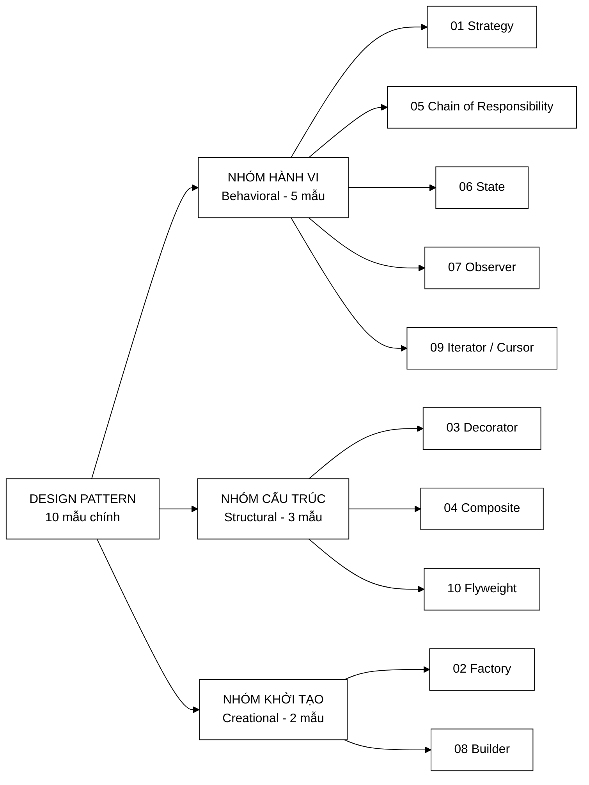
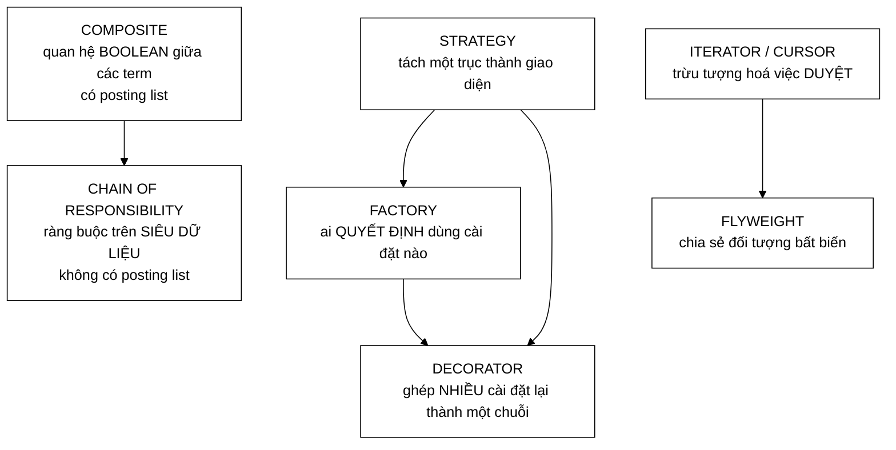
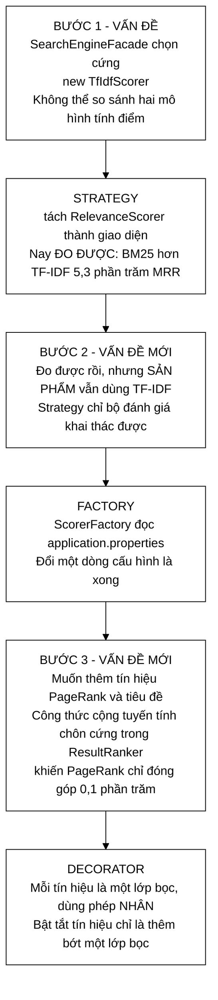
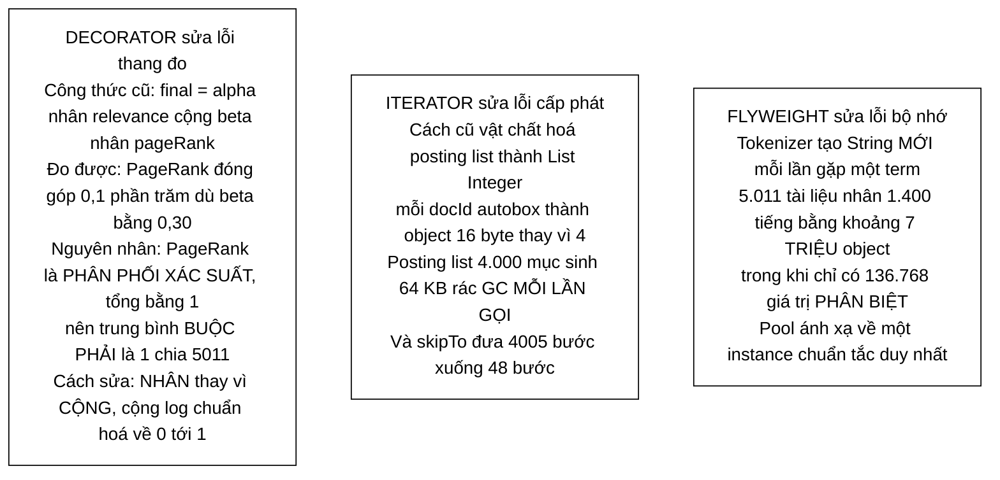
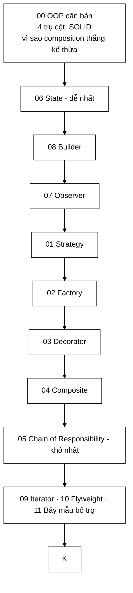

# Sơ đồ tư duy — Toàn bộ Design Pattern trong VnSearch

**Phạm vi:** 10 mẫu chính + 7 mẫu bổ trợ, trải trên 76 lớp Java (10.485 dòng) và 8 module TypeScript.

**Trang này khác gì 14 trang còn lại trong thư mục?** Các trang kia dạy **từng mẫu một**. Trang này vẽ ra **bức tranh toàn cảnh**: mẫu nào nằm ở tầng nào, mẫu nào liên quan mẫu nào, và **mỗi mẫu sửa lỗi cụ thể gì**.

> ### Ba điều kiện mà cả 10 mẫu đều thoả
> 1. **Giải một vấn đề thật đã đo được** — không phải "dùng pattern cho có".
> 2. **Được dùng trong đường chạy chính** — không phải code chết.
> 3. **Động cơ được viết trong Javadoc**, chứ không chỉ trong tài liệu.
>
> 📖 **Mục lục & lộ trình đọc:** [README.md](README.md)

---

## 1. Bản đồ toàn cảnh — 10 mẫu chính, chia theo nhóm GoF



<details>
<summary><b>Xem bản chữ (ASCII)</b></summary>
```
                    DESIGN PATTERN — 10 mẫu chính
                                │
        ┌───────────────────────┼───────────────────────┐
   BEHAVIORAL              STRUCTURAL              CREATIONAL
   (5 mẫu)                 (3 mẫu)                 (2 mẫu)
        │                       │                       │
   01 Strategy             03 Decorator            02 Factory
   05 Chain of Resp.       04 Composite            08 Builder
   06 State                10 Flyweight
   07 Observer
   09 Iterator/Cursor
```

</details>

---

## 2. Bảng tổng hợp — mỗi mẫu sửa lỗi gì

| # | Mẫu | File chính | **Vấn đề đo được mà nó giải** |
|---|---|---|---|
| 1 | **Strategy** | `RelevanceScorer`, `Tokenizer`, `SearchIndex`, `DocumentStore` | Không làm được ablation khoa học. Sau khi có: đo được **BM25 hơn TF-IDF 5,3 % MRR** |
| 2 | **Factory** | `ScorerFactory` | BM25 tốt hơn nhưng **không ai dùng được** — Facade chọn cứng `new TfIdfScorer()` |
| 3 | **Decorator** | `PageRankBoostScorer`, `TitleBoostScorer` | PageRank chỉ đóng góp **0,1 %** dù trọng số danh nghĩa **30 %** |
| 4 | **Composite** | `QueryNode` + 5 loại nút | Không có `OR`; `PostingListMerger.union` là **code chết** |
| 5 | **Chain of Responsibility** | `CandidateFilter` + 2 bộ lọc | 3 tầng lọc **chôn cứng** trong hàm 104 dòng |
| 6 | **State** | `CrawlStatus` | `status` là `String` — **gõ sai không bị bắt** |
| 7 | **Observer** | `CrawlListener` | `printf` chôn trong worker — test bị spam, không đẩy được lên UI |
| 8 | **Builder** | `CrawlConfig` | **Sửa được giữa phiên crawl**, và không kiểm tra tính hợp lệ ở đâu cả |
| 9 | **Iterator / Cursor** | `PostingCursor` | Autoboxing **64 KB rác GC mỗi lần**; 4005 bước → **48 bước** |
| 10 | **Flyweight** | `TermDictionary` | **7 triệu** `String` được cấp phát cho **136.768** giá trị phân biệt |

**Bảy mẫu bổ trợ:** Facade (`SearchEngineFacade`) · Adapter (bộ ba chạm Jsoup, `Stack<T>`) · Repository (`DocumentRepository`) · Value Object (9 `record`) · Cache-Aside (`LRUCache`) · Producer–Consumer (crawler) · Dependency Injection (constructor injection).

---

## 3. Mẫu nào nằm ở tầng nào

```mermaid
%%{init:{'theme':'base','themeVariables':{'background':'#ffffff','primaryColor':'#ffffff','primaryTextColor':'#000000','primaryBorderColor':'#000000','secondaryColor':'#ffffff','secondaryTextColor':'#000000','secondaryBorderColor':'#000000','tertiaryColor':'#ffffff','tertiaryTextColor':'#000000','tertiaryBorderColor':'#000000','lineColor':'#000000','textColor':'#000000','mainBkg':'#ffffff','nodeBorder':'#000000','clusterBkg':'#ffffff','clusterBorder':'#000000','edgeLabelBackground':'#ffffff','actorBkg':'#ffffff','actorBorder':'#000000','actorTextColor':'#000000','actorLineColor':'#000000','signalColor':'#000000','signalTextColor':'#000000','labelBoxBkgColor':'#ffffff','labelBoxBorderColor':'#000000','labelTextColor':'#000000','loopTextColor':'#000000','noteBkgColor':'#ffffff','noteBorderColor':'#000000','noteTextColor':'#000000','sequenceNumberColor':'#ffffff','fontFamily':'ui-monospace, SFMono-Regular, Consolas, monospace'}}}%%
flowchart TD
    CR["TẦNG CRAWLER"]
    IX["TẦNG CHỈ MỤC"]
    QR["TẦNG TRUY VẤN"]
    RK["TẦNG XẾP HẠNG"]
    SV["TẦNG PHỤC VỤ"]

    CR --> CR1["Builder - CrawlConfig"]
    CR --> CR2["Observer - CrawlListener"]
    CR --> CR3["State - CrawlStatus"]
    CR --> CR4["Facade - UrlFrontier"]
    CR --> CR5["Strategy - Prioritizer, FrontQueueSelector"]

    IX --> IX1["Flyweight - TermDictionary"]
    IX --> IX2["Strategy - SearchIndex, Tokenizer"]
    IX --> IX3["Iterator - PostingCursor"]

    QR --> QR1["Composite - QueryNode"]
    QR --> QR2["Chain of Responsibility - CandidateFilter"]

    RK --> RK1["Strategy - RelevanceScorer"]
    RK --> RK2["Factory - ScorerFactory"]
    RK --> RK3["Decorator - PageRankBoost, TitleBoost"]

    SV --> SV1["Facade - SearchEngineFacade"]
    SV --> SV2["Repository - DocumentRepository"]
    SV --> SV3["Cache-Aside - LRUCache"]
```



<details>
<summary><b>Xem bản chữ (ASCII)</b></summary>
```
TẦNG CRAWLER   ──► Builder (CrawlConfig) · Observer (CrawlListener)
                   State (CrawlStatus) · Facade (UrlFrontier)
                   Strategy (Prioritizer, FrontQueueSelector)

TẦNG CHỈ MỤC   ──► Flyweight (TermDictionary) · Strategy (SearchIndex, Tokenizer)
                   Iterator (PostingCursor)

TẦNG TRUY VẤN  ──► Composite (QueryNode) · Chain of Responsibility (CandidateFilter)

TẦNG XẾP HẠNG  ──► Strategy (RelevanceScorer) · Factory (ScorerFactory)
                   Decorator (PageRankBoostScorer, TitleBoostScorer)

TẦNG PHỤC VỤ   ──► Facade (SearchEngineFacade) · Repository (DocumentRepository)
                   Cache-Aside (LRUCache)
```

</details>

> **Strategy xuất hiện ở BỐN tầng** — crawler, chỉ mục, truy vấn, xếp hạng. Đó không phải trùng lặp: mỗi lần nó đánh dấu **một trục có thể thay đổi được**, và mỗi trục đó đều là một biến số thí nghiệm trong báo cáo.

---

## 4. Các mẫu liên quan nhau thế nào



<details>
<summary><b>Xem bản chữ (ASCII)</b></summary>
```
BỘ BA XẾP HẠNG:
    STRATEGY   ── tách một trục thành giao diện
        ↓
    FACTORY    ── ai QUYẾT ĐỊNH dùng cài đặt nào (đọc từ cấu hình)
        ↓
    DECORATOR  ── ghép NHIỀU cài đặt lại thành một chuỗi

CẶP TRUY VẤN — chia nhau theo ranh giới "có posting list hay không":
    COMPOSITE                    ↔  CHAIN OF RESPONSIBILITY
    quan hệ BOOLEAN giữa term        ràng buộc trên SIÊU DỮ LIỆU
    (có posting list)                (không có posting list)

CẶP HIỆU NĂNG:
    ITERATOR/CURSOR  ── trừu tượng hoá việc DUYỆT (mở khoá galloping)
    FLYWEIGHT        ── chia sẻ đối tượng bất biến (giảm cấp phát)
```

</details>

### Bộ ba Strategy → Factory → Decorator

Đây là chuỗi quan trọng nhất, và nó kể một câu chuyện hoàn chỉnh:



<details>
<summary><b>Xem bản chữ (ASCII)</b></summary>
```
BƯỚC 1  VẤN ĐỀ : Facade chọn cứng new TfIdfScorer() → không so sánh được
        GIẢI   : STRATEGY  → đo được BM25 hơn TF-IDF 5,3 % MRR
                                ↓
BƯỚC 2  VẤN ĐỀ : đo được rồi nhưng SẢN PHẨM vẫn chạy TF-IDF
        GIẢI   : FACTORY   → đổi một dòng application.properties
                                ↓
BƯỚC 3  VẤN ĐỀ : công thức cộng tuyến tính chôn cứng → PageRank chỉ 0,1 %
        GIẢI   : DECORATOR → mỗi tín hiệu một lớp bọc, dùng phép NHÂN
```

</details>

### Ranh giới Composite ↔ Chain — câu hỏi khó nhất khi bảo vệ
```
        Một ràng buộc trong truy vấn — nó CÓ posting list không?
                              │
        ┌─────────────────────┴─────────────────────┐
       CÓ                                         KHÔNG
        │                                           │
    COMPOSITE                            CHAIN OF RESPONSIBILITY
    term · cụm từ · AND · OR · NOT       site: · ngày đăng · ngôn ngữ · độ dài
    làm việc trên posting list           làm việc trên siêu dữ liệu tài liệu
```

Ranh giới này **không tuỳ tiện** — nó được định nghĩa bằng một **nguyên tắc kiểm chứng được**, không phải cảm tính. Xem [05-CHAIN-OF-RESPONSIBILITY.md](05-CHAIN-OF-RESPONSIBILITY.md).

---

## 5. Ba mẫu sửa lỗi ĐO ĐƯỢC bằng con số

Đây là phần đáng đưa vào báo cáo nhất, vì mỗi mẫu đi kèm một con số cụ thể.



<details>
<summary><b>Xem bản chữ (ASCII)</b></summary>
```
DECORATOR — sửa LỖI THANG ĐO
    cũ  : final = α·relevance + β·pageRank      (β = 0,30 danh nghĩa)
    đo  : PageRank đóng góp thật = 0,1 %
    vì  : PageRank là PHÂN PHỐI XÁC SUẤT (Σ = 1) → trung bình buộc = 1/5011
    sửa : NHÂN thay vì CỘNG, + log chuẩn hoá về [0,1]

ITERATOR — sửa LỖI CẤP PHÁT
    cũ  : vật chất hoá thành List<Integer> → 16 byte/docId thay vì 4
          → 64 KB rác GC MỖI LẦN GỌI (posting list 4.000 mục)
    sửa : cursor duyệt thẳng, không cấp phát; skipTo: 4005 bước → 48 bước

FLYWEIGHT — sửa LỖI BỘ NHỚ
    cũ  : ~7 TRIỆU object String cho 136.768 giá trị PHÂN BIỆT
    sửa : pool ánh xạ về MỘT instance chuẩn tắc duy nhất
```

</details>

---

## 6. Bốn mẫu sửa lỗi VỀ THIẾT KẾ

| Mẫu | Lỗi cũ | Vì sao nguy hiểm |
|---|---|---|
| **State** (`CrawlStatus`) | `status` là một `String` | **Gõ sai không bị bắt** — `"runing"` biên dịch bình thường, hỏng lúc chạy. Dữ liệu và hành vi trên nó nằm ở hai chỗ khác nhau |
| **Builder** (`CrawlConfig`) | setter trả `this`, trường `public` | **Sửa được GIỮA phiên crawl**; `threadCount = 0` hợp lệ rồi `newFixedThreadPool(0)` ném ngoại lệ khó hiểu **sau 30 phút**, cách xa chỗ đặt sai |
| **Observer** (`CrawlListener`) | `System.out.printf` chôn trong worker | Không tắt được khi test, không đẩy được lên WebSocket, **không đo được** (chỉ có chuỗi, không có số liệu có cấu trúc) |
| **Composite** (`QueryNode`) | ba danh sách phẳng | **Mã hoá sẵn** giả định "mọi term nối bằng AND" → không biểu diễn được `OR`, và `union` thành **code chết** |

---

## 7. Lộ trình đọc 14 trang còn lại



<details>
<summary><b>Xem bản chữ (ASCII)</b></summary>
```
00 OOP căn bản (nền tảng)
   ↓
06 State  →  08 Builder  →  07 Observer          (dễ, làm quen)
   ↓
01 Strategy  →  02 Factory  →  03 Decorator      (bộ ba xếp hạng)
   ↓
04 Composite  →  05 Chain of Responsibility      (khó nhất — ranh giới hai mẫu)
   ↓
09 Iterator · 10 Flyweight · 11 Bảy mẫu bổ trợ
   ↓
```

</details>

### Nếu sắp bảo vệ và không có nhiều thời gian

Đọc **ba trang** này, vì chúng chứa các câu chuyện có số liệu:

| Trang | Vì sao |
|---|---|
| [03 Decorator](03-DECORATOR.md) | Sửa lỗi thang đo 1000× — câu chuyện ấn tượng nhất |
| [01 Strategy](01-STRATEGY.md) | Lập luận khoa học: interface là **điều kiện cần** để làm ablation |
| [04 Composite](04-COMPOSITE.md) + [05 Chain](05-CHAIN-OF-RESPONSIBILITY.md) | Ranh giới giữa hai mẫu — **câu hỏi khó nhất** hội đồng có thể hỏi |

---

## 8. Bảy mẫu bổ trợ — và một cảnh báo

| Mẫu | Ở đâu | Ghi chú |
|---|---|---|
| **Facade** | `SearchEngineFacade`, `UrlFrontier` | ⚠️ **rất dễ thành God Object** — xem [11-MAU-BO-TRO.md](11-MAU-BO-TRO.md) |
| **Adapter** | bộ ba chạm Jsoup trong `crawler/`, `Stack<T>` | cô lập thư viện ngoài vào đúng vài lớp |
| **Repository** | `DocumentRepository` | tách truy cập dữ liệu khỏi logic nghiệp vụ |
| **Value Object** | 9 `record` | bất biến, so sánh theo giá trị |
| **Cache-Aside** | `LRUCache` | ứng dụng tự quản lý việc nạp cache |
| **Producer–Consumer** | crawler | frontier là hàng đợi, worker là consumer |
| **Dependency Injection** | constructor injection khắp nơi | điều kiện để giả lập trong test |

> `UrlFrontier` là ví dụ Facade **làm đúng**: nó bọc 8 lớp nhưng chỉ lộ ra **đúng hai** thao tác (`addUrl`, `nextUrl`) và **không tự cài thuật toán nào**. Còn Facade làm sai thì phình ra thành God Object — đó là lý do `CandidateResolver` và `SnippetBuilder` được **tách khỏi** `SearchEngineFacade` và `ResultRanker`.

---

## 9. Đọc tiếp

| Muốn | Đọc |
|---|---|
| Mục lục đầy đủ 14 trang + tra cứu ngược theo khái niệm | [README.md](README.md) |
| Nền tảng OOP: 4 trụ cột, SOLID | [00-OOP-CO-BAN.md](00-OOP-CO-BAN.md) |
| Xem các mẫu này chạy thật trong từng tầng | [Crawler](../01-crawler/00-SO-DO-TU-DUY.md) · [Chỉ mục](../02-index/00-SO-DO-TU-DUY.md) · [Truy vấn](../03-query/00-SO-DO-TU-DUY.md) · [Xếp hạng](../04-ranking/00-SO-DO-TU-DUY.md) |
| Các con số 5,3 % MRR / 0,1 % PageRank đo bằng cách nào | [Sơ đồ tư duy tầng đánh giá](../06-eval/00-SO-DO-TU-DUY.md) |
