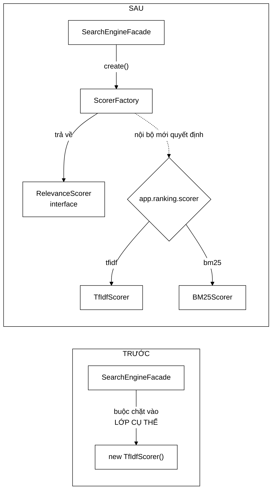
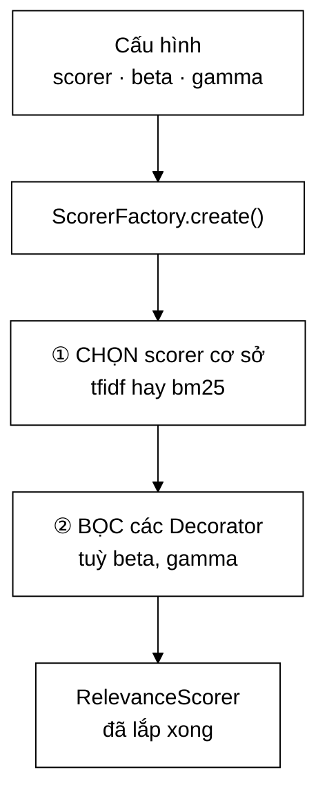

# 02 — Factory

**Nhóm:** Creational (mẫu khởi tạo) · **Trụ cột OOP:** Trừu tượng hoá · **SOLID:** D (Dependency Inversion), S (Single Responsibility)

**Trong VnSearch:** `ScorerFactory`

---

## 1. Hiểu trong 30 giây

Factory tách **việc quyết định tạo ra object nào** khỏi **việc sử dụng object đó**.



```
Trước:  Người dùng ──new TfIdfScorer()──> object      (buộc chặt vào lớp cụ thể)
Sau:    Người dùng ──factory.create()──> RelevanceScorer
                          │
                          └── nội bộ mới quyết định là TF-IDF hay BM25
```

### Factory ở đây làm hai việc, không phải một



Việc ② là chỗ Factory gặp Decorator: nơi duy nhất trong hệ thống biết **thứ tự
bọc** và biết **bỏ qua lớp bọc khi trọng số bằng 0**. Gộp hai việc vào một chỗ
là có chủ ý — nếu tách ra, người gọi lại phải biết thứ tự bọc, tức là biết
đúng cái mà Factory sinh ra để giấu.

Câu thần chú: **"Chỉ đúng một chỗ trong hệ thống được phép biết tên lớp cụ thể."**

---

## 2. Vấn đề thật trong dự án

Đây là ví dụ rõ nhất về việc **một pattern chỉ có giá trị khi nó chạm tới người dùng thật**.

Interface `RelevanceScorer` đã tồn tại và hoạt động tốt (xem [01-STRATEGY.md](01-STRATEGY.md)). Nhưng `SearchEngineFacade` **chôn cứng** cài đặt:

```java
private final TfIdfScorer tfIdfScorer = new TfIdfScorer();   // ← lớp CỤ THỂ
...
resultRanker.rank(candidates, queryTermFrequency, index, tfIdfScorer, ...);
```

Hậu quả, viết thẳng ra thì rất khó chịu:

> Đo được BM25 tốt hơn TF-IDF **5,3 % MRR**, nhưng **người dùng thật không bao giờ nhận được nó** mà không sửa mã nguồn và biên dịch lại.
>
> Strategy chỉ được **bộ đánh giá** khai thác. **Sản phẩm thì không.**

Đó là một kết quả nghiên cứu bị mắc kẹt trong phòng thí nghiệm. Factory là ~30 dòng biến nó thành tính năng.

---

## 3. Cấu trúc trong mã

```java
@Component
public class ScorerFactory {

    @Value("${app.ranking.scorer:tfidf}")   private String scorerType = "tfidf";
    @Value("${app.ranking.bm25.k1:1.2}")    private double k1 = BM25Scorer.DEFAULT_K1;
    @Value("${app.ranking.bm25.b:0.75}")    private double b  = BM25Scorer.DEFAULT_B;
    @Value("${app.ranking.beta:0.30}")      private double pageRankWeight = 0.30;
    @Value("${app.ranking.gamma:0.10}")     private double titleWeight    = 0.10;

    /** Tạo scorer CƠ SỞ (chưa bọc tín hiệu bổ sung). */
    public RelevanceScorer createBase() {
        String type = scorerType == null ? "tfidf" : scorerType.trim().toLowerCase(Locale.ROOT);
        return switch (type) {
            case "bm25"            -> new BM25Scorer(k1, b);
            case "tfidf", "tf-idf" -> new TfIdfScorer();
            default -> throw new IllegalArgumentException(
                    "app.ranking.scorer phải là 'tfidf' hoặc 'bm25', nhận được: " + scorerType);
        };
    }

    /** Tạo scorer ĐẦY ĐỦ: scorer cơ sở, bọc thêm PageRank và khớp tiêu đề. */
    public RelevanceScorer create(Map<Integer, Double> pageRankScores) {
        RelevanceScorer scorer = createBase();
        if (pageRankWeight > 0 && pageRankScores != null && !pageRankScores.isEmpty()) {
            scorer = new PageRankBoostScorer(scorer, pageRankScores, pageRankWeight);
        }
        if (titleWeight > 0) {
            scorer = new TitleBoostScorer(scorer, titleWeight);
        }
        return scorer;
    }
}
```

Nay đổi mô hình xếp hạng là **một dòng properties**:

```properties
app.ranking.scorer=bm25
app.ranking.bm25.k1=1.2
app.ranking.bm25.b=0.75
```

---

## 4. Bốn quyết định thiết kế đáng nói

### 4.1 Vì sao có **hai** phương thức `createBase()` và `create()`

Không phải để cho nhiều hàm. Chúng phục vụ hai người dùng khác nhau:

| Phương thức | Ai dùng | Vì sao cần riêng |
|---|---|---|
| `createBase()` | Bộ đánh giá ablation | Muốn đo **riêng** BM25 thuần, không lẫn tín hiệu PageRank/tiêu đề |
| `create(pageRank)` | Sản phẩm thật | Muốn cấu hình đầy đủ mà người dùng cuối nhận được |

Nếu chỉ có `create()`, ta lại rơi đúng vào cái bẫy ở §2: đo được một thứ, phục vụ một thứ khác.

### 4.2 Trọng số bằng 0 thì **bỏ hẳn lớp bọc**

```java
if (pageRankWeight > 0 && ...) { scorer = new PageRankBoostScorer(...); }
if (titleWeight > 0)           { scorer = new TitleBoostScorer(...); }
```

Không phải "bọc rồi bên trong kiểm tra weight == 0 thì trả về base". Bọc rồi mới bỏ qua vẫn phải trả chi phí một lần gọi hàm ảo cho **mỗi tài liệu × mỗi truy vấn**. Ở đây **không trả chi phí cho một tín hiệu đã tắt**.

> **Bài học OOP:** cấu trúc object được quyết định lúc *khởi tạo*, không phải lúc *chạy*. Đó là lợi thế của việc dựng đồ thị object một lần trong Factory rồi tái dùng.

### 4.3 Ném ngoại lệ ở nhánh `default`

```java
default -> throw new IllegalArgumentException(
        "app.ranking.scorer phải là 'tfidf' hoặc 'bm25', nhận được: " + scorerType);
```

So sánh với hai lựa chọn tệ hơn:

| Cách xử lý | Hậu quả |
|---|---|
| `default -> new TfIdfScorer()` | Gõ sai `bm52` → chạy TF-IDF **im lặng**, cả đợt đo sai mà không ai biết |
| `default -> return null` | `NullPointerException` ở một chỗ hoàn toàn không liên quan tới nguyên nhân |
| **Ném ngoại lệ có thông điệp** | Ứng dụng **không khởi động được**, log chỉ đúng tên tham số và giá trị nhận được |

**Fail fast** — hỏng sớm, hỏng ồn ào, hỏng gần nguyên nhân. Cùng triết lý với `CrawlConfig.build()` ở [08-BUILDER.md](08-BUILDER.md).

### 4.4 Có **hai** constructor

```java
public ScorerFactory() { }                                    // Spring dùng

/** Constructor tường minh cho test và cho các runner chạy ngoài Spring. */
public ScorerFactory(String scorerType, double k1, double b,
                     double pageRankWeight, double titleWeight) { ... }
```

`EvaluationRunner`, `GinBaselineRunner` chạy như chương trình `main` độc lập, không có Spring context. Constructor thứ hai cho phép chúng dựng factory bằng `new` với tham số tường minh — cũng chính là cách test dựng nó.

---

## 5. Factory ở đây là biến thể nào

Trong sách Gang of Four có ba mẫu tên gần giống nhau. Phân biệt cho đúng khi bảo vệ:

| Mẫu | Cơ chế | VnSearch dùng? |
|---|---|---|
| **Simple Factory** | Một lớp có phương thức `create()` chứa `switch` | ✅ **Đây là cái đang dùng** |
| **Factory Method** | Lớp cha khai báo `abstract create()`, lớp con cài đè | ❌ Không cần — sẽ phải tạo cả cây kế thừa cho một quyết định duy nhất |
| **Abstract Factory** | Factory tạo ra **họ** object liên quan (nhiều loại cùng lúc) | ❌ Không cần — chỉ có một loại sản phẩm |

Trả lời thẳng nếu bị hỏi *"sao không dùng Abstract Factory?"*: **vì chỉ có một họ sản phẩm.** Abstract Factory giải bài toán "tạo một bộ object phải khớp nhau" (ví dụ `WindowsButton` + `WindowsCheckbox`). Ở đây chỉ tạo scorer. Dùng Abstract Factory sẽ là over-engineering — và over-engineering **cũng là một lỗi thiết kế**, không phải điểm cộng.

---

## 6. Vì sao `switch` trong Factory **không** vi phạm OOP

Câu hỏi này gần như chắc chắn sẽ được hỏi. Trả lời:

Nguyên tắc *"dùng đa hình thay cho if/else phân nhánh theo kiểu"* nói về **nơi sử dụng**, không nói về **nơi khởi tạo**.

Ở biên của hệ thống, dữ liệu là **chuỗi** (`"bm25"` đọc từ file properties). Ở đâu đó phải có **đúng một chỗ** biến chuỗi thành kiểu. Java không có cách nào đa hình hoá điều đó mà không dùng reflection (đánh đổi kiểm tra kiểu lúc biên dịch lấy sự linh hoạt — một đánh đổi tệ hơn nhiều).

Phép thử đơn giản: **đếm số chỗ trong codebase biết tên lớp `BM25Scorer`.**

- Trước: mọi nơi cần scorer.
- Sau: **một** — `ScorerFactory`.

Đó chính là điều Factory hứa hẹn. Việc chỗ duy nhất đó dùng `switch` là chi tiết cài đặt của nó.

---

## 7. Sai lầm thường gặp

**❌ Factory trả về kiểu cụ thể.**

```java
public BM25Scorer create() { ... }   // ❌ vô nghĩa — người gọi lại buộc chặt vào BM25Scorer
public RelevanceScorer create() { ... }  // ✅
```

**❌ Factory làm thêm việc khác.**
Factory chỉ **tạo**. Nếu nó cũng cache, cũng ghi log nghiệp vụ, cũng gọi CSDL, nó đã vi phạm SRP và trở thành một God Object nhỏ.

**❌ Gọi Factory trong vòng lặp nóng.**
`ScorerFactory.create()` được gọi **một lần** trong `refreshDerivedState()`, không phải mỗi truy vấn:

```java
private void refreshDerivedState() {
    pageRankScores = ...;
    scorer = scorerFactory.create(pageRankScores);   // MỘT lần, khi chỉ mục đổi
    ...
}
```

Dựng lại chuỗi Decorator ba tầng cho mỗi truy vấn là lãng phí thuần tuý — và `PageRankBoostScorer` còn quét toàn bộ map PageRank trong constructor để tính `min`/`max`.

---

## 8. Câu hỏi bảo vệ đồ án

**H: Factory chỉ có ~30 dòng, có đáng gọi là design pattern không?**
Đ: Giá trị của pattern không đo bằng số dòng mà bằng **vấn đề nó giải**. 30 dòng này biến một kết quả nghiên cứu (BM25 hơn 5,3 % MRR) từ chỗ chỉ dùng được trong phòng thí nghiệm thành một tính năng đổi được bằng một dòng cấu hình.

**H: Nếu muốn thêm scorer thứ ba (ví dụ DFR) thì sao?**
Đ: Thêm lớp `DfrScorer implements RelevanceScorer`, thêm một `case` trong `createBase()`. Không nơi nào khác phải sửa. Nếu muốn khắt khe hơn nữa, có thể chuyển sang đăng ký bằng `Map<String, Supplier<RelevanceScorer>>` để cả `switch` cũng không phải sửa — nhưng với hai đến ba cài đặt thì `switch` rõ ràng hơn và bắt lỗi tốt hơn lúc biên dịch.

**H: Vì sao không để Spring tự tiêm `RelevanceScorer` bằng `@Bean`?**
Đ: Được, và với riêng `createBase()` thì tương đương. Nhưng `create(pageRankScores)` cần **tham số runtime** — bảng điểm PageRank chỉ có sau khi chỉ mục được dựng, và phải dựng lại mỗi lần reindex. Bean của Spring được tạo lúc khởi động, không nhận được tham số đó.

---

## 9. Tự kiểm tra

1. Đặt `app.ranking.scorer=bm52` (gõ sai) rồi khởi động. Điều gì xảy ra? So sánh với trường hợp nhánh `default` trả về `new TfIdfScorer()`.
2. Đặt `app.ranking.beta=0` rồi xem `scorer.name()` in ra gì. Vì sao chuỗi đổi?
3. Nếu `create()` được gọi mỗi truy vấn thay vì mỗi lần reindex, chi phí phát sinh nằm ở đâu? *(Gợi ý: đọc constructor của `PageRankBoostScorer`.)*

---

## Liên kết

- Mẫu trước (Factory tạo ra cái gì): [01-STRATEGY.md](01-STRATEGY.md)
- Mẫu tiếp theo (Factory lắp ghép chúng thế nào): [03-DECORATOR.md](03-DECORATOR.md)
- Tổng quan 10 pattern: [README.md](README.md)
