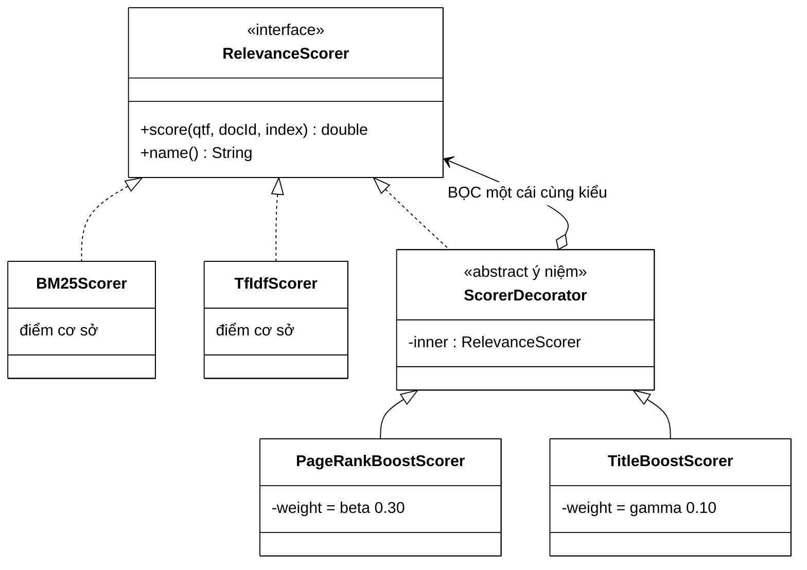
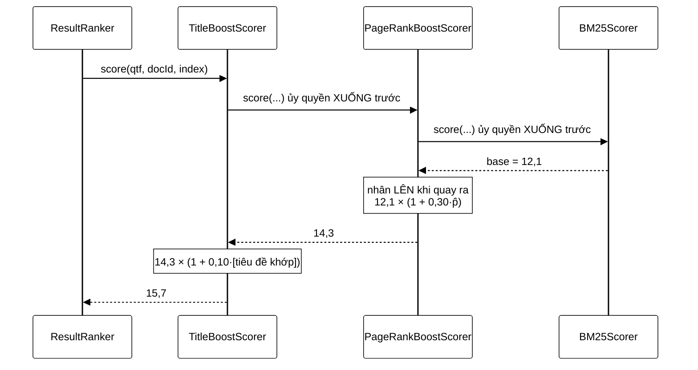

# 03 — Decorator

**Nhóm:** Structural (mẫu cấu trúc) · **Trụ cột OOP:** Composition + Đa hình · **SOLID:** O (Open/Closed), S (Single Responsibility)

**Trong VnSearch:** `PageRankBoostScorer`, `TitleBoostScorer`

> Đây là pattern **sửa được một lỗi thật, nghiêm trọng nhất** của hệ thống cũ. Nếu chỉ đọc một trang trong loạt này, đọc trang này.

---

## 1. Hiểu trong 30 giây

Decorator **bọc** một object và thêm hành vi vào, nhưng **giữ nguyên interface** — nên người dùng không phân biệt được object gốc với object đã bọc.



Chính mũi tên cuối cùng — decorator vừa **là** `RelevanceScorer` vừa **chứa
một** `RelevanceScorer` — là toàn bộ mẫu này.

```
new TitleBoostScorer(
    new PageRankBoostScorer(
        new BM25Scorer(), pageRankScores, 0.30),
    0.10)

┌─ TitleBoostScorer (×1.10 nếu tiêu đề khớp) ──┐
│ ┌─ PageRankBoostScorer (×1.30 nếu uy tín) ─┐ │
│ │  ┌─ BM25Scorer (điểm cơ sở) ──────────┐  │ │
│ │  └────────────────────────────────────┘  │ │
│ └──────────────────────────────────────────┘ │
└──────────────────────────────────────────────┘
```

Câu thần chú: **"Bọc thêm một lớp áo, vẫn là cùng một người."**

### Một lời gọi `score()` đi vào rồi đi ra như thế nào



Đi **xuống** thì không ai tính gì; mọi phép nhân xảy ra lúc **quay ra**. Nhờ
vậy mỗi lớp chỉ cần biết đúng một việc của nó, và thứ tự bọc không đổi kết quả
(phép nhân giao hoán).

### `beta = 0` tắt hẳn một tầng, không phải nhân với 1

```mermaid
%%{init:{'theme':'base','themeVariables':{'background':'#ffffff','primaryColor':'#ffffff','primaryTextColor':'#000000','primaryBorderColor':'#000000','secondaryColor':'#ffffff','secondaryTextColor':'#000000','secondaryBorderColor':'#000000','tertiaryColor':'#ffffff','tertiaryTextColor':'#000000','tertiaryBorderColor':'#000000','lineColor':'#000000','textColor':'#000000','mainBkg':'#ffffff','nodeBorder':'#000000','clusterBkg':'#ffffff','clusterBorder':'#000000','edgeLabelBackground':'#ffffff','actorBkg':'#ffffff','actorBorder':'#000000','actorTextColor':'#000000','actorLineColor':'#000000','signalColor':'#000000','signalTextColor':'#000000','labelBoxBkgColor':'#ffffff','labelBoxBorderColor':'#000000','labelTextColor':'#000000','loopTextColor':'#000000','noteBkgColor':'#ffffff','noteBorderColor':'#000000','noteTextColor':'#000000','sequenceNumberColor':'#ffffff','fontFamily':'ui-monospace, SFMono-Regular, Consolas, monospace'}}}%%
flowchart LR
    F["ScorerFactory"]
    Q1{"beta > 0 ?"}
    Q2{"gamma > 0 ?"}
    B["scorer cơ sở"]
    P["bọc PageRankBoostScorer"]
    T["bọc TitleBoostScorer"]
    OUT["scorer cuối"]

    F --> B --> Q1
    Q1 -->|"có"| P --> Q2
    Q1 -->|"không"| Q2
    Q2 -->|"có"| T --> OUT
    Q2 -->|"không"| OUT
```



Đặt `app.ranking.beta=0` thì lớp bọc **không được tạo ra** — không tốn một
phép gọi hàm nào. Đây là cách sạch nhất để đo đóng góp của từng tín hiệu.

---

## 2. Vấn đề thật — một lỗi thang đo 1000 lần

### 2.1 Công thức cũ

Chôn cứng trong `ResultRanker`:

```java
double finalScore = alpha * relevance + beta * pageRank + gamma * titleBonus;
```

Nhìn hợp lý. Đo trên corpus 5.011 trang thì không:

| Thành phần | Trung bình | Sau khi nhân trọng số |
|---|---|---|
| TF-IDF cosine | 0,177687 | 0,106612 ($\alpha = 0{,}6$) |
| **PageRank** | **0,00035388** | **0,00010616** ($\beta = 0{,}3$) |

$$\frac{\beta\,\overline{\text{PR}}}{\alpha\,\overline{\text{TF-IDF}}} = \frac{0{,}00010616}{0{,}106612} \approx \mathbf{0{,}1\,\%}$$

**PageRank đóng góp một phần nghìn, dù trọng số danh nghĩa là 30 %.**

Bằng chứng thực nghiệm độc lập: quét $\beta$ từ 0,05 tới 0,80 (**gấp 16 lần**) chỉ làm MRR đổi **0,0040**.

### 2.2 Vì sao đây **không** phải "chọn $\beta$ chưa tối ưu"

Đây là lập luận cần nói rõ khi bảo vệ, vì nó là lỗi **khái niệm**, không phải lỗi tinh chỉnh:

> PageRank là một **phân phối xác suất**: $\sum \text{PR} = 1$.
>
> Nên với $N = 5011$, giá trị trung bình **buộc phải** là $1/5011 \approx 0{,}0002$.
>
> Và nó **co lại** khi corpus lớn hơn — với 1 triệu trang, PageRank trung bình là $10^{-6}$, đóng góp giảm thêm 200 lần nữa.

Cộng một **độ tương tự** với một **phân phối xác suất** là phép toán không có ý nghĩa. Hai đại lượng ở hai thang đo khác nhau về bản chất. **Bất kỳ $\beta$ nào cũng không sửa được** — và tệ hơn, lỗi này *xấu đi* khi hệ thống mở rộng.

---

## 3. Lời giải: nhân, không cộng

```java
@Override
public double score(Map<String, Integer> queryTermFrequency, int docId, SearchIndex index) {
    double base = inner.score(queryTermFrequency, docId, index);
    if (base == 0.0 || weight == 0.0) {
        return base;                                  // thoát sớm: không tính gì thêm
    }
    double pageRank   = pageRankScores.getOrDefault(docId, minPageRank);
    double normalized = Math.log1p(pageRank / minPageRank) / logRange;   // ∈ [0, 1]
    return base * (1 + weight * normalized);
}
```

$$\text{final} = \text{base} \times \bigl(1 + w \cdot \hat{p}\bigr), \qquad
\hat{p} = \frac{\log\!\left(1 + p/p_{\min}\right)}{\log\!\left(1 + p_{\max}/p_{\min}\right)} \in [0,1]$$

Hai lý do, cả hai đều đáng viết vào báo cáo:

**1. Logarit nén dải động.** PageRank trải trên nhiều bậc độ lớn (từ $10^{-4}$ tới $7{,}7 \times 10^{-3}$). $\log$ biến nó thành đại lượng **cộng được**, và chuẩn hoá về $[0,1]$ làm `weight` trở thành **tỷ lệ đóng góp thật** — `weight = 0.30` nghĩa là "tối đa tăng 30 %", không còn là một con số vô nghĩa.

**2. Phép nhân bất biến với thang đo của scorer cơ sở.** Đây là tính chất quan trọng nhất. Đổi TF-IDF sang BM25 (thang 0,18 so với 12,1) **không cần chỉnh lại trọng số**.

Lý do (2) giải thích luôn một nghịch lý trong bảng đánh giá cũ:

> *"BM25 + PR + title" (MRR 0,9089) **thua** "TF-IDF + PR + title" (0,9229)*
>
> — đó là số liệu của **công thức cộng cũ**. Sau khi Decorator chuyển sang phép nhân, đo lại cho **0,9093 so với 0,8758**: BM25 thắng, nghịch lý biến mất.

— nghe vô lý vì BM25 thuần hơn TF-IDF thuần. Nguyên nhân: bộ trọng số cộng được tinh chỉnh cho **thang TF-IDF**, dùng lại cho BM25 thì lệch. Phép nhân xoá bỏ vấn đề này.

### 3.1 Có test chứng minh đúng tính chất đó

```java
@Test
void pageRankBoostIsInvariantToBaseScorerScale() {
    RelevanceScorer tfidf = new PageRankBoostScorer(new TfIdfScorer(), pageRank, 0.5);
    RelevanceScorer bm25  = new PageRankBoostScorer(new BM25Scorer(),  pageRank, 0.5);

    double tfidfRatio = tfidf.score(query, 1, index) / tfidf.score(query, 0, index);
    double bm25Ratio  = bm25.score(query, 1, index)  / bm25.score(query, 0, index);

    assertEquals(tfidfRatio, bm25Ratio, 1e-9,
            "Tỷ lệ tăng do PageRank phải GIỐNG NHAU dù thang điểm cơ sở khác hẳn");
}
```

> **Bài học chung:** khi bạn thiết kế một tính chất toán học vào code, **hãy viết test khẳng định chính tính chất đó**, không phải test giá trị cụ thể. Test giá trị cụ thể vỡ mỗi lần đổi tham số; test tính chất thì không.

---

## 4. Vì sao đây là bài học OOP quan trọng nhất trong dự án

### 4.1 Composition thắng Inheritance — chứng minh bằng số

Giả sử làm bằng **kế thừa**. Với 2 scorer cơ sở và 2 tín hiệu bật/tắt độc lập, cần:

```
TfIdfScorer
TfIdfWithPageRank
TfIdfWithTitle
TfIdfWithPageRankAndTitle
BM25Scorer
BM25WithPageRank
BM25WithTitle
BM25WithPageRankAndTitle
```

$2 \times 2^2 = \mathbf{8}$ lớp. Thêm một tín hiệu thứ ba (độ mới của trang) → **16 lớp**. Thêm scorer thứ ba → **24 lớp**. Đây là **bùng nổ tổ hợp**, công thức $S \times 2^T$.

Với Decorator: $S + T = 2 + 2 = \mathbf{4}$ lớp. Thêm tín hiệu = **+1 lớp**, ghép được với mọi thứ có sẵn.

| | Kế thừa | Decorator |
|---|---|---|
| Số lớp cho $S$ scorer, $T$ tín hiệu | $S \times 2^T$ | $S + T$ |
| Quyết định tổ hợp lúc nào | **Biên dịch** | **Chạy** — đọc từ properties |
| Thêm tín hiệu mới | Nhân đôi số lớp | +1 lớp |

Nói cách khác: **cấu trúc kế thừa là tĩnh, cấu trúc composition là dữ liệu.**

### 4.2 Điều kiện để Decorator hoạt động

Decorator **chỉ** làm được vì:

```java
public final class PageRankBoostScorer implements RelevanceScorer {
    private final RelevanceScorer inner;   // ← kiểu INTERFACE, không phải TfIdfScorer
    ...
}
```

Nếu trường được khai báo `private final TfIdfScorer inner`, cả pattern sụp đổ: không bọc được BM25, không lồng Decorator vào nhau.

> **Đây là toàn bộ bí quyết của composition trong OOP:** giữ tham chiếu qua **trừu tượng**, không qua lớp cụ thể. Một dòng khai báo kiểu quyết định hệ thống mở hay đóng.

### 4.3 Đệ quy tự nhiên qua `name()`

```java
@Override
public String name() {
    return String.format("%s + PR x%.2f", inner.name(), weight);
}
```

Mỗi lớp chỉ biết **tên của chính nó** và gọi `inner.name()`. Không lớp nào biết toàn bộ chuỗi. Kết quả tự ghép:

```
"BM25(k1=1.2,b=0.75) + PR x0.30 + title x0.10"
```

Dùng trực tiếp làm nhãn trong bảng đánh giá và trong log khởi động:

```java
log.info("Scorer đang dùng: {}", scorer.name());
```

Đây là **đệ quy trên cấu trúc object** — cùng ý tưởng với `describe()` của [04-COMPOSITE.md](04-COMPOSITE.md).

---

## 5. Decorator thứ hai — `TitleBoostScorer`

Đo trên 200 truy vấn known-item:

```
TF-IDF thuần       : MRR 0,8537
TF-IDF + PageRank  : MRR 0,8625   (+0,0088)
TF-IDF + title     : MRR 0,9083   (+0,0546)   ← gấp 6 lần PageRank
```

Vì sao tín hiệu tiêu đề mạnh hơn: tiêu đề là **bản tóm tắt do chính người viết đặt** cho bài — tín hiệu liên quan rất mạnh. Và khác PageRank, nó **cùng thang đo** với điểm liên quan (`titleBonus` đã nằm sẵn trong $[0,1]$) nên không cần chuẩn hoá thêm.

Vẫn dùng **phép nhân**, để công thức bất biến với thang điểm của scorer được bọc — cùng lý do ở §3.

```java
double bonus = syllables.titleMatchRatio(document.getTitle());   // ∈ [0, 1]
return base * (1 + weight * bonus);
```

---

## 6. Ba chi tiết nhỏ, đúng

**`base == 0` thì trả về 0.** Có chủ ý: *"uy tín cao không cứu được một tài liệu hoàn toàn không liên quan."* $0 \times \text{bất kỳ} = 0$ — tính chất của phép nhân làm điều này miễn phí, phép cộng thì không.

**Kiểm tra tham số trong constructor.**

```java
if (inner == null)  throw new IllegalArgumentException("inner scorer không được null");
if (weight < 0)     throw new IllegalArgumentException("weight phải >= 0, nhận được: " + weight);
```

Hỏng lúc **dựng**, không phải lúc chấm điểm tài liệu thứ 3.000.

**Lớp `final`, trường `final`.** Object bất biến → chia sẻ an toàn giữa các luồng xử lý request mà không cần đồng bộ gì. Cùng lập luận với `CrawlConfig` ở [08-BUILDER.md](08-BUILDER.md).

---

## 7. Decorator khác gì Strategy và Composite

| | Strategy | **Decorator** | Composite |
|---|---|---|---|
| Chứa bao nhiêu object cùng interface | 0 | **1** | **n** |
| Ý đồ | Thay thuật toán | **Thêm hành vi** | Cây phân cấp |
| Người dùng thấy khác biệt không | Có (chọn cái nào) | **Không** | Không |

Điểm chung của Decorator và Composite: cả hai đều **cài interface mà chúng cũng chứa**. Đó là dấu hiệu nhận diện — nếu lớp `X implements I` và có trường kiểu `I`, bạn đang nhìn một trong hai mẫu này.

---

## 8. Sai lầm thường gặp

**❌ Decorator đổi hợp đồng của interface.**
Nếu `PageRankBoostScorer` trả về điểm âm trong khi `RelevanceScorer` hứa điểm không âm, mọi thứ ở tầng trên vỡ. **Vi phạm Liskov.** Decorator được phép đổi *giá trị*, không được phép đổi *hợp đồng*.

**❌ Thứ tự bọc mà không nghĩ.**
Ở đây thứ tự PageRank → title không đổi kết quả vì cả hai đều là phép nhân (giao hoán). Nhưng nếu một Decorator dùng phép cộng, thứ tự **có** ảnh hưởng — và bạn phải biết mình đang làm gì. Javadoc của `ScorerFactory` nói rõ: *"scorer cơ sở nằm trong cùng, các tín hiệu bổ sung bọc dần ra ngoài."*

**❌ Bọc quá sâu.** Mỗi tầng là một lần gọi hàm ảo cho **mỗi tài liệu × mỗi truy vấn**. Hai tầng thì không đáng kể; hai mươi tầng thì có. Đây là lý do trọng số 0 khiến lớp bọc bị **bỏ hẳn** thay vì bọc rồi bỏ qua.

---

## 9. Câu hỏi bảo vệ đồ án

**H: Sao không sửa luôn công thức cộng trong `ResultRanker` cho nhanh?**
Đ: Sửa công thức giải được lỗi thang đo, nhưng vẫn để lại vấn đề gốc: kết hợp tín hiệu bị **chôn cứng** trong lớp xếp hạng. Muốn tắt PageRank để đo ablation vẫn phải sửa mã. Decorator giải cả hai: sửa công thức **và** làm việc bật/tắt từng tín hiệu trở thành cấu hình.

**H: Chứng minh phép nhân bất biến với thang đo như thế nào?**
Đ: Với hai tài liệu $d_1, d_2$, tỷ lệ điểm sau khi bọc là
$$\frac{\text{base}(d_1)\,(1 + w\hat{p}_1)}{\text{base}(d_2)\,(1 + w\hat{p}_2)}$$
Nhân toàn bộ `base` với hằng số $c$ (đổi thang đo) thì $c$ triệt tiêu ở tử và mẫu → **thứ tự xếp hạng không đổi**. Với phép cộng thì $c$ không triệt tiêu. Test `pageRankBoostIsInvariantToBaseScorerScale` kiểm chứng đúng điều này bằng số.

**H: Tại sao dùng `log1p` chứ không phải `log`?**
Đ: `log1p(x)` tính $\log(1+x)$ chính xác hơn khi $x$ rất nhỏ (tránh mất chính xác dấu phẩy động), và đảm bảo giá trị không âm khi $p = p_{\min}$ → $\hat{p} = 0$ đúng như mong đợi.

---

## 10. Tự kiểm tra

1. Viết `RecencyBoostScorer` thưởng cho tài liệu crawl gần đây. Bạn phải sửa bao nhiêu file có sẵn? *(Đáp: một — thêm dòng trong `ScorerFactory.create()`.)*
2. Với 3 scorer cơ sở và 4 tín hiệu bật/tắt: kế thừa cần bao nhiêu lớp, Decorator cần bao nhiêu?
3. Nếu `PageRankBoostScorer` khai báo `private final TfIdfScorer inner`, dòng nào trong `ScorerFactory` sẽ không biên dịch được?
4. Vì sao `base == 0` trả về 0 lại là **tính năng**, không phải trường hợp biên bị bỏ sót?

---

## Liên kết

- Mẫu trước (ai lắp chuỗi Decorator): [02-FACTORY.md](02-FACTORY.md)
- Mẫu tiếp theo (cũng chứa chính interface của mình): [04-COMPOSITE.md](04-COMPOSITE.md)
- Phân tích lỗi thang đo đầy đủ: [ResultRanker §6](../04-ranking/ResultRanker.md)
- Toán học PageRank: [PageRankService](../04-ranking/PageRankService.md)
