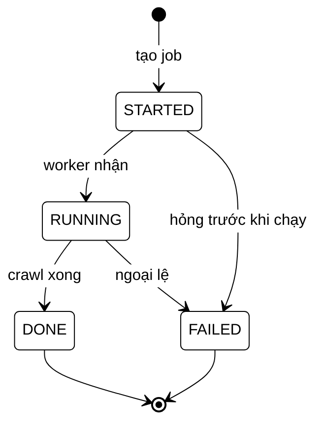

# 06 — State

**Nhóm:** Behavioral (mẫu hành vi) · **Trụ cột OOP:** Đóng gói + Đa hình · **SOLID:** O (Open/Closed), S (Single Responsibility)

**Trong VnSearch:** `CrawlStatus` (enum có máy trạng thái) + `CrawlJobManager`

> Đây là pattern **dễ hiểu nhất** trong loạt này. Nên đọc đầu tiên nếu bạn mới học design pattern.

---

## 1. Hiểu trong 30 giây

Thay vì lưu trạng thái bằng một `String` hay `int` rồi kiểm tra bằng `if`, ta biến **mỗi trạng thái thành một object biết chính nó đi được đi đâu**.



```
  STARTED ──→ RUNNING ──→ DONE
     │           │
     └───────────┴──────→ FAILED
```

**Bảng chuyển trạng thái đầy đủ** — mỗi ô là một câu trả lời của
`canTransitionTo`, và nó nằm **ngay trong hằng số enum tương ứng**, không nằm
trong một `switch` tập trung:

| từ ↓ \ sang → | `STARTED` | `RUNNING` | `DONE` | `FAILED` |
|---|:---:|:---:|:---:|:---:|
| **`STARTED`** | ✗ | ✓ | ✗ | ✓ |
| **`RUNNING`** | ✗ | ✗ | ✓ | ✓ |
| **`DONE`** | ✗ | ✗ | ✗ | ✗ |
| **`FAILED`** | ✗ | ✗ | ✗ | ✗ |

Hai hàng cuối toàn ✗ — đó chính là định nghĩa của **trạng thái cuối**, và
`isTerminal()` chỉ là cách đọc lại điều đó cho dễ.

### Vì sao không dùng `String status`

```mermaid
%%{init:{'theme':'base','themeVariables':{'background':'#ffffff','primaryColor':'#ffffff','primaryTextColor':'#000000','primaryBorderColor':'#000000','secondaryColor':'#ffffff','secondaryTextColor':'#000000','secondaryBorderColor':'#000000','tertiaryColor':'#ffffff','tertiaryTextColor':'#000000','tertiaryBorderColor':'#000000','lineColor':'#000000','textColor':'#000000','mainBkg':'#ffffff','nodeBorder':'#000000','clusterBkg':'#ffffff','clusterBorder':'#000000','edgeLabelBackground':'#ffffff','actorBkg':'#ffffff','actorBorder':'#000000','actorTextColor':'#000000','actorLineColor':'#000000','signalColor':'#000000','signalTextColor':'#000000','labelBoxBkgColor':'#ffffff','labelBoxBorderColor':'#000000','labelTextColor':'#000000','loopTextColor':'#000000','noteBkgColor':'#ffffff','noteBorderColor':'#000000','noteTextColor':'#000000','sequenceNumberColor':'#ffffff','fontFamily':'ui-monospace, SFMono-Regular, Consolas, monospace'}}}%%
flowchart LR
    subgraph S1["String status"]
        direction TB
        A1["status = RUNNING"]
        A2["gõ sai runnning<br/>biên dịch VẪN QUA"]
        A3["DONE quay về RUNNING<br/>KHÔNG AI CHẶN"]
    end

    subgraph S2["enum + canTransitionTo"]
        direction TB
        B1["CrawlStatus.RUNNING"]
        B2["gõ sai ⇒ LỖI BIÊN DỊCH"]
        B3["DONE.canTransitionTo(RUNNING)<br/>⇒ false, chặn tại chỗ"]
    end

    S1 -->|"thay bằng"| S2
```



Điểm mấu chốt không phải "enum đẹp hơn String", mà là: với `String`, **luật
chuyển trạng thái không tồn tại ở đâu cả** — nó nằm rải rác trong các câu `if`
mà không ai đảm bảo là đầy đủ. Với enum kiểu này, mỗi trạng thái **tự mang
theo luật của nó**, và thêm một trạng thái mới buộc phải khai báo nó đi được
đâu.

Câu thần chú: **"Mỗi trạng thái tự biết mình chuyển đi đâu được."**

---

## 2. Vấn đề thật trong dự án

Trạng thái job crawl trước đây là một `String`:

```java
volatile String status = "STARTED";
...
job.status = "RUNNING";
job.status = "DONE";
```

Bốn vấn đề, **tất cả đều là lỗi im lặng** — không có exception, không có cảnh báo, chỉ có hành vi sai:

| # | Lỗi | Hậu quả |
|---|---|---|
| 1 | `job.status = "DONEE"` **biên dịch bình thường** | Tầng UI đọc `"DONE"` **không bao giờ khớp** → thanh tiến độ quay mãi |
| 2 | Không có ràng buộc chuyển trạng thái | Không gì ngăn `"DONE"` → `"RUNNING"` |
| 3 | Không liệt kê được tập trạng thái | Muốn biết có những gì phải **grep toàn bộ codebase** |
| 4 | `switch` trên `String` không kiểm tra đầy đủ nhánh | Thêm trạng thái mới, không nơi nào được nhắc |

Đây là anti-pattern **Primitive Obsession**: dùng kiểu nguyên thuỷ cho một khái niệm miền có ràng buộc riêng. `String` có $2^{\text{vô hạn}}$ giá trị hợp lệ; trạng thái crawl chỉ có **4**.

---

## 3. Cấu trúc trong mã

```java
public enum CrawlStatus {

    /** Job đã được tạo và xếp hàng, chưa chạy. */
    STARTED {
        @Override public boolean canTransitionTo(CrawlStatus next) {
            return next == RUNNING || next == FAILED;
        }
    },

    /** Worker đang crawl. */
    RUNNING {
        @Override public boolean canTransitionTo(CrawlStatus next) {
            return next == DONE || next == FAILED;
        }
    },

    /** Hoàn tất thành công — trạng thái CUỐI. */
    DONE {
        @Override public boolean canTransitionTo(CrawlStatus next) { return false; }
    },

    /** Thất bại — trạng thái CUỐI. */
    FAILED {
        @Override public boolean canTransitionTo(CrawlStatus next) { return false; }
    };

    /** Từ trạng thái này có được phép chuyển sang next không. */
    public abstract boolean canTransitionTo(CrawlStatus next);

    /** Trạng thái cuối (không còn chuyển tiếp nào). */
    public boolean isTerminal() {
        return this == DONE || this == FAILED;
    }
}
```

Và cổng duy nhất để đổi trạng thái:

```java
synchronized void transitionTo(CrawlStatus next) {
    if (!status.canTransitionTo(next)) {
        throw new IllegalStateException("Không thể chuyển từ " + status + " sang " + next);
    }
    status = next;
}
```

---

## 4. Vì sao đây là OOP chứ không phải một `enum` thường

Đây là điểm cần nắm. Một `enum` thường chỉ là tập hằng số có tên:

```java
// ❌ enum thường — logic chuyển trạng thái nằm NGOÀI, ở người dùng
enum CrawlStatus { STARTED, RUNNING, DONE, FAILED }

// người dùng phải tự viết:
if (status == STARTED && (next == RUNNING || next == FAILED)) { ... }
else if (status == RUNNING && (next == DONE || next == FAILED)) { ... }
else if ...
```

Logic đó sẽ bị **sao chép ở mọi nơi cần kiểm tra**, và sẽ trôi lệch.

```java
// ✅ State pattern — mỗi trạng thái tự mang hành vi của nó
enum CrawlStatus {
    STARTED { public boolean canTransitionTo(CrawlStatus next) { ... } },
    ...
    public abstract boolean canTransitionTo(CrawlStatus next);
}
```

**Phương thức trừu tượng cài đè ở từng hằng** là cơ chế Java cho phép mỗi hằng enum trở thành **một lớp con ẩn danh riêng**. Đó chính là đa hình — và chính là State pattern.

Hệ quả quan trọng: **thêm một trạng thái mới thì trình biên dịch bắt buộc phải khai báo chuyển tiếp của nó.** Không thể quên. Với `String`, thêm trạng thái là thêm một chuỗi ở đâu đó và không ai biết.

> **Bài học OOP:** dữ liệu và hành vi trên dữ liệu đó **nên ở cùng một chỗ**. Khi bạn thấy `if` phân nhánh theo giá trị của một trường, hãy hỏi: *"hành vi này có nên nằm trong chính giá trị đó không?"*

---

## 5. Ba chi tiết đáng nói

### 5.1 `isTerminal()` — xoá một dạng trùng lặp tinh vi

```java
public boolean isTerminal() {
    return this == DONE || this == FAILED;
}
```

Trước đây, tầng UI muốn biết *"đã xong chưa, còn hỏi lại không"* phải so chuỗi với `"DONE"` **và** `"FAILED"` — và đoạn so sánh đó **rải rác ở nhiều nơi**. Thêm trạng thái cuối thứ ba (ví dụ `CANCELLED`) sẽ phải tìm và sửa mọi chỗ.

Nay là **một** phương thức, một chỗ để sửa.

### 5.2 Máy trạng thái là một đồ thị có hướng không chu trình

```
  STARTED ──→ RUNNING ──→ DONE
     │           │
     └───────────┴──────→ FAILED
```

Đọc được từ đồ thị mà không cần đọc code:

- `DONE` và `FAILED` **không có cạnh ra** → trạng thái cuối, job không "sống lại" được.
- Mọi trạng thái không cuối đều có cạnh tới `FAILED` → lỗi có thể xảy ra bất cứ lúc nào.
- Không có cạnh `STARTED → DONE` → **không thể xong mà chưa từng chạy**. Đó là một bất biến nghiệp vụ được mã hoá vào kiểu.

### 5.3 `synchronized` bảo vệ phép "kiểm tra rồi gán"

```java
synchronized void transitionTo(CrawlStatus next) {
    if (!status.canTransitionTo(next)) { throw ... }
    status = next;
}
```

`volatile` **không đủ** ở đây. `volatile` đảm bảo mỗi lần đọc/ghi riêng lẻ đều thấy giá trị mới nhất, nhưng **kiểm tra rồi gán là hai thao tác**. Hai luồng cùng gọi `transitionTo(DONE)` từ `RUNNING`: cả hai đọc `RUNNING`, cả hai thấy hợp lệ, cả hai gán — máy trạng thái bị vượt qua.

`synchronized` biến cặp thao tác thành **một đơn vị nguyên tử**.

> **Bài học chung:** *"kiểm tra rồi hành động"* (check-then-act) là mẫu lỗi đa luồng phổ biến nhất. Nhận ra nó là kỹ năng đáng có.

---

## 6. Bảy test — trong đó một test bắt lỗi tinh vi

`CrawlStatusTest` có **7 test**, gồm một test đáng chú ý:

> **Không trạng thái nào được chuyển về chính nó.**

Vì sao test này quan trọng: `RUNNING → RUNNING` **nghe có vẻ vô hại**, nhưng nó nghĩa là một job có thể được "khởi động lại" giữa chừng mà máy trạng thái không phản đối — che giấu một lỗi logic ở tầng gọi. Test này bắt một lớp lỗi mà đọc code bằng mắt rất dễ bỏ qua.

```java
// tinh thần của test
for (CrawlStatus s : CrawlStatus.values()) {
    assertFalse(s.canTransitionTo(s), "Trạng thái " + s + " không được chuyển về chính nó");
}
```

Test này duyệt `values()` nên **tự động phủ trạng thái mới** thêm sau này — không phải sửa test.

---

## 7. State pattern "đầy đủ" khác gì bản này

Sách Gang of Four mô tả State với một cây lớp:

```java
interface State { void handle(Context ctx); }
class StartedState implements State { ... }
class RunningState implements State { ... }
```

VnSearch dùng **enum với phương thức trừu tượng** — tương đương về mặt đa hình nhưng tốt hơn cho bài toán này:

| | Cây lớp | **Enum có phương thức** |
|---|---|---|
| Tập trạng thái | Mở — ai cũng thêm được | **Đóng** — kiểm soát được |
| Liệt kê được tất cả | Không | ✅ `values()` |
| `switch` kiểm tra đầy đủ nhánh | Không | ✅ |
| Serialize / lưu CSDL | Phải tự viết | ✅ tự nhiên |
| Trạng thái có dữ liệu riêng | ✅ được | ❌ không |
| So sánh | `equals` | `==` |

Chọn enum vì trạng thái crawl **hữu hạn, biết trước, và không mang dữ liệu riêng**. Nếu mỗi trạng thái cần trường riêng (ví dụ `RUNNING` giữ số trang đã xong), cây lớp sẽ hợp hơn.

> Đối chiếu với [04-COMPOSITE.md](04-COMPOSITE.md): `QueryNode` dùng `sealed interface` + `record` chính vì các nút **có dữ liệu khác nhau** — `TermNode` giữ `String`, `AndNode` giữ `List`. Hai bài toán khác nhau, hai công cụ khác nhau. Biết chọn đúng là phần quan trọng của thiết kế.

---

## 8. Sai lầm thường gặp

**❌ Để trường trạng thái `public` hoặc có setter.**
Nếu ai đó gán `job.status = DONE` trực tiếp, máy trạng thái bị vượt qua hoàn toàn. Trong `CrawlJobManager`, trường là `private volatile` và **cổng duy nhất** là `transitionTo`:

```java
private static final class CrawlJob {
    private volatile CrawlStatus status = CrawlStatus.STARTED;   // private
    synchronized void transitionTo(CrawlStatus next) { ... }     // cổng duy nhất
    CrawlStatus status() { return status; }                      // chỉ đọc
}
```

**❌ Nuốt ngoại lệ chuyển trạng thái sai.**
`catch (IllegalStateException e) { }` là quay lại đúng vấn đề cũ — lỗi im lặng. Ngoại lệ báo có **lỗi logic ở tầng gọi**, phải sửa tầng gọi.

**❌ Dùng State cho thứ không phải trạng thái.**
Nếu chỉ có hai giá trị không ràng buộc chuyển tiếp (`bật`/`tắt`), `boolean` là đủ. State đáng dùng khi **có luật chuyển tiếp**.

---

## 9. Câu hỏi bảo vệ đồ án

**H: `enum` thường đã đủ chưa? Sao phải thêm `canTransitionTo`?**
Đ: `enum` thường giải được vấn đề 1 và 3 (gõ sai, liệt kê được) nhưng **không giải được vấn đề 2** — không có gì ngăn `DONE → RUNNING`. Luật chuyển tiếp phải nằm ở đâu đó; nếu không nằm trong enum thì nó sẽ bị sao chép ở mọi nơi kiểm tra và sẽ trôi lệch.

**H: Vì sao dùng `synchronized` mà trường vẫn `volatile`?**
Đ: `synchronized` bảo vệ thao tác **ghi** (kiểm tra rồi gán). `volatile` đảm bảo thao tác **đọc** từ luồng khác (`status()` gọi bởi luồng phục vụ HTTP) thấy giá trị mới nhất mà **không phải giành khoá**. Đọc trạng thái là thao tác thường xuyên và không cần khoá.

**H: Nếu thêm trạng thái `PAUSED` thì sao?**
Đ: Thêm một hằng, cài `canTransitionTo` cho nó, và sửa `RUNNING` để cho phép `→ PAUSED`. Trình biên dịch **bắt buộc** khai báo `canTransitionTo` (vì nó `abstract`), và mọi `switch` đầy đủ nhánh trên `CrawlStatus` sẽ báo lỗi cho tới khi xử lý nhánh mới. Test "không chuyển về chính nó" tự động phủ trạng thái mới vì nó duyệt `values()`.

---

## 10. Tự kiểm tra

1. Vẽ máy trạng thái nếu thêm `PAUSED` và `CANCELLED`. Trạng thái nào là cuối?
2. Vì sao `volatile` một mình không đủ cho `transitionTo`? Viết kịch bản hai luồng gây lỗi.
3. Nếu `isTerminal()` không tồn tại, thêm trạng thái cuối `CANCELLED` sẽ phải sửa những đâu?
4. Trạng thái nào **nên** dùng cây lớp thay vì enum? Cho một ví dụ trong miền crawler.

---

## Liên kết

- Mẫu trước: [05-CHAIN-OF-RESPONSIBILITY.md](05-CHAIN-OF-RESPONSIBILITY.md)
- Mẫu tiếp theo (cũng ở `CrawlJobManager`): [07-OBSERVER.md](07-OBSERVER.md)
- So sánh `enum` với `sealed interface`: [04-COMPOSITE.md §4.3](04-COMPOSITE.md)
