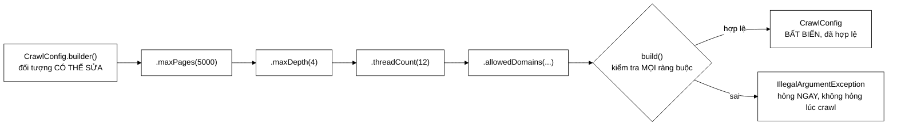

# 08 — Builder

**Nhóm:** Creational (mẫu khởi tạo) · **Trụ cột OOP:** Đóng gói · **SOLID:** S (Single Responsibility)

**Trong VnSearch:** `CrawlConfig` + `CrawlConfig.Builder`

---

## 1. Hiểu trong 30 giây

Builder tách **quá trình dựng** một object phức tạp khỏi **object thành phẩm**. Kết quả: object thành phẩm **bất biến** và **đã được kiểm tra hợp lệ**.

```java
CrawlConfig config = CrawlConfig.builder()
        .maxPages(5000)
        .maxDepth(4)
        .threadCount(12)
        .allowedDomains(Set.of("vnexpress.net", "tuoitre.vn"))
        .maxDurationMinutes(30)
        .urlStoragePath("data/seen-urls.txt")
        .build();          // ← kiểm tra MỌI ràng buộc tại đây, rồi đóng băng
```



```
   GIAI ĐOẠN DỰNG                  │  GIAI ĐOẠN DÙNG
   (có thể sửa, chưa kiểm tra)     │  (bất biến, đã hợp lệ)
   ────────────────────────────────┼──────────────────────────
   builder()                       │
     .maxPages(5000)               │
     .maxDepth(4)          ────────┼──▶  CrawlConfig
     .threadCount(12)              │       không setter nào
     .build()  ◀── ranh giới ──────┤       chia sẻ giữa 12 luồng
                  kiểm tra ở ĐÂY   │       không cần đồng bộ
```

**Vì sao ranh giới đó quan trọng với crawler cụ thể này.** `CrawlConfig` được
**12 luồng đọc đồng thời** suốt phiên crawl. Bất biến nghĩa là không cần một
phép đồng bộ nào — và cũng không thể có chuyện luồng thứ 7 sửa `maxDepth` giữa
chừng khiến luồng thứ 3 thấy giá trị khác.

Câu thần chú: **"Dựng thì linh hoạt, dựng xong thì đóng băng."**

---

## 2. Vấn đề thật trong dự án

### 2.1 Object sửa được **giữa phiên crawl**

```java
CrawlConfig cfg = new CrawlConfig().maxPages(5000);
crawler.crawl(seeds, cfg);
cfg.maxPages = -1;        // ← sửa GIỮA phiên crawl, không ai chặn
```

Trường `public` + setter trả về `this` trông giống Builder nhưng **không phải** — vì không có bước "đóng băng". 12 worker thread đang đọc cấu hình này; một luồng khác sửa nó là **race condition** và **hành vi không xác định**.

### 2.2 Không có kiểm tra hợp lệ ở đâu cả

Đây là phần đau hơn, vì lỗi xuất hiện **rất xa nguyên nhân**:

| Giá trị sai | Lỗi xuất hiện ở đâu | Thông điệp |
|---|---|---|
| `threadCount = 0` | `Executors.newFixedThreadPool(0)` | `IllegalArgumentException` khó hiểu, không nhắc tới `threadCount` |
| `maxDurationMinutes = 0` | `latch.await(0, MINUTES)` hết hạn **ngay lập tức** | Không có ngoại lệ nào — phiên crawl kết thúc sau 0 giây với 0 trang |
| `maxPages = -1` | Không hỏng — crawl **không làm gì** rồi kết thúc | Không có thông điệp nào |
| `maxDepth = -5` | Không hỏng — kết quả rỗng | Không có thông điệp nào |

Hai dòng cuối là loại tệ nhất: **lỗi im lặng**. Bạn chờ 30 phút rồi nhận kết quả rỗng và không biết vì sao.

---

## 3. Cấu trúc trong mã

```java
public final class CrawlConfig {

    private final int maxDepth;
    private final int maxPages;
    private final int threadCount;
    private final Set<String> allowedDomains;
    private final int maxDurationMinutes;
    private final String urlStoragePath;

    private CrawlConfig(Builder builder) {          // ← constructor PRIVATE
        this.maxDepth        = builder.maxDepth;
        this.maxPages        = builder.maxPages;
        this.threadCount     = builder.threadCount;
        this.allowedDomains  = Set.copyOf(builder.allowedDomains);   // bản sao BẤT BIẾN
        this.maxDurationMinutes = builder.maxDurationMinutes;
        this.urlStoragePath  = builder.urlStoragePath;
    }

    public static Builder builder() { return new Builder(); }

    // chỉ có getter, KHÔNG có setter
    public int maxDepth()   { return maxDepth; }
    public int maxPages()   { return maxPages; }
    public Set<String> allowedDomains() { return allowedDomains; }
    ...
}
```

Builder với **kiểm tra tập trung tại một chỗ**:

```java
public static final class Builder {

    private int maxDepth = 3;              // giá trị mặc định hợp lý
    private int maxPages = 100;
    private int threadCount = 4;
    private Set<String> allowedDomains = Set.of();
    private int maxDurationMinutes = 60;
    private String urlStoragePath = null;    // null = khong luu ben URL

    private Builder() { }

    public Builder maxDepth(int value)    { this.maxDepth = value; return this; }
    public Builder maxPages(int value)    { this.maxPages = value; return this; }
    public Builder threadCount(int value) { this.threadCount = value; return this; }
    ...

    /** Kiểm tra MỌI ràng buộc tại một chỗ duy nhất, rồi tạo object bất biến. */
    public CrawlConfig build() {
        if (maxPages <= 0)
            throw new IllegalArgumentException("maxPages phải > 0, nhận được: " + maxPages);
        if (maxDepth < 0)
            throw new IllegalArgumentException("maxDepth phải >= 0, nhận được: " + maxDepth);
        if (threadCount <= 0)
            throw new IllegalArgumentException("threadCount phải > 0, nhận được: " + threadCount);
        if (maxDurationMinutes <= 0)
            // Bằng 0 thì latch.await(0, MINUTES) hết hạn ngay, phiên crawl kết
            // thúc sau 0 giây mà KHÔNG có ngoại lệ nào — lỗi im lặng, khó lần.
            throw new IllegalArgumentException("maxDurationMinutes phải > 0, nhận được: " + maxDurationMinutes);
        return new CrawlConfig(this);
    }
}
```

---

## 4. Bốn cơ chế đóng gói, xếp theo mức độ

Trang này là ví dụ tốt nhất trong dự án về **đóng gói là gì**. Bốn cơ chế cùng làm việc:

### 4.1 Constructor `private` — không có đường vòng

```java
private CrawlConfig(Builder builder) { ... }
```

Cách **duy nhất** tạo `CrawlConfig` là qua `Builder.build()`, và `build()` **luôn** kiểm tra. Không có cửa sau.

> Nếu constructor là `public`, mọi kiểm tra trong `build()` trở thành **tuỳ chọn** — ai đó sẽ gọi thẳng constructor để "cho nhanh", và bạn quay lại vạch xuất phát.

### 4.2 Trường `final` — không sửa được sau khi dựng

```java
private final int maxPages;
```

Trình biên dịch **ép** điều này, không phải quy ước. Không có setter nào tồn tại để mà quên.

### 4.3 `Set.copyOf` — bản sao phòng thủ

```java
this.allowedDomains = Set.copyOf(builder.allowedDomains);
```

Đây là chi tiết dễ bỏ sót nhất, và có **2 test riêng** cho nó.

`final` chỉ đảm bảo **tham chiếu** không đổi, **không** đảm bảo object được trỏ tới không đổi. Nếu chỉ gán `this.allowedDomains = builder.allowedDomains`:

```java
Set<String> domains = new HashSet<>(Set.of("vnexpress.net"));
CrawlConfig cfg = CrawlConfig.builder().allowedDomains(domains).build();
domains.add("evil.com");                    // ← sửa được cấu hình từ BÊN NGOÀI!
// cfg.allowedDomains() nay chứa cả evil.com
```

`Set.copyOf` tạo một **bản sao bất biến**, cắt đứt liên hệ với tập gốc.

> **Bài học OOP quan trọng:** `private final` **chưa phải** là đóng gói nếu trường trỏ tới object thay đổi được. Đóng gói thật đòi hỏi **bản sao phòng thủ** (defensive copy) ở cả **lối vào** (constructor) và **lối ra** (getter).
>
> Cùng nguyên tắc đã áp dụng ở `InvertedIndex.getAllDocuments()` (`Collections.unmodifiableMap`) và `Stack.toArray()` ở frontend.

### 4.4 Kiểm tra tập trung tại `build()`

Mọi ràng buộc ở **một chỗ**. So sánh ba phương án:

| Đặt kiểm tra ở đâu | Vấn đề |
|---|---|
| Trong từng setter | Kiểm tra **liên quan giữa các trường** làm không được (ví dụ `maxPages` phải > `threadCount`) vì thứ tự gọi setter tuỳ ý |
| Ở nơi sử dụng (`CrawlerService`) | Mỗi nơi dùng phải nhớ kiểm tra; quên một chỗ là hỏng |
| **Trong `build()`** | ✅ Một chỗ, chạy đúng một lần, chạy **trước** khi object tồn tại |

---

## 5. Bất biến cho lợi ích về đa luồng

```java
// 12 worker cùng đọc cấu hình này, không cần volatile hay đồng bộ gì.
if (depth < config.maxDepth() && crawled.get() < config.maxPages()) { ... }
```

**Object bất biến an toàn tuyệt đối với đa luồng** — không cần `volatile`, không cần `synchronized`, không cần `Atomic*`. Lý do: mô hình bộ nhớ Java đảm bảo mọi trường `final` được nhìn thấy đầy đủ bởi mọi luồng sau khi constructor kết thúc (*final field freeze*).

Đây là lý do mạnh nhất để ưu tiên bất biến trong code đồng thời: **vấn đề đồng bộ biến mất thay vì được giải quyết.**

Cùng lập luận áp dụng cho: `PageRankBoostScorer` ([03-DECORATOR](03-DECORATOR.md)), `CrawlEvent` ([07-OBSERVER](07-OBSERVER.md)), toàn bộ `QueryNode` ([04-COMPOSITE](04-COMPOSITE.md)), và 9 `record` khác trong dự án.

---

## 6. Vì sao thông điệp lỗi có giá trị nhận được

```java
throw new IllegalArgumentException("maxPages phải > 0, nhận được: " + maxPages);
//                                                    ↑ giá trị thật
```

So sánh ba mức chất lượng thông điệp:

| Thông điệp | Người đọc phải làm gì |
|---|---|
| `IllegalArgumentException` (rỗng) | Mở debugger |
| `"Tham số không hợp lệ"` | Đoán tham số nào |
| `"maxPages phải > 0, nhận được: -1"` | **Sửa ngay** — biết tên tham số, luật, và giá trị sai |

Chi phí: một phép nối chuỗi, chỉ chạy khi đã hỏng. Lợi ích: khỏi phiên gỡ lỗi.

Cùng triết lý với `ScorerFactory` nhánh `default` ([02-FACTORY §4.3](02-FACTORY.md)) và `CrawlStatus.transitionTo` ([06-STATE §3](06-STATE.md)). Đây là một **phong cách nhất quán** của dự án, không phải chi tiết lẻ.

---

## 7. Khi nào **không** cần Builder

Builder không miễn phí — nó thêm một lớp lồng và bộ setter phải bảo trì. Đừng dùng khi:

**❌ Ít tham số (≤ 3) và đều bắt buộc.** Constructor thường rõ hơn:

```java
new BM25Scorer(k1, b);   // 2 tham số, đều bắt buộc → không cần Builder
```

**❌ Dữ liệu thuần không có ràng buộc.** Dùng `record`:

```java
record Posting(int docId, int termFrequency, int[] positions) { }
```

Dự án có **9 `record`** cho đúng trường hợp này, và **một** Builder cho `CrawlConfig`. Việc phân biệt được khi nào dùng cái nào quan trọng hơn việc dùng nhiều pattern.

### 7.1 Ba dấu hiệu Builder là lựa chọn đúng

`CrawlConfig` thoả cả ba:

1. **Nhiều tham số cùng kiểu** — 5 trong 6 tham số là `int`. `new CrawlConfig(3, 5000, 12, 60, 50)` là một quả bom hẹn giờ: đảo hai số bất kỳ vẫn biên dịch. `.maxDepth(3).maxPages(5000)` thì không đảo được.
2. **Phần lớn tham số có mặc định hợp lý** — không phải viết đủ 6 giá trị mỗi lần.
3. **Có ràng buộc hợp lệ cần kiểm tra** — cần một chỗ để đặt chúng.

---

## 8. Sai lầm thường gặp

**❌ Builder không có `build()`, chỉ có setter trả `this`.**
Đó chính là bản cũ ở §2.1 — trông giống Builder nhưng thiếu **chính xác thứ làm nó có giá trị**: bước đóng băng + kiểm tra.

**❌ Dùng lại một Builder cho nhiều object.**
```java
Builder b = CrawlConfig.builder().maxPages(100);
CrawlConfig a = b.build();
b.maxPages(200);
CrawlConfig c = b.build();      // a và c là hai object riêng — ĐÚNG,
                                // vì constructor sao chép giá trị, không giữ tham chiếu Builder
```
Ở đây an toàn vì `CrawlConfig` copy toàn bộ trường trong constructor. Nhưng nếu Builder giữ tham chiếu tới một `List` mà cả hai object cùng dùng — hỏng. **Bản sao phòng thủ ở §4.3 chính là thứ ngăn điều này.**

**❌ Quên bản sao phòng thủ cho collection.** Xem §4.3. Đây là lỗi tinh vi nhất, và là lý do có 2 test riêng.

**❌ Builder có logic nghiệp vụ.**
Builder chỉ **thu thập** và **kiểm tra**. Nếu nó gọi mạng, đọc file, hay tính toán, nó đã vi phạm SRP.

---

## 9. Mười test — kiểm gì

`CrawlConfigTest` có **10 test**, chia ba nhóm:

| Nhóm | Nội dung |
|---|---|
| **Giá trị mặc định** | Không gọi setter nào thì `build()` vẫn ra cấu hình hợp lệ |
| **Kiểm tra hợp lệ** | Mỗi ràng buộc trong `build()` có một test ném `IllegalArgumentException` |
| **Bản sao phòng thủ** (2 test) | Sửa tập gốc sau `build()` **không** ảnh hưởng config; và `allowedDomains()` trả về tập không sửa được |

Nhóm thứ ba đáng chú ý: nó test một tính chất **không nhìn thấy trong chữ ký hàm**. Không có test đó, ai đó tối ưu `Set.copyOf` thành gán thẳng "cho đỡ tốn bộ nhớ" và không có gì báo động.

---

## 10. Câu hỏi bảo vệ đồ án

**H: `record` cũng bất biến, sao không dùng `record CrawlConfig(...)` cho gọn?**
Đ: `record` không có chỗ tự nhiên để đặt **giá trị mặc định** (phải viết constructor phụ cho từng tổ hợp), và với 6 tham số toàn `int` thì `new CrawlConfig(3, 5000, 12, ...)` rất dễ đảo nhầm thứ tự. `record` có compact constructor để kiểm tra hợp lệ — nhưng vấn đề mặc định và thứ tự tham số vẫn còn. Builder giải cả ba.

**H: Vì sao kiểm tra ở `build()` chứ không ở từng setter?**
Đ: Ba lý do. (1) Kiểm tra **liên quan giữa các trường** cần biết toàn bộ giá trị, mà thứ tự gọi setter là tuỳ ý. (2) Người dùng có thể muốn đặt giá trị tạm rồi ghi đè. (3) Gom về một chỗ dễ đọc và dễ bảo trì — đọc `build()` là thấy toàn bộ hợp đồng của lớp.

**H: Bất biến có tốn bộ nhớ hơn không?**
Đ: `Set.copyOf` tạo một bản sao — với vài chục domain thì không đáng kể, và **chỉ một lần** mỗi phiên crawl. Đổi lại: 12 worker đọc mà không cần đồng bộ gì. Đó là đánh đổi cực kỳ có lợi.

---

## 11. Tự kiểm tra

1. Viết một test chứng minh: nếu bỏ `Set.copyOf`, cấu hình sửa được từ bên ngoài sau khi `build()`.
2. Nếu `maxDurationMinutes = 0` mà **không** có kiểm tra, phiên crawl kết thúc ngay với 0 trang và **không** ném ngoại lệ nào. Vì sao lỗi im lặng lại khó lần ra hơn một ngoại lệ?
3. Thêm ràng buộc *"`maxPages` phải >= `threadCount`"*. Vì sao ràng buộc này **không** đặt được trong setter?
4. Kể ba object khác trong dự án bất biến và nêu lợi ích đa luồng của mỗi cái.

---

## Liên kết

- Mẫu trước (cùng thuộc crawler): [07-OBSERVER.md](07-OBSERVER.md)
- Mẫu tiếp theo: [09-ITERATOR-CURSOR.md](09-ITERATOR-CURSOR.md)
- Nền tảng đóng gói: [00-OOP-CO-BAN.md §2.1](00-OOP-CO-BAN.md)
