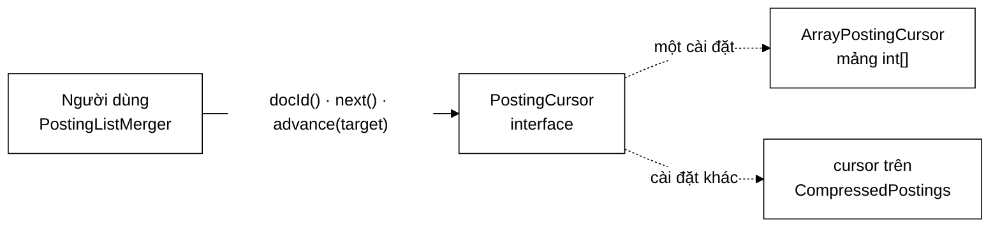

# 09 — Iterator / Cursor

**Nhóm:** Behavioral (mẫu hành vi) · **Trụ cột OOP:** Đóng gói + Trừu tượng hoá · **SOLID:** I (Interface Segregation), D

**Trong VnSearch:** `PostingCursor` + `ArrayPostingCursor`

> Đây là pattern thiên về **hiệu năng**. Nó cho thấy một trừu tượng hoá đúng chỗ không chỉ làm code sạch mà còn **mở khoá thuật toán nhanh hơn**.

---

## 1. Hiểu trong 30 giây

Iterator tách **cách duyệt** một tập hợp khỏi **cấu trúc lưu trữ** của nó. Cursor là biến thể có thêm khả năng **nhảy cóc**.

```java
PostingCursor cursor = index.cursor("máy_tính");
while (cursor.docId() != PostingCursor.NO_MORE) {
    process(cursor.docId(), cursor.termFrequency());
    cursor.next();
}
```



**`advance(target)` là thứ phân biệt Cursor với Iterator thường.** Iterator chỉ
có `next()`; muốn tới docId 5000 phải đi qua 4999 phần tử. Cursor nhảy thẳng.

```mermaid
%%{init:{'theme':'base','themeVariables':{'background':'#ffffff','primaryColor':'#ffffff','primaryTextColor':'#000000','primaryBorderColor':'#000000','secondaryColor':'#ffffff','secondaryTextColor':'#000000','secondaryBorderColor':'#000000','tertiaryColor':'#ffffff','tertiaryTextColor':'#000000','tertiaryBorderColor':'#000000','lineColor':'#000000','textColor':'#000000','mainBkg':'#ffffff','nodeBorder':'#000000','clusterBkg':'#ffffff','clusterBorder':'#000000','edgeLabelBackground':'#ffffff','actorBkg':'#ffffff','actorBorder':'#000000','actorTextColor':'#000000','actorLineColor':'#000000','signalColor':'#000000','signalTextColor':'#000000','labelBoxBkgColor':'#ffffff','labelBoxBorderColor':'#000000','labelTextColor':'#000000','loopTextColor':'#000000','noteBkgColor':'#ffffff','noteBorderColor':'#000000','noteTextColor':'#000000','sequenceNumberColor':'#ffffff','fontFamily':'ui-monospace, SFMono-Regular, Consolas, monospace'}}}%%
flowchart TD
    subgraph IT["Iterator thường — next() từng bước"]
        I1["docId 3"] --> I2["7"] --> I3["11"] --> I4["…"] --> I5["4005 bước"]
    end

    subgraph CU["Cursor — advance(target) nhảy cóc"]
        C1["docId 3"] -->|"galloping"| C2["nhảy 1,2,4,8,16…"] --> C3["48 bước"]
    end
```



```
   Tìm docId 5000 trong posting list 4005 phần tử

   next() từng bước :  ████████████████████████████████  4005 bước
   advance() nhảy   :  █                                    48 bước
                        ↑ galloping search — xem ArrayPostingCursor.md
```

Con số 4005 → 48 không phải ước lượng: đó là phép đo ghi trong
[`ArrayPostingCursor.md`](../05-datastructures/ArrayPostingCursor.md).

Câu thần chú: **"Duyệt mà không cần biết dữ liệu nằm ở đâu — và nhảy được khi cần."**

---

## 2. Hai vấn đề đo được

### 2.1 Autoboxing — 64 KB rác GC mỗi lần gọi

Cách cũ (`PostingListMerger.docIdsOf`) **vật chất hoá** posting list thành `List<Integer>` trước khi giao:

```java
List<Integer> docIds = PostingListMerger.docIdsOf(index.getPostings(term));
```

Mỗi `docId` bị **autobox** thành một object `Integer`:

| | `int` | `Integer` |
|---|---|---|
| Kích thước | **4 byte** | **16 byte** (12 header + 4 giá trị, làm tròn 8) |
| Nằm ở đâu | Trong mảng, liền kề | Trên heap, rải rác → hỏng cache CPU |
| Chi phí GC | 0 | Một object phải thu hồi |

Với posting list 4.000 mục: $4000 \times 16 = \mathbf{64\ \text{KB}}$ **rác GC mỗi lần gọi** — và gọi $k$ lần cho truy vấn $k$ term.

Cursor duyệt thẳng trên dữ liệu gốc: **không cấp phát gì**, chỉ giữ một chỉ số nguyên.

```java
final class ArrayPostingCursor implements PostingCursor {
    private final List<Posting> postings;
    private int index;                       // ← toàn bộ trạng thái là MỘT int
    ...
}
```

### 2.2 Không nhảy cóc được — 4005 bước thay vì 48

Giao một list **5 phần tử** với một list **4.000 phần tử**. Two-pointer thuần vẫn phải duyệt gần hết list dài:

$$O(m + n) = 5 + 4000 = \mathbf{4005}\ \text{bước}$$

Nhưng ta **biết** cả hai list đã sắp xếp. Sao phải bước từng bước qua 4.000 phần tử khi chỉ cần 5 vị trí?

$$O\!\left(m \log \frac{n}{m}\right) = 5 \times \log_2 800 \approx \mathbf{48}\ \text{bước}$$

**Giảm hơn 80 lần.**

---

## 3. Interface

```java
public interface PostingCursor {

    /** Giá trị báo hiệu đã duyệt hết posting list. */
    int NO_MORE = Integer.MAX_VALUE;

    /** O(1) — docId hiện tại, hoặc NO_MORE nếu đã hết. */
    int docId();

    /** O(1) — tần suất term trong tài liệu hiện tại. */
    int termFrequency();

    /** O(1) — danh sách vị trí xuất hiện trong tài liệu hiện tại. */
    int[] positions();

    /** O(1) — tiến một bước. Trả về false nếu đã hết. */
    boolean next();

    /** O(log d) — nhảy tới posting đầu tiên có docId >= targetDocId. */
    boolean skipTo(int targetDocId);

    /** Tổng số posting — dùng để sắp xếp shortest-first. */
    int size();

    /** Tạo cursor trên một posting list đã sắp xếp theo docId. */
    static PostingCursor of(List<Posting> postings) {
        return new ArrayPostingCursor(postings);
    }
}
```

---

## 4. Vì sao đây không phải `java.util.Iterator`

Câu hỏi hợp lý, và câu trả lời là bài học OOP tốt:

| | `Iterator<T>` | `PostingCursor` |
|---|---|---|
| Lấy phần tử | `T next()` — trả **object** | `int docId()` — trả **nguyên thuỷ** |
| Nhảy cóc | ❌ không có | ✅ `skipTo(int)` |
| Xem giá trị hiện tại nhiều lần | ❌ `next()` vừa xem vừa tiến | ✅ `docId()` và `next()` tách riêng |
| Autoboxing | Bắt buộc với `Iterator<Integer>` | Không |

Ba khác biệt trên đều là **lý do kỹ thuật**, không phải sở thích:

**1. `Iterator<Integer>` autobox — đúng cái ta muốn tránh.** Java generic không nhận kiểu nguyên thuỷ, nên `Iterator<Integer>` buộc phải trả `Integer`. Vô hiệu hoá toàn bộ §2.1.

**2. `Iterator` không có `skipTo`.** Đó là toàn bộ tối ưu ở §2.2. Thêm vào bằng cách kế thừa `Iterator` sẽ tạo một interface lai không rõ ràng.

**3. `Iterator.next()` vừa đọc vừa tiến.** Thuật toán giao posting list cần **so sánh** docId hiện tại của hai cursor rồi mới quyết định cursor nào tiến. Với `Iterator` phải tự lưu giá trị vào biến tạm ở mọi nơi dùng — logic lặp lại và dễ sai.

> **Bài học OOP:** *"tái sử dụng interface có sẵn"* là mặc định tốt, nhưng **không phải luật**. Khi interface chuẩn ép bạn trả giá về hiệu năng hoặc làm logic rối, viết interface riêng là quyết định đúng — miễn là bạn nêu được **cụ thể** nó khác gì và vì sao.

---

## 5. Galloping search — thuật toán bên trong

Còn gọi là **exponential search**, hoạt động hai pha:

```java
// --- Pha 1: nhảy theo cấp số nhân 1, 2, 4, 8, ... cho tới khi vượt mục tiêu ---
int step = 1;
int low  = index;
int high = index + step;
while (high < n && postings.get(high).docId() < targetDocId) {
    low  = high;
    step <<= 1;                     // 1, 2, 4, 8, ...
    high = index + step;
}
if (high >= n) high = n - 1;

// --- Pha 2: binary search trong đoạn vừa khoanh (low, high] ---
int lo = low, hi = high;
while (lo < hi) {
    int mid = (lo + hi) >>> 1;      // >>> chống tràn
    if (postings.get(mid).docId() < targetDocId) lo = mid + 1;
    else                                          hi = mid;
}
index = postings.get(lo).docId() >= targetDocId ? lo : n;
return index < n;
```

### 5.1 Điểm mạnh so với binary search thuần

Đây là ý chính cần nói khi bảo vệ:

> Chi phí phụ thuộc **khoảng cách thật** $d$ phải nhảy, **không phụ thuộc kích thước mảng** $n$.

| Tình huống | Binary search thuần | Galloping |
|---|---|---|
| Mục tiêu ngay phần tử kế tiếp ($d=1$) | $\log_2 4000 \approx 12$ bước | **1–2 bước** |
| Mục tiêu cách 1.000 phần tử | $\approx 12$ bước | $\approx 20$ bước |
| Hai list chồng lấn nhiều | Luôn 12 bước/lần | **gần như miễn phí** |

Trong giao posting list, hai list chồng lấn nhiều là **trường hợp phổ biến** — nên galloping thắng ở đúng chỗ đáng thắng, và không tệ hơn đáng kể ở trường hợp xấu.

### 5.2 Vì sao `(lo + hi) >>> 1` chứ không phải `(lo + hi) / 2`

Với `lo` và `hi` lớn, `lo + hi` có thể **tràn `int`** thành số âm, và `/2` cho ra chỉ số âm → `IndexOutOfBoundsException`. Toán tử `>>>` là dịch phải **không dấu**: bit dấu được coi là bit dữ liệu, nên kết quả vẫn đúng khi tổng tràn.

Đây là lỗi kinh điển từng tồn tại **9 năm** trong `java.util.Arrays.binarySearch` của chính JDK. Cùng kỹ thuật được dùng nhất quán ở `InvertedIndex.binarySearchPosting`.

---

## 6. Test đối chiếu với nguồn sự thật đơn giản

```java
@Test
void gallopingMatchesLinearScanOnEveryPosition() {
    int[] docIds = {2, 4, 8, 16, 32, 64, 128, 256, 512, 1024};
    for (int target = 0; target <= 1100; target++) {
        PostingCursor cursor = PostingCursor.of(postings(docIds));
        boolean found = cursor.skipTo(target);
        int expected = /* quét tuyến tính — cài đặt đơn giản, hiển nhiên đúng */;
        assertEquals(expected, cursor.docId(), "target=" + target);
    }
}
```

**Đây là kỹ thuật test đáng học và đáng đưa vào báo cáo:**

> Khi cài một thuật toán **tối ưu và khó**, hãy cài thêm phiên bản **chậm và hiển nhiên đúng**, rồi khẳng định hai bên cho **cùng kết quả ở mọi đầu vào**.

Ưu điểm so với test vài trường hợp lẻ:

- Phủ **mọi** vị trí, gồm trước phần tử đầu, sau phần tử cuối, và **trùng khớp chính xác** — đúng ba nhóm trường hợp biên mà galloping dễ sai.
- Không phải nghĩ ra trường hợp biên — vòng lặp nghĩ hộ.
- Thông điệp lỗi (`"target=" + target`) chỉ thẳng vị trí sai.

`PostingCursorTest` có **9 test** theo tinh thần này.

---

## 7. Ba chi tiết cài đặt đáng nói

### 7.1 `NO_MORE = Integer.MAX_VALUE` — sentinel thay vì `null`

```java
int NO_MORE = Integer.MAX_VALUE;

@Override
public int docId() {
    return index < postings.size() ? postings.get(index).docId() : NO_MORE;
}
```

Vì sao chọn `MAX_VALUE`: nó **lớn hơn mọi docId hợp lệ**, nên thuật toán giao *"tiến cursor có docId nhỏ hơn"* tự động dừng đúng chỗ mà **không cần một nhánh `if` riêng** để kiểm tra hết list.

Đó là kỹ thuật **sentinel** — cùng ý tưởng với node giả trong `LRUCache` giúp xoá mọi nhánh `if` xử lý đầu/cuối danh sách liên kết.

> **Bài học chung:** chọn giá trị đặc biệt sao cho **luật chung áp dụng được luôn cho trường hợp biên**. Trường hợp biên biến mất thay vì được xử lý riêng.

### 7.2 Lớp cài đặt là **package-private**

```java
final class ArrayPostingCursor implements PostingCursor { ... }
//    ↑ không có "public"
```

Không ai ngoài package `index` gọi được `new ArrayPostingCursor(...)`. Đường vào duy nhất là:

```java
static PostingCursor of(List<Posting> postings) {
    return new ArrayPostingCursor(postings);
}
```

Nhờ đó, thêm `CompressedPostingCursor` (đọc từ dữ liệu VByte) sau này chỉ cần sửa `of()` — **không nơi nào khác phải sửa**, vì không nơi nào biết tên lớp cụ thể. Đây là [Factory](02-FACTORY.md) ở dạng thu nhỏ, đặt ngay trong interface bằng `static method` của Java 8+.

### 7.3 Toàn bộ trạng thái là một `int`

```java
private final List<Posting> postings;
private int index;
```

Cursor **không sở hữu dữ liệu**, chỉ **trỏ vào** dữ liệu. Hệ quả:

- Tạo cursor là $O(1)$ và gần như miễn phí — tạo nhiều cursor trên cùng posting list thoải mái.
- Không sao chép gì → không có rác GC.
- Nhưng: **cursor không thread-safe** và **giả định posting list không đổi** trong lúc duyệt. Trong VnSearch điều này được đảm bảo vì chỉ mục **bất biến sau khi dựng** (dựng chỉ mục mới rồi gán bằng tham chiếu `volatile`, không sửa tại chỗ).

---

## 8. Sai lầm thường gặp

**❌ Cursor sở hữu bản sao dữ liệu.**
Nếu constructor `new ArrayList<>(postings)` thì mất sạch lợi ích §2.1 — vẫn cấp phát, chỉ khác chỗ.

**❌ Duyệt trong khi dữ liệu bị sửa.**
Cursor giữ chỉ số vào một list. Nếu list bị sửa, chỉ số trỏ sai mà không có `ConcurrentModificationException` (vì cursor không kiểm tra `modCount` như `ArrayList.Iterator`). Đây là đánh đổi có ý thức để đạt chi phí bằng 0 — an toàn nhờ chỉ mục bất biến.

**❌ Gọi `docId()` sau khi hết mà không kiểm tra.**
Ở đây an toàn nhờ sentinel `NO_MORE` (§7.1) — không ném exception, trả về một giá trị hành xử đúng. Nhưng nếu bạn viết cursor riêng, đừng trả `-1` hay ném exception; hãy chọn sentinel làm luật chung tự đúng.

---

## 9. Câu hỏi bảo vệ đồ án

**H: Sao không dùng `IntStream` hay mảng `int[]` cho đơn giản?**
Đ: Mảng `int[]` giải được autoboxing nhưng **không giải được nhảy cóc** — vẫn phải viết galloping ở mọi nơi dùng. Cursor đóng gói cả hai vào một trừu tượng, **và** cho phép đổi sang cài đặt trên dữ liệu nén sau này mà nơi dùng không đổi. `IntStream` thì không cho phép nhảy cóc chút nào.

**H: Chứng minh galloping là $O(\log d)$ như thế nào?**
Đ: Pha 1 nhân đôi bước mỗi vòng, nên sau $k$ vòng bước là $2^k$. Dừng khi $2^k \ge d$, tức $k = \lceil \log_2 d \rceil$ vòng. Pha 2 binary search trên đoạn có độ dài $\le 2^k \approx d$, tốn thêm $\log_2 d$. Tổng $O(\log d)$ — **không có $n$ trong công thức**.

**H: `NO_MORE = Integer.MAX_VALUE` có xung đột với docId thật không?**
Đ: Chỉ khi corpus có $2^{31}-1$ tài liệu. Với 5.011 tài liệu (và cả với 1 tỷ), không có rủi ro. Nếu cần tuyệt đối an toàn thì dùng `long` với sentinel `Long.MAX_VALUE` — nhưng đó là đánh đổi bộ nhớ gấp đôi cho một rủi ro lý thuyết.

---

## 10. Tự kiểm tra

1. Tính bộ nhớ rác cho truy vấn 3 term, mỗi term có posting list 2.000 mục, theo cách cũ (`List<Integer>`).
2. Cài `CompressedPostingCursor` đọc từ dữ liệu VByte. Bạn phải sửa những file nào ngoài lớp mới? *(Gợi ý: đọc lại §7.2.)*
3. Vì sao `NO_MORE = Integer.MAX_VALUE` xoá được nhánh `if` trong thuật toán giao? Viết vòng lặp giao hai cursor để thấy.
4. Viết test đối chiếu galloping với quét tuyến tính cho posting list **có docId liên tiếp** (`1,2,3,...,1000`). Galloping có còn thắng không? Vì sao?

---

## Liên kết

- Mẫu trước: [08-BUILDER.md](08-BUILDER.md)
- Mẫu tiếp theo: [10-FLYWEIGHT.md](10-FLYWEIGHT.md)
- Bất biến sắp xếp mà galloping dựa vào: [InvertedIndex §4](../02-index/InvertedIndex.md)
- Two-pointer merge: [PostingListMerger](../03-query/PostingListMerger.md)
